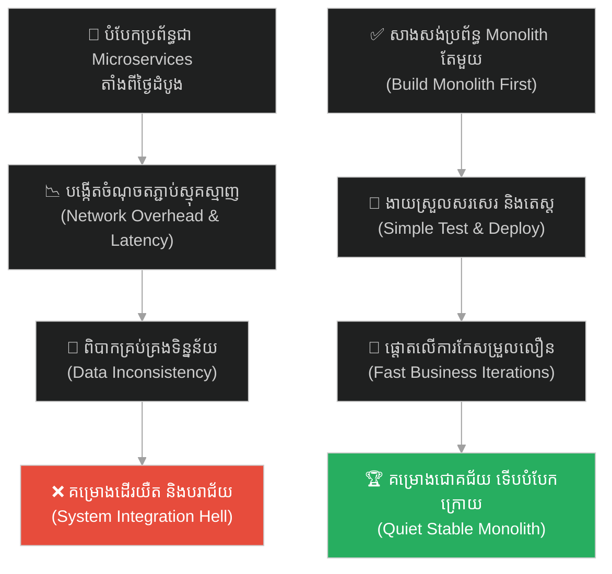
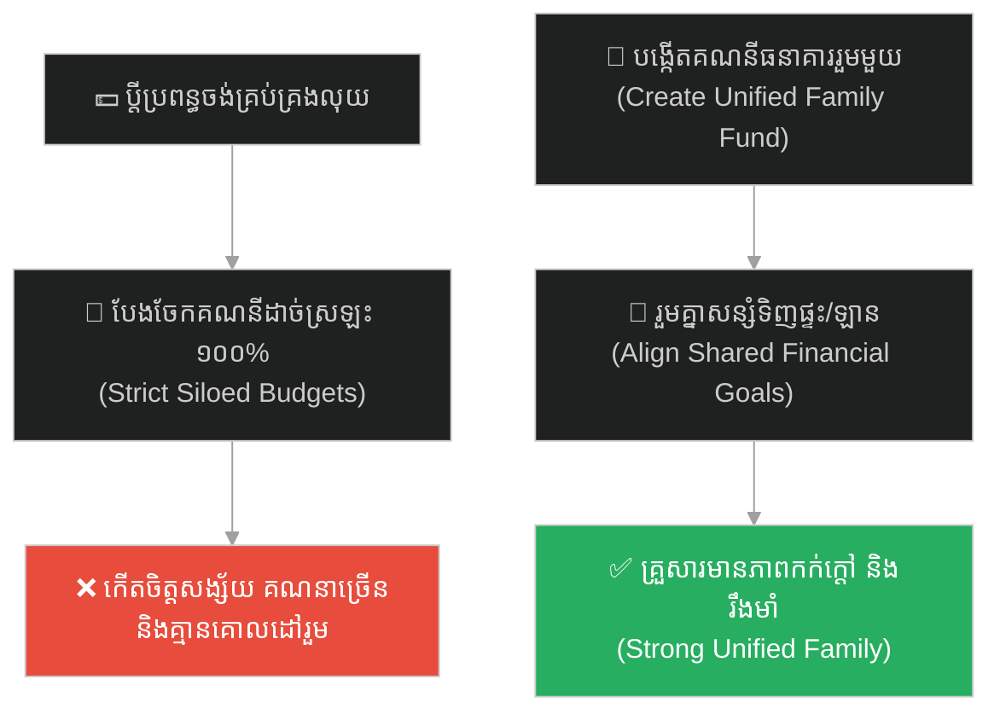
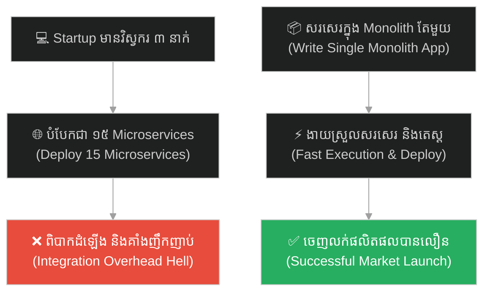
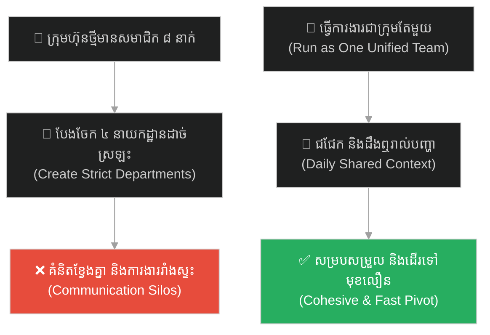
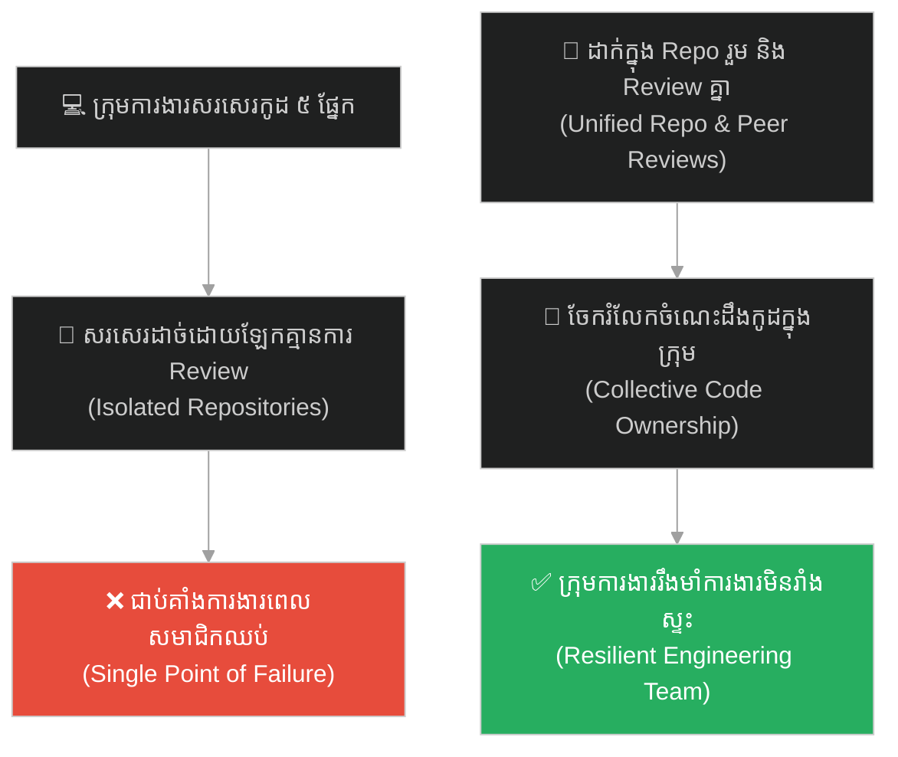
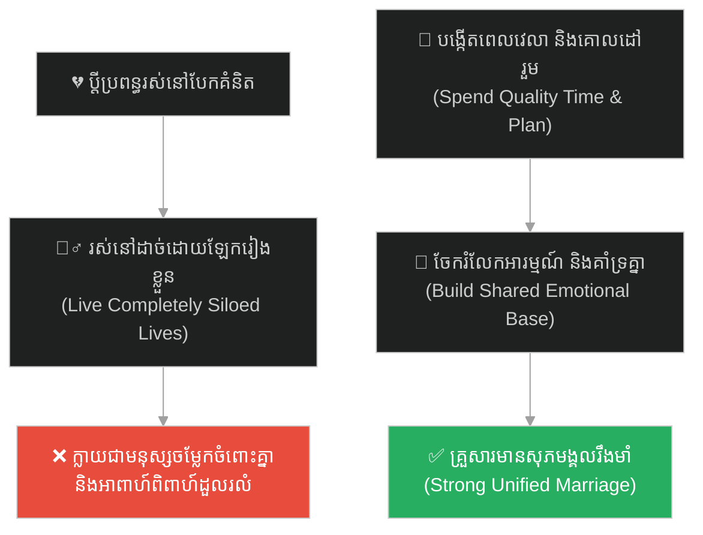
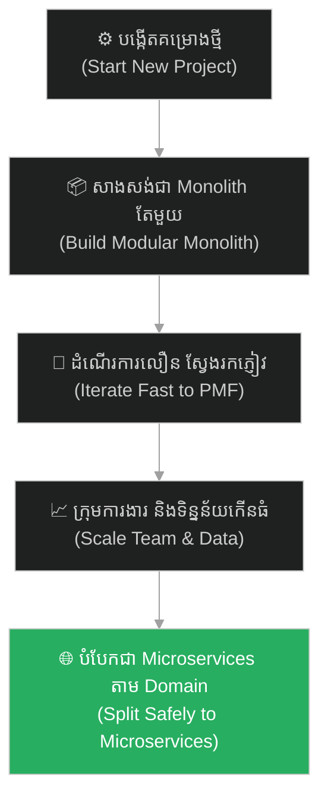

# Monolithic Architecture (ស្ថាបត្យកម្មម៉ូណូលីត)៖ អាប្រាហាម លីនខុន និងផ្ទះដែលបែកបាក់ ឬយុទ្ធសាស្ត្រ Monolith-First (Monolith First & Lincoln's House Divided)

**Author:** ichamrong  
**Date:** 2026-05-27  
**Tags:** #lincoln #civil-war #monolith #microservices #architecture #decoupling #parable  
**Category:** Concepts / Parables  
**Read Time:** ~15 min  

---

## 📌 មាតិកា (Table of Contents)
- [អន្ទាក់ផ្លូវចិត្ត (The Trap)](#0)
- [១. រឿងព្រេងប្រវត្តិសាស្ត្រ៖ អាប្រាហាម លីនខុន និងការសង្គ្រោះសហភាព (The Legend of Lincoln & preserving the Union)](#1)
  - [ផ្ទះដែលបែកបាក់ទាស់ទែង (A House Divided Against Itself)](#1-1)
- [២. បញ្ហា៖ គ្រោះថ្នាក់នៃការបំបែក Microservices មុនកាលកំណត់ (The Issue: The Danger of Premature Microservices)](#2)
- [៣. ឧទាហរណ៍ជាក់ស្តែងក្នុងពិភពពិត (Real World Examples)](#3)
  - [ឧទាហរណ៍ទី ១ — កម្រិតស្រាល (គ្រួសារ)៖ ការបំបែកចំណូលនិងទ្រព្យសម្បត្តិប្តីប្រពន្ធដាច់ស្រឡះ (Siloed Family Budgets)](#3-1)
  - [ឧទាហរណ៍ទី ២ — កម្រិតមធ្យម (បច្ចេកទេស)៖ គម្រោង Startup ដែលបំបែកជា ១៥ សេវាកម្មដំបូង (The 3-Dev 15-Microservices Trap)](#3-2)
  - [ឧទាហរណ៍ទី ៣ — កម្រិតមធ្យម (ធុរកិច្ច)៖ ការបង្កើតនាយកដ្ឋានដាច់ដោយឡែកមុនពេលមានទីផ្សារច្បាស់ (Premature Business Departmentalization)](#3-3)
  - [ឧទាហរណ៍ទី ៤ — កម្រិតមធ្យម (សង្គម/គ្រប់គ្រង)៖ ការបែងចែកអ្នកសរសេរកូដដោយគ្មានការត្រួតពិនិត្យរួមគ្នា (Siloed Code Repositories)](#3-4)
  - [ឧទាហរណ៍ទី ៥ — កម្រិតធ្ងន់ (ទំនាក់ទំនង)៖ ដៃគូជីវិតដែលរស់នៅដោយមានជីវិតដាច់ដោយឡែកពីគ្នា (Siloed Relationships)](#3-5)
- [៤. ដំណោះស្រាយទូទៅ៖ ការកសាង Monolith-First និងការបំបែកតែនៅពេលក្រុមការងាររីកធំ (The General Solution: Monolith-First Strategy & Domain-Driven Splits)](#4)
- [សេចក្តីសន្និដ្ឋាន (Conclusion)](#5)
- [ឯកសារយោង (References)](#6)
- [Related Posts](#7)

---

## អន្ទាក់ផ្លូវចិត្ត (The Trap)

តើអ្នកធ្លាប់ជួបស្ថានភាពដែលក្រុមការងារតូច ឬគម្រោងថ្មីរបស់អ្នក ចាប់ផ្តើមបំបែកប្រព័ន្ធការងារទៅជាផ្នែកតូចៗជាច្រើនដាច់ដោយឡែកពីគ្នា (ដូចជាការបំបែកជា Microservices ភ្លាមៗ) ព្រោះគិតថាវានឹងផ្តល់សេរីភាព ប៉ុន្តែចុងក្រោយវាបានបង្កើតជាបញ្ហាស្មុគស្មាញក្នុងការតភ្ជាប់ ភាពមិនចុះសម្រុងគ្នានៃទិន្នន័យ និងជម្លោះការងាររវាងក្រុមការងារដែរឬទេ?

នៅក្នុងស្ថាបត្យកម្មប្រព័ន្ធ និងការគ្រប់គ្រង៖
* **យើងងាយនឹងធ្លាក់ក្នុងល្បិច** គិតថា "ការបំបែកប្រព័ន្ធឱ្យកាន់តែតូចតាំងពីដំបូង នឹងធ្វើឱ្យប្រព័ន្ធកាន់តែងាយស្រួល Scale" (Premature Decoupling)។
* **យើងមើលរំលង** ភាពស្មុគស្មាញនៃការគ្រប់គ្រងបណ្តាញតភ្ជាប់ និងផលប៉ះពាល់លើល្បឿនអភិវឌ្ឍន៍ដំបូងរបស់ក្រុមការងារ។

ការបណ្តោយឱ្យការបំបែកប្រព័ន្ធមុនកាលកំណត់ បំផ្លាញឯកភាពជាតិ និងល្បឿនការងារ ហៅថា **អន្ទាក់ Premature Microservices (លម្អៀងការបំបែកមុនកាលកំណត់)**។

ដើម្បីយល់ដឹងពីអំណាចនៃការរក្សាប្រព័ន្ធ Monolith តែមួយ និងការចៀសវាងការបែកបាក់ នេះជាផែនទីបង្ហាញផ្លូវសម្រាប់អត្ថបទនេះ៖
1. **រឿងព្រេងប្រវត្តិសាស្ត្រ (The Historic Legend)** — សុន្ទរកថា "ផ្ទះដែលបែកបាក់ទាស់ទែង" របស់អាប្រាហាម លីនខុន និងយុទ្ធសាស្ត្រសង្គ្រោះសហភាព។
2. **បញ្ហា (The Issue)** — ភាពខុសគ្នារវាង Monolithic Architecture និង Microservices សម្រាប់គម្រោងថ្មីៗ។
3. **ឧទាហរណ៍ជាក់ស្តែងក្នុងពិភពពិត (Real World Examples)** — ពិនិត្យមើលគ្រោះថ្នាក់នៃការបំបែកមុនកាលកំណត់ក្នុងកម្រិតគ្រួសារ ព័ត៌មានវិទ្យា ធុរកិច្ច ការគ្រប់គ្រង និងទំនាក់ទំនង។
4. **ដំណោះស្រាយទូទៅ (The General Solution)** — ការអនុវត្ត Monolith-First, ការកសាង modular monolith និងការបំបែកតែនៅពេលសមស្រប។

---

## ១. រឿងព្រេងប្រវត្តិសាស្ត្រ៖ អាប្រាហាម លីនខុន និងការសង្គ្រោះសហភាព (The Legend of Lincoln & preserving the Union)

នៅពាក់កណ្តាលសតវត្សរ៍ទី ១៩ សហរដ្ឋអាមេរិក កំពុងស្ថិតនៅលើគែមជ្រោះនៃវិបត្តិជាតិដ៏ជ្រៅ និងគ្រោះថ្នាក់បំផុត។ រដ្ឋនៅភាគខាងត្បូង ដែលពឹងផ្អែកលើវិស័យកសិកម្មទាសភាព បានគំរាមកំហែងបំបែកខ្លួន (Secession) ចេញពីរដ្ឋភាគខាងជើង។ 

ពួកគេចង់ឱ្យសហរដ្ឋអាមេរិក បំបែកជាប្រទេសតូចៗដាច់ដោយឡែកពីគ្នា ដែលរដ្ឋនីមួយៗមានរដ្ឋធម្មនុញ្ញ និងច្បាប់គ្រប់គ្រងផ្ទាល់ខ្លួនទាំងស្រុង។ ពួកគេជឿថា ការបំបែកខ្លួននេះនឹងផ្តល់ "សេរីភាព" ក្នុងការចាត់ចែងសេដ្ឋកិច្ច និងចៀសវាងការជ្រៀតជ្រែកពីកណ្តាល។

---

### ផ្ទះដែលបែកបាក់ទាស់ទែង (A House Divided Against Itself)

នៅក្នុងកិច្ចប្រជុំយុទ្ធនាការនយោបាយដ៏ល្បីល្បាញ លោក **អាប្រាហាម លីនខុន (Abraham Lincoln)** បានថ្លែងសុន្ទរកថាប្រវត្តិសាស្ត្រដែលផ្លាស់ប្តូរផ្នត់គំនិតជាតិ៖  
> **«ផ្ទះដែលបែកបាក់ទាស់ទែងគ្នា មិនអាចឈររឹងមាំបានឡើយ (A house divided against itself cannot stand)។ ខ្ញុំជឿជាក់ថា រដ្ឋាភិបាលសហព័ន្ធមិនអាចបន្តស្ថិតស្ថេរជាអចិន្ត្រៃយ៍ ក្នុងស្ថានភាពពាក់កណ្តាលទាសភាព និងពាក់កណ្តាលសេរីភាពបែបនេះឡើយ។ ខ្ញុំមិនរំពឹងថាផ្ទះនេះនឹងរលាយបាត់បង់នោះទេ ប៉ុន្តែខ្ញុំរំពឹងថាវានឹងឈប់បែកបាក់ទាស់ទែងគ្នា។ វានឹងក្លាយទៅជារឿងតែមួយ ឬជារឿងមួយផ្សេងទៀតទាំងស្រុង។»**

លីនខុនយល់យ៉ាងច្បាស់ថា ប្រសិនបើសហរដ្ឋអាមេរិកត្រូវបានបំបែកជាបំណែកតូចៗ នោះប្រទេសជាតិនឹងចុះខ្សោយ លែងមានកម្លាំងការពារ ងាយនឹងកើតសង្គ្រាមព្រំដែនរវាងគ្នាឯង និងងាយរងការវាយលុកពីមហាអំណាចអឺរ៉ុប។

នៅពេលសង្គ្រាមស៊ីវិលអាមេរិកផ្ទុះឡើង លីនខុនមិនបានវាយប្រហារដើម្បីកម្ទេចភាគខាងត្បូងដោយកំហឹងឡើយ។ គោលដៅស្នូលតែមួយគត់របស់លោកគឺ **«ការសង្គ្រោះសហភាព (Preserve the Union)»** ឱ្យនៅតែជា "ប្រទេសតែមួយ (Monolith)" ដដែល។ លោកសុខចិត្តបង់ថ្លៃសង្គ្រាមដ៏មហាសាល ដើម្បីធានាថាដែនដីអាមេរិកមិនត្រូវបានបែកបាក់។ ទីបំផុត លោកបានទទួលជ័យជម្នះ ហើយការរក្សាបាននូវភាពឯកភាពជាតិដ៏រឹងមាំនេះ បានក្លាយជាគ្រឹះអនុញ្ញាតឱ្យសហរដ្ឋអាមេរិកក្លាយជាមហាអំណាចសេដ្ឋកិច្ច និងបច្ចេកវិទ្យាធំបំផុតនៅលើពិភពលោក។

---

## ២. បញ្ហា៖ គ្រោះថ្នាក់នៃការបំបែក Microservices មុនកាលកំណត់ (The Issue: The Danger of Premature Microservices)

នៅក្នុង Software Architecture រឿងរ៉ាវរបស់លីនខុន គឺជាការឆ្លុះបញ្ចាំងពីវិបត្តិនៃការសម្រេចចិត្តរវាង **Monolith (ស្ថាបត្យកម្មរួម) និង Microservices (ស្ថាបត្យកម្មបំបែក)**៖

* **លោភលន់ចង់បំបែក (The Microservice Hype)៖** វិស្វករជាច្រើនចង់បំបែកកម្មវិធីរបស់ខ្លួនទៅជាសេវាកម្មតូចៗរាប់សិប (Microservices) ចាប់តាំងពីថ្ងៃដំបូងនៃការបង្កើត Startup។ ពួកគេគិតថាវានឹងផ្តល់ "សេរីភាព" ដល់សមាជិកក្រុមក្នុងការសរសេរកូដដោយមិនរំខានគ្នា។
* **ឋាននរកនៃការតភ្ជាប់ (Distributed Systems Complexity)៖** ប្រសិនបើក្រុមការងាររបស់អ្នកនៅតូច (មានវិស្វករក្រោម ២០ នាក់) ការបំបែកជា Microservices នឹងនាំមកនូវភាពស្មុគស្មាញយ៉ាងធ្ងន់ធ្ងរ៖ បញ្ហាបណ្តាញយឺតយ៉ាវ (Network Latency), ទិន្នន័យលែងត្រូវគ្នា (Data Inconsistency/Distributed Transactions), និងការពិបាកធ្វើតេស្តទាំងស្រុង (Integration Testing Hell)។ ក្រុមការងារត្រូវចំណាយពេល ៨០% ទៅលើការគ្រប់គ្រងហេដ្ឋារចនាសម្ព័ន្ធ និងបណ្តាញ ជាជាងសរសេរមុខងារផលិតផល។
* **យុទ្ធសាស្ត្រ Monolith-First៖** សម្រាប់ Startup ឬគម្រោងថ្មី ចូររក្សាដែនដីកូដទាំងអស់នៅក្នុង **Monolith តែមួយ (Single Codebase)**។ វាងាយស្រួលសរសេរ ងាយស្រួលយល់ និងរត់លឿនបំផុត។ នៅពេលដែលផលិតផលមាន Product-Market Fit ហើយអាជីវកម្មរីកធំ រួមទាំងមានវិស្វកររាប់រយនាក់ ទើបយើងចាប់ផ្តើមបំបែកវាជាសេវាកម្មតូចៗតាមក្រោយដោយសន្សឹមៗ។

---

## ៣. ឧទាហរណ៍ជាក់ស្តែងក្នុងពិភពពិត

ដើម្បីយល់ដឹងឱ្យកាន់តែច្បាស់ នេះជាការវិភាគលើឧទាហរណ៍ ៥ កម្រិតផ្សេងគ្នា៖

---

### ឧទាហរណ៍ទី ១ — កម្រិតស្រាល (គ្រួសារ)៖ ការបំបែកចំណូលនិងទ្រព្យសម្បត្តិប្តីប្រពន្ធដាច់ស្រឡះ (Siloed Family Budgets)

**ស្ថានភាព៖** ប្តីប្រពន្ធរៀបការថ្មីថ្មោង សម្រេចចិត្តបែងចែកទ្រព្យសម្បត្តិ និងគណនីធនាគារដាច់ស្រឡះពីគ្នា ១០០% ដោយគ្មានគណនីរួមគ្រួសារឡើយ។

* **ជម្រើសខុស (Premature Split)៖** ភាគីម្ខាងៗបង់ថ្លៃការចាយវាយផ្ទាល់ខ្លួន ហើយរាល់ការទិញម្ហូប ថ្លៃទឹក ថ្លៃភ្លើង ត្រូវគណនាចែកគ្នាពាក់កណ្តាលជារៀងរាល់ខែយ៉ាងម៉ឺងម៉ាត់។
* **លទ្ធផល៖** កើតមានភាពហត់នឿយក្នុងការគណនាគណនេយ្យប្រចាំថ្ងៃ កើតមានចិត្តច្រណែន (ហេតុអ្វីបងទិញថ្លៃជាងខ្ញុំ?) លាក់បាំងព័ត៌មានហិរញ្ញវត្ថុពីគ្នា និងលែងមានគោលដៅសន្សំទិញទ្រព្យសម្បត្តិធំៗរួមគ្នា (ដូចជា ទិញផ្ទះ ឬឡាន) បង្កជាភាពរង្គោះរង្គើក្នុងគ្រួសារ។
* **ជម្រើសត្រូវ (Unified Budget - Monolith)៖** បង្កើតគណនីធនាគាររួមមួយសម្រាប់គ្រួសារ (Unified Budget) ដែលប្រាក់ចំណូលរបស់ទាំងពីរត្រូវចាក់ចូលរួមគ្នា ដើម្បីបង់ថ្លៃចំណាយស្នូល និងការសន្សំរួម។ ចែករំលែកសេរីភាពចាយវាយផ្ទាល់ខ្លួនក្នុងដែនកំណត់តូចមួយ។ គ្រួសារមានឯកភាព និងងាយស្រួលសម្រេចគោលដៅធំ។

---

### ឧទាហរណ៍ទី ២ — កម្រិតមធ្យម (បច្ចេកទេស)៖ គម្រោង Startup ដែលបំបែកជា ១៥ សេវាកម្មដំបូង (The 3-Dev 15-Microservices Trap)

**ស្ថានភាព៖** ក្រុមហ៊ុន Startup បង្កើតកម្មវិធីថ្មីមួយដែលមានវិស្វករតែ ៣ នាក់ប៉ុណ្ណោះ។

* **ជម្រើសខុស៖** បំបែក App ទៅជា Microservices ចំនួន ១៥ ផ្សេងគ្នា (Auth Service, Payment Service, Notification Service, Cart Service...) ដោយប្រើប្រាស់ Database ផ្សេងគ្នាចំនួន ១៥ តាំងពីដំបូង។
* **លទ្ធផល៖** វិស្វករទាំង ៣ ចំណាយពេល ៩០% នៃពេលវេលាការងារដើម្បីដោះស្រាយបញ្ហា Network API មិនដើរ, ធ្វើឱ្យទិន្នន័យលក់ និងទិន្នន័យស្តុកមិនស៊ីគ្នា, និងពិបាក Deploy កម្មវិធី។ ពួកគេមិនអាចបញ្ចេញមុខងារថ្មីបានឡើយ រហូតដល់ដាច់លុយក្រុមហ៊ុន។
* **ជម្រើសត្រូវ៖** សរសេរកូដទាំងអស់នៅក្នុង Monolith តែមួយ (Single Rails or Express App) ដែលប្រើ Database រួមតែមួយ។ វិស្វករទាំង ៣ អាចបង្កើត និងកែប្រែមេរៀនកូដបានយ៉ាងលឿន សន្សំសំចៃតម្លៃ Server និងបញ្ចេញផលិតផលលឿនបំផុត។

---

### ឧទាហរណ៍ទី ៣ — កម្រិតមធ្យម (ធុរកិច្ច)៖ ការបង្កើតនាយកដ្ឋានដាច់ដោយឡែកមុនពេលមានទីផ្សារច្បាស់ (Premature Business Departmentalization)

**ស្ថានភាព៖** ក្រុមហ៊ុនបង្កើតថ្មី (Seed Stage Startup) មានសមាជិកតែ ៨ នាក់ប៉ុណ្ណោះ។

* **ជម្រើសខុស៖** បង្កើតនាយកដ្ឋានដាច់ស្រឡះ៖ នាយកដ្ឋានទីផ្សារ នាយកដ្ឋានលក់ នាយកដ្ឋានអភិវឌ្ឍន៍ និងនាយកដ្ឋានគាំទ្រ ដោយបុគ្គលិកម្នាក់ៗធ្វើការតែនៅក្នុង دាយកដ្ឋានខ្លួនឯង និងមិនសហការគ្នា។
* **លទ្ធផល៖** កើតមានរបាំងទំនាក់ទំនង (Silos)។ បុគ្គលិកលក់សន្យាជាមួយភ្ញៀវនូវមុខងារដែលបុគ្គលិកបច្ចេកទេសមិនអាចធ្វើបាន ចំណែកបុគ្គលិកទីផ្សារផ្សព្វផ្សាយខុសពីផលិតផលពិត បង្កជាជម្លោះផ្ទៃក្នុង និងយឺតយ៉ាវ។
* **ជម្រើសត្រូវ៖** រក្សាទម្រង់ក្រុមការងាររួមតែមួយ (Unified Team) ដែលសមាជិកទាំងអស់អង្គុយធ្វើការជាមួយគ្នា ជជែកគ្នាប្រចាំថ្ងៃ និងដឹងឮរាល់ព័ត៌មានរបស់ក្រុមហ៊ុនទាំងស្រុង រហូតដល់ក្រុមហ៊ុនមានទីផ្សារច្បាស់លាស់ (Product-Market Fit) ទើបចាប់ផ្តើមបែងចែកនាយកដ្ឋាន។

---

### ឧទាហរណ៍ទី ៤ — កម្រិតមធ្យម (សង្គម/គ្រប់គ្រង)៖ ការបែងចែកអ្នកសរសេរកូដដោយគ្មានការត្រួតពិនិត្យរួមគ្នា (Siloed Code Repositories)

**ស្ថានភាព៖** ប្រធានក្រុមអភិវឌ្ឍន៍បែងចែកឱ្យ Developer ម្នាក់ៗគ្រប់គ្រង និងសរសេរកូដលើ module ផ្សេងៗគ្នាចំនួន ៥ ដាច់ដោយឡែកពីគ្នា ដោយគ្មានការធ្វើសវនកម្មកូដរួមគ្នា (No shared code review)។

* **ជម្រើសខុស៖** អនុញ្ញាតឱ្យម្នាក់ៗសរសេរតាមរចនាប័ទ្ម (Style) ផ្ទាល់ខ្លួន ដោយគិតថាវានឹងកាត់បន្ថយពេលវេលាឈ្លោះគ្នា និងមិនរំខានការងារគ្នា។
* **លទ្ធផល៖** នៅថ្ងៃរួមបញ្ចូលកូដ (Integration Day) កូដទាំងអស់មិនអាចដំណើរការជាមួយគ្នាបានឡើយ។ នៅពេល Developer ម្នាក់សុំច្បាប់ឈប់សម្រាក គ្មាននរណាម្នាក់ក្នុងក្រុមអាចជួសជុល ឬកែកូដរបស់គាត់បានឡើយ ធ្វើឱ្យគម្រោងត្រូវជាប់គាំង។
* **ជម្រើសត្រូវ (Unified Repository)៖** សរសេរកូដក្នុង Repository រួមតែមួយ និងតម្រូវឱ្យមានការត្រួតពិនិត្យកូដរវាងគ្នាទៅវិញទៅមក (Shared Code Review & Pair Programming)។ រាល់សមាជិកទាំងអស់ក្នុងក្រុមត្រូវតែយល់ដឹងពីកូដស្នូលទាំងមូល ដើម្បីអាចជំនួសគ្នាបានគ្រប់ពេលវេលា។

---

### ឧទាហរណ៍ទី ៥ — កម្រិតធ្ងន់ (ទំនាក់ទំនង)៖ ដៃគូជីវិតដែលរស់នៅដោយមានជីវិតដាច់ដោយឡែកពីគ្នា (Siloed Relationships)

**ស្ថានភាព៖** ប្តីប្រពន្ធរស់នៅក្រោមដំបូលផ្ទះតែមួយ ប៉ុន្តែម្នាក់ៗមានការងាររវល់ មិត្តភក្តិដាច់ដោយឡែក និងគម្រោងជីវិតផ្ទាល់ខ្លួនរៀងៗខ្លួន។

* **ជម្រើសខុស (Extreme Autonomy)៖** មិនដែលចំណាយពេលញ៉ាំអាហាររួមគ្នា មិនដែលពិភាក្សាពីបញ្ហាអនាគត និងមិនដឹងពីអារម្មណ៍ ឬទុក្ខលំបាករបស់ដៃគូជីវិតឡើយ ដោយគិតថា "ការមិនរំខានសេរីភាពគ្នា" គឺជាស្នេហាល្អ។
* **លទ្ធផល៖** ផ្ទះក្លាយជាគ្រាន់តែជា "សណ្ឋាគារសម្រាប់ដេក"។ ពួកគេក្លាយជាមនុស្សចម្លែកចំពោះគ្នាទៅវិញទៅមក ហើយនៅពេលមានបញ្ហាធំកើតឡើង ស្នេហាដួលរលំភ្លាមៗដោយសារខ្វះគ្រឹះទំនុកចិត្តរួមគ្នា។
* **ជម្រើសត្រូវ (Unified Life - Monolith)៖** បង្កើតពេលវេលារួមគ្នាជាប្រចាំ៖ ញ៉ាំអាហារល្ងាចជាមួយគ្នា ពិភាក្សា និងបង្កើតផែនការជីវិតរយៈពេល ៥ ឆ្នាំរួមគ្នា ព្រមទាំងគាំទ្រគ្នាក្នុងគ្រាលំបាក។ ការរក្សាភាពឯកភាពក្នុងជីវិតអាពាហ៍ពិពាហ៍ ជួយបង្កើតទំនុកចិត្តរឹងមាំមិនអាចបំបែកបាន។

---

## ៤. ដំណោះស្រាយទូទៅ៖ ការកសាង Monolith-First និងការបំបែកតែនៅពេលក្រុមការងាររីកធំ (The General Solution: Monolith-First Strategy & Domain-Driven Splits)

ដើម្បីការពារគម្រោង និងក្រុមហ៊ុនរបស់អ្នកពីការដួលរលំដោយសារការបំបែកប្រព័ន្ធមុនកាលកំណត់ ត្រូវអនុវត្តវិធីសាស្ត្រគន្លឹះទាំងនេះ៖

### ១. អនុវត្តយុទ្ធសាស្ត្រ Monolith-First
* ចាប់ផ្តើមគម្រោងថ្មីទាំងអស់នៅក្នុង Monolithic Architecture ជានិច្ច។ ផ្តោតទៅលើការបង្កើតផលិតផលឱ្យលឿន និងស្វែងរកអតិថិជនជាមុន។
* កុំបំបែកជា Microservices ដរាបណាប្រព័ន្ធរបស់អ្នកមិនទាន់ជួបបញ្ហា Scaling ពិតប្រាកដ ឬទំហំក្រុមការងារកើនឡើងលើសពី ៣០ នាក់។

### ២. រចនាប្រព័ន្ធជា Modular Monolith (បំបែកខាងក្នុងតែរួមក្រៅ)
* ទោះបីជាសរសេរកូដក្នុង codebase តែមួយ ត្រូវសរសេរកូដឱ្យមានសណ្តាប់ធ្នាប់ បំបែកមុខងារទៅតាម Domain (ដូចជា ដាក់កូដ Payment ក្នុង folder ផ្សេង ដាក់កូដ Auth ក្នុង folder ផ្សេង)។ ការណ៍នេះជួយឱ្យយើងងាយស្រួលបំបែកវាជា Microservices ទៅថ្ងៃក្រោយបានយ៉ាងរលូន ដោយមិនបាច់សរសេរឡើងវិញពីសូន្យ។

### ៣. វាស់ស្ទង់ថ្លៃចំណាយការិយាល័យធិបតេយ្យ (Cost of Complexity)
* មុននឹងបំបែកប្រព័ន្ធ ត្រូវសួរខ្លួនឯងថា៖ *«តើយើងមានសមត្ថភាពគ្រប់គ្រាន់ក្នុងការដំឡើងប្រព័ន្ធ Kubernetes, ប្រព័ន្ធ Monitoring ស្មុគស្មាញ និងប្រព័ន្ធ distributed tracing ដែរឬទេ?»* ប្រសិនបើមិនទាន់មានធនធានទេ ត្រូវរក្សាវាជា Monolith សិន។

---

## 🐇 ធ្លាក់ចូលក្នុងរន្ធទន្សាយយុទ្ធសាស្ត្រ (Enter the Strategic Rabbit Hole)

ដើម្បីស្វែងយល់បន្ថែមអំពីរបៀបដែលការកសាងប្រព័ន្ធការពារសន្តិសុខដ៏រឹងមាំនៅជុំវិញរបងក្រៅ (Firewall/Perimeter Defense) អាចនឹងក្លាយជាឥតប្រយោជន៍ទាំងស្រុង ប្រសិនបើយើងធ្វេសប្រហែសការការពារ និងការត្រួតពិនិត្យផ្ទៃក្នុង (Zero Trust) ព្រោះតែគិតថាសត្រូវមិនអាចចូលមកពីខាងក្នុងបាន សូមបន្តដំណើររុករករបស់អ្នក៖

* 🚀 **[ចាប់ផ្តើមដំណើររុករក (Start the Journey) ➔ The Maginot Line](./59-the-maginot-line.md)**

---

## សេចក្តីសន្និដ្ឋាន (Conclusion)

> **«ផ្ទះដែលបែកបាក់ទាស់ទែងគ្នា មិនអាចឈររឹងមាំបានឡើយ។ កូដដែលបែកបាក់ជាបំណែកតូចៗមុនកាលកំណត់ នឹងបំផ្លាញល្បឿន និងឯកភាពការងាររបស់ក្រុមការងារជានិច្ច។»**

ចូររក្សាបាននូវភាពសាមញ្ញ និងឯកភាពគ្នានៅក្នុងស្ថាបត្យកម្មប្រព័ន្ធ និងការគ្រប់គ្រងក្រុមការងាររបស់អ្នក មុននឹងសម្រេចចិត្តពង្រីក និងបំបែកប្រព័ន្ធ ដើម្បីទទួលបានជោគជ័យដ៏រឹងមាំយូរអង្វែង។

---

## ឯកសារយោង (References)

* **Abraham Lincoln** — *The House Divided Speech* (1858)។ សុន្ទរកថាប្រវត្តិសាស្ត្រយោងអំពីគ្រោះថ្នាក់នៃការបែកបាក់រដ្ឋ។
* **Sam Newman** — *Monolith to Microservices: Evolutionary Patterns to Deconstruct the Monolith* (2019)។ សៀវភៅណែនាំផ្លូវការអំពីការប្តូរប្រព័ន្ធពី monolith ទៅ microservices ដោយមានសុវត្ថិភាព។
* **Martin Fowler** — *MicroservicePrerequisites* (2015)។ អត្ថបទវិភាគអំពីលក្ខខណ្ឌតម្រូវដែលក្រុមហ៊ុនត្រូវមាន មុននឹងប្តូរទៅប្រើប្រព័ន្ធ microservices។

---

## Related Posts

* **[50 Abraham Lincoln: A House Divided and Monolithic Architecture](../articles/50-abraham-lincoln-and-the-monolith.md)** — អត្ថបទគោលបកស្រាយលម្អិតអំពីយុទ្ធសាស្ត្រ Monolith-First សម្រាប់ Startups។
* **[47 The Fall of Icarus: Premature Scaling](./47-the-fall-of-icarus.md)** — គ្រោះថ្នាក់នៃការបង្កើនទំហំប្រព័ន្ធមុនកាលកំណត់។
* **[57 Frankenstein and the Monster of Tech Debt](./57-the-monster-of-tech-debt.md)** — របៀបដែលការសរសេរកូដបិទប៉ះបង្កជាបំណុលបច្ចេកទេស។

---
*Last updated: 2026-05-27*

## Related

- [💡 Concepts README](../README.md)
- [📚 Main Repository README](../../../README.md)
- [Developer Habits](../../developer-habits/README.md)
- [Mental Health & Well-being](../../mental-health/README.md)
- [Management & SDLC](../../management/README.md)
