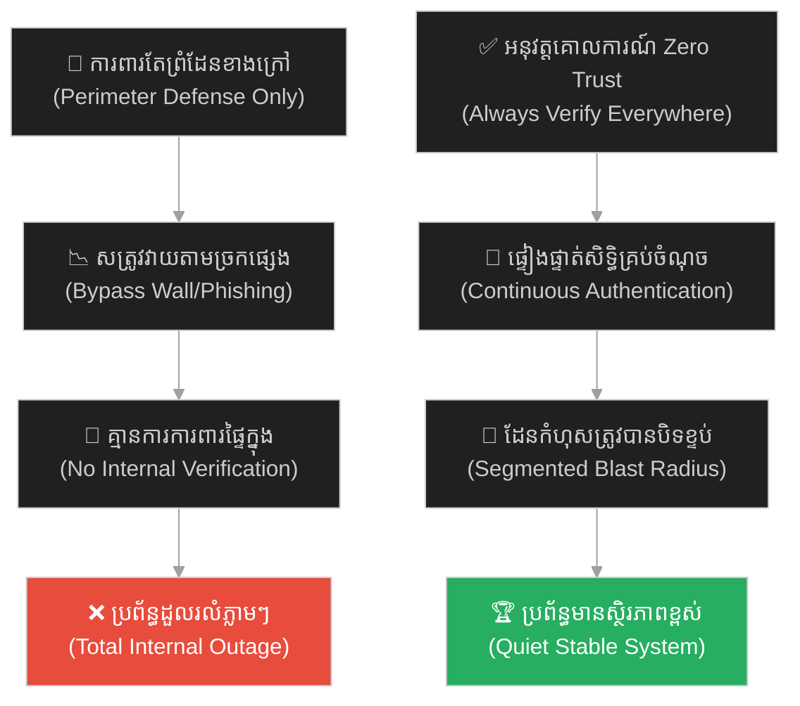
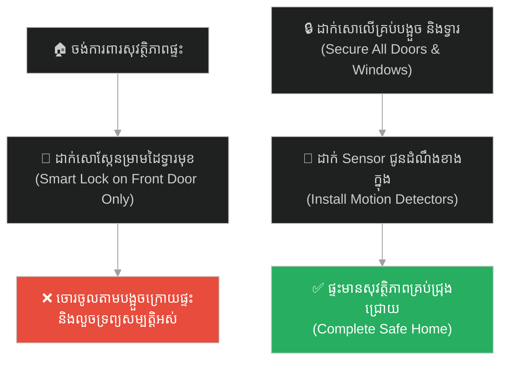
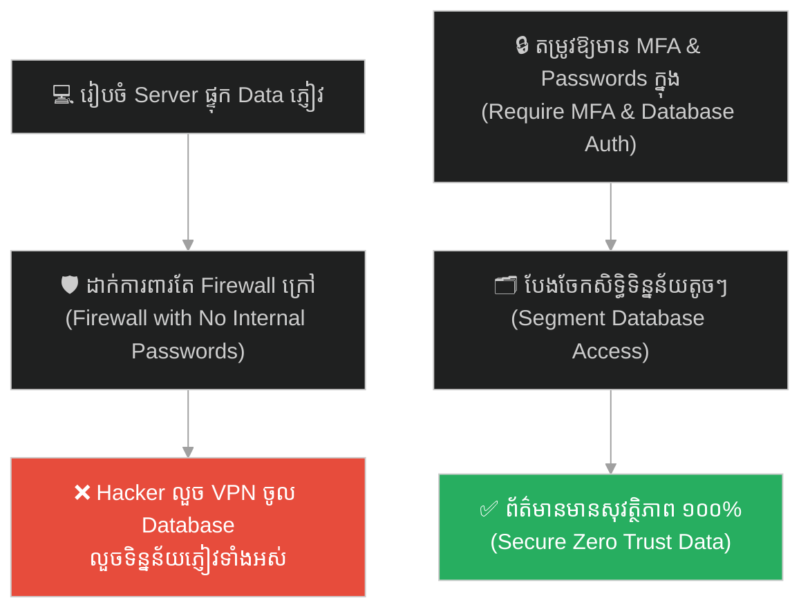
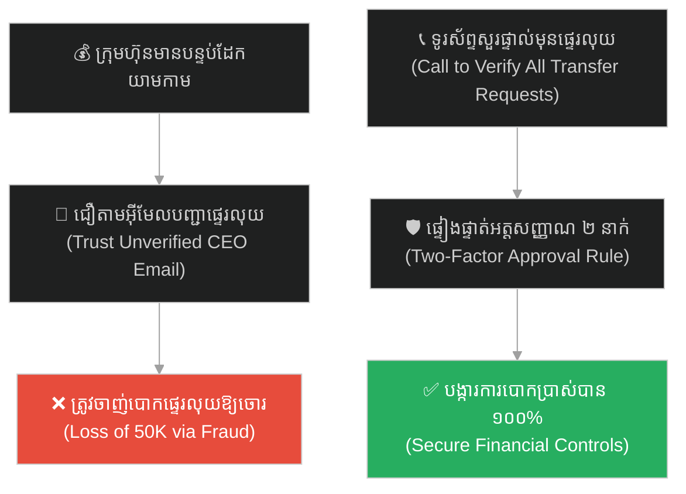
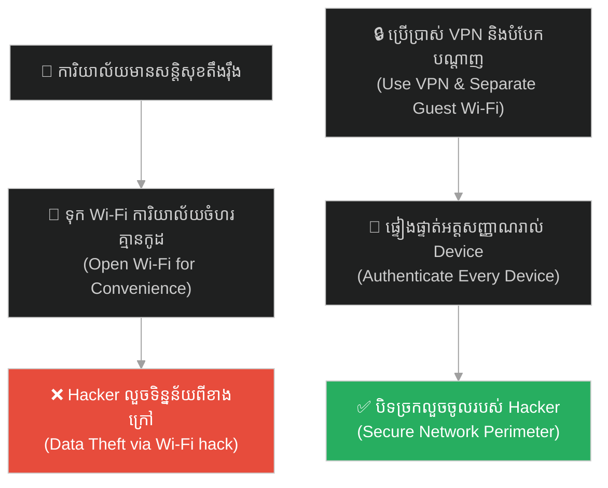
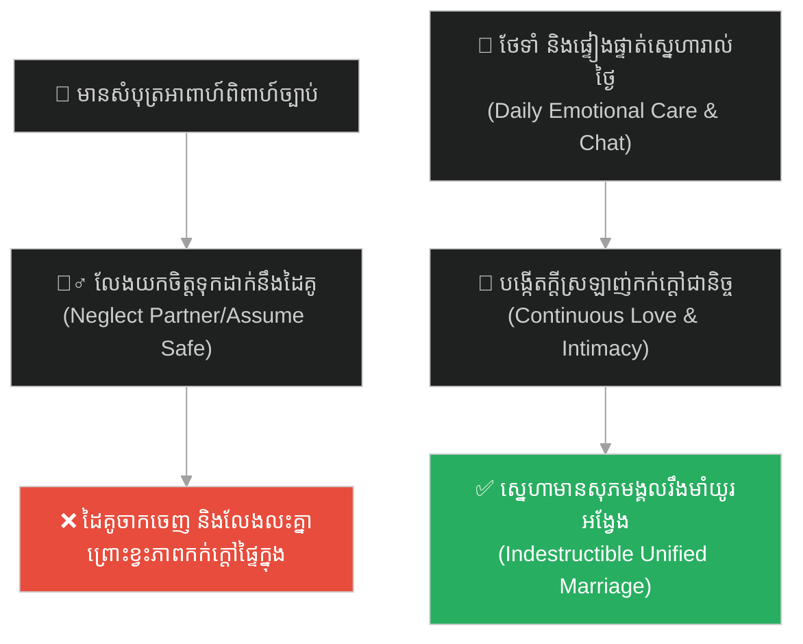
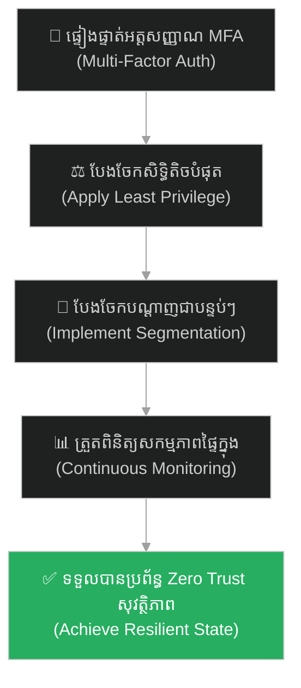

# Zero Trust Architecture (ស្ថាបត្យកម្មមិនទុកចិត្តទាល់តែសោះ)៖ ខ្សែការពារម៉ាហ្ស៊ីណូត និងការវាយលុកពីខាងក្នុង (Zero Trust Architecture & The Maginot Line)

**Author:** ichamrong  
**Date:** 2026-05-27  
**Tags:** #maginot-line #cybersecurity #zero-trust #firewall #credential-theft #internal-attacks #parable  
**Category:** Concepts / Parables  
**Read Time:** ~15 min  

---

## 📌 មាតិកា (Table of Contents)
- [អន្ទាក់ផ្លូវចិត្ត (The Trap)](#0)
- [១. រឿងព្រេងប្រវត្តិសាស្ត្រ៖ ខ្សែការពារម៉ាហ្ស៊ីណូត និងការដួលរលំលឿនបំផុតរបស់បារាំង (The Legend of the Maginot Line)](#1)
  - [ការដើរវាងជញ្ជាំង និងការវាយប្រហារពីក្រោយ (Bypassing the Wall)](#1-1)
- [២. បញ្ហា៖ គ្រោះថ្នាក់នៃការជឿជាក់លើរបងការពារ និងការខ្វះការផ្ទៀងផ្ទាត់ផ្ទៃក្នុង (The Issue: Perimeter Security Illusion & Zero Trust)](#2)
- [៣. ឧទាហរណ៍ជាក់ស្តែងក្នុងពិភពពិត (Real World Examples)](#3)
  - [ឧទាហរណ៍ទី ១ — កម្រិតស្រាល (គ្រួសារ)៖ ការបំពាក់សោទំនើបទ្វារមុខតែទុកបង្អួចក្រោយចំហរ (The Smart Lock Front Door Trap)](#3-1)
  - [ឧទាហរណ៍ទី ២ — កម្រិតមធ្យម (បច្ចេកទេស)៖ ប្រព័ន្ធការពារ Firewall ក្រៅតែគ្មានការផ្ទៀងផ្ទាត់ Database ក្នុង (The Unauthenticated Internal Database)](#3-2)
  - [ឧទាហរណ៍ទី ៣ — កម្រិតមធ្យម (ធុរកិច្ច)៖ ការការពារបន្ទប់ដេប៉ូសាច់ប្រាក់តែខ្វះការត្រួតពិនិត្យ Phishing (The Physical Vault vs. Cybersecurity Trap)](#3-3)
  - [ឧទាហរណ៍ទី ៤ — កម្រិតមធ្យម (សង្គម/គ្រប់គ្រង)៖ ការរឹតត្បិតច្រកចូលការិយាល័យតែទុកឱ្យ Wi-Fi គ្មានលេខកូដសម្ងាត់ (The Open Office Wi-Fi Trap)](#3-4)
  - [ឧទាហរណ៍ទី ៥ — កម្រិតធ្ងន់ (ទំនាក់ទំនង)៖ ការជឿជាក់លើលិខិតអាពាហ៍ពិពាហ៍តែធ្វេសប្រហែសការថែទាំប្រចាំថ្ងៃ (The Marriage Certificate Illusion)](#3-5)
- [៤. ដំណោះស្រាយទូទៅ៖ ការអនុវត្ត Never Trust, Always Verify និងការបែងចែកប្រព័ន្ធជាផ្នែកៗ (The General Solution: Identity Verification & Network Segmentation)](#4)
- [សេចក្តីសន្និដ្ឋាន (Conclusion)](#5)
- [ឯកសារយោង (References)](#6)
- [Related Posts](#7)

---

<a id="0"></a>
## អន្ទាក់ផ្លូវចិត្ត (The Trap)

តើអ្នកធ្លាប់ជួបស្ថានភាពដែលអ្នកបានបណ្តាក់ទុន ឬចំណាយថវិកាយ៉ាងច្រើនដើម្បីសាងសង់ "របាំងការពារខាងក្រៅ" ដ៏រឹងមាំ (ដូចជា ដាក់ firewall ថ្លៃៗ ឬសោទ្វារផ្ទះទំនើប) ប៉ុន្តែស្រាប់តែត្រូវរងការខូចខាតទាំងស្រុង ព្រោះតែសត្រូវអាចលួចចូលតាមច្រកបន្ទាប់បន្សំដែលខ្វះការត្រួតពិនិត្យ ឬលួចចូលមកដល់ខាងក្នុងដោយប្រើប្រាស់ឈ្មោះអ្នកដទៃដែរឬទេ?

នៅក្នុងសន្តិសុខបច្ចេកវិទ្យា និងការគ្រប់គ្រង៖
* **យើងងាយនឹងកើតមានភាពលម្អៀង** គិតថា "ឱ្យតែយើងមានរបាំងការពារជុំវិញខាងក្រៅដ៏រឹងមាំ នោះខាងក្នុងនឹងមានសុវត្ថិភាពខ្ពស់" (Perimeter Fallacy)។
* **យើងមើលរំលង** ការពិតដែលថា ខ្មាំងសត្រូវសម័យទំនើបមិនដែលវាយប្រហារចំរបាំងការពារនោះទេ ពួកគេតែងតែស្វែងរកវិធីដើរវាង (Bypass) ឬលួចអត្តសញ្ញាណបុគ្គលិកខាងក្នុង។

ការបណ្តោយឱ្យទំនុកចិត្តលើរបងការពារខាងក្រៅ បំផ្លាញយន្តការការពារផ្ទៃក្នុង ហៅថា **អន្ទាក់ Perimeter Security (លម្អៀងរបងការពារ)**។

ដើម្បីយល់ដឹងពីសារៈសំខាន់នៃការមិនទុកចិត្តនរណាម្នាក់ទាល់តែសោះ ទោះបីជានៅក្នុងផ្ទះក៏ដោយ នេះជាផែនទីបង្ហាញផ្លូវសម្រាប់អត្ថបទនេះ៖
1. **រឿងព្រេងប្រវត្តិសាស្ត្រ (The Historic Legend)** — ការសាងសង់ខ្សែការពារម៉ាហ្ស៊ីណូតរបស់បារាំង និងការដើរវាងកាត់តាមព្រៃបែលហ្ស៊ិករបស់កងទ័ពអាល្លឺម៉ង់។
2. **បញ្ហា (The Issue)** — គ្រោះថ្នាក់នៃប្រព័ន្ធការពារជុំវិញ (Perimeter Security) និងគោលការណ៍ Zero Trust (មិនទុកចិត្តជានិច្ច)។
3. **ឧទាហរណ៍ជាក់ស្តែងក្នុងពិភពពិត (Real World Examples)** — ពិនិត្យមើលគ្រោះថ្នាក់នេះក្នុងកម្រិតគ្រួសារ ព័ត៌មានវិទ្យា ធុរកិច្ច ការគ្រប់គ្រង និងទំនាក់ទំនង។
4. **ដំណោះស្រាយទូទៅ (The General Solution)** — ការអនុវត្តយន្តការផ្ទៀងផ្ទាត់អត្តសញ្ញាណ (MFA) និងការបែងចែកសិទ្ធិការងារឱ្យតូចបំផុត (Principle of Least Privilege)។



---

<a id="1"></a>
## ១. រឿងព្រេងប្រវត្តិសាស្ត្រ៖ ខ្សែការពារម៉ាហ្ស៊ីណូត និងការដួលរលំលឿនបំផុតរបស់បារាំង (The Legend of the Maginot Line)

ក្រោយបញ្ចប់សង្គ្រាមលោកលើកទី ១ ប្រទេសបារាំងចង់ធានាថា ទឹកដីរបស់ខ្លួននឹងលែងរងការឈ្លានពានពីប្រទេសអាល្លឺម៉ង់ជាលើកទីពីរ។ ពួកគេបានសម្រេចចិត្តចំណាយថវិកាជាតិដ៏មហាសាល សាងសង់បណ្តាញបន្ទាយយោធាការពារដ៏រឹងមាំបំផុតក្នុងប្រវត្តិសាស្ត្រមនុស្សជាតិ ហៅថា **ខ្សែការពារម៉ាហ្ស៊ីណូត (The Maginot Line)** នៅតាមបណ្តោយព្រំដែនបារាំង-អាល្លឺម៉ង់។

វាគឺជាខ្សែសង្វាក់នៃលេណដ្ឋានបេតុងក្រាស់ៗរាប់សិបម៉ែត្រនៅក្រោមដី ភ្ជាប់គ្នាដោយផ្លូវរថភ្លើងក្រោមដី មានប្រព័ន្ធខ្យល់អាកាសការពារជាតិពុល និងបំពាក់ដោយកាំភ្លើងធំទំនើបៗជាច្រើន ដែលគ្មានកងទ័ពណាមួយអាចវាយទម្លុះបានឡើយ។ បារាំងមានទំនុកចិត្តយ៉ាងខ្លាំងលើ "ជញ្ជាំងការពារ" នេះ រហូតដល់ពួកគេធ្វេសប្រហែសក្នុងការរៀបចំកងទ័ពការពារនៅផ្នែកខាងក្នុងប្រទេស។ ពួកគេគិតថា ឱ្យតែសត្រូវមិនអាចឆ្លងកាត់ជញ្ជាំងខាងក្រៅបាន នោះប្រទេសទាំងមូលនឹងមានសុវត្ថិភាព ១០០%។

---

<a id="1-1"></a>
### ការដើរវាងជញ្ជាំង និងការវាយប្រហារពីក្រោយ (Bypassing the Wall)

នៅពេលសង្គ្រាមលោកលើកទី ២ ផ្ទុះឡើងក្នុងឆ្នាំ ១៩៤០ កងទ័ពអាល្លឺម៉ង់របស់ហ៊ីត្លែរ មិនបានខ្ជះខ្ជាយគ្រាប់រំសេវ និងពេលវេលាទៅវាយលុកបន្ទាយម៉ាហ្ស៊ីណូតដែលរឹងមាំនោះឡើយ។ 

ផ្ទុយទៅវិញ ពួកគេគ្រាន់តែ "ដើរវាង (Bypass)" ខ្សែការពារនោះ ដោយការបើកកងទ័ពរថក្រោះល្បឿនលឿនកាត់តាមប្រទេសបែលហ្ស៊ិក និងវាយលុកចូលតាម **ព្រៃអាឌិន (Ardennes Forest)** ដែលជាតំបន់ភ្នំខ្ពស់ និងព្រៃក្រាស់ ដែលបារាំងធ្វេសប្រហែសមិនដាក់ខ្សែការពារ ព្រោះគិតថាគ្មានរថក្រោះសត្រូវណាអាចឆ្លងកាត់បាន។

```
[ អាល្លឺម៉ង់ ]  ========> ( បំបែកតាមព្រៃ Ardennes ) ========> [ ខាងក្នុងបារាំង ]
     |                                                               ^
     v                                                               |
[ ជញ្ជាំង Maginot Line ] ( បារាំងបែរកាំភ្លើងធំទៅព្រំដែន មិនអាចបង្វិលមកក្រោយបាន )
```

កងទ័ពអាល្លឺម៉ង់បានចូលមកដល់ខាងក្នុងប្រទេសបារាំងយ៉ាងលឿន និងងាយស្រួលបំផុត។ ដោយសារតែកាំភ្លើងធំទំនើបៗទាំងអស់របស់បារាំងនៅជញ្ជាំងម៉ាហ្ស៊ីណូត ត្រូវបានសាងសង់ភ្ជាប់នឹងបេតុងបែរមុខទៅរកព្រំដែនអាល្លឺម៉ង់ ពួកគេមិនអាចបង្វិលកាណុងកាំភ្លើងត្រឡប់មកក្រោយដើម្បីការពារខ្លួនបានឡើយ។ ជាងនេះទៅទៀត បារាំងមិនបានត្រៀមកងទ័ពបម្រុង ឬបង្កើតខ្សែការពារផ្សេងទៀតនៅខាងក្នុងឡើយ។ រដ្ឋធានីប៉ារីសបានដួលរលំ និងត្រូវកងទ័ពអាល្លឺម៉ង់កាន់កាប់ក្នុងរយៈពេលត្រឹមតែ ៦ សប្តាហ៍ប៉ុណ្ណោះ។ ជញ្ជាំងដែលថ្លៃជាងគេបំផុតនៅលើលោក ក្លាយជារបស់ឥតប្រយោជន៍ ព្រោះសត្រូវចូលមកដល់ក្នុងផ្ទះរួចទៅហើយ។

---

<a id="2"></a>
## ២. បញ្ហា៖ គ្រោះថ្នាក់នៃការជឿជាក់លើរបងការពារ និងការខ្វះការផ្ទៀងផ្ទាត់ផ្ទៃក្នុង (The Issue: Perimeter Security Illusion & Zero Trust)

នៅក្នុងសន្តិសុខបច្ចេកវិទ្យា (Cybersecurity) ខ្សែការពារម៉ាហ្ស៊ីណូត គឺជាតំណាងឱ្យការបរាជ័យនៃ **Perimeter Security (ប្រព័ន្ធការពារជុំវិញរបង)**៖

* **Firewall គឺជា Maginot Line៖** ក្រុមហ៊ុនភាគច្រើនចំណាយលុយរាប់ម៉ឺនដុល្លារដំឡើង Firewall ដ៏ខ្លាំងក្លាដើម្បីការពារបណ្តាញរបស់ខ្លួនពីខាងក្រៅ។ ប៉ុន្តែ Hacker មិនព្យាយាមបំបែក Firewall ឡើយ។ ពួកគេផ្ញើអ៊ីមែលបោកបញ្ឆោត (Phishing) ទៅកាន់បុគ្គលិកក្រុមហ៊ុន។ នៅពេលបុគ្គលិកម្នាក់ចុច Link មេរោគ Hacker នឹងលួចយកគណនីសម្ងាត់ (Credentials) រួចចូលមកដល់ "ខាងក្នុង" ប្រព័ន្ធ។ ពួកគេបានដើរវាង Firewall របស់អ្នក។
* **គ្រោះថ្នាក់នៃការទុកចិត្តផ្ទៃក្នុង (Internal Trust Illusion)៖** ប្រសិនបើប្រព័ន្ធរបស់អ្នកត្រូវបានកំណត់ថា "ឱ្យតែ User ចូលមកដល់ក្នុង Network ហើយ គឺអាចបើកមើលទិន្នន័យបានទាំងអស់ដោយសេរី" (No internal verification) នោះនៅពេលគណនីរបស់បុគ្គលិកម្នាក់ត្រូវបាន Hacker លួចចូល ពួកគេនឹងអាចលួចយក Database ក្រុមហ៊ុនទាំងមូលបានយ៉ាងងាយស្រួល ព្រោះគ្មានរបាំងការពារខាងក្នុង។
* **គោលការណ៍ Zero Trust (មិនទុកចិត្តទាល់តែសោះ)៖** Zero Trust គឺជាស្ថាបត្យកម្មដែលលុបចោលគំនិត "ទុកចិត្តផ្ទៃក្នុង" ចោល។ មិនថាអ្នកប្រើប្រាស់ជាបុគ្គលិកជាន់ខ្ពស់ អង្គុយក្នុងកៅអីការិយាល័យផ្ទាល់ ឬចូលមកពីខាងក្នុង Network ក៏ដោយ ប្រព័ន្ធត្រូវតែ **«ផ្ទៀងផ្ទាត់ជានិច្ច (Never Trust, Always Verify)»** រាល់ការចុចបើកទិន្នន័យ តាមរយៈការតម្រូវឱ្យមាន Multi-Factor Authentication (MFA) និងការបែងចែកសិទ្ធិការងារឱ្យតូចបំផុត។

---

<a id="3"></a>
## ៣. ឧទាហរណ៍ជាក់ស្តែងក្នុងពិភពពិត

ដើម្បីយល់ដឹងឱ្យកាន់តែច្បាស់ នេះជាការវិភាគលើឧទាហរណ៍ ៥ កម្រិតផ្សេងគ្នា៖

---

<a id="3-1"></a>
### ឧទាហរណ៍ទី ១ — កម្រិតស្រាល (គ្រួសារ)៖ ការបំពាក់សោទំនើបទ្វារមុខតែទុកបង្អួចក្រោយចំហរ (The Smart Lock Front Door Trap)

**ស្ថានភាព៖** ម្ចាស់ផ្ទះម្នាក់ចង់ការពារទ្រព្យសម្បត្តិក្នុងផ្ទះឱ្យមានសុវត្ថិភាពខ្ពស់បំផុតពីចោរលួច។

* **ជម្រើសខុស (Perimeter Security)៖** ចំណាយលុយជិត ១,០០០ ដុល្លារ ទិញសោទ្វារមុខស្កែនម្រាមដៃ (Smart Lock) និងបំពាក់ទ្វារដែកដ៏ក្រាស់នៅច្រកចូលខាងមុខផ្ទះ ប៉ុន្តែធ្វេសប្រហែសមិនដាក់សោបង្អួចក្រោយផ្ទះ ឬទ្វារផ្ទះបាយឡើយ ព្រោះគិតថាចោរមិនហ៊ានចូលតាមក្រោយផ្ទះដែលមានរបងខ្ពស់។
* **លទ្ធផល៖** ថ្ងៃមួយ ចោរបានលួចផ្លោះរបងក្រោយផ្ទះ រួចរុញបង្អួចផ្ទះបាយដែលចំហរចូលមកក្នុងផ្ទះយ៉ាងងាយស្រួល ហើយប្រមូលទ្រព្យសម្បត្តិទាំងអស់ចេញទៅក្រៅតាមទ្វារក្រោយ ដោយមិនបាច់បំបែកសោទ្វារមុខសូម្បីតែបន្តិច។
* **ជម្រើសត្រូវ (Zero Trust Defense)៖** អនុវត្តការការពារគ្រប់ច្រកចេញចូល (Secure All Points)។ ដាក់សោររឹងមាំលើគ្រប់ទ្វារ និងបង្អួចទាំងអស់ ព្រមទាំងដំឡើង Sensor ជូនដំណឹងចលនា (Motion Sensors) នៅក្នុងបន្ទប់ទទួលភ្ញៀវផ្ទាល់ ទោះបីជាចោរចូលតាមច្រកណាក៏ប្រព័ន្ធនឹងរោទ៍ភ្លាមៗ។



---

<a id="3-2"></a>
### ឧទាហរណ៍ទី ២ — កម្រិតមធ្យម (បច្ចេកទេស)៖ ប្រព័ន្ធការពារ Firewall ក្រៅតែគ្មានការផ្ទៀងផ្ទាត់ Database ក្នុង (The Unauthenticated Internal Database)

**ស្ថានភាព៖** ក្រុមហ៊ុនបច្ចេកវិទ្យាបង្កើត Server ផ្ទុកទិន្នន័យអតិថិជន។

* **ជម្រើសខុស៖** ដំឡើង Enterprise Firewall ដ៏ខ្លាំងក្លាដើម្បីការពារបណ្តាញរបស់ខ្លួនពីខាងក្រៅ ប៉ុន្តែនៅក្នុងបណ្តាញផ្ទៃក្នុង (Internal Network) Database មិនមានតម្រូវឱ្យវាយ Password ឡើយ (គិតថាឱ្យតែនៅក្នុងបណ្តាញផ្ទៃក្នុង គឺជាមនុស្សល្អទាំងអស់)។
* **លទ្ធផល៖** Hacker ម្នាក់បានផ្ញើ Phishing Email ទៅកាន់បុគ្គលិកផ្នែកទីផ្សារម្នាក់ លួចយកគណនី VPN របស់គាត់ រួចចូលមកដល់ក្នុងបណ្តាញផ្ទៃក្នុងធនាគារ។ ដោយសារ Database មិនត្រូវការ Password ផ្ទៀងផ្ទាត់ Hacker បានទាញយកទិន្នន័យភ្ញៀវទាំងអស់ចោលដោយសេរី។
* **ជម្រើសត្រូវ៖** អនុវត្ត Zero Trust ក្នុងកូដ។ Database ត្រូវតែទាមទារការផ្ទៀងផ្ទាត់ (Authentication) និងការអ៊ិនគ្រីប (Encryption) គ្រប់ជំហាន ទោះបីជាសំណើចូលមកពីកុំព្យូទ័រក្នុងក្រុមហ៊ុនក៏ដោយ។ គណនី VPN ត្រូវតម្រូវឱ្យមាន MFA ជានិច្ច។



---

<a id="3-3"></a>
### ឧទាហរណ៍ទី ៣ — កម្រិតមធ្យម (ធុរកិច្ច)៖ ការការពារបន្ទប់ដេប៉ូសាច់ប្រាក់តែខ្វះការត្រួតពិនិត្យ Phishing (The Physical Vault vs. Cybersecurity Trap)

**ស្ថានភាព៖** ក្រុមហ៊ុនហិរញ្ញវត្ថុមួយចំណាយថវិការាប់ម៉ឺនដុល្លារសាងសង់បន្ទប់ដេប៉ូសាច់ប្រាក់ដែកក្រាស់ៗ បំពាក់កាមេរ៉ាសុវត្ថិភាព និងជួលសន្តិសុខយាមកាម ២៤ ម៉ោង។

* **ជម្រើសខុស៖** គិតថាលុយមានសុវត្ថិភាពបំផុតហើយ តែធ្វេសប្រហែសការបណ្តុះបណ្តាលបុគ្គលិកគណនេយ្យអំពីសន្តិសុខអនឡាញ (Cybersecurity Training)។
* **លទ្ធផល៖** Hacker បានផ្ញើ Email ក្លែងខ្លួនជា CEO (CEO Fraud) ទៅកាន់បុគ្គលិកគណនេយ្យម្នាក់ ដោយសុំឱ្យផ្ទេរប្រាក់បន្ទាន់ចំនួន ៥០,០០០ ដុល្លារទៅគណនីបរទេសដើម្បីទិញទំនិញសម្ងាត់។ បុគ្គលិកគណនេយ្យជឿជាក់រួចចុចផ្ទេរប្រាក់ភ្លាមៗ ធ្វើឱ្យក្រុមហ៊ុនត្រូវបាត់បង់លុយយ៉ាងច្រើន ដោយចោរមិនបាច់ដើរជិតបន្ទប់ដែកឡើយ។
* **ជម្រើសត្រូវ៖** អនុវត្តគោលការណ៍ផ្ទៀងផ្ទាត់ជានិច្ច (Always Verify)។ រាល់ការផ្ទេរប្រាក់លើសពី ១,០០០ ដុល្លារ ត្រូវតែឆ្លងកាត់ការផ្ទៀងផ្ទាត់ផ្ទាល់មាត់ (ទូរស័ព្ទ ឬជួបផ្ទាល់) ជាមួយម្ចាស់គម្រោង ឬ CEO ជានិច្ច ទោះបីជាមានអ៊ីមែលបញ្ជាក៏ដោយ។



---

<a id="3-4"></a>
### ឧទាហរណ៍ទី ៤ — កម្រិតមធ្យម (សង្គម/គ្រប់គ្រង)៖ ការរឹតត្បិតច្រកចូលការិយាល័យតែទុកឱ្យ Wi-Fi គ្មានលេខកូដសម្ងាត់ (The Open Office Wi-Fi Trap)

**ស្ថានភាព៖** ក្រុមហ៊ុនសន្តិសុខមួយបំពាក់ទ្វារស្កែនកាត (ID Card Scanner) និងមានឆ្មាំយាមច្រកចូលការិយាល័យយ៉ាងតឹងរ៉ឹងបំផុត មិនអនុញ្ញាតឱ្យអ្នកក្រៅចូលឡើយ។

* **ជម្រើសខុស៖** ទុកឱ្យបណ្តាញ Wi-Fi របស់ការិយាល័យបើកចំហរដោយគ្មានលេខកូដសម្ងាត់ ឬប្រើប្រាស់លេខកូដសាមញ្ញ (ដូចជា `12345678`) ដើម្បីឱ្យបុគ្គលិក និងភ្ញៀវងាយស្រួលភ្ជាប់អ៊ីនធឺណិត។
* **លទ្ធផល៖** Hacker ម្នាក់បានមកអង្គុយនៅក្នុងឡាននៅក្បែរអាគារក្រុមហ៊ុន រួចភ្ជាប់បណ្តាញ Wi-Fi នោះយ៉ាងងាយស្រួល។ គេអាចលួចចូលទៅកាន់កុំព្យូទ័ររបស់វិស្វករ និងលួចយកកូដសម្ងាត់របស់ក្រុមហ៊ុនទាំងអស់ពីចម្ងាយ ដោយមិនបាច់ដើរកាត់ទ្វារស្កែនកាតឡើយ។
* **ជម្រើសត្រូវ៖** រចនាប្រព័ន្ធសុវត្ថិភាពបណ្តាញ (Zero Trust Network Access)។ បំបែកបណ្តាញ Wi-Fi ជាពីរ៖ មួយសម្រាប់ភ្ញៀវ (Guest Wi-Fi) ដែលគ្មានសិទ្ធិចូលប្រព័ន្ធការងារ និងមួយសម្រាប់តែបុគ្គលិក (Enterprise Wi-Fi) ដែលទាមទារការផ្ទៀងផ្ទាត់គណនីផ្ទាល់ខ្លួន និងការប្រើប្រាស់ VPN សុវត្ថិភាពជានិច្ច។



---

<a id="3-5"></a>
### ឧទាហរណ៍ទី ៥ — កម្រិតធ្ងន់ (ទំនាក់ទំនង)៖ ការជឿជាក់លើលិខិតអាពាហ៍ពិពាហ៍តែធ្វេសប្រហែសការថែទាំប្រចាំថ្ងៃ (The Marriage Certificate Illusion)

**ស្ថានភាព៖** បុរសម្នាក់ជឿជាក់ថាអាពាហ៍ពិពាហ៍របស់ខ្លួនមានសុវត្ថិភាព ១០០% ហើយ ព្រោះពួកគេបានចុះសំបុត្រអាពាហ៍ពិពាហ៍ច្បាប់ និងរៀបចំពិធីការយ៉ាងធំដឹងឮពេញនគរ (The Marriage Contract)។

* **ជម្រើសខុស (Perimeter Trust)៖** ធ្វេសប្រហែសការថែទាំទំនាក់ទំនងប្រចាំថ្ងៃ លែងនិយាយសរសើរ លែងយកចិត្តទុកដាក់នឹងអារម្មណ៍ដៃគូ និងបណ្តោយឱ្យភាពត្រជាក់ស្រពុនកើតឡើង ព្រោះគិតថា "មានសំបុត្រអាពាហ៍ពិពាហ៍ហើយ គេមិនអាចចាកចេញពីយើងបានទេ"។
* **លទ្ធផល៖** ភាពត្រជាក់ស្រពុនបានបើកឱកាសឱ្យមានអ្នកទីបីចូលមកសម្រាលទុក្ខប្រពន្ធ រហូតដល់នាងសម្រេចចិត្តចាកចេញពីផ្ទះ និងសុំលែងលះ ធ្វើឱ្យសំបុត្រអាពាហ៍ពិពាហ៍ច្បាប់លែងមានតម្លៃ។
* **ជម្រើសត្រូវ (Continuous Verification)៖** ដឹងច្បាស់ថាសំបុត្រអាពាហ៍ពិពាហ៍គ្រាន់តែជាក្រដាសមួយសន្លឹក។ សុវត្ថិភាពពិតប្រាកដក្នុងស្នេហា គឺត្រូវសាងសង់តាមរយៈការផ្ទៀងផ្ទាត់អារម្មណ៍គ្នាប្រចាំថ្ងៃ ការយកចិត្តទុកដាក់ និងការនិយាយជជែកគ្នារាល់ល្ងាច ដើម្បីកុំឱ្យមានចន្លោះប្រហោងសម្រាប់អ្នកទីបីចូលបំបែកបាន។



---

<a id="4"></a>
## ៤. ដំណោះស្រាយទូទៅ៖ ការអនុវត្ត Never Trust, Always Verify និងការបែងចែកប្រព័ន្ធជាផ្នែកៗ (The General Solution: Identity Verification & Network Segmentation)

ដើម្បីការពារប្រព័ន្ធការងារ និងជីវិតរបស់អ្នកពីការវាយប្រហារដែលដើរវាងរបាំងការពារ ត្រូវអនុវត្តវិធីសាស្ត្រគន្លឹះទាំងនេះ៖

### ១. អនុវត្តគោលការណ៍ Never Trust, Always Verify (មិនទុកចិត្តជានិច្ច)
* រាល់សំណើ ឬសកម្មភាពណាដែលចូលមកកាន់ប្រព័ន្ធ (ទោះជាមកពីកុំព្យូទ័រក្នុងក្រុមហ៊ុន ឬអ៊ីមែលរបស់ប្រធានធំ) ត្រូវតែឆ្លងកាត់ការបញ្ជាក់អត្តសញ្ញាណ (MFA/Passwords) ជានិច្ច មុននឹងអនុញ្ញាតឱ្យដំណើរការ។

### ២. បែងចែកប្រព័ន្ធជាផ្នែកៗ (Network Segmentation / Microsegmentation)
* កុំរៀបចំប្រព័ន្ធឱ្យធ្លាយដល់គ្នាទាំងអស់ (Flat network)។ ត្រូវបែងចែកប្រព័ន្ធការងារ ឬគម្រោងជាផ្នែកតូចៗដាច់ដោយឡែកពីគ្នា (ដូចជា បន្ទប់នីមួយៗមានទ្វារចាក់សោរផ្ទាល់ខ្លួន)។ ប្រសិនបើ Hacker អាចលួចចូលបន្ទប់ទី ១ បាន ពួកគេនៅតែមិនអាចចូលទៅបន្ទប់សំខាន់ៗដទៃទៀតបានឡើយ (Contain the blast radius)។

### ៣. អនុវត្តគោលការណ៍ផ្តល់សិទ្ធិតិចបំផុត (Principle of Least Privilege)
* បុគ្គលិក ឬ User នីមួយៗត្រូវតែទទួលបានសិទ្ធិ (Access Rights) ត្រឹមតែកម្រិតណាដែលចាំបាច់បំផុតដើម្បីបំពេញការងាររបស់ពួកគេប៉ុណ្ណោះ។ វិស្វករមិនចាំបាច់មានសិទ្ធិចូលមើលទិន្នន័យហិរញ្ញវត្ថុរបស់ក្រុមហ៊ុនទេ ហើយបុគ្គលិកគណនេយ្យក៏មិនត្រូវមានសិទ្ធិចូលកែកូដនៅលើ Server ដែរ។



---

## 🐇 ធ្លាក់ចូលក្នុងរន្ធទន្សាយយុទ្ធសាស្ត្រ (Enter the Strategic Rabbit Hole)

ដើម្បីស្វែងយល់បន្ថែមអំពីរបៀបដែលការកសាង និងអភិវឌ្ឍន៍ផលិតផល ឬប្រព័ន្ធការងារដោយផ្តោតទៅលើការបង្កើតគំរូសាកល្បងតូចៗឱ្យបានលឿន និងដាក់ឱ្យប្រើប្រាស់ជាក់ស្តែងដើម្បីតេស្តទីផ្សារ (Minimum Viable Product - MVP) ជំនួសឱ្យការចំណាយពេលជាច្រើនឆ្នាំដើម្បីសាងសង់យានធំតែម្តងដែលងាយនឹងដួលរលំ សូមបន្តដំណើររុករករបស់អ្នក៖

* 🚀 **[ចាប់ផ្តើមដំណើររុករក (Start the Journey) ➔ The Wright Brothers and the First Flight](./60-the-first-flight.md)**

---

<a id="5"></a>
## សេចក្តីសន្និដ្ឋាន (Conclusion)

> **«របងការពារខាងក្រៅដ៏ខ្ពស់បំផុត នឹងក្លាយជាគ្មានតម្លៃ ប្រសិនបើយើងបើកទ្វារឱ្យសត្រូវដើរចូលពីខាងក្រោយដោយសេរី។ សន្តិសុខពិតប្រាកដ គឺសន្តិសុខដែលមិនទុកចិត្តអ្នកណាទាំងអស់ សូម្បីតែបុគ្គលិករបស់ខ្លួនឯង។»**

ចូររចនាប្រព័ន្ធការងារ អាជីវកម្ម និងជីវិតរបស់អ្នកដោយប្រើប្រាស់គោលការណ៍ Zero Trust ផ្ទៀងផ្ទាត់ជានិច្ច និងបិទច្រកលេចធ្លាយផ្ទៃក្នុង ដើម្បីទទួលបានសុវត្ថិភាព និងស្ថិរភាពយូរអង្វែង។

---

<a id="6"></a>
## ឯកសារយោង (References)

* **John Kindervag** — *Build Security Into Your Network's DNA: The Zero Trust Network Architecture* (2010)។ របាយការណ៍ស្រាវជ្រាវរបស់ Forrester ដែលបានណែនាំពាក្យ Zero Trust ជាលើកដំបូង។
* **Alastair Horne** — *To Lose a Battle: France 1940* (1969)។ កំណត់ត្រាប្រវត្តិសាស្ត្រលម្អិតអំពីយុទ្ធសាស្ត្រយោធា និងការដួលរលំនៃខ្សែការពារម៉ាហ្ស៊ីណូត។
* **Evan Gilman and Doug Barth** — *Zero Trust Networks: Building Secure Systems in Untrusted Networks* (2017)។ សៀវភៅណែនាំបច្ចេកទេសលម្អិតអំពីការរចនា និងអនុវត្ត Zero Trust ក្នុងវិស្វកម្មប្រព័ន្ធ។

---

<a id="7"></a>
## Related Posts

* **[51 The Maginot Line: Zero Trust Architecture](../articles/51-the-maginot-line-and-zero-trust.md)** — អត្ថបទគោលបកស្រាយលម្អិតអំពីស្ថាបត្យកម្មដែលមិនទុកចិត្តអ្នកណាទាំងអស់សូម្បីតែបុគ្គលិកខ្លួនឯង។
* **[32 The Trojan Horse and Cybersecurity](./32-the-trojan-horse.md)** — ការការពារខ្លួនពីការនាំយកគ្រោះថ្នាក់ចូលក្នុងផ្ទះ។
* **[58 Abraham Lincoln and A House Divided: Monolith Architecture](./58-a-house-divided.md)** — សារៈសំខាន់នៃការរក្សាបាននូវស្ថិរភាព និងឯកភាពនៃប្រព័ន្ធការងារ។

---
*Last updated: 2026-05-27*

## Related

- [💡 Concepts README](../README.md)
- [📚 Main Repository README](../../../README.md)
- [Developer Habits](../../developer-habits/README.md)
- [Mental Health & Well-being](../../mental-health/README.md)
- [Management & SDLC](../../management/README.md)
