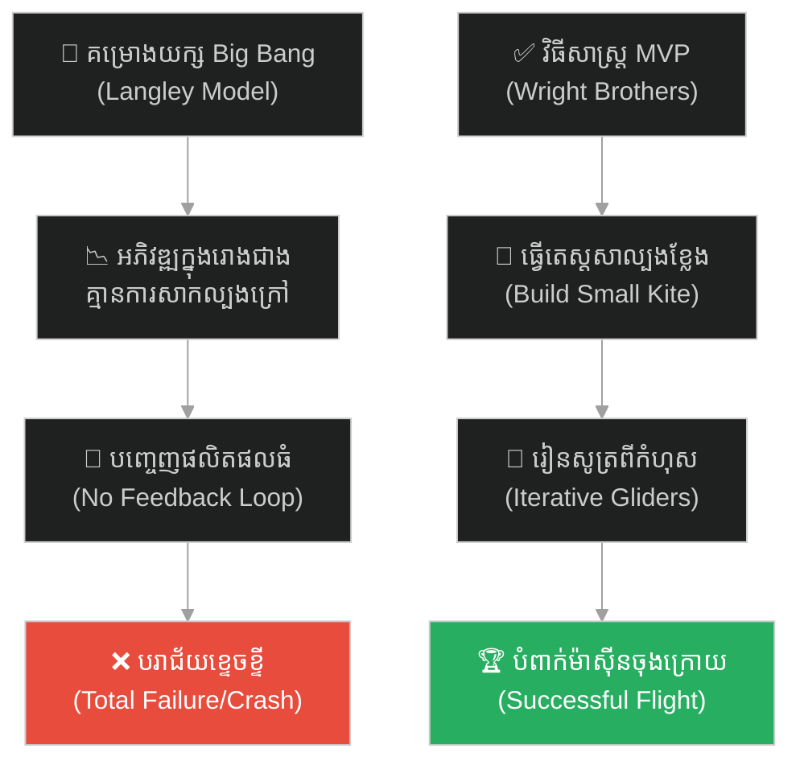
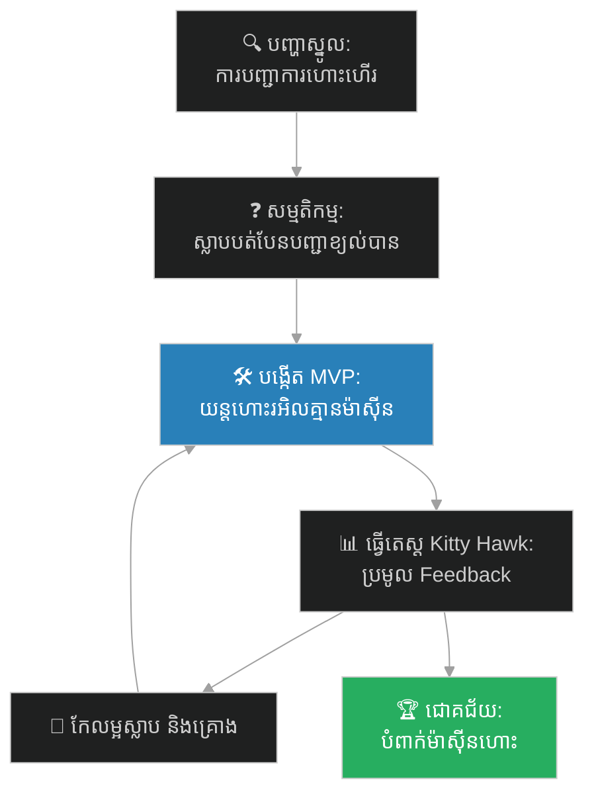
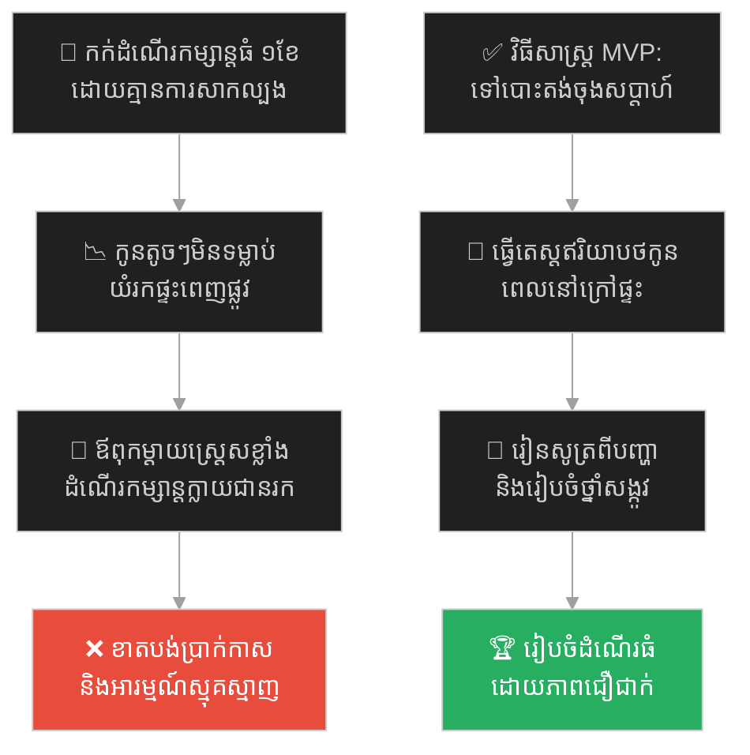
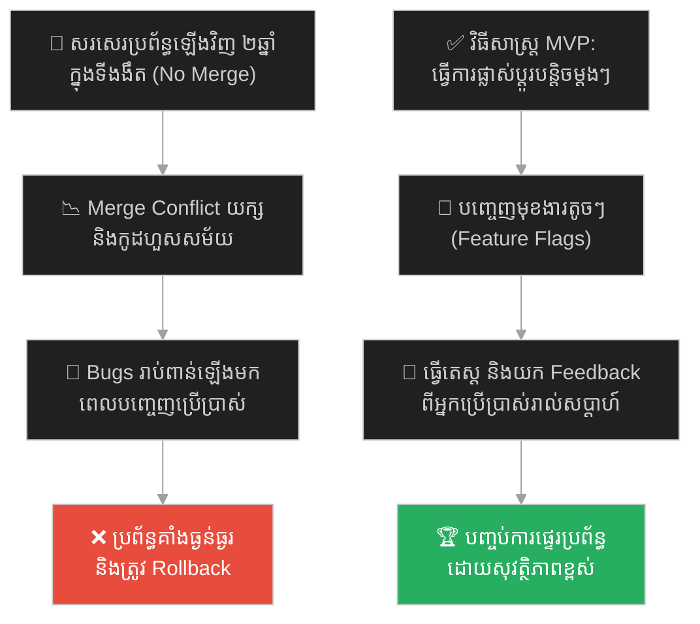
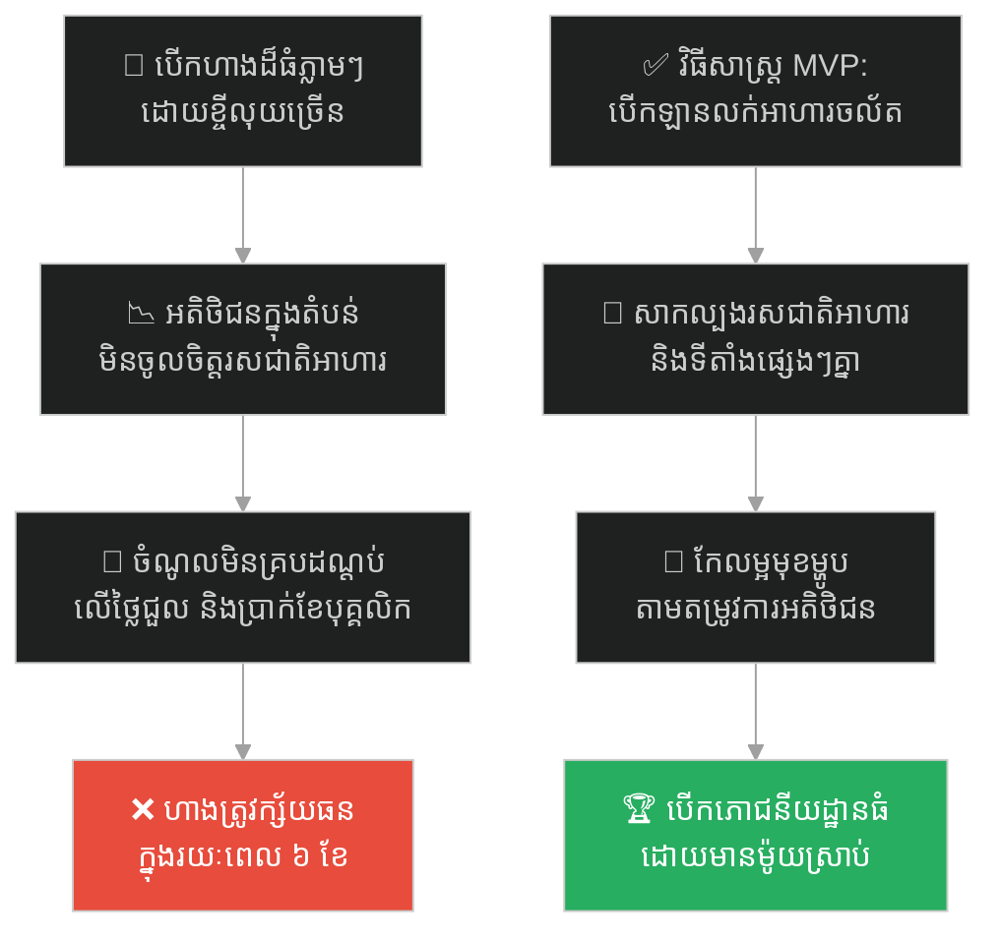
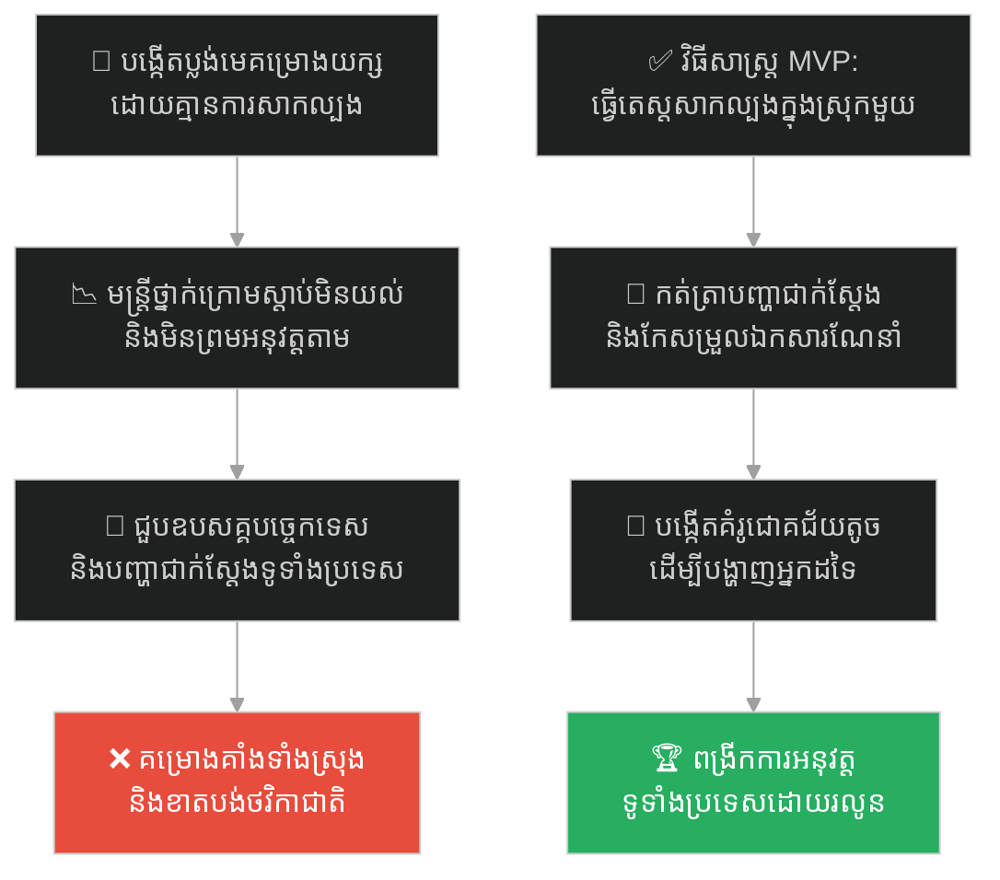
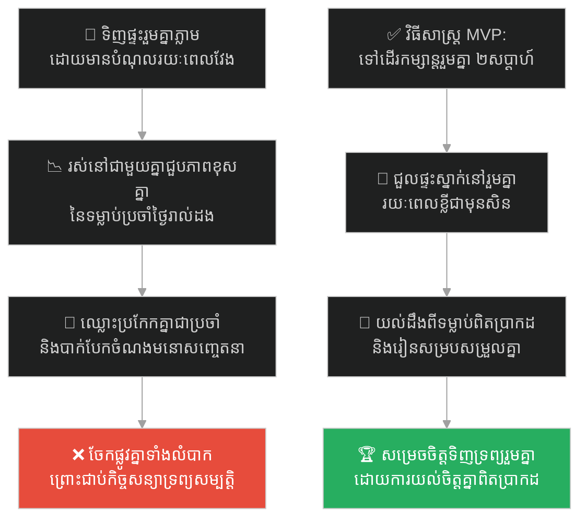
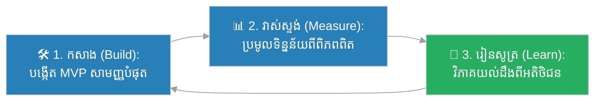

# Minimum Viable Product (ផលិតផលសាកល្បងតូចបំផុត)៖ បងប្អូនត្រកូលរ៉ាយ និងការហោះហើរលើកដំបូង (Minimum Viable Product & The First Flight)

**Author:** ichamrong  
**Date:** 2026-05-27  
**Tags:** #mvp #agile #wright-brothers #iteration #product-development #risk-mitigation #parable  
**Category:** Concepts / Parables  
**Read Time:** ~15 min  

---

## 📌 មាតិកា (Table of Contents)
- [អន្ទាក់ផ្លូវចិត្ត (The Trap)](#0)
- [១. រឿងព្រេងប្រវត្តិសាស្ត្រ៖ គម្រោងយក្សរបស់ Samuel Langley និងការហោះហើររបស់ត្រកូលរ៉ាយ (The Legend of the First Flight)](#1)
  - [វិធីសាស្ត្រខ្នាតតូចរបស់ត្រកូលរ៉ាយ (The Wright Brothers' Iteration)](#1-1)
- [២. បញ្ហា៖ ការសាងសង់ប្រព័ន្ធធំក្នុងពេលតែមួយ និងអត្ថប្រយោជន៍នៃ MVP (The Issue: Big Bang Release vs. MVP)](#2)
- [៣. ឧទាហរណ៍ជាក់ស្តែងក្នុងពិភពពិត (Real World Examples)](#3)
  - [ឧទាហរណ៍ទី ១ — កម្រិតស្រាល (គ្រួសារ)៖ ការរៀបចំដំណើរកម្សាន្តធំដោយគ្មានការសាកល្បងតូច (The Grand Family Vacation Trap)](#3-1)
  - [ឧទាហរណ៍ទី ២ — កម្រិតមធ្យម (បច្ចេកទេស)៖ ការអភិវឌ្ឍន៍មុខងាររាប់ឆ្នាំដោយគ្មានការបញ្ចេញឱ្យប្រើប្រាស់ (The Two-Year Coding in the Dark)](#3-2)
  - [ឧទាហរណ៍ទី ៣ — កម្រិតមធ្យម (ធុរកិច្ច)៖ ការបើកភោជនីយដ្ឋានធំដោយគ្មានការសាកល្បងទីផ្សារ (The Grand Restaurant Opening Failure)](#3-3)
  - [ឧទាហរណ៍ទី ៤ — កម្រិតមធ្យម (សង្គម/គ្រប់គ្រង)៖ ការបង្កើតប្លង់គម្រោងយក្សមុនពេលធ្វើតេស្តសាកល្បង (The Massive Blueprint without Pilot Run)](#3-4)
  - [ឧទាហរណ៍ទី ៥ — កម្រិតធ្ងន់ (ទំនាក់ទំនង)៖ ការសម្រេចចិត្តរស់នៅជាមួយគ្នាមុនពេលសាកល្បងភាពចុះសម្រុងគ្នា (The Premature Move-In Dilemma)](#3-5)
- [៤. ដំណោះស្រាយទូទៅ៖ ការកសាងយន្តការសាកល្បង និងការទទួលបានមតិកែលម្អរហ័ស (The General Solution: Build-Measure-Learn Feedback Loop)](#4)
- [សេចក្តីសន្និដ្ឋាន (Conclusion)](#5)
- [ឯកសារយោង (References)](#6)
- [Related Posts](#7)

---

## អន្ទាក់ផ្លូវចិត្ត (The Trap)

តើអ្នកធ្លាប់ចំណាយពេល និងថវិការាប់សិបម៉ឺនដុល្លារ ដើម្បីសាងសង់អ្វីមួយយ៉ាងល្អឥតខ្ចោះ តែចុងក្រោយស្រាប់តែរកឃើញថា គ្មាននរណាម្នាក់ចង់បាន ឬប្រើប្រាស់វាសូម្បីតែម្នាក់ដែរឬទេ?

នៅក្នុងការអភិវឌ្ឍន៍ផលិតផល និងការគ្រប់គ្រងគម្រោង៖
* **យើងងាយនឹងធ្លាក់ក្នុងអន្ទាក់** នៃការគិតថា "យើងដឹងច្បាស់ពីអ្វីដែលអតិថិជនចង់បាន" ហើយចំណាយពេលរាប់ឆ្នាំដើម្បីកសាងវាឱ្យល្អឥតខ្ចោះក្នុងទីងងឹត (Big Bang Fallacy)។
* **យើងមើលរំលង** សារៈសំខាន់នៃការធ្វើតេស្តសម្មតិកម្មតូចៗ និងការរៀនសូត្រពីកំហុសជាក់ស្តែងឱ្យបានលឿនបំផុត ដើម្បីចៀសវាងការខាតបង់ធនធានទាំងស្រុង។

ការបណ្តោយឱ្យគំនិតចង់បានភាពល្អឥតខ្ចោះនៃប្រព័ន្ធធំ បំផ្លាញឱកាសនៃការរៀនសូត្រពីដំណាក់កាលដំបូង ហៅថា **អន្ទាក់ Big Bang Release (អន្ទាក់បញ្ចេញផលិតផលក្នុងពេលតែមួយ)**។

ដើម្បីយល់ដឹងពីរបៀបដែលបងប្អូនត្រកូលរ៉ាយ យកឈ្នះគម្រោងយក្សរបស់រដ្ឋាភិបាលអាមេរិក នេះជាផែនទីបង្ហាញផ្លូវសម្រាប់អត្ថបទនេះ៖
1. **រឿងព្រេងប្រវត្តិសាស្ត្រ (The Historic Legend)** — ការប្រកួតប្រជែងរវាង Samuel Langley និង Orville & Wilbur Wright។
2. **បញ្ហា (The Issue)** — ផលប៉ះពាល់នៃការអភិវឌ្ឍន៍បែប Waterfall និងគោលការណ៍ MVP។
3. **ឧទាហរណ៍ជាក់ស្តែងក្នុងពិភពពិត (Real World Examples)** — ពិនិត្យមើលអន្ទាក់នេះក្នុងកម្រិតគ្រួសារ បច្ចេកវិទ្យា ធុរកិច្ច ការគ្រប់គ្រង និងទំនាក់ទំនង។
4. **ដំណោះស្រាយទូទៅ (The General Solution)** — ការអនុវត្តយន្តការ Build-Measure-Learn Loop និងការបង្កើតមុខងារស្នូលតូចបំផុត។

---

## ១. រឿងព្រេងប្រវត្តិសាស្ត្រ៖ គម្រោងយក្សរបស់ Samuel Langley និងការហោះហើររបស់ត្រកូលរ៉ាយ (The Legend of the First Flight)

នៅដើមសតវត្សទី២០ ការប្រកួតប្រជែងដើម្បីបង្កើតយន្តហោះដែលហោះហើរបានមុនគេបង្អស់ក្នុងលោកកំពុងមានភាពក្តៅគគុក។ បេក្ខជនដែលត្រូវបានគេរំពឹងខ្ពស់ថានឹងទទួលបានជោគជ័យ គឺលោក **សាំយូអែល ឡាំងលី (Samuel Langley)**។ គាត់គឺជាប្រធានស្ថាប័ន Smithsonian ដ៏ល្បីល្បាញ ជាគណិតវិទូ និងជាអ្នកវិទ្យាសាស្ត្រកំពូល។ គាត់ទទួលបានការគាំទ្រថវិការហូតដល់ ៥០,០០០ ដុល្លារពីរដ្ឋាភិបាលអាមេរិក (ដែលស្មើនឹងរាប់លានដុល្លារនាពេលបច្ចុប្បន្ន) និងមានក្រុមវិស្វករដ៏ពូកែៗបំពេញការងារជូនគាត់។

យុទ្ធសាស្ត្ររបស់ Langley គឺកសាងយន្តហោះដ៏ល្អឥតខ្ចោះមួយដែលមានឈ្មោះថា **Aerodrome**។ គាត់បានស្នាក់នៅក្នុងរោងជាងអស់រយៈពេលរាប់ឆ្នាំ ដើម្បីរចនាម៉ាស៊ីនស្មុគស្មាញ និងស្លាបដ៏ធំធេង។ គាត់ជឿជាក់ថា ដោយសារចំណេះដឹងគណិតវិទ្យា និងធនធានដ៏ច្រើនរបស់គាត់ គាត់អាចបង្កើតយន្តហោះដែលហោះបានភ្លាមៗនៅថ្ងៃសាកល្បងលើកដំបូង ដោយមិនចាំបាច់មានការសាកល្បងសមត្ថភាពបញ្ជានៅលើអាកាសជាមុននោះទេ។ វាគឺជាយុទ្ធសាស្ត្រ "Big Bang" ដ៏ពិតប្រាកដ។

---

### វិធីសាស្ត្រខ្នាតតូចរបស់ត្រកូលរ៉ាយ (The Wright Brothers' Iteration)

ផ្ទុយទៅវិញ បងប្អូនត្រកូលរ៉ាយ គឺលោក **អរវីល និង វិលប៊ឺ រ៉ាយ (Orville & Wilbur Wright)** គឺជាជាងជួសជុលកង់សាមញ្ញៗនៅក្នុងក្រុង Dayton រដ្ឋ Ohio។ ពួកគេគ្មានសញ្ញាបត្រសាកលវិទ្យាល័យ គ្មានលុយឧបត្ថម្ភពីរដ្ឋ និងគ្មានការគាំទ្រពីអ្នកវិទ្យាសាស្ត្រធំៗឡើយ។ ថវិកាសាកល្បងរបស់ពួកគេ គឺបានមកពីប្រាក់ចំណេញនៃហាងលក់កង់របស់ពួកគេប៉ុណ្ណោះ។

ប៉ុន្តែ ពួកគេមានទស្សនៈខុសពី Langley ទាំងស្រុង។ ពួកគេយល់ឃើញថា បញ្ហាធំបំផុតនៃការហោះហើរ មិនមែនជាការបង្កើតម៉ាស៊ីនខ្លាំងនោះទេ ប៉ុន្តែគឺ **"ការបញ្ជា និងការរក្សាតុល្យភាព (Control and Balance)"**។

ដើម្បីដោះស្រាយបញ្ហានេះ ពួកគេបានអនុវត្តការអភិវឌ្ឍន៍បែបដដែលៗ (Iterative Development)៖
1. **ដំណាក់កាលទី ១ (ខ្លែង - Kite)៖** ពួកគេមិនទាន់សាងសង់យន្តហោះទេ ប៉ុន្តែពួកគេបានធ្វើខ្លែងតូចៗ ដើម្បីយល់ពីឥទ្ធិពលខ្យល់ និងរបៀបដែលស្លាបអាចបត់បែនបាន។
2. **ដំណាក់កាលទី ២ (យន្តហោះរអិលគ្មានម៉ាស៊ីន - Gliders)៖** ពួកគេបានសាងសង់យន្តហោះរអិលគ្មានម៉ាស៊ីន ហើយបានទៅ Kitty Hawk រដ្ឋ North Carolina ដើម្បីធ្វើតេស្តហោះហើរដោយមនុស្សរាប់រយដង។ រាល់ពេលដែលធ្លាក់ ពួកគេមិនបានខូចខាតប្រព័ន្ធម៉ាស៊ីនថ្លៃៗទេ ពួកគេគ្រាន់តែជួសជុលស្លាបឈើដ៏សាមញ្ញ និងកត់ត្រាទិន្នន័យពីរបៀបរក្សាតុល្យភាព។ ពួកគេបានបង្កើត "បន្ទប់ពិសោធន៍ខ្យល់ (Wind Tunnel)" ផ្ទាល់ខ្លួនដើម្បីវាស់ស្ទង់ទិន្នន័យស្លាបឱ្យបានច្បាស់លាស់។
3. **ដំណាក់កាលទី ៣ (ការបំពាក់ម៉ាស៊ីន - Powered Flight)៖** លុះត្រាតែពួកគេអាចបញ្ជានិងរក្សាតុល្យភាពយន្តហោះរអិលបានយ៉ាងស្ទាត់ជំនាញ ទើបពួកគេសម្រេចចិត្តបំពាក់ម៉ាស៊ីនតូចមួយ និងកង្ហារដែលពួកគេរចនាដោយខ្លួនឯង។

នៅថ្ងៃទី ៧ ខែតុលា ឆ្នាំ ១៩០៣ Langley បានដាក់តេស្តយន្តហោះ Aerodrome របស់គាត់ជាសាធារណៈ។ គ្រាន់តែបញ្ឆេះម៉ាស៊ីនភ្លាម យន្តហោះដ៏ធំនោះក៏បានទាក់ជាប់នឹងជើងទម្រ ហើយធ្លាក់ចូលទៅក្នុងទន្លេ Potomac ខ្ទេចខ្ទីអស់ភ្លាមៗ។ គាត់បានសាកល្បងម្តងទៀតនៅខែធ្នូ ប៉ុន្តែវានៅតែធ្លាក់ចូលក្នុងទឹកដដែល ព្រោះគ្មាននរណាម្នាក់ចេះបញ្ជាវាឡើយ។ រដ្ឋាភិបាលបានដកថវិកា ហើយគម្រោងត្រូវបានបិទទាំងស្រុង។

តែប៉ុន្មានសប្តាហ៍ក្រោយមក នៅថ្ងៃទី ១៧ ខែធ្នូ ឆ្នាំ ១៩០៣ បងប្អូនត្រកូលរ៉ាយ បានយកម៉ាស៊ីនហោះហើរ Wright Flyer របស់ពួកគេទៅ Kitty Hawk។ ពួកគេបានសាកល្បងហោះហើរបានជោគជ័យជាលើកដំបូងក្នុងប្រវត្តិសាស្ត្រមនុស្សជាតិ ដោយហោះបានចម្ងាយ ៣៦ ម៉ែត្រ ក្នុងរយៈពេល ១២ វិនាទី។ ពួកគេទទួលបានជ័យជម្នះ ព្រោះពួកគេបានរៀនពីកំហុសតូចៗរាប់ពាន់ដងមុននឹងបំពាក់ម៉ាស៊ីន។

---

## ២. បញ្ហា៖ ការសាងសង់ប្រព័ន្ធធំក្នុងពេលតែមួយ និងអត្ថប្រយោជន៍នៃ MVP (The Issue: Big Bang Release vs. MVP)

នៅក្នុងពិភពសម័យទំនើប ជាពិសេសនៅក្នុងបច្ចេកវិទ្យា និងការគ្រប់គ្រង វិធីសាស្ត្ររបស់ Langley គឺតំណាងឱ្យ **យុទ្ធសាស្ត្រ Waterfall ឬ Big Bang Release** ដែលមានន័យថាការខិតខំកសាងប្រព័ន្ធធំមួយឱ្យរួចរាល់ ១០០% ទើបបញ្ចេញឱ្យអតិថិជនប្រើប្រាស់។ នេះគឺជាហានិភ័យដ៏ខ្ពស់បំផុត ព្រោះ៖
* **ការខ្វះមតិកែលម្អ (No Feedback Loop)៖** ការកសាងអ្វីមួយដោយគ្មានការធ្វើតេស្តពីអ្នកប្រើប្រាស់ជាក់ស្តែង គឺដូចជារចនាយន្តហោះដោយមិនធ្លាប់ហោះ Glider ដូច្នោះដែរ។ អ្នកអាចនឹងបង្កើតមុខងារដែលគ្មាននរណាចង់ប្រើ ឬមានកំហុសស្ថាបត្យកម្មដែលមិនអាចកែប្រែបាន។
* **ការខាតបង់ធនធាន (Sunk Cost Fallacy)៖** នៅពេលចំណាយធនធានទាំងអស់ទៅលើគម្រោងធំ ក្រុមហ៊ុនពិបាកនឹងផ្លាស់ប្តូរទិសដៅ (Pivot) នៅពេលរកឃើញថាផលិតផលនោះខុសគោលដៅ។

ផ្ទុយទៅវិញ យុទ្ធសាស្ត្ររបស់បងប្អូនត្រកូលរ៉ាយ គឺជាគំរូដើមនៃ **Minimum Viable Product (MVP)** ដែលជាការបង្កើតផលិតផលជំនាន់ដំបូងដែលមានមុខងារសាមញ្ញបំផុត តែអាចដំណើរការបាន ដើម្បី៖
1. **សាកល្បងសម្មតិកម្មស្នូល (Test Core Hypotheses)៖** តើគំនិតរបស់យើងដំណើរការក្នុងពិភពពិតដែរឬទេ?
2. **កាត់បន្ថយការខូចខាត (Minimize Blast Radius)៖** បើវាបរាជ័យ វាបរាជ័យក្នុងកម្រិតតូច និងចំណាយតិចបំផុត (Fail Fast, Learn Fast)។
3. **ការអភិវឌ្ឍន៍បែបដដែលៗ (Continuous Iteration)៖** យកមតិកែលម្អរបស់អតិថិជនមកកែលម្អផលិតផលបន្តិចម្តងៗ។

---

## ៣. ឧទាហរណ៍ជាក់ស្តែងក្នុងពិភពពិត (Real World Examples)

---

### ឧទាហរណ៍ទី ១ — កម្រិតស្រាល (គ្រួសារ)៖ ការរៀបចំដំណើរកម្សាន្តធំដោយគ្មានការសាកល្បងតូច (The Grand Family Vacation Trap)

គ្រួសារមួយមានកូនតូចៗពីរនាក់ អាយុក្រោម ៣ ឆ្នាំ។ ឪពុកម្តាយបានសម្រេចចិត្តរៀបចំដំណើរកម្សាន្តរយៈ ១ ខែទៅក្រៅប្រទេស (អឺរ៉ុប) ដោយកក់សណ្ឋាគារលំដាប់ផ្កាយប្រាំ សំបុត្រយន្តហោះ និងកន្លែងកម្សាន្តរួចរាល់ទាំងអស់ ដែលចំណាយលុយរាប់ម៉ឺនដុល្លារ ដោយគ្មានការធ្វើតេស្តសាកល្បងពីមុនមកឡើយ។

នៅពេលធ្វើដំណើរពិតប្រាកដ កូនតូចៗមិនទម្លាប់នឹងការផ្លាស់ប្តូរម៉ោង និងបរិយាកាសខ្យល់អាកាស។ ពួកគេបានយំរកផ្ទះ ឈឺក្តៅខ្លួន និងមិនព្រមគេងពេញមួយយប់។ ឪពុកម្តាយត្រូវចំណាយពេលទាំងអស់នៅក្នុងបន្ទប់សណ្ឋាគារដើម្បីលួងកូន និងមើលថែកូនដែលឈឺ។ ដំណើរកម្សាន្តដ៏ថ្លៃថ្លា បានក្លាយជាការចងចាំដ៏អាក្រក់ និងខាតបង់ប្រាក់កាសទាំងស្រុង។

ផ្ទុយទៅវិញ ប្រសិនបើពួកគេប្រើវិធីសាស្ត្រ MVP ពួកគេគួរតែសាកល្បងនាំកូនៗទៅបោះតង់ ឬស្នាក់នៅផ្ទះលំហែក្បែរក្រុងរយៈពេល ១ យប់ជាមុនសិន ដើម្បីវាស់ស្ទង់មើលថា តើក្មេងៗអាចបន្សាំខ្លួននឹងបរិយាកាសក្រៅផ្ទះបានកម្រិតណា ទើបចាប់ផ្តើមរៀបចំគម្រោងធំ។

---

### ឧទាហរណ៍ទី ២ — កម្រិតមធ្យម (បច្ចេកទេស)៖ ការអភិវឌ្ឍន៍មុខងាររាប់ឆ្នាំដោយគ្មានការបញ្ចេញឱ្យប្រើប្រាស់ (The Two-Year Coding in the Dark)

ក្រុមការងារបច្ចេកទេសរបស់ក្រុមហ៊ុនមួយ បានសម្រេចចិត្តសរសេរឡើងវិញ (Rewrite) នូវប្រព័ន្ធស្នូលគ្រប់គ្រងអតិថិជន (CRM) ទាំងស្រុង។ ពួកគេបានជ្រើសរើសបច្ចេកវិទ្យាថ្មីបំផុត និងចំណាយពេល ២ ឆ្នាំ សរសេរកូដក្នុងគម្រោងសាខាដាច់ដោយឡែក (Branch) ដោយរង់ចាំរហូតដល់មុខងារទាំងអស់រួចរាល់ ទើបបញ្ចូលទៅក្នុងប្រព័ន្ធផ្ទាល់ (Production)។

នៅពេលថ្ងៃបញ្ចេញគម្រោងមកដល់ ពួកគេបានជួបប្រទះនឹងបញ្ហាបញ្ជូលកូដ (Merge Conflict) ដ៏ធំធេង ព្រោះកូដចាស់ត្រូវបានផ្លាស់ប្តូរខ្លះៗក្នុងអំឡុងពេល ២ ឆ្នាំនោះ។ លើសពីនេះ ស្ថាបត្យកម្មទិន្នន័យថ្មី មិនត្រូវគ្នាជាមួយទិន្នន័យជាក់ស្តែងរបស់អតិថិជនឡើយ ធ្វើឱ្យប្រព័ន្ធទាំងមូលគាំងទាំងស្រុង និងបាត់បង់ទិន្នន័យមួយចំនួន។ ក្រុមហ៊ុនត្រូវបង្ខំចិត្តបិទប្រព័ន្ធថ្មីនោះចោល ហើយត្រឡប់ទៅប្រើប្រព័ន្ធចាស់វិញ ដោយខាតបង់ពេលវេលា ២ ឆ្នាំ និងថវិការាប់សែនដុល្លារដោយទទេរ។

ដំណោះស្រាយល្អបំផុត គឺការប្រើប្រាស់វិធីសាស្ត្រ MVP និងការបញ្ចេញជាដំណាក់កាល (Continuous Deployment) ដោយការផ្ទេរមុខងារម្តងមួយៗ (ដូចជាការបញ្ចេញប្រព័ន្ធឡកអ៊ីនថ្មីមុនគេ រួចបន្តទៅមុខងារផ្សេងទៀត) ដោយប្រើប្រាស់ Feature Flags ដើម្បីទទួលបានការសាកល្បងជាក់ស្តែងពីអ្នកប្រើប្រាស់ជាប្រចាំ។

---

### ឧទាហរណ៍ទី ៣ — កម្រិតមធ្យម (ធុរកិច្ច)៖ ការបើកភោជនីយដ្ឋានធំដោយគ្មានការសាកល្បងទីផ្សារ (The Grand Restaurant Opening Failure)

សហគ្រិនម្នាក់ចង់បើកភោជនីយដ្ឋានលំដាប់ខ្ពស់មួយដែលលក់អាហារបែបប្លែកថ្មី (Fusion Cuisine)។ គាត់បានខ្ចីប្រាក់ពីធនាគារចំនួន ១៥០,០០០ ដុល្លារ ដើម្បីជួលទីតាំងកណ្តាលក្រុង តុបតែងហាងយ៉ាងប្រណីត និងជួលមេចុងភៅល្បីៗមកធ្វើការ។ គាត់មិនដែលរៀបចំការសាកល្បងរសជាតិអាហារទៅកាន់អតិថិជននៅក្នុងតំបន់នោះពីមុនមកឡើយ។

បន្ទាប់ពីបើកដំណើរការបាន ៣ ខែ គាត់បានរកឃើញថា អតិថិជននៅក្នុងតំបន់នោះមិនចូលចិត្តរសជាតិ Fusion នោះទេ ពួកគេចូលចិត្តអាហារបែបប្រពៃណីសាមញ្ញៗវិញ។ គាត់ព្យាយាមកែប្រែបញ្ជីមុខម្ហូប ប៉ុន្តែដោយសារតែរចនាសម្ព័ន្ធហាង និងការចំណាយប្រតិបត្តិការប្រចាំខែ (Overhead Cost) ខ្ពស់ពេក គាត់មិនអាចទប់ទល់បានឡើយ ហើយត្រូវប្រកាសក្ស័យធនក្នុងរយៈពេល ៦ ខែក្រោយមក។

ប្រសិនបើគាត់ប្រើប្រាស់វិធីសាស្ត្រ MVP គាត់គួរតែចាប់ផ្តើមដោយការបើកឡានលក់អាហារចល័ត (Food Truck) ឬការសាកល្បងលក់តាមអនឡាញ ឬបើកស្តង់តូចមួយនៅក្នុងពិព័រណ៍ម្ហូបអាហារ ដើម្បីសាកល្បងរសជាតិ និងតម្រូវការទីផ្សារជាក់ស្តែងជាមុនសិន មុននឹងសម្រេចចិត្តវិនិយោគលើហាងធំ។

---

### ឧទាហរណ៍ទី ៤ — កម្រិតមធ្យម (សង្គម/គ្រប់គ្រង)៖ ការបង្កើតប្លង់គម្រោងយក្សមុនពេលធ្វើតេស្តសាកល្បង (The Massive Blueprint without Pilot Run)

ប្រធានគម្រោងម្នាក់ក្នុងស្ថាប័នរដ្ឋ បានចំណាយពេល ៦ ខែ និងថវិការាប់សែនដុល្លារ ដើម្បីរៀបចំ "ប្លង់មេការងារ (Master Blueprint)" សម្រាប់ប្រព័ន្ធចុះបញ្ជីដីធ្លីថ្មីទូទាំងប្រទេស។ គាត់បានបង្កើតឯកសារណែនាំប្រតិបត្តិការរាប់ពាន់ទំព័រ ដោយគ្មានការសាកល្បងអនុវត្តនៅក្នុងស្រុកឬខេត្តណាមួយជាមុនឡើយ។

នៅពេលប្រកាសឱ្យអនុវត្តទូទាំងប្រទេស មន្ត្រីថ្នាក់ក្រោមជួបការលំបាកយ៉ាងខ្លាំង ព្រោះការណែនាំស្មុគស្មាញពេក ហើយលក្ខខណ្ឌជាក់ស្តែងនៅក្នុងខេត្តនីមួយៗមិនដូចអ្វីដែលសរសេរក្នុងប្លង់មេឡើយ។ ប្រព័ន្ធការងារត្រូវជាប់គាំង មន្ត្រីមិនព្រមសហការ ហើយប្រជាពលរដ្ឋរអ៊ូរទាំជាខ្លាំង។ គម្រោងទាំងមូលត្រូវផ្អាកដើម្បីកែសម្រួលឡើងវិញ។

ប្រសិនបើគម្រោងនេះត្រូវបានអនុវត្តតាមបែប MVP ពួកគេគួរតែយកប្លង់មេនោះទៅសាកល្បងអនុវត្តនៅក្នុងស្រុកសាកល្បងមួយ (Pilot Site) រយៈពេល ៣ ខែជាមុនសិន ដើម្បីរកឱ្យឃើញនូវរាល់ចំណុចខ្វះខាត និងបញ្ហាជាក់ស្តែង រួចកែសម្រួលឯកសារណែនាំឱ្យមានភាពសាមញ្ញ និងស្របតាមការពិត ទើបពង្រីកទៅទូទាំងប្រទេស។

---

### ឧទាហរណ៍ទី ៥ — កម្រិតធ្ងន់ (ទំនាក់ទំនង)៖ ការសម្រេចចិត្តរស់នៅជាមួយគ្នាមុនពេលសាកល្បងភាពចុះសម្រុងគ្នា (The Premature Move-In Dilemma)

គូស្នេហ៍មួយគូដែលទើបតែស្គាល់គ្នាបាន ៣ ខែ មានអារម្មណ៍ស្រឡាញ់គ្នាយ៉ាងខ្លាំង។ ពួកគេបានសម្រេចចិត្តលក់ផ្ទះ និងលុបកិច្ចសន្យាជួលរៀងៗខ្លួន រួចទិញវីឡាដ៏ធំមួយរួមគ្នា និងចុះកិច្ចសន្យាបំណុលធនាគាររយៈពេល ២០ ឆ្នាំ ដោយរំពឹងថានឹងរស់នៅជាមួយគ្នាយ៉ាងមានសុភមង្គលរហូតដល់ចាស់។

នៅពេលមករស់នៅក្រោមដំបូលផ្ទះតែមួយ ពួកគេបានរកឃើញថា ទម្លាប់រស់នៅប្រចាំថ្ងៃរបស់ពួកគេខុសគ្នាដាច់ស្រឡះ៖ ម្នាក់ចូលចិត្តភាពស្អាតស្អំ និងគេងលឿន ចំណែកម្នាក់ទៀតរញ៉េរញ៉ៃ និងចូលចិត្តជួបជុំមិត្តភក្តិយប់ជ្រៅ។ ភាពខុសគ្នាទាំងនេះបានបង្កើតជាជម្លោះឥតឈប់ឈរ រហូតដល់ពួកគេសម្រេចចិត្តចែកផ្លូវគ្នា។ ប៉ុន្តែ ការបែកគ្នានេះមានភាពស្មុគស្មាញ និងឈឺក្បាលយ៉ាងខ្លាំង ដោយសារតែពួកគេត្រូវដោះស្រាយរឿងបែងចែកវីឡា និងបំណុលធនាគារដែលជាប់ឈ្មោះរួមគ្នា។

ប្រសិនបើពួកគេប្រើប្រាស់វិធីសាស្ត្រ MVP ពួកគេគួរតែសាកល្បងទៅដើរកម្សាន្តរួមគ្នារយៈពេលពីរសប្តាហ៍ ឬជួលខុនដូតូចមួយស្នាក់នៅរួមគ្នារយៈពេល ៦ ខែជាមុនសិន ដើម្បីស្វែងយល់ពីទម្លាប់រស់នៅពិតប្រាកដ និងសមត្ថភាពក្នុងការដោះស្រាយបញ្ហារួមគ្នា មុននឹងសម្រេចចិត្តចុះហត្ថលេខាលើទ្រព្យសម្បត្តិធំៗ។

---

## ៤. ដំណោះស្រាយទូទៅ៖ ការកសាងយន្តការសាកល្បង និងការទទួលបានមតិកែលម្អរហ័ស (The General Solution: Build-Measure-Learn Feedback Loop)

ដើម្បីចៀសវាងគ្រោះមហន្តរាយនៃយុទ្ធសាស្ត្រ Big Bang Release យើងត្រូវអនុវត្តយន្តការ **Build-Measure-Learn (កសាង-វាស់ស្ទង់-រៀនសូត្រ)** ដែលជាបេះដូងនៃវិធីសាស្ត្រ Lean Startup និង Agile៖

ជំហាននៃការអនុវត្ត៖
1. **កំណត់អត្តសញ្ញាណសម្មតិកម្មគ្រោះថ្នាក់បំផុត (Identify the Riskiest Assumption)៖** សួរខ្លួនឯងថា "តើអ្វីទៅជាចំណុចសំខាន់បំផុត បើវាខុស គម្រោងទាំងមូលនឹងបរាជ័យ?" (ឧទាហរណ៍ សម្រាប់ត្រកូលរ៉ាយ គឺសមត្ថភាពបញ្ជាតុល្យភាពយន្តហោះ)។ Focus លើការសាកល្បងចំណុចនោះជាមុនសិន។
2. **បង្កើត MVP សាមញ្ញបំផុត (Build the Lightest MVP)៖** កាត់ចោលរាល់មុខងារដែលគ្រាន់តែជា "របស់លម្អ" (Nice-to-have)។ រក្សាទុកតែមុខងារស្នូលដែលចាំបាច់ដើម្បីដោះស្រាយបញ្ហា។
3. **វាស់ស្ទង់ និងប្រមូលមតិ (Measure & Get Feedback)៖** បញ្ចេញផលិតផលទៅកាន់អ្នកប្រើប្រាស់ជាក់ស្តែងឱ្យបានលឿនបំផុត ទោះបីជាវាមិនទាន់ល្អឥតខ្ចោះក៏ដោយ។ កត់ត្រារាល់ Bugs ការលំបាក និងការរិះគន់របស់ពួកគេ។
4. **កែលម្អជាបន្តបន្ទាប់ (Continuous Iteration)៖** យកមតិទាំងនោះមកកែលម្អផលិតផលនៅក្នុងដំណាក់កាលបន្ទាប់។ កុំខ្លាចក្នុងការផ្លាស់ប្តូរទិសដៅ (Pivot) ប្រសិនបើទិន្នន័យបង្ហាញថា ផ្លូវដែលយើងកំពុងដើរគឺខុស។

---

## 🐇 ធ្លាក់ចូលក្នុងរន្ធទន្សាយ (Enter the Rabbit Hole)

ដើម្បីស្វែងយល់កាន់តែស៊ីជម្រៅអំពីរបៀបដែលការផ្លាស់ប្តូរទិន្នន័យដ៏តូចបំផុតមួយ អាចបង្កជាមហន្តរាយ និងការដួលរលំជាប្រព័ន្ធនៅក្នុងកម្មវិធី ឬជីវិតជាក់ស្តែង (Cascading Failures) សូមបន្តដំណើររុករករបស់អ្នកទៅកាន់៖

* 🚀 **[ចាប់ផ្តើមដំណើររុករក (Start the Journey) ➔ Chaos Theory and The Butterfly Effect](./61-the-butterfly-effect.md)**

---

## សេចក្តីសន្និដ្ឋាន (Conclusion)

> **«កុំរង់ចាំរហូតដល់សាងសង់យន្តហោះយក្សរួចរាល់ ទើបសាកល្បងហោះហើរ។ ចូរចាប់ផ្តើមដោយការរត់លេងជាមួយខ្លែងឈើជាមុនសិន។»**

ភាពជោគជ័យមិនមែនកើតឡើងដោយសារការរៀបចំផែនការដ៏ល្អឥតខ្ចោះដោយគ្មានកំហុសនោះទេ ប៉ុន្តែវាសម្រេចបានតាមរយៈល្បឿននៃការរៀនសូត្រពីកំហុសតូចៗ និងការសម្របខ្លួនទៅនឹងពិភពពិត។ ចូរធ្វើខ្លួនជាបងប្អូនត្រកូលរ៉ាយ ដែលហ៊ានសាកល្បងយន្តហោះរអិលដ៏សាមញ្ញរាប់រយដង ប្រសើរជាងធ្វើខ្លួនជា Samuel Langley ដែលសាងសង់យន្តហោះដ៏ប្រណីត តែចុងក្រោយត្រូវធ្លាក់ចូលទៅក្នុងទឹកទន្លេខ្ទេចខ្ទីអស់។

---

## ឯកសារយោង (References)

* **Eric Ries** — *The Lean Startup: How Today's Entrepreneurs Use Continuous Innovation to Create Radically Successful Businesses* (2011). សៀវភៅណែនាំពីរបៀបបង្កើត MVP និងយន្តការ Build-Measure-Learn។
* **David McCullough** — *The Wright Brothers* (2015). ជីវប្រវត្តិច្បាស់លាស់ពីការសាកល្បង និងវិធីសាស្ត្រអភិវឌ្ឍន៍របស់បងប្អូនត្រកូលរ៉ាយ។
* **Tom Tomkins** — *Langley's Folly: The Smithsonian's Attempt to Conquer the Air* (1987). ឯកសារវិភាគពីការបរាជ័យនៃគម្រោងរបស់ Samuel Langley។

---

## Related Posts

* **[52 The Wright Brothers: Minimum Viable Product and Iteration](../articles/52-the-wright-brothers-and-mvp.md)** — អត្ថបទបកស្រាយលម្អិតអំពីយុទ្ធសាស្ត្រ MVP និងវិធីសាស្ត្រ Lean ក្នុងការគ្រប់គ្រងបច្ចេកវិទ្យា។
* **[44 Alexander the Great and the Gordian Knot](./44-the-gordian-knot.md)** — ការរក្សាដំណោះស្រាយឱ្យមានភាពសាមញ្ញ និងមុតស្រួច ជំនួសឱ្យការចំណាយពេលដោះស្រាយភាពស្មុគស្មាញឥតប្រយោជន៍។
* **[52-the-best-part-is-no-part.md](./52-the-best-part-is-no-part.md)** — ការលុបបំបាត់តម្រូវការ និងកូដដែលមិនចាំបាច់ ដើម្បីសម្រួលដល់ការបង្កើតផលិតផលតូចបំផុត។

---

## Related

- [💡 Concepts README](../README.md)
- [📚 Main Repository README](../../../README.md)
- [Developer Habits](../../developer-habits/README.md)
- [Mental Health & Well-being](../../mental-health/README.md)
- [Management & SDLC](../../management/README.md)
