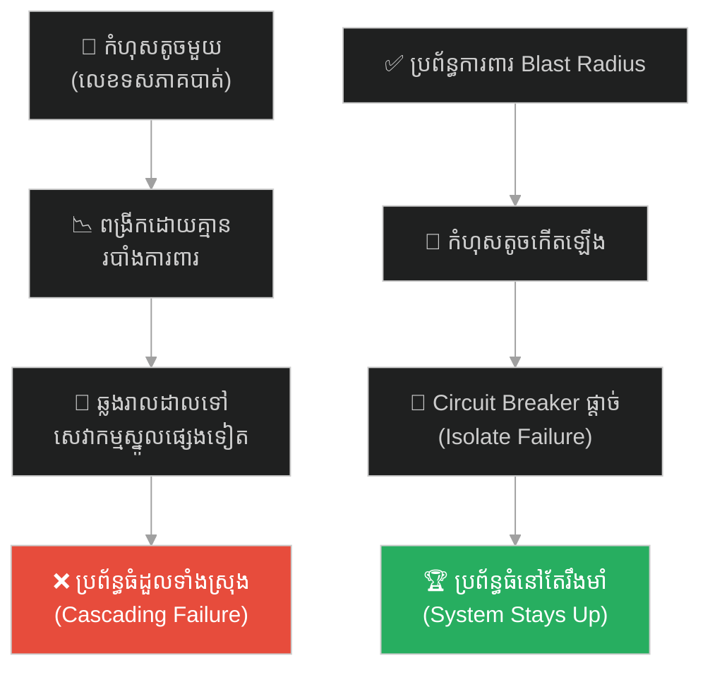
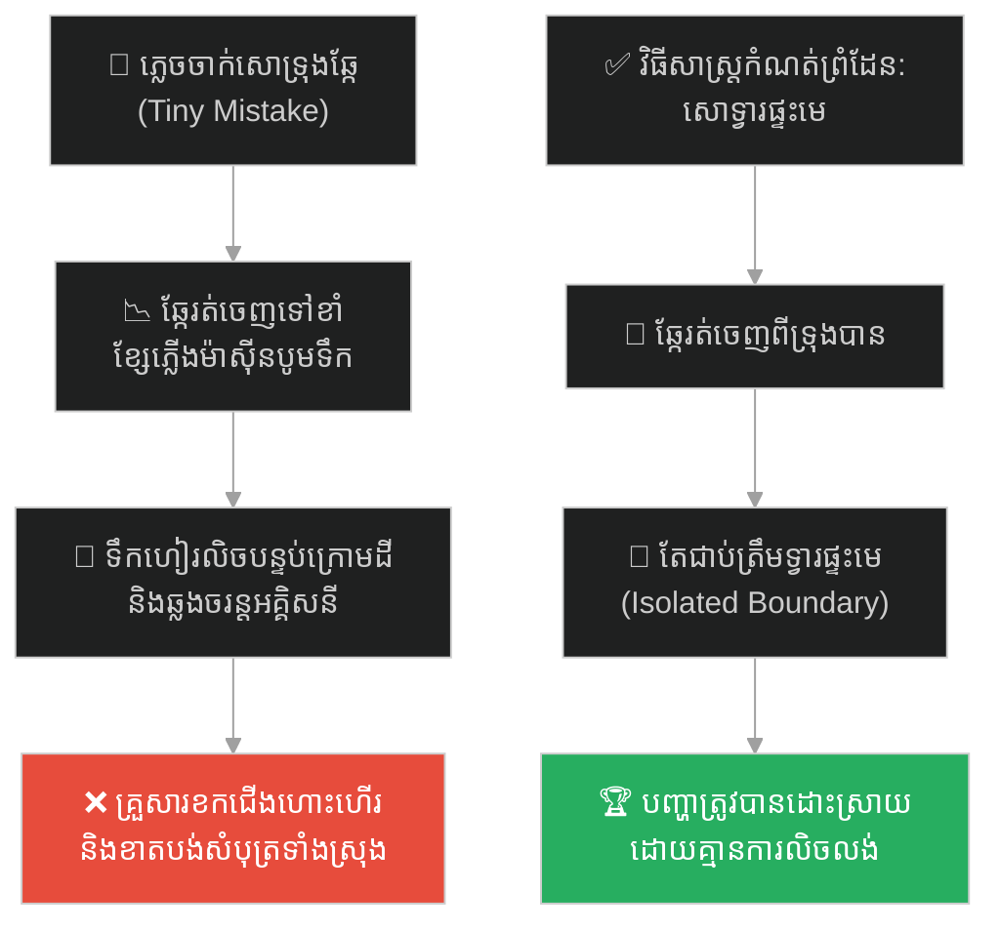
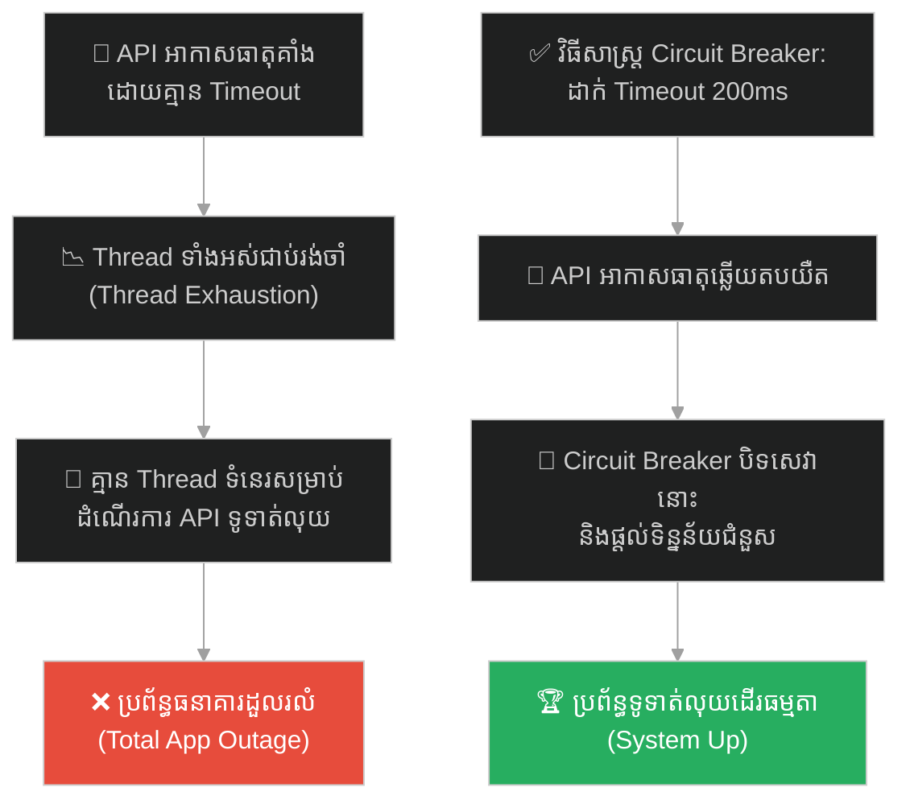
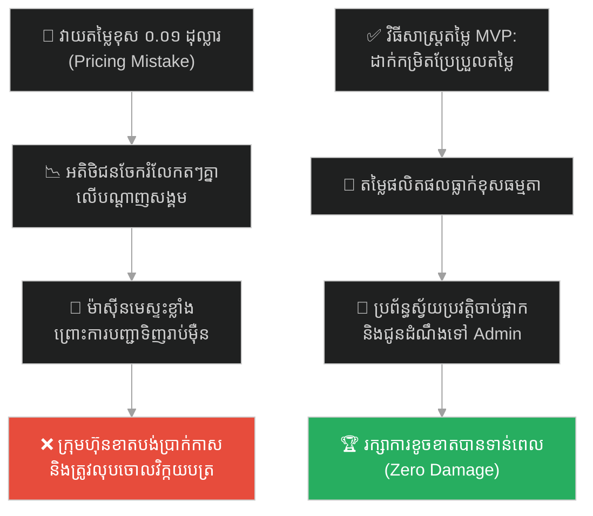
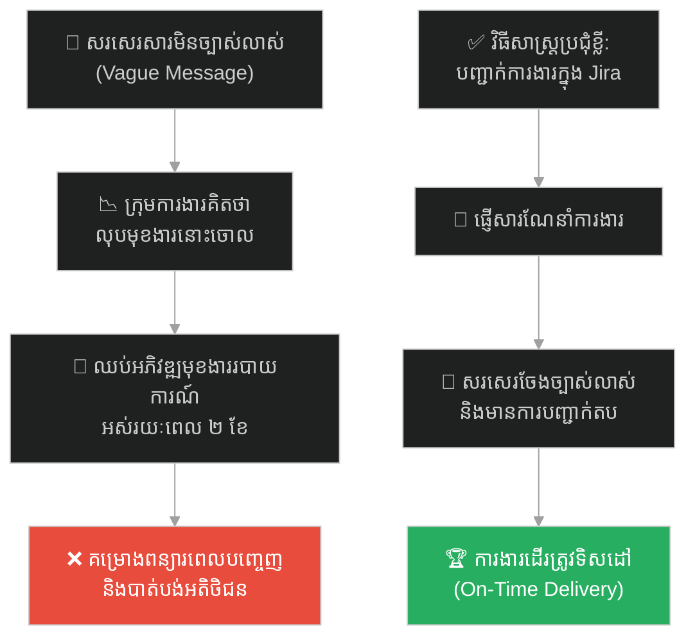
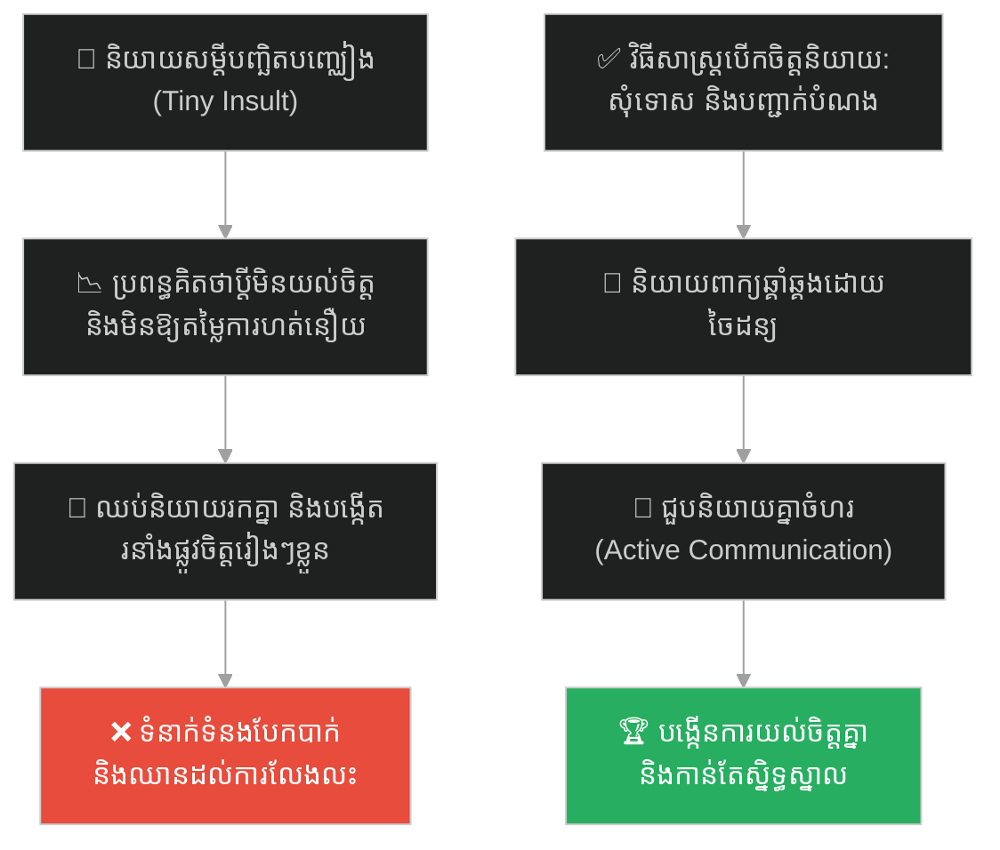
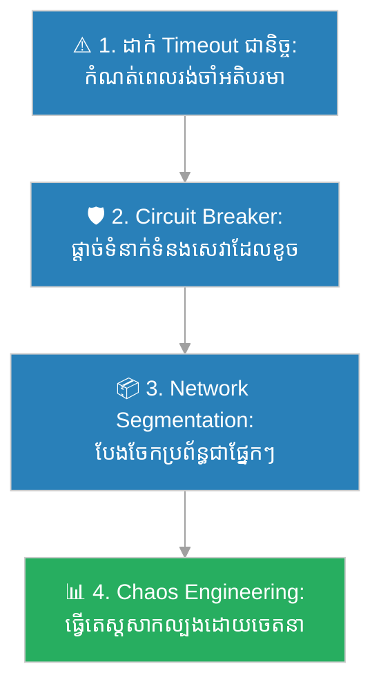

# Chaos Theory (ទ្រឹស្តីចលាចល)៖ ឥទ្ធិពលមេអំបៅ និងការបង្ការការដួលរលំជាប្រព័ន្ធ (Chaos Theory & The Butterfly Effect)

**Author:** ichamrong  
**Date:** 2026-05-27  
**Tags:** #butterfly-effect #chaos-theory #microservices #cascading-failures #circuit-breaker #risk-management #parable  
**Category:** Concepts / Parables  
**Read Time:** ~15 min  

---

## 📌 មាតិកា (Table of Contents)
- [អន្ទាក់ផ្លូវចិត្ត (The Trap)](#0)
- [១. រឿងព្រេងវិទ្យាសាស្ត្រ៖ Edward Lorenz និងលេខទសភាគដែលបាត់ (The Science of Chaos Theory)](#1)
  - [កំណើតនៃឥទ្ធិពលមេអំបៅ (Birth of the Butterfly Effect)](#1-1)
- [២. បញ្ហា៖ ការដួលរលំជាប្រព័ន្ធ និងការខ្វះប្រព័ន្ធការពារលំហូរ (The Issue: Cascading Failures & Lack of Boundary)](#2)
- [៣. ឧទាហរណ៍ជាក់ស្តែងក្នុងពិភពពិត (Real World Examples)](#3)
  - [ឧទាហរណ៍ទី ១ — កម្រិតស្រាល (គ្រួសារ)៖ ការភ្លេចចាក់សោទ្វារសត្វចិញ្ចឹម និងការខកខានជើងហោះហើរ (The Unlocked Pet Gate Chain Reaction)](#3-1)
  - [ឧទាហរណ៍ទី ២ — កម្រិតមធ្យម (បច្ចេកទេស)៖ ការខ្វះ Timeout លើ API មិនសំខាន់ដែលធ្វើឱ្យគាំងប្រព័ន្ធទូទាត់ប្រាក់ (The Missing Timeout Cascade)](#3-2)
  - [ឧទាហរណ៍ទី ៣ — កម្រិតមធ្យម (ធុរកិច្ច)៖ កំហុសតម្លៃផលិតផលមួយកាក់បង្កការបញ្ជាទិញរាប់ម៉ឺនដង (The One-Cent Pricing Glitch Chaos)](#3-3)
  - [ឧទាហរណ៍ទី ៤ — កម្រិតមធ្យម (សង្គម/គ្រប់គ្រង)៖ ការយល់ច្រឡំប្រយោគមួយឃ្លាបង្កការពន្យារពេលគម្រោង ២ខែ (The Misunderstood Slack Message Trap)](#3-4)
  - [ឧទាហរណ៍ទី ៥ — កម្រិតធ្ងន់ (ទំនាក់ទំនង)៖ សម្តីបញ្ឆិតបញ្ឈៀងតូចមួយនាំទៅដល់ការលែងលះគ្នា (The Tiny Spark of Divorce)](#3-5)
- [៤. ដំណោះស្រាយទូទៅ៖ ការអនុវត្ត Circuit Breakers និងការគ្រប់គ្រងដែនបរាជ័យ (The General Solution: Blast Radius Limitation & Circuit Breakers)](#4)
- [សេចក្តីសន្និដ្ឋាន (Conclusion)](#5)
- [ឯកសារយោង (References)](#6)
- [Related Posts](#7)

---

## អន្ទាក់ផ្លូវចិត្ត (The Trap)

តើអ្នកធ្លាប់ឆ្ងល់ទេថា ហេតុអ្វីបានជាព្រឹត្តិការណ៍តូចតាចមួយដែលមើលទៅមិនសំខាន់សោះ (ដូចជាការភ្លេចឆ្លើយតបសារ ឬការខ្វះខាតព័ត៌មានបន្តិចបន្តួច) បែរជាអាចរីកធំឡើងៗ រហូតបង្កជាមហន្តរាយ ឬការដួលរលំប្រព័ន្ធទាំងមូលនៅពេលក្រោយ?

នៅក្នុងប្រព័ន្ធស្មុគស្មាញ និងជីវិតប្រចាំថ្ងៃ៖
* **យើងងាយនឹងកើតមានភាពលម្អៀង** គិតថា "កំហុសតូចតាច ឬការប្រែប្រួលបន្តិចបន្តួចនឹងមិនបង្កផលប៉ះពាល់ធំដុំទេ" (Linear Thinking Bias)។
* **យើងមើលរំលង** ការពិតដែលថា នៅក្នុងប្រព័ន្ធដែលតភ្ជាប់គ្នា (Interdependent Systems) កំហុសតូចមួយអាចត្រូវបានពង្រីក (Amplified) ដោយសារតែការឆ្លើយតបតៗគ្នា (Feedback loops) រហូតដល់ហួសពីការគ្រប់គ្រង។

ការបណ្តោយឱ្យកំហុសតូចមួយឆ្លងរាលដាលគ្មានដែនកំណត់ រហូតបំផ្លាញប្រព័ន្ធទាំងមូល ហៅថា **អន្ទាក់ Cascading Failure (អន្ទាក់ដួលរលំរាលដាល)**។

ដើម្បីយល់ដឹងពីរបៀបដែលបក់ស្លាបរបស់មេអំបៅបង្កជាខ្យល់ព្យុះ នេះជាផែនទីបង្ហាញផ្លូវសម្រាប់អត្ថបទនេះ៖
1. **រឿងព្រេងវិទ្យាសាស្ត្រ (The Scientific Legend)** — ការរកឃើញទ្រឹស្តីចលាចលដោយចៃដន្យរបស់ Edward Lorenz។
2. **បញ្ហា (The Issue)** — យន្តការនៃការរាលដាលកំហុសនៅក្នុងប្រព័ន្ធស្មុគស្មាញ (Cascading Failures)។
3. **ឧទាហរណ៍ជាក់ស្តែងក្នុងពិភពពិត (Real World Examples)** — ពិនិត្យមើលឥទ្ធិពលនេះក្នុងកម្រិតគ្រួសារ បច្ចេកវិទ្យា ធុរកិច្ច ការគ្រប់គ្រង និងទំនាក់ទំនង។
4. **ដំណោះស្រាយទូទៅ (The General Solution)** — ការបង្កើតរបាំងការពារ និងការប្រើប្រាស់ Circuit Breaker Pattern។

---

## ១. រឿងព្រេងវិទ្យាសាស្ត្រ៖ Edward Lorenz និងលេខទសភាគដែលបាត់ (The Science of Chaos Theory)

នៅក្នុងឆ្នាំ ១៩៦១ គណិតវិទូ និងអ្នកឧតុនិយមជនជាតិអាមេរិកលោក **Edward Lorenz (អេតវឺត ឡូរ៉េនហ្ស៍)** កំពុងបំពេញការងារលើគំរូកុំព្យូទ័រ ដើម្បីទស្សន៍ទាយអាកាសធាតុនៅសាកលវិទ្យាល័យ MIT។ គាត់បានបង្កើតសមីការគណិតវិទ្យាចំនួន ១២ ដែលតំណាងឱ្យចលនាខ្យល់ សីតុណ្ហភាព និងសម្ពាធអាកាស។ គាត់បានបញ្ចូលទិន្នន័យដំបូងទៅក្នុងកុំព្យូទ័រ Royal McBee ដ៏ធំមួយ ដើម្បីគណនានូវគំរូអាកាសធាតុដែលនឹងកើតឡើង។

ថ្ងៃមួយ គាត់ចង់ពិនិត្យមើលលទ្ធផលគណនាមួយឡើងវិញ ប៉ុន្តែដើម្បីសន្សំពេលវេលា គាត់បានសម្រេចចិត្តចាប់ផ្តើមការគណនាពីពាក់កណ្តាលផ្លូវ ដោយបញ្ចូលទិន្នន័យពីរបាយការណ៍មុនដែលបានបោះពុម្ពនៅលើក្រដាស។

នៅលើក្រដាសបោះពុម្ព លេខត្រូវបានបង្ហាញត្រឹម ៣ ខ្ទង់ក្រោយក្បៀស គឺ **០.៥០៦ (0.506)**។ ប៉ុន្តែនៅក្នុងសតិចងចាំរបស់កុំព្យូទ័រផ្ទាល់ លេខនោះមាន ៦ ខ្ទង់ គឺ **០.៥០៦១២៧ (0.506127)**។ Lorenz គិតថា ការបាត់លេខទសភាគតូចបំផុតគឺ ១ ភាគ ១០ ម៉ឺននេះ (ស្មើនឹងការកាត់បន្ថយខ្យល់បន្តិចបន្តួច) នឹងមិនធ្វើឱ្យលទ្ធផលចុងក្រោយផ្លាស់ប្តូរធំដុំឡើយ។ គាត់បានចុចដំណើរការម៉ាស៊ីន ហើយដើរទៅផឹកកាហ្វេ។

---

### កំណើតនៃឥទ្ធិពលមេអំបៅ (Birth of the Butterfly Effect)

នៅពេលគាត់ត្រឡប់មកវិញ គាត់មានការភ្ញាក់ផ្អើលយ៉ាងខ្លាំងចំពោះក្រាហ្វិកលទ្ធផលថ្មី។ ដំបូងឡើយ ក្រាហ្វទាំងពីរដើរជាន់គ្នាដូចមុនបេះបិទ។ ប៉ុន្តែបន្តិចម្តងៗ ពួកវាចាប់ផ្តើមឃ្លាតពីគ្នា ហើយចុងក្រោយ ក្រាហ្វទាំងពីរបានបង្កើតជាគំរូអាកាសធាតុពីរខុសគ្នាស្រឡះដាច់ដោយឡែកពីគ្នា។ ក្រាហ្វមួយបង្ហាញថាមានអាកាសធាតុល្អ ចំណែកក្រាហ្វមួយទៀតបង្ហាញថាមានព្យុះសង្ឃរាធ្ងន់ធ្ងរ។

ការប្រែប្រួលទិន្នន័យដំបូងត្រឹមតែ ០.០០០១២៧ (ដែលប្រៀបដូចជារំញ័រខ្យល់នៃស្លាបមេអំបៅ) ត្រូវបានសមីការស្មុគស្មាញយកទៅគណនាដដែលៗ ដោយពង្រីកទំហំខុសគ្នាទ្វេដងនៅគ្រប់ជំហាន រហូតបង្កើតបានជាលទ្ធផលខុសគ្នាទាំងស្រុងនៅចុងបញ្ចប់។

របកគំហើញនេះបានបង្កើតឱ្យមានទ្រឹស្តីគណិតវិទ្យាថ្មីមួយគឺ **Chaos Theory (ទ្រឹស្តីចលាចល)** និងបង្កើតនូវឃ្លាប្រៀបធៀបដ៏ល្បីល្បាញលើលោកក្នុងឆ្នាំ ១៩៧២ ថា៖ 

> **«តើការបក់ស្លាបរបស់សត្វមេអំបៅនៅប្រេស៊ីល អាចបង្កើតជាខ្យល់ព្យុះកំបុតត្បូងនៅតិចសាស់ដែរឬទេ?»**

វាឆ្លុះបញ្ចាំងថា នៅក្នុងប្រព័ន្ធដែលមិនលីនេអ៊ែរ (Non-linear systems) គ្រប់យ៉ាងមានទំនាក់ទំនងគ្នា ហើយភាពមិនច្បាស់លាស់តូចបំផុតនៅចំណុចចាប់ផ្តើម អាចបង្កជាលទ្ធផលដែលមិនអាចទស្សន៍ទាយបាននៅចុងបញ្ចប់។

---

## ២. បញ្ហា៖ ការដួលរលំជាប្រព័ន្ធ និងការខ្វះប្រព័ន្ធការពារលំហូរ (The Issue: Cascading Failures & Lack of Boundary)

នៅក្នុងវិស្វកម្មសូហ្វវែរ ជាពិសេសនៅក្នុងស្ថាបត្យកម្មទំនើប (Microservices ឬ Distributed Systems) ឥទ្ធិពលមេអំបៅកើតឡើងស្ទើរតែរាល់ថ្ងៃក្នុងទម្រង់ជា **Cascading Failure (ការដួលរលំជាខ្សែសង្វាក់)**។

នៅពេលប្រព័ន្ធរចនាឡើងដោយគ្មានការកំណត់ព្រំដែនច្បាស់លាស់៖
1. **ចំណុចខូចខាតតែមួយ (Single Point of Failure)៖** កំហុសឆ្គងតូចមួយនៅក្នុងសេវាកម្មដែលមិនសូវសំខាន់ អាចស្រូបយកធនធាន (Thread, CPU, Connection Pool) របស់ម៉ាស៊ីនមេទាំងស្រុង។
2. **ការរាលដាលគ្មានដែនកំណត់ (Unbounded Propagations)៖** សេវាកម្មដទៃទៀតដែលផ្អែកលើសេវាកម្មដែលគាំងនោះ ចាប់ផ្តើមស្ទះតៗគ្នា រហូតធ្វើឱ្យប្រព័ន្ធស្នូលទាំងមូលដួលរលំ (Total Outage)។
3. **ការខ្វះ Boundary នៃកំហុស (No Blast Radius Containment)៖** ប្រសិនបើគ្មានរបាំងទប់ស្កាត់ កំហុសតូចមួយអាចបង្កការខូចខាតដល់ក្រុមហ៊ុនទាំងមូល ដែលនាំទៅដល់ការបាត់បង់ចំណូល និងកេរ្តិ៍ឈ្មោះ។

ដើម្បីការពារបញ្ហានេះ វិស្វករត្រូវយល់ដឹងពីរបៀបកំណត់ដែនបរាជ័យ (Blast Radius) ឱ្យតូចបំផុត ដោយការប្រើប្រាស់ Circuit Breakers, Timeouts, និង Rate Limiters។

---

## ៣. ឧទាហរណ៍ជាក់ស្តែងក្នុងពិភពពិត (Real World Examples)

---

### ឧទាហរណ៍ទី ១ — កម្រិតស្រាល (គ្រួសារ)៖ ការភ្លេចចាក់សោទ្វារសត្វចិញ្ចឹម និងការខកខានជើងហោះហើរ (The Unlocked Pet Gate Chain Reaction)

សមាជិកគ្រួសារម្នាក់ប្រញាប់ទៅធ្វើការនៅពេលព្រឹក ហើយបានភ្លេចបិទសោទ្វារទ្រុងសុនខឱ្យបានត្រឹមត្រូវ (កំហុសតូចតាច)។

នៅពេលថ្ងៃត្រង់ សុនខបានរុញទ្វារចេញ ហើយរត់ទៅខាំខ្សែភ្លើងរបស់ម៉ាស៊ីនបូមទឹកនៅបន្ទប់ក្រោមដី។ ម៉ាស៊ីនបូមទឹកបានដាច់ចរន្ត ហើយទឹកចាប់ផ្តើមហៀរលិចបន្ទប់ក្រោមដីទាំងស្រុង បង្កជាសៀគ្វីអគ្គិសនីឆ្លង (Short Circuit) ធ្វើឱ្យដាច់ភ្លើងទូទាំងផ្ទះ។ នៅពេលល្ងាច ឪពុកម្តាយត្រឡប់មកពីធ្វើការវិញ ត្រូវចំណាយពេលដោះស្រាយបញ្ហាលិចទឹក និងគ្មានភ្លើងប្រើប្រាស់ រហូតដល់ហួសម៉ោងធ្វើដំណើរទៅព្រលានយន្តហោះ ធ្វើឱ្យពួកគេខកខានការហោះហើរទៅកម្សាន្តដែលបានរៀបចំទុកជាច្រើនខែ។

កំហុសតូចមួយនៃការមិនបិទទ្វារទ្រុងសុនខ បានបង្កជាការខូចខាតជាបន្តបន្ទាប់រហូតដល់ខកខានដំណើរការកម្សាន្តគ្រួសារទាំងមូល។

---

### ឧទាហរណ៍ទី ២ — កម្រិតមធ្យម (បច្ចេកទេស)៖ ការខ្វះ Timeout លើ API មិនសំខាន់ដែលធ្វើឱ្យគាំងប្រព័ន្ធទូទាត់ប្រាក់ (The Missing Timeout Cascade)

Developer ម្នាក់បានសរសេរកូដសម្រាប់ហៅ API បង្ហាញព័ត៌មានអាកាសធាតុនៅលើទំព័រដើមនៃកម្មវិធីធនាគារ (Weather Widget) ដោយភ្លេចដាក់កំណត់រយៈពេលរង់ចាំ (Timeout)។

នៅថ្ងៃមួយ ម៉ាស៊ីនមេផ្តល់សេវាអាកាសធាតុខាងក្រៅបានគាំង ធ្វើឱ្យរាល់ការស្នើសុំ (Requests) ពីកម្មវិធីធនាគារត្រូវរង់ចាំដោយគ្មានដែនកំណត់។ រាល់ពេលដែលអ្នកប្រើប្រាស់បើក App ម៉ាស៊ីនមេធនាគារត្រូវបង្កើត Thread មួយដើម្បីរង់ចាំសេវាអាកាសធាតុនោះ។ ក្នុងរយៈពេលតែ ៥ នាទី Thread របស់ម៉ាស៊ីនមេធនាគារត្រូវបានប្រើប្រាស់អស់ ១០០%។ លទ្ធផលគឺ អ្នកប្រើប្រាស់ផ្សេងទៀតដែលចង់ធ្វើប្រតិបត្តិការផ្ទេរប្រាក់ ឬទូទាត់ប្រាក់ មិនអាចប្រើប្រាស់ App បានឡើយ ព្រោះគ្មាន Thread ទំនេរដើម្បីដំណើរការប្រតិបត្តិការរបស់ពួកគេ។

កំហុសនៃការភ្លេចដាក់ Timeout លើសេវាកម្មអាកាសធាតុដែលមិនសំខាន់សោះ បែរជាអាចទាញទម្លាក់ប្រព័ន្ធទូទាត់ប្រាក់ស្នូលរបស់ធនាគារទាំងមូល។

---

### ឧទាហរណ៍ទី ៣ — កម្រិតមធ្យម (ធុរកិច្ច)៖ កំហុសតម្លៃផលិតផលមួយកាក់បង្កការបញ្ជាទិញរាប់ម៉ឺនដង (The One-Cent Pricing Glitch Chaos)

បុគ្គលិកបញ្ចូលទិន្នន័យផលិតផលរបស់វេបសាយលក់ទំនិញអនឡាញម្នាក់ បានវាយបញ្ចូលតម្លៃកាសត្រចៀកឥតខ្សែលំដាប់ខ្ពស់ខុស ដោយសរសេរត្រឹម **០.០១ ដុល្លារ** ជំនួសឱ្យ **១០០.០០ ដុល្លារ** (កំហុសតម្លៃ ១ កាក់)។

ក្នុងរយៈពេលតែប៉ុន្មាននាទី ព័ត៌មាននេះត្រូវបានចែករំលែកជាសាធារណៈនៅលើបណ្តាញសង្គម។ មនុស្សរាប់ម៉ឺននាក់បានសម្រុកចូលមកបញ្ជាទិញម្នាក់ៗរាប់រយគ្រឿង។ ម៉ាស៊ីនមេរបស់វេបសាយត្រូវទទួលបន្ទុកលើសចំណុះ (Overload) រហូតដល់គាំងទាំងស្រុង។ ជាងនេះទៅទៀត ប្រព័ន្ធទូទាត់ប្រាក់បានកាត់ប្រាក់អតិថិជនដោយស្វ័យប្រវត្តិចំនួនរាប់ម៉ឺនប្រតិបត្តិការ។ ក្រុមហ៊ុនត្រូវចំណាយពេលដោះស្រាយបញ្ហាផ្លូវច្បាប់ លុបចោលការបញ្ជាទិញ និងសងប្រាក់ទៅអតិថិជនវិញ ដែលបង្កការខូចខាតកេរ្តិ៍ឈ្មោះ និងការបាត់បង់ចំណូលដ៏ធំធេង។

ការបញ្ចូលតម្លៃខុសតែ ២ ខ្ទង់ បានបង្កជាចលាចលទូទាំងប្រព័ន្ធអាជីវកម្មរបស់ក្រុមហ៊ុន។

---

### ឧទាហរណ៍ទី ៤ — កម្រិតមធ្យម (សង្គម/គ្រប់គ្រង)៖ ការយល់ច្រឡំប្រយោគមួយឃ្លាបង្កការពន្យារពេលគម្រោង ២ខែ (The Misunderstood Slack Message Trap)

អ្នកដឹកនាំគម្រោងម្នាក់បានសរសេរសារដ៏ខ្លីមួយនៅលើ Slack ទៅកាន់ក្រុមការងារអភិវឌ្ឍន៍ថា៖ *"យើងគួរផ្អាកការអភិវឌ្ឍមុខងាររៀបចំរបាយការណ៍សិន"* ដោយមានបំណងចង់ឱ្យពួកគេផ្តោតលើការជួសជុល Bugs ស្នូលមុនគេក្នុងសប្តាហ៍នោះ។

ប៉ុន្តែ ក្រុមការងារបានយល់ច្រឡំថា គម្រោងមុខងាររបាយការណ៍ត្រូវបានលុបចោលទាំងស្រុងពីផែនការមេ។ ពួកគេបានលុបចោលរាល់កិច្ចការដែលទាក់ទងនឹងរបាយការណ៍ចេញពីតារាងការងារ ហើយឈប់ពិភាក្សាពីរឿងនេះ។ រយៈពេល ២ ខែក្រោយមក នៅថ្ងៃប្រជុំបង្ហាញលទ្ធផលទៅកាន់អតិថិជន (Demo Day) អតិថិជនបានសួររកមុខងាររបាយការណ៍ដែលជាតម្រូវការស្នូល។ ក្រុមការងារបានភ្ញាក់ផ្អើលយ៉ាងខ្លាំង ព្រោះពួកគេមិនបានធ្វើវាឡើយ។ គម្រោងទាំងមូលត្រូវពន្យារពេល ២ ខែបន្ថែមទៀតដើម្បីសរសេរមុខងារនោះឡើងវិញ។

សារ Slack ដ៏ខ្លីមួយឃ្លាដែលខ្វះការបញ្ជាក់ឱ្យច្បាស់លាស់ បានធ្វើឱ្យក្រុមការងារទាំងមូលវង្វេងទិសដៅអស់រយៈពេលរាប់ខែ។

---

### ឧទាហរណ៍ទី ៥ — កម្រិតធ្ងន់ (ទំនាក់ទំនង)៖ សម្តីបញ្ឆិតបញ្ឈៀងតូចមួយនាំទៅដល់ការលែងលះគ្នា (The Tiny Spark of Divorce)

ប្តីប្រពន្ធមួយគូដែលរវល់នឹងការងាររៀងៗខ្លួន បានចាប់ផ្តើមមានអារម្មណ៍ហត់នឿយ។ ល្ងាចមួយ ប្តីបាននិយាយពាក្យបញ្ឆិតបញ្ឈៀងតូចមួយទៅកាន់ប្រពន្ធថា៖ *"ថ្ងៃនេះផ្ទះមើលទៅរញ៉េរញ៉ៃណាស់"* (កំហុសពាក្យសម្តីតូចមួយ)។

ប្រពន្ធដែលទើបតែត្រឡប់មកពីធ្វើការទាំងហត់នឿយ បានបកស្រាយពាក្យសម្តីនោះថាជាការចោទប្រកាន់ថានាងជាប្រពន្ធមិនល្អ និងខ្ជិលច្រអូស។ នាងមានប្រតិកម្មខ្លាំង និងឆ្លើយតបវិញដោយរំលឹកពីកំហុសចាស់ៗរបស់ប្តី។ ជម្លោះបានរីករាលដាលទៅជាការស្រែកដាក់គ្នា។ បន្ទាប់ពីយប់នោះមក ពួកគេចាប់ផ្តើមមិននិយាយរកគ្នា បង្កើតជារនាំងផ្លូវចិត្តកាន់តែធំទៅៗ។ រយៈពេល ១ ឆ្នាំក្រោយមក ដោយសារតែខ្វះការបើកចិត្តនិយាយគ្នាដោះស្រាយបញ្ហាដំបូង ជម្លោះតូចៗរាប់រយបានបូកបញ្ចូលគ្នា រហូតធ្វើឱ្យពួកគេសម្រេចចិត្តលែងលះគ្នា។

ពាក្យសម្តីមិនសមរម្យមួយឃ្លាដែលមិនត្រូវបានសម្របសម្រួលទាន់ពេល បានក្លាយជាផ្កាភ្លើងដុតបំផ្លាញអាពាហ៍ពិពាហ៍ទាំងមូល។

---

## ៤. ដំណោះស្រាយទូទៅ៖ การអនុវត្ត Circuit Breakers និងការគ្រប់គ្រងដែនបរាជ័យ (The General Solution: Blast Radius Limitation & Circuit Breakers)

ដើម្បីទប់ស្កាត់ឥទ្ធិពលមេអំបៅពីការបំផ្លាញប្រព័ន្ធធំ យើងត្រូវបង្កើត **"របាំងការពារ និងការកំណត់ដែនខូចខាត (Blast Radius Limitation)"**៖

ដំណោះស្រាយសំខាន់ៗ៖
1. **ដាក់ Timeout និង Retry Limit ជានិច្ច (Always Use Timeouts & Retry Limits)៖** រាល់ពេលហៅទៅកាន់សេវាកម្មខាងក្រៅ ឬសេវាកម្មដទៃទៀត ត្រូវតែកំណត់រយៈពេលរង់ចាំ (Timeout) ឱ្យខ្លីបំផុត (ឧទាហរណ៍ ២០០ មីលីវិនាទី)។ ប្រសិនបើយឺត ត្រូវឈប់រង់ចាំជាបន្ទាន់ ដើម្បីការពារកុំឱ្យស្ទះ Thread។
2. **អនុវត្តយន្តការ Circuit Breaker (Implement Circuit Breaker Pattern)៖** ប្រៀបដូចជាឌីសង់ទ័រនៅក្នុងផ្ទះអញ្ចឹង។ ប្រសិនបើសេវាកម្ម A ហៅទៅសេវាកម្ម B បរាជ័យលើសពី ៥ ដងជាប់ៗគ្នា Circuit Breaker នឹងប្តូរទៅស្ថានភាព "Open (ដាច់ចរន្ត)"។ រាល់ការហៅទៅសេវាកម្ម B នឹងត្រូវបដិសេធភ្លាមៗ ដោយផ្តល់ជាលទ្ធផលជំនួសសាមញ្ញ (Fallback Response) ដើម្បីរក្សាសេវាកម្ម A កុំឱ្យគាំងតាម។
3. **បែងចែកប្រព័ន្ធជាបន្ទប់ៗ (Compartmentalization / Segmentation)៖** បែងចែករចនាសម្ព័ន្ធការងារ ឬប្រព័ន្ធបច្ចេកវិទ្យាជាផ្នែកៗដាច់ពីគ្នា (ដូចជាការបែងចែកកប៉ាល់ជាបន្ទប់ៗការពារទឹកលិច)។ បើបន្ទប់មួយលិចទឹក វានឹងមិនធ្វើឱ្យកប៉ាល់ទាំងមូលលិចឡើយ។
4. ** Chaos Engineering (វិស្វកម្មស្វែងរកចលាចល)៖** សាកល្បងបំផ្លាញសេវាកម្មតូចៗដោយចេតនានៅក្នុងម៉ាស៊ីនតេស្ត (ដូចជាការប្រើប្រាស់ឧបករណ៍ Chaos Monkey) ដើម្បីប្រាកដថាប្រព័ន្ធធំមានសមត្ថភាពទប់ទល់ និងមិនដួលរលំតាមគ្នា។

---

## 🐇 ធ្លាក់ចូលក្នុងរន្ធទន្សាយ (Enter the Rabbit Hole)

ដើម្បីស្វែងយល់កាន់តែស៊ីជម្រៅអំពីរបៀបបង្កើត "ចបកាប់ និងឧបករណ៍" (Infrastructure Tools) សម្រាប់ជួយសម្រួលដល់វិស្វករដទៃទៀត ក្នុងការកសាងប្រព័ន្ធដែលមានស្ថិរភាព និងមិនបារម្ភពីរឿងរ៉ាវចលាចលទាំងនេះ សូមបន្តដំណើររុករករបស់អ្នកទៅកាន់៖

* 🚀 **[ចាប់ផ្តើមដំណើររុករក (Start the Journey) ➔ Platform Engineering and Selling Shovels](./62-selling-shovels.md)**

---

## សេចក្តីសន្និដ្ឋាន (Conclusion)

> **«នៅក្នុងប្រព័ន្ធស្មុគស្មាញ កំហុសតូចតាចគឺជាសត្រូវលាក់មុខ។ កុំសម្លឹងមើលតែរូបភាពធំ ចូររចនារបាំងការពារសម្រាប់រាល់ចំណុចប្រសព្វតូចៗ។»**

យើងមិនអាចលុបបំបាត់រាល់ "សត្វមេអំបៅ" (កំហុសឆ្គង ឬភាពមិនប្រាកដប្រជា) ចេញពីជីវិត និងបច្ចេកវិទ្យាបានឡើយ។ អ្វីដែលយើងអាចធ្វើបាន គឺការសាងសង់ប្រព័ន្ធដែល "ធន់នឹងចលាចល" (Resilient System) ដោយការកំណត់ដែនបរាជ័យឱ្យតូចបំផុត និងការបង្កើតឌីសង់ទ័រការពារកុំឱ្យកំហុសតូចមួយ បង្កើតជាខ្យល់ព្យុះបំផ្លាញអ្វីៗគ្រប់យ៉ាងដែលយើងបានកសាងមក។

---

## ឯកសារយោង (References)

* **Edward Lorenz** — *The Essence of Chaos* (1993). សៀវភៅពន្យល់ពីទ្រឹស្តីចលាចល និងឥទ្ធិពលមេអំបៅដោយផ្ទាល់ពីអ្នករកឃើញ។
* **Michael T. Nygard** — *Release It!: Design and Deploy Production-Ready Software* (2007). ឯកសារណែនាំដ៏ល្បីល្បាញស្តីពីការប្រើប្រាស់ Circuit Breaker Pattern និងការបង្ការ Cascading Failures។
* **James Gleick** — *Chaos: Making a New Science* (1987). សៀវភៅបកស្រាយពីប្រវត្តិនៃការរកឃើញទ្រឹស្តីចលាចល និងឥទ្ធិពលរបស់វាលើពិភពលោក។

---

## Related Posts

* **[53 The Butterfly Effect: Cascading Failures and Circuit Breakers](../articles/53-the-butterfly-effect-and-cascading-failures.md)** — អត្ថបទបកស្រាយលម្អិតអំពីរបៀបអនុវត្ត Circuit Breaker Pattern នៅក្នុងស្ថាបត្យកម្ម Microservices។
* **[48 Miyamoto Musashi and The Book of Five Rings](./48-the-book-of-five-rings.md)** — ការហ្វឹកហាត់ខ្លួន និងប្រព័ន្ធដើម្បីទប់ទល់នឹងស្ថានភាពមិនប្រាកដប្រជា និងចលាចលនានា។
* **[56-the-1202-alarm.md](./56-the-1202-alarm.md)** — របៀបបែងចែកអាទិភាព និងលុបចោលកិច្ចការមិនសូវសំខាន់ ដើម្បីរក្សាជីវិតរបស់សេវាកម្មស្នូលក្រោមសម្ពាធការងារខ្លាំង។

---

## Related

- [💡 Concepts README](../README.md)
- [📚 Main Repository README](../../../README.md)
- [Developer Habits](../../developer-habits/README.md)
- [Mental Health & Well-being](../../mental-health/README.md)
- [Management & SDLC](../../management/README.md)
