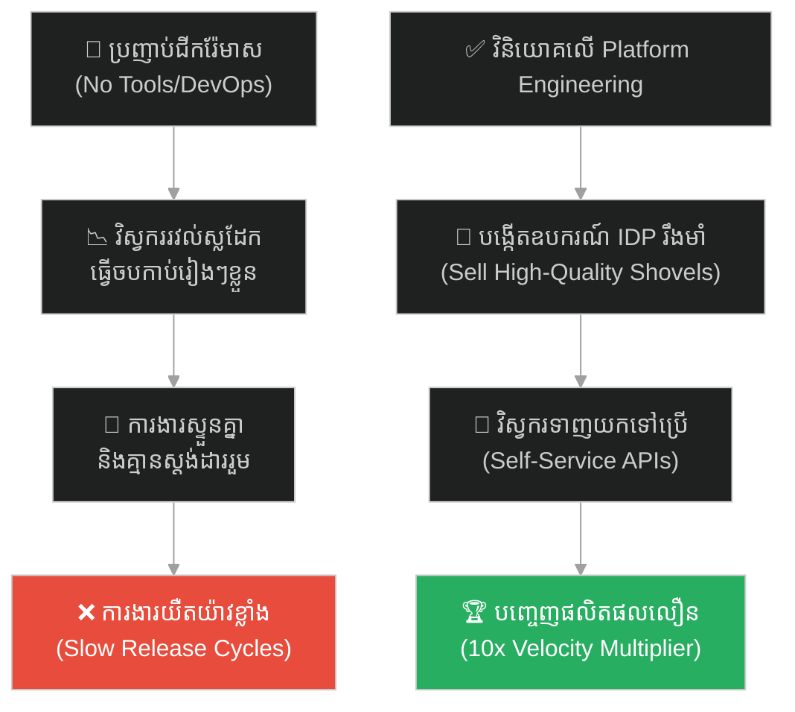
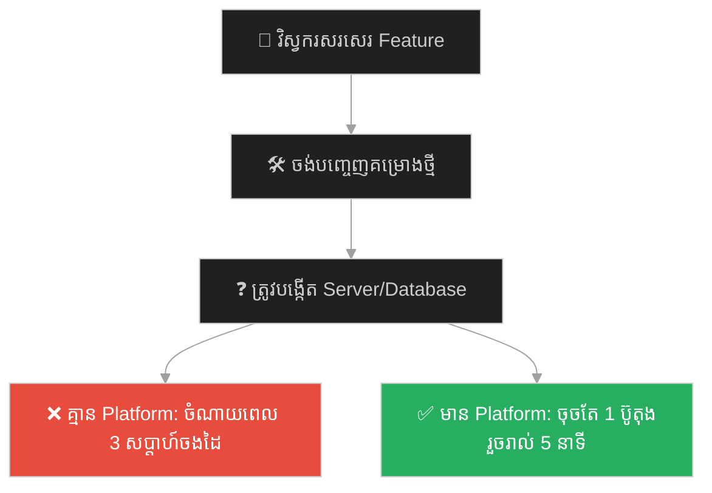
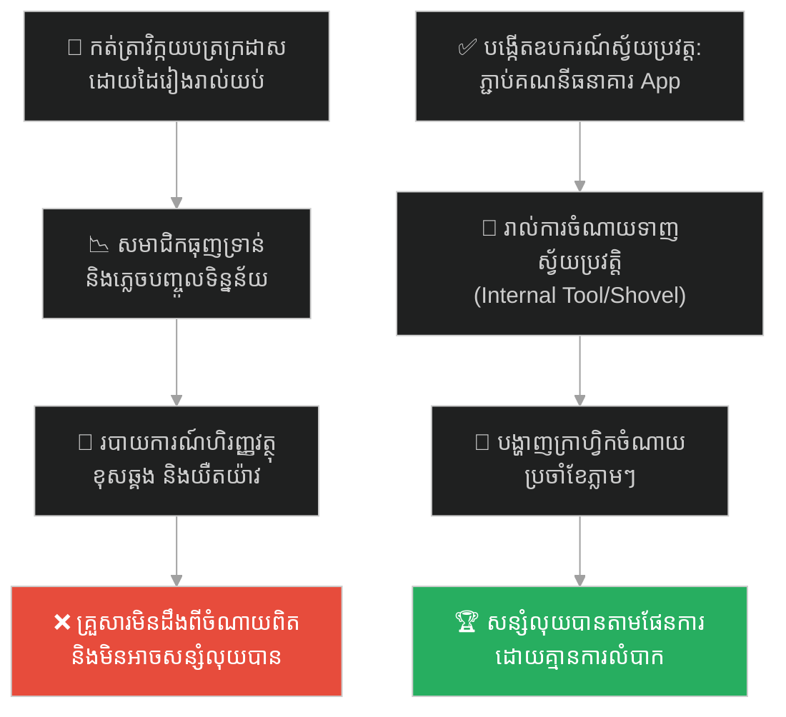
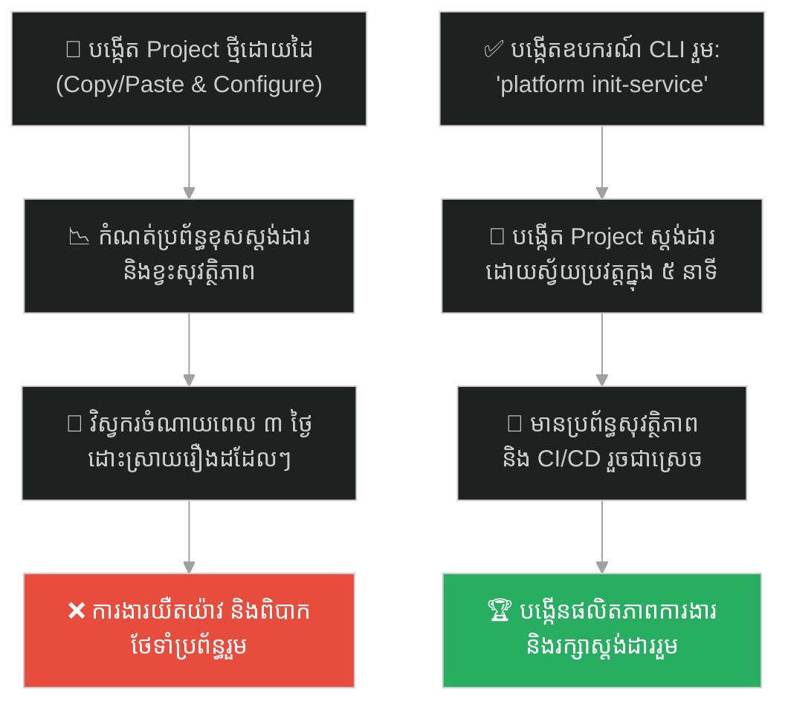
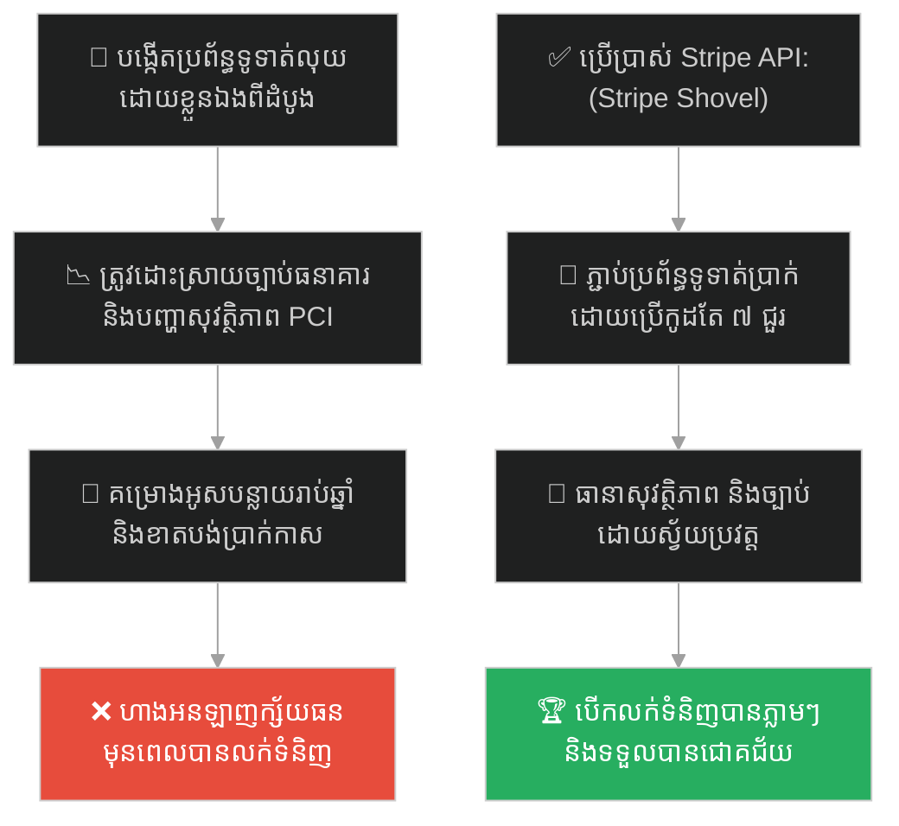
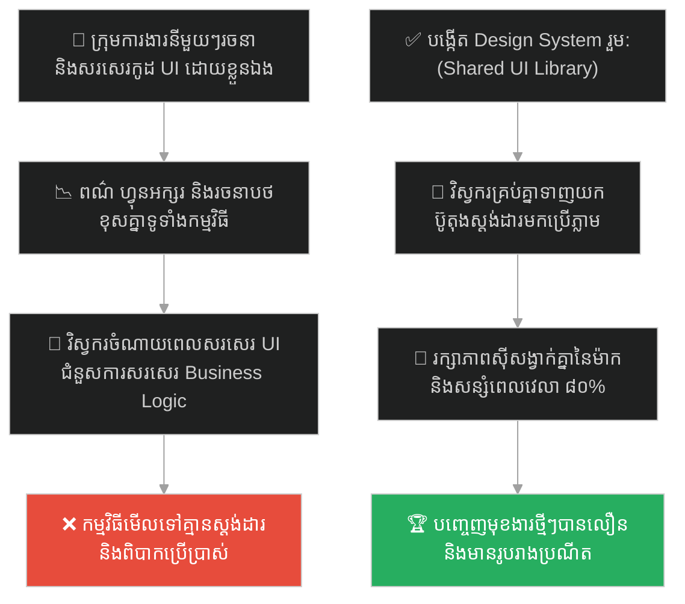
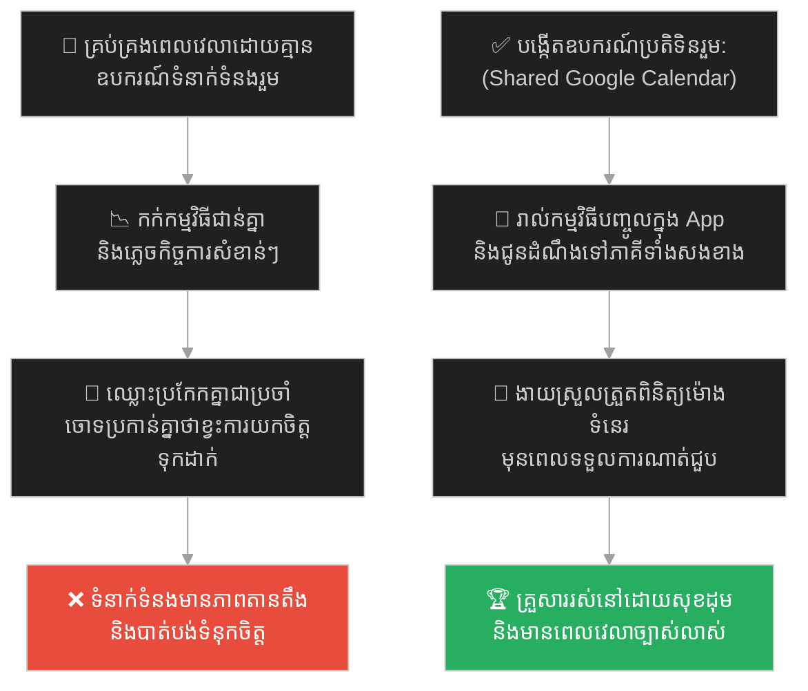
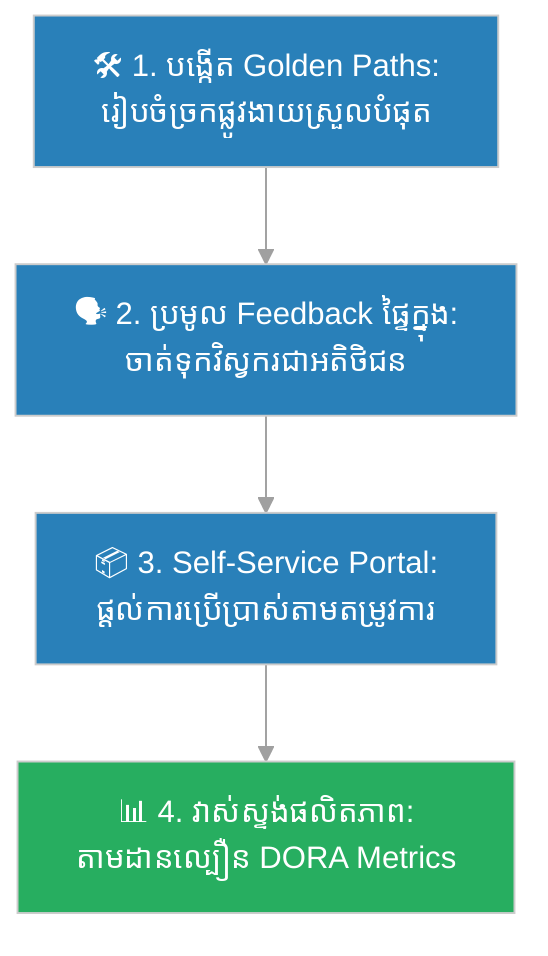

# Platform Engineering (វិស្វកម្មវេទិកាការងារ)៖ យុគសម័យស្វែងរកមាស និងការលក់ចបកាប់ (Platform Engineering & Selling Shovels)

**Author:** ichamrong  
**Date:** 2026-05-27  
**Tags:** #gold-rush #platform-engineering #devops #infrastructure #developer-experience #multiplier-effect #parable  
**Category:** Concepts / Parables  
**Read Time:** ~15 min  

---

## 📌 មាតិកា (Table of Contents)
- [អន្ទាក់ផ្លូវចិត្ត (The Trap)](#0)
- [១. រឿងព្រេងប្រវត្តិសាស្ត្រ៖ យុគសម័យស្វែងរកមាសនៅកាលីហ្វ័រញ៉ា និងមហាសេដ្ឋីលក់ចបកាប់ (The California Gold Rush)](#1)
  - [អ្នកដែលក្លាយជាសេដ្ឋីពិតប្រាកដ (The Real Millionaires of Gold Rush)](#1-1)
- [២. បញ្ហា៖ ការសរសេរមុខងារតែខ្វះឧបករណ៍ជំនួយ និងតួនាទីរបស់ Platform Engineering (The Issue: Feature Bias vs. Platform Tools)](#2)
- [៣. ឧទាហរណ៍ជាក់ស្តែងក្នុងពិភពពិត (Real World Examples)](#3)
  - [ឧទាហរណ៍ទី ១ — កម្រិតស្រាល (គ្រួសារ)៖ ការរៀបចំប្រព័ន្ធគ្រប់គ្រងថវិកាស្វ័យប្រវត្តិជំនួសការកត់ត្រាដោយដៃ (The Automated Family Finance System)](#3-1)
  - [ឧទាហរណ៍ទី ២ — កម្រិតមធ្យម (បច្ចេកទេស)៖ ការបង្កើតឧបករណ៍ CLI ផ្ទៃក្នុងជំនួសការបង្កើត Project ដោយដៃ (The Custom Bootstrapping CLI)](#3-2)
  - [ឧទាហរណ៍ទី ៣ — កម្រិតមធ្យម (ធុរកិច្ច)៖ ការផ្តល់សេវា API ទូទាត់លុយជំនួសការបង្កើតហាងលក់រាយ (The Stripe API Shovel Strategy)](#3-3)
  - [ឧទាហរណ៍ទី ៤ — កម្រិតមធ្យម (សង្គម/គ្រប់គ្រង)៖ ការបង្កើតបណ្ណាល័យ UI ក្រាហ្វិកសម្រាប់ក្រុមការងារទាំងអស់ (The Shared UI Component Library)](#3-4)
  - [ឧទាហរណ៍ទី ៥ — កម្រិតធ្ងន់ (ទំនាក់ទំនង)៖ ការប្រើប្រាស់ប្រតិទិនរួមដើម្បីគ្រប់គ្រងពេលវេលាគ្រួសារ (The Shared Family Calendar Framework)](#3-5)
- [៤. ដំណោះស្រាយទូទៅ៖ ការកសាង Internal Developer Platform និងការបង្កើត Multiplier Effect (The General Solution: Platform-as-a-Product & Golden Paths)](#4)
- [សេចក្តីសន្និដ្ឋាន (Conclusion)](#5)
- [ឯកសារយោង (References)](#6)
- [Related Posts](#7)

---

## អន្ទាក់ផ្លូវចិត្ត (The Trap)

តើអ្នកធ្លាប់ជួបស្ថានភាពដែលក្រុមការងាររបស់អ្នករវល់ខ្លាំង ធ្វើការរហូតដល់យប់ជ្រៅ ប៉ុន្តែលទ្ធផលការងារជាក់ស្តែងហាក់ដូចជានៅទ្រឹង ឬយឺតយ៉ាវបំផុត ព្រោះតែពួកគេត្រូវចំណាយពេលដោះស្រាយកិច្ចការដដែលៗដែលគ្មានតម្លៃបន្ថែម (ដូចជាការកំណត់ម៉ាស៊ីនមេ ឬបង្កើតប្រព័ន្ធថ្មីពីដំបូង) ដែរឬទេ?

នៅក្នុងយុទ្ធសាស្ត្រធុរកិច្ច និងការអភិវឌ្ឍន៍បច្ចេកវិទ្យា៖
* **យើងងាយនឹងធ្លាក់ក្នុងអន្ទាក់** នៃការប្រញាប់ប្រញាល់ទៅរក "មាស" (ការបង្កើតមុខងារថ្មីៗ ឬ Features) ដោយបង្ខំឱ្យវិស្វករគ្រប់គ្នាចុះទៅជីកដីភ្លាមៗ។
* **យើងមើលរំលង** សារៈសំខាន់នៃការបង្កើត "ចបកាប់" (ឧបករណ៍ និងស្វ័យប្រវត្តិកម្មផ្ទៃក្នុង) ដែលអនុញ្ញាតឱ្យក្រុមការងារអាចបំពេញការងារបានលឿនជាងមុនដប់ដង។

ការបណ្តោយឱ្យកិច្ចការផលិតផលបន្ទាន់ បំផ្លាញពេលវេលាបង្កើតឧបករណ៍ការងារផ្ទៃក្នុង ហៅថា **អន្ទាក់ Feature Bias (លម្អៀងលើមុខងារផលិតផល)**។

ដើម្បីយល់ដឹងពីរបៀបដែលការលក់ចបកាប់បង្កើតទ្រព្យសម្បត្តិបានច្រើនជាងការជីករ៉ែមាស នេះជាផែនទីបង្ហាញផ្លូវសម្រាប់អត្ថបទនេះ៖
1. **រឿងព្រេងប្រវត្តិសាស្ត្រ (The Historic Legend)** — មេរៀនពីយុគសម័យស្វែងរកមាសនៅកាលីហ្វ័រញ៉ា និងការបង្កើតម៉ាក Levi's។
2. **បញ្ហា (The Issue)** — គម្លាតផលិតភាពនៃវិស្វករ និងតម្រូវការនៃ Platform Engineering។
3. **ឧទាហរណ៍ជាក់ស្តែងក្នុងពិភពពិត (Real World Examples)** — ពិនិត្យមើលទ្រឹស្តីនេះក្នុងកម្រិតគ្រួសារ បច្ចេកវិទ្យា ធុរកិច្ច ការគ្រប់គ្រង និងទំនាក់ទំនង។
4. **ដំណោះស្រាយទូទៅ (The General Solution)** — វិធីសាស្ត្រ Platform-as-a-Product និងការបង្កើត "ផ្លូវមាស (Golden Paths)"។

---

## ១. រឿងព្រេងប្រវត្តិសាស្ត្រ៖ យុគសម័យស្វែងរកមាសនៅកាលីហ្វ័រញ៉ា និងមហាសេដ្ឋីលក់ចបកាប់ (The California Gold Rush)

នៅឆ្នាំ ១៨៤៨ ដំណឹងនៃការរកឃើញរ៉ែមាសនៅរោងអារឈើរបស់លោក John Sutter ក្នុងជ្រលងភ្នំ Coloma រដ្ឋកាលីហ្វ័រញ៉ា បានរាលដាលទូទាំងសហរដ្ឋអាមេរិក និងពិភពលោក។ នេះជាការចាប់ផ្តើមនៃ **យុគសម័យស្វែងរកមាស (The California Gold Rush)**។ មនុស្សជាង ៣០០,០០០ នាក់ ដែលត្រូវបានគេហៅថា "Forty-Niners" បានបោះបង់ចោលការងារ លក់ផ្ទះសម្បែង និងធ្វើដំណើរឆ្លងកាត់ផ្លូវដ៏លំបាក ដើម្បីទៅកាន់រដ្ឋកាលីហ្វ័រញ៉ា ដោយមានក្តីសង្ឃឹមថានឹងជីកបានមាស និងក្លាយជាមហាសេដ្ឋីត្រឹមតែមួយយប់។

មនុស្សរាប់សែននាក់បានសម្រុកចុះទៅក្នុងទឹកទន្លេ និងជីកកកាយភ្នំយ៉ាងនឿយហត់។ ពួកគេធ្វើការតាំងពីព្រលឹមទល់ព្រលប់ ក្រោមអាកាសធាតុក្តៅ និងត្រជាក់។ ប៉ុន្តែការពិតដ៏ជូរចត់គឺ៖ អ្នកជីកមាសជាង ៩០% មិនបានរកឃើញមាសគ្រប់គ្រាន់ដើម្បីរ៉ាប់រងលើការចំណាយប្រចាំថ្ងៃឡើយ។ ពួកគេភាគច្រើនបានត្រឡប់មកផ្ទះវិញដោយបាតដៃទទេ ធ្លាក់ខ្លួនក្រ ឬបាត់បង់ជីវិតដោយសារជំងឺ និងជម្លោះ។ ការជីកមាសផ្ទាល់ គឺជាអាជីវកម្មដែលមានហានិភ័យខ្ពស់ និងមានផលចំណេញទាបសម្រាប់មនុស្សភាគច្រើន។

---

### អ្នកដែលក្លាយជាសេដ្ឋីពិតប្រាកដ (The Real Millionaires of Gold Rush)

ផ្ទុយទៅវិញ ក្រុមមនុស្សដែលមិនដែលប្រឡាក់ភក់ ឬកាន់ចានរែងមាសចុះទៅក្នុងទឹកទន្លេ បែរជាអ្នកដែលរកប្រាក់បានច្រើនបំផុត និងក្លាយជាមហាសេដ្ឋីពិតប្រាកដ។ ពួកគេគឺជា **"អ្នកលក់ចបកាប់ (Shovel Sellers)"**។

* **Samuel Brannan៖** នៅពេលគាត់ដឹងពីដំណឹងរកឃើញមាស គាត់មិនបានទៅជីកមាសទេ។ ផ្ទុយទៅវិញ គាត់បានដើរទិញចបកាប់ ចានរែង ធុងជ័រ និងសម្ភារៈជីកដីទាំងអស់នៅក្នុងតំបន់ San Francisco ទុកក្នុងដៃ។ គាត់ទិញចបកាប់មួយតម្លៃ ២០ សេន រួចយកទៅលក់ឱ្យអ្នកជីកមាសក្នុងតម្លៃ ១៥ ដុល្លារ (ឡើងថ្លៃ ៧៥ ដង)។ គាត់បានក្លាយជាមហាសេដ្ឋីដំបូងគេបង្អស់នៅក្នុងរដ្ឋកាលីហ្វ័រញ៉ា។
* **Levi Strauss៖** គាត់បានធ្វើដំណើរទៅកាលីហ្វ័រញ៉ាដើម្បីលក់ក្រណាត់តង់។ នៅពេលឃើញអ្នកជីកមាសតែងតែជួបបញ្ហារហែកខោដោយសារតែការងារធ្ងន់ គាត់បានសម្រេចចិត្តយកក្រណាត់តង់ដ៏ស្វិតទាំងនោះមកដេរជាខោខូវប៊យ (Blue Jeans) បំពាក់ប៊ូតុងដែកបញ្ជូលគ្នា។ ក្រុមហ៊ុន Levi Strauss & Co. បានកើតឡើងពីការផ្ដល់ឧបករណ៍ទប់ទល់ការងារធ្ងន់នេះ និងមានតម្លៃរាប់ពាន់លានដុល្លាររហូតដល់បច្ចុប្បន្ន។

អ្នកលក់ចបកាប់យល់ឃើញថា មិនថាអ្នកជីកមាសម្នាក់ៗនឹងរកមាសបានឬអត់នោះទេ ពួកគេទាំងអស់គ្នា **"ត្រូវតែទិញចបកាប់ និងខោខូវប៊យ"** ដើម្បីធ្វើការងារ។ ឧបករណ៍ទាំងនេះគឺជាតម្រូវការស្នូលដែលមិនអាចខ្វះបាន។

---

## ២. បញ្ហា៖ ការសរសេរមុខងារតែខ្វះឧបករណ៍ជំនួយ និងតួនាទីរបស់ Platform Engineering (The Issue: Feature Bias vs. Platform Tools)

នៅក្នុងការអភិវឌ្ឍន៍សូហ្វវែរ និងក្រុមហ៊ុនបច្ចេកវិទ្យា៖
* **អ្នកជីកមាស (Feature Developers)៖** គឺជារាល់វិស្វករដែលបំពេញភារកិច្ចសរសេរកូដបង្កើតមុខងារថ្មីៗ (Features) ជូនអតិថិជន។ ការងាររបស់ពួកគេស្មុគស្មាញ និងទាមទារការយល់ដឹងពីតម្រូវការទីផ្សារ។
* **អ្នកលក់ចបកាប់ (Platform Engineers)៖** គឺក្រុមការងារដែលផ្តោតលើការកសាងឧបករណ៍ ហេដ្ឋារចនាសម្ព័ន្ធ (Infrastructure) ប្រព័ន្ធស្វ័យប្រវត្តិនៃការបញ្ចេញកូដ (CI/CD Pipelines) និងម៉ាស៊ីនតេស្តសាកល្បង ដើម្បីឱ្យអ្នកសរសេរមុខងារអាចបំពេញការងារបានយ៉ាងរលូន។

ប្រសិនបើក្រុមហ៊ុនមួយខ្វះក្រុម Platform Engineering ឬ "អ្នកលក់ចបកាប់"៖
1. **ការខាតបង់ពេលវេលា (Cognitive Overload)៖** វិស្វករសរសេរ Feature ត្រូវចំណាយពេល ៥០% នៃម៉ោងការងារដើម្បីរៀបចំម៉ាស៊ីនមេ កូដចែកចាយ ឬសរសេរស្គ្រីបតេស្តដែលមិនមែនជាជំនាញស្នូលរបស់ពួកគេ។
2. **ការបង្កើតកង់ឡើងវិញ (Reinventing the Wheel)៖** ក្រុមការងារចំនួន ៥ ផ្សេងគ្នា បង្កើតប្រព័ន្ធគ្រប់គ្រងកំហុស ឬប្រព័ន្ធកំណត់ម៉ាស៊ីនមេរៀងៗខ្លួន ដែលខុសស្តង់ដារ និងពិបាកគ្រប់គ្រងរួម។
3. **ល្បឿនបញ្ចេញផលិតផលយឺត (High Cycle Time)៖** ដោយសារខ្វះស្វ័យប្រវត្តិកម្រិតខ្ពស់ ការបញ្ចេញកូដថ្មីត្រូវចំណាយពេលរាប់សប្តាហ៍ និងជួប Bugs ច្រើន។

---

## ៣. ឧទាហរណ៍ជាក់ស្តែងក្នុងពិភពពិត (Real World Examples)

---

### ឧទាហរណ៍ទី ១ — កម្រិតស្រាល (គ្រួសារ)៖ ការរៀបចំប្រព័ន្ធគ្រប់គ្រងថវិកាស្វ័យប្រវត្តិជំនួសការកត់ត្រាដោយដៃ (The Automated Family Finance System)

គ្រួសារមួយព្យាយាមសន្សំប្រាក់ដើម្បីទិញផ្ទះ។ រៀងរាល់យប់ សមាជិកគ្រួសារម្នាក់ៗត្រូវយកវិក្កយបត្រក្រដាសមកអង្គុយបញ្ចូលទៅក្នុងសៀវភៅកត់ត្រាដោយដៃ (ការជីកមាសដោយដៃ)។

ដោយសារតែការងារហត់នឿយ និងធុញទ្រាន់ សមាជិកគ្រួសារចាប់ផ្តើមភ្លេចបញ្ចូលទិន្នន័យ ធ្វើឱ្យរបាយការណ៍ហិរញ្ញវត្ថុខុសឆ្គង និងមិនច្បាស់លាស់។ ទីបំផុត ពួកគេបោះបង់ការកត់ត្រា ហើយមិនអាចគ្រប់គ្រងការចំណាយបានឡើយ។

ដំណោះស្រាយគឺការបង្កើត "ចបកាប់" សម្រាប់គ្រួសារ៖ ឪពុកម្តាយបានរៀបចំគណនីធនាគាររួមគ្នាដែលភ្ជាប់ជាមួយកម្មវិធីទូរស័ព្ទ (App) ស្វ័យប្រវត្តិ។ រាល់ពេលដែលសមាជិកម្នាក់ៗទូទាត់លុយតាម App វានឹងកត់ត្រា និងបែងចែកប្រភេទចំណាយ (ម្ហូបអាហារ ធានារ៉ាប់រង ការធ្វើដំណើរ) ដោយស្វ័យប្រវត្តិ។ គ្រួសារអាចពិនិត្យមើលរបាយការណ៍បានភ្លាមៗដោយគ្មានការលំបាក។

---

### ឧទាហរណ៍ទី ២ — កម្រិតមធ្យម (បច្ចេកទេស)៖ ការបង្កើតឧបករណ៍ CLI ផ្ទៃក្នុងជំនួសការបង្កើត Project ដោយដៃ (The Custom Bootstrapping CLI)

នៅក្នុងក្រុមហ៊ុនបច្ចេកវិទ្យាមួយ រាល់ពេលដែលក្រុមការងារចង់បង្កើតសេវាកម្មថ្មី (Microservice) វិស្វករម្នាក់ត្រូវចំណាយពេល ៣ ថ្ងៃដើម្បីចម្លងកូដចាស់ កំណត់ប្រព័ន្ធសុវត្ថិភាព រៀបចំ Dockerfile និងបង្កើត Pipelines នៅក្នុង GitLab ដោយដៃ។

ការធ្វើការងារដោយដៃនេះ តែងតែបង្កឱ្យមានកំហុសឆ្គង (Human Error) ដូចជា ការកំណត់កូដសុវត្ថិភាពខុស ឬខ្វះការដំឡើងប្រព័ន្ធតាមដានកំហុស (Monitoring)។

ដើម្បីដោះស្រាយបញ្ហានេះ ក្រុម Platform Engineering បានសរសេរឧបករណ៍បញ្ជាផ្ទាល់ខ្លួន (Internal CLI Tool) មួយដែលមានឈ្មោះថា `platform init-service`។ ឥឡូវនេះ វិស្វករគ្រាន់តែវាយបញ្ជាតែមួយជួរ ឧបករណ៍នោះនឹងបង្កើតគម្រោងថ្មីដែលមានស្តង់ដារសុវត្ថិភាព រៀបចំម៉ាស៊ីនមេ និងប្រព័ន្ធចែកចាយដោយស្វ័យប្រវត្តក្នុងរយៈពេលត្រឹមតែ ៥ នាទីប៉ុណ្ណោះ។

---

### ឧទាហរណ៍ទី ៣ — កម្រិតមធ្យម (ធុរកិច្ច)៖ ការផ្តល់សេវា API ទូទាត់លុយជំនួសការបង្កើតហាងលក់រាយ (The Stripe API Shovel Strategy)

នៅក្នុងយុគសម័យនៃការកើនឡើងនៃពាណិជ្ជកម្មអេឡិចត្រូនិក (E-commerce Gold Rush) ក្រុមហ៊ុនជាច្រើនបានប្រកួតប្រជែងគ្នាបើកហាងលក់ទំនិញអនឡាញផ្ទាល់ខ្លួន (ជីកមាស)។ ប៉ុន្តែ ស្ថាបនិករបស់ក្រុមហ៊ុន **Stripe** បានឃើញថា បញ្ហាធំបំផុតរបស់ហាងអនឡាញទាំងអស់ គឺការរៀបចំប្រព័ន្ធកាត់ប្រាក់កាតធនាគារដែលស្មុគស្មាញ និងមានសុវត្ថិភាពខ្ពស់។

Stripe មិនបានបើកហាងលក់ទំនិញប្រកួតប្រជែងជាមួយពួកគេឡើយ។ Stripe បានបង្កើត "ចបកាប់" ដ៏ល្អបំផុតគឺ **Stripe API** ដែលអនុញ្ញាតឱ្យហាងអនឡាញណាក៏ដោយ អាចភ្ជាប់ប្រព័ន្ធទូទាត់ប្រាក់ដោយប្រើប្រាស់កូដតែ ៧ ជួរ។ មិនថាហាងអនឡាញណាខ្លះនឹងជោគជ័យ ឬក្ស័យធននោះទេ Stripe ទទួលបានកម្រៃជើងសារពីគ្រប់ប្រតិបត្តិការទូទាត់ប្រាក់ទាំងអស់។ ក្រុមហ៊ុន Stripe បានក្លាយជាក្រុមហ៊ុនតម្លៃរាប់សិបពាន់លានដុល្លារ តាមរយៈយុទ្ធសាស្ត្រ "លក់ចបកាប់" នេះ។

---

### ឧទាហរណ៍ទី ៤ — កម្រិតមធ្យម (សង្គម/គ្រប់គ្រង)៖ ការបង្កើតបណ្ណាល័យ UI ក្រាហ្វិកសម្រាប់ក្រុមការងារទាំងអស់ (The Shared UI Component Library)

នៅក្នុងក្រុមហ៊ុនបច្ចេកវិទ្យាដែលមានក្រុមការងារចំនួន ១០ ផ្សេងគ្នា ក្រុមនីមួយៗត្រូវរចនាប៊ូតុង ប្រអប់បញ្ចូលព័ត៌មាន (Form inputs) និងតារាងបង្ហាញទិន្នន័យដោយខ្លួនឯង។

លទ្ធផលគឺ ទំព័រនីមួយៗនៃវេបសាយរបស់ក្រុមហ៊ុនមានរូបរាងខុសគ្នា ហ្វុនអក្សរខុសគ្នា និងប៊ូតុងដើរមិនដូចគ្នា ធ្វើឱ្យអតិថិជនមានការយល់ច្រឡំ។ លើសពីនេះ ក្រុមការងារត្រូវចំណាយពេលជជែកគ្នាពីរឿងពណ៌ និងទំហំប៊ូតុងដដែលៗនៅរាល់ការប្រជុំ។

ដំណោះស្រាយគឺការបង្កើត "ចបកាប់រចនាក្រាហ្វិក (Shared Design System)"៖ ក្រុមហ៊ុនបានបង្កើតក្រុមការងារតូចមួយដើម្បីកសាងបណ្ណាល័យ UI រួម (Shared UI Component Library)។ ឥឡូវនេះ វិស្វករគ្រប់រូបគ្រាន់តែទាញយកប៊ូតុង ឬតារាងដែលមានស្រាប់ទៅប្រើប្រាស់ភ្លាមៗ ធានាបាននូវរូបរាងដ៏ប្រណីត និងស៊ីសង្វាក់គ្នា ១០០% ដោយមិនបាច់សរសេរកូដច្នៃពណ៌ឡើងវិញឡើយ។

---

### ឧទាហរណ៍ទី ៥ — កម្រិតធ្ងន់ (ទំនាក់ទំនង)៖ ការប្រើប្រាស់ប្រតិទិនរួមដើម្បីគ្រប់គ្រងពេលវេលាគ្រួសារ (The Shared Family Calendar Framework)

ប្តីប្រពន្ធមួយគូដែលរវល់ខ្លាំង តែងតែមានជម្លោះរកាំរកូសដោយសារតែរៀបចំពេលវេលាមិនត្រូវគ្នា៖ ប្តីភ្លេចថាត្រូវជូនកូនទៅចាក់ថ្នាំ ប្រពន្ធកក់កម្មវិធីជួបជុំមិត្តភក្តិជាន់នឹងថ្ងៃកំណើតឪពុកម្តាយក្មេក ឬប្តីខកខានកម្មវិធីសាលារបស់កូន (ការរត់ដោះស្រាយបញ្ហាដដែលៗ)។

ជម្លោះទាំងនេះកើតឡើងមិនមែនដោយសារពួកគេខ្វះសេចក្តីស្រឡាញ់ទេ ប៉ុន្តែដោយសារខ្វះ "ប្រព័ន្ធការពារការជាន់គ្នា (Conflict Resolution Platform)"។

ដំណោះស្រាយគឺការបង្កើតឧបករណ៍ប្រតិទិនរួម (Shared Google Calendar) ដែលជា "Platform" សម្រាប់ទំនាក់ទំនងពេលវេលាគ្រួសារ។ រាល់កម្មវិធីសាលារបស់កូន ការណាត់ជួបការងារ ការជួបជុំមិត្តភក្តិ ឬកម្មវិធីគ្រួសារ ត្រូវតែបញ្ចូលទៅក្នុងប្រតិទិនរួមនេះ ដែលជូនដំណឹងស្វ័យប្រវត្តិទៅភាគីទាំងសងខាង។ មុននឹងកក់កម្មវិធីអ្វីមួយ ភាគីនីមួយៗអាចឆែកមើលប្រតិទិនរួមភ្លាមៗដើម្បីចៀសវាងការជាន់ម៉ោងគ្នា។ ជម្លោះពេលវេលាត្រូវបានកាត់បន្ថយស្ទើរតែ ១០០%។

---

## ៤. ដំណោះស្រាយទូទៅ៖ ការកសាង Internal Developer Platform និងការបង្កើត Multiplier Effect (The General Solution: Platform-as-a-Product & Golden Paths)

ដើម្បីបង្កើត "ចបកាប់" ដ៏មានប្រសិទ្ធភាពសម្រាប់ក្រុមហ៊ុនបច្ចេកវិទ្យា ឬអាជីវកម្ម យើងត្រូវអនុវត្តគោលការណ៍ **Platform-as-a-Product (វេទិកាការងារជាផលិតផល)**៖

ជំហាននៃការអនុវត្ត៖
1. **បង្កើត Golden Paths (ផ្លូវមាស)៖** រៀបចំឯកសារ ស្គ្រីប និងគំរូការងារ (Templates) ដែលអនុញ្ញាតឱ្យការងារដដែលៗ (ដូចជាការបើក Database ថ្មី ឬការបង្កើត API) អាចធ្វើទៅបានដោយងាយស្រួលបំផុត គ្មានការស្មុគស្មាញ។
2. **ចាត់ទុកក្រុមការងារផ្ទៃក្នុងជាអតិថិជន (Developers as Customers)៖** ក្រុម Platform Engineering ត្រូវតែជួបជុំសួរនាំវិស្វករ Feature ថា "តើអ្វីទៅជាការលំបាក និងការរំខានបំផុតក្នុងការងារប្រចាំថ្ងៃរបស់ប្អូនៗ?" រួចបង្កើតឧបករណ៍ដើម្បីដោះស្រាយចំណុចឈឺចាប់ (Pain Points) ទាំងនោះ។
3. **ផ្តល់សេវាកម្មដោយខ្លួនឯង (Self-Service Platform)៖** កាត់បន្ថយការស្នើសុំសិទ្ធិ ឬការបំពេញបែបបទតាមរយៈមនុស្ស (No Human Gates)។ អនុញ្ញាតឱ្យវិស្វករអាចបង្កើតធនធានបច្ចេកវិទ្យាដោយខ្លួនឯងតាមរយៈប៊ូតុងស្វ័យប្រវត្តិ (Self-Service Portal)។
4. **វាស់ស្ទង់ផលិតភាពការងារ (Measure Developer Velocity)៖** តាមដានសន្ទស្សន៍ DORA Metrics (ល្បឿននៃការបញ្ចេញកូដ ភាពញឹកញាប់នៃការបញ្ចេញគម្រោង រយៈពេលជួសជុលប្រព័ន្ធពេលមានបញ្ហា និងអត្រាបរាជ័យនៃកូដ) ដើម្បីដឹងថាតើ "ចបកាប់" របស់យើងពិតជាជួយសម្រាលការងារពួកគេកម្រិតណា។

---

## 🐇 ធ្លាក់ចូលក្នុងរន្ធទន្សាយ (Enter the Rabbit Hole)

ដើម្បីស្វែងយល់កាន់តែស៊ីជម្រៅអំពីរបៀបដែល "គ្រឹះ ឬ DB Schema ខុសឆ្គងពីដំបូង" (Bad Foundation) អាចបំផ្លាញរាល់ឧបករណ៍ ឬលទ្ធផលការងារដែលយើងបានជីកកកាយ ទោះបីជាយើងមានចបកាប់ល្អកម្រិតណាក៏ដោយ (Architectural Technical Debt) សូមបន្តដំណើររុករករបស់អ្នកទៅកាន់៖

* 🚀 **[ចាប់ផ្តើមដំណើររុករក (Start the Journey) ➔ The Tower of Pisa and the Flawed Foundation](./63-the-leaning-tower.md)**

---

## សេចក្តីសន្និដ្ឋាន (Conclusion)

> **«កុំផ្តោតតែលើការជីកមាស រហូតដល់ភ្លេចសម្លឹងមើលគុណភាពចបកាប់នៅក្នុងដៃ។ ឧបករណ៍ដ៏ល្អ គឺជាស្ពានចម្លងទៅរកភាពជោគជ័យប្រកបដោយនិរន្តរភាព។»**

នៅក្នុងការប្រកួតប្រជែងដ៏ខ្លាំងក្លា ក្រុមការងារដែលទទួលបានជោគជ័យពិតប្រាកដ និងយូរអង្វែង មិនមែនជាក្រុមដែលប្រឹងប្រែងធ្វើការងារដោយដៃទទេរហូតដល់អស់កម្លាំងនោះទេ ប៉ុន្តែគឺជាក្រុមដែលចេះវិនិយោគលើការបង្កើត "ចបកាប់" និងហេដ្ឋារចនាសម្ព័ន្ធដ៏រឹងមាំ ដែលជួយសម្រាលកម្លាំងការងារ និងបង្កើនល្បឿនផលិតភាពការងារគុណនឹងដប់។ ចូរឈប់បង្កើតកង់ឡើងវិញ ហើយចាប់ផ្តើមសាងសង់ផ្លូវមាសសម្រាប់ក្រុមការងាររបស់អ្នក។

---

## ឯកសារយោង (References)

* **Manuel Pais & Matthew Skelton** — *Team Topologies: Organizing Business and Technology Teams for Fast Flow* (2019). សៀវភៅណែនាំពីរបៀបរៀបចំក្រុមការងារ និង Platform Teams សម្រាប់ល្បឿនលឿន។
* **H.W. Brands** — *The Age of Gold: The California Gold Rush and the New American Dream* (2002). ឯកសារប្រវត្តិសាស្ត្រលម្អិតនៃយុគសម័យស្វែងរកមាស និងឥទ្ធិពលសេដ្ឋកិច្ច។
* **Gregor Hohpe** — *The Software Architect Elevator: Redefining the Architect's Role in the Digital Enterprise* (2020). ការវិភាគពីសារៈសំខាន់នៃការកសាងឧបករណ៍ និងបណ្ណាល័យបច្ចេកវិទ្យារួមនៅក្នុងស្ថាប័ន។

---

## Related Posts

* **[54 The Gold Rush: Platform Engineering and Selling Shovels](../articles/54-the-gold-rush-and-platform-engineering.md)** — អត្ថបទបកស្រាយលម្អិតអំពីរបៀបកសាង Internal Developer Platform (IDP) នៅក្នុងស្ថាប័នធំៗ។
* **[47 Genghis Khan: Agile Methodology and Autonomous Squads](./55-the-mongol-horde.md)** — របៀបផ្តល់ស្វ័យភាពឱ្យក្រុមការងារ តាមរយៈការរៀបចំប្រព័ន្ធស្វ័យប្រវត្តឱ្យពួកគេរួចជាស្រេច។
* **[52-the-best-part-is-no-part.md](./52-the-best-part-is-no-part.md)** — គោលការណ៍លុបចោលភាពស្មុគស្មាញ និងឧបករណ៍មិនចាំបាច់ ដើម្បីរក្សាភាពសាមញ្ញបំផុតនៃវេទិកាការងារ។

---

## Related

- [💡 Concepts README](../README.md)
- [📚 Main Repository README](../../../README.md)
- [Developer Habits](../../developer-habits/README.md)
- [Mental Health & Well-being](../../mental-health/README.md)
- [Management & SDLC](../../management/README.md)
