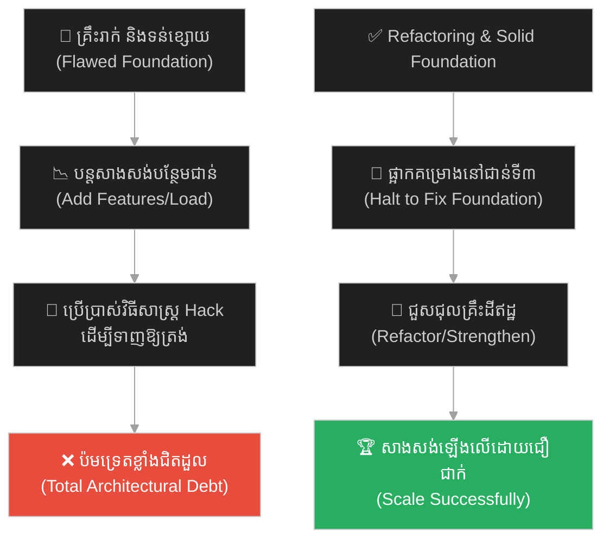
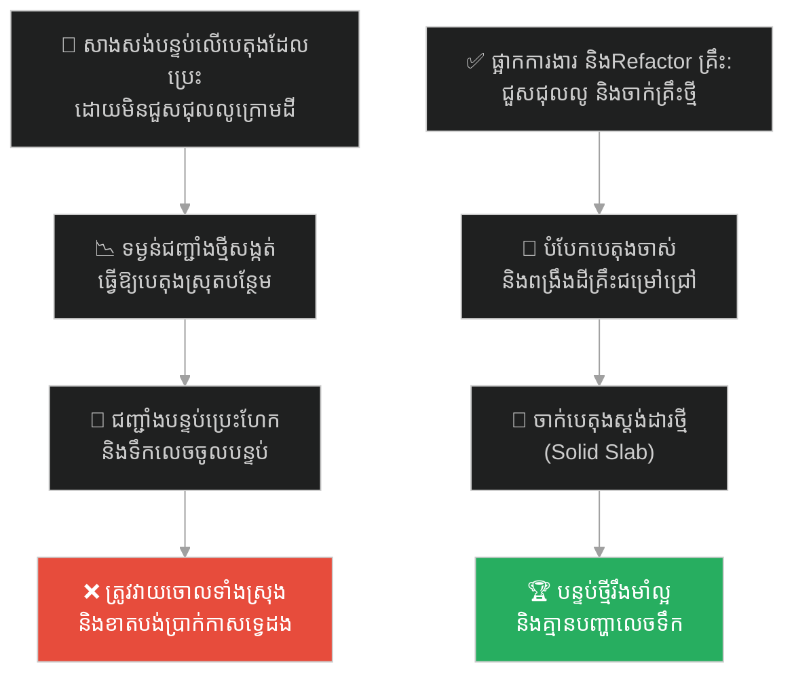
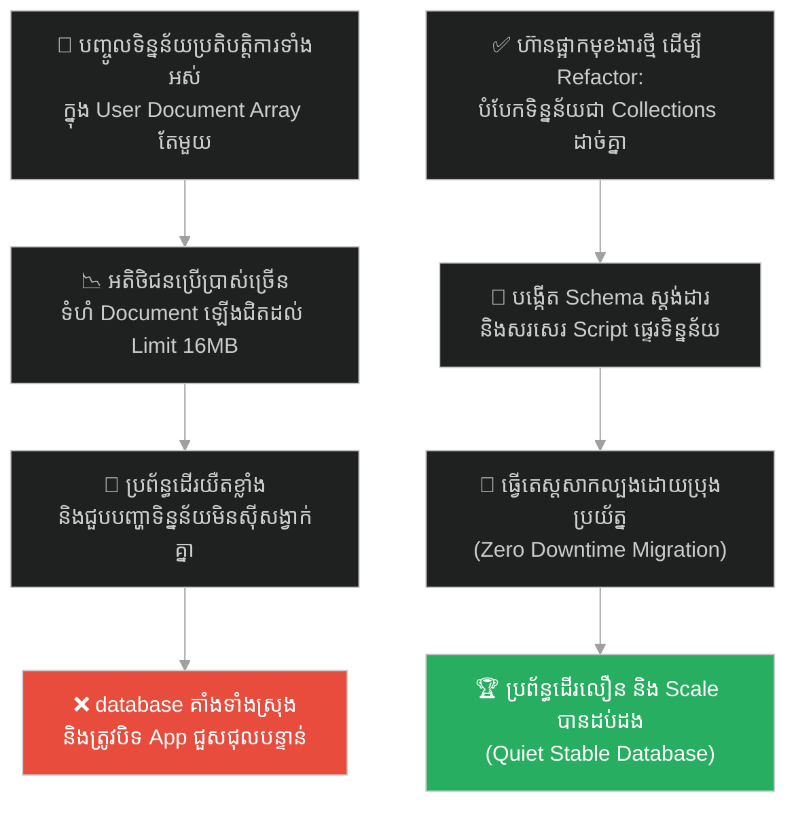
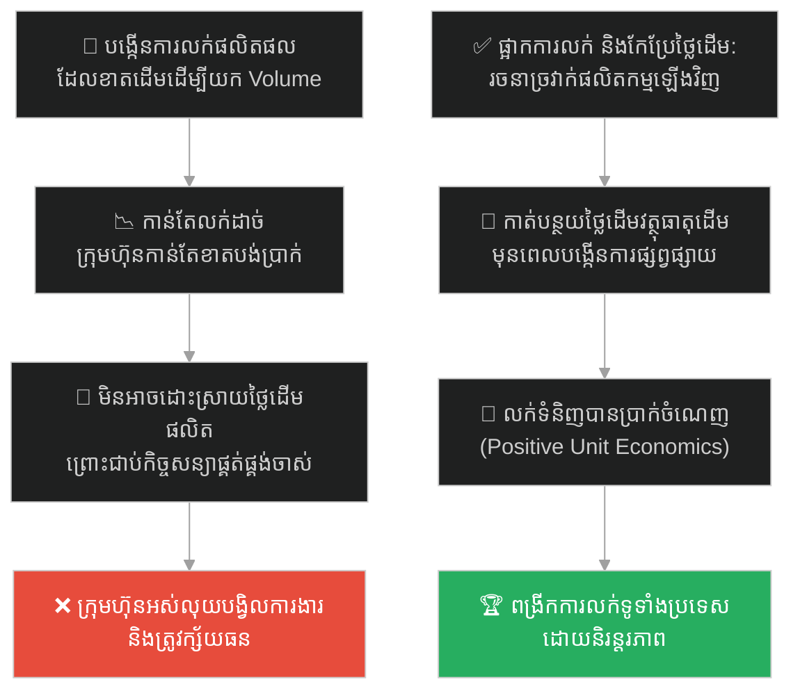
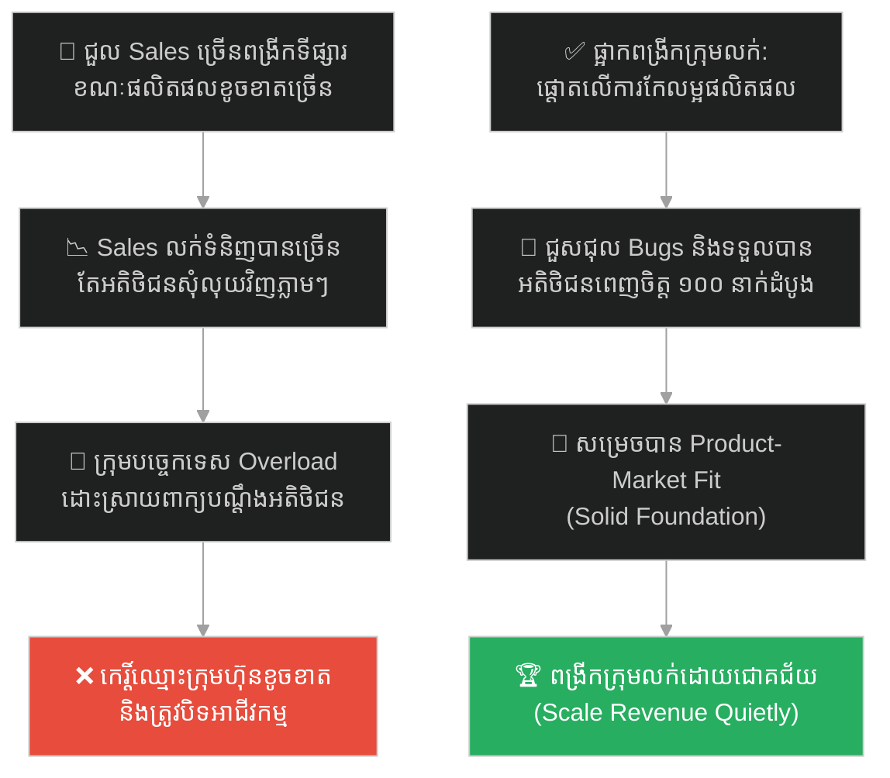
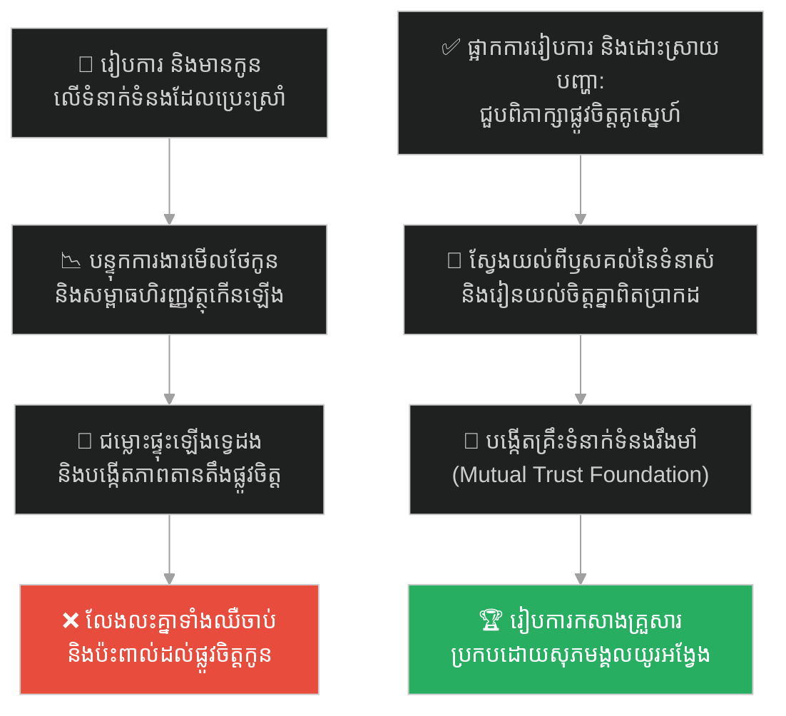
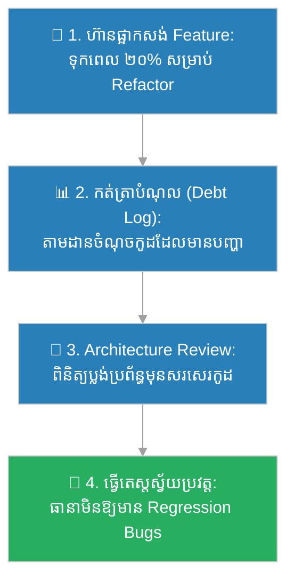

# Architectural Technical Debt (បំណុលបច្ចេកទេសនៃស្ថាបត្យកម្ម)៖ ប៉មភីសា និងគ្រឹះដ៏ទន់ខ្សោយ (Architectural Debt & The Leaning Tower)

**Author:** ichamrong  
**Date:** 2026-05-27  
**Tags:** #tech-debt #architecture #leaning-tower #pisa-foundation #refactoring #system-design #parable  
**Category:** Concepts / Parables  
**Read Time:** ~15 min  

---

## 📌 មាតិកា (Table of Contents)
- [អន្ទាក់ផ្លូវចិត្ត (The Trap)](#0)
- [១. រឿងព្រេងប្រវត្តិសាស្ត្រ៖ ប៉មកណ្តឹងក្រុងភីសា និងកំហុសគ្រឹះដំបូង (The Historic Legend of the Leaning Tower)](#1)
  - [ការបន្ថែមបន្ទុកពីលើ និងការសរសេរកូដប៉ះប៉ូវ (Adding Load & The Cost of Hack)](#1-1)
- [២. បញ្ហា៖ បំណុលបច្ចេកទេសនៃស្ថាបត្យកម្ម និងគ្រោះថ្នាក់នៃ Sunk Cost Fallacy (The Issue: Architectural Debt & Sunk Cost)](#2)
- [៣. ឧទាហរណ៍ជាក់ស្តែងក្នុងពិភពពិត (Real World Examples)](#3)
  - [ឧទាហរណ៍ទី ១ — កម្រិតស្រាល (គ្រួសារ)៖ ការសាងសង់បន្ទប់បន្ថែមលើកម្រាលបេតុងដែលស្រុតលិចទឹក (The Home Extension on Water-Damaged Slab)](#3-1)
  - [ឧទាហរណ៍ទី ២ — កម្រិតមធ្យម (បច្ចេកទេស)៖ ការបន្ថែមមុខងារលើ Database Schema ដែលរចនាខុសតាំងពីដំបូង (The Flawed MongoDB Schema Expansion)](#3-2)
  - [ឧទាហរណ៍ទី ៣ — កម្រិតមធ្យម (ធុរកិច្ច)៖ ការពង្រីកផលិតផលថ្មីលើគំរូហិរញ្ញវត្ថុដែលខាតដើម (The Scaled Product on Negative Margin)](#3-3)
  - [ឧទាហរណ៍ទី ៤ — កម្រិតមធ្យម (សង្គម/គ្រប់គ្រង)៖ ការពង្រីកក្រុមលក់ខណៈពេលផលិតផលមិនទាន់ត្រូវទីផ្សារ (Scaling Sales before Product-Market Fit)](#3-4)
  - [ឧទាហរណ៍ទី ៥ — កម្រិតធ្ងន់ (ទំនាក់ទំនង)៖ ការរៀបការដើម្បីដោះស្រាយវិបត្តិភាពមិនចុះសម្រុងគ្នា (The Marriage Patch for a Broken Bond)](#3-5)
- [៤. ដំណោះស្រាយទូទៅ៖ ការហ៊ានផ្អាកគម្រោងដើម្បីកែសម្រួលគ្រឹះ និងការគ្រប់គ្រង Technical Debt (The General Solution: Refactoring & Architecture Review)](#4)
- [សេចក្តីសន្និដ្ឋាន (Conclusion)](#5)
- [ឯកសារយោង (References)](#6)
- [Related Posts](#7)

---

## អន្ទាក់ផ្លូវចិត្ត (The Trap)

តើអ្នកធ្លាប់ជួបស្ថានភាពដែលអ្នកដឹងច្បាស់ថា "គ្រឹះ ឬរចនាសម្ព័ន្ធដំបូង" នៃគម្រោងរបស់អ្នកមានបញ្ហាឆ្គាំឆ្គង ប៉ុន្តែអ្នកនៅតែបង្ខំចិត្តបន្តទៅមុខ បន្ថែមមុខងារ ឬបន្ទុកការងារពីលើ ព្រោះតែស្តាយពេលវេលា និងថវិកាដែលបានចំណាយរួចហើយ (Sunk Cost) ដែរឬទេ?

នៅក្នុងស្ថាបត្យកម្មប្រព័ន្ធ និងការគ្រប់គ្រង៖
* **យើងងាយនឹងធ្លាក់ក្នុងអន្ទាក់** នៃការប្រើប្រាស់វិធីសាស្ត្រ "Hack (ការដោះស្រាយបណ្តោះអាសន្ន)" ដើម្បីបិទបាំងបញ្ហាគ្រឹះ ដោយសង្ឃឹមថាវានឹងមិនដួលរលំ។
* **យើងមើលរំលង** ការពិតដែលថា ការបន្ថែមបន្ទុកលើគ្រឹះដែលទន់ខ្សោយ នឹងធ្វើឱ្យតម្លៃនៃការជួសជុលនៅពេលក្រោយ កើនឡើងជាលំដាប់លំដោយរហូតដល់មិនអាចគ្រប់គ្រងបាន។

ការបន្តកសាងលើរចនាសម្ព័ន្ធដែលខូចខាតជំនួសឱ្យការកែប្រែគ្រឹះ ហៅថា **អន្ទាក់ Architectural Technical Debt (បំណុលបច្ចេកទេសនៃស្ថាបត្យកម្ម)**។

ដើម្បីយល់ដឹងពីរបៀបដែលប៉មទ្រេតភីសាក្លាយជាមេរៀនបំណុលរាប់រយឆ្នាំ នេះជាផែនទីបង្ហាញផ្លូវសម្រាប់អត្ថបទនេះ៖
1. **រឿងព្រេងប្រវត្តិសាស្ត្រ (The Historic Legend)** — ប្រវត្តិនៃការសាងសង់ប៉មភីសានៅអ៊ីតាលី និងវិធីសាស្ត្រ Hack របស់វិស្វករសម័យនោះ។
2. **បញ្ហា (The Issue)** — ផលប៉ះពាល់នៃបំណុលស្ថាបត្យកម្ម និងគំនិត Sunk Cost Fallacy។
3. **ឧទាហរណ៍ជាក់ស្តែងក្នុងពិភពពិត (Real World Examples)** — ពិនិត្យមើលបំណុលនេះក្នុងកម្រិតគ្រួសារ បច្ចេកវិទ្យា ធុរកិច្ច ការគ្រប់គ្រង និងទំនាក់ទំនង។
4. **ដំណោះស្រាយទូទៅ (The General Solution)** — ការអនុវត្តការ Refactoring គ្រឹះ និងការកំណត់ស្តង់ដារគុណភាព។

---

## ១. រឿងព្រេងប្រវត្តិសាស្ត្រ៖ ប៉មកណ្តឹងក្រុងភីសា និងកំហុសគ្រឹះដំបូង (The Historic Legend of the Leaning Tower)

នៅក្នុងឆ្នាំ ១១៧៣ ទីក្រុងភីសា ប្រទេសអ៊ីតាលី ដែលជាទីក្រុងកំពង់ផែដ៏មានអំណាច និងទ្រព្យសម្បត្តិស្តុកស្តម្ភ បានសម្រេចចិត្តសាងសង់បណ្តុំអគារសាសនាសំខាន់ៗ រួមមាន វិហារធំ បន្ទប់លាងបាប និងប៉មកណ្តឹងដ៏ស្រស់ស្អាតមួយ ដើម្បីបង្ហាញពីភាពរុងរឿងរបស់ខ្លួន។ វិស្វករសម័យនោះ បានចាប់ផ្តើមសាងសង់ **ប៉មភីសា (The Bell Tower of Pisa)** ដែលមានកម្ពស់ ៨ ជាន់ ធ្វើពីថ្មម៉ាបពណ៌សយ៉ាងប្រណីត។

ទោះជាយ៉ាងណា ពួកគេបានធ្វើកំហុសឆ្គងដ៏ធ្ងន់ធ្ងរមួយតាំងពីដំបូង៖
* **គ្រឹះរាក់ពេក៖** ពួកគេបានជីកគ្រឹះជម្រៅត្រឹមតែ **៣ ម៉ែត្រ** ប៉ុណ្ណោះសម្រាប់អគារថ្មម៉ាបដ៏ធ្ងន់បែបនេះ។
* **ដីមិនហាប់ណែន៖** ពួកគេសាងសង់វានៅលើដីឥដ្ឋ ដីខ្សាច់ និងភក់ ដែលជាដីល្បាប់ទឹកទន្លេដ៏ទន់ខ្សោយ និងមិនអាចទ្រទ្រង់ទម្ងន់ធ្ងន់បានឡើយ។

បន្ទាប់ពីសាងសង់រួចរាល់បានត្រឹមតែ ៣ ជាន់ ទម្ងន់ថ្មម៉ាបចាប់ផ្តើមសង្កត់ដីឥដ្ឋខាងក្រោមឱ្យស្រុតចុះ ហើយប៉មទាំងមូលក៏ចាប់ផ្តើម "ទ្រេត" ទៅខាងទិសខាងត្បូង។

---

### ការបន្ថែមបន្ទុកពីលើ និងការសរសេរកូដប៉ះប៉ូវ (Adding Load & The Cost of Hack)

នៅពេលឃើញប៉មចាប់ផ្តើមទ្រេត វិស្វករគួរតែសម្រេចចិត្តវាយកម្ទេចចោល ហើយរៀបចំគ្រឹះឱ្យបានជ្រៅ និងរឹងមាំឡើងវិញ។ ប៉ុន្តែ ដោយសារតែពួកគេស្តាយប្រាក់ និងពេលវេលាដែលបានចំណាយរួចហើយ (Sunk Cost Fallacy) ពួកគេបានសម្រេចចិត្តបន្តសាងសង់ទៅមុខទៀត។

ដើម្បីដោះស្រាយបញ្ហាទ្រេតនេះ ពួកគេបានប្រើវិធីសាស្ត្រ "Hack" មួយ គឺនៅពេលសាងសង់ជាន់បន្ទាប់ៗ (ជាន់ទី ៤ ដល់ទី ៨) ពួកគេបានសាងសង់ជញ្ជាំងនៅចំហៀងដែលទ្រេតឱ្យខ្ពស់ជាងចំហៀងម្ខាងទៀត ដើម្បីទាញទម្ងន់ឱ្យត្រង់មកវិញ។ លទ្ធផលគឺ ប៉មនោះមានរាងកោងដូចផ្លែចេក។

ប៉ុន្តែ នេះគឺជាគំនិតដ៏ល្ងង់ខ្លៅបំផុត! ការបន្ថែមថ្មម៉ាបកាន់តែច្រើន ធ្វើឱ្យប៉មកាន់តែធ្ងន់ ហើយវាកាន់តែសង្កត់ដីឥដ្ឋខាងក្រោមឱ្យស្រុតកាន់តែខ្លាំង។ ប៉មនេះទ្រេតកាន់តែខ្លាំងរហូតដល់ជិតដួលរលំ និងត្រូវផ្អាកការសាងសង់អស់រាប់សិបឆ្នាំម្តងៗ។

ទីបំផុត វាត្រូវការពេលជិត **២០០ ឆ្នាំ** (បញ្ចប់ការសាងសង់នៅឆ្នាំ ១៣៧២) ទើបសាងសង់រួចរាល់ ជាមួយនឹងសភាពទ្រេតយ៉ាងគួរឱ្យខ្លាច។ នៅចុងសតវត្សទី២០ រដ្ឋាភិបាលអ៊ីតាលី ត្រូវផ្អាកមិនឱ្យភ្ញៀវទេសចរឡើង និងត្រូវចំណាយលុយរាប់សិបលានដុល្លារ ព្រមទាំងប្រើប្រាស់វិស្វករកំពូលៗរបស់ពិភពលោក ដើម្បីខួងទាញដីឥដ្ឋចេញពីក្រោមគ្រឹះសន្សឹមៗ ការពារកុំឱ្យវាដួលរលំ។ ពួកគេចំណាយពេលរាប់រយឆ្នាំ ដើម្បីថែទាំកំហុសដែលកើតចេញពីការរចនាគ្រឹះរាក់ដំបូង។

---

## ២. បញ្ហា៖ បំណុលបច្ចេកទេសនៃស្ថាបត្យកម្ម និងគ្រោះថ្នាក់នៃ Sunk Cost Fallacy (The Issue: Architectural Debt & Sunk Cost)

នៅក្នុងវិស្វកម្មសូហ្វវែរ (Software Engineering) ប៉មភីសា គឺជានិមិត្តរូបដ៏ល្អឥតខ្ចោះនៃ **Architectural Technical Debt (បំណុលបច្ចេកទេសនៃស្ថាបត្យកម្ម)**៖
* **ដីឥដ្ឋដ៏ទន់ខ្សោយ (The Soft Clay Foundation)៖** នេះគឺជាពេលដែលអ្នករចនា Database Schema ខុស, ជ្រើសរើស Tech Stack ដែលមិនត្រូវនឹងគម្រោង, ឬរចនា API ខុសតាំងពីដំណាក់កាលដំបូង។
* **ការបន្ថែមជាន់ថ្មម៉ាប (Adding Floors vs. Fixing Foundations)៖** គឺជារាល់មុខងារថ្មីៗ (Features) ដែលត្រូវបានសរសេរបញ្ចូលទៅក្នុងប្រព័ន្ធដោយមិនព្រមដោះស្រាយកូដចាស់ដែលមានបញ្ហា។ នេះធ្វើឱ្យប្រព័ន្ធកាន់តែធ្ងន់ ដើរយឺត និងងាយដួលរលំ។
* **ការសរសេរកូដ Hack (The Banana Walls)៖** គឺការសរសេរកូដ `if-else` ច្រើនជាន់ ឬសរសេរកូដជំនួយស្មុគស្មាញ (Workarounds) ដើម្បីជួសជុលបញ្ហាដែលបណ្តាលមកពី Database រចនាខុស។ វាមិនត្រឹមតែមិនដោះស្រាយឫសគល់បញ្ហាប៉ុណ្ណោះទេ ថែមទាំងធ្វើឱ្យកូដទាំងមូលរញ៉េរញ៉ៃ ពិបាកយល់ និងពិបាកតេស្ត។

មូលហេតុដែលក្រុមហ៊ុនបន្តសាងសង់លើគ្រឹះខូចខាត គឺដោយសារតែ **Sunk Cost Fallacy (ការស្តាយធនធានដែលបានបាត់បង់)**។ ថ្នាក់លើច្រើនតែនិយាយថា៖ *"យើងបានចំណាយពេល ៦ ខែសរសេរវាហើយ យើងមិនអាចបោះចោលដើម្បីសរសេរឡើងវិញបានទេ ចូររកវិធី Hack វាឱ្យដំណើរការទៅ!"*

លទ្ធផលចុងក្រោយគឺ ពួកគេត្រូវចំណាយពេល ៨០% នៃម៉ោងការងារប្រចាំថ្ងៃដើម្បីជួសជុល Bugs និងថែទាំប្រព័ន្ធដែលទ្រេតទ្រោមនោះ ដែលខាតបង់ពេលវេលា និងថវិកាច្រើនជាងការ Refactor តាំងពីជាន់ទី ៣ ទៅទៀត។

---

## ៣. ឧទាហរណ៍ជាក់ស្តែងក្នុងពិភពពិត (Real World Examples)

---

### ឧទាហរណ៍ទី ១ — កម្រិតស្រាល (គ្រួសារ)៖ ការសាងសង់បន្ទប់បន្ថែមលើកម្រាលបេតុងដែលស្រុតលិចទឹក (The Home Extension on Water-Damaged Slab)

គ្រួសារមួយចង់សាងសង់បន្ទប់គេងបន្ថែមមួយនៅចំហៀងផ្ទះ។ មេជាងបានកត់សម្គាល់ឃើញថា កម្រាលបេតុង (Slab) ចាស់នៅកន្លែងនោះ មានការស្រុតបន្តិចបន្តួច និងមានស្នាមប្រេះលិចទឹកដោយសារតែប្រព័ន្ធលូក្រោមដីខូច (គ្រឹះទន់ខ្សោយ)។

ដោយសារចង់សន្សំលុយ ៣,០០០ ដុល្លារសម្រាប់ថ្លៃជួសជុលប្រព័ន្ធលូ និងចាក់បេតុងថ្មី ម្ចាស់ផ្ទះបានប្រាប់ជាងឱ្យសាងសង់ជញ្ជាំងថ្មពីលើកម្រាលចាស់នោះភ្លាមៗ។ 

បន្ទាប់ពីសាងសង់រួចរាល់បាន ៦ ខែ ទម្ងន់ជញ្ជាំងថ្មីបានសង្កត់កម្រាលបេតុងឱ្យស្រុតបន្ថែមយ៉ាងលឿន។ ជញ្ជាំងចាប់ផ្តើមប្រេះហែកចេញពីអគារមេ ទ្វារបន្ទប់បើកមិនរួច ហើយទឹកភ្លៀងលេចចូលតាមស្នាមប្រេះបំផ្លាញគ្រឿងសង្ហារិមទាំងស្រុង។ ទីបំផុត ពួកគេត្រូវបង្ខំចិត្តវាយចោលបន្ទប់នោះទាំងស្រុង ជួសជុលប្រព័ន្ធលូ និងសាងសង់ឡើងវិញ ដែលចំណាយអស់ប្រាក់ទ្វេដង។

---

### ឧទាហរណ៍ទី ២ — កម្រិតមធ្យម (បច្ចេកទេស)៖ ការបន្ថែមមុខងារលើ Database Schema ដែលរចនាខុសតាំងពីដំបូង (The Flawed MongoDB Schema Expansion)

ក្រុមការងារអភិវឌ្ឍន៍សូហ្វវែររបស់ Startup មួយ បានសម្រេចចិត្តប្រើប្រាស់ MongoDB សម្រាប់រក្សាទុកទិន្នន័យប្រតិបត្តិការហិរញ្ញវត្ថុស្មុគស្មាញ ដោយដាក់បញ្ចូល (Embed) ព័ត៌មានប្រតិបត្តិការទាំងអស់ទៅក្នុងឯកសារអ្នកប្រើប្រាស់ (User Document Array) តែមួយ ជំនួសឱ្យការបំបែកជាបណ្តុំឯកសារដាច់ដោយឡែកពីគ្នា (Normalized Collections)។

នៅពេលអាជីវកម្មកើនឡើង អតិថិជនម្នាក់ៗមានប្រតិបត្តិការរាប់ពាន់ដង ធ្វើឱ្យទំហំ User Document ឡើងជិតដល់ដែនកំណត់ ១៦MB របស់ MongoDB។ ប្រព័ន្ធចាប់ផ្តើមដើរយឺតខ្លាំង។ ជំនួសឱ្យការផ្អាកការងារដើម្បីបំបែក Schema (Refactor) ក្រុមការងារបាន Hack ដោយការសរសេរកូដច្របាច់ទិន្នន័យ (Compression) និងលុបទិន្នន័យចាស់ៗចោល។ 

ទីបំផុត ឯកសារទិន្នន័យបានផ្ទុះហួស Limit ធ្វើឱ្យ Database គាំងទាំងស្រុង និងបាត់បង់របាយការណ៍ហិរញ្ញវត្ថុរបស់អតិថិជន។ ពួកគេត្រូវបិទ App រយៈពេល ៣ ថ្ងៃដើម្បីសរសេរទិន្នន័យឡើងវិញទាំងស្រុង។

---

### ឧទាហរណ៍ទី ៣ — កម្រិតមធ្យម (ធុរកិច្ច)៖ ការពង្រីកផលិតផលថ្មីលើគំរូហិរញ្ញវត្ថុដែលខាតដើម (The Scaled Product on Negative Margin)

ក្រុមហ៊ុនលក់ទំនិញអនឡាញមួយ បានបញ្ចេញលក់ផលិតផលថ្មីមួយដោយកាត់បន្ថយតម្លៃលក់ក្រោមថ្លៃដើមផលិត (Negative Margin) ដើម្បីទាក់ទាញអតិថិជនក្នុងដំណាក់កាលដំបូង ដោយរំពឹងថានឹងដោះស្រាយបញ្ហាថ្លៃដើមផលិតនៅពេលក្រោយ (គំរូហិរញ្ញវត្ថុខូចខាត)។

នៅពេលផលិតផលនោះលក់ដាច់ខ្លាំង ថ្នាក់លើបានសម្រេចចិត្តពង្រីកការផ្សព្វផ្សាយ និងជួលបុគ្គលិកបន្ថែមដើម្បីរៀបចំដឹកជញ្ជូន។ ប៉ុន្តែ ដោយសារតែមិនទាន់បានដោះស្រាយបញ្ហាថ្លៃដើមផលិតកម្ម កាន់តែលក់ដាច់ ក្រុមហ៊ុនកាន់តែខាតបង់ប្រាក់។ ពួកគេព្យាយាមតម្លើងថ្លៃលក់ ប៉ុន្តែអតិថិជនបានបដិសេធ និងឈប់ទិញ។ ក្រុមហ៊ុនត្រូវជាប់បំណុលវ័ណ្ឌក និងត្រូវបិទទ្វារ ព្រោះតែការពង្រីកអាជីវកម្មលើគំរូហិរញ្ញវត្ថុដែលគ្មានតុល្យភាព។

---

### ឧទាហរណ៍ទី ៤ — កម្រិតមធ្យម (សង្គម/គ្រប់គ្រង)៖ ការពង្រីកក្រុមលក់ខណៈពេលផលិតផលមិនទាន់ត្រូវទីផ្សារ (Scaling Sales before Product-Market Fit)

ប្រធានក្រុមហ៊ុនម្នាក់ បានសម្រេចចិត្តជ្រើសរើសបុគ្គលិកលក់ (Sales Reps) ចំនួន ៥០ នាក់បន្ថែមភ្លាមៗ ដើម្បីបង្កើនចំណូលរបស់ក្រុមហ៊ុន ទោះបីជាផលិតផលស្នូលរបស់ក្រុមហ៊ុននៅមាន Bugs ច្រើន និងមិនទាន់មានអតិថិជនណាម្នាក់ពេញចិត្តប្រើប្រាស់ពិតប្រាកដ (Product-Market Fit) ក៏ដោយ។

ក្រុមលក់បានប្រឹងប្រែងបញ្ចុះបញ្ចូលអតិថិជនឱ្យទិញផលិតផលបានយ៉ាងច្រើន។ ប៉ុន្តែ នៅពេលអតិថិជនយកទៅប្រើប្រាស់ ពួកគេជួបបញ្ហាគាំង និងខុសតម្រូវការការងារ រហូតនាំគ្នាឈប់ប្រើ និងទាមទារប្រាក់ត្រឡប់មកវិញ (Churn Rate ខ្ពស់)។ ក្រុមបច្ចេកទេសត្រូវចំណាយពេលទាំងអស់ដើម្បីដោះស្រាយពាក្យបណ្តឹង និង Bugs បន្ទាន់ ដោយគ្មានពេលកែលម្អរចនាសម្ព័ន្ធផលិតផលឡើយ។ ក្រុមហ៊ុនត្រូវខាតបង់ប្រាក់ខែក្រុមលក់ដ៏ច្រើន និងខូចឈ្មោះក្នុងទីផ្សារទាំងស្រុង។

---

### ឧទាហរណ៍ទី ៥ — កម្រិតធ្ងន់ (ទំនាក់ទំនង)៖ ការរៀបការដើម្បីដោះស្រាយវិបត្តិភាពមិនចុះសម្រុងគ្នា (The Marriage Patch for a Broken Bond)

គូស្នេហ៍មួយគូដែលមានវិបត្តិទំនាស់ និងមិនទុកចិត្តគ្នាទៅវិញទៅមកជាប្រចាំ (គ្រឹះទំនាក់ទំនងទន់ខ្សោយ) បានសម្រេចចិត្ត "រៀបការ និងមានកូនភ្លាមៗ" ដោយសង្ឃឹមថាចំណងអាពាហ៍ពិពាហ៍ និងវត្តមានរបស់កូន នឹងជួយសម្របសម្រួលទំនាស់ និងធ្វើឱ្យពួកគេស្រឡាញ់គ្នាវិញ (យុទ្ធសាស្ត្រ Hack)។

បន្ទាប់ពីរៀបការរួច សម្ពាធហិរញ្ញវត្ថុ និងការនឿយហត់ពីការមើលថែទាំទារកទើបនឹងកើត បានបន្ថែមបន្ទុកយ៉ាងធ្ងន់ធ្ងរលើពួកគេ។ ទំនាស់ចាស់ៗមិនត្រូវបានដោះស្រាយ បូករួមនឹងភាពតានតឹងថ្មី ធ្វើឱ្យជម្លោះផ្ទុះឡើងកាន់តែខ្លាំងក្លាជាងមុន។ ពួកគេលែងនិយាយរកគ្នា ហើយទីបំផុតត្រូវលែងលះគ្នាទាំងឈឺចាប់បំផុត ព្រមទាំងបន្សល់ទុកនូវផលប៉ះពាល់ផ្លូវចិត្តយ៉ាងធ្ងន់ធ្ងរដល់កូនៗ។

ការសាងសង់ជាន់ថ្មីនៃជីវិត (អាពាហ៍ពិពាហ៍) លើគ្រឹះដែលប្រេះស្រាំ មិនអាចសង្គ្រោះទំនាក់ទំនងបានឡើយ គឺមានតែបង្កើនការខូចខាតទ្វេដងប៉ុណ្ណោះ។

---

## ៤. ដំណោះស្រាយទូទៅ៖ ការហ៊ានផ្អាកគម្រោងដើម្បីកែសម្រួលគ្រឹះ និងការគ្រប់គ្រង Technical Debt (The General Solution: Refactoring & Architecture Review)

ដើម្បីវាយបំបែកបំណុលបច្ចេកទេសនៃស្ថាបត្យកម្ម យើងត្រូវមាន "ភាពក្លាហាន និងវិន័យបច្ចេកទេស" ក្នុងការអនុវត្តដំណោះស្រាយខាងក្រោម៖

ជំហាននៃការអនុវត្ត៖
1. **គោលការណ៍ ២០% សម្រាប់ Refactoring (The 20% Rule)៖** កុំរង់ចាំរហូតដល់ប្រព័ន្ធគាំងទាំងស្រុង ទើបចាប់ផ្តើមជួសជុល។ ក្នុងរាល់វដ្តការងារ (Sprint) ត្រូវបែងចែកធនធាន ២០% សម្រាប់ធ្វើការសម្អាតកូដ ជួសជុលគ្រឹះ Database និង Refactor ផ្នែកដែលស្មុគស្មាញ។
2. **ហ៊ាននិយាយថា 'ទេ' ទៅកាន់ការពង្រីកខុសគោលដៅ (Halt to Strengthen)៖** នៅពេលដឹងថាគ្រឹះមានបញ្ហាឆ្គាំឆ្គង អ្នកដឹកនាំបច្ចេកទេសត្រូវតែមានភាពក្លាហានពន្យល់ទៅកាន់ថ្នាក់គ្រប់គ្រងថា "យើងត្រូវផ្អាកការបញ្ចេញ Feature ថ្មីរយៈពេល ១ ខែ ដើម្បី Refactor គ្រឹះ បើមិនដូច្នោះទេ គម្រោងទាំងមូលនឹងដួលរលំនៅពេលក្រោយ"។
3. **កត់ត្រាបំណុលបច្ចេកទេស (Maintain a Tech Debt Backlog)៖** បង្កើតតារាងតាមដានកូដ ឬស្ថាបត្យកម្មណាខ្លះដែលត្រូវបានសរសេរឡើងដោយការ Hack បណ្តោះអាសន្ន។ កំណត់អាទិភាពដើម្បីវាយកម្ទេចពួកវាចោលនៅពេលក្រោយ។
4. **កសាងការសាកល្បងស្វ័យប្រវត្ត (Automated Test Suite)៖** មុននឹងចាប់ផ្តើម Refactor គ្រឹះ ត្រូវប្រាកដថាអ្នកមានកូដតេស្តស្វ័យប្រវត្តិ (Integration Tests) គ្រប់គ្រាន់ ដើម្បីធានាថាការផ្លាស់ប្តូរគ្រឹះខាងក្រោម មិនធ្វើឱ្យមុខងារល្អៗនៅខាងលើបាក់បែក (No Regression)។

---

## 🐇 ធ្លាក់ចូលក្នុងរន្ធទន្សាយ (Enter the Rabbit Hole)

ដើម្បីស្វែងយល់កាន់តែស៊ីជម្រៅអំពីគ្រោះថ្នាក់នៃការបង្កើត "ឧបករណ៍តែមួយដែលព្យាយាមធ្វើការងារគ្រប់យ៉ាង" (កាំបិតស្វីស) រហូតក្លាយជាអគារយក្សដែលគ្មានឯករាជ្យភាព និងពិបាកថែទាំបំផុត (The God Object Anti-pattern) សូមបន្តដំណើររុករករបស់អ្នកទៅកាន់៖

* 🚀 **[ចាប់ផ្តើមដំណើររុករក (Start the Journey) ➔ The Swiss Army Knife and the God Object](./64-the-swiss-army-knife.md)**

---

## សេចក្តីសន្និដ្ឋាន (Conclusion)

> **«គ្រឹះដ៏ល្អ គឺជាការធានាតែមួយគត់សម្រាប់អគារខ្ពស់។ កុំស្តាយខាតពេលបច្ចុប្បន្នដើម្បី Refactor ព្រោះវាជាការសន្សំពេលវេលារាប់រយដងសម្រាប់អនាគត។»**

ការសាងសង់ប្រព័ន្ធ ឬអាជីវកម្មប្រៀបដូចជាការកសាងអគារខ្ពស់ដូច្នោះដែរ។ ភាពល្អឥតខ្ចោះនៃរឿងរ៉ាវនៅខាងលើ គ្មានន័យអ្វីឡើយ ប្រសិនបើវាត្រូវបានសាងសង់នៅលើគ្រឹះដីឥដ្ឋដ៏ទន់ខ្សោយជម្រៅ ៣ ម៉ែត្រ។ ចូរមានភាពក្លាហានដើម្បីផ្អាកគម្រោង ហ៊ានវាយកម្ទេចកូដដែល Hack ចោល ហើយកសាងគ្រឹះបច្ចេកវិទ្យាឱ្យបានរឹងមាំ ដើម្បីទ្រទ្រង់ការ Scale ដ៏រលូនទៅថ្ងៃអនាគត។

---

## ឯកសារយោង (References)

* **Martin Fowler** — *Refactoring: Improving the Design of Existing Code* (2nd Edition, 2018). សៀវភៅគោលណែនាំពីរបៀប Refactor កូដ និងស្ថាបត្យកម្មប្រកបដោយសុវត្ថិភាព។
* **Piero Pierotti** — *The History of the Tower of Pisa: Anatomy of a Monument* (2001). ការវិភាគប្រវត្តិសាស្ត្រ និងវិស្វកម្មនៃការទ្រេតរបស់ប៉មភីសា។
* **Robert C. Martin** — *Clean Architecture: A Craftsman's Guide to Software Structure and Design* (2017). គោលការណ៍រចនាគ្រឹះប្រព័ន្ធសូហ្វវែរឱ្យរឹងមាំ និងងាយស្រួល Refactor។

---

## Related Posts

* **[55 The Tower of Pisa: Technical Debt and Bad Foundations](../articles/55-the-tower-of-pisa-and-tech-debt.md)** — អត្ថបទបកស្រាយលម្អិតអំពីគ្រោះថ្នាក់នៃ Sunk Cost Fallacy នៅក្នុងការអភិវឌ្ឍន៍សូហ្វវែរ។
* **[44 Alexander the Great and the Gordian Knot](./44-the-gordian-knot.md)** — ការហ៊ានប្រើប្រាស់វិធានការដាច់ខាតកាត់ផ្តាច់ភាពស្មុគស្មាញ និងបញ្ហាដែលអូសបន្លាយ។
* **[57-the-monster-of-tech-debt.md](./57-the-monster-of-tech-debt.md)** — របៀបដែលបំណុលបច្ចេកទេសតូចៗ បូកបញ្ចូលគ្នាក្លាយជាបិសាច Frankenstein ដ៏គួរឱ្យខ្លាចនៅក្នុង codebase។

---

## Related

- [💡 Concepts README](../README.md)
- [📚 Main Repository README](../../../README.md)
- [Developer Habits](../../developer-habits/README.md)
- [Mental Health & Well-being](../../mental-health/README.md)
- [Management & SDLC](../../management/README.md)
