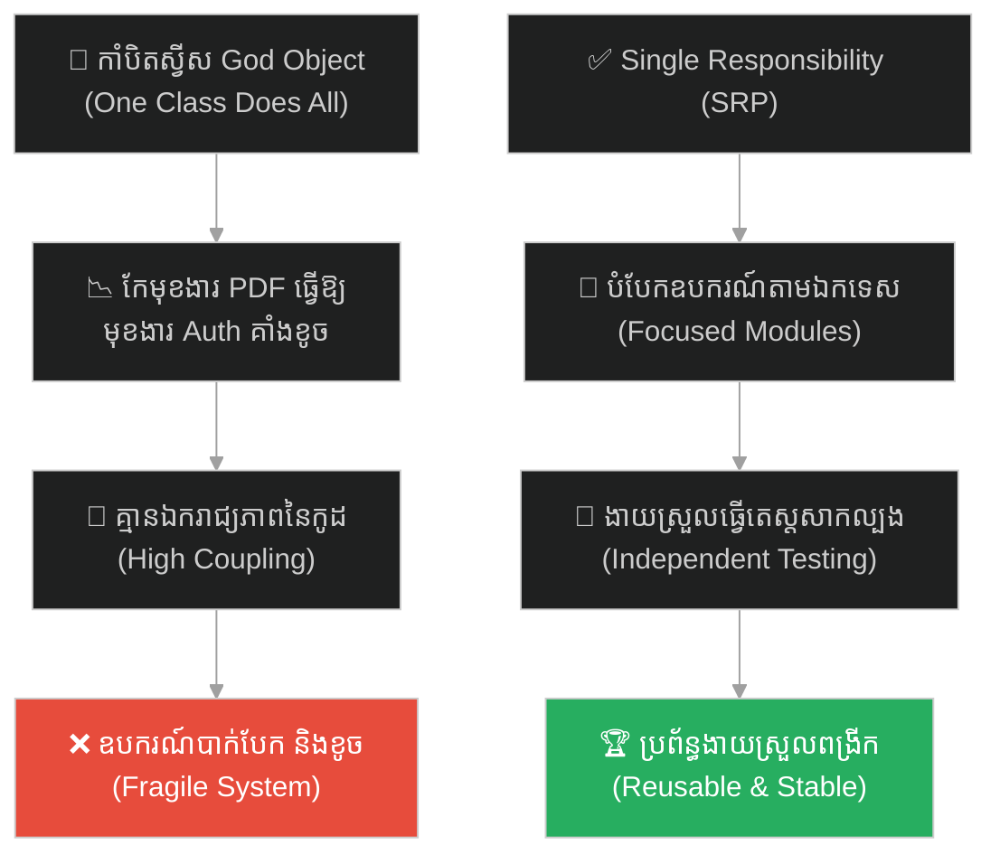
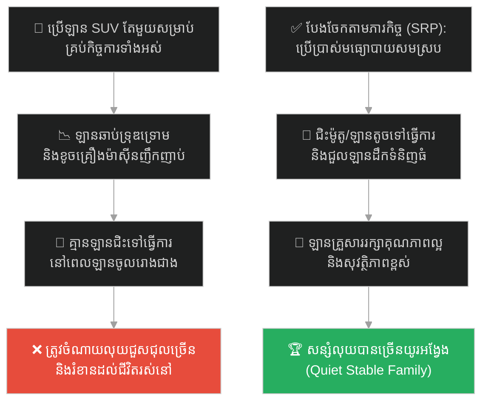
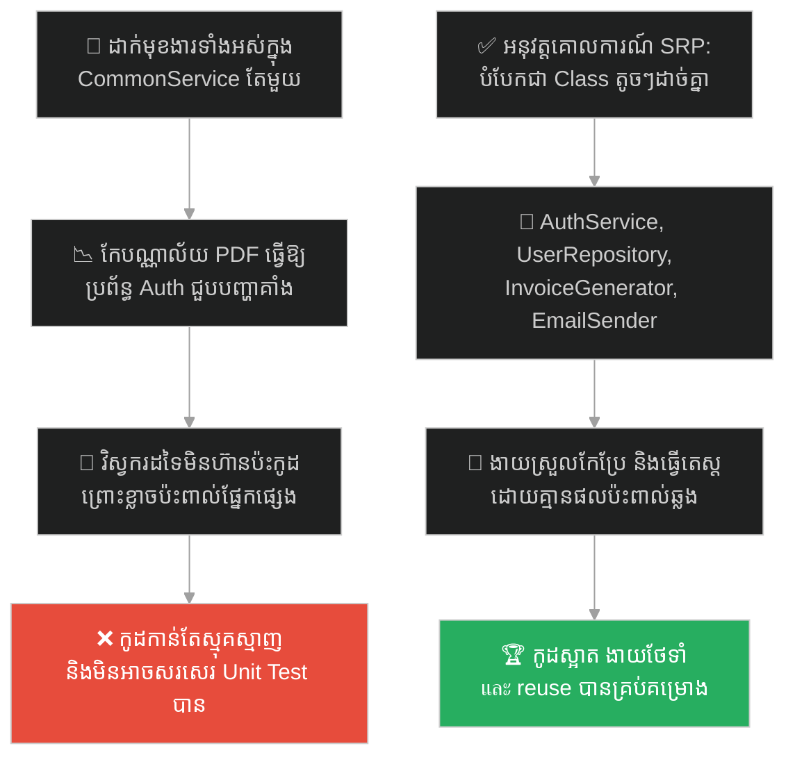
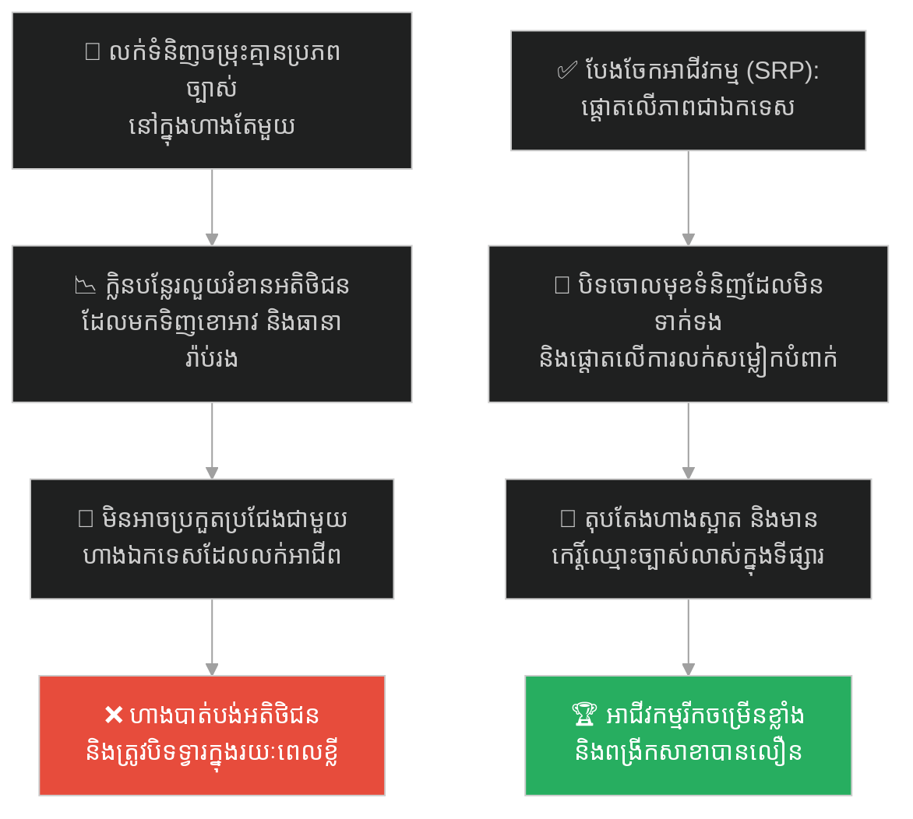
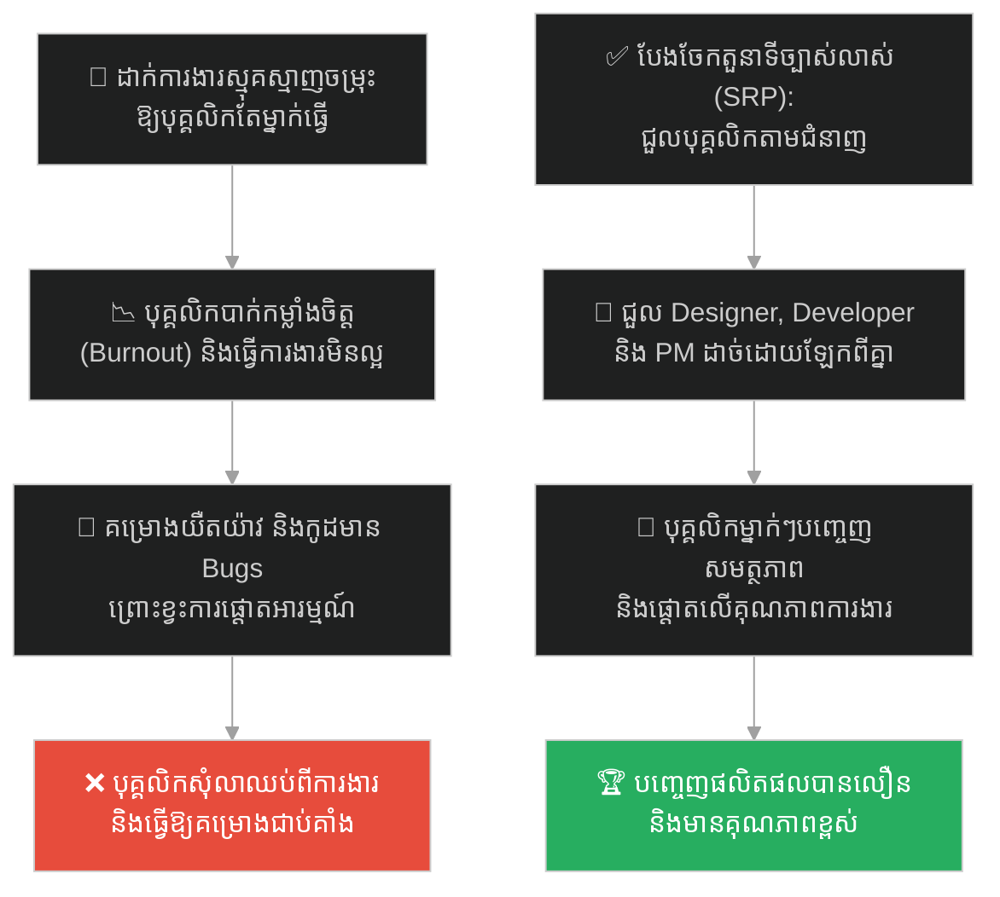
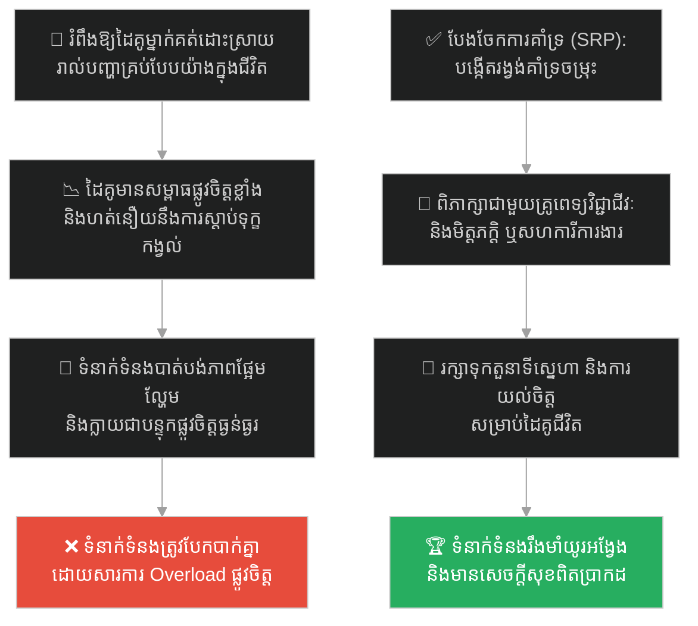
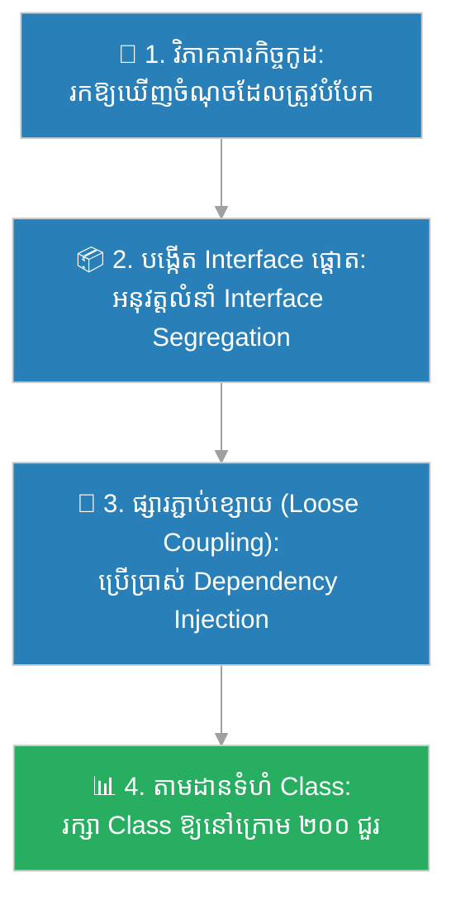

# Single Responsibility Principle (គោលការណ៍ភារកិច្ចតែមួយ)៖ កាំបិតស្វីស និងជាងសំណង់ឯក (Single Responsibility & The Swiss Army Knife)

**Author:** ichamrong  
**Date:** 2026-05-27  
**Tags:** #single-responsibility #srp #god-object #anti-pattern #clean-code #modularity #oop #parable  
**Category:** Concepts / Parables  
**Read Time:** ~15 min  

---

## 📌 មាតិកា (Table of Contents)
- [អន្ទាក់ផ្លូវចិត្ត (The Trap)](#0)
- [១. រឿងព្រេងប្រៀបធៀប៖ បុរសលង់កាំបិតស្វីស និងជាងសំណង់ឯក (The Parable of the Swiss Army Knife)](#1)
  - [ការសាងសង់ផ្ទះឈើ និងការខូចខាតឧបករណ៍ (Building the House & Broken Tool)](#1-1)
- [២. បញ្ហា៖ គ្រោះថ្នាក់នៃ The God Object និងអត្ថប្រយោជន៍នៃ Modularity (The Issue: God Object & Cohesion)](#2)
- [៣. ឧទាហរណ៍ជាក់ស្តែងក្នុងពិភពពិត (Real World Examples)](#3)
  - [ឧទាហរណ៍ទី ១ — កម្រិតស្រាល (គ្រួសារ)៖ ការប្រើប្រាស់ឡានតែមួយសម្រាប់ដឹកទំនិញ ធ្វើដំណើរ និងបោះតង់ (The Multi-Purpose Family Car Trap)](#3-1)
  - [ឧទាហរណ៍ទី ២ — កម្រិតមធ្យម (បច្ចេកទេស)៖ Class ជំនួយការរួមដែលធ្វើការងារ Auth, PDF និង DB (The Common Utils Class God Object)](#3-2)
  - [ឧទាហរណ៍ទី ៣ — កម្រិតមធ្យម (ធុរកិច្ច)៖ ហាងលក់រាយដែលលក់សម្លៀកបំពាក់ បន្លែ និងសេវាធានារ៉ាប់រង (The Unfocused General Store Failure)](#3-3)
  - [ឧទាហរណ៍ទី ៤ — កម្រិតមធ្យម (សង្គម/គ្រប់គ្រង)៖ ការជួលបុគ្គលិកម្នាក់ឱ្យធ្វើជា Designer, Coder និង PM (The Overburdened Full-Stack Generalist)](#3-4)
  - [ឧទាហរណ៍ទី ៥ — កម្រិតធ្ងន់ (ទំនាក់ទំនង)៖ ការរំពឹងថាដៃគូម្នាក់ធ្វើជាគូស្នេហ៍ គ្រូពេទ្យផ្លូវចិត្ត និងមិត្តរួមការងារ (The All-in-One Partner Expectation)](#3-5)
- [៤. ដំណោះស្រាយទូទៅ៖ ការអនុវត្តគោលការណ៍ Single Responsibility និងការបំបែក Cohesion (The General Solution: Separation of Concerns & Focused Modules)](#4)
- [សេចក្តីសន្និដ្ឋាន (Conclusion)](#5)
- [ឯកសារយោង (References)](#6)
- [Related Posts](#7)

---

## អន្ទាក់ផ្លូវចិត្ត (The Trap)

តើអ្នកធ្លាប់បង្កើត "ថ្នាក់ ឬសេវាកម្ម (Class/Service)" មួយនៅក្នុងកម្មវិធីរបស់អ្នក ដែលវាអាចធ្វើការងារបានគ្រប់យ៉ាង (ដូចជា ផ្ទៀងផ្ទាត់សិទ្ធិ ទាញទិន្នន័យ ផ្ញើអ៊ីមែល និងគណនាគណិតវិទ្យា) តែនៅពេលអ្នកចង់កែប្រែមុខងារមួយ ស្រាប់តែវាធ្វើឱ្យមុខងារដទៃទៀតគាំងខូចទាំងស្រុងដែរឬទេ?

នៅក្នុងរចនាសម្ព័ន្ធកូដ និងការគ្រប់គ្រងស្ថាប័ន៖
* **យើងងាយនឹងធ្លាក់ក្នុងអន្ទាក់** នៃការចង់បង្កើត "ឧបករណ៍ចម្រុះតែមួយ (Swiss Army Knife)" ព្រោះវាផ្តល់ភាពងាយស្រួល និងរហ័សនៅដំណាក់កាលដំបូង។
* **យើងមើលរំលង** គ្រោះថ្នាក់នៃការផ្សារភ្ជាប់គ្នាខ្លាំងពេក (High Coupling) និងការខ្វះការផ្តោតភារកិច្ច (Low Cohesion) ដែលធ្វើឱ្យប្រព័ន្ធបាត់បង់ភាពបត់បែន និងងាយផុយស្រួយ។

ការបញ្ចូលភារកិច្ចចម្រុះដែលគ្មានការទាក់ទងគ្នាទៅក្នុងម៉ូឌុលតែមួយ ហៅថា **អន្ទាក់ God Object (អន្ទាក់វត្ថុព្រះជាម្ចាស់)**។

ដើម្បីយល់ដឹងពីរបៀបដែលការបំបែកភារកិច្ចជួយកសាងផ្ទះបានលឿនជាងមុនដប់ដង នេះជាផែនទីបង្ហាញផ្លូវសម្រាប់អត្ថបទនេះ៖
1. **រឿងព្រេងប្រៀបធៀប (The Comparative Parable)** — រឿងប្រៀបធៀបរវាងបុរសប្រើកាំបិតស្វីស និងជាងសំណង់ប្រើប្រអប់ឧបករណ៍ឯកទេស។
2. **បញ្ហា (The Issue)** — យន្តការរបស់ God Object និងគោលការណ៍ Single Responsibility Principle (SRP)។
3. **ឧទាហរណ៍ជាក់ស្តែងក្នុងពិភពពិត (Real World Examples)** — ពិនិត្យមើលអន្ទាក់នេះក្នុងកម្រិតគ្រួសារ បច្ចេកវិទ្យា ធុរកិច្ច ការគ្រប់គ្រង និងទំនាក់ទំនង។
4. **ដំណោះស្រាយទូទៅ (The General Solution)** — ការអនុវត្តការបំបែកការព្រួយបារម្ភ (Separation of Concerns) និងការសរសេរកូដផ្តោតការងារ។

---

## ១. រឿងព្រេងប្រៀបធៀប៖ បុរសលង់កាំបិតស្វីស និងជាងសំណង់ឯក (The Parable of the Swiss Army Knife)

មានបុរសម្នាក់បានចូលទៅក្នុងហាងលក់សម្ភារៈសំណង់ ហើយបានទិញ **កាំបិតស្វីស (Swiss Army Knife)** ដ៏ប្រណីតមួយដើម។ គាត់មានការរំភើប និងស្ញប់ស្ញែងយ៉ាងខ្លាំងចំពោះភាពអស្ចារ្យរបស់វា។ ឧបករណ៍តូចមួយនេះមានកាំបិតមុតស្រួច មានកន្ត្រៃតូច មានទួណឺវីសតូច មានដបបើកគម្រប និងមានសូម្បីតែឧបករណ៍អារឈើតូចមួយនៅជាប់នឹងខ្លួន។

គាត់បានលាន់មាត់ប្រាប់ខ្លួនឯងថា៖ 

> **«ឧបករណ៍នេះគឺជាអព្ភូតហេតុ! ខ្ញុំលែងត្រូវការប្រអប់ឧបករណ៍ធ្ងន់ៗទៀតហើយ ព្រោះរបស់តែមួយនេះអាចធ្វើបានគ្រប់ការងារទាំងអស់ក្នុងលោក!»**

---

### ការសាងសង់ផ្ទះឈើ និងការខូចខាតឧបករណ៍ (Building the House & Broken Tool)

ដោយសារការគិតបែបនេះ គាត់បានសម្រេចចិត្ត "សាងសង់ផ្ទះឈើមួយខ្នង" នៅក្នុងចម្ការរបស់គាត់ ដោយប្រើប្រាស់តែកាំបិតស្វីសមួយដើមនេះប៉ុណ្ណោះ៖
* **អារឈើធំ៖** គាត់បានទាញកាំបិតអារឈើប្រវែង ៥ សង់ទីម៉ែត្ររបស់កាំបិតស្វីស មកអារឈើទំហំធំ។ គាត់ត្រូវចំណាយពេលរាប់សប្តាហ៍ និងកម្លាំងកាយយ៉ាងខ្លាំង ទើបអារឈើដាច់បានមួយដើម។
* **ដំដែកគោល៖** ដោយសារគ្មានញញួរ គាត់បានយកដងកាំបិតស្វីសមកដំដែកគោលចូលទៅក្នុងសសរ។ លទ្ធផលគឺ ដែកគោលវៀចវេរ ហើយដងកាំបិតដ៏ស្អាតនោះបានប្រេះបែក។
* **មួលខ្ចៅធំ៖** គាត់បានប្រើទួណឺវីសតូចរបស់កាំបិតស្វីស ដើម្បីមួលខ្ចៅធំៗ ដែលធ្វើឱ្យទួណឺវីសវៀចទ្រង់ទ្រាយ និងពងដៃរបស់គាត់រហូតដល់ហូរឈាម។

ក្រោយរយៈពេល ៣ ឆ្នាំ ផ្ទះឈើរបស់គាត់ត្រូវបានសាងសង់រួចរាល់ ប៉ុន្តែវាមានសភាពវៀចវេរ មិនរឹងមាំឡើយ។ ជាងនេះទៅទៀត កាំបិតស្វីសដ៏មានតម្លៃរបស់គាត់ ត្រូវបានបាក់បែក និងវៀចខ្ទេចខ្ទីអស់សន្លាក់រៀងៗខ្លួន។ គាត់មិនអាចយកវាទៅប្រើសម្រាប់ចិត្តផ្លែឈើ ឬបើកគម្របដបបានទៀតឡើយ។

នៅក្បែរចម្ការនោះ មានជាងសំណង់ម្នាក់ទៀត។ គាត់មិនប្រើកាំបិតស្វីសទេ។ គាត់មានប្រអប់ឧបករណ៍មួយដែលមាន៖ **រណារធំមួយ (សម្រាប់តែអារឈើ), ញញួរដែកធំមួយ (សម្រាប់តែដំដែកគោល), និងម៉ាស៊ីនខួងខ្ចៅមួយ (សម្រាប់តែមួលខ្ចៅ)**។ 

ឧបករណ៍នីមួយៗរបស់ជាងសំណង់រូបនេះ អាចធ្វើការងារបានតែ **"មួយមុខគត់"** ប៉ុន្តែវាធ្វើការងារនោះបានយ៉ាងល្អឥតខ្ចោះ និងលឿនបំផុត។ គាត់សាងសង់ផ្ទះឈើដ៏ធំ និងរឹងមាំមួយខ្នង រួចរាល់ក្នុងរយៈពេលត្រឹមតែ ២ ខែប៉ុណ្ណោះ ដោយគ្មានការរងរបួស ឬខូចខាតឧបករណ៍ឡើយ។

---

## ២. បញ្ហា៖ គ្រោះថ្នាក់នៃ The God Object និងអត្ថប្រយោជន៍នៃ Modularity (The Issue: God Object & Cohesion)

នៅក្នុងការរចនាប្រព័ន្ធសូហ្វវែរ កាំបិតស្វីសគឺជាតំណាងឱ្យ **The God Object (វត្ថុព្រះជាម្ចាស់)** ឬ **God Class**។ នេះជាការរំលោភលើគោលការណ៍ទីមួយនៃ SOLID គឺ **Single Responsibility Principle (SRP - គោលការណ៍ភារកិច្ចតែមួយ)** ដែលចែងថា៖

> **«A class should have one, and only one, reason to change.»**  
> *(ថ្នាក់មួយ គួរតែមានមូលហេតុតែមួយគត់ដើម្បីផ្លាស់ប្តូរ)*

គ្រោះថ្នាក់នៃ God Object៖
1. ** High Coupling (ការទាក់ទងគ្នាស្អិតរមួត)៖** នៅពេលដែលកូដខុសគ្នា (ដូចជា ការបង្ហាញក្រាហ្វិក និងការទាញទិន្នន័យពី DB) នៅប្រមូលផ្តុំគ្នាក្នុង Class តែមួយ ការផ្លាស់ប្តូរកូដមួយចំណុច អាចធ្វើឱ្យផ្នែកផ្សេងទៀតដែលមិនទាក់ទងគ្នា ជួបបញ្ហាគាំងខូចភ្លាមៗ (ដូចការយកដងកាំបិតទៅដំដែកគោល ធ្វើឱ្យបាក់ឡាមកន្ត្រៃ)។
2. **Low Cohesion (ការខ្វះការផ្តោត)៖** កូដនៅក្នុង Class មិនសហការគ្នាដើម្បីដោះស្រាយបញ្ហាតែមួយនោះទេ ធ្វើឱ្យវាពិបាកយល់ ពិបាកថែទាំ និងពិបាកសរសេរកូដតេស្តសាកល្បង (Unit Tests)។
3. **ពិបាកយកទៅប្រើឡើងវិញ (Not Reusable)៖** បើអ្នកចង់យកមុខងារ "ទូទាត់លុយ" ទៅប្រើក្នុងគម្រោងថ្មី អ្នកត្រូវតែលីទាំងកូដ "បង្កើត PDF" និង "ផ្ញើអ៊ីមែល" ទៅជាមួយដែរ ព្រោះវាជាប់គ្នាក្នុង Class តែមួយ។

ដំណោះស្រាយគឺការធ្វើខ្លួនជាជាងសំណង់៖ បំបែកប្រព័ន្ធជាម៉ូឌុល (Modules) តូចៗ ដែលម៉ូឌុលនីមួយៗមានភារកិច្ចតែមួយច្បាស់លាស់។

---

## ៣. ឧទាហរណ៍ជាក់ស្តែងក្នុងពិភពពិត (Real World Examples)

---

### ឧទាហរណ៍ទី ១ — កម្រិតស្រាល (គ្រួសារ)៖ ការប្រើប្រាស់ឡានតែមួយសម្រាប់ដឹកទំនិញ ធ្វើដំណើរ និងបោះតង់ (The Multi-Purpose Family Car Trap)

គ្រួសារមួយចង់សន្សំលុយ ដូច្នេះពួកគេទិញឡាន SUV តែមួយសម្រាប់គ្រប់កិច្ចការ៖ ដឹកទំនិញធុនធ្ងន់ទៅលក់នៅផ្សារ ជិះទៅធ្វើការប្រចាំថ្ងៃ និងបើកទៅបោះតង់ផ្លូវភក់ល្បាប់ (Off-road)។

លទ្ធផលគឺ ឡាននោះឆាប់ទ្រុឌទ្រោម ប្រឡាក់ក្លិនបន្លែ និងធូរចង្កូតដោយសារការដឹកធ្ងន់។ នៅពេលឡានត្រូវបញ្ជូនទៅរោងជាងជួសជុលរយៈពេល ១ សប្តាហ៍ គ្រួសារទាំងមូលត្រូវជាប់គាំង គ្មានមធ្យោបាយធ្វើដំណើរទៅធ្វើការ ឬដឹកទំនិញទៅលក់ឡើយ ធ្វើឱ្យបាត់បង់ចំណូល។

ដំណោះស្រាយគឺការអនុវត្ត SRP៖ ប្រើឡានតូចសម្រាប់ធ្វើការ ជួលឡានដឹកទំនិញធំនៅពេលត្រូវការដឹកអីវ៉ាន់ និងជៀសវាងការយកឡានគ្រួសារទៅបើកកាត់ភក់ធ្ងន់ៗ។

---

### ឧទាហរណ៍ទី ២ — កម្រិតមធ្យម (បច្ចេកទេស)៖ Class ជំនួយការរួមដែលធ្វើការងារ Auth, PDF និង DB (The Common Utils Class God Object)

Developer ម្នាក់បានបង្កើត Class មួយឈ្មោះថា `CommonService`។ នៅក្នុងនោះ គាត់បានសរសេរកូដ៖
1. ផ្ទៀងផ្ទាត់ Token របស់ User (`validateToken`)
2. ទាញទិន្នន័យអតិថិជនពី MySQL (`getUserData`)
3. បង្កើតឯកសារវិក្កយបត្រជា PDF (`generateInvoicePDF`)
4. ផ្ញើអ៊ីមែលទៅកាន់អតិថិជន (`sendEmail`)

នៅពេលបណ្ណាល័យ PDF (PDF Library) ត្រូវបានតម្លើងជំនាន់ថ្មី (Upgrade) វាបានផ្លាស់ប្តូរ Parameter ខ្លះៗ។ ដោយសារតែកូដទាំងអស់នៅក្នុង `CommonService` ជាប់គ្នា វិស្វករដែលធ្វើការកែប្រែកូដ PDF បានធ្វើឱ្យប៉ះពាល់ដល់ដំណើរការរបស់ `validateToken` នាំឱ្យប្រព័ន្ធឡកអ៊ីន (Login) របស់វេបសាយទាំងមូលត្រូវគាំងខូចភ្លាមៗ។

ដំណោះស្រាយគឺការបំបែក Class ទាំងនោះជា៖ `AuthService`, `UserRepository`, `InvoiceGenerator` និង `EmailSender` ដែលមានភារកិច្ចរៀងៗខ្លួន។

---

### ឧទាហរណ៍ទី ៣ — កម្រិតមធ្យម (ធុរកិច្ច)៖ ហាងលក់រាយដែលលក់សម្លៀកបំពាក់ បន្លែ និងសេវាធានារ៉ាប់រង (The Unfocused General Store Failure)

សហគ្រិនម្នាក់បានបើកហាងមួយឈ្មោះថា "All-in-One Store"។ គាត់ចង់ទាក់ទាញអតិថិជនគ្រប់ប្រភេទ ដូច្នេះគាត់បានរៀបចំលក់ទំនិញចម្រុះនៅក្នុងបន្ទប់តែមួយ៖ លក់សម្លៀកបំពាក់យុវវ័យ លក់បន្លែបង្ការស្រស់ៗ និងលក់សេវាធានារ៉ាប់រងឡាន (ការខ្វះការផ្តោត)។

អតិថិជនដែលចង់មកទិញសម្លៀកបំពាក់ មានអារម្មណ៍ធុញទ្រាន់នឹងក្លិនបន្លែបង្ការដែលនៅជិតនោះ។ ចំណែកអ្នកដែលចង់មកទិញសេវាធានារ៉ាប់រង មានអារម្មណ៍ថាហាងនោះមើលទៅមិនគួរឱ្យទុកចិត្ត និងមិនមានវិជ្ជាជីវៈច្បាស់លាស់ឡើយ។ ហាងនោះមិនអាចប្រកួតប្រជែងតម្លៃបន្លែជាមួយផ្សារទំនើប ឬប្រកួតប្រជែងម៉ូដសម្លៀកបំពាក់ជាមួយហាងឯកទេសឡើយ ធ្វើឱ្យអាជីវកម្មខាតបង់ប្រាក់ និងត្រូវបិទទ្វារ។

---

### ឧទាហរណ៍ទី ៤ — កម្រិតមធ្យម (សង្គម/គ្រប់គ្រង)៖ ការជួលបុគ្គលិកម្នាក់ឱ្យធ្វើជា Designer, Coder និង PM (The Overburdened Full-Stack Generalist)

ប្រធានក្រុមម្នាក់ចង់សន្សំថវិការបស់ក្រុមហ៊ុន ដូច្នេះគាត់បានជួលវិស្វករម្នាក់ ហើយដាក់ភារកិច្ចឱ្យធ្វើជា៖
1. អ្នករចនា UI/UX (Designer)
2. អ្នកសរសេរកូដ Frontend និង Backend (Coder)
3. អ្នកគ្រប់គ្រងគម្រោង និងរៀបចំ Ticket (Product Manager)

បុគ្គលិករូបនោះត្រូវផ្លាស់ប្តូរការផ្តោតអារម្មណ៍ (Context Switching) ជាប្រចាំ៖ ពេលព្រឹកត្រូវគូររូប ពេលរសៀលត្រូវសរសេរកូដ ពេលល្ងាចត្រូវឆ្លើយតបសារអតិថិជន។ គាត់ចាប់ផ្តើមមានអារម្មណ៍ធុញទ្រាន់ បាក់កម្លាំងចិត្ត (Burnout) ការងាររចនាមើលទៅមិនស្អាត កូដមាន Bugs ច្រើន ហើយគម្រោងត្រូវបានពន្យារពេលជាបន្តបន្ទាប់។ ចុងក្រោយ គាត់បានសម្រេចចិត្តលាឈប់ពីការងារ ធ្វើឱ្យគម្រោងទាំងមូលជាប់គាំងទាំងស្រុង។

---

### ឧទាហរណ៍ទី ៥ — កម្រិតធ្ងន់ (ទំនាក់ទំនង)៖ ការរំពឹងថាដៃគូម្នាក់ធ្វើជាគូស្នេហ៍ គ្រូពេទ្យផ្លូវចិត្ត និងមិត្តរួមការងារ (The All-in-One Partner Expectation)

នៅក្នុងទំនាក់ទំនង យុវជនម្នាក់រំពឹងថា មិត្តស្រីរបស់គាត់ត្រូវតែដើរតួជាគ្រប់យ៉ាងសម្រាប់រូបគាត់៖ ជាគូស្នេហ៍ផង ជាគ្រូពេទ្យព្យាបាលផ្លូវចិត្ត (Therapist) ពេលគាត់មានធុញថប់ ជាទីប្រឹក្សាហិរញ្ញវត្ថុ និងជាមិត្តរួមការងារជួយដោះស្រាយបញ្ហាការិយាល័យរាល់ដង។

មិត្តស្រីរបស់គាត់ចាប់ផ្តើមមានអារម្មណ៍តានតឹង និងហត់នឿយខ្លាំង (Emotional Burnout) ព្រោះនាងមិនមែនជាអ្នកជំនាញផ្លូវចិត្ត ឬសហការីការងាររបស់គាត់ឡើយ។ នាងត្រូវទទួលបន្ទុកស្តាប់ពាក្យរអ៊ូរទាំ និងទុក្ខកង្វល់គ្រប់បែបយ៉ាងរបស់គាត់ រហូតដល់បាត់បង់ពេលវេលាផ្ទាល់ខ្លួន និងអារម្មណ៍ផ្អែមល្ហែមនៅក្នុងស្នេហា។ ទីបំផុត នាងសម្រេចចិត្តសុំបែកគ្នា ព្រោះមិនអាចទ្រាំទ្រនឹងសម្ពាធ "All-in-One" នេះបាន។

ដំណោះស្រាយគឺការយល់ដឹងពីដែនកំណត់៖ បែងចែកការដោះស្រាយបញ្ហាទៅកាន់រង្វង់សមស្រប (ពិភាក្សារឿងការងារជាមួយសហការី, ជួបគ្រូពេទ្យផ្លូវចិត្តដើម្បីព្យាបាលស្រ្តេស និងរក្សាទំនាក់ទំនងស្នេហាដ៏ផ្អែមល្ហែមជាមួយដៃគូជីវិត)។

---

## ៤. ដំណោះស្រាយទូទៅ៖ ការអនុវត្តគោលការណ៍ Single Responsibility និងការបំបែក Cohesion (The General Solution: Separation of Concerns & Focused Modules)

ដើម្បីបង្កើតប្រព័ន្ធការងារ ឬរចនាសម្ព័ន្ធកូដដែលមានតុល្យភាព យើងត្រូវអនុវត្តគោលការណ៍ **Separation of Concerns (ការបំបែកការព្រួយបារម្ភ)**៖

ជំហាននៃការអនុវត្ត៖
1. **សួរសំណួរ 'ហេតុអ្វីត្រូវកែប្រែ?' (Identify Reasons to Change)៖** ពិនិត្យមើល Class នីមួយៗ ហើយសួរថា "តើនរណាខ្លះជាអ្នកទាមទារឱ្យកែប្រែ Class នេះ? តើជាប្រធានផ្នែកសន្តិសុខ ឬជាអ្នករចនាក្រាហ្វិក?" ប្រសិនបើមានមនុស្សលើសពីម្នាក់ Class នោះត្រូវតែបំបែកចេញពីគ្នា។
2. **រក្សា Class ឱ្យតូច និងងាយយល់ (Keep Classes Small)៖** ជាគោលការណ៍ណែនាំទូទៅ Class មួយមិនគួរមានកូដលើសពី ១៥០ ទៅ ២០០ ជួរឡើយ។ បើវាធំពេក វាជាសញ្ញាបង្ហាញថាវាចាប់ផ្តើមទទួលភារកិច្ចច្រើនហួសកំណត់ហើយ។
3. **ប្រើប្រាស់ Dependency Injection (DI)៖** បំបែក Class ឱ្យនៅដាច់ពីគ្នា រួចបញ្ជូនវាទៅកាន់គ្នាទៅវិញទៅមកតាមរយៈ Constructor (Dependency Injection) ជំនួសឱ្យការសរសេរបង្កើតវត្ថុថ្មីនៅក្នុង Class ដោយផ្ទាល់។ នេះជួយឱ្យកូដមានភាពបត់បែន និងងាយស្រួលជំនួសនៅពេលសរសេរ Unit Test។
4. **អនុវត្តការបែងចែក Interface (Interface Segregation Principle)៖** ជំនួសឱ្យការបង្កើត Interface ធំមួយដែលបង្ខំឱ្យ Class ទាំងអស់ត្រូវសរសេរមុខងារដែលខ្លួនមិនត្រូវការ ចូរបង្កើត Interface តូចៗដែលផ្តោតលើភារកិច្ចជាក់លាក់នីមួយៗ។

---

## 🐇 ធ្លាក់ចូលក្នុងរន្ធទន្សាយ (Enter the Rabbit Hole)

ដើម្បីស្វែងយល់កាន់តែស៊ីជម្រៅអំពីរបៀបដែលមេបញ្ជាការយោធា លោក ស៊ុនអ៊ូ (Sun Tzu) បានអនុវត្តគោលការណ៍ "បែងចែកតួនាទី និងបង្កើតវិន័យគណនេយ្យភាពដ៏តឹងរ៉ឹង" ដើម្បីដឹកនាំកងទ័ពស្រីស្នំឱ្យមានរបៀបរៀបរយឥតខ្ចោះ ជំនួសឱ្យការបណ្តោយឱ្យមានភាពវឹកវរ និងការរំលោភតួនាទីគ្នា សូមបន្តដំណើររុករករបស់អ្នកទៅកាន់៖

* 🚀 **[ចាប់ផ្តើមដំណើររុករក (Start the Journey) ➔ Sun Tzu and the King's Concubines](./65-sun-tzu-and-the-king-of-wu.md)**

---

## សេចក្តីសន្និដ្ឋាន (Conclusion)

> **«កុំសរសេរកូដមួយដុំដែលធ្វើការងារបាន ១០០ យ៉ាង។ ចូរសរសេរកូដ ១០០ ដុំ ដែលក្នុងមួយដុំៗ ធ្វើការងារតែ ១ យ៉ាងបានយ៉ាងល្អឥតខ្ចោះ។»**

ការកសាងប្រព័ន្ធដែលមានស្ថិរភាព និងងាយស្រួលពង្រីក មិនមែនកើតឡើងដោយសារយើងមានឧបករណ៍យក្សមួយដែលអាចដោះស្រាយគ្រប់យ៉ាងនោះទេ ប៉ុន្តែវាសម្រេចបានតាមរយៈការរួមបញ្ចូលគ្នានៃម៉ូឌុលតូចៗដែលមានភារកិច្ចច្បាស់លាស់ និងឯករាជ្យរៀងៗខ្លួន។ ចូរធ្វើខ្លួនជាជាងសំណង់ឯកទេស ដែលចេះប្រើប្រាស់ញញួរសម្រាប់តែដែកគោល និងរណារសម្រាប់តែអារឈើ ដើម្បីបង្កើតស្នាដៃដ៏រឹងមាំយូរអង្វែង។

---

## ឯកសារយោង (References)

* **Robert C. Martin** — *Clean Code: A Handbook of Agile Software Craftsmanship* (2008). សៀវភៅណែនាំពីគោលការណ៍ Clean Code និង Single Responsibility Principle។
* **Steve McConnell** — *Code Complete: A Practical Handbook of Software Construction* (2nd Edition, 2004). ការវិភាគពីគុណសម្បត្តិនៃ Modularity និង High Cohesion នៅក្នុងកូដ។
* **Erich Gamma, Richard Helm, Ralph Johnson, John Vlissides** — *Design Patterns: Elements of Reusable Object-Oriented Software* (1994). សៀវភៅលំនាំរចនាប្រព័ន្ធសូហ្វវែរ (GoF Design Patterns) សម្រាប់បំបែកភារកិច្ចកូដ។

---

## Related Posts

* **[56 The Swiss Army Knife: The God Object and Single Responsibility](../articles/56-swiss-army-knife-and-god-object.md)** — អត្ថបទបកស្រាយលម្អិតអំពី Anti-pattern និងការរចនាម៉ូឌុលនៅក្នុង OOP។
* **[44 Alexander the Great and the Gordian Knot](./44-the-gordian-knot.md)** — ការហ៊ានបំបែកភាពស្មុគស្មាញ និងច្របូកច្របល់នៃប្រព័ន្ធការងារ។
* **[58-a-house-divided.md](./58-a-house-divided.md)** — ការយល់ដឹងពីតុល្យភាពរវាង Monolith និងការបំបែកជា Microservices មុនពេលកំណត់។

---

## Related

- [💡 Concepts README](../README.md)
- [📚 Main Repository README](../../../README.md)
- [Developer Habits](../../developer-habits/README.md)
- [Mental Health & Well-being](../../mental-health/README.md)
- [Management & SDLC](../../management/README.md)
