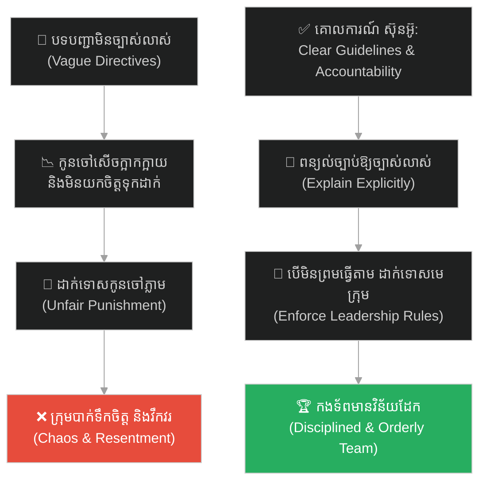
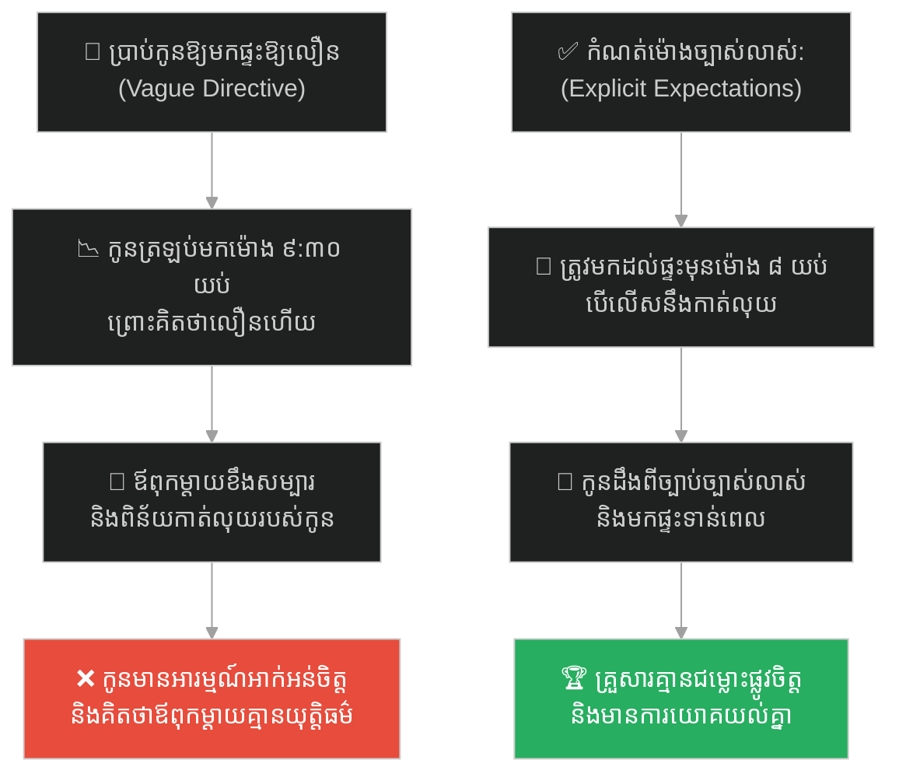
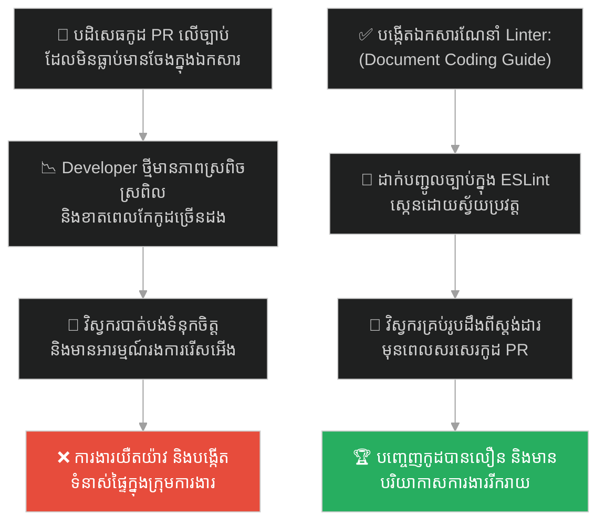
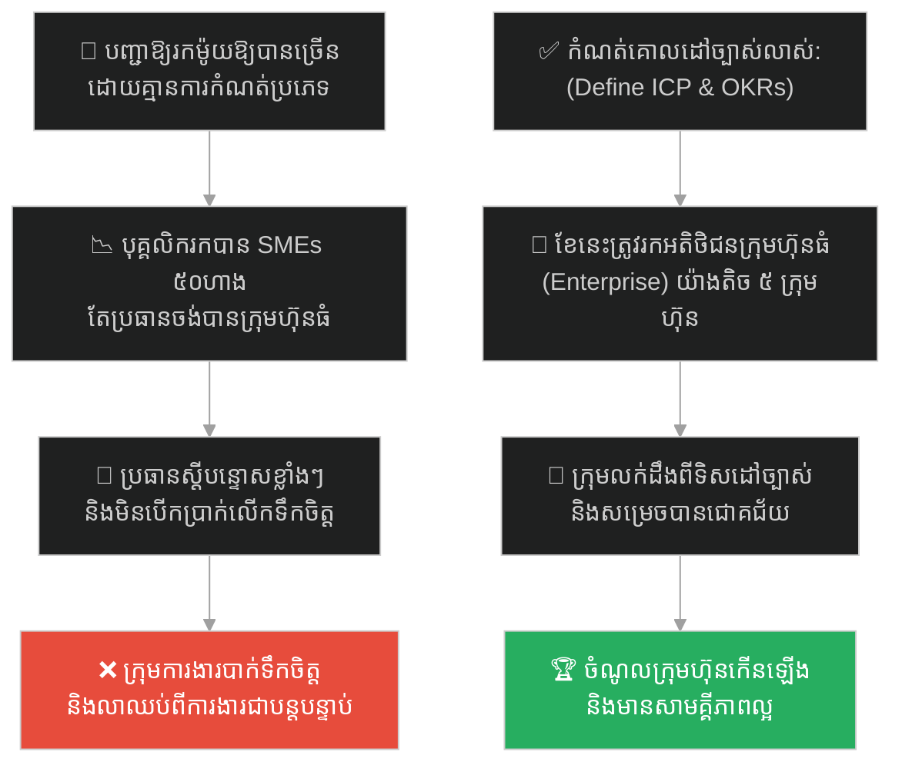
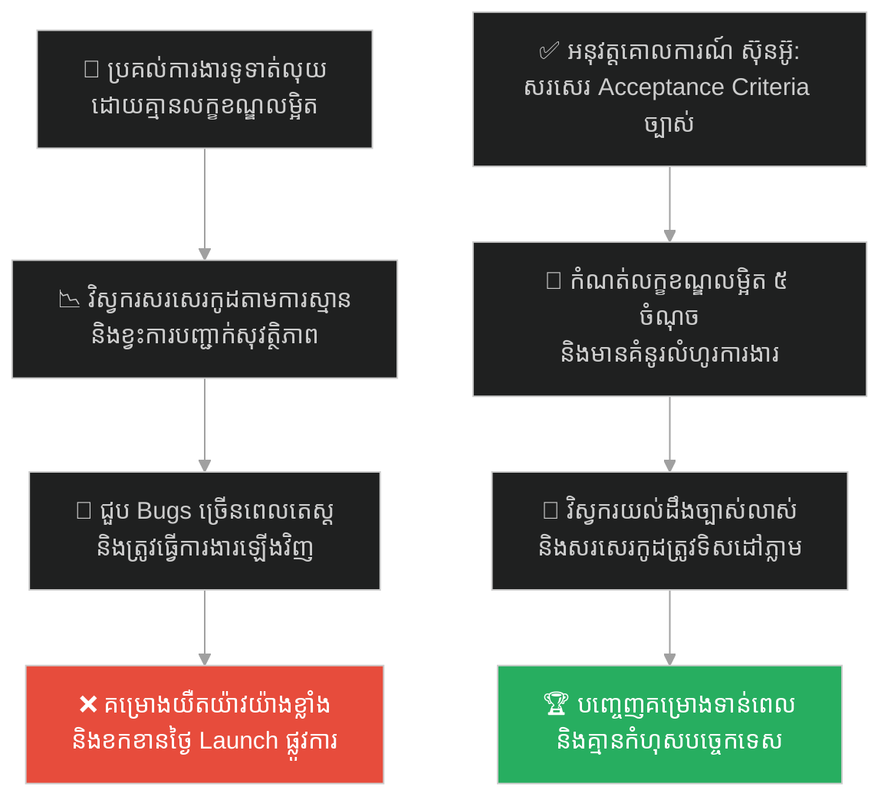
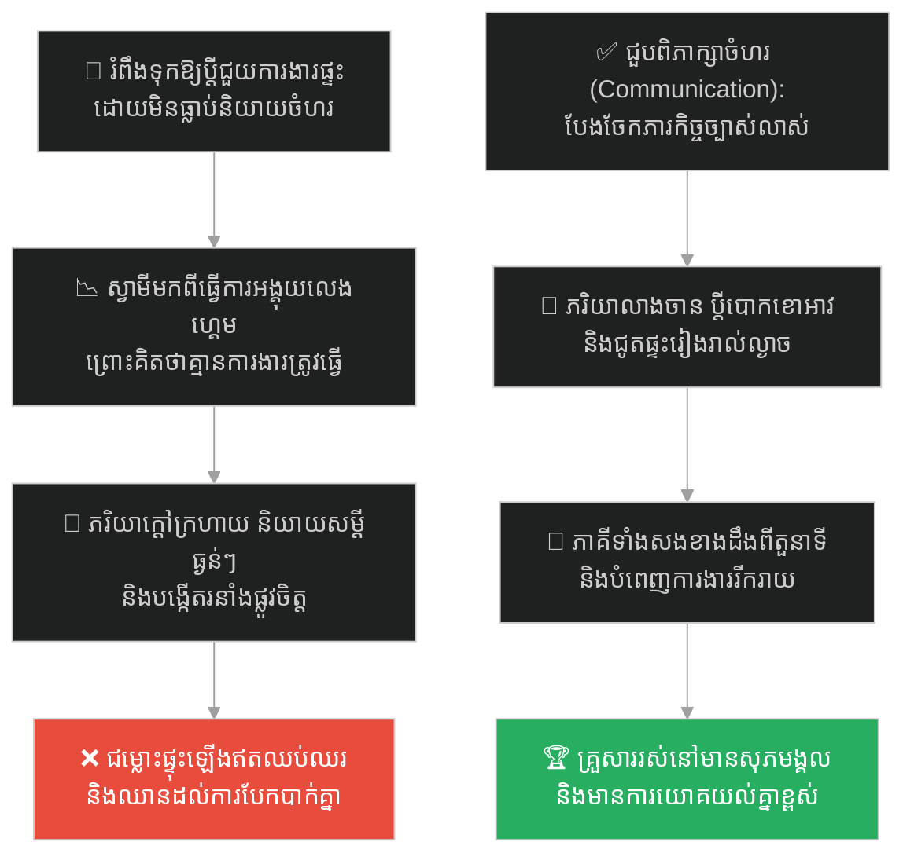
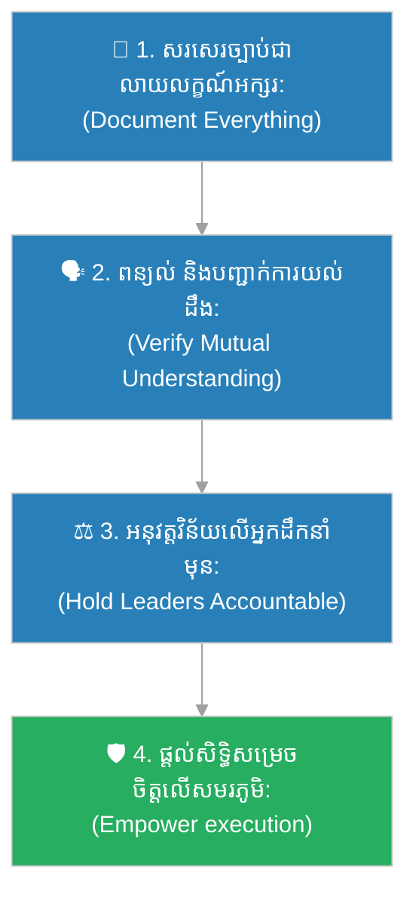

# Clear Communication & Discipline (ការប្រាស្រ័យទាក់ទងច្បាស់លាស់ និងវិន័យ)៖ ស៊ុនអ៊ូ និងកងទ័ពស្រីស្នំ (Clear Communication & The King's Concubines)

**Author:** ichamrong  
**Date:** 2026-05-27  
**Tags:** #sun-tzu #leadership #clear-communication #discipline #accountability #expectations #parable  
**Category:** Concepts / Parables  
**Read Time:** ~15 min  

---

## 📌 មាតិកា (Table of Contents)
- [អន្ទាក់ផ្លូវចិត្ត (The Trap)](#0)
- [១. រឿងព្រេងប្រវត្តិសាស្ត្រ៖ ស៊ុនអ៊ូ និងការសាកល្បងហ្វឹកហាត់ស្រីស្នំរបស់ស្តេចអ៊ូ (The Legend of Sun Tzu's Concubines)](#1)
  - [ច្បាប់យោធាតឹងរឹង និងការសម្រេចចិត្តលើសមរភូមិ (Strict Military Law & The General's Autonomy)](#1-1)
- [២. បញ្ហា៖ គម្លាតរវាងការរំពឹងទុក និងការណែនាំដែលខ្វះភាពច្បាស់លាស់ (The Issue: Vague Expectations & Accountability Breakdown)](#2)
- [៣. ឧទាហរណ៍ជាក់ស្តែងក្នុងពិភពពិត (Real World Examples)](#3)
  - [ឧទាហរណ៍ទី ១ — កម្រិតស្រាល (គ្រួសារ)៖ ការពិន័យកូនលើច្បាប់ម៉ោងត្រឡប់មកផ្ទះដែលមិនច្បាស់លាស់ (The Vague Curfew Punishment Trap)](#3-1)
  - [ឧទាហរណ៍ទី ២ — កម្រិតមធ្យម (បច្ចេកទេស)៖ ការច្រានចោល Pull Request លើច្បាប់កូដដែលមិនធ្លាប់កត់ត្រា (The Undocumented Coding Style Rejection)](#3-2)
  - [ឧទាហរណ៍ទី ៣ — កម្រិតមធ្យម (ធុរកិច្ច)៖ ការស្តីបន្ទោសបុគ្គលិកលក់លើគោលដៅដែលផ្លាស់ប្តូរជានិច្ច (The Shifted Sales Target Blame Game)](#3-3)
  - [ឧទាហរណ៍ទី ៤ — កម្រិតមធ្យម (សង្គម/គ្រប់គ្រង)៖ ការស្តីបន្ទោសវិស្វករលើការយឺតយ៉ាវគម្រោងដែលខ្វះតម្រូវការច្បាស់ (The Vague Requirements Outage)](#3-4)
  - [ឧទាហរណ៍ទី ៥ — កម្រិតធ្ងន់ (ទំនាក់ទំនង)៖ ការខឹងសម្បារដៃគូព្រោះមិនជួយការងារផ្ទះដែលមិនធ្លាប់ប្រាប់ (The Unspoken Housework Expectations Trap)](#3-5)
- [៤. ដំណោះស្រាយទូទៅ៖ ការកំណត់លក្ខខណ្ឌច្បាស់លាស់ និងការអនុវត្តច្បាប់ស្មើភាព (The General Solution: Explicit Documentation & Fair Enforcement)](#4)
- [សេចក្តីសន្និដ្ឋាន (Conclusion)](#5)
- [ឯកសារយោង (References)](#6)
- [Related Posts](#7)

---

## អន្ទាក់ផ្លូវចិត្ត (The Trap)

តើអ្នកធ្លាប់មានអារម្មណ៍ខឹងសម្បារ ឬស្តីបន្ទោសកូនចៅ សមាជិកគ្រួសារ ឬដៃគូជីវិត ព្រោះតែពួកគេមិនបានបំពេញកិច្ចការងារតាមការរំពឹងទុករបស់អ្នក ប៉ុន្តែនៅពេលពិនិត្យឡើងវិញ ទើបដឹងថាអ្នកមិនដែលបានពន្យល់ ឬប្រាប់ពីតម្រូវការនោះឱ្យច្បាស់លាស់សូម្បីតែម្តងដែរឬទេ?

នៅក្នុងការដឹកនាំ និងការគ្រប់គ្រង៖
* **យើងងាយនឹងធ្លាក់ក្នុងអន្ទាក់** នៃការគិតថា "ពួកគេគួរតែដឹងរឿងនេះដោយខ្លួនឯង" (Assumption Bias) ហើយដាក់ទោសពួកគេដោយគ្មានការពន្យល់។
* **យើងមើលរំលង** សារៈសំខាន់នៃការបង្កើតឯកសារណែនាំច្បាស់លាស់ (Explicit Guidelines) និងការដកស្រង់គណនេយ្យភាពផ្ទាល់ខ្លួនមុននឹងស្តីបន្ទោសអ្នកដទៃ។

ការដាក់ទោសកូនចៅចំពោះច្បាប់ដែលមិនច្បាស់លាស់ ហៅថា **អន្ទាក់ Vague Directive (អន្ទាក់បទបញ្ជាមិនច្បាស់លាស់)**។

ដើម្បីយល់ដឹងពីរបៀបដែលស៊ុនអ៊ូបង្កើតកងទ័ពវិន័យដែកពីស្រីស្នំរបស់ស្តេច នេះជាផែនទីបង្ហាញផ្លូវសម្រាប់អត្ថបទនេះ៖
1. **រឿងព្រេងប្រវត្តិសាស្ត្រ (The Historic Legend)** — ការប្រកួតប្រជែងរបស់ស៊ុនអ៊ូ និងស្តេចនគរអ៊ូ ក្នុងការហ្វឹកហាត់ស្រីស្នំ ១៨០ នាក់។
2. **បញ្ហា (The Issue)** — យន្តការនៃការបាក់បែកវិន័យដោយសារការណែនាំមិនច្បាស់លាស់ និងកាតព្វកិច្ចរបស់អ្នកដឹកនាំ។
3. **ឧទាហរណ៍ជាក់ស្តែងក្នុងពិភពពិត (Real World Examples)** — ពិនិត្យមើលអន្ទាក់នេះក្នុងកម្រិតគ្រួសារ បច្ចេកវិទ្យា ធុរកិច្ច ការគ្រប់គ្រង និងទំនាក់ទំនង។
4. **ដំណោះស្រាយទូទៅ (The General Solution)** — ការបង្កើត Acceptance Criteria និងការអនុវត្តច្បាប់ប្រកបដោយសមធម៌។

---

## ១. រឿងព្រេងប្រវត្តិសាស្ត្រ៖ ស៊ុនអ៊ូ និងការសាកល្បងហ្វឹកហាត់ស្រីស្នំរបស់ស្តេចអ៊ូ (The Legend of Sun Tzu's Concubines)

នៅក្នុងសម័យនិទាឃរដូវ និងសរទរដូវរបស់ប្រទេសចិន (ប្រហែលឆ្នាំ ៥០០ មុនគ.ស.) លោក **ស៊ុនអ៊ូ (Sun Tzu)** បានចូលគាល់ស្តេចនៃនគរអ៊ូ គឺ **ស្តេចហឺលូ (King Helu)** ដើម្បីថ្វាយសៀវភៅ "សិល្បៈនៃសង្គ្រាម" (The Art of War) របស់គាត់។ ស្តេចហឺលូបានអានសៀវភៅនោះហើយមានការកោតសរសើរយ៉ាងខ្លាំង ប៉ុន្តែទ្រង់ចង់សាកល្បងសមត្ថភាពជាក់ស្តែងរបស់ស៊ុនអ៊ូ។

ទ្រង់បានសួរទៅកាន់ស៊ុនអ៊ូថា៖ *"តើទ្រឹស្តីគ្រប់គ្រងទ័ពរបស់អ្នក អាចយកទៅហ្វឹកហាត់លើមនុស្សគ្រប់ប្រភេទបានដែរឬទេ? សូម្បីតែមនុស្សស្រី?"*

ស៊ុនអ៊ូ ឆ្លើយតបយ៉ាងម៉ឺងម៉ាត់ថា៖ *"បានក្រាបទូល"*។

ស្តេចអ៊ូ ចង់ធ្វើបាប និងសាកល្បងស៊ុនអ៊ូ ដូច្នេះទ្រង់បានប្រគល់ស្រីស្នំដ៏ស្រស់ស្អាតរបស់ទ្រង់ចំនួន ១៨០ នាក់ ឱ្យស៊ុនអ៊ូហ្វឹកហាត់ធ្វើជាកងទ័ព។ ស៊ុនអ៊ូ បានបែងចែកស្រីស្នំទាំងនោះជាពីរក្រុម ហើយបានតែងតាំងស្រីស្នំសំណព្វចិត្តរបស់ស្តេចចំនួនពីរនាក់ ឱ្យធ្វើជាមេបញ្ជាការក្រុមនីមួយៗ។ គាត់បានផ្តល់គ្រឿងសស្ត្រាវុធ លំពែង និងអាវក្រោះដល់ពួកគេទាំងអស់។

---

### ច្បាប់យោធាតឹងរឹង និងការសម្រេចចិត្តលើសមរភូមិ (Strict Military Law & The General's Autonomy)

ស៊ុនអ៊ូ បានឈរនៅមុខកងទ័ពស្រីស្នំ ហើយពន្យល់ពីបទបញ្ជាយ៉ាងសាមញ្ញ និងច្បាស់ៗ៖ 

> **«នៅពេលដែលអ្នកទាំងអស់គ្នាឮសូរស្គរ វាយម្តង ត្រូវបែរមុខទៅមុខ។ ឮវាយពីរដង ត្រូវបត់ឆ្វេង។ ឮវាយបីដង ត្រូវបត់ស្តាំ។ តើអ្នកទាំងអស់គ្នាយល់ច្បាស់ទេ?»**

ស្រីស្នំទាំងអស់ឆ្លើយព្រមគ្នាទាំងសើចសប្បាយថា *"យល់ហើយ"*។

ពេលនោះ ស៊ុនអ៊ូ បានបញ្ជាឱ្យវាយស្គរ ហើយស្រែកថា៖ **"បត់ស្តាំ!"**

ប៉ុន្តែ ស្រីស្នំទាំងអស់គ្រាន់តែនាំគ្នាសើចក្អាកក្អាយ និងរត់លេងប្រសាច មិនធ្វើតាមបទបញ្ជានោះឡើយ។ ពួកគេគិតថានេះជាការលេងសើចកម្សាន្ត។

ស៊ុនអ៊ូ មិនបានខឹងសម្បារឡើយ។ គាត់បាននិយាយដោយស្ងប់ស្ងាត់ថា៖ 

> **«ប្រសិនបើបទបញ្ជាមិនត្រូវបានពន្យល់ឱ្យបានច្បាស់លាស់ ហើយទាហានមិនយល់ពីច្បាប់ នោះគឺជាកំហុសរបស់ មេបញ្ជាការ (ស៊ុនអ៊ូខ្លួនឯង)។»**

គាត់ក៏បានចំណាយពេលពន្យល់ពីច្បាប់ និងរបៀបធ្វើចលនាម្តងទៀតយ៉ាងលម្អិត បន្ថែមពាក្យបញ្ជាក់យ៉ាងម៉ឺងម៉ាត់បំផុត។ បន្ទាប់មក គាត់បានវាយស្គរបញ្ជាជាលើកទីពីរ៖ **"បត់ឆ្វេង!"**

ម្តងនេះ ស្រីស្នំទាំងនោះក៏នៅតែបន្តសើចសប្បាយ និងមិនព្រមធ្វើតាមបទបញ្ជាដដែល។

ពេលនេះ ស៊ុនអ៊ូ បាននិយាយថា៖ 

> **«ប្រសិនបើបទបញ្ជាត្រូវបានពន្យល់យ៉ាងច្បាស់លាស់ហើយ ប៉ុន្តែទាហាននៅតែមិនធ្វើតាម នោះគឺជាកំហុសរបស់ នាយទាហាន (មេក្រុមស្រីស្នំទាំងពីរ)!»**

ភ្លាមៗនោះ ស៊ុនអ៊ូ បានបញ្ជាឱ្យទាហានរបស់គាត់ ចាប់ខ្លួនមេក្រុមទាំងពីរនាក់យកទៅប្រហារជីវិតចោលជាសាធារណៈ។

ស្តេចអ៊ូ ដែលកំពុងទតមើលពីលើរដ្ឋវាំង មានការភិតភ័យយ៉ាងខ្លាំង ហើយបានបញ្ជូនរាជទូតឱ្យទៅឃាត់ ដោយមានបន្ទូលថា៖ *"យើងដឹងពីសមត្ថភាពរបស់អ្នកហើយ សូមកុំសម្លាប់ស្រីស្នំសំណព្វចិត្តទាំងពីររបស់ខ្ញុំអី បើគ្មាននាងទាំងពីរ ខ្ញុំនឹងបរិភោគអាហារមិនឆ្ងាញ់ឡើយ។"*

ប៉ុន្តែ ស៊ុនអ៊ូ បានតបវិញយ៉ាងមុតមាំថា៖ 

> **«ទូលបង្គំត្រូវបានតែងតាំងជាមេបញ្ជាការទ័ពហើយ។ នៅពេលដែលមេបញ្ជាការកំពុងស្ថិតនៅលើសមរភូមិ គាត់មានសិទ្ធិអំណាចពេញលេញ ហើយមិនចាំបាច់ទទួលយកបទបញ្ជាទាំងអស់ពីព្រះមហាក្សត្រនោះទេ។»**

និយាយរួច គាត់ក៏បានបញ្ជាឱ្យកាត់ក្បាលមេក្រុមទាំងពីរនាក់នោះ រួចជ្រើសរើសស្រីស្នំពីរនាក់បន្ទាប់ឱ្យឡើងធ្វើជាមេក្រុមជំនួសវិញ។

នៅពេលដែលស៊ុនអ៊ូវាយស្គរបញ្ជាម្តងទៀត កងទ័ពស្រីស្នំទាំងមូលបានធ្វើចលនាបត់ឆ្វេង បត់ស្តាំ ដើរទៅមុខ យ៉ាងស្ងៀមស្ងាត់ ម៉ឺងម៉ាត់ និងត្រឹមត្រូវឥតខ្ចោះ គ្មាននរណាម្នាក់ហ៊ានសើច ឬរំលោភវិន័យសូម្បីតែបន្តិចឡើយ។ ស្តេចអ៊ូទោះជាខឹងនិងស្តាយស្រីស្នំ ប៉ុន្តែទ្រង់បានដឹងច្បាស់ថា ស៊ុនអ៊ូគឺជាមេទ័ពដែលមានសមត្ថភាពពិតប្រាកដ និងមានវិន័យតឹងរឹងបំផុត។

---

## ២. បញ្ហា៖ គម្លាតរវាងការរំពឹងទុក និងការណែនាំដែលខ្វះភាពច្បាស់លាស់ (The Issue: Vague Expectations & Accountability Breakdown)

រឿងរ៉ាវយោធារបស់ស៊ុនអ៊ូ បង្ហាញពីគោលការណ៍ដឹកនាំដ៏សំខាន់គឺ **"ភាពច្បាស់លាស់នៃតួនាទី និងការទទួលខុសត្រូវ (Clear Communication & Discipline)"**។

នៅក្នុងការងារបច្ចេកវិទ្យា និងការគ្រប់គ្រង៖
1. **កំហុសរបស់អ្នកដឹកនាំ (The Commander's Error)៖** ប្រសិនបើប្រធានគម្រោង (PM) ឬប្រធានបច្ចេកវិទ្យា (Tech Lead) មិនបានសរសេរឯកសារណែនាំបច្ចេកទេស ច្បាប់នៃការសរសេរកូដ (Coding Standards) ឬលក្ខខណ្ឌនៃការទទួលយកគម្រោង (Acceptance Criteria) ឱ្យបានច្បាស់លាស់ទេ នោះពួកគេមិនអាចស្តីបន្ទោសវិស្វករចំពោះកំហុសឆ្គងឡើយ។ បញ្ហានេះជាកំហុសរបស់អ្នកបញ្ជា។
2. **គណនេយ្យភាពរបស់មេក្រុម (Leadership Accountability)៖** ស៊ុនអ៊ូ មិនបានដាក់ទោសស្រីស្នំទាំងអស់ ១៨០ នាក់ឡើយ គាត់បានដាក់ទោសមេក្រុមទាំងពីរនាក់ ព្រោះពួកគេជាអ្នកដឹកនាំផ្ទាល់។ នៅក្នុងក្រុមហ៊ុន មិនត្រូវស្តីបន្ទោសសមាជិកថ្នាក់ក្រោមទាំងអស់នោះទេ គឺត្រូវសួររកគណនេយ្យភាពពីអ្នកដឹកនាំក្រុម (Team Lead/Manager) ដែលជាអ្នកទទួលបន្ទុកពន្យល់ និងអនុវត្តគោលការណ៍។
3. **ការបដិសេធបទបញ្ជាមិនសមស្រប (General's Autonomy)៖** ស៊ុនអ៊ូហ៊ានបដិសេធស្តេច ព្រោះគាត់ដឹងថាការព្យាប់និងការលាក់លៀមច្បាប់នឹងបំផ្លាញវិន័យរួម។ វិស្វករត្រូវតែមានសិទ្ធិនិយាយ 'ទេ' ទៅកាន់ថ្នាក់លើ ប្រសិនបើការបង្ខំឱ្យបញ្ចេញមុខងារលឿនពេក រំលោភលើច្បាប់សុវត្ថិភាព ឬស្តង់ដារបច្ចេកទេសរបស់ប្រព័ន្ធ។

---

## ៣. ឧទាហរណ៍ជាក់ស្តែងក្នុងពិភពពិត (Real World Examples)

---

### ឧទាហរណ៍ទី ១ — កម្រិតស្រាល (គ្រួសារ)៖ ការពិន័យកូនលើច្បាប់ម៉ោងត្រឡប់មកផ្ទះដែលមិនច្បាស់លាស់ (The Vague Curfew Punishment Trap)

ឪពុកម្តាយបានប្រាប់កូនជំទង់របស់ខ្លួនថា៖ *"កូនត្រូវត្រឡប់មកផ្ទះឱ្យបានលឿននៅយប់នេះ"* ដោយគ្មានការបញ្ជាក់ពីម៉ោងជាក់លាក់ឡើយ។

កូនជំទង់បានត្រឡប់មកដល់ផ្ទះនៅម៉ោង ៩:៣០ យប់ ព្រោះគិតថាវាលឿនជាងរាល់ដងដែលធ្លាប់មកម៉ោង ១១ យប់។ ប៉ុន្តែ ឪពុកម្តាយបានខឹងសម្បារយ៉ាងខ្លាំង និងបានស្រែកស្តីបន្ទោស ព្រមទាំងពិន័យមិនឱ្យកូនចេញក្រៅផ្ទះរយៈពេល ១ សប្តាហ៍ ព្រោះឪពុកម្តាយចង់ឱ្យមកម៉ោង ៨:០០ យប់។ កូនជំទង់មានអារម្មណ៍ក្តៅក្រហាយ និងអាក់អន់ចិត្តជាខ្លាំង ព្រោះគិតថាច្បាប់ផ្លាស់ប្តូរតាមតែអារម្មណ៍របស់ឪពុកម្តាយ។

ដំណោះស្រាយគឺការសរសេរច្បាប់ឱ្យច្បាស់លាស់៖ *"កូនត្រូវមកដល់ផ្ទះមុនម៉ោង ៨:៣០ យប់ បើកូនមកយឺតដោយគ្មានហេតុផលសមស្រប កូននឹងត្រូវកាត់ប្រាក់ហោប៉ៅប្រចាំសប្តាហ៍"*។

---

### ឧទាហរណ៍ទី ២ — កម្រិតមធ្យម (បច្ចេកទេស)៖ ការច្រានចោល Pull Request លើច្បាប់កូដដែលមិនធ្លាប់កត់ត្រា (The Undocumented Coding Style Rejection)

Tech Lead ម្នាក់បានបដិសេធ (Reject) នូវ Pull Request របស់ Developer ថ្មីម្នាក់ ដោយសារតែ Developer រូបនោះសរសេរកូដប្រើប្រាស់រចនាបថ Arrow Functions ជំនួសឱ្យ Standard Functions ដែល Tech Lead ចូលចិត្ត ទោះបីជាក្រុមហ៊ុនមិនដែលសរសេរកត់ត្រាច្បាប់នេះទុកក្នុងឯកសារណែនាំកូដ (Coding Style Guide) ក៏ដោយ។

Developer ថ្មីមានអារម្មណ៍វង្វេងវង្វាន់ និងអាក់អន់ចិត្ត ព្រោះគាត់ត្រូវចំណាយពេល ២ ថ្ងៃសរសេរកូដនោះឡើងវិញ។ គាត់មានអារម្មណ៍ថាស្តង់ដារការងាររបស់ក្រុមហ៊ុន គឺផ្អែកលើការពេញចិត្តផ្ទាល់ខ្លួនរបស់ Tech Lead មិនមែនជាស្តង់ដារបច្ចេកវិទ្យាឡើយ។

ដំណោះស្រាយគឺការកំណត់ច្បាប់ឱ្យច្បាស់លាស់៖ Tech Lead ត្រូវរៀបចំឯកសារ `CONTRIBUTING.md` និងបង្កើតឧបករណ៍ឆែកកូដស្វ័យប្រវត្តិ (Linter/ESLint Rules) នៅក្នុងគម្រោង ដើម្បីឆែកកូដដោយស្វ័យប្រវត្តមុនពេល Submit PR។

---

### ឧទាហរណ៍ទី ៣ — កម្រិតមធ្យម (ធុរកិច្ច)៖ ការស្តីបន្ទោសបុគ្គលិកលក់លើគោលដៅដែលផ្លាស់ប្តូរជានិច្ច (The Shifted Sales Target Blame Game)

ប្រធានផ្នែកលក់បានប្រាប់ក្រុមការងាររបស់ខ្លួនថា៖ *"ខែនេះត្រូវខំប្រឹងទាក់ទាញអតិថិជនឱ្យបានច្រើន"*។ នៅចុងខែ ក្រុមលក់ដណ្តើមបានអតិថិជនប្រភេទអាជីវកម្មខ្នាតតូច (SMEs) ចំនួន ៥០ ក្រុមហ៊ុន។

ប៉ុន្តែ ប្រធានផ្នែកលក់បានខឹងសម្បារយ៉ាងខ្លាំង និងបានស្តីបន្ទោសក្រុមការងារថា៖ *"ហេតុអ្វីបានជានាំគ្នារកតែ SMEs មកបែបនេះ? ក្រុមហ៊ុនចង់បានអតិថិជនយក្ស (Enterprise) ដើម្បីបង្កើនចំណូលធំតើ!"* គាត់បានបដិសេធមិនបើកប្រាក់លើកទឹកចិត្ត (Commission) ឱ្យពួកគេឡើយ។ ក្រុមការងារមានការបាក់ទឹកចិត្ត និងខឹងសម្បារយ៉ាងខ្លាំង ព្រោះគោលដៅអតិថិជន Enterprise មិនដែលត្រូវបានកំណត់ឱ្យច្បាស់លាស់ពីមុនមកឡើយ។

---

### ឧទាហរណ៍ទី ៤ — កម្រិតមធ្យម (សង្គម/គ្រប់គ្រង)៖ ការស្តីបន្ទោសវិស្វករលើការយឺតយ៉ាវគម្រោងដែលខ្វះតម្រូវការច្បាស់ (The Vague Requirements Outage)

អ្នកគ្រប់គ្រងផលិតផល (Product Manager) បានប្រគល់សំបុត្រការងារ (Jira Ticket) មួយទៅឱ្យក្រុមការងារបច្ចេកទេសដោយគ្រាន់តែសរសេរថា៖ *"បង្កើតប្រព័ន្ធទូទាត់លុយថ្មី"* ដោយគ្មានការសរសេរលក្ខខណ្ឌលម្អិត (Acceptance Criteria) ឬលំហូរការងារ (Use Cases) ឡើយ។

Developer បានសរសេរកូដតាមការស្មាន និងយល់ឃើញរបស់ខ្លួន។ នៅពេលថ្ងៃប្រគល់ការងារ PM បានពិនិត្យឃើញថា ប្រព័ន្ធទូទាត់លុយនោះខ្វះមុខងារបង្វិលសងប្រាក់ (Refund) និងខ្វះការគណនាពន្ធដារស្វ័យប្រវត្តិ។ PM បានស្រែកបន្ទោសវិស្វករខ្លាំងៗនៅចំពោះមុខអ្នកដទៃថា៖ *"ធ្វើការគ្មានវិជ្ជាជីវៈសោះ របស់សាមញ្ញប៉ុណ្ណឹងក៏ភ្លេចដែរ!"* វិស្វករមានអារម្មណ៍អាក់អន់ចិត្តយ៉ាងខ្លាំង ព្រោះពួកគេមិនមែនជាអ្នករៀបចំគំរូអាជីវកម្មឡើយ។

ដំណោះស្រាយ៖ មុននឹងប្រគល់ការងារ PM ត្រូវតែបញ្ជាក់ Acceptance Criteria ឱ្យបានច្បាស់លាស់ (ឧទាហរណ៍៖ ត្រូវតែមានមុខងារទូទាត់ មុខងារ Refund និងការគណនាពន្ធតាមច្បាប់)។

---

### ឧទាហរណ៍ទី ៥ — កម្រិតធ្ងន់ (ទំនាក់ទំនង)៖ ការខឹងសម្បារដៃគូព្រោះមិនជួយការងារផ្ទះដែលមិនធ្លាប់ប្រាប់ (The Unspoken Housework Expectations Trap)

ភរិយាម្នាក់មានអារម្មណ៍ហត់នឿយយ៉ាងខ្លាំងនឹងការងារផ្ទះ។ នាងសង្ឃឹមថា ស្វាមីរបស់នាងនឹងយល់ដឹង ហើយជួយបោសសម្អាតផ្ទះ បោកខោអាវ និងលាងចានដោយស្វ័យប្រវត្តិ ដោយនាងមិនដែលធ្លាប់និយាយពិភាក្សាបែងចែកការងារផ្ទះនោះជាមួយស្វាមីឡើយ (រំពឹងទុកដោយមិននិយាយ)។

ស្វាមីដែលត្រឡប់មកពីធ្វើការទាំងហត់នឿយ បានអង្គុយលេងទូរស័ព្ទដោយគិតថាផ្ទះគ្មានការងារអ្វីត្រូវធ្វើឡើយ។ ភរិយាឃើញដូច្នោះ ក៏កើតចិត្តក្តៅក្រហាយ ដើរទាត់តុទាត់កៅអី និយាយពាក្យបញ្ឆិតបញ្ឈៀងដាក់ប្តី។ ស្វាមីក៏កើតចិត្តខឹងតបវិញ ព្រោះគិតថាភរិយាគ្មានហេតុផល និងចូលចិត្តរករឿង។ ជម្លោះតូចៗបែបនេះកើតឡើងរៀងរាល់ថ្ងៃ រហូតដល់បែកបាក់ចំណងអាពាហ៍ពិពាហ៍។

ដំណោះស្រាយ៖ ត្រូវជជែកគ្នាដោយស្មោះត្រង់ និងបែងចែកតួនាទី៖ *"បងជួយបោកខោអាវ និងជូតផ្ទះ ចំណែកអូនទទួលបន្ទុកចម្អិនអាហារ និងលាងចាន"*។

---

## ៤. ដំណោះស្រាយទូទៅ៖ ការកំណត់លក្ខខណ្ឌច្បាស់លាស់ និងការអនុវត្តច្បាប់ស្មើភាព (The General Solution: Explicit Documentation & Fair Enforcement)

ដើម្បីដោះស្រាយបញ្ហានៃបទបញ្ជាមិនច្បាស់លាស់ យើងត្រូវអនុវត្តគោលការណ៍ដឹកនាំតាមបែបស៊ុនអ៊ូ៖

ជំហាននៃការអនុវត្ត៖
1. **សរសេរជាលាយលក្ខណ៍អក្សរ (Explicit Documentation)៖** ជៀសវាងការចេញបទបញ្ជាតាមមាត់ទទេរសម្រាប់កិច្ចការស្មុគស្មាញ។ រាល់ការងារត្រូវតែមានការកត់ត្រាទុកជាលាយលក្ខណ៍អក្សរ (ដូចជា Jira Ticket, Wiki Page, ឬកិច្ចសន្យារួម)។
2. **ផ្ទៀងផ្ទាត់ការយល់ដឹងរួម (Verify Mutual Understanding)៖** មុននឹងចាប់ផ្តើមការងារ ត្រូវសួរទៅកាន់កូនចៅថា៖ *"តើប្អូនអាចសង្ខេបពីអ្វីដែលយល់ពីការងារនេះឱ្យបងស្តាប់បន្តិចបានទេ?"* ដើម្បីប្រាកដថាគ្មានការយល់ច្រឡំ។
3. **អនុវត្តវិន័យលើអ្នកដឹកនាំជាមុន (Hold Leaders Accountable First)៖** ប្រសិនបើការងាររបស់ក្រុមជួបបញ្ហា មេបញ្ជាការត្រូវសួរនាំអ្នកដឹកនាំក្រុម (Team Lead/Manager) ជាមុន មិនត្រូវលោតទៅស្តីបន្ទោសសមាជិកថ្នាក់ក្រោមឡើយ។ អ្នកដឹកនាំត្រូវទទួលបន្ទុកចំពោះលទ្ធផលការងាររបស់កូនចៅ។
4. **ផ្តល់សិទ្ធិស្វ័យភាព និងការសម្រេចចិត្ត (Empower the Team)៖** ថ្នាក់លើ (CEO/Stakeholders) ត្រូវទុកចិត្ត និងផ្តល់សិទ្ធិអំណាចពេញលេញដល់អ្នកដឹកនាំបច្ចេកទេស (Tech Lead) ក្នុងការសម្រេចចិត្តលើសមរភូមិការងារ ជៀសវាងការលូកដៃជ្រៀតជ្រែក (Micro-management) ដែលបំផ្លាញរបៀបរបបការងាររួម។

---

## 🐇 ធ្លាក់ចូលក្នុងរន្ធទន្សាយ (Enter the Strategic Rabbit Hole)

ដើម្បីស្វែងយល់កាន់តែស៊ីជម្រៅអំពីរបៀបដែលមេទ័ព ហានស៊ីន (Han Xin) បានអនុវត្តយុទ្ធសាស្ត្រ "ដីមរណៈ (Death Ground Strategy)" របស់ស៊ុនអ៊ូ ដោយការដាក់ទ័ពបែរខ្នងដាក់ទន្លេ ដើម្បីបង្ខំឱ្យកងទ័ពបញ្ចេញសក្តានុពលកំពូលក្នុងការប្រយុទ្ធប្តូរជីវិត សូមបន្តដំណើររុករករបស់អ្នកទៅកាន់៖

* 🚀 **[ចាប់ផ្តើមដំណើររុករក (Start the Journey) ➔ Han Xin and the River of No Return](./66-han-xin-and-the-river-of-no-return.md)**

---

## សេចក្តីសន្និដ្ឋាន (Conclusion)

> **«ប្រសិនបើបទបញ្ជាមិនច្បាស់លាស់ នោះជាកំហុសរបស់មេបញ្ជាការ។ ប្រសិនបើបទបញ្ជាច្បាស់លាស់ហើយតែមិនព្រមធ្វើតាម នោះជាកំហុសរបស់នាយទាហាន។»**

ការដឹកនាំប្រកបដោយប្រសិទ្ធភាព និងវិន័យខ្ពស់ មិនមែនកើតឡើងដោយសារការប្រើអំណាចស្រែកគំហកដាក់ទោសកូនចៅតាមអារម្មណ៍នោះទេ ប៉ុន្តែវាសម្រេចបានតាមរយៈការកសាងប្រព័ន្ធប្រាស្រ័យទាក់ទងដ៏ច្បាស់លាស់ ការកំណត់ព្រំដែនតួនាទី និងការអនុវត្តច្បាប់ប្រកបដោយសមធម៌ និងតម្លាភាព។ ចូរធ្វើខ្លួនជាមេដឹកនាំដែលចេះទទួលខុសត្រូវលើភាពច្បាស់លាស់នៃបទបញ្ជារបស់ខ្លួន មុននឹងទាមទារវិន័យពីអ្នកដទៃ។

---

## ឯកសារយោង (References)

* **Sun Tzu** — *The Art of War* (Translated by Lionel Giles, 1910). សៀវភៅយុទ្ធសាស្ត្រយោធាបុរាណចិន និងមេរៀនដឹកនាំ។
* **Jocko Willink & Leif Babin** — *Extreme Ownership: How U.S. Navy SEALs Lead and Win* (2015). សៀវភៅស្តីពីការទទួលខុសត្រូវខ្ពស់របស់អ្នកដឹកនាំ និងការប្រាស្រ័យទាក់ទងច្បាស់លាស់។
* **Patrick Lencioni** — *The Five Dysfunctions of a Team: A Leadership Fable* (2002). មេរៀនស្តីពីគណនេយ្យភាព និងការកសាងទំនុកចិត្តក្នុងក្រុមការងារ។

---

## Related Posts

* **[55 The Mongol Horde: Agile and Autonomous Teams](./55-the-mongol-horde.md)** — របៀបផ្តល់សិទ្ធិសម្រេចចិត្ត និងស្វ័យភាពខ្ពស់ដល់ក្រុមការងារថ្នាក់ក្រោម។
* **[44 Alexander the Great and the Gordian Knot](./44-the-gordian-knot.md)** — របៀបសម្រេចចិត្តលឿន និងច្បាស់លាស់ដើម្បីដោះស្រាយវិបត្តិស្មុគស្មាញ។
* **[60-the-first-flight.md](./60-the-first-flight.md)** — របៀបដែលការទទួលបាន Feedback ជាក់ស្តែងជួយឱ្យការប្រាស្រ័យទាក់ទងបច្ចេកវិទ្យាកាន់តែមានភាពច្បាស់លាស់។

---

## Related

- [💡 Concepts README](../README.md)
- [📚 Main Repository README](../../../README.md)
- [Developer Habits](../../developer-habits/README.md)
- [Mental Health & Well-being](../../mental-health/README.md)
- [Management & SDLC](../../management/README.md)
