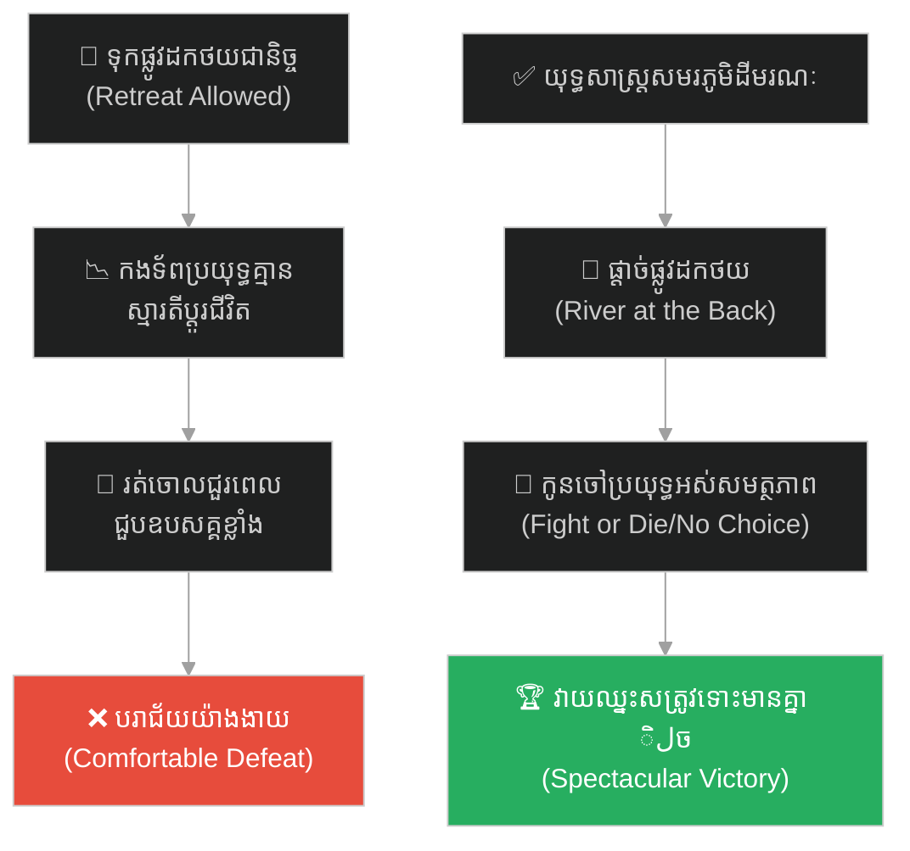
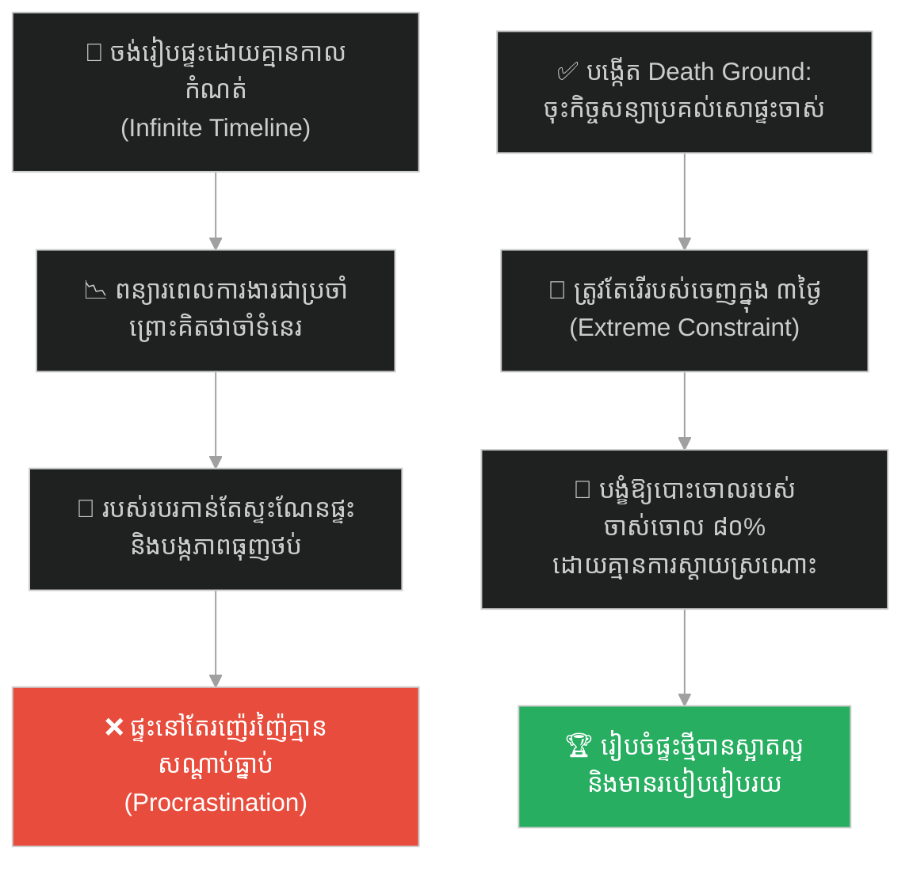
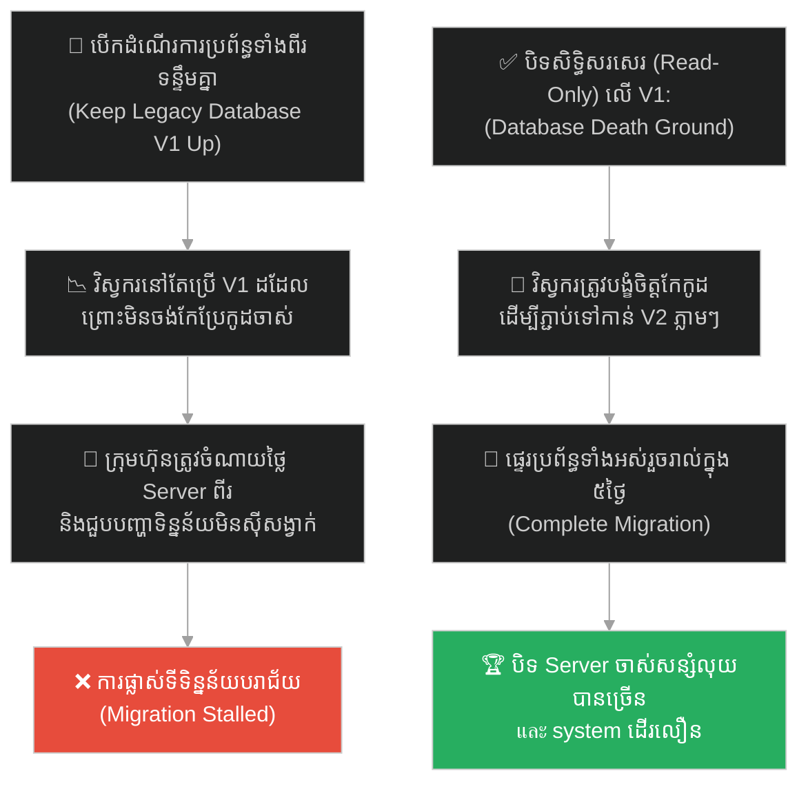
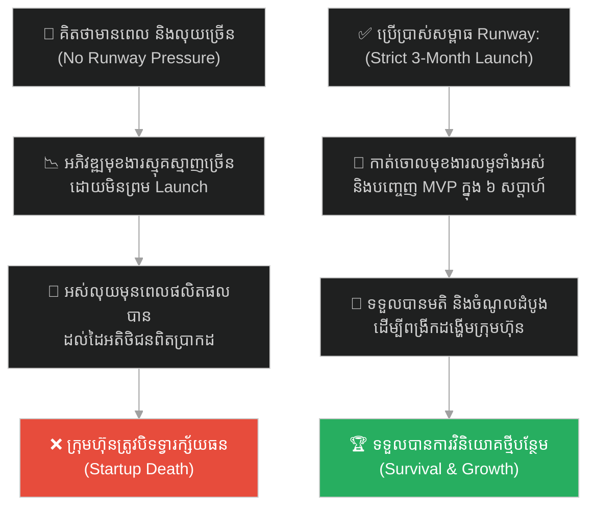
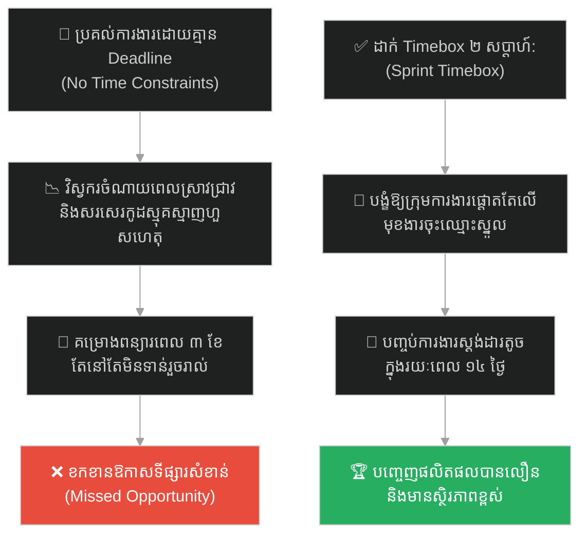
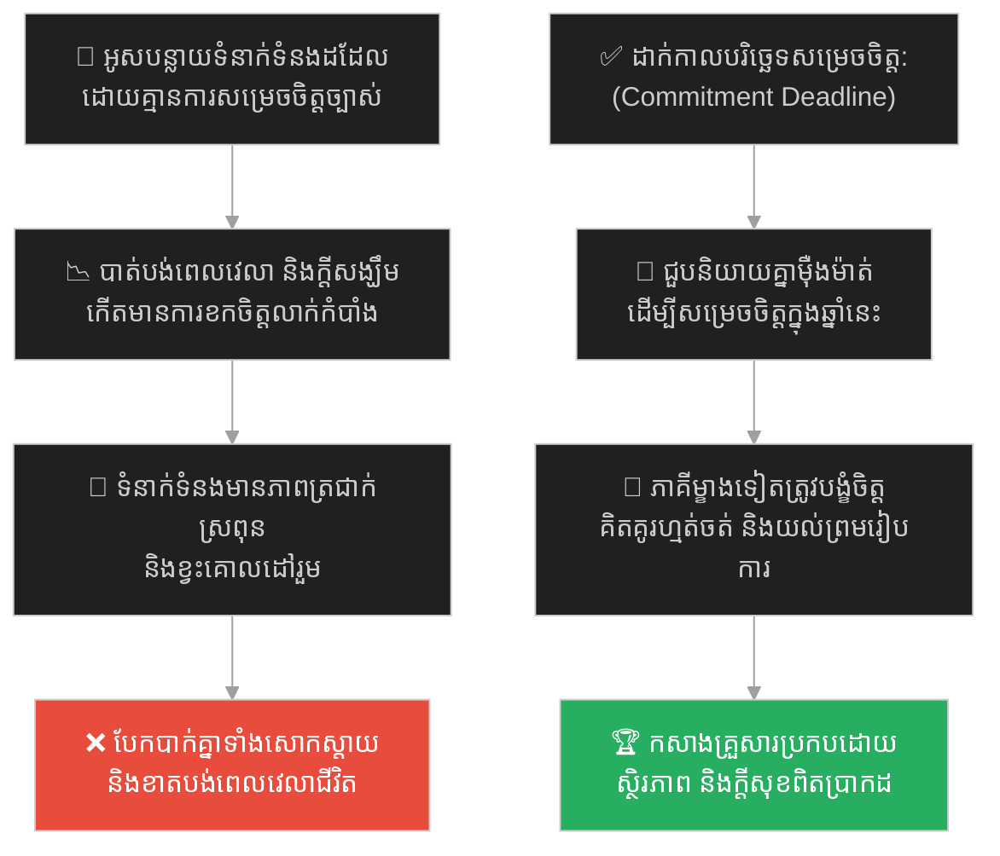
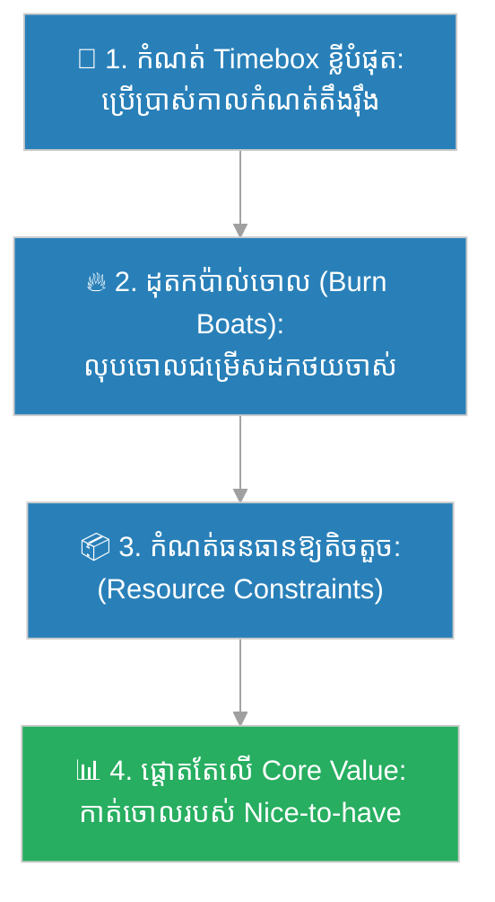

# Death Ground Strategy (យុទ្ធសាស្ត្រសមរភូមិដីមរណៈ)៖ ហានស៊ីន និងសមរភូមិបែរខ្នងដាក់ទន្លេ (Death Ground & The River of No Return)

**Author:** ichamrong  
**Date:** 2026-05-27  
**Tags:** #han-xin #sun-tzu #death-ground #constraints #parkinsons-law #urgency #focus #parable  
**Category:** Concepts / Parables  
**Read Time:** ~15 min  

---

## 📌 មាតិកា (Table of Contents)
- [អន្ទាក់ផ្លូវចិត្ត (The Trap)](#0)
- [១. រឿងព្រេងប្រវត្តិសាស្ត្រ៖ មេទ័ពហានស៊ីន និងសមរភូមិបែរខ្នងដាក់ទន្លេ (The Legend of Han Xin's Back-to-River Battle)](#1)
  - [ប្រយុទ្ធ ឬស្លាប់ និងជ័យជំនះដ៏អស្ចារ្យ (Fight or Die & The Great Victory)](#1-1)
- [២. បញ្ហា៖ គ្រោះថ្នាក់នៃផ្លូវថយក្រោយដ៏ស្រណុក និងថាមពលនៃដែនកំណត់ (The Issue: Comfortable Retreat vs. Power of Constraints)](#2)
- [៣. ឧទាហរណ៍ជាក់ស្តែងក្នុងពិភពពិត (Real World Examples)](#3)
  - [ឧទាហរណ៍ទី ១ — កម្រិតស្រាល (គ្រួសារ)៖ ការកំណត់ថ្ងៃរើផ្ទះដ៏តឹងរ៉ឹងបង្ខំឱ្យបោះចោលរបស់ឥតប្រយោជន៍ (The Moving Day Constraint)](#3-1)
  - [ឧទាហរណ៍ទី ២ — កម្រិតមធ្យម (បច្ចេកទេស)៖ ការបិទសិទ្ធិប្រើប្រាស់ Database ចាស់ដើម្បីបង្ខំឱ្យផ្លាស់ទីទិន្នន័យ (The Legacy Database Decommission)](#3-2)
  - [ឧទាហរណ៍ទី ៣ — កម្រិតមធ្យម (ធុរកិច្ច)៖ ការកំណត់ថវិការត់ការដ៏ខ្លីដើម្បីបង្ខំឱ្យចេញលក់ផលិតផល (The Strict Runway Push)](#3-3)
  - [ឧទាហរណ៍ទី ៤ — កម្រិតមធ្យម (សង្គម/គ្រប់គ្រង)៖ ការដាក់កាលកំណត់ពីរអាទិត្យដើម្បីសម្រេចបានមុខងារស្នូល (The Two-Week Sprint Deadline)](#3-4)
  - [ឧទាហរណ៍ទី ៥ — កម្រិតធ្ងន់ (ទំនាក់ទំនង)៖ ការកំណត់ថ្ងៃច្បាស់លាស់ដើម្បីសម្រេចអនាគតរួមគ្នា (The Commitment Deadline)](#3-5)
- [៤. ដំណោះស្រាយទូទៅ៖ ការបង្កើតប្រព័ន្ធគ្មានផ្លូវដកថយ និងការដុតកប៉ាល់ចោល (The General Solution: Artificial Scarcity & Force Majeure)](#4)
- [សេចក្តីសន្និដ្ឋាន (Conclusion)](#5)
- [ឯកសារយោង (References)](#6)
- [Related Posts](#7)

---

## អន្ទាក់ផ្លូវចិត្ត (The Trap)

តើអ្នកធ្លាប់កត់សម្គាល់ឃើញទេថា នៅពេលដែលយើងមានពេលវេលាច្រើន ឬមានផ្លូវថយក្រោយដ៏ធំទូលាយ (ដូចជា ផែនការទីពីរ ឬ Plan B ស្រណុកសុខស្រួល) យើងច្រើនតែធ្វើការងារយឺតយ៉ាវ ខ្វះការផ្តោតអារម្មណ៍ និងងាយនឹងបោះបង់គោលដៅធំនៅពេលជួបឧបសគ្គដំបូងដែរឬទេ?

នៅក្នុងចិត្តវិទ្យាការងារ និងការគ្រប់គ្រងគម្រោង៖
* **យើងងាយនឹងធ្លាក់ក្នុងអន្ទាក់** នៃការគិតថា "យើងអាចធ្វើវានៅពេលណាក៏បាន ឬយើងអាចដកថយទៅកន្លែងចាស់វិញបាន" (Retreat Fallacy)។
* **យើងមើលរំលង** ថាមពលនៃការកំណត់ព្រំដែនតឹងរ៉ឹង (Extreme Constraints) និងយន្តការនៃការផ្តាច់ផ្លូវដកថយ ដើម្បីបញ្ចេញសក្តានុពលកំពូលរបស់យើង។

ការបណ្តោយឱ្យជម្រើសថយក្រោយ បំផ្លាញស្មារតីប្រយុទ្ធឆ្ពោះទៅមុខ ហៅថា **អន្ទាក់ Comfortable Retreat (លម្អៀងផ្លូវថយស្រណុក)**។

ដើម្បីយល់ដឹងពីរបៀបដែលហានស៊ីនប្រើសមរភូមិគ្មានផ្លូវចេញ ដើម្បីវាយឈ្នះខ្មាំងសត្រូវដែលមានទ័ពច្រើនជាង ៧ ដង នេះជាផែនទីបង្ហាញផ្លូវសម្រាប់អត្ថបទនេះ៖
1. **រឿងព្រេងប្រវត្តិសាស្ត្រ (The Historic Legend)** — ការប្រយុទ្ធដ៏ល្បីល្បាញនៅច្រកសឹក Jingxing របស់មេទ័ពហានស៊ីន។
2. **បញ្ហា (The Issue)** — យន្តការច្បាប់ Parkinson's Law និងអត្ថប្រយោជន៍នៃស្ថានភាព "ដីមរណៈ (Death Ground)"។
3. **ឧទាហរណ៍ជាក់ស្តែងក្នុងពិភពពិត (Real World Examples)** — ពិនិត្យមើលឥទ្ធិពលនេះក្នុងកម្រិតគ្រួសារ បច្ចេកវិទ្យា ធុរកិច្ច ការគ្រប់គ្រង និងទំនាក់ទំនង។
4. **ដំណោះស្រាយទូទៅ (The General Solution)** — ការបង្កើតដែនកំណត់សិប្បនិម្មិត (Artificial Constraints) ដើម្បីជំរុញសកម្មភាពរហ័ស។

---

## ១. រឿងព្រេងប្រវត្តិសាស្ត្រ៖ មេទ័ពហានស៊ីន និងសមរភូមិបែរខ្នងដាក់ទន្លេ (The Legend of Han Xin's Back-to-River Battle)

នៅក្នុងសម័យសង្គ្រាមហាន-ឈូ (ប្រហែលឆ្នាំ ២០៤ មុនគ.ស.) មេទ័ពដ៏ឆ្នើមម្នាក់របស់ស្តេចលីវប៉ាង (Liu Bang) គឺលោក **ហានស៊ីន (Han Xin)** ត្រូវបានចាត់ឱ្យដឹកនាំកងទ័ពថ្មីថ្មោងចំនួនត្រឹមតែ ៣០,០០០ នាក់ ទៅវាយលុកនគរចាវ (Zhao)។ នគរចាវគឺជាគូប្រជែងដ៏ខ្លាំងក្លា ដែលមានកងទ័ពដ៏មានបទពិសោធន៍រហូតដល់ទៅ ២០០,០០០ នាក់ (ច្រើនជាង ហានស៊ីន ជិត ៧ ដង) កំពុងឈរជើងការពារនៅច្រកសឹក Jingxing ដ៏រឹងមាំ។

មុនពេលចាប់ផ្តើមសមរភូមិ ហានស៊ីន បានដាក់ចេញនូវបទបញ្ជាដ៏ចម្លែកមួយ ដែលខុសឆ្គងទាំងស្រុងពីក្បួនយុទ្ធសាស្ត្រយោធាទូទៅ៖ គាត់បានបញ្ជាឱ្យកងទ័ពរបស់គាត់ ចេញទៅរៀបជួរប្រយុទ្ធ **"បែរខ្នងដាក់ទន្លេ Tao (ទន្លេដ៏ជ្រៅនិងហូរចាក់ខ្លាំង)"**។

យោងតាមក្បួនសង្គ្រាមបុរាណ នេះគឺជាកំហុសឆ្គងដ៏ធ្ងន់ធ្ងរបំផុត ព្រោះ៖
* **គ្មានផ្លូវដកថយ៖** ប្រសិនបើចាញ់ កងទ័ពនឹងត្រូវរុញច្រានឱ្យធ្លាក់ទឹកទន្លេលង់ស្លាប់ទាំងអស់។
* **គ្មានច្រកជម្លៀស៖** ក្បួនសឹកចែងថា ត្រូវតែរៀបជួរប្រយុទ្ធបែរខ្នងដាក់ភ្នំ និងបែរមុខរកទឹក ដើម្បីងាយស្រួលរត់គេច។

មេទ័ព និងកងទ័ពនគរចាវ ដែលមើលឃើញបែបនេះ បាននាំគ្នាសើចចំអកយ៉ាងខ្លាំង និងវាយតម្លៃថា ហានស៊ីន គ្រាន់តែជាមនុស្សល្ងង់ខ្លៅដែលមិនចេះសូម្បីតែក្បួនសឹកបឋម។ ពួកគេមានភាពជឿជាក់យ៉ាងខ្លាំង និងបានបញ្ចេញទ័ពទាំងអស់សម្រុកចូលវាយលុកកងទ័ពហានស៊ីន។

---

### ប្រយុទ្ធ ឬស្លាប់ និងជ័យជំនះដ៏អស្ចារ្យ (Fight or Die & The Great Victory)

នៅពេលសមរភូមិចាប់ផ្តើម កងទ័ពចាវ ២០០,០០០ នាក់ បានសម្រុកចូលមកដូចទឹកបាក់ទំនប់។ កងទ័ពរបស់ហានស៊ីន ត្រូវវាយដកថយបន្តិចម្តងៗ រហូតខ្នងរបស់ពួកគេប៉ះនឹងមាត់ទន្លេដ៏ជ្រៅ។

នៅខណៈនោះ ទាហានហានស៊ីនគ្រប់រូបដឹងច្បាស់ថា ពួកគេលែងមានផ្លូវរត់គេចខ្លួនទៀតហើយ។ ជម្រើសតែមួយគត់ដែលពួកគេមានគឺ **"ត្រូវតែវាយឈ្នះសត្រូវនៅចំពោះមុខ ឬក៏ត្រូវលង់ទឹកស្លាប់ទាំងអស់គ្នា"**។ ភាពភ័យខ្លាចបានប្រែទៅជាភាពក្លាហាន និងកំហឹងដ៏មហិមា។ ទាហានថ្មីថ្មោងម្នាក់ៗបានប្រយុទ្ធប្តូរជីវិត វាយតបតវិញដោយកម្លាំងស្មើនឹងមនុស្សដប់នាក់។

ដោយសារតែកម្លាំងតស៊ូដ៏អស្ចារ្យរបស់កងទ័ពគ្មានផ្លូវថយ កងទ័ពចាវដែលមានគ្នា ២០០,០០០ នាក់ ចាប់ផ្តើមបាក់កម្លាំង និងមិនអាចវាយបំបែកជួរទ័ពហានស៊ីនបានឡើយ។ ហានស៊ីនបានឆ្លៀតឱកាសនេះ បញ្ជូនកងទ័ពសេះតូចមួយដែលបង្កប់ទុកជាសម្ងាត់ ឱ្យលួចចូលទៅដុត និងដោតទង់ជាតិហានទូទាំងជំរុំរបស់សត្រូវចាវ។

នៅពេលកងទ័ពចាវក្រឡេកមើលទៅក្រោយ ឃើញទង់ជាតិហានពាសពេញជំរុំ ពួកគេគិតថាពួកគេចាញ់សង្គ្រាមហើយ ក៏កើតមានភាពចលាចល និងរត់ជាន់គ្នា។ ហានស៊ីនបានវាយសម្រុកពីមុខ និងពីក្រោយ ទីបំផុតបានកម្ទេចកងទ័ពចាវ ២០០,០០០ នាក់ ទទួលបានជ័យជំនះយ៉ាងធំធេងបំផុតក្នុងប្រវត្តិសាស្ត្រ។

ក្រោយសង្គ្រាម ទាហានបានសួរនាំហានស៊ីនថា៖ *"ហេតុអ្វីលោកមេទ័ពរៀបទ័ពបែរខ្នងដាក់ទន្លេ ដែលផ្ទុយពីក្បួនសឹក?"*

ហានស៊ីន ញញឹមហើយឆ្លើយថា៖ 

> **«ក្បួនសឹករបស់ស៊ុនអ៊ូបានចែងថា "ដាក់កងទ័ពក្នុងទីជម្រកដែលគ្មានផ្លូវចេញ នោះពួកគេនឹងសុខចិត្តស្លាប់ប្រសើរជាងរត់ចោលជួរ... ដាក់ពួកគេនៅក្នុងទីជម្រកនៃសេចក្តីស្លាប់ នោះពួកគេនឹងរស់ (Death Ground Strategy)។" ទាហានរបស់យើងជាអ្នកថ្មី បើខ្ញុំទុកផ្លូវរត់ឱ្យពួកគេ ពួកគេនឹងរត់ចោលជួរតាំងពីឃើញសត្រូវភ្លាមម៉្លេះ។»**

---

## ២. បញ្ហា៖ គ្រោះថ្នាក់នៃផ្លូវថយក្រោយដ៏ស្រណុក និងថាមពលនៃដែនកំណត់ (The Issue: Comfortable Retreat vs. Power of Constraints)

យុទ្ធសាស្ត្រ "ដីមរណៈ (Death Ground)" របស់ហានស៊ីន បង្ហាញពីគោលការណ៍ចិត្តវិទ្យាដ៏សំខាន់៖ **ដែនកំណត់ (Constraints) អាចបង្កើតភាពបន្ទាន់ (Urgency) និងការផ្តោតអារម្មណ៍កម្រិតខ្ពស់**។

នៅក្នុងពិភពការងារ និងការគ្រប់គ្រង៖
* **ច្បាប់របស់ផាកគីនសុន (Parkinson's Law)៖** ប្រសិនបើគម្រោងមួយត្រូវបានផ្តល់ពេលវេលា និងថវិកាច្រើនហួសកំណត់ (មានផ្លូវថយក្រោយច្រើន) ក្រុមការងារនឹងចំណាយពេលប្រជុំឥតប្រយោជន៍ និងសរសេរកូដស្មុគស្មាញ (Overengineering) ធ្វើឱ្យគម្រោងអូសបន្លាយ។
* **ភាពស្រណុកនាំឱ្យចុះចាញ់ (Retreat Bias)៖** វត្តមានរបស់ប្រព័ន្ធចាស់ ឬផែនការ B ជួយឱ្យយើងមានផ្លូវថយ តែវាក៏ធ្វើឱ្យយើងមិនប្រឹងប្រែងអស់ពីសមត្ថភាពដើម្បីធ្វើឱ្យផែនការ A ជោគជ័យឡើយ។
* **ថាមពលនៃដែនកំណត់ (The Power of Constraints)៖** ដែនកំណត់តឹងរ៉ឹងបង្ខំឱ្យយើងត្រូវ៖
  1. កាត់ចោលរាល់រឿងរវើរវាយ និងកិច្ចការដែលគ្មានប្រយោជន៍។
  2. ផ្តោតអារម្មណ៍ ១០០% ទៅលើតែ **មុខងារស្នូល (MVP)**។
  3. បង្កើតនវានុវត្តន៍ និងដំណោះស្រាយច្នៃប្រឌិតថ្មីៗដែលគិតមិនដល់។

---

## ៣. ឧទាហរណ៍ជាក់ស្តែងក្នុងពិភពពិត (Real World Examples)

---

### ឧទាហរណ៍ទី ១ — កម្រិតស្រាល (គ្រួសារ)៖ ការកំណត់ថ្ងៃរើផ្ទះដ៏តឹងរ៉ឹងបង្ខំឱ្យបោះចោលរបស់ឥតប្រយោជន៍ (The Moving Day Constraint)

គ្រួសារមួយចង់រៀបចំទុកដាក់ផ្ទះឱ្យមានរបៀបរៀបរយឡើងវិញ និងបោះចោលរបស់របរចាស់ៗដែលលែងប្រើប្រាស់ (Declutter)។ ពួកគេបានពន្យារពេលការងារនេះអស់រយៈពេល ២ ឆ្នាំ ព្រោះគិតថា "ចាំទំនេរចាំធ្វើ" (មានពេលច្រើនគ្មានដែនកំណត់)។

ដើម្បីដោះស្រាយបញ្ហានេះ ពួកគេបានសម្រេចចិត្តចុះកិច្ចសន្យាលក់ផ្ទះចាស់ និងកំណត់ថ្ងៃប្រគល់សោផ្ទះទៅឱ្យម្ចាស់ថ្មីយ៉ាងតឹងរ៉ឹងបំផុតក្នុងរយៈពេល ៣ ថ្ងៃខាងមុខ (ដីមរណៈ)។ 

ដោយសារតែគ្មានជម្រើសដកថយ សមាជិកគ្រួសារទាំងអស់បានប្រឹងប្រែងខ្ចប់អីវ៉ាន់ទាំងយប់ទាំងថ្ងៃ និងសម្រេចចិត្តបោះចោល ឬបរិច្ចាគរបស់របរដែលមិនចាំបាច់អស់ជាង ៨០% ក្នុងរយៈពេលត្រឹមតែ ៤៨ ម៉ោង ដើម្បីសម្រាលការដឹកជញ្ជូន។ ពួកគេអាចរៀបចំផ្ទះថ្មីបានយ៉ាងស្អាត និងមានរបៀបរៀបរយភ្លាមៗ។

---

### ឧទាហរណ៍ទី ២ — កម្រិតមធ្យម (បច្ចេកទេស)៖ ការបិទសិទ្ធិប្រើប្រាស់ Database ចាស់ដើម្បីបង្ខំឱ្យផ្លាស់ទីទិន្នន័យ (The Legacy Database Decommission)

ក្រុមហ៊ុនមួយចង់ឱ្យក្រុមវិស្វករទាំងអស់ ផ្លាស់ប្តូរទៅប្រើប្រាស់ប្រព័ន្ធទិន្នន័យថ្មី (Database V2) ដែលមានល្បឿនលឿន និងសុវត្ថិភាពជាងមុន។ ប៉ុន្តែ វិស្វករភាគច្រើននៅតែបន្តសរសេរកូដភ្ជាប់ទៅកាន់ Database V1 ដដែល ព្រោះវាស្រណុក និងធ្លាប់ប្រើ (Comfortable Retreat)។

គម្រោងផ្ទេរទិន្នន័យបានអូសបន្លាយអស់រយៈពេល ១ ឆ្នាំដោយគ្មានការរីកចម្រើន។ ដំណោះស្រាយគឺការបង្កើត "ដីមរណៈ" បច្ចេកវិទ្យា៖ នាយកបច្ចេកវិទ្យាបានប្រកាសដាក់ Database V1 ទៅជាស្ថានភាព Read-Only (បិទសិទ្ធិសរសេរទិន្នន័យថ្មី) ជាផ្លូវការ។ 

ដោយសារតែគ្មានជម្រើសសរសេរទិន្នន័យចូល V1 វិស្វករទាំងអស់បានប្រឹងប្រែងកែប្រែកូដរបស់ពួកគេទៅភ្ជាប់នឹង Database V2 ភ្លាមៗ ហើយការផ្លាស់ទីប្រព័ន្ធទាំងស្រុងត្រូវបានបញ្ចប់ដោយជោគជ័យក្នុងរយៈពេលត្រឹមតែ ១ សប្តាហ៍ប៉ុណ្ណោះ។

---

### ឧទាហរណ៍ទី ៣ — កម្រិតមធ្យម (ធុរកិច្ច)៖ ការកំណត់ថវិការត់ការដ៏ខ្លីដើម្បីបង្ខំឱ្យចេញលក់ផលិតផល (The Strict Runway Push)

Startup មួយទទួលបានការគាំទ្រថវិកាដំបូងចំនួន ៥០,០០០ ដុល្លារ។ ស្ថាបនិកបានដឹងថា ពួកគេមានរយៈពេលតែ ៥ ខែប៉ុណ្ណោះដើម្បីធ្វើឱ្យផលិតផលដំណើរការ និងរកចំណូលបានខ្លះ បើមិនដូច្នោះទេ ក្រុមហ៊ុននឹងត្រូវបិទទ្វារ (Runway Constraint / Death Ground)។

សម្ពាធថវិកាដ៏ខ្លីនេះ បានបង្ខំឱ្យពួកគេឈប់ជជែកវែកញែកពីរឿងរចនាលម្អិត ឬមុខងារបន្ទាប់បន្សំ។ ពួកគេបានកាត់ចោលរាល់របស់ Nice-to-have ទាំងអស់ ហើយផ្តោតអារម្មណ៍ ១០០% លើការបង្កើតមុខងារស្នូលតូចបំផុត (MVP)។ 

ពួកគេអាចបញ្ចេញផលិតផលលក់បាននៅខែទី ៣ និងទទួលបានមតិរិះគន់ព្រមទាំងចំណូលដំបូងពីអតិថិជន ដែលជួយឱ្យពួកគេអាចពន្យារដង្ហើមក្រុមហ៊ុន និងទទួលបានការវិនិយោគថ្មីបន្ថែមទៀត។

---

### ឧទាហរណ៍ទី ៤ — កម្រិតមធ្យម (សង្គម/គ្រប់គ្រង)៖ ការដាក់កាលកំណត់ពីរអាទិត្យដើម្បីសម្រេចបានមុខងារស្នូល (The Two-Week Sprint Deadline)

ប្រធានគម្រោងម្នាក់បានប្រគល់ភារកិច្ចឱ្យក្រុមការងារអភិវឌ្ឍប្រព័ន្ធចុះឈ្មោះសមាជិកថ្មី ដោយមិនបានកំណត់ថ្ងៃបញ្ចប់ការងារច្បាស់លាស់ឡើយ ព្រោះចង់ឱ្យពួកគេធ្វើការដោយគ្មានសម្ពាធ (No Constraints)។

លទ្ធផលគឺ វិស្វករបានចំណាយពេល ២ ខែ ស្រាវជ្រាវបច្ចេកវិទ្យាផ្សេងៗ រចនាប៊ូតុង និងបង្កើតមុខងារស្មុគស្មាញជាច្រើន (ដូចជា ការភ្ជាប់ជាមួយគណនីបណ្តាញសង្គមចំនួន ១០ ប្រភេទ) ដែលមិនមែនជាតម្រូវការបន្ទាន់ឡើយ។ គម្រោងត្រូវបានពន្យារពេលឥតឈប់ឈរ។

ដំណោះស្រាយគឺការអនុវត្ត Timeboxing៖ ប្រធានគម្រោងបានប្តូរមកដាក់កំហិតរយៈពេល ២ សប្តាហ៍ (Sprint) យ៉ាងតឹងរ៉ឹងបំផុត សម្រាប់តែមុខងារចុះឈ្មោះតាមអ៊ីមែលសាមញ្ញ។ ក្រុមការងារបានបញ្ចប់វាទាន់ពេល និងបញ្ចេញឱ្យប្រើប្រាស់ដោយជោគជ័យ។

---

### ឧទាហរណ៍ទី ៥ — កម្រិតធ្ងន់ (ទំនាក់ទំនង)៖ ការកំណត់ថ្ងៃច្បាស់លាស់ដើម្បីសម្រេចអនាគតរួមគ្នា (The Commitment Deadline)

គូស្នេហ៍មួយគូបានសេពគប់គ្នាអស់រយៈពេល ៧ ឆ្នាំ។ ម្នាក់ចង់រៀបការកសាងគ្រួសារ ចំណែកម្នាក់ទៀតតែងតែគេចវេស និងនិយាយថា "ចាំមើលសិន ចាំអ្វីៗរួចរាល់សិន" ព្រោះចង់រក្សាស្ថានភាពសេពគប់ដ៏ស្រណុកសុខស្រួលនេះដដែល (Comfortable Procrastination)។

ដោយដឹងថាការអូសបន្លាយគ្មានដែនកំណត់នឹងបំផ្លាញអនាគត ភាគីដែលចង់រៀបការបានសម្រេចចិត្តបើកចិត្តនិយាយយ៉ាងម៉ឺងម៉ាត់បំផុត (ដីមរណៈ)៖ *"យើងបានសេពគប់គ្នា ៧ ឆ្នាំហើយ។ អូន/បង ត្រូវការភាពច្បាស់លាស់។ ប្រសិនបើនៅក្នុងឆ្នាំនេះ យើងមិនរៀបការកសាងគ្រួសារទេ យើងគួរតែបែកគ្នាដើម្បីកុំឱ្យខាតពេលវេលារៀងៗខ្លួន"*។ 

ការកាត់ផ្តាច់ផ្លូវអូសបន្លាយដ៏ស្រណុកនេះ បង្ខំឱ្យភាគីម្ខាងទៀតត្រូវគិតគូរយ៉ាងហ្មត់ចត់ពីតម្លៃនៃទំនាក់ទំនង រហូតសម្រេចចិត្តផ្លាស់ប្តូរផ្នត់គំនិត និងរៀបចំអាពាហ៍ពិពាហ៍ដោយជោគជ័យ។

---

## ៤. ដំណោះស្រាយទូទៅ៖ ការបង្កើតប្រព័ន្ធគ្មានផ្លូវដកថយ និងការដុតកប៉ាល់ចោល (The General Solution: Artificial Scarcity & Force Majeure)

ដើម្បីទាញយកអត្ថប្រយោជន៍ពីយុទ្ធសាស្ត្រ "ដីមរណៈ" យើងត្រូវបង្កើត **"ដែនកំណត់សិប្បនិម្មិត (Artificial Constraints)"** ដើម្បីបង្ខំខ្លួនឯង និងក្រុមការងារឱ្យផ្តោតអារម្មណ៍ខ្ពស់៖

ជំហាននៃការអនុវត្ត៖
1. **អនុវត្តការ Timeboxing ដ៏តឹងរ៉ឹង (Enforce Strict Timeboxes)៖** ជំនួសឱ្យការសួរថា "តើការងារនេះត្រូវចំណាយពេលប៉ុន្មាន?" ចូរដាក់សំណួរថា "ប្រសិនបើយើងមានពេលត្រឹមតែ ២ សប្តាហ៍ តើមុខងារណាខ្លះដែលចាំបាច់បំផុតត្រូវតែដើរ?"។
2. **ដុតកប៉ាល់ចោល (Burn the Boats)៖** ប្រកាសបិទសេវាកម្មចាស់ បិទម៉ាស៊ីនមេចាស់ ឬចុះកិច្ចសន្យាដែលមិនអាចបង្វិលក្រោយបាន ដើម្បីបង្ខំឱ្យខ្លួនឯង និងក្រុមការងារត្រូវតែឆ្ពោះទៅមុខដោយគ្មានស្ទាក់ស្ទើរ។
3. **កំណត់ធនធានឱ្យតិច (Limit Resources)៖** កុំបង្កើតក្រុមការងារធំពេកសម្រាប់ដំណាក់កាលដំបូង។ ក្រុមការងារតូច (២ ទៅ ៣ នាក់) ដែលមានធនធានតិចតួច បង្ខំឱ្យពួកគេត្រូវតែគិតរកដំណោះស្រាយដ៏សាមញ្ញ និងមានប្រសិទ្ធភាពខ្ពស់បំផុត។
4. **កម្ទេចភាពល្អឥតខ្ចោះដំបូង (Destroy Early Perfectionism)៖** រំលឹកខ្លួនឯងថា "Done is better than perfect"។ ការបញ្ចេញផលិតផលសាកល្បងទៅឱ្យអតិថិជនប្រើប្រាស់ក្នុងស្ថានភាពមិនទាន់ល្អឥតខ្ចោះ គឺជាការបង្ខំឱ្យយើងទទួលបាន Feedback ពិតប្រាកដ។

---

## 🐇 ធ្លាក់ចូលក្នុងរន្ធទន្សាយ (Enter the Strategic Rabbit Hole)

ដើម្បីស្វែងយល់កាន់តែស៊ីជម្រៅអំពីជីវប្រវត្តិ និងយុទ្ធសាស្ត្រទាំង ១៣ ជំពូករបស់លោក ស៊ុនអ៊ូ (Sun Tzu) ដែលជាបិតានៃយុទ្ធសាស្ត្រយោធា និងជាអ្នកបង្កើតគោលការណ៍ "ដីមរណៈ" ដើម ដែលមេទ័ពហានស៊ីនបានយកមកអនុវត្ត សូមបន្តដំណើររុករករបស់អ្នកទៅកាន់៖

* 🚀 **[ចាប់ផ្តើមដំណើររុករក (Start the Journey) ➔ The Biography of Sun Tzu](../biographies/sun-tzu/01-sun-tzu-biography.md)**

---

## សេចក្តីសន្និដ្ឋាន (Conclusion)

> **«ដាក់ខ្លួនឯងនៅក្នុងស្ថានភាពគ្មានជម្រើសដកថយ នោះអ្នកនឹងរកឃើញសក្តានុពលដ៏អស្ចារ្យបំផុតដែលលាក់កំបាំងនៅក្នុងខ្លួន។»**

ផ្លូវថយក្រោយដ៏ស្រណុកសុខស្រួល ជារឿយៗគឺជាសត្រូវបំផ្លាញការប្តេជ្ញាចិត្ត និងភាពច្នៃប្រឌិតរបស់យើង។ ចូររៀនសូត្រពីមេទ័ពហានស៊ីន ដោយការហ៊ានរៀបចំជួរប្រយុទ្ធបែរខ្នងដាក់ទន្លេ ដុតកប៉ាល់ចោល និងកម្ទេចរាល់ជម្រើសដកថយ ដើម្បីបង្ខំចិត្តខ្លួនឯង និងក្រុមការងារឱ្យប្រយុទ្ធឆ្ពោះទៅរកជ័យជំនះដ៏ត្រចះត្រចង់តែមួយគត់។

---

## ឯកសារយោង (References)

* **Sima Qian** — *Records of the Grand Historian (Shiji)* (ប្រហែលឆ្នាំ ៩៤ មុនគ.ស.). ឯកសារប្រវត្តិសាស្ត្រចិនលម្អិតពីសមរភូមិ Jingxing និងជីវប្រវត្តិនៃមេទ័ពហានស៊ីន។
* **Sun Tzu** — *The Art of War* (Translated by Samuel B. Griffith, 1963). គោលការណ៍យុទ្ធសាស្ត្រ "ដីមរណៈ" នៅក្នុងជំពូកទី ១១ (The Nine Situations)។
* **C. Northcote Parkinson** — *Parkinson's Law: The Pursuit of Progress* (1958). ការពន្យល់ពីឥទ្ធិពលនៃការកំណត់ពេលវេលាលើផលិតភាពការងារ។

---

## Related Posts

* **[55 The Mongol Horde: Agile and Autonomous Teams](./55-the-mongol-horde.md)** — របៀបដឹកនាំទ័ពល្បឿនលឿនដោយគ្មានរចនាសម្ព័ន្ធស្មុគស្មាញ។
* **[65-sun-tzu-and-the-king-of-wu.md](./65-sun-tzu-and-the-king-of-wu.md)** — របៀបបង្កើតច្បាប់ និងទំនាក់ទំនងច្បាស់លាស់មុននឹងកំណត់គណនេយ្យភាព។
* **[67-the-old-lady-and-the-postcard.md](./67-the-old-lady-and-the-postcard.md)** — របៀបដែល Parkinson's Law ពន្យល់ពីឥទ្ធិពលនៃពេលវេលាចំពោះសកម្មភាពការងារ។

---

## Related

- [💡 Concepts README](../README.md)
- [📚 Main Repository README](../../../README.md)
- [Developer Habits](../../developer-habits/README.md)
- [Mental Health & Well-being](../../mental-health/README.md)
- [Management & SDLC](../../management/README.md)
