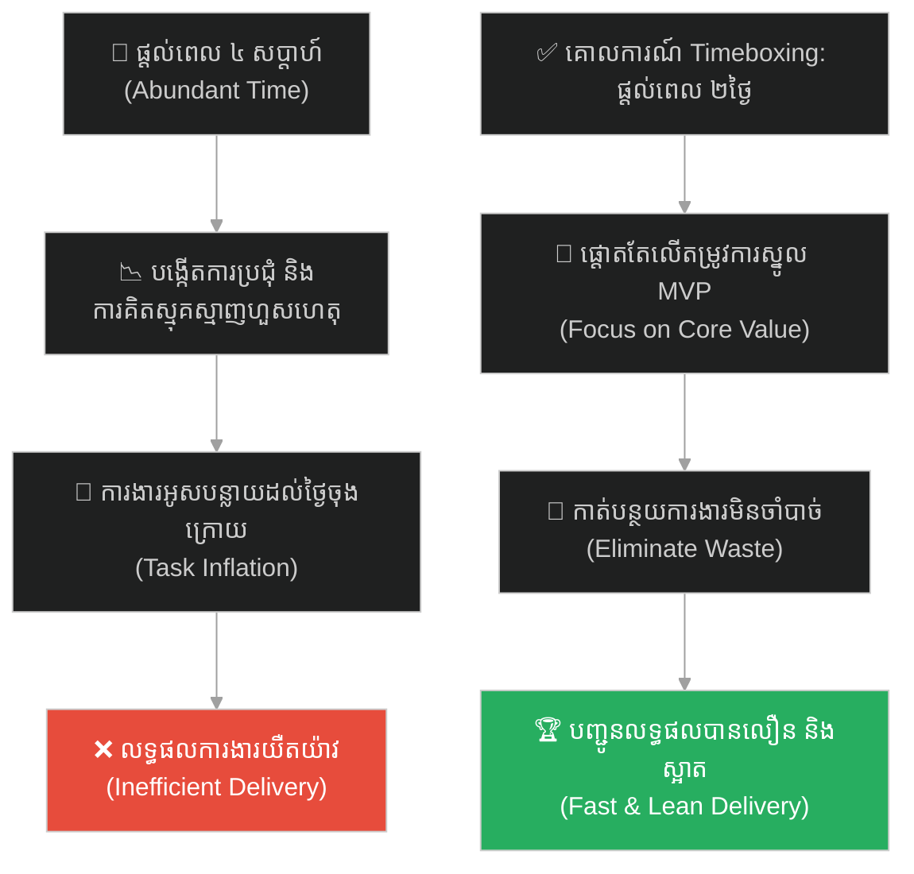
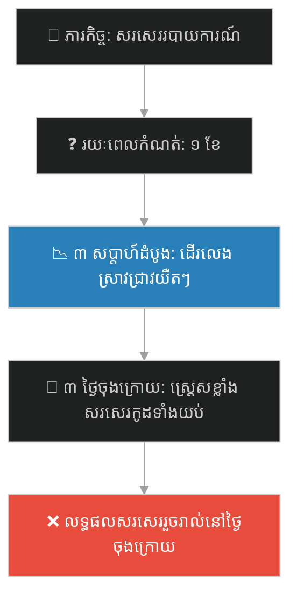
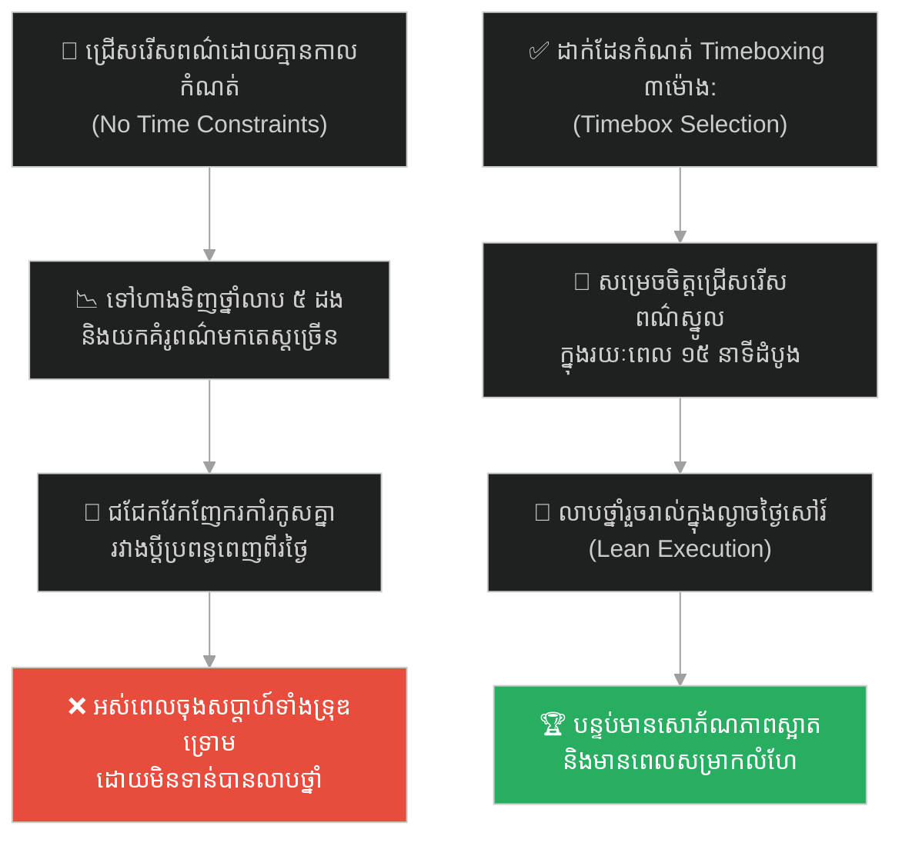
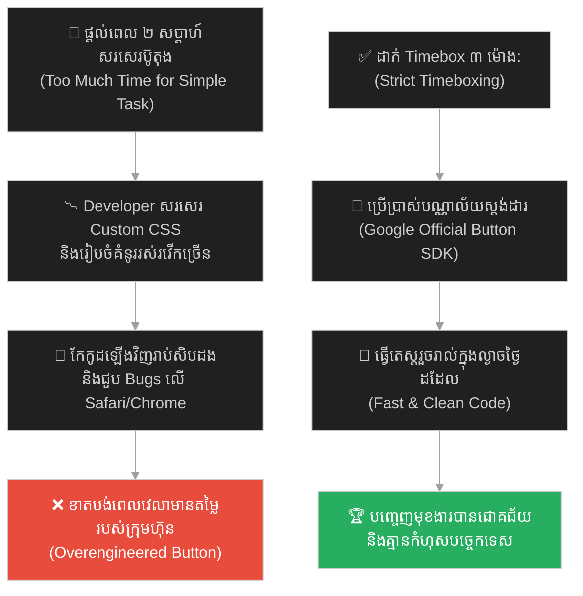
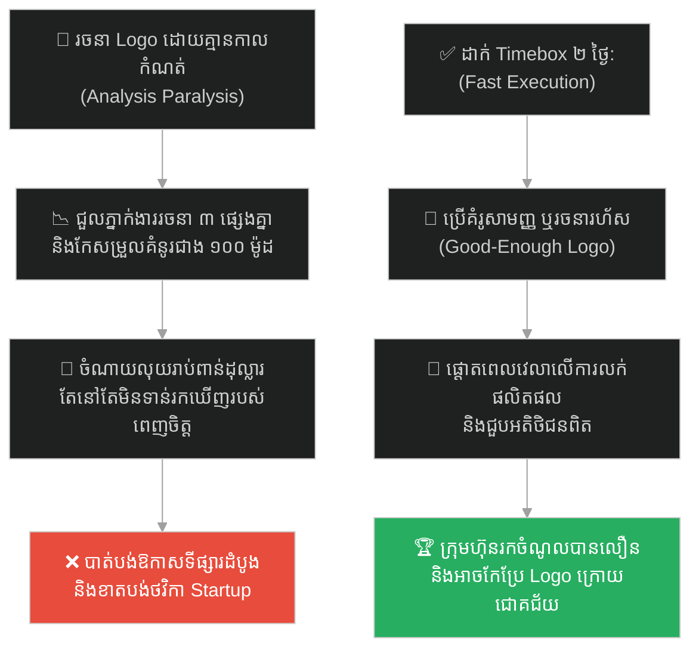
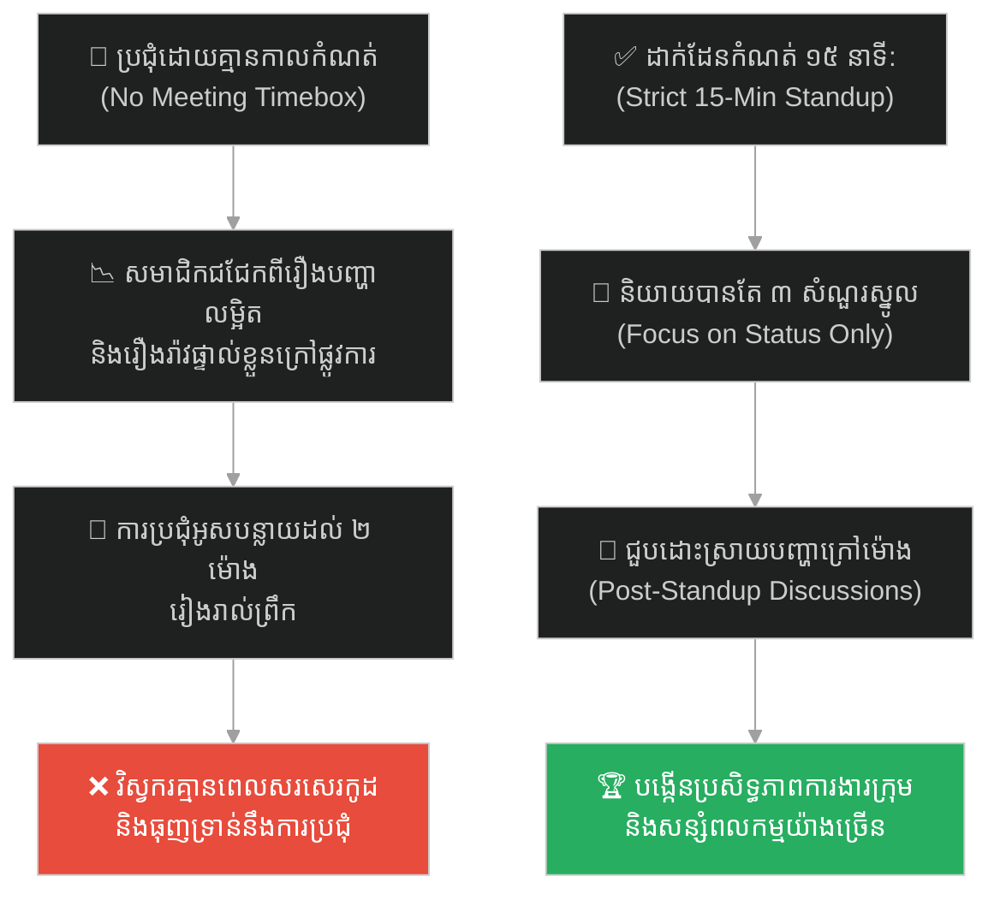
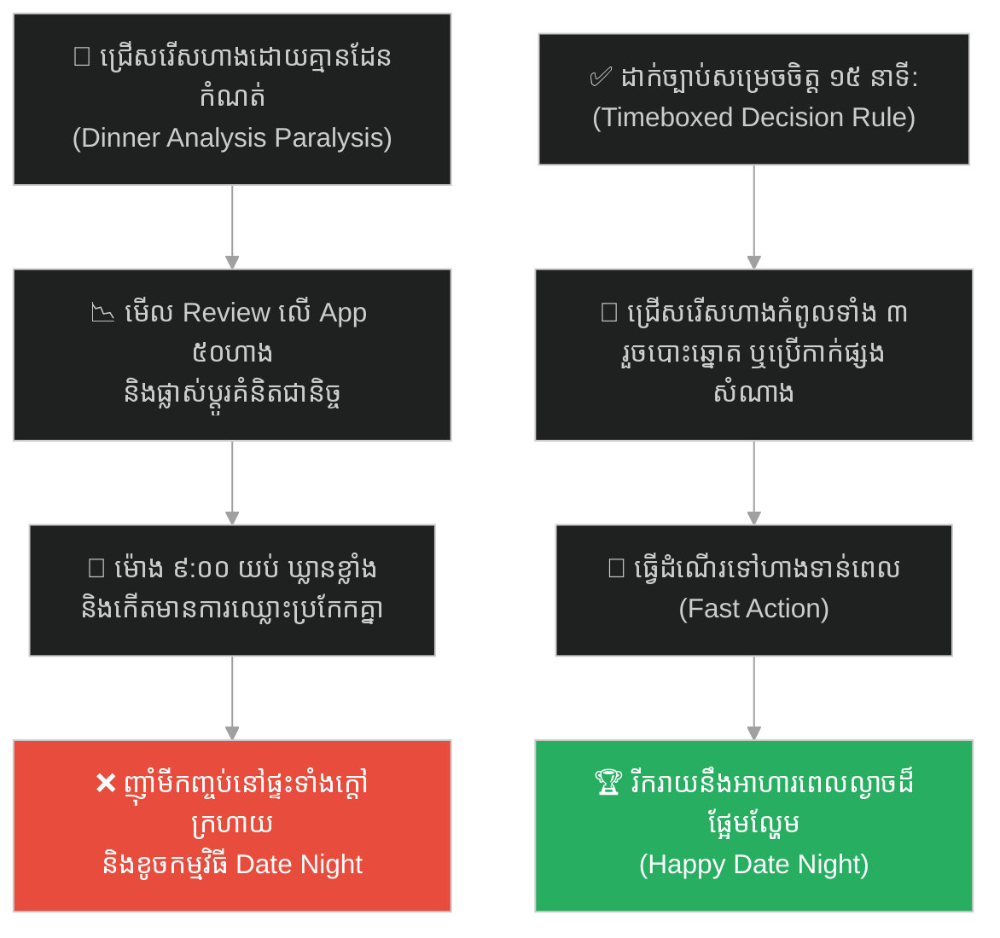
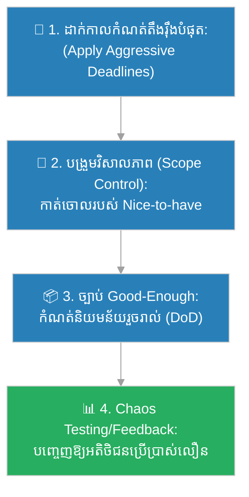

# Parkinson's Law (ច្បាប់របស់ផាកគីនសុន)៖ ស្ត្រីចំណាស់ និងសំបុត្រប្រៃសណីយ៍ (Parkinson's Law & The Old Lady's Postcard)

**Author:** ichamrong  
**Date:** 2026-05-27  
**Tags:** #parkinsons-law #productivity #time-management #timeboxing #efficiency #focus #parable  
**Category:** Concepts / Parables  
**Read Time:** ~15 min  

---

## 📌 មាតិកា (Table of Contents)
- [អន្ទាក់ផ្លូវចិត្ត (The Trap)](#0)
- [១. រឿងព្រេងប្រៀបធៀប៖ ស្ត្រីចំណាស់ និងការផ្ញើសំបុត្រប្រៃសណីយ៍រយៈពេលមួយថ្ងៃ (The Parable of the Old Lady & The Postcard)](#1)
  - [បុរសរវល់ និងការងារ ៣ នាទី (The Busy Man's Three-Minute Postcard)](#1-1)
- [២. បញ្ហា៖ និន្នាការនៃការរីកធំការងារ និងការខ្វះដែនកំណត់ពេលវេលា (The Issue: Task Expansion & Parkinson's Law)](#2)
- [៣. ឧទាហរណ៍ជាក់ស្តែងក្នុងពិភពពិត (Real World Examples)](#3)
  - [ឧទាហរណ៍ទី ១ — កម្រិតស្រាល (គ្រួសារ)៖ ការចំណាយពេលពេញមួយចុងសប្តាហ៍ដើម្បីជ្រើសរើសពណ៌ថ្នាំលាបផ្ទះ (The Infinite Paint Selection Dilemma)](#3-1)
  - [ឧទាហរណ៍ទី ២ — កម្រិតមធ្យម (បច្ចេកទេស)៖ ការរចនាប៊ូតុងឡកអ៊ីនសាមញ្ញអស់រយៈពេលពីរអាទិត្យ (The Two-Week Login Button Design)](#3-2)
  - [ឧទាហរណ៍ទី ៣ — កម្រិតមធ្យម (ធុរកិច្ច)៖ ការចំណាយពេល ៦ ខែរចនារូបសញ្ញាក្រុមហ៊ុន (The Six-Month Logo Analysis Paralysis)](#3-3)
  - [ឧទាហរណ៍ទី ៤ — កម្រិតមធ្យម (សង្គម/គ្រប់គ្រង)៖ ការប្រជុំប្រចាំថ្ងៃគ្មានដែនកំណត់កាលវេលា (The Unbounded Daily Standup Meeting)](#3-4)
  - [ឧទាហរណ៍ទី ៥ — កម្រិតធ្ងន់ (ទំនាក់ទំនង)៖ ការពន្យារពេលសម្រេចចិត្តទីកន្លែងអាហារពេលល្ងាចរហូតដល់ឃ្លាន (The Dinner Location Paralysis)](#3-5)
- [៤. ដំណោះស្រាយទូទៅ៖ ការអនុវត្តយន្តការ Timeboxing និងការបែងចែកគោលដៅតូចៗ (The General Solution: Timeboxing & Aggressive Scope Control)](#4)
- [សេចក្តីសន្និដ្ឋាន (Conclusion)](#5)
- [ឯកសារយោង (References)](#6)
- [Related Posts](#7)

---

## អន្ទាក់ផ្លូវចិត្ត (The Trap)

តើអ្នកធ្លាប់កត់សម្គាល់ឃើញទេថា នៅពេលដែលយើងត្រូវបានគេផ្តល់ពេលវេលាច្រើនហួសហេតុសម្រាប់កិច្ចការងារសាមញ្ញមួយ (ដូចជា ការសរសេរអ៊ីមែល ឬរៀបចំផែនការតូចមួយ) យើងច្រើនតែប្រើប្រាស់ពេលវេលាទាំងអស់នោះរហូតដល់នាទីចុងក្រោយ ដោយបង្កើតភាពស្មុគស្មាញ និងការប្រជុំឥតប្រយោជន៍ជាច្រើន ដើម្បីធ្វើឱ្យខ្លួនយើងមានអារម្មណ៍ថារវល់ដែរឬទេ?

នៅក្នុងផលិតភាពការងារ និងការគ្រប់គ្រងពេលវេលា៖
* **យើងងាយនឹងធ្លាក់ក្នុងអន្ទាក់** នៃការគិតថា "ពេលវេលាកាន់តែច្រើន គុណភាពការងារនឹងកាន់តែល្អ" (Time-Quality Bias)។
* **យើងមើលរំលង** យន្តការផ្លូវចិត្តដែលការងារនឹងរីកធំឡើង (Expand) ដោយស្វ័យប្រវត្តដើម្បីបំពេញពេលវេលាដែលបានកំណត់ឱ្យវា។

ការបណ្តោយឱ្យពេលវេលាច្រើន បំផ្លាញល្បឿន និងភាពសាមញ្ញនៃការងារ ហៅថា **អន្ទាក់ Parkinson's Law (លម្អៀងពេលវេលាច្បាប់ផាកគីនសុន)**។

ដើម្បីយល់ដឹងពីរបៀបដែលសំបុត្រមួយសន្លឹកអាចលេបត្របាក់ពេលវេលាពេញមួយថ្ងៃ នេះជាផែនទីបង្ហាញផ្លូវសម្រាប់អត្ថបទនេះ៖
1. **រឿងព្រេងប្រៀបធៀប (The Comparative Parable)** — រឿងប្រៀបធៀបរបស់ស្ត្រីចំណាស់ និងបុរសរវល់ក្នុងការផ្ញើសំបុត្រប្រៃសណីយ៍របស់ Cyril Northcote Parkinson។
2. **បញ្ហា (The Issue)** — យន្តការនៃការរីកធំការងារ (Task Inflation) និងគ្រោះថ្នាក់នៃ Overengineering។
3. **ឧទាហរណ៍ជាក់ស្តែងក្នុងពិភពពិត (Real World Examples)** — ពិនិត្យមើលច្បាប់នេះក្នុងកម្រិតគ្រួសារ បច្ចេកវិទ្យា ធុរកិច្ច ការគ្រប់គ្រង និងទំនាក់ទំនង។
4. **ដំណោះស្រាយទូទៅ (The General Solution)** — ការអនុវត្តយន្តការ Timeboxing និងការគ្រប់គ្រងវិសាលភាពការងារ (Scope Control)។

---

## ១. រឿងព្រេងប្រៀបធៀប៖ ស្ត្រីចំណាស់ និងការផ្ញើសំបុត្រប្រៃសណីយ៍រយៈពេលមួយថ្ងៃ (The Parable of the Old Lady & The Postcard)

នៅក្នុងឆ្នាំ ១៩៥៥ ប្រវត្តិវិទូ និងជាអ្នកនិពន្ធជនជាតិអង់គ្លេសលោក **Cyril Northcote Parkinson** បានសរសេរអត្ថបទវិភាគមួយនៅក្នុងទស្សនាវដ្តី *The Economist*។ ដើម្បីពន្យល់ពីរបៀបដែលរចនាសម្ព័ន្ធការងារការិយាល័យធំធាត់ដោយគ្មានប្រសិទ្ធភាព គាត់បានលើករឿងប្រៀបធៀបសាមញ្ញមួយអំពី៖ **ការសរសេរ និងផ្ញើសំបុត្រប្រៃសណីយ៍ (Postcard) មួយសន្លឹកទៅកាន់ក្មួយស្រី**។

គាត់បានប្រៀបធៀបស្ថានភាពរបស់មនុស្សពីរនាក់៖

* **ស្ត្រីចំណាស់ម្នាក់ដែលចូលនិវត្តន៍ (The Elderly Lady of Leisure)៖** គាត់គ្មានការងារអ្វីត្រូវធ្វើពេញមួយថ្ងៃឡើយ។ សម្រាប់គាត់ ការផ្ញើសំបុត្រមួយសន្លឹកនេះបានក្លាយជាកិច្ចការដែលលេបត្របាក់ពេលវេលាពេញមួយថ្ងៃ៖
  1. គាត់ចំណាយពេល **១ ម៉ោង** ដើម្បីដើរស្វែងរករូបភាពសំបុត្រដែលស្អាតបំផុតនៅក្នុងហាង។
  2. គាត់ចំណាយពេល **កន្លះម៉ោង** ទៀតដើម្បីដើររកវ៉ែនតារបស់គាត់ដែលភ្លេចកន្លែងទុក។
  3. គាត់ចំណាយពេល **១ ម៉ោងកន្លះ** ដើររាវរកសៀវភៅអាសយដ្ឋានរបស់ក្មួយស្រី។
  4. គាត់ចំណាយពេល **២ ម៉ោង** ទៀតអង្គុយគិត និងព្រាងពាក្យពេចន៍សរសេរនៅលើក្រដាស។
  5. គាត់ចំណាយពេល **២០ នាទី** ដើរទៅរកប្រអប់ប្រៃសណីយ៍នៅមុខផ្លូវ។

សរុបមក ស្ត្រីចំណាស់រូបនេះបានប្រើប្រាស់ពេលវេលា **ពេញមួយថ្ងៃ** យ៉ាងហត់នឿយ និងមានអារម្មណ៍ថារវល់ខ្លាំងបំផុត ដើម្បីសម្រេចកិច្ចការសរសេរសំបុត្រមួយសន្លឹកនេះ។

---

### បុរសរវល់ និងការងារ ៣ នាទី (The Busy Man's Three-Minute Postcard)

* **បុរសម្នាក់ដែលមានការងាររវល់ពេញមួយថ្ងៃ (The Busy Man)៖** គាត់ត្រូវធ្វើការងារជាច្រើនពីព្រលឹមទល់ព្រលប់។ គាត់មានពេលកំណត់ត្រឹមតែ ៥ នាទីមុនពេលឡានក្រុងមកដល់។ គាត់បានទាញសំបុត្រប្រៃសណីយ៍មកសរសេរអាសយដ្ឋានដោយការចងចាំ ព្រាងប្រយោគជូនពរខ្លីៗចំនួន ៣ ជួរ បិទតែម រួចបោះចូលប្រអប់ប្រៃសណីយ៍ក្បែរនោះភ្លាមៗ។ គាត់បានសម្រេចការងារដូចគ្នាដោយប្រើពេលត្រឹមតែ **៣ នាទី** ប៉ុណ្ណោះ។

តាមរយៈរឿងនេះ លោក Parkinson បានបង្កើតច្បាប់មួយដែលត្រូវបានគេទទួលស្គាល់ទូទាំងពិភពលោកហៅថា **"Parkinson's Law (ច្បាប់របស់ផាកគីនសុន)"** ដែលចែងថា៖

> **«Work expands so as to fill the time available for its completion.»**  
> *(ការងារនឹងរីកធំឡើង ដើម្បីបំពេញពេលវេលាដែលបានកំណត់ឱ្យវា)*

ប្រសិនបើអ្នកមានពេល ១ ខែ ដើម្បីបញ្ចប់កិច្ចការមួយ ការងារនោះនឹងរីកធំឡើងដោយស្វ័យប្រវត្តតាមរយៈការគិតស្មុគស្មាញ ការកែកុនឡើងវិញ និងការបង្កើតបញ្ហាសិប្បនិម្មិតដើម្បីឱ្យស័ក្តិសមនឹងរយៈពេល ១ ខែនោះ។ ប៉ុន្តែប្រសិនបើអ្នកមានពេលត្រឹមតែ ១ ថ្ងៃសម្រាប់កិច្ចការដដែលនោះ គំនិតរបស់អ្នកនឹងផ្តោតលើភាពសាមញ្ញ និងការសម្រេចវាឱ្យបានលឿនបំផុត។

---

## ២. បញ្ហា៖ និន្នាការនៃការរីកធំការងារ និងការខ្វះដែនកំណត់ពេលវេលា (The Issue: Task Expansion & Parkinson's Law)

នៅក្នុងការគ្រប់គ្រងគម្រោង និងការអភិវឌ្ឍន៍សូហ្វវែរ ច្បាប់របស់ផាកគីនសុនគឺជាសត្រូវស្ងប់ស្ងាត់ដែលបំផ្លាញផលិតភាព៖
1. **Overengineering (ការបង្កើតភាពស្មុគស្មាញហួសហេតុ)៖** ប្រសិនបើអ្នកប្រគល់សំបុត្រការងារ (Jira Ticket) មួយឱ្យ Developer ហើយប្រាប់ថា "បងឱ្យពេល ២ សប្តាហ៍សម្រាប់កិច្ចការនេះ" ទោះបីជាការងារជាក់ស្តែងត្រូវការពេលតែ ២ ថ្ងៃក៏ដោយ វិស្វករនឹងមិនសរសេរវារួចរាល់ក្នុងរយៈពេល ២ ថ្ងៃឡើយ។ ពួកគេនឹងចំណាយពេល ១០ ថ្ងៃទៀតដើម្បីស្រាវជ្រាវបច្ចេកវិទ្យាថ្មី សរសេររចនាសម្ព័ន្ធស្មុគស្មាញ និងបង្កើត Custom Animations ដែលអតិថិជនមិនត្រូវការ។
2. **ការប្រជុំគ្មានប្រសិទ្ធភាព (Meeting Proliferations)៖** នៅពេលគម្រោងមានពេលច្រើន ក្រុមការងារនឹងរៀបចំការប្រជុំជាច្រើនដើម្បី "ពិភាក្សា និងតម្រង់ទិស" ដែលប្រៀបដូចជាស្ត្រីចំណាស់ដែលចំណាយពេលដើររកវ៉ែនតា និងសៀវភៅអាសយដ្ឋានដូច្នោះដែរ។
3. **ការខ្វះ Timeboxing (No Limits)៖** បើគ្មានការដាក់កាលបរិច្ឆេទបញ្ចប់ដ៏តឹងរ៉ឹង (Hard Deadlines) ទេ ការងារនឹងមិនត្រូវបានសម្រេចឡើយ ព្រោះមនុស្សតែងតែស្វែងរកវិធីសង្កត់លើភាពល្អឥតខ្ចោះសិប្បនិម្មិត។

---

## ៣. ឧទាហរណ៍ជាក់ស្តែងក្នុងពិភពពិត (Real World Examples)

---

### ឧទាហរណ៍ទី ១ — កម្រិតស្រាល (គ្រួសារ)៖ ការចំណាយពេលពេញមួយចុងសប្តាហ៍ដើម្បីជ្រើសរើសពណ៌ថ្នាំលាបផ្ទះ (The Infinite Paint Selection Dilemma)

គ្រួសារមួយសម្រេចចិត្តលាបពណ៌បន្ទប់ទទួលភ្ញៀវឡើងវិញ។ ដោយសារពួកគេមានពេលពេញមួយចុងសប្តាហ៍សេរី (គ្មានគម្រោងការងារផ្សេង) ការជ្រើសរើសពណ៌ថ្នាំលាបបានក្លាយជាវិបត្តិដ៏ធំ។

ពួកគេបានទៅហាងលក់ថ្នាំលាបចំនួន ៥ ដងដើម្បីយកគំរូពណ៌ផ្សេងៗគ្នាមកបិទលើជញ្ជាំងតេស្ត។ ប្តីប្រពន្ធបានជជែកវែកញែកគ្នាឥតឈប់ឈររវាងពណ៌ខៀវខ្ចី និងខៀវចាស់។ ទីបំផុត ពេលពីរថ្ងៃបានកន្លងផុតទៅ ពួកគេមានអារម្មណ៍ហត់នឿយ និងស្ត្រេសខ្លាំង ប៉ុន្តែជញ្ជាំងផ្ទះនៅតែមិនទាន់បានលាបថ្នាំសូម្បីតែមួយតំណក់។

ប្រសិនបើពួកគេប្រើប្រាស់វិធីសាស្ត្រ Timeboxing ពួកគេគួរតែប្រាប់ខ្លួនឯងថា៖ *"យើងមានពេលតែ ៣ ម៉ោងនៅព្រឹកថ្ងៃសៅរ៍ដើម្បីទិញ និងជ្រើសរើសពណ៌ បន្ទាប់មកយើងត្រូវលាបវាឱ្យរួចរាល់នៅល្ងាចថ្ងៃដដែល"*។ ដែនកំណត់នេះនឹងបង្ខំឱ្យពួកគេជ្រើសរើសពណ៌ដែលសមស្របភ្លាមៗ។

---

### ឧទាហរណ៍ទី ២ — កម្រិតមធ្យម (បច្ចេកទេស)៖ ការរចនាប៊ូតុងឡកអ៊ីនសាមញ្ញអស់រយៈពេលពីរអាទិត្យ (The Two-Week Login Button Design)

នៅក្នុងក្រុមហ៊ុនបច្ចេកវិទ្យាមួយ Developer ម្នាក់ត្រូវបានប្រគល់ភារកិច្ចឱ្យបង្កើតប៊ូតុង "Login with Google" ថ្មីមួយនៅលើទំព័រដើម។ ដោយសារតែ Sprint នោះមិនសូវរវល់ Tech Lead បានប្រាប់ថា៖ *"ប្អូនធ្វើវាទៅ ឱ្យពេល ២ សប្តាហ៍"*។

Developer រូបនោះមិនបានទាញយកបណ្ណាល័យស្តង់ដារមកប្រើប្រាស់ភ្លាមៗឡើយ។ គាត់បានចំណាយពេល ៣ ថ្ងៃស្រាវជ្រាវពី Custom CSS Shaders បង្កើតគំនូររស់រវើក (Custom Hover Animations) ដ៏ស្មុគស្មាញ និងសរសេរកូដតេស្តសាកល្បងដ៏វែងអន្លាយ។ គាត់ជួបបញ្ហា Bugs លើកូដគំនូរនោះនៅពេលដំណើរការលើទូរស័ព្ទ Safari ធ្វើឱ្យគាត់ត្រូវចំណាយពេល ១ សប្តាហ៍ទៀតដើម្បីជួសជុល។ ទីបំផុត គាត់បានបញ្ជូនការងារនៅថ្ងៃចុងក្រោយនៃ Sprint រយៈពេល ២ សប្តាហ៍។

ការងារដែលគួរតែរួចរាល់ក្នុងរយៈពេល ៣ ម៉ោង បែរជាស៊ីពេលក្រុមហ៊ុនអស់ ២ សប្តាហ៍ ព្រោះតែ Parkinson's Law។

---

### ឧទាហរណ៍ទី ៣ — កម្រិតមធ្យម (ធុរកិច្ច)៖ ការចំណាយពេល ៦ ខែរចនារូបសញ្ញាក្រុមហ៊ុន (The Six-Month Logo Analysis Paralysis)

ស្ថាបនិក Startup ពីរនាក់ចង់បង្កើតក្រុមហ៊ុនថ្មីមួយ។ ពួកគេបានសម្រេចចិត្តថា ពួកគេត្រូវតែមានរូបសញ្ញា (Logo) ដ៏ល្អឥតខ្ចោះ និងអស្ចារ្យបំផុត មុននឹងចាប់ផ្តើមជួបជាមួយអតិថិជនដំបូង ឬសរសេរកូដផលិតផល (ការខ្វះការកំណត់ពេលវេលា Launch)។

ពួកគេបានចំណាយពេល ៦ ខែ ជួលភ្នាក់ងាររចនាក្រាហ្វិកចំនួន ៣ ផ្សេងគ្នា កែប្រែពុម្ពអក្សរ ពណ៌ និងទម្រង់រាប់រយដង។ ពួកគេជជែកគ្នាពីអត្ថន័យចិត្តវិទ្យានៃពណ៌ខៀវ និងពណ៌បៃតងរៀងរាល់សប្តាហ៍។ ក្នុងអំឡុងពេល ៦ ខែនោះ គូប្រជែងរបស់ពួកគេបានបញ្ចេញផលិតផលសាកល្បងលក់លើទីផ្សារ និងដណ្តើមបានអតិថិជនអស់ទៅហើយ។ Logo ដ៏ស្អាតរបស់ពួកគេគ្មានតម្លៃអ្វីឡើយ ព្រោះក្រុមហ៊ុនមិនទាន់ទាំងបានចាប់ផ្តើមលក់ទំនិញផង។

ដំណោះស្រាយ៖ ពួកគេគួរតែកំណត់ពេល ២ ថ្ងៃដើម្បីជ្រើសរើស Logo "Good-enough (ល្អល្មមប្រើ)" រួចយកពេលវេលាទាំងអស់ទៅកសាងផលិតផលលក់។

---

### ឧទាហរណ៍ទី ៤ — កម្រិតមធ្យម (សង្គម/គ្រប់គ្រង)៖ ការប្រជុំប្រចាំថ្ងៃគ្មានដែនកំណត់កាលវេលា (The Unbounded Daily Standup Meeting)

ប្រធានក្រុមម្នាក់បានរៀបចំការប្រជុំខ្លីប្រចាំថ្ងៃ (Daily Standup) ប៉ុន្តែគាត់មិនបានកំណត់រយៈពេលប្រជុំច្បាស់លាស់ឡើយ គាត់គ្រាន់តែប្រាប់ថា៖ *"យើងប្រជុំគ្នារហូតដល់និយាយរឿងការងារចប់"*។

ការប្រជុំដែលគួរចំណាយពេលតែ ១៥ នាទី បានរីកធំឡើងរៀងរាល់ព្រឹកដល់ទៅ ២ ម៉ោង។ សមាជិកម្នាក់ៗចាប់ផ្តើមជជែកវែកញែកលម្អិតពីរបៀបដោះស្រាយ Bugs និយាយពីរឿងរ៉ាវព័ត៌មានផ្ទាល់ខ្លួន ឬជជែកពីរឿងអាកាសធាតុ។ វិស្វករមានអារម្មណ៍ធុញទ្រាន់ និងហត់នឿយខ្លាំង ព្រោះពួកគេបាត់បង់ពេលវេលាបំពេញការងារស្នូលនៅពេលព្រឹក។

ដំណោះស្រាយ៖ ត្រូវកំណត់រយៈពេល Daily Standup យ៉ាងតឹងរ៉ឹងត្រឹមតែ ១៥ នាទីប៉ុណ្ណោះ (Timeboxed Standup) ដោយឈរប្រជុំ (Standup) ដើម្បីបង្ខំឱ្យមនុស្សនិយាយខ្លីៗ និងចំចំណុច។

---

### ឧទាហរណ៍ទី ៥ — កម្រិតធ្ងន់ (ទំនាក់ទំនង)៖ ការពន្យារពេលសម្រេចចិត្តទីកន្លែងអាហារពេលល្ងាចរហូតដល់ឃ្លាន (The Dinner Location Paralysis)

ប្តីប្រពន្ធមួយគូចង់ទៅញ៉ាំអាហារពេលល្ងាចជាមួយគ្នានៅថ្ងៃចុងសប្តាហ៍។ ពួកគេបានចាប់ផ្តើមពិភាក្សាគ្នានៅម៉ោង ៥:០០ ល្ងាចថាគួរទៅញ៉ាំអីនៅទីណា។ ដោយសារតែមិនបានកំណត់ពេលវេលាសម្រេចចិត្តច្បាស់លាស់ ពួកគេបានជជែកគ្នាយ៉ាងវែងអន្លាយ។

ពួកគេបានមើលការវាយតម្លៃ (Reviews) លើទូរស័ព្ទចំនួន ៥០ ហាង៖ ម្នាក់ចង់ញ៉ាំអាហារជប៉ុន ម្នាក់ទៀតចង់ញ៉ាំអាហារអ៊ីតាលី រួចបារម្ភពីរឿងកកស្ទះចរាចរណ៍ ឬតម្លៃថ្លៃ។ ម៉ោង ៩:០០ យប់បានឈានចូលមកដល់ ពួកគេទាំងពីរឃ្លានខ្លាំងរហូតដល់កើតមានអារម្មណ៍ឆេវឆាវ និងឈ្លោះប្រកែកគ្នាខ្លាំងៗ។ ទីបំផុត ពួកគេសម្រេចចិត្តញ៉ាំមីកញ្ចប់សាមញ្ញនៅផ្ទះរៀងៗខ្លួន ទាំងអារម្មណ៍ក្តៅក្រហាយ និងខូចកម្មវិធី Date Night ដ៏មានតម្លៃចោល។

ដំណោះស្រាយ៖ ត្រូវកំណត់ច្បាប់ថា "យើងមានពេលតែ ១៥ នាទីដើម្បីជ្រើសរើសហាង បើសម្រេចចិត្តមិនត្រូវគ្នាទេ ហាងជប៉ុនក្បែរផ្ទះនឹងក្លាយជាជម្រើសស្វ័យប្រវត្ត"។

---

## ៤. ដំណោះស្រាយទូទៅ៖ ការអនុវត្តយន្តការ Timeboxing និងការបែងចែកគោលដៅតូចៗ (The General Solution: Timeboxing & Aggressive Scope Control)

ដើម្បីវាយកម្ទេចច្បាប់របស់ផាកគីនសុន និងបង្កើនផលិតភាពការងារ យើងត្រូវអនុវត្តយន្តការ **Timeboxing (ការកំណត់ដែនពេលវេលា)** ដូចខាងក្រោម៖

ជំហាននៃការអនុវត្ត៖
1. **ដាក់កាលកំណត់តឹងរ៉ឹង (Apply Aggressive Deadlines)៖** កំណត់រយៈពេលអតិបរមាសម្រាប់កិច្ចការនីមួយៗឱ្យខ្លីជាងការស្មានធម្មតា (ឧទាហរណ៍ កាត់បន្ថយរយៈពេលស្មានការងារពី ៥ ថ្ងៃមកត្រឹម ៣ ថ្ងៃ)។ នេះជួយជម្រុញស្មារតីច្នៃប្រឌិត និងការផ្តោតអារម្មណ៍កម្រិតខ្ពស់។
2. **បង្រួមវិសាលភាពការងារ (Control Scope Aggressively)៖** ប្រសិនបើពេលវេលាត្រូវបានកំណត់ឱ្យខ្លី យើងត្រូវតែកាត់ចោលរាល់មុខងារបន្ថែមដែលមិនចាំបាច់។ ផ្តោតការងារលើតែ Core Utility ដែលផ្តល់តម្លៃពិតប្រាកដដល់អតិថិជន។
3. **កំណត់និយមន័យរួចរាល់ (Definition of Done - DoD)៖** បង្កើតស្តង់ដារច្បាស់លាស់ថា "ការងាររួចរាល់គឺមានន័យត្រឹមណា" (ឧទាហរណ៍ ប៊ូតុងដំណើរការ និងតេស្តជោគជ័យ) ដើម្បីកុំឱ្យវិស្វករចំណាយពេលរៀបចំលម្អបន្ថែមដែលគ្មានប្រយោជន៍។
4. **កម្ទេចគំនិតចង់បានភាពល្អឥតខ្ចោះ (Embrace Good-Enough Strategy)៖** រំលឹកខ្លួនឯងថា ផលិតផលដែលដើរបានល្អល្មមនៅលើទីផ្សារបច្ចុប្បន្ន មានតម្លៃជាងផលិតផលដ៏ល្អឥតខ្ចោះដែលមិនទាន់បានបញ្ចេញលក់។

---

## 🐇 ធ្លាក់ចូលក្នុងរន្ធទន្សាយ (Enter the Strategic Rabbit Hole)

ដើម្បីស្វែងយល់កាន់តែស៊ីជម្រៅអំពីរបៀបដែល "ដែនកំណត់តឹងរ៉ឹងបំផុត" (Constraints) អាចជំរុញឱ្យអ្នកនិពន្ធដ៏ល្បីល្បាញ Dr. Seuss បង្កើតបានសៀវភៅកុមារលក់ដាច់បំផុតប្រចាំប្រវត្តិសាស្ត្រ តាមរយៈការភ្នាល់សរសេរសៀវភៅប្រើប្រាស់ពាក្យត្រឹមតែ ៥០ ពាក្យគត់ សូមបន្តដំណើររុករករបស់អ្នកទៅកាន់៖

* 🚀 **[ចាប់ផ្តើមដំណើររុករក (Start the Journey) ➔ Dr. Seuss and the Power of Constraints](./68-dr-seuss-and-the-power-of-constraints.md)**

---

## សេចក្តីសន្និដ្ឋាន (Conclusion)

> **«កុំផ្តល់ពេលវេលាច្រើនហួសហេតុសម្រាប់កិច្ចការងារសាមញ្ញ។ ចូរដាក់កាលកំណត់ឱ្យខ្លី ដើម្បីបង្ខំឱ្យខ្លួនអ្នកផ្តោតលើភាពសាមញ្ញ និងការសម្រេចបានលទ្ធផលពិតប្រាកដ។»**

ច្បាប់របស់ផាកគីនសុន បង្រៀនយើងឱ្យដឹងថា ពេលវេលាច្រើនមិនមែនជាស្ពាននាំទៅរកគុណភាពការងារខ្ពស់នោះទេ តែវាជាការបើកទ្វារឱ្យមានភាពខ្ជិលច្រអូស ការគិតស្មុគស្មាញ និងការប្រជុំឥតប្រយោជន៍។ ចូរអនុវត្តយន្តការ Timeboxing និងគ្រប់គ្រងវិសាលភាពការងារឱ្យបានហ្មត់ចត់បំផុត ដើម្បីវាយបំបែកអន្ទាក់ពេលវេលា និងកសាងលទ្ធផលការងារដ៏មានប្រសិទ្ធភាពខ្ពស់។

---

## ឯកសារយោង (References)

* **C. Northcote Parkinson** — *Parkinson's Law, or The Pursuit of Progress* (1957). សៀវភៅច្បាប់ដើមដែលពន្យល់ពីច្បាប់របស់ផាកគីនសុន និងការរីកធំធាត់ការិយាល័យ។
* **Jake Knapp** — *Sprint: How to Solve Big Problems and Test New Ideas in Just Five Days* (2016). របៀបប្រើប្រាស់ Timeboxing ៥ ថ្ងៃដើម្បីបង្កើត និងតេស្តផលិតផល។
* **Cal Newport** — *Deep Work: Rules for Focused Success in a Distracted World* (2016). ទស្សនវិជ្ជាគ្រប់គ្រងពេលវេលា និងការបង្កើតសម្ពាធពេលវេលាសិប្បនិម្មិតសម្រាប់លទ្ធផលការងារខ្ពស់។

---

## Related Posts

* **[56 The 1202 Alarm: Graceful Degradation and Prioritization](./56-the-1202-alarm.md)** — របៀបបោះចោលភារកិច្ចមិនសូវសំខាន់នៅពេលប្រព័ន្ធការងារមាន load ខ្លាំង។
* **[60-the-first-flight.md](./60-the-first-flight.md)** — របៀបដែលបងប្អូនត្រកូលរ៉ាយប្រើប្រាស់ការធ្វើតេស្តខ្នាតតូចបន្តបន្ទាប់ដើម្បីសន្សំពេលវេលា និងលុយកាក់។
* **[66-han-xin-and-the-river-of-no-return.md](./66-han-xin-and-the-river-of-no-return.md)** — របៀបប្រើប្រាស់យុទ្ធសាស្ត្រសមរភូមិគ្មានផ្លូវថយ ដើម្បីបង្កើតភាពបន្ទាន់ការងារ។

---

## Related

- [💡 Concepts README](../README.md)
- [📚 Main Repository README](../../../README.md)
- [Developer Habits](../../developer-habits/README.md)
- [Mental Health & Well-being](../../mental-health/README.md)
- [Management & SDLC](../../management/README.md)
