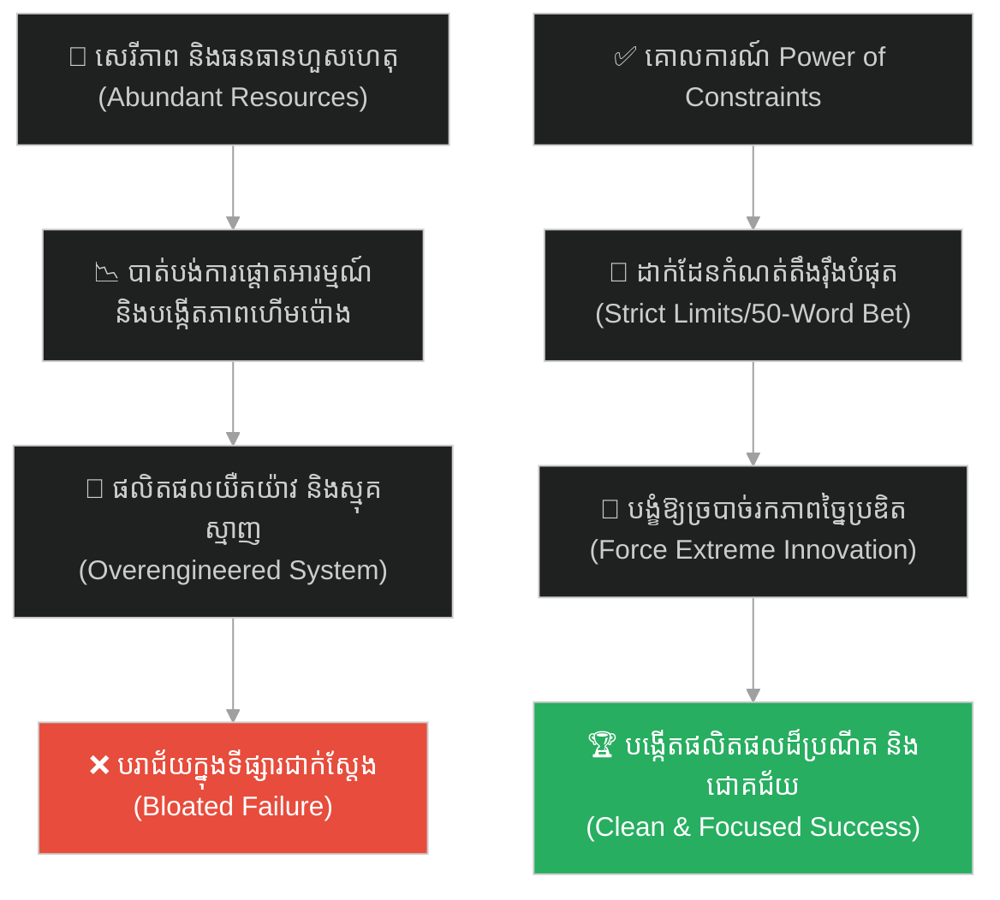
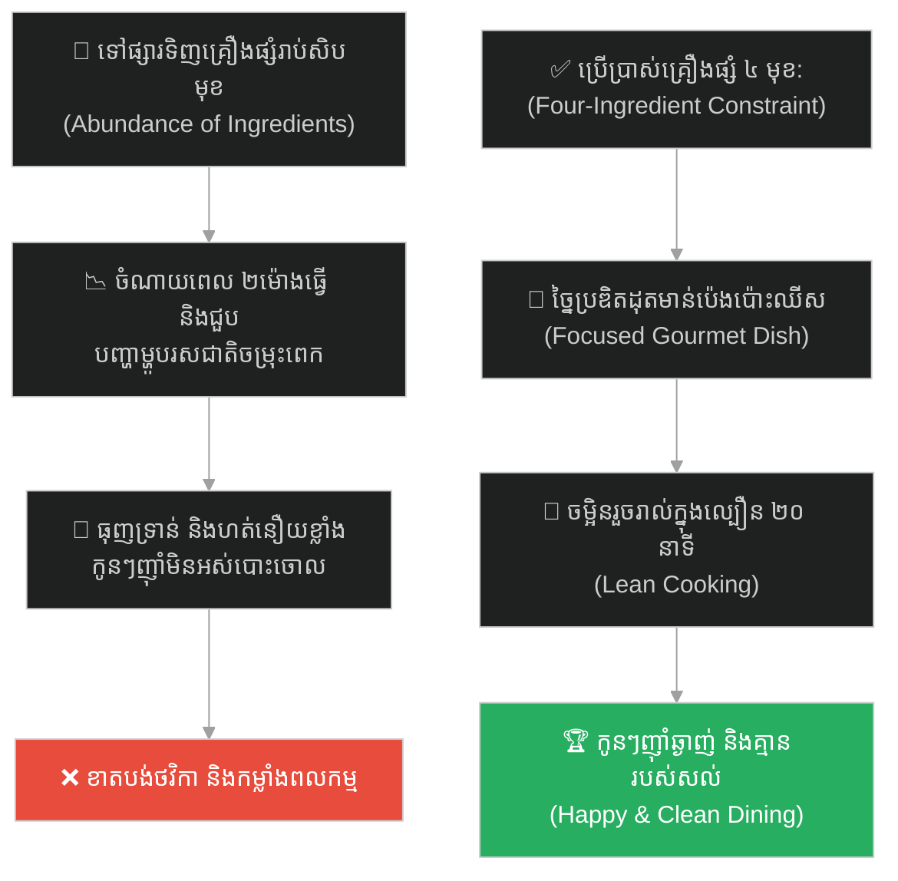
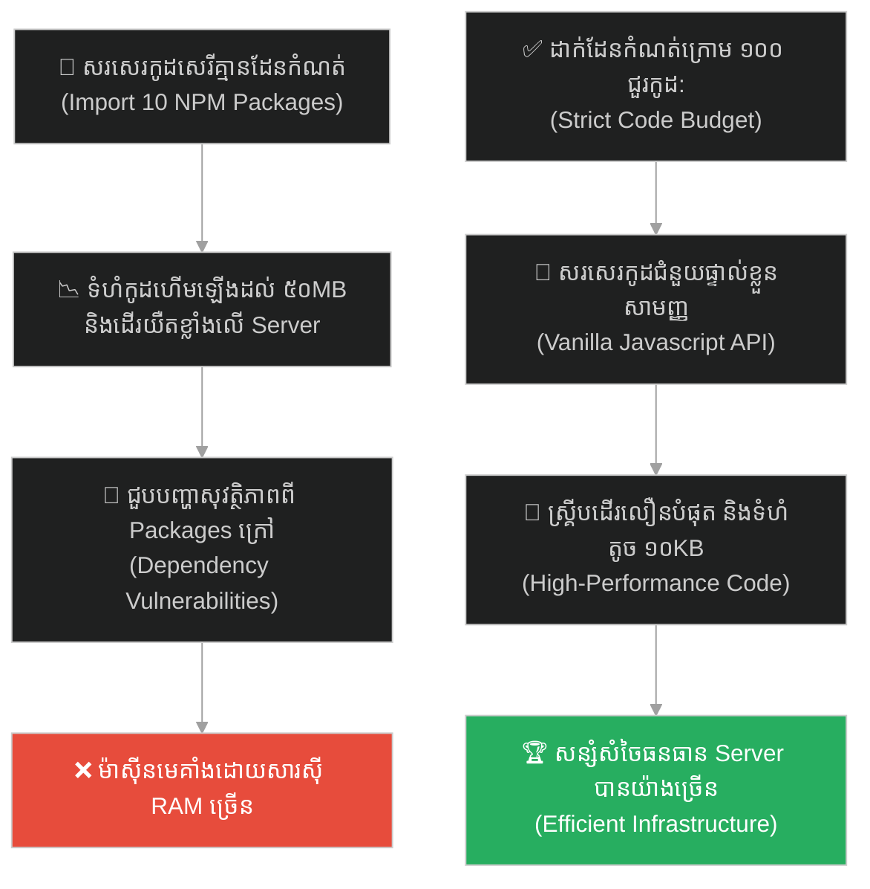
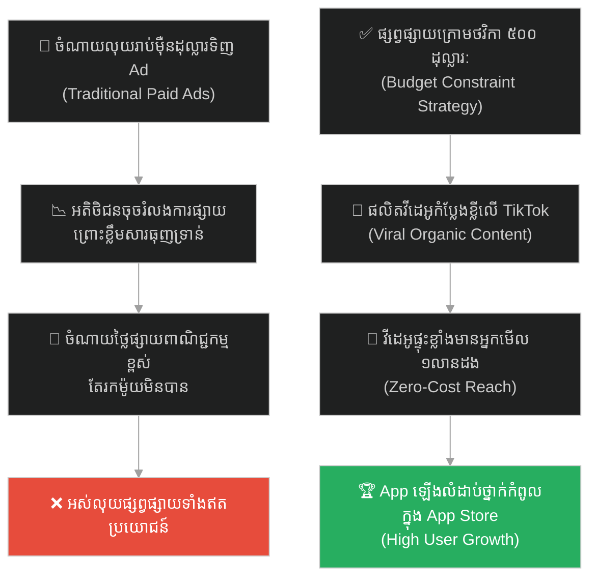
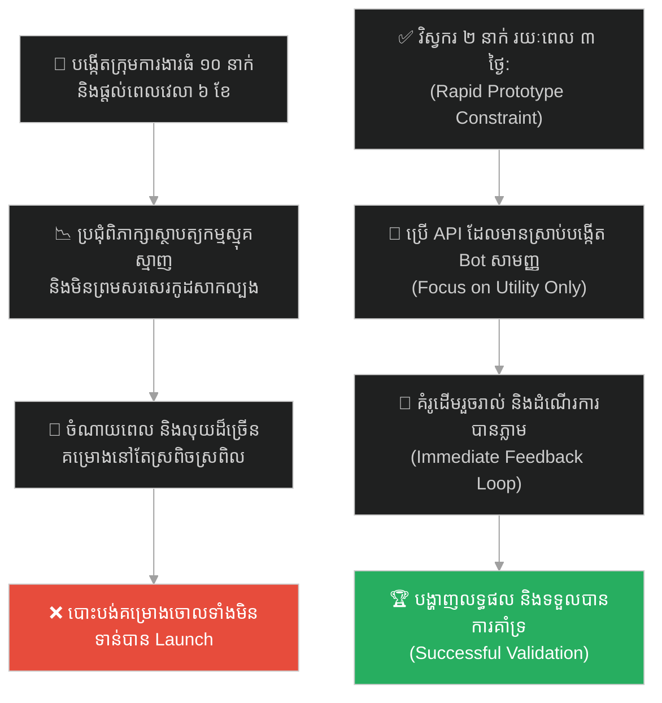
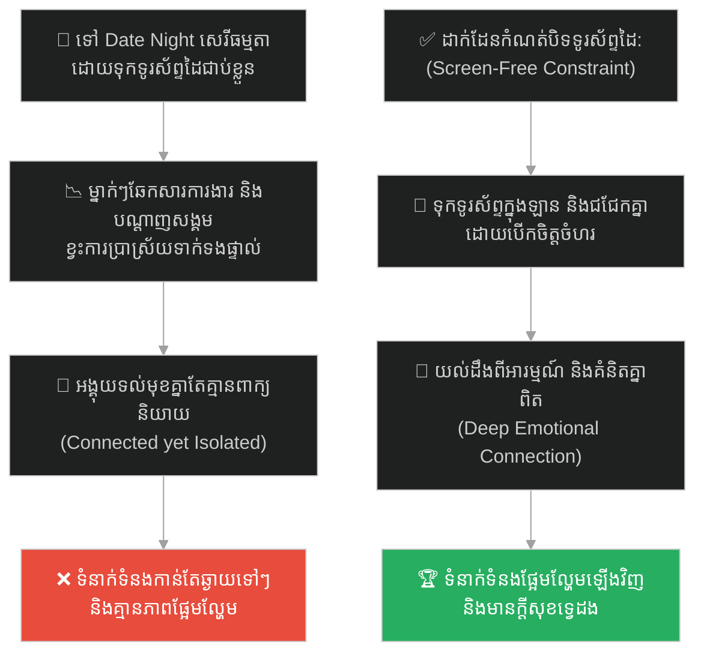
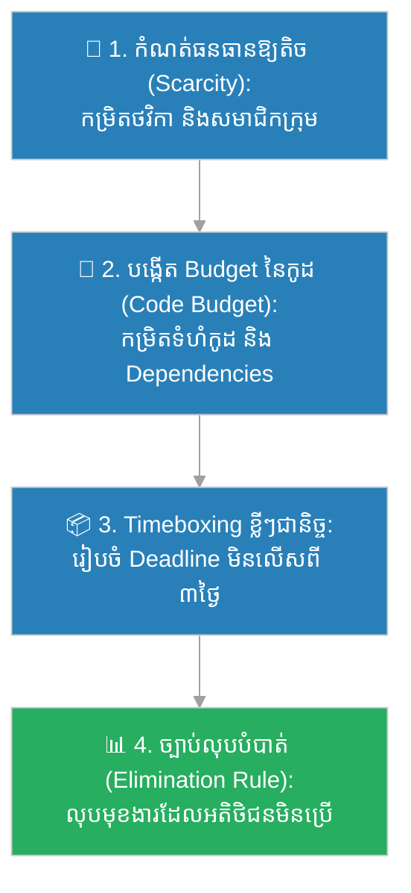

# Power of Constraints (ថាមពលនៃដែនកំណត់)៖ វេជ្ជបណ្ឌិតស៊ុស និងការភ្នាល់ ៥០ ពាក្យ (Power of Constraints & The 50-Word Bet)

**Author:** ichamrong  
**Date:** 2026-05-27  
**Tags:** #power-of-constraints #creativity #innovation #optimization #resourcefulness #parable  
**Category:** Concepts / Parables  
**Read Time:** ~15 min  

---

## 📌 មាតិកា (Table of Contents)
- [អន្ទាក់ផ្លូវចិត្ត (The Trap)](#0)
- [១. រឿងព្រេងប្រវត្តិសាស្ត្រ៖ លោក Dr. Seuss និងការភ្នាល់សរសេរសៀវភៅប្រើប្រាស់ ៥០ ពាក្យ (The Legend of Dr. Seuss's 50-Word Bet)](#1)
  - [សេរីភាពដែលគ្មានដែនកំណត់ សម្លាប់ភាពច្នៃប្រឌិត (How Abundance Smothers Innovation)](#1-1)
- [២. បញ្ហា៖ គ្រោះថ្នាក់នៃធនធានហៀរហូរ និងយន្តការសម្រួចស្មារតីរបស់ Constraints (The Issue: Resource Abundance vs. Creative Focus)](#2)
- [៣. ឧទាហរណ៍ជាក់ស្តែងក្នុងពិភពពិត (Real World Examples)](#3)
  - [ឧទាហរណ៍ទី ១ — កម្រិតស្រាល (គ្រួសារ)៖ ការចម្អិនអាហារពេលល្ងាចដ៏ឈ្ងុយឆ្ងាញ់ដោយប្រើតែគ្រឿងផ្សំ ៤ មុខដែលនៅសល់ក្នុងទូរទឹកកក (The Four-Ingredient Gourmet Dinner)](#3-1)
  - [ឧទាហរណ៍ទី ២ — កម្រិតមធ្យម (បច្ចេកទេស)៖ ការសរសេរស្គ្រីបឧបករណ៍មានដំណើរការខ្ពស់ឱ្យបានក្រោម ១០០ ជួរកូដ (The Under-100 Lines Optimization)](#3-2)
  - [ឧទាហរណ៍ទី ៣ — កម្រិតមធ្យម (ធុរកិច្ច)៖ ការបញ្ចេញយុទ្ធនាការផ្សព្វផ្សាយដោយប្រើប្រាស់ថវិកាតែ ៥០០ ដុល្លារ (The Zero-Budget Viral Marketing)](#3-3)
  - [ឧទាហរណ៍ទី ៤ — កម្រិតមធ្យម (សង្គម/គ្រប់គ្រង)៖ ការប្រគល់គម្រោងបង្កើតគំរូសាកល្បងឱ្យក្រុមការងារ ២ នាក់ធ្វើក្នុងពេល ៣ ថ្ងៃ (The 3-Day Rapid Prototyping)](#3-4)
  - [ឧទាហរណ៍ទី ៥ — កម្រិតធ្ងន់ (ទំនាក់ទំនង)៖ ការកំណត់រៀបចំកម្មវិធី Date Night ដោយគ្មានទូរស័ព្ទដៃ (The Screen-Free Relationship Date)](#3-5)
- [៤. ដំណោះស្រាយទូទៅ៖ ការបង្កើតដែនកំណត់សិប្បនិម្មិតដើម្បីជំរុញនវានុវត្តន៍ (The General Solution: Artificial Constraints & Creative Constraints Framework)](#4)
- [សេចក្តីសន្និដ្ឋាន (Conclusion)](#5)
- [ឯកសារយោង (References)](#6)
- [Related Posts](#7)

---

## អន្ទាក់ផ្លូវចិត្ត (The Trap)

តើអ្នកធ្លាប់ជឿជាក់ទេថា "ប្រសិនបើខ្ញុំមានធនធានហិរញ្ញវត្ថុច្រើន ពេលវេលាច្រើន និងក្រុមការងារធំ ខ្ញុំប្រាកដជាអាចសរសេរកូដ ឬបង្កើតផលិតផលដ៏ល្អឥតខ្ចោះបំផុតមិនខាន" ប៉ុន្តែចុងក្រោយស្រាប់តែរកឃើញថា ភាពធូរធារហួសហេតុទាំងនោះ បែរជានាំឱ្យបាត់បង់ការផ្តោតអារម្មណ៍ និងបង្កើតប្រព័ន្ធការងារដ៏ហើមប៉ោង និងស្មុគស្មាញទៅវិញដែរឬទេ?

នៅក្នុងចិត្តវិទ្យានៃការបង្កើតថ្មី និងការគ្រប់គ្រងផលិតផល៖
* **យើងងាយនឹងធ្លាក់ក្នុងអន្ទាក់** នៃការគិតថា "ធនធានកាន់តែច្រើន ភាពច្នៃប្រឌិតនឹងកាន់តែខ្ពស់" (Abundance Fallacy)។
* **យើងមើលរំលង** ការពិតដែលថា ដែនកំណត់តឹងរ៉ឹង (Constraints) គឺជាកម្លាំងជំរុញដ៏អស្ចារ្យបំផុតដែលបង្ខំឱ្យខួរក្បាលរបស់មនុស្សត្រូវច្របាច់រកដំណោះស្រាយដ៏សាមញ្ញ មុតស្រួច និងមានប្រសិទ្ធភាពខ្ពស់បំផុត។

ការបណ្តោយឱ្យធនធានច្រើន បំផ្លាញភាពច្នៃប្រឌិត និងការផ្តោតអារម្មណ៍ ហៅថា **អន្ទាក់ Abundance Smothering (អន្ទាក់ធនធានសម្លាប់ភាពច្នៃប្រឌិត)**។

ដើម្បីយល់ដឹងពីរបៀបដែលការកំណត់ ៥០ ពាក្យ បង្កើតបានសៀវភៅកុមារលក់ដាច់បំផុតក្នុងប្រវត្តិសាស្ត្រ នេះជាផែនទីបង្ហាញផ្លូវសម្រាប់អត្ថបទនេះ៖
1. **រឿងព្រេងប្រវត្តិសាស្ត្រ (The Historic Legend)** — ការភ្នាល់លុយ ៥០ ដុល្លាររវាងលោក Dr. Seuss និងម្ចាស់រោងពុម្ព Bennett Cerf។
2. **បញ្ហា (The Issue)** — គម្លាតផលិតភាពនៃប្រព័ន្ធដែលគ្មានដែនកំណត់ និងយន្តការរបស់ Constraints ក្នុងការបង្កើតនវានុវត្តន៍។
3. **ឧទាហរណ៍ជាក់ស្តែងក្នុងពិភពពិត (Real World Examples)** — ពិនិត្យមើលឥទ្ធិពលនេះក្នុងកម្រិតគ្រួសារ បច្ចេកវិទ្យា ធុរកិច្ច ការគ្រប់គ្រង និងទំនាក់ទំនង។
4. **ដំណោះស្រាយទូទៅ (The General Solution)** — ការរៀបចំដែនកំណត់សិប្បនិម្មិត និងគោលការណ៍ "Less is More"។

---

## ១. រឿងព្រេងប្រវត្តិសាស្ត្រ៖ លោក Dr. Seuss និងការភ្នាល់សរសេរសៀវភៅប្រើប្រាស់ ៥០ ពាក្យ (The Legend of Dr. Seuss's 50-Word Bet)

នៅក្នុងទសវត្សរ៍ឆ្នាំ ១៩៥០ អ្នកនិពន្ធសៀវភៅកុមារដ៏ល្បីល្បាញលោក **Dr. Seuss (Theodor Seuss Geisel)** បានបង្កើតសៀវភៅរឿង *The Cat in the Hat* ដោយជោគជ័យយ៉ាងខ្លាំង។ គាត់បានសរសេរសៀវភៅនោះឡើងដោយប្រើប្រាស់ពាក្យខុសៗគ្នាចំនួន ២៣៦ ពាក្យ ដែលត្រូវបានជ្រើសរើសចេញពីបញ្ជីពាក្យសំខាន់ៗសម្រាប់កុមាររៀនអាន។

ថ្ងៃមួយ ម្ចាស់ផលិតកម្មរោងពុម្ព Random House គឺលោក **Bennett Cerf** ដែលជាដៃគូការងារ និងជាអ្នកចូលចិត្តការសាកល្បង បានបោះសម្តីភ្នាល់ប្រាក់ ៥០ ដុល្លារ (ដែលជាចំនួនទឹកប្រាក់គួរឱ្យកត់សម្គាល់នាពេលនោះ) ជាមួយ Dr. Seuss ដោយប្រាប់ថា៖

> **«ខ្ញុំភ្នាល់ថា លោកមិនអាចសរសេរសៀវភៅរឿងកុមារមួយក្បាល ដែលមានន័យអត្ថន័យយល់បាន និងទាក់ទាញខ្លាំង ដោយប្រើប្រាស់ពាក្យខុសៗគ្នាចំនួនត្រឹមតែ ៥០ ពាក្យ គត់នោះទេ!»**

ការកំណត់ត្រឹមតែ ៥០ ពាក្យ គឺជាដែនកំណត់ដ៏តឹងរ៉ឹងបំផុត (Extreme Constraint)។ សម្រាប់អ្នកនិពន្ធសៀវភៅ ការរឹតត្បិតពាក្យពេចន៍កម្រិតនេះ គឺស្ទើរតែមិនអាចបង្កើតរឿងរ៉ាវដែលមានសាច់រឿងបត់បែន និងគួរឱ្យចាប់អារម្មណ៍បានឡើយ។

---

### សេរីភាពដែលគ្មានដែនកំណត់ សម្លាប់ភាពច្នៃប្រឌិត (How Abundance Smothers Innovation)

ទោះជាយ៉ាងណា Dr. Seuss បានទទួលយកការភ្នាល់នេះ។ គាត់មិនបានរអ៊ូរទាំពីការខ្វះខាតពាក្យឡើយ។ ផ្ទុយទៅវិញ ដែនកំណត់ដ៏តឹងរ៉ឹងនេះ បានបង្ខំឱ្យគាត់ត្រូវផ្តោតអារម្មណ៍ និងច្របាច់យកភាពច្នៃប្រឌិតទាំងអស់ដែលគាត់មាន។ គាត់ត្រូវគិតគូរយ៉ាងល្អិតល្អន់បំផុតលើការជ្រើសរើសពាក្យនីមួយៗ និងរៀបចំវាឱ្យមានចង្វាក់ភ្លេង ជួនរណ្តំគ្នា និងមានអត្ថន័យជ្រាលជ្រៅបំផុត។

បន្ទាប់ពីចំណាយពេលអស់រយៈពេលជាច្រើនខែ គាត់បានសម្រេចការងារសរសេរដោយជោគជ័យ។ គាត់បានបង្កើតសៀវភៅរឿងមួយក្បាលដែលមានចំណងជើងថា **"Green Eggs and Ham" (ស៊ុតបៃតង និងសាច់ជ្រូកខ្នប់)** ដោយប្រើប្រាស់ពាក្យខុសៗគ្នា **ត្រឹមតែ ៥០ ពាក្យ គត់** (ដូចជា៖ *a, am, and, anywhere, are, be, boat, box, car, could, dark, do, eat, eggs, fox, goat, good, green, ham, here, house, I, if, in, inside, like, may, me, mouse, not, on, or, rain, sam, say, see, so, thank, that, the, them, there, they, train, tree, try, us, was, with, would*)។

សៀវភៅ *Green Eggs and Ham* បានក្លាយជាសៀវភៅដែលលក់ដាច់បំផុតប្រចាំប្រវត្តិសាស្ត្ររបស់ Dr. Seuss ដោយលក់ដាច់អស់ជាង ៨ លានក្បាលទូទាំងពិភពលោក និងបានក្លាយជារឿងព្រេងនិទានដ៏មានឥទ្ធិពលបំផុតនៅក្នុងអក្សរសាស្ត្រកុមារ។ ការកំណត់រឹតត្បិតពាក្យ មិនបានរារាំងភាពជោគជ័យឡើយ ផ្ទុយទៅវិញ វាគឺជាកាតាលីករដ៏ពិតប្រាកដដែលបង្កើតឱ្យមានស្នាដៃដ៏អស្ចារ្យបំផុតនេះ។

---

## ២. បញ្ហា៖ គ្រោះថ្នាក់នៃធនធានហៀរហូរ និងយន្តការសម្រួចស្មារតីរបស់ Constraints (The Issue: Resource Abundance vs. Creative Focus)

នៅក្នុងការអភិវឌ្ឍន៍សូហ្វវែរ (Software Engineering) និងការគ្រប់គ្រងផលិតផល ការខ្វះដែនកំណត់ (Lack of Constraints) ច្រើនតែបង្កឱ្យមានគ្រោះថ្នាក់៖
* **Overengineering (ការសរសេរកូដស្មុគស្មាញហួសហេតុ)៖** នៅពេលដែលកុំព្យូទ័រមានទំហំសតិចងចាំ (RAM) និងល្បឿន CPU ធំធេងដោយគ្មានដែនកំណត់ វិស្វករលែងខ្វល់ខ្វាយពីការសរសេរកូដឱ្យមានល្បឿនលឿន និងស្អាតទៀតហើយ។ ពួកគេបង្កើតកម្មវិធីតូចមួយ តែស៊ីទំហំផ្ទុករហូតដល់រាប់រយ Megabytes ព្រោះពួកគេគិតថា "ធនធានលែងជាបញ្ហា"។
* **Feature Bloat (មុខងារហើមប៉ោង)៖** នៅពេលក្រុមហ៊ុនទទួលបានការវិនិយោគលុយច្រើនហួសហេតុ ពួកគេចាប់ផ្តើមជួលមនុស្សច្រើន និងបង្កើតមុខងារចម្រុះរាប់រយដែលអតិថិជនមិនត្រូវការ រហូតធ្វើឱ្យផលិតផលស្នូលបាត់បង់អត្តសញ្ញាណ និងភាពសាមញ្ញ។

ផ្ទុយទៅវិញ គោលការណ៍ **The Power of Constraints (ថាមពលនៃដែនកំណត់)** បង្រៀនយើងថា៖
1. **បង្ខំឱ្យផ្តោតលើភាពសាមញ្ញ (Force Simplicity)៖** ដែនកំណត់តឹងរ៉ឹង (ដូចជា ពេលវេលាតិច លុយតិច ឬកូដខ្លី) បង្ខំឱ្យយើងកាត់ចោលរាល់របស់ដែលគ្រាន់តែជាគ្រឿងលម្អ និងផ្តោតលើរបស់ដែលចាំបាច់បំផុត។
2. **ជំរុញឱ្យគិតក្រៅប្រអប់ (Out-of-the-box Thinking)៖** នៅពេលអ្នកគ្មានលុយទិញឧបករណ៍ថ្លៃៗ អ្នកត្រូវបង្ខំចិត្តរកដំណោះស្រាយច្នៃប្រឌិតថ្មីៗដែលមិនធ្លាប់មានពីមុនមក។
3. **កាត់បន្ថយពេលវេលាសម្រេចចិត្ត (Faster Feedback)៖** ដែនកំណត់ជួយកាត់បន្ថយជម្រើសរវើរវាយ ធ្វើឱ្យការងារត្រូវបានសម្រេចលឿន និងអាចសាកល្បងបានរហ័ស។

---

## ៣. ឧទាហរណ៍ជាក់ស្តែងក្នុងពិភពពិត (Real World Examples)

---

### ឧទាហរណ៍ទី ១ — កម្រិតស្រាល (គ្រួសារ)៖ ការចម្អិនអាហារពេលល្ងាចដ៏ឈ្ងុយឆ្ងាញ់ដោយប្រើតែគ្រឿងផ្សំ ៤ មុខដែលនៅសល់ក្នុងទូរទឹកកក (The Four-Ingredient Gourmet Dinner)

ម្តាយម្នាក់ចង់រៀបចំអាហារពេលល្ងាចនៅថ្ងៃចុងសប្តាហ៍។ នៅពេលគាត់បើកទូរទឹកកក គាត់ឃើញមានសល់គ្រឿងផ្សំតែ ៤ មុខគត់ គឺ សាច់មាន់ ប៉េងប៉ោះ ខ្ទឹមបារាំង និងឈីស (Extreme Constraint)។

ជំនួសឱ្យការធុញទ្រាន់ ឬបើកឡានទៅផ្សារទិញគ្រឿងផ្សំបន្ថែមរាប់សិបមុខ គាត់បានសម្រេចចិត្តប្រើប្រាស់តែគ្រឿងផ្សំ ៤ មុខនេះ។ គាត់បានហាន់ខ្ទឹមបារាំងចៀនជាមួយសាច់មាន់ រួចដាក់ប៉េងប៉ោះកិនធ្វើជាទឹកស៊ុបខាប់ និងរោយឈីសពីលើដុតក្នុងម៉ាស៊ីន (Baked Tomato Cheese Chicken)។

លទ្ធផលគឺ គាត់បង្កើតបានមុខម្ហូបប្លែកថ្មីដ៏ឈ្ងុយឆ្ងាញ់បំផុត ដែលកូនៗញ៉ាំអស់គ្មានសល់ ក្នុងរយៈពេលចម្អិនត្រឹមតែ ២០ នាទី ដោយមិនបាច់ចំណាយលុយបន្ថែម។ ដែនកំណត់គ្រឿងផ្សំ បានបង្កើតមុខម្ហូបដ៏ច្នៃប្រឌិត និងសាមញ្ញ។

---

### ឧទាហរណ៍ទី ២ — កម្រិតមធ្យម (បច្ចេកទេស)៖ ការសរសេរស្គ្រីបឧបករណ៍មានដំណើរការខ្ពស់ឱ្យបានក្រោម ១០០ ជួរកូដ (The Under-100 Lines Optimization)

Developer ម្នាក់ត្រូវបានចាត់ឱ្យសរសេរស្គ្រីបស្កេនរូបភាព (Image Parser) ដើម្បីច្របាច់ទំហំរូបភាពនៅលើ Server។ Tech Lead បានដាក់ដែនកំណត់តឹងរ៉ឹងថា៖ *"ស្គ្រីបនេះត្រូវសរសេរឱ្យបានក្រោម ១០០ ជួរកូដ និងមិនត្រូវប្រើប្រាស់បណ្ណាល័យធំៗខាងក្រៅឡើយ"*។

ដែនកំណត់នេះបង្ខំឱ្យ Developer រូបនោះមិនអាចទាញយក Packages ហើមប៉ោងមកដំឡើងបានឡើយ។ គាត់ត្រូវសិក្សាពីមុខងារស្នូលរបស់ Node.js ផ្ទាល់ (Vanilla API) និងសរសេរកូដដោយប្រើប្រាស់ក្បួនគណិតវិទ្យាសាមញ្ញបំផុត។

លទ្ធផលគឺ គាត់សរសេរបានស្គ្រីបដ៏ស្អាតមួយមានត្រឹមតែ ៨៥ ជួរកូដ ដែលដំណើរការបានលឿនជាងការប្រើប្រាស់ Packages ធំៗរហូតដល់ទៅ ១០ ដង និងមិនស៊ីទំហំផ្ទុករបស់ Server ឡើយ។

---

### ឧទាហរណ៍ទី ៣ — កម្រិតមធ្យម (ធុរកិច្ច)៖ ការបញ្ចេញយុទ្ធនាការផ្សព្វផ្សាយដោយប្រើប្រាស់ថវិកាតែ ៥០០ ដុល្លារ (The Zero-Budget Viral Marketing)

Startup តូចមួយចង់ផ្សព្វផ្សាយ App ថ្មីរបស់ខ្លួន។ ពួកគេគ្មានលុយជួលទីភ្នាក់ងារផ្សព្វផ្សាយធំៗ ឬទិញផ្ទាំងប៉ាណូផ្សាយពាណិជ្ជកម្មតាមដងផ្លូវឡើយ។ ពួកគេមានថវិកាផ្សព្វផ្សាយសរុបតែ ៥០០ ដុល្លារគត់ (Financial Constraint)។

ដោយសារខ្វះខាតថវិកា ពួកគេមិនអាចប្រើវិធីផ្សាយពាណិជ្ជកម្មបែបប្រពៃណីបានឡើយ។ ពួកគេត្រូវបង្ខំចិត្តប្រើប្រាស់ភាពច្នៃប្រឌិត៖ ពួកគេបានថតវីដេអូកំប្លែងខ្លីមួយដែលបង្ហាញពីបញ្ហារបស់អតិថិជន រួចបង្ហោះនៅលើ TikTok និង Reels ដោយចំណាយលុយតែ ៥០ ដុល្លារដើម្បីទិញសម្ភារៈតុបតែងបន្តិចបន្តួច។

វីដេអូនោះមានភាពរស់រវើក និងត្រូវចិត្តអ្នកមើល រហូតដល់ផ្ទុះល្បីល្បាញ (Viral) មានអ្នកមើលជាង ១ លានដងក្នុងរយៈពេល ៣ ថ្ងៃ និងទាញទាញអ្នកប្រើប្រាស់មកដំឡើង App រាប់ម៉ឺននាក់ដោយគ្មានការចំណាយលុយផ្សាយពាណិជ្ជកម្ម។ ដែនកំណត់ថវិកា បានបង្ខំឱ្យពួកគេបង្កើតយុទ្ធសាស្ត្រលេចធ្លោ។

---

### ឧទាហរណ៍ទី ៤ — កម្រិតមធ្យម (សង្គម/គ្រប់គ្រង)៖ ការប្រគល់គម្រោងបង្កើតគំរូសាកល្បងឱ្យក្រុមការងារ ២ នាក់ធ្វើក្នុងពេល ៣ ថ្ងៃ (The 3-Day Rapid Prototyping)

ប្រធានក្រុមហ៊ុនចង់ដឹងថាតើគំនិតបង្កើតកម្មវិធីជំនួយការ AI សម្រាប់សេវាអតិថិជន (AI Customer Bot) ដំណើរការដែរឬទេ។ គាត់មិនបានជួលក្រុមការងារធំ ឬផ្តល់ពេល ៦ ខែឡើយ។ គាត់បានជ្រើសរើសវិស្វករ ២ នាក់ រួចដាក់កាលកំណត់ថា៖ *"បងឱ្យពេល ៣ ថ្ងៃ និងលុយ ១០០ ដុល្លារសម្រាប់ទិញ API ដើម្បីបង្កើតគំរូដើម (Prototype) ឱ្យបាន"*។

ដោយសារមានពេលត្រឹមតែ ៧២ ម៉ោង និងសមាជិក ២ នាក់ ពួកគេគ្មានពេលជជែកគ្នាពីស្ថាបត្យកម្មស្មុគស្មាញ ឬរចនាក្រាហ្វិកឡើយ។ ពួកគេបានប្រើប្រាស់ប្រព័ន្ធ OpenAI API និងសរសេរកូដភ្ជាប់ទៅកាន់ Slack សាមញ្ញបំផុត។ នៅថ្ងៃទី ៣ ពួកគេបានបង្ហាញគំរូ Bot ដែលអាចឆ្លើយតបសំណួរអតិថិជនបានយ៉ាងល្អ។ គម្រោងនេះត្រូវបានអនុម័ត និងពង្រីកបន្ថែម ព្រោះពួកគេបានបង្ហាញលទ្ធផលជាក់ស្តែងយ៉ាងលឿន។

---

### ឧទាហរណ៍ទី ៥ — កម្រិតធ្ងន់ (ទំនាក់ទំនង)៖ ការកំណត់រៀបចំកម្មវិធី Date Night ដោយគ្មានទូរស័ព្ទដៃ (The Screen-Free Relationship Date)

ប្តីប្រពន្ធមួយគូមានអារម្មណ៍ថា ទំនាក់ទំនងរបស់ពួកគេចាប់ផ្តើមមានភាពត្រជាក់ស្រពុន ទោះបីជាពួកគេទៅញ៉ាំអាហារល្អៗ ឬដើរកម្សាន្តជាមួយគ្នារាល់ចុងសប្តាហ៍ក៏ដោយ ព្រោះរាល់ពេលជួបគ្នា ម្នាក់ៗតែងតែមើលទូរស័ព្ទ ឆ្លើយសារការងារ ឬឆែកបណ្តាញសង្គមរៀងៗខ្លួន (សេរីភាពទំនាក់ទំនងគ្មានដែនកំណត់)។

ដើម្បីដោះស្រាយបញ្ហានេះ ពួកគេបានបង្កើតច្បាប់មួយសម្រាប់កម្មវិធី Date Night បន្ទាប់៖ **"បិទទូរស័ព្ទដៃទាំងស្រុង និងទុកវានៅក្នុងឡាន"** (Screen-free Constraint)។

ដោយសារគ្មានទូរស័ព្ទសម្រាប់អូសលេង ពួកគេគ្មានជម្រើសអ្វីក្រៅពីការសម្លឹងមើលមុខគ្នា ជជែកគ្នាពីអារម្មណ៍ពិតប្រាកដ ស្តាប់គ្នាដោយយកចិត្តទុកដាក់ និងរំលឹកអនុស្សាវរីយ៍ចាស់ៗ។ កម្មវិធី Date Night នោះបានក្លាយជាយប់ដ៏មានន័យ និងផ្អែមល្ហែមបំផុតសម្រាប់ពួកគេទាំងពីរក្នុងរយៈពេលជាច្រើនឆ្នាំ។ ដែនកំណត់បច្ចេកវិទ្យា បានសង្គ្រោះភាពស្និទ្ធស្នាលនៃទំនាក់ទំនង។

---

## ៤. ដំណោះស្រាយទូទៅ៖ ការបង្កើតដែនកំណត់សិប្បនិម្មិតដើម្បីជំរុញនវានុវត្តន៍ (The General Solution: Artificial Constraints & Creative Constraints Framework)

ដើម្បីទាញយកសក្តានុពលកំពូលចេញពីខ្លួនឯង និងក្រុមការងារ យើងត្រូវរៀនសាងសង់ **"របាំងដែនកំណត់សិប្បនិម្មិត (Artificial Constraints)"**៖

ជំហាននៃការអនុវត្ត៖
1. **ច្បាប់ 'ធនធានតិច ផលិតភាពខ្ពស់' (Limit Your Budget)៖** ប្រសិនបើអ្នកចង់បង្កើតគម្រោងថ្មី ចូរកុំចាប់ផ្តើមដោយការជួលមនុស្សច្រើន ឬចាយលុយធំ។ កំណត់ថវិកាឱ្យតិចតួចបំផុត ដើម្បីបង្ខំឱ្យក្រុមការងារត្រូវតែរកវិធីដោះស្រាយដោយមានប្រសិទ្ធភាព និងចំណាយទាប។
2. **បង្កើត Code/Resource Budget (ដែនកំណត់កូដ)៖** នៅក្នុងវិស្វកម្មសូហ្វវែរ ត្រូវកំណត់ទំហំផ្ទុករបស់ App (ឧទាហរណ៍ App មិនត្រូវលើសពី ៥MB) ឬកំណត់ចំនួន Dependencies អតិបរមាដែលអនុញ្ញាតឱ្យប្រើប្រាស់។ នេះជួយឱ្យកូដមានល្បឿនលឿន និងងាយស្រួលគ្រប់គ្រង។
3. **ប្រើប្រាស់ Timeboxing ខ្លីៗ (Aggressive Timeboxing)៖** រៀបចំឱ្យមានរយៈពេលការងារខ្លីៗ (ដូចជា Hackathons រយៈពេល ៤៨ ម៉ោង ឬ Sprint ២ សប្តាហ៍) ដើម្បីសម្រួចស្មារតីក្រុមការងារឱ្យឆ្ពោះទៅរកគោលដៅស្នូល។
4. **អនុវត្តការលុបចោលជាប្រចាំ (Regular De-cluttering)៖** ពិនិត្យមើលផលិតផល ឬជីវិតប្រចាំថ្ងៃរបស់អ្នក រួចសួរថា "តើរបស់ ៨០% ណាខ្លះដែលយើងអាចលុបចោលបានដោយមិនប៉ះពាល់ដល់តម្លៃស្នូល?"។ ផ្តោតការងារលើតែរបស់ ២០% ដែលសំខាន់បំផុត (គោលការណ៍ Pareto 80/20)។

---

## 🐇 ធ្លាក់ចូលក្នុងរន្ធទន្សាយ (Enter the Strategic Rabbit Hole)

ដើម្បីស្វែងយល់កាន់តែស៊ីជម្រៅអំពីរបៀបដែលមេទ័ពអេស្ប៉ាញ ហឺណាន់ កនតេស (Hernán Cortés) បានអនុវត្តយុទ្ធសាស្ត្រ "ដកថយគ្មានផ្លូវ (No Retreat)" ដ៏ខ្លាំងក្លាបំផុត ដោយការបញ្ជាឱ្យដុតកប៉ាល់ចោលទាំងអស់ ដើម្បីបង្ខំឱ្យកងទ័ពរបស់ខ្លួនត្រូវតែវាយឈ្នះខ្មាំងសត្រូវ ឬស្លាប់នៅលើទឹកដីថ្មី សូមបន្តដំណើររុករករបស់អ្នកទៅកាន់៖

* 🚀 **[ចាប់ផ្តើមដំណើររុករក (Start the Journey) ➔ Hernán Cortés and Burning the Boats](./69-hernan-cortes-and-burning-the-boats.md)**

---

## សេចក្តីសន្និដ្ឋាន (Conclusion)

> **«កុំខ្លាចដែនកំណត់។ ដែនកំណត់មិនមែនជាគុកឃុំឃាំងភាពច្នៃប្រឌិតរបស់អ្នកទេ តែវាគឺជាអាវុធដ៏មុតស្រួចបំផុតដែលរំដោះភាពច្នៃប្រឌិតចេញពីភាពរញ៉េរញ៉ៃ។»**

ភាពធូរធារហួសហេតុ និងសេរីភាពដែលគ្មានដែនកំណត់ ច្រើនតែបង្កើតឱ្យមានផលិតផលដែលគ្មានការផ្តោតអារម្មណ៍ និងគ្មាននវានុវត្តន៍ពិតប្រាកដ។ ចូររៀនសូត្រពីលោក Dr. Seuss ដោយការហ៊ានទទួលយកដែនកំណត់ដ៏តឹងរ៉ឹងបំផុត និងប្រែក្លាយរាល់ការខ្វះខាតឱ្យទៅជាឱកាសមាសដើម្បីបង្កើតស្នាដៃឯក។

---

## ឯកសារយោង (References)

* **Theodor Seuss Geisel (Dr. Seuss)** — *Green Eggs and Ham* (1960). សៀវភៅរឿងកុមារល្បីល្បាញដែលសរសេរឡើងដោយពាក្យត្រឹមតែ ៥០ ពាក្យ។
* **Clayton M. Christensen** — *The Innovator's Dilemma: When New Technologies Cause Great Firms to Fail* (1997). សៀវភៅពន្យល់ពីរបៀបដែលការខ្វះខាតធនធានរបស់ Startup អាចវាយផ្តួលក្រុមហ៊ុនយក្ស។
* **Donald G. Reinertsen** — *The Principles of Product Development Flow: Second Generation Lean Product Development* (2009). មេរៀនស្តីពីការគ្រប់គ្រងដែនកំណត់ និងលំហូរការងារក្នុងការអភិវឌ្ឍផលិតផល។

---

## Related Posts

* **[66 Han Xin and the River of No Return: Death Ground Strategy](./66-han-xin-and-the-river-of-no-return.md)** — របៀបប្រើប្រាស់សមរភូមិគ្មានផ្លូវថយដើម្បីបង្កើតភាពបន្ទាន់ការងារ។
* **[67 The Old Lady and the Postcard: Parkinson's Law](./67-the-old-lady-and-the-postcard.md)** — របៀបដែលការខ្វះដែនកំណត់ពេលវេលាធ្វើឱ្យការងារសាមញ្ញរីកធំពេញមួយថ្ងៃ។
* **[52-the-best-part-is-no-part.md](./52-the-best-part-is-no-part.md)** — របៀបលុបចោលតម្រូវការមិនចាំបាច់ដើម្បីរក្សាភាពសាមញ្ញបំផុតនៃប្រព័ន្ធ។

---

## Related

- [💡 Concepts README](../README.md)
- [📚 Main Repository README](../../../README.md)
- [Developer Habits](../../developer-habits/README.md)
- [Mental Health & Well-being](../../mental-health/README.md)
- [Management & SDLC](../../management/README.md)
