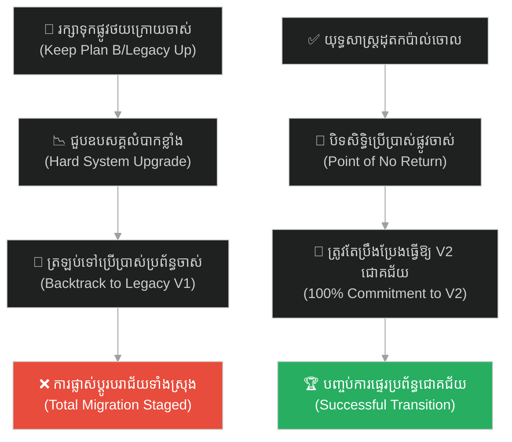
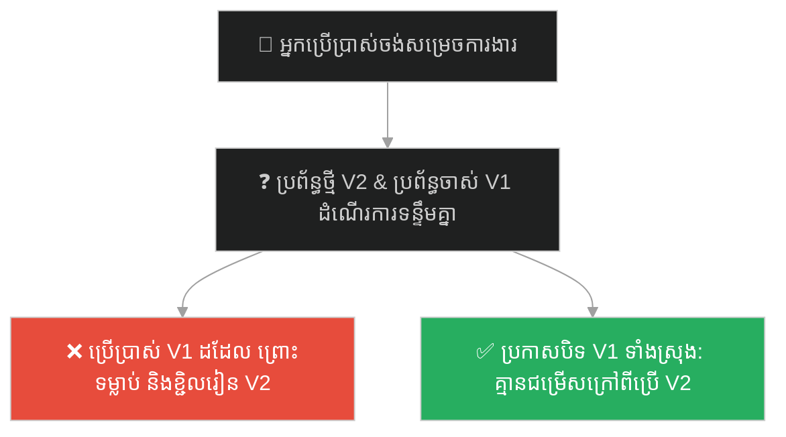
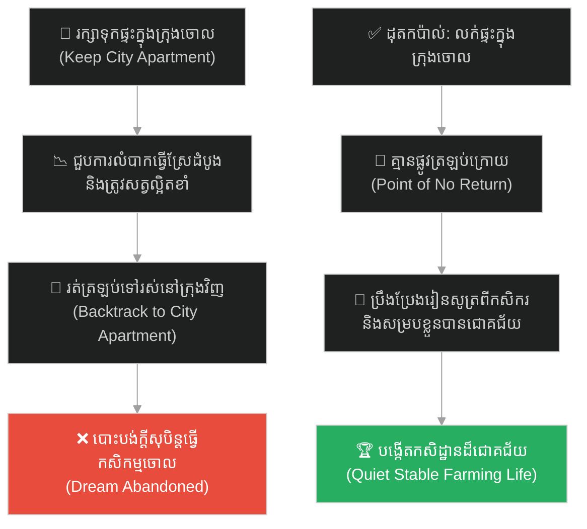
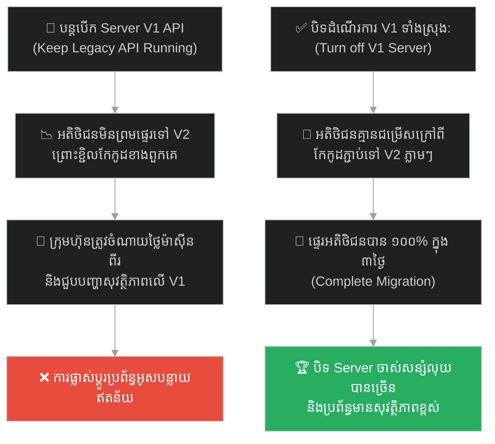
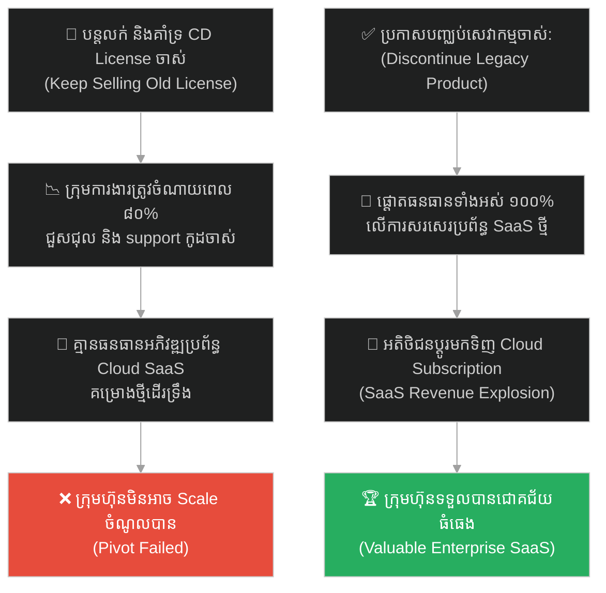
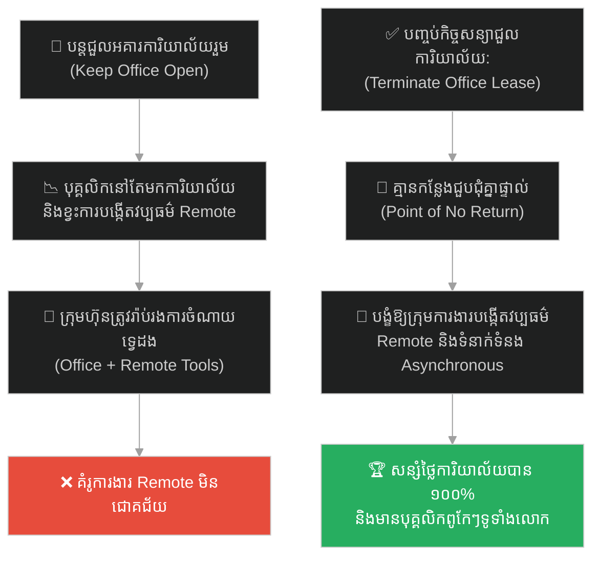
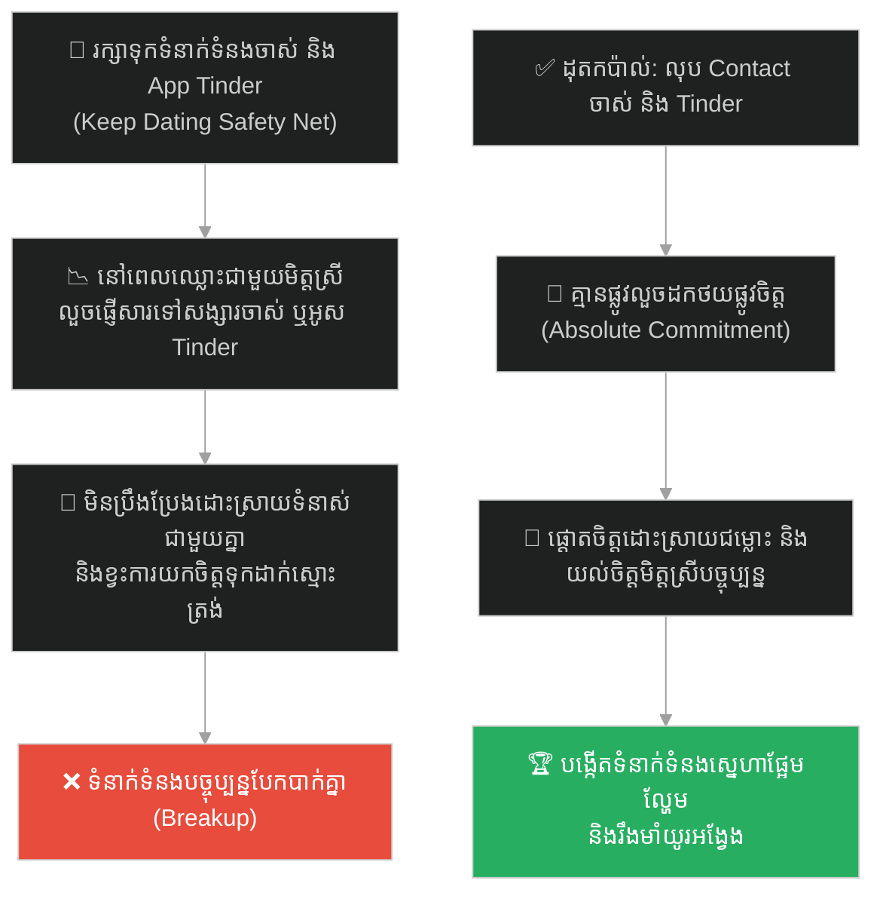
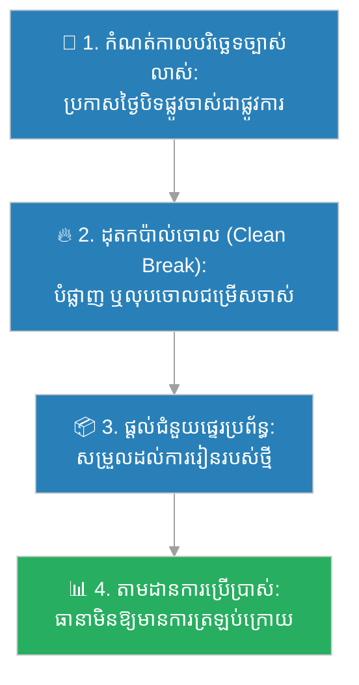

# Full Commitment & Legacy Migration (ការប្តេជ្ញាចិត្តពេញលេញ និងការបិទប្រព័ន្ធចាស់)៖ ហឺណាន់ កនតេស និងយុទ្ធសាស្ត្រដុតកប៉ាល់ចោល (Full Commitment & Burning the Boats)

**Author:** ichamrong  
**Date:** 2026-05-27  
**Tags:** #burning-the-boats #commitment #no-retreat #legacy-migration #change-management #focus #parable  
**Category:** Concepts / Parables  
**Read Time:** ~15 min  

---

## 📌 មាតិកា (Table of Contents)
- [អន្ទាក់ផ្លូវចិត្ត (The Trap)](#0)
- [១. រឿងព្រេងប្រវត្តិសាស្ត្រ៖ មេទ័ព ហឺណាន់ កនតេស និងការដុតកប៉ាល់ចោលនៅលើឆ្នេរម៉ិកស៊ិក (The Legend of Burning the Boats)](#1)
  - [ការកាត់ផ្តាច់ផ្លូវដកថយ និងជ័យជំនះលើអាណាចក្រ Aztec (No Retreat & The Aztec Conquest)](#1-1)
- [２. បញ្ហា៖ គ្រោះថ្នាក់នៃផែនការទីពីរ និងឧបសគ្គនៃការប្តូរប្រព័ន្ធចាស់ (The Issue: The Trap of Plan B & Legacy Resistance)](#2)
- [៣. ឧទាហរណ៍ជាក់ស្តែងក្នុងពិភពពិត (Real World Examples)](#3)
  - [ឧទាហរណ៍ទី ១ — កម្រិតស្រាល (គ្រួសារ)៖ ការលក់ផ្ទះល្វែងក្នុងក្រុងចោលនៅពេលសម្រេចចិត្តទៅរស់នៅជនបទ (The Irreversible Countryside Move)](#3-1)
  - [ឧទាហរណ៍ទី ២ — កម្រិតមធ្យម (បច្ចេកទេស)៖ ការបិទដំណើរការ Server V1 API ទាំងស្រុងដើម្បីបង្ខំឱ្យប្រើ V2 (The Legacy V1 Decommission)](#3-2)
  - [ឧទាហរណ៍ទី ៣ — កម្រិតមធ្យម (ធុរកិច្ច)៖ ការសម្រេចចិត្តបិទចោលផលិតផលចាស់ដើម្បីផ្តោតលើ SaaS ថ្មី (The All-In Pivot to SaaS)](#3-3)
  - [ឧទាហរណ៍ទី ៤ — កម្រិតមធ្យម (សង្គម/គ្រប់គ្រង)៖ ការបញ្ចប់កិច្ចសន្យាជួលការិយាល័យដើម្បីប្តូរទៅជា Remote 100% (The Office Lease Termination)](#3-4)
  - [ឧទាហរណ៍ទី ៥ — កម្រិតធ្ងន់ (ទំនាក់ទំនង)៖ ការលុបទំនាក់ទំនងជាមួយសង្សារចាស់ និង App ស្វែងរកគូស្រឡាញ់ចោល (The Delete contact & dating apps Strategy)](#3-5)
- [៤. ដំណោះស្រាយទូទៅ៖ ការអនុវត្តយុទ្ធសាស្ត្រដុតកប៉ាល់ចោល និងការគ្រប់គ្រងការផ្លាស់ប្តូរ (The General Solution: Point of No Return & Clean Break Migration)](#4)
- [សេចក្តីសន្និដ្ឋាន (Conclusion)](#5)
- [ឯកសារយោង (References)](#6)
- [Related Posts](#7)

---

## អន្ទាក់ផ្លូវចិត្ត (The Trap)

តើអ្នកធ្លាប់ជួបស្ថានភាពដែលអ្នកចង់បង្កើតការផ្លាស់ប្តូរធំមួយនៅក្នុងជីវិត ឬស្ថាប័នរបស់អ្នក ប៉ុន្តែដោយសារអ្នកនៅតែរក្សាទុក "ផែនការទីពីរ (Plan B)" ឬរក្សាផ្លូវដកថយចាស់ដែលស្រណុកសុខស្រួល ធ្វើឱ្យអ្នក និងសមាជិកដទៃទៀតងាយនឹងបោះបង់គម្រោងថ្មី ហើយរត់ត្រឡប់ទៅរកទម្លាប់ចាស់វិញនៅពេលជួបបញ្ហាដំបូងដែរឬទេ?

នៅក្នុងចិត្តវិទ្យាគ្រប់គ្រង និងការផ្លាស់ប្តូរប្រព័ន្ធ៖
* **យើងងាយនឹងធ្លាក់ក្នុងអន្ទាក់** នៃការគិតថា "ការមានផ្លូវថយក្រោយ ឬ Plan B គឺតែងតែមានសុវត្ថិភាពខ្ពស់" (Safety Net Fallacy)។
* **យើងមើលរំលង** ការពិតដែលថា នៅក្នុងគ្រាសំខាន់ៗ វត្តមានរបស់ផ្លូវថយក្រោយ គឺជាកត្តាចំបងដែលសម្លាប់ការប្តេជ្ញាចិត្តពេញលេញ (Absolute Commitment) និងការផ្តោតអារម្មណ៍។

ការរក្សាប្រព័ន្ធចាស់ដែលរារាំងការសម្រេចជោគជ័យនៃប្រព័ន្ធថ្មី ហៅថា **អន្ទាក់ Safety Net (លម្អៀងរបងសុវត្ថិភាព)**本地។

ដើម្បីយល់ដឹងពីរបៀបដែលមេទ័ពកនតេសដុតកប៉ាល់របស់ខ្លួនចោល ដើម្បីវាយឈ្នះអាណាចក្រ Aztec ដ៏មហិមា នេះជាផែនទីបង្ហាញផ្លូវសម្រាប់អត្ថបទនេះ៖
1. **រឿងព្រេងប្រវត្តិសាស្ត្រ (The Historic Legend)** — ប្រវត្តិនៃការចុះចតនៅលើឆ្នេរម៉ិកស៊ិក និងបញ្ជាដុតកប៉ាល់ចោលរបស់ Hernán Cortés។
2. **បញ្ហា (The Issue)** — គ្រោះថ្នាក់នៃ Plan B នៅក្នុងការផ្លាស់ប្តូរប្រព័ន្ធចាស់ (Legacy Systems)។
3. **ឧទាហរណ៍ជាក់ស្តែងក្នុងពិភពពិត (Real World Examples)** — ពិនិត្យមើលឥទ្ធិពលនេះក្នុងកម្រិតគ្រួសារ បច្ចេកវិទ្យា ធុរកិច្ច ការគ្រប់គ្រង និងទំនាក់ទំនង។
4. **ដំណោះស្រាយទូទៅ (The General Solution)** — ការបង្កើតចំណុចដែលមិនអាចត្រឡប់ក្រោយបាន (Point of No Return) និងការអនុវត្ត Clean Break។

---

## ១. រឿងព្រេងប្រវត្តិសាស្ត្រ៖ មេទ័ព ហឺណាន់ កនតេស និងការដុតកប៉ាល់ចោលនៅលើឆ្នេរម៉ិកស៊ិក (The Legend of Burning the Boats)

នៅក្នុងឆ្នាំ ១៥១៩ មេទ័ពជនជាតិអេស្ប៉ាញលោក **ហឺណាន់ កនតេស (Hernán Cortés)** បានដឹកនាំកងទ័ពចំនួន ៦០០ នាក់ តាមសំពៅចំនួន ១១ គ្រឿង ធ្វើដំណើរឆ្ពោះទៅកាន់ឆ្នេរសមុទ្រនៃប្រទេសម៉ិកស៊ិក (ទឹកដីថ្មី)។ គោលដៅរបស់ពួកគេគឺ វាយដណ្តើមយកអាណាចក្រ Aztec (Aztec Empire) ដ៏ធំធេង និងមានអំណាច ដែលមានកងទ័ពរាប់សែននាក់ការពារ ព្រមទាំងមានមាសប្រាក់ និងទ្រព្យសម្បត្តិរាប់មិនអស់។

នៅពេលចុះចតលើឆ្នេរខ្សាច់ កងទ័ពរបស់គាត់មានការភិតភ័យយ៉ាងខ្លាំង។ ពួកគេហត់នឿយខ្លាំង ជួបបរិយាកាសមិនល្អ និងបានដឹងច្បាស់ថា ចំនួនទ័ពរបស់ពួកគេគឺតិចជាងខ្មាំងសត្រូវឆ្ងាយណាស់។ ទាហានមួយចំនួន ចាប់ផ្តើមលួចខ្សឹបខ្សៀវគ្នា និងបង្កើតផែនការជាសម្ងាត់ដើម្បីលួចយកកប៉ាល់មួយចំនួន បើករត់គេចខ្លួនត្រឡប់ទៅកាន់ប្រទេសគុយបា (Cuba) ដែលជាដែនដីមានសុវត្ថិភាពវិញ។

---

### ការកាត់ផ្តាច់ផ្លូវដកថយ និងជ័យជំនះលើអាណាចក្រ Aztec (No Retreat & The Aztec Conquest)

នៅពេល កនតេស ដឹងពីរឿងនេះ គាត់បានយល់ឃើញភ្លាមថា៖ ដរាបណាទាហានរបស់គាត់នៅតែមើលឃើញកប៉ាល់ទាំង ១១ គ្រឿងកំពុងចតនៅមាត់ឆ្នេរ ពួកគេនឹងមិនប្រឹងប្រែងប្រយុទ្ធអស់ពីសមត្ថភាពឡើយ។ នៅពេលជួបការលំបាកដំបូង ពួកគេនឹងមានគំនិតចង់ដកថយរត់ត្រឡប់ទៅគុយបាវិញជាមិនខាន។

ដើម្បីកាត់ផ្តាច់រាល់ផែនការដកថយ គាត់បានប្រមូលទាហានទាំងអស់ឱ្យមកឈរជួបជុំគ្នានៅមាត់សមុទ្រ រួចបានចេញបញ្ជាដ៏រន្ធត់មួយដែលគ្មាននរណាម្នាក់នឹកស្មានដល់៖

> **«ចូរដុតកប៉ាល់ទាំងអស់ចោលឱ្យខ្ទេច!» (Burn the boats!)**

ទាហានទាំងអស់បានសម្លឹងមើលកប៉ាល់ទាំង ១១ គ្រឿងកំពុងត្រូវភ្លើងឆេះសន្ធោសន្ធៅ និងស្រុតចុះទៅក្នុងបាតសមុទ្រ។ នៅខណៈនោះ ពួកគេបានភ្ញាក់ខ្លួនដឹងច្បាស់ថា ពួកគេលែងមានផ្លូវត្រឡប់ទៅផ្ទះវិញទៀតហើយ (No Retreat)។ ជម្រើសតែមួយគត់ដែលពួកគេមាននៅសល់គឺ៖ **"ត្រូវតែវាយឈ្នះសត្រូវដើម្បីរស់ ឬក៏ត្រូវស្លាប់ទាំងអស់គ្នានៅទីនេះ"**។

ការដុតកប៉ាល់ចោល បានផ្លាស់ប្តូរផ្នត់គំនិត (Mindset) របស់ទាហានទាំង ៦០០ នាក់ភ្លាមៗ។ ពួកគេលែងមានគំនិតស្ទាក់ស្ទើរ ឬភិតភ័យទៀតហើយ។ ពួកគេបានប្រយុទ្ធដោយភាពក្លាហាន និងការប្តេជ្ញាចិត្តកម្រិតខ្ពស់បំផុត រហូតអាចវាយកម្ទេចកងទ័ពរាប់សែននាក់ និងវាយដណ្តើមយកអាណាចក្រ Aztec ដ៏មហិមាបានសម្រេច។

---

## ２. បញ្ហា៖ គ្រោះថ្នាក់នៃផែនការទីពីរ និងឧបសគ្គនៃការប្តូរប្រព័ន្ធចាស់ (The Issue: The Trap of Plan B & Legacy Resistance)

យុទ្ធសាស្ត្រ **"ដុតកប៉ាល់ចោល"** បង្ហាញពីគោលការណ៍ដឹកនាំផ្លាស់ប្តូរប្រព័ន្ធ៖ **វត្តមានរបស់ផ្លូវចាស់ដែលស្រណុក គឺជាសត្រូវចំបងនៃការផ្លាស់ប្តូរទៅប្រព័ន្ធថ្មី**។

នៅក្នុងការគ្រប់គ្រង និងបច្ចេកវិទ្យា៖
1. **ឧបសគ្គនៃការប្តូរប្រព័ន្ធចាស់ (Legacy Migration Obstacle)៖** នៅពេលដែលក្រុមហ៊ុនបង្កើតប្រព័ន្ធថ្មី (System V2) ដើម្បីជំនួសប្រព័ន្ធចាស់ (System V1) ពួកគេតែងតែបើកដំណើរការប្រព័ន្ធទាំងពីរទន្ទឹមគ្នា ដើម្បីការពារបញ្ហា (Plan B)។ លទ្ធផលគឺ អតិថិជន និងបុគ្គលិកភាគច្រើននៅតែបន្តប្រើប្រាស់ប្រព័ន្ធចាស់ V1 ដដែល ព្រោះពួកគេទម្លាប់ជាមួយវា ហើយមិនចង់រៀនប្រព័ន្ធថ្មី (Resistance to change)។ ការផ្លាស់ប្តូរមិនអាចសម្រេចបានឡើយ។
2. **អន្ទាក់ផែនការទីពីរ (Plan B Trap)៖** នៅក្នុងគម្រោង Startups ឬគម្រោងការងារសំខាន់ៗ ប្រសិនបើស្ថាបនិក ឬសមាជិកនៅតែរក្សាការងារចាស់ ឬរក្សា safety net ដ៏ធំ ពួកគេនឹងមិនប្រឹងប្រែងអស់ពីសមត្ថភាពដើម្បីធ្វើឱ្យគម្រោងថ្មីជោគជ័យឡើយ។ នៅពេលជួបការលំបាក ពួកគេនឹងបោះបង់គម្រោងចោលភ្លាមៗ។
3. ** The Paradox of Choice (រនាំងនៃជម្រើស)៖** ជម្រើសកាន់តែច្រើន ធ្វើឱ្យមនុស្សស្ទាក់ស្ទើរ និងខ្វះការផ្តោត។ ការសម្រេចចិត្តកាត់ចោលជម្រើសដកថយទាំងអស់ គឺជាវិធីសម្រួចស្មារតីរបស់ក្រុមការងារឱ្យឆ្ពោះទៅមុខតែមួយទិស។

---

## ៣. ឧទាហរណ៍ជាក់ស្តែងក្នុងពិភពពិត (Real World Examples)

---

### ឧទាហរណ៍ទី ១ — កម្រិតស្រាល (គ្រួសារ)៖ ការលក់ផ្ទះល្វែងក្នុងក្រុងចោលនៅពេលសម្រេចចិត្តទៅរស់នៅជនបទ (The Irreversible Countryside Move)

គ្រួសារមួយសម្រេចចិត្តចាកចេញពីភាពអ៊ូអរក្នុងក្រុង ដើម្បីទៅចាប់ផ្តើមជីវិតជាកសិកររស់នៅជនបទប្រកបដោយភាពស្ងប់ស្ងាត់។ ប៉ុន្តែ ដោយសារបារម្ភពីរឿងមិនទម្លាប់ ពួកគេមិនបានលក់ផ្ទះល្វែងចាស់របស់ពួកគេនៅក្នុងទីក្រុងឡើយ ពួកគេគ្រាន់តែជួលវាឱ្យគេរស់នៅបណ្តោះអាសន្ន (ទុក Plan B/កប៉ាល់)។

ក្នុងអំឡុងពេល ៣ ខែដំបូងនៅជនបទ ពួកគេជួបការលំបាកយ៉ាងខ្លាំង៖ ត្រូវសត្វល្អិតខាំ ធ្វើស្រែហត់នឿយ និងគ្មានផ្សារទំនើបក្បែរផ្ទះ។ ដោយសារតែដឹងថាពួកគេនៅមានផ្ទះល្វែងដ៏ស្រណុកនៅទីក្រុង ពួកគេបានសម្រេចចិត្តលុបចោលគម្រោងធ្វើកសិកម្ម រួចប្តូរមករស់នៅទីក្រុងវិញទាំងសោកស្តាយ។ ក្តីសុបិន្តចាកចេញពីភាពធុញថប់ក្នុងក្រុងត្រូវបានបរាជ័យ ព្រោះតែពួកគេមានផ្លូវថយក្រោយដ៏ស្រណុកនេះ។

---

### ឧទាហរណ៍ទី ២ — កម្រិតមធ្យម (បច្ចេកទេស)៖ ការបិទដំណើរការ Server V1 API ទាំងស្រុងដើម្បីបង្ខំឱ្យប្រើ V2 (The Legacy V1 Decommission)

ក្រុមហ៊ុនបច្ចេកវិទ្យាមួយបានបង្កើតប្រព័ន្ធសេវាកម្មទូទាត់លុយថ្មី (Payment V2 API) ដែលមានសុវត្ថិភាព និងល្បឿនលឿនជាងមុន ដើម្បីជំនួស V1 API ចាស់ដែលមាន Bugs ច្រើន។ ក្រុមហ៊ុនបានជូនដំណឹងឱ្យអតិថិជន និង Developer ទាំងអស់ប្តូរទៅប្រើ V2 រយៈពេល ៦ ខែ ប៉ុន្តែពួកគេមិនព្រមប្តូរឡើយ ព្រោះ V1 នៅតែដំណើរការធម្មតា (កប៉ាល់មិនទាន់ឆេះ)។

ដើម្បីបញ្ចប់បញ្ហានេះ នាយកបច្ចេកវិទ្យាបានប្រកាស **"បិទ Server V1 API ទាំងស្រុង (Turn off Server V1)"** នៅថ្ងៃចន្ទសប្តាហ៍ក្រោយ។ នៅពេល Server V1 ត្រូវបានបិទ អតិថិជនទាំងអស់គ្មានជម្រើសអ្វីក្រៅពីប្រញាប់ប្រញាល់កែប្រែកូដរបស់ពួកគេទៅភ្ជាប់នឹង Payment V2 API ភ្លាមៗឡើយ។ ការផ្ទេរប្រព័ន្ធទាំងស្រុងត្រូវបានសម្រេចដោយជោគជ័យក្នុងរយៈពេលត្រឹមតែ ៣ ថ្ងៃប៉ុណ្ណោះ។

---

### ឧទាហរណ៍ទី ៣ — កម្រិតមធ្យម (ធុរកិច្ច)៖ ការសម្រេចចិត្តបិទចោលផលិតផលចាស់ដើម្បីផ្តោតលើ SaaS ថ្មី (The All-In Pivot to SaaS)

ក្រុមហ៊ុនលក់កម្មវិធីកុំព្យូទ័រមួយ ធ្លាប់រកចំណូលបានខ្លះៗពីការលក់ CD Install (License ចាស់)។ ប៉ុន្តែ សហគ្រិនចង់ប្តូរអាជីវកម្មទៅជាគំរូទាញយកសមាជិកភាពអនឡាញ (SaaS Cloud Subscription) វិញ ដើម្បី Scale ចំណូលទ្វេដង។ ដោយសារស្តាយចំណូលចាស់ ពួកគេនៅតែបន្តលក់ និងគាំទ្រ CD License នោះដដែល (រក្សាកប៉ាល់)។

លទ្ធផលគឺ ក្រុមការងារបច្ចេកទេសត្រូវចំណាយពេល ៨០% ដើម្បីដោះស្រាយ Bugs និងគាំទ្រអតិថិជនចាស់ៗទាំងនោះ ធ្វើឱ្យគ្មានពេលអភិវឌ្ឍប្រព័ន្ធ Cloud SaaS ថ្មីឡើយ។ គម្រោងថ្មីនៅទ្រឹង ចំណូលក្រុមហ៊ុនមិនអាចកើនឡើង។

ដំណោះស្រាយគឺការដុតកប៉ាល់៖ ក្រុមហ៊ុនបានប្រកាសបញ្ឈប់ការគាំទ្រ និងលក់ CD License (Legacy End of Life) ជាផ្លូវការ។ ពួកគេបានផ្តោតធនធានទាំងអស់ ១០០% លើ SaaS ថ្មី ដែលជួយឱ្យអាជីវកម្មរីកចម្រើនខ្លាំង និងរកចំណូលបានច្រើនជាងមុនដប់ដង។

---

### ឧទាហរណ៍ទី ៤ — កម្រិតមធ្យម (សង្គម/គ្រប់គ្រង)៖ ការបញ្ចប់កិច្ចសន្យាជួលការិយាល័យដើម្បីប្តូរទៅជា Remote 100% (The Office Lease Termination)

ក្រុមហ៊ុនមួយចង់ប្តូរគំរូការងារទៅជាការធ្វើការពីផ្ទះ ១០០% (Fully Remote) ដើម្បីសន្សំថ្លៃចំណាយការិយាល័យ និងទាក់ទាញវិស្វករពូកែៗទូទាំងពិភពលោក។ ប៉ុន្តែ ដោយសារតែមិនទាន់ដាច់ចិត្ត ពួកគេនៅតែបន្តជួលអគារការិយាល័យ និងបើកទ្វារឱ្យមកធ្វើការ (រក្សាកប៉ាល់)។

លទ្ធផលគឺ បុគ្គលិកភាគច្រើននៅតែបន្តមកការិយាល័យដដែល ព្រោះពួកគេខ្ជិលរៀបចំកន្លែងធ្វើការនៅផ្ទះ។ ក្រុមហ៊ុនមិនអាចសរសេរប្រព័ន្ធទំនាក់ទំនងអនឡាញ (Asynchronous Communication) ឱ្យមានប្រសិទ្ធភាពឡើយ ហើយនៅតែត្រូវចំណាយថ្លៃអគារដ៏ច្រើនប្រចាំខែ។

ដំណោះស្រាយគឺការដុតកប៉ាល់៖ ក្រុមហ៊ុនបានសម្រេចចិត្តលុបចោលកិច្ចសន្យាជួលអគារការិយាល័យ និងលក់គ្រឿងសង្ហារិមការិយាល័យចោលទាំងអស់។ ដោយសារគ្មានការិយាល័យទៀតហើយ បុគ្គលិក និងអ្នកគ្រប់គ្រងទាំងអស់ត្រូវបានបង្ខំចិត្តបង្កើតវប្បធម៌ធ្វើការងារតាមអនឡាញ និងប្រើប្រាស់ឧបករណ៍ទំនាក់ទំនងកម្រិតខ្ពស់រហូតសម្រេចបានជោគជ័យ។

---

### ឧទាហរណ៍ទី ៥ — កម្រិតធ្ងន់ (ទំនាក់ទំនង)៖ ការលុបទំនាក់ទំនងជាមួយសង្សារចាស់ និង App ស្វែងរកគូស្រឡាញ់ចោល (The Delete contact & dating apps Strategy)

បុរសម្នាក់បានសម្រេចចិត្តស្រឡាញ់ និងកសាងទំនាក់ទំនងឱ្យបានម៉ឺងម៉ាត់ជាមួយមិត្តស្រីបច្ចុប្បន្ន។ ប៉ុន្តែ គាត់នៅតែរក្សាទុកលេខទូរស័ព្ទ និងសាររបស់សង្សារចាស់ ព្រមទាំងរក្សាទុកគណនីនៅលើកម្មវិធី Tinder (ទុក Plan B/កប៉ាល់) នៅក្នុងទូរស័ព្ទដៃដដែល។

រាល់ពេលដែលជួបទំនាស់ ឬឈ្លោះប្រកែកគ្នាជាមួយមិត្តស្រីបច្ចុប្បន្ន គាត់មិនបានខិតខំដោះស្រាយបញ្ហា ឬសម្របសម្រួលគ្នានោះទេ។ ផ្ទុយទៅវិញ គាត់បានលួចផ្ញើសារទៅសង្សារចាស់ដើម្បីលួងចិត្តខ្លួនឯង ឬបើក Tinder អូសលេងកម្សាន្ត។ មិត្តស្រីបច្ចុប្បន្នបានរកឃើញរឿងនេះ ធ្វើឱ្យនាងបាត់បង់ទំនុកចិត្ត និងសម្រេចចិត្តសុំបែកគ្នាភ្លាមៗ។

ដំណោះស្រាយគឺការដុតកប៉ាល់៖ គាត់ត្រូវលុបលេខទំនាក់ទំនងសង្សារចាស់ លុបចោលគណនី Tinder ទាំងស្រុង ដើម្បីបង្ខំចិត្តខ្លួនឯងឱ្យផ្តោតការយកចិត្តទុកដាក់ ១០០% លើការកសាង និងដោះស្រាយបញ្ហាជាមួយមិត្តស្រីបច្ចុប្បន្ន។

---

## ៤. ដំណោះស្រាយទូទៅ៖ ការអនុវត្តយុទ្ធសាស្ត្រដុតកប៉ាល់ចោល និងការគ្រប់គ្រងការផ្លាស់ប្តូរ (The General Solution: Point of No Return & Clean Break Migration)

ដើម្បីដឹកនាំការផ្លាស់ប្តូរប្រព័ន្ធ ឬការសម្រេចចិត្តឱ្យទទួលបានជោគជ័យ យើងត្រូវអនុវត្តយុទ្ធសាស្ត្រ **"កាត់ផ្តាច់ផ្លូវដកថយ (Point of No Return)"**៖

ជំហាននៃការអនុវត្ត៖
1. **ប្រកាសកាលបរិច្ឆេទបញ្ឈប់សេវាកម្ម (Set a Hard Sunset Date)៖** កំណត់កាលបរិច្ឆេទជាក់លាក់ និងមិនអាចកែប្រែបានសម្រាប់ប្រព័ន្ធចាស់ ឬទម្លាប់ចាស់ (ឧទាហរណ៍៖ "យើងនឹងបិទម៉ាស៊ីន V1 ទាំងស្រុងនៅថ្ងៃទី ៣០ ខែមិថុនា")។ នេះបង្កើតឱ្យមានភាពបន្ទាន់ និងគម្រោងត្រៀមខ្លួន។
2. **អនុវត្តការកាត់ផ្តាច់ដាច់ខាត (Clean Break / Decommission)៖** នៅពេលដល់ថ្ងៃកំណត់ ត្រូវតែបិទសិទ្ធិប្រើប្រាស់ លុបចោល ឬបំផ្លាញកប៉ាល់ចាស់ចោលភ្លាមៗ។ ជៀសវាងការយោគយល់ ឬពន្យារពេលដែលធ្វើឱ្យមនុស្សនៅតែបន្តស្ទាក់ស្ទើរ។
3. **កាត់បន្ថយការលំបាកនៃការប្តូរ (Reduce Friction for the New System)៖** ផ្តល់ឯកសារណែនាំ ឧបករណ៍ជំនួយ និងការបណ្តុះបណ្តាលដើម្បីឱ្យបុគ្គលិក ឬអតិថិជនអាចប្តូរទៅកាន់ប្រព័ន្ធថ្មី V2 បានយ៉ាងងាយស្រួលបំផុត (Golden Path)។
4. **កសាងការប្តេជ្ញាចិត្ត All-in (Foster All-in Commitment)៖** ជជែកជាមួយក្រុមការងារថា "យើងគ្មានជម្រើសដកថយឡើយ ជម្រើសតែមួយគត់គឺត្រូវធ្វើឱ្យប្រព័ន្ធថ្មីនេះដើរបានជោគជ័យឱ្យខាងតែបាន"។ នេះជួយបង្រួបបង្រួមកម្លាំងចិត្តរបស់ក្រុមទាំងមូល។

---

## 🐇 ធ្លាក់ចូលក្នុងរន្ធទន្សាយ (Enter the Strategic Rabbit Hole)

ដើម្បីស្វែងយល់កាន់តែស៊ីជម្រៅអំពីរបៀបដែលកំហុស "ការវិនិច្ឆ័យសមត្ថភាពខ្លួនឯងខុស" (Dunning-Kruger Effect) អាចធ្វើឱ្យយើងគិតថាខ្លួនឯងពូកែ និងយល់ដឹងច្បាស់គ្រប់យ៉ាង ទាល់តែជួបការបរាជ័យទើបភ្ញាក់ខ្លួន និងរៀនសូត្រពីរបៀបកសាងសមត្ថភាពពិតប្រាកដ សូមបន្តដំណើររុករករបស់អ្នកទៅកាន់៖

* 🚀 **[ចាប់ផ្តើមដំណើររុករក (Start the Journey) ➔ McArthur Wheeler and the Lemon Juice](./70-mcarthur-wheeler-and-the-lemon-juice.md)**

---

## សេចក្តីសន្និដ្ឋាន (Conclusion)

> **«ផែនការ B ជារឿយៗគឺជាសត្រូវស្ងប់ស្ងាត់ដែលសម្លាប់ការប្តេជ្ញាចិត្តរបស់ផែនការ A។ ចូរហ៊ានដុតកប៉ាល់ចោល ដើម្បីសម្លឹងទៅរកតែភាពជោគជ័យនៅខាងមុខ។»**

ការសាងសង់អនាគត ឬការផ្លាស់ប្តូរប្រព័ន្ធការងារ មិនអាចសម្រេចបានឡើយ ដរាបណាយើងនៅតែផ្តល់ឱកាសឱ្យខ្លួនឯងដកថយទៅរកភាពស្រណុកចាស់វិញ។ ចូរធ្វើខ្លួនជាមេដឹកនាំដូចលោក ហឺណាន់ កនតេស ដែលហ៊ានដុតកប៉ាល់ចោលនៅមាត់ឆ្នេរ ដើម្បីបង្ខំចិត្តខ្លួនឯង និងក្រុមការងារឱ្យឆ្ពោះទៅមុខតែមួយទិសដៅ រហូតសម្រេចបានជ័យជំនះដ៏អស្ចារ្យបំផុត។

---

## ឯកសារយោង (References)

* **William H. Prescott** — *History of the Conquest of Mexico* (1843). ឯកសារប្រវត្តិសាស្ត្រច្បាស់លាស់ពីការដុតកប៉ាល់ចោល និងការវាយលុកអាណាចក្រ Aztec របស់ Cortés។
* **W. Chan Kim & Renée Mauborgne** — *Blue Ocean Shift: Beyond Competing - Proven Steps to Inspire Confidence and Seize New Growth* (2017). មេរៀនគ្រប់គ្រងការផ្លាស់ប្តូរ និងការកាត់ផ្តាច់ទីផ្សារចាស់។
* **Barry O'Reilly** — *Unlearn: Let Go of Past Success to Achieve Extraordinary Results* (2018). យុទ្ធសាស្ត្រលុបចោលទម្លាប់ និងចំណេះដឹងចាស់ៗដែលរារាំងការរីកចម្រើនថ្មី។

---

## Related Posts

* **[66 Han Xin and the River of No Return: Death Ground Strategy](./66-han-xin-and-the-river-of-no-return.md)** — របៀបប្រើប្រាស់សមរភូមិគ្មានផ្លូវថយដើម្បីបង្កើតភាពបន្ទាន់ការងារ។
* **[60 The Wright Brothers and The First Flight: MVP](./60-the-first-flight.md)** — របៀបដែលការសាកល្បងខ្នាតតូចជួយឱ្យការប្តេជ្ញាចិត្តរបស់ត្រកូលរ៉ាយដើរត្រូវទិស។
* **[52-the-best-part-is-no-part.md](./52-the-best-part-is-no-part.md)** — របៀបលុបបំបាត់ចោលកូដ ឬប្រព័ន្ធដែលលែងប្រើប្រាស់ ដើម្បីរក្សាភាពសាមញ្ញ។

---

## Related

- [💡 Concepts README](../README.md)
- [📚 Main Repository README](../../../README.md)
- [Developer Habits](../../developer-habits/README.md)
- [Mental Health & Well-being](../../mental-health/README.md)
- [Management & SDLC](../../management/README.md)
