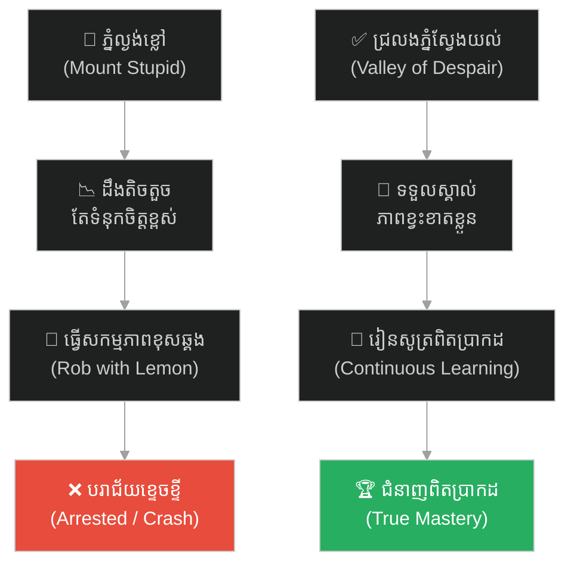
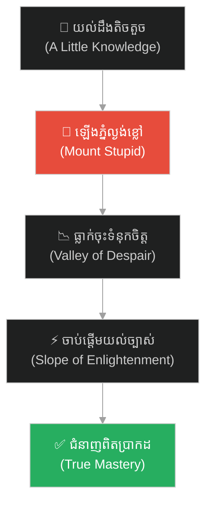
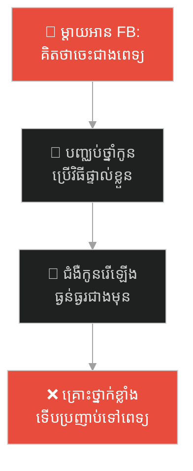
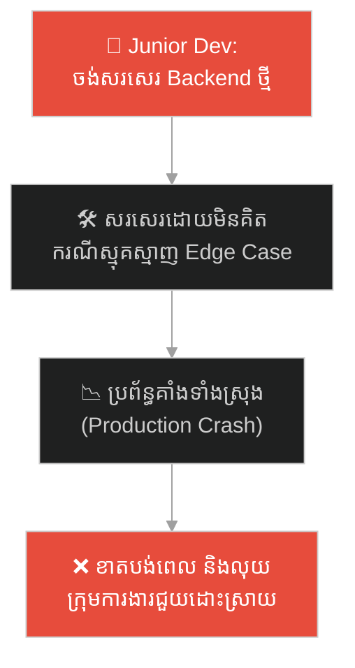
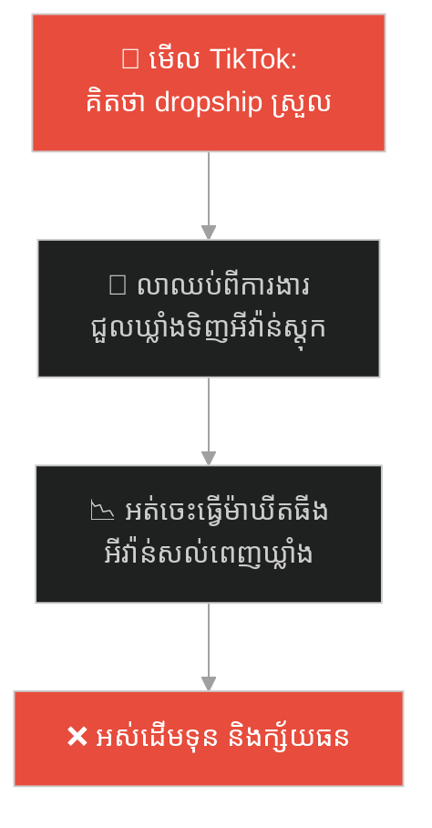
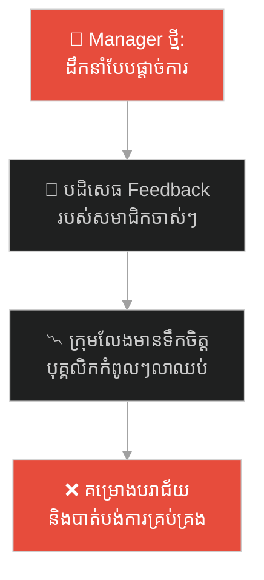
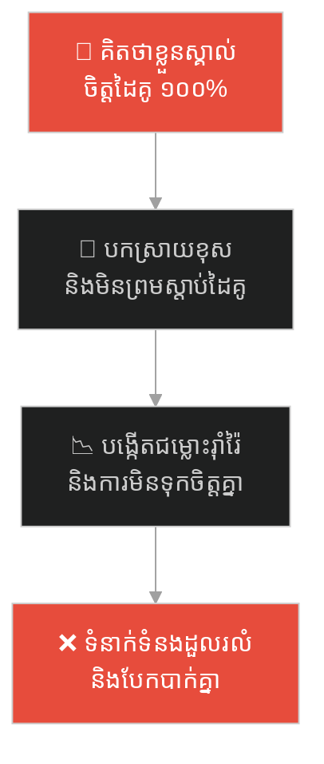
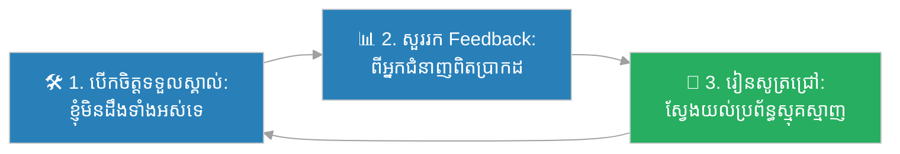

# Dunning-Kruger Effect (អគតិស្មានសមត្ថភាពខ្លួនឯង)៖ McArthur Wheeler និងការប្លន់លាបទឹកក្រូចឆ្មារ (Dunning-Kruger Effect & McArthur Wheeler)

**Author:** ichamrong  
**Date:** 2026-05-27  
**Tags:** #dunning-kruger-effect #psychology #ignorance #confidence #cognitive-bias #parable  
**Category:** Concepts / Parables  
**Read Time:** ~15 min  

---

## 📌 មាតិកា (Table of Contents)
- [អន្ទាក់ផ្លូវចិត្ត (The Trap)](#0)
- [១. រឿងព្រេងប្រវត្តិសាស្ត្រ៖ McArthur Wheeler និងការប្លន់ដោយគ្មានរបាំងមុខ (The Legend of McArthur Wheeler)](#1)
  - ["ប៉ុន្តែ... ខ្ញុំបានលាបទឹកក្រូចឆ្មារហើយតើ!" (But I Wore the Juice!)](#1-1)
- [២. បញ្ហា៖ ភ្នំកំហុសឆ្គង Dunning-Kruger Effect (The Issue: Mount Stupid)](#2)
- [៣. ឧទាហរណ៍ជាក់ស្តែងក្នុងពិភពពិត (Real World Examples)](#3)
  - [ឧទាហរណ៍ទី ១ — កម្រិតស្រាល (គ្រួសារ)៖ ការព្យាបាលជំងឺតាមអ៊ិនធឺណិត (The Facebook Doctor Parent)](#3-1)
  - [ឧទាហរណ៍ទី ២ — កម្រិតមធ្យម (បច្ចេកទេស)៖ អ្នកសរសេរកូដថ្មីថ្មោងចង់សាងសង់ប្រព័ន្ធធំ (The Junior Coding Savior)](#3-2)
  - [ឧទាហរណ៍ទី ៣ — កម្រិតមធ្យម (ធុរកិច្ច)៖ ការរកស៊ីតាមគ្នាដោយគ្មានការវិភាគទីផ្សារ (The TikTok Dropshipping Dreamer)](#3-3)
  - [ឧទាហរណ៍ទី ៤ — កម្រិតមធ្យម (សង្គម/គ្រប់គ្រង)៖ ប្រធានគ្រប់គ្រងថ្មី និងសៀវភៅទ្រឹស្តីតែមួយ (The One-Book Manager Trap)](#3-4)
  - [ឧទាហរណ៍ទី ៥ — កម្រិតធ្ងន់ (ទំនាក់ទំនង)៖ ការស្មានចិត្តដៃគូ និងទំនុកចិត្តខុស (The Mind-Reader Partner Fallacy)](#3-5)
- [៤. ដំណោះស្រាយទូទៅ៖ ការស្វែងរកការពិត និងយន្តការមតិកែលម្អ (The General Solution: Seeking Objectivity and Feedback Loops)](#4)
- [សេចក្តីសន្និដ្ឋាន (Conclusion)](#5)
- [ឯកសារយោង (References)](#6)
- [Related Posts](#7)

---

## អន្ទាក់ផ្លូវចិត្ត (The Trap)

តើអ្នកធ្លាប់ជួបនរណាម្នាក់ដែលមិនសូវដឹងអ្វីសោះ ប៉ុន្តែនិយាយជាមួយទំនុកចិត្តខ្ពស់កប់ពពក និងប្រកែកមិនយកច្បាប់ទម្លាប់ ឬការពិតដែរឬទេ?

នៅក្នុងការរៀនសូត្រ និងការអភិវឌ្ឍន៍ខ្លួន៖
* **យើងងាយនឹងធ្លាក់ក្នុងអន្ទាក់** នៃការគិតថា "យើងចេះដឹងសព្វគ្រប់" នៅពេលយើងទើបតែរៀនសូត្របានបន្តិចបន្តួចអំពីជំនាញ ឬទ្រឹស្តីណាមួយ។
* **យើងមើលរំលង** ជម្រៅនិងភាពស្មុគស្មាញពិតប្រាកដនៃប្រព័ន្ធ ដោយសារចំណេះដឹងតិចតួចពេកធ្វើឱ្យយើងបាត់បង់សមត្ថភាពវាយតម្លៃភាពខ្វះខាតរបស់ខ្លួនឯង។

ការបណ្តោយឱ្យទំនុកចិត្តនាំមុខសមត្ថភាពពិតប្រាកដ រហូតបង្កជាកំហុសឆ្គងដ៏មហន្តរាយ ហៅថា **អន្ទាក់ភ្នំល្ងង់ខ្លៅ (Peak of Mount Stupid)**។

ដើម្បីយល់ដឹងពីរបៀបដែលទំនុកចិត្តខុសឆ្គងបំផ្លាញមនុស្ស នេះជាផែនទីបង្ហាញផ្លូវ៖
1. **រឿងព្រេងប្រវត្តិសាស្ត្រ (The Historic Legend)** — រឿងរ៉ាវរបស់ McArthur Wheeler និងការលាបទឹកក្រូចឆ្មារប្លន់ធនាគារ។
2. **បញ្ហា (The Issue)** — ការវិភាគទ្រឹស្តី Dunning-Kruger Effect និងការកើនឡើងទំនុកចិត្តមិនស្មើគ្នានឹងចំណេះដឹង។
3. **ឧទាហរណ៍ជាក់ស្តែងក្នុងពិភពពិត (Real World Examples)** — ពិនិត្យមើលអន្ទាក់នេះក្នុងកម្រិតគ្រួសារ បច្ចេកវិទ្យា ធុរកិច្ច ការគ្រប់គ្រង និងទំនាក់ទំនង។
4. **ដំណោះស្រាយទូទៅ (The General Solution)** — ការកសាងយន្តការកែលម្អខ្លួន ការបើកចិត្តទទួលមតិរិះគន់ និងការរៀនសូត្រឥតឈប់ឈរ។

---

## ១. រឿងព្រេងប្រវត្តិសាស្ត្រ៖ McArthur Wheeler និងការប្លន់ដោយគ្មានរបាំងមុខ (The Legend of McArthur Wheeler)

នៅថ្ងៃទី ១៩ ខែមេសា ឆ្នាំ ១៩៩៥ បុរសចំណាស់ម្នាក់ឈ្មោះ **McArthur Wheeler (ម៉ាកអាធ័រ វីល័រ)** បានដើរចូលទៅប្លន់ធនាគារចំនួនពីរជាប់គ្នានៅទីក្រុង Pittsburgh សហរដ្ឋអាមេរិក ទាំងកណ្តាលថ្ងៃត្រង់។ 

អ្វីដែលគួរឱ្យហួសចិត្តបំផុតនោះគឺ គាត់ដើរចូលទៅប្លន់ដោយបើកមុខឱ្យគេឃើញច្បាស់ៗ មិនមានពាក់ម៉ាស់ ឬរបាំងមុខដើម្បីលាក់អត្តសញ្ញាណសូម្បីតែបន្តិច។ គាត់ថែមទាំងបានញញឹមដាក់កាមេរ៉ាសុវត្ថិភាព (Security Cameras) របស់ធនាគារទៀតផង មុនពេលដើរចេញទៅយ៉ាងរំភើយជាមួយប្រាក់យ៉ាងច្រើន។

ដោយសារតែមុខរបស់គាត់ត្រូវបានកាមេរ៉ាថតជាប់យ៉ាងច្បាស់ពេញទំហឹង ប៉ូលីសបានយកវីដេអូនោះទៅចាក់ផ្សាយនៅលើទូរទស្សន៍ព័ត៌មាន។ ត្រឹមតែប៉ុន្មានម៉ោងក្រោយមក ប៉ូលីសក៏បានទៅគោះទ្វារចាប់ខ្លួនគាត់ដល់ផ្ទះតែម្តង។

---

### "ប៉ុន្តែ... ខ្ញុំបានលាបទឹកក្រូចឆ្មារហើយតើ!" (But I Wore the Juice!)

នៅពេលដែលប៉ូលីសចាប់វាយខ្នោះ ម៉ាកអាធ័រ មានការភ្ញាក់ផ្អើលយ៉ាងខ្លាំង។ គាត់បានស្រែកសួរទៅកាន់ប៉ូលីសដោយភាពឆ្ងល់ និងមិនអស់ចិត្តថា៖ 
> **"ពួកលោកចាប់ខ្ញុំបានដោយរបៀបណា? ខ្ញុំបានលាបទឹកក្រូចឆ្មារនៅលើមុខរបស់ខ្ញុំហើយតើ!" (But I wore the juice!)**

ប៉ូលីសមានការភាន់ច្រឡំយ៉ាងខ្លាំង រហូតទាល់តែសួរនាំ ទើបដឹងពីការពិតដ៏គួរឱ្យអស់សំណើច៖ ម៉ាកអាធ័រ ធ្លាប់បានឮអំពីវិធីធ្វើ "ទឹកខ្មៅបំបាំងកាយ (Invisible Ink)" ដោយប្រើប្រាស់ទឹកក្រូចឆ្មារសរសេរលើក្រដាស ហើយវានឹងមិនលេចចេញអក្សរមកវិញឡើយ លុះត្រាតែយកក្រដាសនោះទៅកម្ដៅនឹងភ្លើង។ 

ដោយផ្អែកលើចំណេះដឹងដ៏តិចតួចនេះ គាត់បានសន្និដ្ឋានយ៉ាងមុតមាំថា៖ ប្រសិនបើគាត់យកទឹកក្រូចឆ្មារមកលាបឱ្យសព្វពេញផ្ទៃមុខរបស់គាត់ នោះកាមេរ៉ាសុវត្ថិភាពរបស់ធនាគារ នឹងមិនអាចថតរូបគាត់ជាប់ឡើយ (ព្រោះមុខគាត់គ្មានភ្លើងកម្តៅ)។

មុនពេលចេញទៅប្លន់ គាត់ថែមទាំងបានតេស្តដោយការលាបទឹកក្រូចឆ្មារលើមុខ រួចថតរូបខ្លួនឯងដោយកាមេរ៉ា Polaroid។ ដោយសារតែកាមេរ៉ានោះចាស់ ឬខូច ហ្វីលរូបភាពដែលចេញមកគឺទទេស្អាត។ នេះកាន់តែធ្វើឱ្យគាត់មាន **ទំនុកចិត្តកប់ពពក ១០០%** ថាផែនការរបស់គាត់គឺល្អឥតខ្ចោះ និងគ្មានអ្នកណាអាចចាប់កំហុសបានឡើយ។ ភាពល្ងង់ខ្លៅរបស់គាត់ គឺជ្រៅរហូតដល់ថ្នាក់គាត់មិនមានសមត្ថភាពដឹងថា ខ្លួនឯងកំពុងតែធ្វើរឿងខុសឆ្គងនោះទេ។

---

## ២. បញ្ហា៖ ភ្នំកំហុសឆ្គង Dunning-Kruger Effect (The Issue: Mount Stupid)

រឿងរ៉ាវរបស់ McArthur Wheeler បានជម្រុញឱ្យអ្នកចិត្តវិទ្យាពីររូបគឺលោក David Dunning និង Justin Kruger ធ្វើការសិក្សាស្រាវជ្រាវ និងបង្កើតទ្រឹស្តីវិទ្យាសាស្ត្រមួយហៅថា **Dunning-Kruger Effect**។ 

បាតុភូតនេះកើតឡើងដោយសារតែកង្វះសមត្ថភាពយល់ដឹងពីខ្លួនឯង (Metacognitive Deficit)៖
* **ទំនុកចិត្តកើនឡើងលឿនបំផុត៖** នៅដំណាក់កាលចាប់ផ្តើមរៀនសូត្រពីជំនាញមួយថ្មី (ចំណុច A) ទំនុកចិត្តរបស់យើងស្ទុះឡើងដល់កម្រិតកំពូលយ៉ាងរហ័ស ព្រោះយើងទើបតែស្គាល់ចំណេះដឹងមួយផ្នែកតូច និងគិតថាវាសាមញ្ញណាស់។
* **ភាពងងឹតនៃចំណេះដឹង៖** យើងមិនមានចំណេះដឹងគ្រប់គ្រាន់ ដើម្បីមើលឃើញថាមានរឿងរ៉ាវជាច្រើនទៀតដែលយើងមិនទាន់ដឹងឡើយ។ យើងស្ថិតនៅលើ **ភ្នំល្ងង់ខ្លៅ (Mount Stupid)**។
* **ការធ្លាក់ចុះទំនុកចិត្ត៖** លុះត្រាតើយើងបន្តរៀនសូត្របន្ថែម ទើបយើងចាប់ផ្តើមដឹងថាយើងល្ងង់កម្រិតណា ហើយទំនុកចិត្តក៏ចាប់ផ្តើមធ្លាក់ចុះយ៉ាងខ្លាំង ចូលទៅក្នុង **ជ្រលងភ្នំស្ងួតស្ងប់ (Valley of Despair)**។

---

## ៣. ឧទាហរណ៍ជាក់ស្តែងក្នុងពិភពពិត

---

### ឧទាហរណ៍ទី ១ — កម្រិតស្រាល (គ្រួសារ)៖ ការព្យាបាលជំងឺតាមអ៊ិនធឺណិត (The Facebook Doctor Parent)

ម្តាយម្នាក់បានអានអត្ថបទខ្លីមួយនៅលើ Facebook អំពីអត្ថប្រយោជន៍នៃរបបអាហារធម្មជាតិ និងការប្រើប្រាស់ថ្នាំបុរាណដើម្បីព្យាបាលអាឡែស៊ីរបស់កូន។ ដោយជឿជាក់ថាខ្លួនចេះដឹងច្រើនជាងគ្រូពេទ្យ និងយល់ច្បាស់ពី "ការពិត" គាត់បានបញ្ឈប់កូនមិនឱ្យប្រើប្រាស់ថ្នាំពេទ្យ ហើយបង្ខំឱ្យកូនញ៉ាំតែអាហារធម្មជាតិ។

រឿងនេះបង្ហាញថា ចំណេះដឹងស្រាលស្តើងពីបណ្តាញសង្គម បង្កើតទំនុកចិត្តខុសឆ្គងដ៏គ្រោះថ្នាក់ ដែលធ្វើឱ្យប៉ះពាល់ដល់សុខភាពសមាជិកគ្រួសារ ព្រោះម្តាយគ្មានសមត្ថភាពយល់ដឹងពីភាពស្មុគស្មាញនៃប្រព័ន្ធសរីរាង្គមនុស្សឡើយ។

---

### ឧទាហរណ៍ទី ២ — កម្រិតមធ្យម (បច្ចេកទេស)៖ អ្នកសរសេរកូដថ្មីថ្មោងចង់សាងសង់ប្រព័ន្ធធំ (The Junior Coding Savior)

វិស្វករសូហ្វវែរទើបបញ្ចប់ការសិក្សាម្នាក់ បានរៀនកូដ Node.js រយៈពេលពីរបីខែ និងយល់ពីរបៀបសរសេរ API សាមញ្ញ។ នៅពេលក្រុមហ៊ុនជួបបញ្ហាដំណើរការយឺតនៃប្រព័ន្ធទិន្នន័យ គាត់បានស្នើសុំសរសេរស្ថាបត្យកម្មប្រព័ន្ធឡើងវិញទាំងស្រុង (Rewrite the whole backend) ដោយទំនុកចិត្តថា គាត់អាចធ្វើវាបានយ៉ាងល្អឥតខ្ចោះ និងលឿនជាងមុន។

Junior Dev ស្ថិតនៅលើភ្នំល្ងង់ខ្លៅ ព្រោះគាត់គិតថា Backend គ្រាន់តែជាការសរសេរ CRUD APIs ដោយមិនដឹងពីភាពស្មុគស្មាញនៃ Database Transactions, Concurrent Requests, Cache Consistency, និង Infrastructure Scaling ឡើយ។

---

### ឧទាហរណ៍ទី ៣ — កម្រិតមធ្យម (ធុរកិច្ច)៖ ការរកស៊ីតាមគ្នាដោយគ្មានការវិភាគទីផ្សារ (The TikTok Dropshipping Dreamer)

បុគ្គលិកការិយាល័យម្នាក់បានមើលវីដេអូនៅលើ TikTok អំពីភាពជោគជ័យនៃការធ្វើ Dropshipping និងការលក់ផលិតផលអនឡាញ។ ដោយគិតថាវាស្រួល និងគ្មានអ្វីស្មុគស្មាញ គាត់បានសម្រេចចិត្តលាឈប់ពីការងារយកប្រាក់សន្សំទាំងអស់ទៅជួលឃ្លាំង ទិញផលិតផលមកស្តុក និងដំណើរការលក់ភ្លាមៗ។

សហគ្រិនរូបនេះមិនបានដឹងពីសារៈសំខាន់នៃ Supply Chain, Customer Acquisition Cost (CAC), SEO Optimization, និង Customer Support ឡើយ ដោយមើលឃើញតែភាពជោគជ័យលើផ្ទៃក្រៅ។

---

### ឧទាហរណ៍ទី ៤ — កម្រិតមធ្យម (សង្គម/គ្រប់គ្រង)៖ ប្រធានគ្រប់គ្រងថ្មី និងសៀវភៅទ្រឹស្តីតែមួយ (The One-Book Manager Trap)

ប្រធានក្រុមដែលទើបតែទទួលបានការតែងតាំងថ្មី បានអានសៀវភៅ "Extreme Ownership" និងចាប់ផ្តើមអនុវត្តវិធីសាស្ត្រគ្រប់គ្រងយ៉ាងតឹងរ៉ឹងលើសមាជិកក្រុមទាំងអស់ ដោយជឿជាក់ថាគាត់យល់ច្បាស់ពីយុទ្ធសាស្ត្រដឹកនាំ។ គាត់មិនព្រមស្តាប់ការព្រមានពីសមាជិកចាស់ៗក្នុងក្រុម និងមិនទទួលយកមតិកែលម្អរបស់បុគ្គលិកឡើយ។

---

### ឧទាហរណ៍ទី ៥ — កម្រិតធ្ងន់ (ទំនាក់ទំនង)៖ ការស្មានចិត្តដៃគូ និងទំនុកចិត្តខុស (The Mind-Reader Partner Fallacy)

នៅក្នុងទំនាក់ទំនងគូស្នេហ៍ ម្នាក់មានទំនុកចិត្តយ៉ាងខ្លាំងថាខ្លួន "ស្គាល់និងយល់ចិត្តដៃគូច្បាស់ជាងសាមីខ្លួនទៅទៀត" ដោយផ្អែកលើការអានអត្ថបទចិត្តសាស្ត្រស្នេហាបន្តិចបន្តួច។ គាត់តែងតែបកស្រាយរាល់កាយវិការ និងពាក្យសម្តីរបស់ដៃគូតាមរបៀបរបស់គាត់ ដោយមិនព្រមសួរនាំ និងស្តាប់ការពន្យល់ពិតប្រាកដ។

---

## ៤. ដំណោះស្រាយទូទៅ៖ ការស្វែងរកការពិត និងយន្តការមតិកែលម្អ (The General Solution: Seeking Objectivity and Feedback Loops)

ដើម្បីចុះពីភ្នំល្ងង់ខ្លៅ (Mount Stupid) និងចៀសវាងការខូចខាតពី Dunning-Kruger Effect យើងត្រូវអនុវត្តយន្តការត្រួតពិនិត្យ និងការស្វែងរកការពិតដោយបើកចិត្ត៖

ជំហាននៃការអនុវត្ត៖
1. **អនុវត្តការបន្ទាបខ្លួនខាងចំណេះដឹង (Intellectual Humility)៖** ទទួលស្គាល់ថា រាល់ពេលដែលយើងស្គាល់ចំណេះដឹងថ្មីមួយ វាតែងតែមានផ្នែកស្មុគស្មាញជាច្រើនទៀតនៅពីក្រោយវា។ សួរខ្លួនឯងថា "តើខ្ញុំអាចនឹងខុសត្រង់ណាខ្លះ?"
2. **បង្កើតយន្តការមតិកែលម្អពិតប្រាកដ (Establish Real Feedback Loops)៖** កុំធ្វើការសម្រេចចិត្តក្នុងភាពងងឹត។ ស្វែងរកការវាយតម្លៃអព្យាក្រឹត្យ ដូចជាការធ្វើ Peer Review, Automated Testing, និងការពិគ្រោះយោបល់ជាមួយអ្នកជំនាញដែលមានបទពិសោធន៍។
3. **រៀនសូត្រជានិច្ច និងបន្តដំណើរ (Continuous Learning)៖** បរាជ័យក្នុងកម្រិតតូចឱ្យបានលឿន ដើម្បីចុះពីភ្នំល្ងង់ខ្លៅ ចូលទៅកាន់ជ្រលងភ្នំនៃការរៀនសូត្រពិតប្រាកដ។

---

## 🐇 ធ្លាក់ចូលក្នុងរន្ធទន្សាយ (Enter the Rabbit Hole)

ដើម្បីស្វែងយល់ពីរបៀបដែលអគតិផ្លូវចិត្តធ្វើឱ្យយើងត្រងយកតែភ័ស្តុតាងណាដែលគាំទ្រជំនឿខុសឆ្គងរបស់យើង និងរបៀបដែលក្រុមហ៊ុនលំដាប់ពិភពលោកធ្លាក់ក្នុងអន្ទាក់នេះ សូមបន្តដំណើរទៅកាន់៖

* 🚀 **[ចាប់ផ្តើមដំណើររុករក (Start the Journey) ➔ Confirmation Bias and Kodak's Blindness](./71-kodak-and-the-digital-blindness.md)**

---

## សេចក្តីសន្និដ្ឋាន (Conclusion)

> **«កំហុសដ៏ធំបំផុតរបស់មនុស្ស មិនមែនជាការមិនដឹងនោះទេ គឺការមានទំនុកចិត្តកប់ពពកលើចំណេះដឹងដ៏តិចតួចរបស់ខ្លួន។»**

ភាពល្ងង់ខ្លៅដែលមិនដឹងខ្លួនឯងល្ងង់ គឺជាគ្រោះមហន្តរាយដ៏ធំបំផុត។ ចូរធ្វើខ្លួនជាសិស្សដែលរៀនសូត្រឥតឈប់ឈរ និងបើកចិត្តស្តាប់មតិរិះគន់ ដើម្បីចៀសវាងការដើរចូលទៅប្លន់ធនាគារទាំងបើកមុខ ដូចជា McArthur Wheeler ដែលជឿជាក់ថាទឹកក្រូចឆ្មារអាចបំបាំងមុខរបស់គាត់បាន។

---

## ឯកសារយោង (References)

* **Justin Kruger & David Dunning** — *Unskilled and Unaware of It: How Difficulties in Recognizing One's Own Incompetence Lead to Inflated Self-Assessments* (1999). Journal of Personality and Social Psychology.
* **Adam Grant** — *Think Again: The Power of Knowing What You Don't Know* (2021). សៀវភៅណែនាំពីរបៀបកសាងការបន្ទាបខ្លួនខាងចំណេះដឹង និងការបើកចិត្តគិតឡើងវិញ។
* **Pittsburgh Post-Gazette** — *The Lemon Juice Robber Case Files* (1995). របាយការណ៍ប៉ូលីសផ្លូវការស្តីពីករណីប្លន់របស់ McArthur Wheeler។

---

## Related Posts

* **[70 The Dunning-Kruger Effect: Science & Application](../articles/70-the-dunning-kruger-effect.md)** — អត្ថបទវិទ្យាសាស្ត្រលម្អិត និងយុទ្ធសាស្ត្រអនុវត្តបញ្ឈប់ការសន្មតខ្លួនឯងក្នុងវិស័យការងារ។
* **[01 Projection Effect](./01-projection-effect.md)** — ការសន្មតថាអ្នកដទៃគិតដូចយើង។
* **[06 The Illusion of Ease](./06-the-illusion-of-ease.md)** — ការគិតថារឿងស្មុគស្មាញជាការងារងាយស្រួល។

---

## Related

- [💡 Concepts README](../README.md)
- [📚 Main Repository README](../../../README.md)
- [Developer Habits](../../developer-habits/README.md)
- [Mental Health & Well-being](../../mental-health/README.md)
- [Management & SDLC](../../management/README.md)
