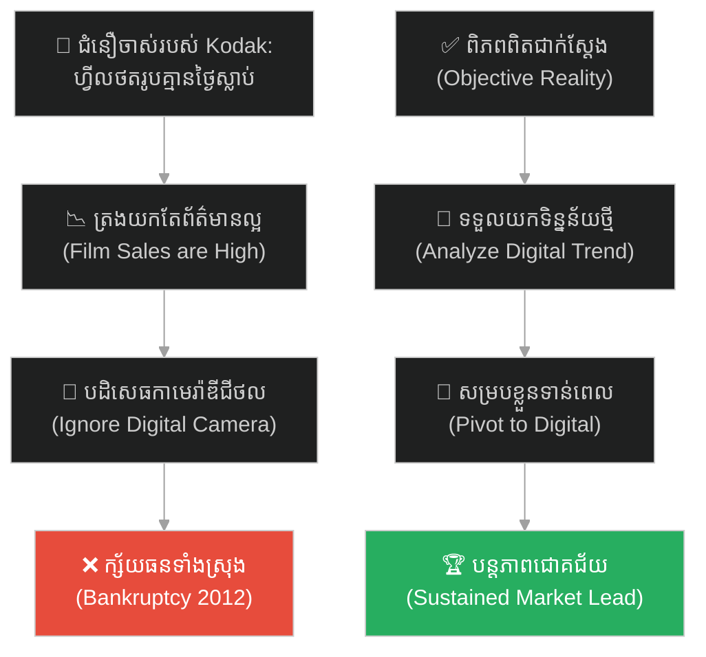
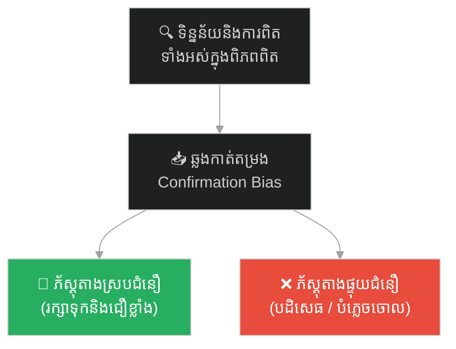
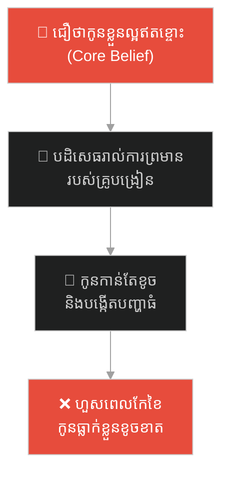
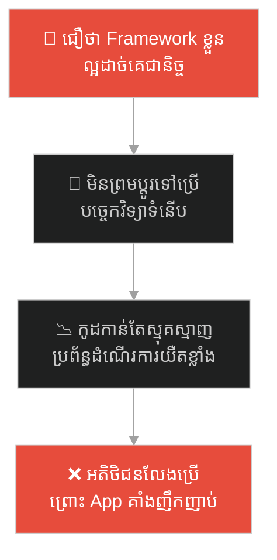
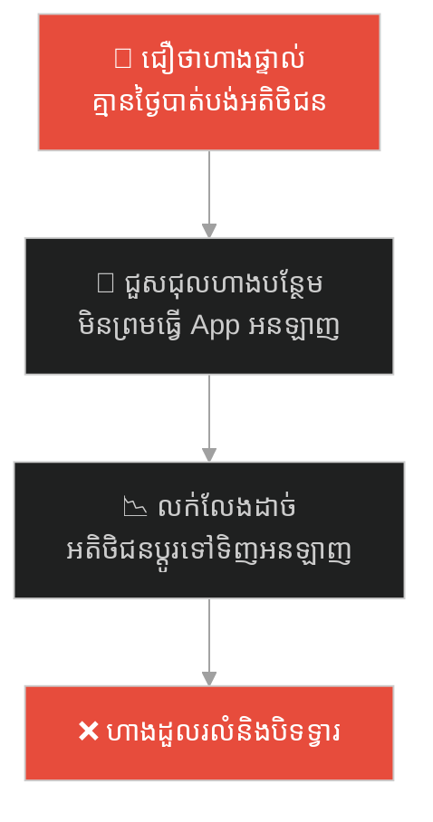
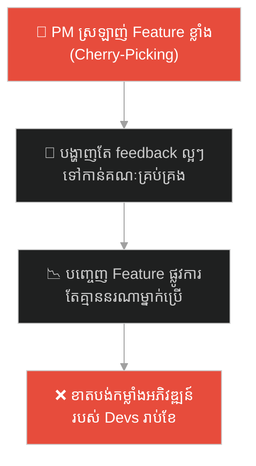
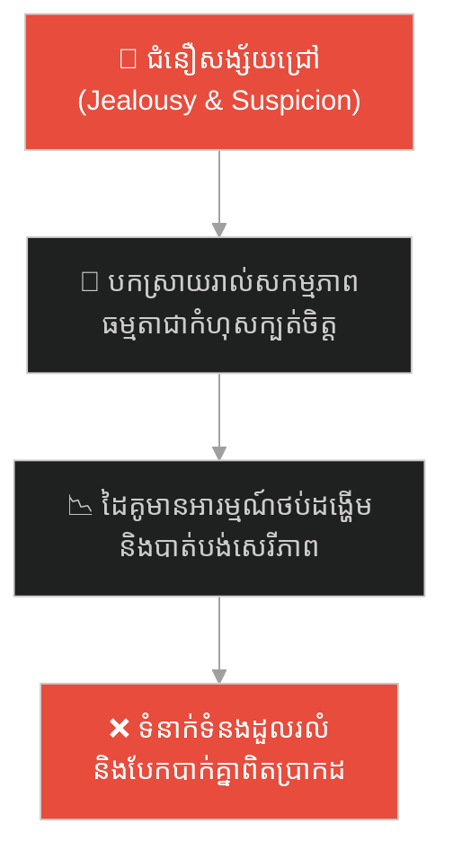
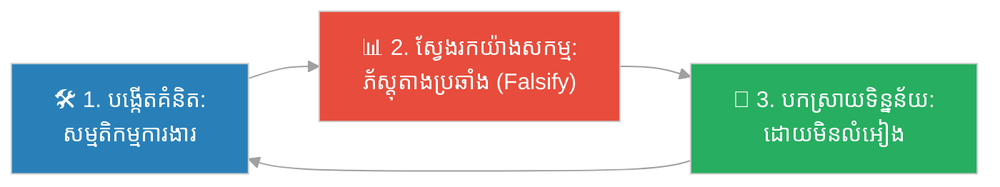

# Confirmation Bias (អគតិបញ្ជាក់ជំនឿ)៖ Kodak និងភាពងងឹតងងល់ឌីជីថល (Confirmation Bias & Kodak's Digital Blindness)

**Author:** ichamrong  
**Date:** 2026-05-27  
**Tags:** #confirmation-bias #innovation #kodak #startup-lessons #cognitive-bias #parable  
**Category:** Concepts / Parables  
**Read Time:** ~15 min  

---

## 📌 មាតិកា (Table of Contents)
- [អន្ទាក់ផ្លូវចិត្ត (The Trap)](#0)
- [១. រឿងព្រេងប្រវត្តិសាស្ត្រ៖ Steve Sasson និងការបង្កើតកាមេរ៉ាឌីជីថលដំបូង (Steve Sasson & The First Digital Camera)](#1)
  - [អគតិរំលងការពិត និងការដួលរលំនៃអាណាចក្រ Kodak (The Collapse of Kodak)](#1-1)
- [២. បញ្ហា៖ ការត្រងយកតែភ័ស្តុតាងដែលចង់ឃើញ (The Issue: Confirmation Bias Trap)](#2)
- [៣. ឧទាហរណ៍ជាក់ស្តែងក្នុងពិភពពិត (Real World Examples)](#3)
  - [ឧទាហរណ៍ទី ១ — កម្រិតស្រាល (គ្រួសារ)៖ ការគិតថាកូនខ្លួនល្អឥតខ្ចោះ (The Perfect Child Syndrome)](#3-1)
  - [ឧទាហរណ៍ទី ២ — កម្រិតមធ្យម (បច្ចេកទេស)៖ ការប្រើប្រាស់ Framework តាមចំណង់ចំណូលចិត្ត (The Dogmatic Framework Developer)](#3-2)
  - [ឧទាហរណ៍ទី ៣ — កម្រិតមធ្យម (ធុរកិច្ច)៖ ការមិនអើពើនឹងការលក់អនឡាញ (The Brick-and-Mortar Denial)](#3-3)
  - [ឧទាហរណ៍ទី ៤ — កម្រិតមធ្យម (សង្គម/គ្រប់គ្រង)៖ ការជ្រើសរើសយកតែទិន្នន័យល្អៗរបស់ PM (The Cherry-Picking Product Manager)](#3-4)
  - [ឧទាហរណ៍ទី ៥ — កម្រិតធ្ងន់ (ទំនាក់ទំនង)៖ ការសង្ស័យនិងការចោទប្រកាន់គ្មានហេតុផល (The Jealous Partner Trap)](#3-5)
- [៤. ដំណោះស្រាយទូទៅ៖ ការស្វែងរកភ័ស្តុតាងប្រឆាំង និងការធ្វើតេស្តសម្មតិកម្ម (The General Solution: Seeking Disconfirming Evidence)](#4)
- [សេចក្តីសន្និដ្ឋាន (Conclusion)](#5)
- [ឯកសារយោង (References)](#6)
- [Related Posts](#7)

---

## អន្ទាក់ផ្លូវចិត្ត (The Trap)

តើអ្នកធ្លាប់បង្កើតគំនិត ឬផែនការអ្វីមួយ រួចហើយចាប់ផ្តើមស្វែងរកតែព័ត៌មាន ឬសកម្មភាពណាដែលគាំទ្រគំនិតនោះ ដោយបដិសេធមិនស្តាប់ការរិះគន់ ឬទិន្នន័យផ្ទុយគ្នាដែរឬទេ?

នៅក្នុងជីវិតរស់នៅ និងការសម្រេចចិត្ត៖
* **យើងងាយនឹងធ្លាក់ក្នុងអន្ទាក់** នៃការបកស្រាយរាល់ព្រឹត្តិការណ៍ជុំវិញខ្លួន ឱ្យស្របទៅនឹងជំនឿ ឬគំនិតដែលមានស្រាប់នៅក្នុងខួរក្បាលរបស់យើង (Selective Interpretation)។
* **យើងមើលរំលង** ភ័ស្តុតាងដ៏ច្បាស់ក្រឡែតដែលបង្ហាញថាយើងកំពុងតែដើរខុសផ្លូវ ព្រោះខួរក្បាលរបស់យើងស្អប់ការទទួលស្គាល់ថាយើងបានធ្វើខុស។

ការបិទភ្នែកមើលឃើញតែអ្វីដែលខ្លួនចង់ឃើញ និងការបដិសេធការពិតថ្មី ហៅថា **អន្ទាក់អគតិបញ្ជាក់ជំនឿ (Confirmation Bias Trap)**។

ដើម្បីយល់ដឹងពីរបៀបដែលក្រុមហ៊ុន Kodak បំផ្លាញខ្លួនឯងដោយសារអគតិនេះ នេះជាផែនទីបង្ហាញផ្លូវ៖
1. **រឿងព្រេងប្រវត្តិសាស្ត្រ (The Historic Legend)** — រឿងរ៉ាវរបស់ Steve Sasson និងការបង្កើតកាមេរ៉ាឌីជីថលដំបូងនៅ Kodak។
2. **បញ្ហា (The Issue)** — ការវិភាគយន្តការផ្លូវចិត្តនៃ Confirmation Bias និងផលប៉ះពាល់នៃការលំអៀង។
3. **ឧទាហរណ៍ជាក់ស្តែងក្នុងពិភពពិត (Real World Examples)** — ពិនិត្យមើលអន្ទាក់នេះក្នុងកម្រិតគ្រួសារ បច្ចេកវិទ្យា ធុរកិច្ច ការគ្រប់គ្រង និងទំនាក់ទំនង Thread។
4. **ដំណោះស្រាយទូទៅ (The General Solution)** — ការអនុវត្តវិធីសាស្ត្រវិទ្យាសាស្ត្រ ការស្វែងរកការពិតផ្ទុយ (Disconfirming Evidence) និងការធ្វើ Red Teaming។

---

## ១. រឿងព្រេងប្រវត្តិសាស្ត្រ៖ Steve Sasson និងការបង្កើតកាមេរ៉ាឌីជីថលដំបូង (Steve Sasson & The First Digital Camera)

នៅឆ្នាំ ១៩៧៥ វិស្វករវ័យក្មេងម្នាក់ឈ្មោះ **Steve Sasson (ស្ទីវ សាសុន)** ដែលធ្វើការឱ្យក្រុមហ៊ុនផលិតហ្វីលកាមេរ៉ាខ្នាតយក្ស Kodak បានរកឃើញ និងបង្កើតកាមេរ៉ាឌីជីថល (Digital Camera) មុនគេបង្អស់នៅលើពិភពលោក។ 

កាមេរ៉ានោះមានទំហំប៉ុនម៉ាស៊ីនដុតនំប៉័ង ទម្ងន់ ៣.៦ គីឡូក្រាម និងមានគុណភាពបង្ហាញត្រឹមតែ ០.០១ మెហ្គាភីកសែល (0.01 Megapixels) ប៉ុណ្ណោះ។ វាថតរូបភាពសខ្មៅរក្សាទុកក្នុងកាសែតម៉ាញ៉េទិច ហើយត្រូវប្រើពេល ២៣ វិនាទីដើម្បីថតរូបមួយសន្លឹក។

Steve Sasson រំភើបចិត្តយ៉ាងខ្លាំង។ គាត់បានរៀបចំការបង្ហាញផលិតផលនេះដល់គណៈគ្រប់គ្រងជាន់ខ្ពស់របស់ក្រុមហ៊ុន Kodak ដោយសង្ឃឹមថាក្រុមហ៊ុននឹងគាំទ្រការអភិវឌ្ឍបច្ចេកវិទ្យានេះទៅអនាគត។

---

### អគតិរំលងការពិត និងការដួលរលំនៃអាណាចក្រ Kodak (The Collapse of Kodak)

ផ្ទុយពីការរំពឹងទុករបស់គាត់ ថ្នាក់ដឹកនាំកំពូលរបស់ Kodak បានបដិសេធរបកគំហើញនេះភ្លាមៗ។ ចម្លើយផ្លូវការដែលពួកគេបានប្រាប់ Steve Sasson គឺ៖
> **"វាគួរឱ្យស្រលាញ់ណាស់ Steve ប៉ុន្តែកុំយកវាទៅប្រាប់នរណាឱ្យសោះ!"**

ហេតុអ្វីបានជា Kodak បដិសេធ? ព្រោះពួកគេកំពុងតែរកចំណូលបានរាប់លានដុល្លារពីការលក់ហ្វីលកាមេរ៉ា (Film) ការផ្តិតរូប និងក្រដាសថតរូប។ ជំនឿស្នូល (Core Belief) របស់ពួកគេគឺ៖ *"មនុស្សនឹងគ្មានថ្ងៃចង់មើលរូបថតនៅលើអេក្រង់ទូរទស្សន៍ ឬអេក្រង់កុំព្យូទ័រឡើយ។ ពួកគេត្រូវការរូបថតផ្តិតលើក្រដាសក្រាស់ៗ ទុកក្នុងអាល់ប៊ុមជានិច្ច"*។

ក្នុងអំឡុងទសវត្សរ៍ឆ្នាំ ១៩៨០ និង ១៩៩០ នៅពេលដែលបច្ចេកវិទ្យាឌីជីថល និងកុំព្យូទ័រចាប់ផ្តើមរីកចម្រើនខ្លាំង ក្រុមហ៊ុន Kodak នៅតែមិនអើពើ។ ពួកគេបានប្រើប្រាស់ **Confirmation Bias (អគតិបញ្ជាក់ជំនឿ)** ដើម្បីត្រងយកតែទិន្នន័យណាដែលគាំទ្រជំនឿចាស់របស់ពួកគេ៖
* **នៅពេលហ្វីលលក់ដាច់៖** ពួកគេអបអរសាទរ ហើយប្រាប់ខ្លួនឯងថា "ឃើញទេ! មនុស្សនៅតែត្រូវការហ្វីលដដែល"។
* **នៅពេលគូប្រជែងលក់កាមេរ៉ាឌីជីថលដំបូង៖** ពួកគេសើចចំអកថា "រូបភាពឌីជីថលអាក្រក់ណាស់ គ្មានគុណភាពដូចហ្វីលយើងទេ"។
* **នៅពេលអតិថិជនចាប់ផ្តើមឈប់ផ្តិតរូបថត៖** ពួកគេបន្តទិញក្រុមហ៊ុនតូចៗដើម្បីជម្រុញការផ្តិតរូបថត ជាជាងប្តូរទិសដៅទៅឌីជីថលទាំងស្រុង។

នៅឆ្នាំ ២០១២ ក្រុមហ៊ុន Kodak ដែលធ្លាប់តែជាមហាអំណាចថតរូបធំជាងគេនៅលើលោក បានប្រកាសក្ស័យធនជាផ្លូវការ។ រឿងដែលគួរឱ្យសង្វេគបំផុតគឺ Kodak ខ្លួនឯងជាអ្នកបង្កើតកាមេរ៉ាឌីជីថលមុនគេបង្អស់ តែពួកគេបែរជាស្លាប់ដោយសារបច្ចេកវិទ្យានោះទៅវិញ ព្រោះពួកគេបដិសេធមិនមើលទិន្នន័យដែលប្រឆាំងនឹងផាសុកភាពរបស់ខ្លួន។

---

## ២. បញ្ហា៖ ការត្រងយកតែភ័ស្តុតាងដែលចង់ឃើញ (The Issue: Confirmation Bias Trap)

Confirmation Bias គឺជាប្រភេទលំអៀងនៃការយល់ដឹង (Cognitive Bias) ដែលខួរក្បាលរបស់មនុស្សដំណើរការព័ត៌មានដោយលំអៀងទៅរកជំនឿ ឬសម្មតិកម្មដែលមានស្រាប់៖

បាតុភូតនេះកើតឡើងតាមរយៈរបៀបបីយ៉ាង៖
1. **ការស្វែងរកដោយលំអៀង (Biased Search)៖** យើងស្វែងរកតែទិន្នន័យណាដែលគាំទ្រគំនិតរបស់យើង (ឧទាហរណ៍៖ ស្វែងរកតែ Google queries ណាដែលបញ្ជាក់ថាគំនិតយើងត្រឹមត្រូវ)។
2. **ការបកស្រាយដោយលំអៀង (Biased Interpretation)៖** យើងបកស្រាយព័ត៌មានមិនច្បាស់លាស់ ឱ្យទៅជាភ័ស្តុតាងគាំទ្រខ្លួនឯង។
3. **ការចងចាំដោយលំអៀង (Biased Memory)៖** យើងចងចាំបានយ៉ាងល្អនូវរាល់ព្រឹត្តិការណ៍ណាដែលយើងធ្វើត្រូវ និងភ្លេចចោលនូវរាល់ពេលដែលយើងធ្វើខុស។

---

## ៣. ឧទាហរណ៍ជាក់ស្តែងក្នុងពិភពពិត

---

### ឧទាហរណ៍ទី ១ — កម្រិតស្រាល (គ្រួសារ)៖ ការគិតថាកូនខ្លួនល្អឥតខ្ចោះ (The Perfect Child Syndrome)

ឪពុកម្តាយខ្លះមានជំនឿយ៉ាងមុតមាំថាកូនរបស់ពួកគេគឺជាក្មេងល្អ ស្លូតបូត និងខំរៀនបំផុត។ ទោះបីជាគ្រូបង្រៀន ឬអ្នកជិតខាងមកប្រាប់ជាច្រើនដងថា កូនរបស់ពួកគេដើរលេងរំលងសាលា និងវាយតប់ជាមួយគេក៏ដោយ ក៏ពួកគេបដិសេធមិនជឿឡើយ ដោយគិតថាគេ "ច្រណែន" ឬ "ចោទប្រកាន់ខុស"។

ឪពុកម្តាយបានឆ្លងកាត់តម្រង Confirmation Bias ដោយកត់ត្រាតែពេលកូនជួយការងារផ្ទះបន្តិចបន្តួច និងបដិសេធរាល់របាយការណ៍អវិជ្ជមានពីសាលា។

---

### ឧទាហរណ៍ទី ២ — កម្រិតមធ្យម (បច្ចេកទេស)៖ ការប្រើប្រាស់ Framework តាមចំណង់ចំណូលចិត្ត (The Dogmatic Framework Developer)

វិស្វករសូហ្វវែរជាន់ខ្ពស់ម្នាក់ ស្រលាញ់ និងជឿជាក់លើ Framework មួយយ៉ាងខ្លាំង (ឧទាហរណ៍ AngularJS ឬ Custom Core Engine របស់គាត់)។ ទោះបីជាមានទិន្នន័យ Benchmarks និងការវាស់ស្ទង់ Memory Leaks បង្ហាញថាកម្មវិធីដំណើរការយឺត និងពិបាកពង្រីក (Scale) ក៏ដោយ ក៏គាត់នៅតែបកស្រាយថា បញ្ហាមកពី "Servers គ្មានគុណភាព" ឬ "អ្នកសរសេរកូដផ្សេងទៀតមិនចេះប្រើ"។

---

### ឧទាហរណ៍ទី ៣ — កម្រិតមធ្យម (ធុរកិច្ច)៖ ការមិនអើពើនឹងការលក់អនឡាញ (The Brick-and-Mortar Denial)

ម្ចាស់បណ្ណាគារលក់សៀវភៅដ៏ធំមួយនៅក្នុងទីក្រុង ជឿជាក់ថាអតិថិជនត្រូវការអារម្មណ៍ដើរទិញសៀវភៅផ្ទាល់ និងប៉ះក្រដាសសៀវភៅ មិនអាចជំនួសដោយការទិញអនឡាញបានឡើយ។ នៅពេលដែលទិន្នន័យលក់ធ្លាក់ចុះ គាត់បានបកស្រាយថា "មកពីសេដ្ឋកិច្ចមិនល្អបណ្តោះអាសន្ន" ហើយបន្តវិនិយោគលើការជួសជុលហាងឱ្យស្អាត ជំនួសឱ្យការកសាង App លក់អនឡាញ។

---

### ឧទាហរណ៍ទី ៤ — កម្រិតមធ្យម (សង្គម/គ្រប់គ្រង)៖ ការជ្រើសរើសយកតែទិន្នន័យល្អៗរបស់ PM (The Cherry-Picking Product Manager)

Product Manager ម្នាក់បានរចនាមុខងារថ្មីមួយដែលគាត់ស្រលាញ់ខ្លាំង។ នៅពេលធ្វើតេស្តសាកល្បង (Beta Run) គាត់បានជ្រើសរើសតែមតិកែលម្អវិជ្ជមានពីអ្នកប្រើប្រាស់ ៥ នាក់ដែលចូលចិត្តវា ហើយមិនអើពើនឹងទិន្នន័យអវិជ្ជមាន (Analytics) ដែលបង្ហាញថា ៩៥% នៃអ្នកប្រើប្រាស់ផ្សេងទៀតបានបិទមុខងារនោះចោលភ្លាមៗក្រោយពេលបើក។

---

### ឧទាហរណ៍ទី ៥ — កម្រិតធ្ងន់ (ទំនាក់ទំនង)៖ ការសង្ស័យនិងការចោទប្រកាន់គ្មានហេតុផល (The Jealous Partner Trap)

ដៃគូម្នាក់មានការសង្ស័យថា គូស្នេហ៍របស់ខ្លួនកំពុងតែលួចមានទំនាក់ទំនងជាមួយអ្នកផ្សេង (Infidelity)។ ដោយសារតែជំនឿសង្ស័យនេះ គាត់បានចាប់ផ្តើមតាមដាន និងបកស្រាយរាល់សកម្មភាពធម្មតាឱ្យទៅជាកំហុស៖
* ប្រសិនបើដៃគូមកយឺត ១០ នាទី៖ "មកពីលួចទៅជួបអ្នកផ្សេង!"
* ប្រសិនបើដៃគូញញឹមដាក់ទូរស័ព្ទ៖ "កំពុងតែផ្ញើសាររកគ្នាហើយ!"
* ប្រសិនបើដៃគូចូលគេងលឿន៖ "កំពុងតែគេចវេសមិនចង់និយាយជាមួយខ្ញុំ!"

---

## ៤. ដំណោះស្រាយទូទៅ៖ ការស្វែងរកភ័ស្តុតាងប្រឆាំង និងការធ្វើតេស្តសម្មតិកម្ម (The General Solution: Seeking Disconfirming Evidence)

ដើម្បីដោះស្រាយជំងឺ Confirmation Bias យើងត្រូវផ្លាស់ប្តូរផ្នត់គំនិតពី "ការស្វែងរកភ័ស្តុតាងគាំទ្រខ្លួនឯង" ទៅជា "ការស្វែងរកភ័ស្តុតាងដើម្បីបដិសេធគំនិតខ្លួនឯង (Falsification)"៖

ជំហាននៃការអនុវត្ត៖
1. **សាកសួររកព័ត៌មានផ្ទុយ (Ask Disconfirming Questions)៖** នៅពេលប្រជុំសម្រេចចិត្ត ជំនួសឱ្យការសួរថា "ហេតុអ្វីបានជាផែនការនេះល្អ?" ចូរចោទសួរថា "តើមានមូលហេតុអ្វីខ្លះដែលអាចធ្វើឱ្យផែនការនេះបរាជ័យទាំងស្រុង?"
2. **បង្កើតក្រុមសាកល្បងប្រឆាំង (Red Teaming / Devil's Advocate)៖** តែងតាំងនរណាម្នាក់នៅក្នុងក្រុមឱ្យដើរតួជាអ្នករិះគន់ និងស្វែងរកចន្លោះប្រហោងនៃគម្រោងដោយចេតនា។
3. **វាស់ស្ទង់ទិន្នន័យជាក់ស្តែង (Trust Objective Data over Feelings)៖** កំណត់គោលដៅរង្វាស់រង្វាល់អព្យាក្រឹត្យ (Metrics) ជាមុនសិន មុនពេលចាប់ផ្តើមគម្រោង ដើម្បីការពារកុំឱ្យយើងកែសម្រួលទិន្នន័យតាមក្រោយដើម្បីតម្រូវចិត្តខ្លួនឯង។

---

## 🐇 ធ្លាក់ចូលក្នុងរន្ធទន្សាយ (Enter the Rabbit Hole)

ដើម្បីស្វែងយល់បន្ថែមអំពីរបៀបដែលការភ័យខ្លាចបាត់បង់ប្រាក់ចំណេញ និងការរក្សាការពារ "ស្ថានភាពបច្ចុប្បន្ន (Status Quo)" អាចបំផ្លាញក្រុមហ៊ុនទូរស័ព្ទយក្សលំដាប់ពិភពលោក (Nokia) សូមបន្តដំណើរទៅកាន់៖

* 🚀 **[ចាប់ផ្តើមដំណើររុករក (Start the Journey) ➔ Loss Aversion and Nokia's Collapse](./72-nokia-and-the-fear-of-loss.md)**

---

## សេចក្តីសន្និដ្ឋាន (Conclusion)

> **«កុំជឿជាក់លើខួរក្បាលខ្លួនឯងពេក។ វាត្រូវបានរចនាមកដើម្បីការពារភាពត្រឹមត្រូវរបស់អ្នក មិនមែនស្វែងរកការពិតនោះឡើយ។»**

ភាពខុសគ្នារវាងសហគ្រិនពូកែ និងសហគ្រិនបរាជ័យ គឺសមត្ថភាពក្នុងការសម្លឹងមើលភ័ស្តុតាងដែលប្រឆាំងនឹងខ្លួនឯងដោយបើកចិត្ត។ ចូរធ្វើខ្លួនជា Steve Sasson ដែលហ៊ានទទួលយកការពិត និងបច្ចេកវិទ្យាថ្មី ប្រសើរជាងធ្វើខ្លួនជាថ្នាក់ដឹកនាំ Kodak ដែលបិទភ្នែកឱបក្រសោបជំនឿចាស់ រហូតដល់ថ្ងៃអាណាចក្ររលាយសាបសូន្យ។

---

## ឯកសារយោង (References)

* **Peter Cathcart Wason** — *On the Failure to Eliminate Hypotheses in a Conceptual Task* (1960). Quarterly Journal of Experimental Psychology. (ការសិក្សាអំពី Wason's 2-4-6 Hypothesis Testing Task)។
* **Raymond S. Nickerson** — *Confirmation Bias: A Ubiquitous Phenomenon in Many Guises* (1998). Review of General Psychology.
* **Steve Sasson** — *The Invention of the Digital Camera* (2007). Smithsonian Interview.

---

## Related Posts

* **[71 Confirmation Bias: Science & Application](../articles/71-confirmation-bias.md)** — អត្ថបទវិទ្យាសាស្ត្រលម្អិតអំពីជំងឺលំអៀងនៃការយល់ដឹង និងវិធីសាស្ត្រលុបបំបាត់វានៅក្នុងស្ថាបត្យកម្មសូហ្វវែរ។
* **[07 Survivorship Bias](./07-survivorship-bias.md)** — ការមើលឃើញតែអ្នកជោគជ័យ និងការមើលរំលងអ្នកបរាជ័យ។
* **[13 The Lost Axe and the Filter of Mind](./13-the-lost-axe-and-the-filter-of-mind.md)** — ការបាត់ពូថៅ និងការសម្លឹងមើលអ្នកជិតខាងដោយក្តីសង្ស័យ។

---

## Related

- [💡 Concepts README](../README.md)
- [📚 Main Repository README](../../../README.md)
- [Developer Habits](../../developer-habits/README.md)
- [Mental Health & Well-being](../../mental-health/README.md)
- [Management & SDLC](../../management/README.md)
