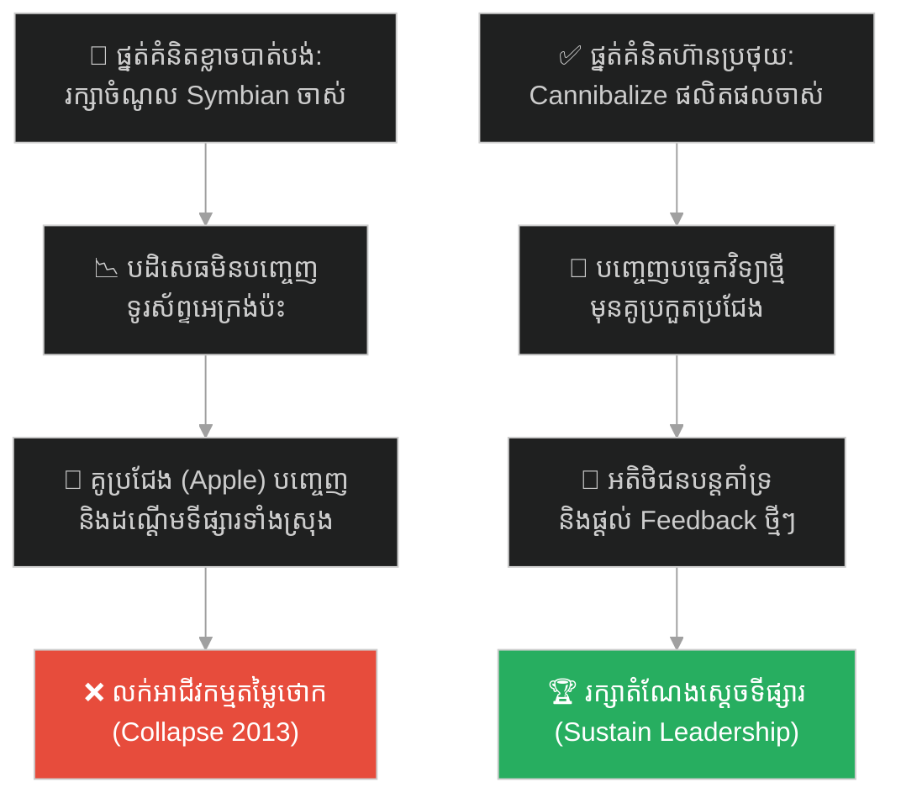
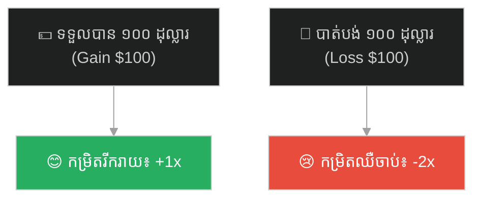
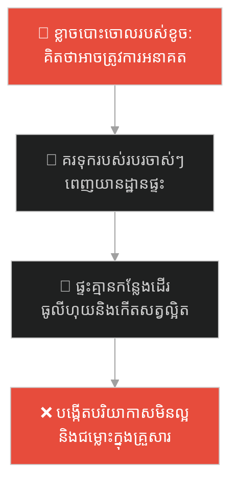
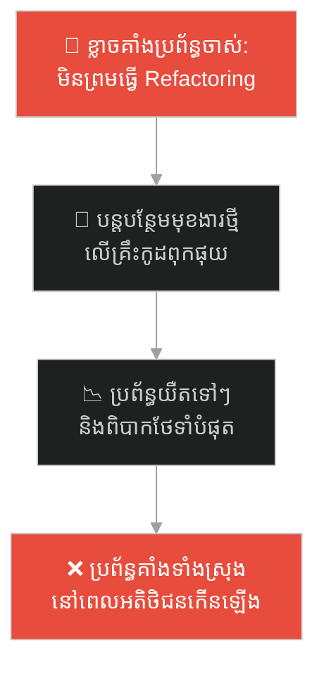
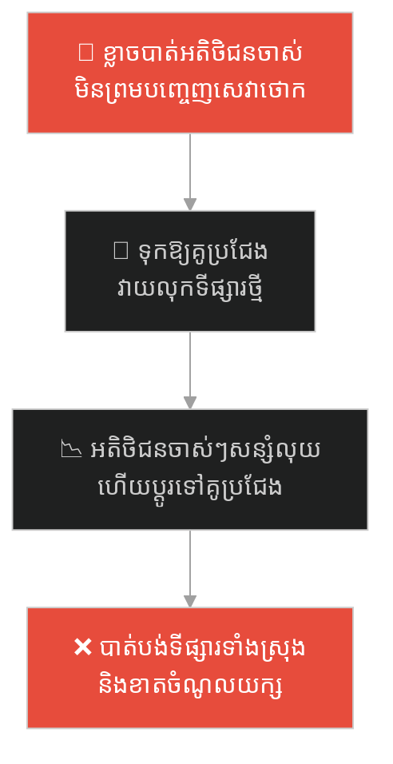
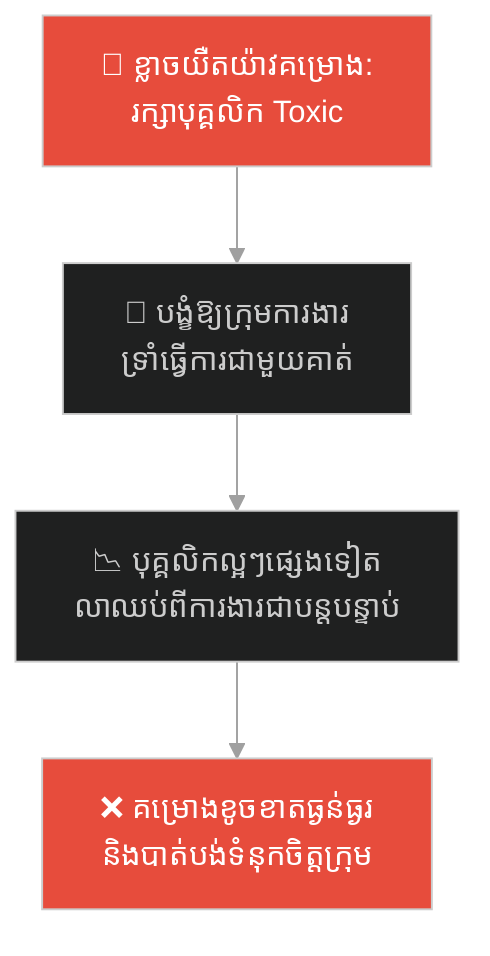
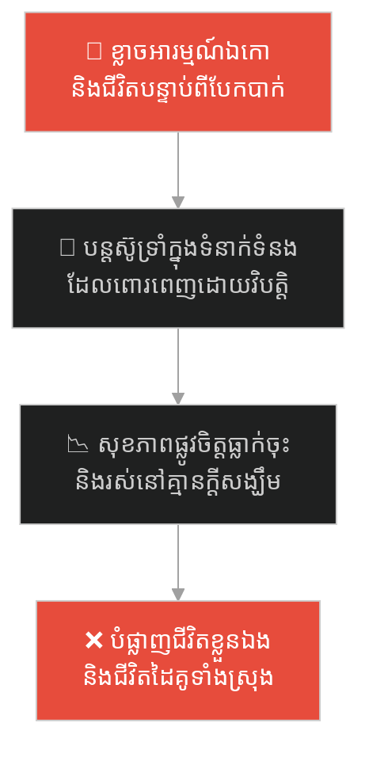
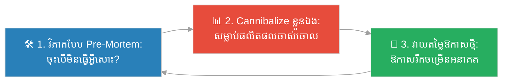

# Loss Aversion (ការភ័យខ្លាចការបាត់បង់)៖ Nokia និងការដួលរលំនៃស្តេចចុចប៊ូតុង (Loss Aversion & Nokia's Collapse)

**Author:** ichamrong  
**Date:** 2026-05-27  
**Tags:** #loss-aversion #innovation #nokia #startup-lessons #prospect-theory #cognitive-bias #parable  
**Category:** Concepts / Parables  
**Read Time:** ~15 min  

---

## 📌 មាតិកា (Table of Contents)
- [អន្ទាក់ផ្លូវចិត្ត (The Trap)](#0)
- [១. រឿងព្រេងប្រវត្តិសាស្ត្រ៖ គំរូទូរស័ព្ទអេក្រង់ប៉ះរបស់ Nokia ដែលត្រូវបានលាក់ទុក (Nokia's Hidden Touchscreen Prototype)](#1)
  - [ការសម្រេចចិត្តការពារស្ថានភាពបច្ចុប្បន្ន និងការលក់ខ្លួនឱ្យ Microsoft (The Fall to Microsoft)](#1-1)
- [២. បញ្ហា៖ ភាពឈឺចាប់នៃការបាត់បង់ ទ្វេដងនៃក្តីរីករាយបានមកវិញ (The Issue: Prospect Theory & Loss Aversion)](#2)
- [៣. ឧទាហរណ៍ជាក់ស្តែងក្នុងពិភពពិត (Real World Examples)](#3)
  - [ឧទាហរណ៍ទី ១ — កម្រិតស្រាល (គ្រួសារ)៖ ការគរទុករបស់របរចាស់ៗឥតប្រយោជន៍ (The Hoarding Garage Trap)](#3-1)
  - [ឧទាហរណ៍ទី ២ — កម្រិតមធ្យម (បច្ចេកទេស)៖ ការឱបក្រសោបកូដចាស់ និងប្រព័ន្ធចាស់ (The Legacy Monolith Safe-Haven)](#3-2)
  - [ឧទាហរណ៍ទី ៣ — កម្រិតមធ្យម (ធុរកិច្ច)៖ ការមិនហ៊ានបញ្ចុះតម្លៃដើម្បីប្រកួតប្រជែង (The Cannibalization Fear)](#3-3)
  - [ឧទាហរណ៍ទី ៤ — កម្រិតមធ្យម (សង្គម/គ្រប់គ្រង)៖ ការរក្សាបុគ្គលិកអសមត្ថភាព (Keeping Toxic High-Performers)](#3-4)
  - [ឧទាហរណ៍ទី ៥ — កម្រិតធ្ងន់ (ទំនាក់ទំនង)៖ ការទ្រាំរស់នៅក្នុងទំនាក់ទំនងដែលគ្មានសុភមង្គល (The Bad Relationship Sunk Cost)](#3-5)
- [៤. ដំណោះស្រាយទូទៅ៖ ការវិភាគបែប Pre-Mortem និងការផ្លាស់ប្តូរផ្នត់គំនិត (The General Solution: Self-Cannibalization and Pre-Mortem)](#4)
- [សេចក្តីសន្និដ្ឋាន (Conclusion)](#5)
- [ឯកសារយោង (References)](#6)
- [Related Posts](#7)

---

## អន្ទាក់ផ្លូវចិត្ត (The Trap)

តើអ្នកធ្លាប់ដឹងច្បាស់ថា ខ្លួនឯងចាំបាច់ត្រូវតែផ្លាស់ប្តូរ ឬចាកចេញពីស្ថានភាពបច្ចុប្បន្ន ប៉ុន្តែនៅតែបដិសេធមិនព្រមធ្វើ ព្រោះតែភ័យខ្លាចបាត់បង់របស់ដែលមានស្រាប់នៅក្នុងដៃដែរឬទេ?

នៅក្នុងជីវិតការងារ និងការសម្រេចចិត្តវិនិយោគ៖
* **យើងងាយនឹងធ្លាក់ក្នុងអន្ទាក់** នៃការបារម្ភ និងសោកស្តាយរបស់ដែលយើងអាចនឹងបាត់បង់ (ដូចជា ផាសុកភាព ចំណូលបច្ចុប្បន្ន ឋានៈ) ច្រើនជាងការរំភើបចំពោះអ្វីដែលយើងអាចទទួលបាននៅអនាគត។
* **យើងមើលរំលង** ឱកាសរីកចម្រើនថ្មីៗ និងបណ្តោយឱ្យគូប្រជែងវ៉ាដាច់ ព្រោះយើងមិនហ៊ាន "សម្លាប់" ផលិតផលចាស់ ឬទម្លាប់ចាស់ដែលកំពុងតែបង្កើតផលឱ្យយើងនាពេលបច្ចុប្បន្ន។

ការបដិសេធមិនព្រមធ្វើការផ្លាស់ប្តូរព្រោះខ្លាចការខាតបង់ ហៅថា **អន្ទាក់អគតិខ្លាចបាត់បង់ (Loss Aversion Trap)**។

ដើម្បីយល់ដឹងពីរបៀបដែលមហាយក្ស Nokia ត្រូវដួលរលំដោយសារក្តីបារម្ភនេះ នេះជាផែនទីបង្ហាញផ្លូវ៖
1. **រឿងព្រេងប្រវត្តិសាស្ត្រ (The Historic Legend)** — រឿងរ៉ាវរបស់វិស្វករ Nokia ដែលបានបង្កើតអេក្រង់ប៉ះមុន iPhone តែត្រូវបានបដិសេធ។
2. **បញ្ហា (The Issue)** — ការវិភាគទ្រឹស្តី Prospect Theory របស់លោក Daniel Kahneman និងការប្រៀបធៀបអារម្មណ៍បាត់បង់។
3. **ឧទាហរណ៍ជាក់ស្តែងក្នុងពិភពពិត (Real World Examples)** — ពិនិត្យមើលអន្ទាក់នេះក្នុងកម្រិតគ្រួសារ បច្ចេកវិទ្យា ធុរកិច្ច ការគ្រប់គ្រង និងទំនាក់ទំនង។
4. **ដំណោះស្រាយទូទៅ (The General Solution)** — វិធីសាស្ត្រធ្វើ Pre-Mortem, គោលការណ៍ "Cannibalize Yourself" និងការវាយតម្លៃហានិភ័យតាមបែបវិទ្យាសាស្ត្រ។

---

## ១. រឿងព្រេងប្រវត្តិសាស្ត្រ៖ គំរូទូរស័ព្ទអេក្រង់ប៉ះរបស់ Nokia ដែលត្រូវបានលាក់ទុក (Nokia's Hidden Touchscreen Prototype)

នៅឆ្នាំ ២០០៧ ក្រុមហ៊ុន Nokia គឺជាស្តេចទូរស័ព្ទដៃដែលគ្របដណ្តប់ទីផ្សារពិភពលោកស្ទើរតែ ៥០%។ ពួកគេលក់ទូរស័ព្ទចុចប៊ូតុងបានរាប់សិបលានគ្រឿង និងរកប្រាក់ចំណេញបានយ៉ាងច្រើនមហាសាលរាល់ថ្ងៃ។

មនុស្សភាគច្រើនគិតថា Nokia ដួលរលំដោយសារតែពួកគេមិនអាចបង្កើតទូរស័ព្ទស្មាតហ្វូនបាន (Smartphones)។ ប៉ុន្តែការពិតគឺ វិស្វកររបស់ Nokia បានបង្កើតគំរូទូរស័ព្ទអេក្រង់ប៉ះ (Touchscreen prototypes) និងប្រព័ន្ធអ៊ីនធឺណិតដ៏អស្ចារ្យ **មុន** ពេលដែលក្រុមហ៊ុន Apple បញ្ចេញ iPhone ទៅទៀត! 

នៅចុងទសវត្សរ៍ឆ្នាំ ១៩៩០ និងដើមទសវត្សរ៍ឆ្នាំ ២០០០ ក្រុមអភិវឌ្ឍន៍ផលិតផលរបស់ Nokia បានបង្ហាញគំរូទូរស័ព្ទដែលដំណើរការដោយអេក្រង់ប៉ះ និងមានបំពាក់នូវ App Store ផ្ទាល់ខ្លួនទៀតផង។ ប៉ុន្តែនៅពេលដែលពួកគេយកគម្រោងនោះទៅបង្ហាញថ្នាក់ដឹកនាំ Nokia បានបដិសេធមិនព្រមផលិតវាលក់នោះទេ។ 

---

### ការសម្រេចចិត្តការពារស្ថានភាពបច្ចុប្បន្ន និងការលក់ខ្លួនឱ្យ Microsoft (The Fall to Microsoft)

ថ្នាក់ដឹកនាំរបស់ Nokia មិនមែនល្ងង់ទេ តែពួកគេត្រូវជាប់អន្ទាក់នៃជំងឺផ្លូវចិត្តមួយហៅថា **"Loss Aversion" (ការភ័យខ្លាចការបាត់បង់)**៖

1. **ខ្លាចបាត់បង់ចំណូលចាស់ (Cannibalization Fear)៖** ពួកគេគិតថា *"ប្រសិនបើយើងបញ្ចេញទូរស័ព្ទអេក្រង់ប៉ះ វានឹងធ្វើឱ្យទូរស័ព្ទចុចប៊ូតុងដែលកំពុងលក់ដាច់រាប់លានគ្រឿងរបស់យើងបាត់បង់ទីផ្សារ!"* ពួកគេសុខចិត្តបោះបង់ "ឱកាសចំណេញថ្មី" ព្រោះតែខ្លាចបាត់បង់ "ចំណូលដែលមានស្រាប់"។
2. **ស្តាយលុយដែលធ្លាប់បានវិនិយោគ (Sunk Cost Fallacy)៖** ពួកគេបានចំណាយលុយរាប់ពាន់លានដុល្លារ ទៅលើប្រព័ន្ធប្រតិបត្តិការចាស់របស់ខ្លួនឈ្មោះ Symbian។ ការប្តូរទៅប្រព័ន្ធថ្មី គឺស្មើនឹងការទទួលស្គាល់ថា លុយដែលធ្លាប់ចំណាយពីមុនមកត្រូវវិនាសអស់ហើយ។
3. **ចង់រក្សាភាពស្ងប់ស្ងាត់ (Status Quo)៖** ដោយសារតែបច្ចុប្បន្នកំពុងតែចំណេញស្រាប់ ការនៅស្ងៀមគឺមានអារម្មណ៍ថាសុវត្ថិភាព។ ការផ្លាស់ប្តូរមានហានិភ័យ ដែលពួកគេមិនហ៊ានប្រថុយ។

រហូតដល់ឆ្នាំ ២០១៣ ក្រុមហ៊ុនដែលធ្លាប់មានតម្លៃជាង ២៥០ ពាន់លានដុល្លារមួយនេះ ត្រូវបង្ខំចិត្តលក់ផ្នែកទូរស័ព្ទដៃរបស់ខ្លួនទៅឱ្យ Microsoft ក្នុងតម្លៃត្រឹមតែ ៧.២ ពាន់លានដុល្លារប៉ុណ្ណោះ។ នាយកប្រតិបត្តិរបស់ Nokia លោក Stephen Elop បាននិយាយប្រយោគមួយដ៏ល្បីល្បាញថា៖ *"យើងមិនបានធ្វើអ្វីខុសសោះ ប៉ុន្តែយើងនៅតែបរាជ័យ។"*

ការពិតគឺ ពួកគេបានធ្វើរឿងដ៏ខុសឆ្គងមួយ៖ **ពួកគេខ្លាចសម្លាប់ផលិតផលខ្លួនឯង រហូតដល់បណ្តោយឱ្យអ្នកដទៃមកសម្លាប់ពួកគេជំនួសវិញ។**

---

## ២. បញ្ហា៖ ភាពឈឺចាប់នៃការបាត់បង់ ទ្វេដងនៃក្តីរីករាយបានមកវិញ (The Issue: Prospect Theory & Loss Aversion)

នៅក្នុងឆ្នាំ ១៩៧៩ គូអ្នកចិត្តវិទ្យា Daniel Kahneman និង Amos Tversky បានបង្ហាញទ្រឹស្តីវិទ្យាសាស្ត្រដ៏ល្បីល្បាញមួយហៅថា **Prospect Theory (ទ្រឹស្តីរំពឹងទុក)**។ ការស្រាវជ្រាវបង្ហាញថា មនុស្សយើងមានការឈឺចាប់ពេលបាត់បង់អ្វីមួយ (Loss) ខ្លាំងជាងក្តីរំភើបនៅពេលដែលទទួលបានអ្វីមួយដែលមានតម្លៃស្មើគ្នា (Gain) ដល់ទៅ ២ ដង។

ក្តីខ្លាចបាត់បង់នេះ បង្កើតជា **Status Quo Bias (អគតិការពារស្ថានភាពបច្ចុប្បន្ន)**៖
* **ការបារម្ភហួសហេតុ៖** យើងតែងតែផ្តោតទៅលើអ្វីដែលយើងនឹងបាត់បង់ភ្លាមៗ ប្រសិនបើយើងផ្លាស់ប្តូរ។
* **ការវាយតម្លៃអនាគតទាប៖** យើងមើលរំលងតម្លៃនៃឱកាស និងផលចំណេញដែលនឹងទទួលបាននៅពេលអនាគត។

---

## ៣. ឧទាហរណ៍ជាក់ស្តែងក្នុងពិភពពិត

---

### ឧទាហរណ៍ទី ១ — កម្រិតស្រាល (គ្រួសារ)៖ ការគរទុករបស់របរចាស់ៗឥតប្រយោជន៍ (The Hoarding Garage Trap)

ឪពុកម្នាក់មិនព្រមបោះចោល ឬលក់សម្លៀកបំពាក់ចាស់ៗ ឧបករណ៍ប្រើប្រាស់អគ្គិសនីដែលខូច និងប្រអប់កាតុងដែលគរពេញយានដ្ឋានឡើយ។ ទោះបីជាផ្ទះគ្មានកន្លែងដើរ និងប្រពន្ធកូនត្អូញត្អែរក៏ដោយ ក៏គាត់នៅតែគិតថា *"ក្រែងលោថ្ងៃក្រោយយើងត្រូវការប្រើវា"*។

ការភ័យខ្លាចការបាត់បង់តម្លៃតូចតាចរបស់ខូច បំផ្លាញគុណភាពរស់នៅដ៏មានតម្លៃរបស់គ្រួសារទាំងមូល។

---

### ឧទាហរណ៍ទី ២ — កម្រិតមធ្យម (បច្ចេកទេស)៖ ការឱបក្រសោបកូដចាស់ និងប្រព័ន្ធចាស់ (The Legacy Monolith Safe-Haven)

ក្រុមការងារវិស្វកម្មសូហ្វវែរ បានបដិសេធមិនព្រមធ្វើការផ្លាស់ប្តូរ (Refactor) ប្រព័ន្ធទិន្នន័យ និង Legacy code ដែលសរសេរតាំងពី ១០ ឆ្នាំមុនឡើយ។ ពួកគេបារម្ភថា ការធ្វើបែបនេះអាចនឹងបង្កឱ្យមាន Bugs ឬ Downtime បណ្តោះអាសន្ន ទោះបីជាការរក្សាទុកវាធ្វើឱ្យការបញ្ចេញមុខងារថ្មីៗត្រូវការពេលយូរជាងមុន ៥ ដងក៏ដោយ។

---

### ឧទាហរណ៍ទី ៣ — កម្រិតមធ្យម (ធុរកិច្ច)៖ ការមិនហ៊ានបញ្ចុះតម្លៃដើម្បីប្រកួតប្រជែង (The Cannibalization Fear)

ក្រុមហ៊ុនលក់សូហ្វវែរធំមួយ រកចំណូលបានពីការលក់អាជ្ញាប័ណ្ណតម្លៃថ្លៃ (Enterprise Licenses)។ នៅពេលដៃគូប្រកួតប្រជែងថ្មីបញ្ចេញម៉ូដែល SaaS តម្លៃថោកតាមអ៊ីនធឺណិត ក្រុមហ៊ុននេះមិនព្រមបញ្ចេញកញ្ចប់សេវាកម្មតម្លៃទាបទេ ព្រោះខ្លាចបាត់បង់អតិថិជនចាស់ដែលកំពុងបង់លុយថ្លៃ។

---

### ឧទាហរណ៍ទី ៤ — កម្រិតមធ្យម (សង្គម/គ្រប់គ្រង)៖ ការរក្សាបុគ្គលិកអសមត្ថភាព (Keeping Toxic High-Performers)

ប្រធាននាយកដ្ឋានម្នាក់មិនហ៊ានបញ្ឈប់ការងារបុគ្គលិកដែលមានឥរិយាបថអាក្រក់ និងបំផ្លាញទឹកចិត្តក្រុមការងារឡើយ ព្រោះតែបុគ្គលិកនោះពូកែខាងបច្ចេកទេស និងកាន់ការងារសំខាន់ៗខ្លះ។ ប្រធាននាយកដ្ឋានខ្លាចថាការបាត់បង់គាត់ នឹងធ្វើឱ្យគម្រោងបច្ចុប្បន្នត្រូវយឺតយ៉ាវ។

---

### ឧទាហរណ៍ទី ៥ — កម្រិតធ្ងន់ (ទំនាក់ទំនង)៖ ការទ្រាំរស់នៅក្នុងទំនាក់ទំនងដែលគ្មានសុភមង្គល (The Bad Relationship Sunk Cost)

មនុស្សជាច្រើនសុខចិត្តទ្រាំរស់នៅក្នុងទំនាក់ទំនងស្នេហា ឬអាពាហ៍ពិពាហ៍ដែលពោរពេញដោយភាពឈឺចាប់ និងការឈ្លោះប្រកែកគ្នាគ្មានថ្ងៃបញ្ចប់។ ពួកគេខ្លាចចាកចេញ ព្រោះខ្លាចអារម្មណ៍ឯកោ ខ្លាចបាត់បង់លំនឹងហិរញ្ញវត្ថុរួម ឬស្តាយពេលវេលាដែលធ្លាប់វិនិយោគជាមួយគ្នាពីមុនមក។

---

## ៤. ដំណោះស្រាយទូទៅ៖ ការវិភាគបែប Pre-Mortem និងការផ្លាស់ប្តូរផ្នត់គំនិត (The General Solution: Self-Cannibalization and Pre-Mortem)

ដើម្បីយកឈ្នះការភ័យខ្លាចបាត់បង់ យើងត្រូវអនុវត្តយុទ្ធសាស្ត្រផ្លាស់ប្តូរទស្សនវិស័យ និងការវិភាគហានិភ័យតាមវិធីសាស្ត្រខាងក្រោម៖

ជំហាននៃការអនុវត្ត៖
1. **ចោទសួរហានិភ័យនៃការ "មិនធ្វើអ្វីសោះ" (Cost of Inaction)៖** នៅពេលសម្រេចចិត្ត ជំនួសឱ្យការសួរតែពីហានិភ័យនៃការផ្លាស់ប្តូរ ចូរវិភាគថា៖ *"តើមានមហន្តរាយអ្វីខ្លះកើតឡើងក្នុងរយៈពេល ៥ ឆ្នាំខាងមុខ ប្រសិនបើយើងមិនព្រមធ្វើអ្វីសោះ?"*
2. **គោលការណ៍ Cannibalize Yourself៖** ប្រសិនបើអ្នកមិនព្រមសម្លាប់ផលិតផលរបស់ខ្លួនដើម្បីបង្កើតផលិតផលថ្មីដែលល្អជាងទេ នោះគូប្រជែងនឹងធ្វើការងារនោះជំនួសអ្នក។ ត្រូវតែមានភាពក្លាហានដឹកនាំការផ្លាស់ប្តូរដោយខ្លួនឯង។
3. **ការវាយតម្លៃអព្យាក្រឹត្យ (Opportunity Cost Analysis)៖** គណនាតម្លៃឱកាសដែលត្រូវបាត់បង់ ដោយសារតែការស្ទាក់ស្ទើរមិនព្រមធ្វើសកម្មភាព។

---

## 🐇 ធ្លាក់ចូលក្នុងរន្ធទន្សាយ (Enter the Rabbit Hole)

ដើម្បីស្វែងយល់ពីរបៀបដែលការបញ្ជូនព័ត៌មានសម្ងាត់ដោយប្រើប្រាស់ "កូដសម្ងាត់" និងការរក្សាទុកគន្លឹះតែមួយ អាចបង្កជាហានិភ័យ និងការលេចធ្លាយព័ត៌មាន (Symmetric Key Cryptography and Security) សូមបន្តដំណើរទៅកាន់៖

* 🚀 **[ចាប់ផ្តើមដំណើររុករក (Start the Journey) ➔ The Spy and the Two-Faced Poem](./73-the-spy-and-the-two-faced-poem.md)**

---

## សេចក្តីសន្និដ្ឋាន (Conclusion)

> **«ការភ័យខ្លាចបាត់បង់អ្វីដែលមានស្រាប់ ច្រើនតែជាមូលហេតុចម្បងដែលធ្វើឱ្យយើងបាត់បង់អ្វីៗគ្រប់យ៉ាងនៅថ្ងៃអនាគត។»**

ចូរធ្វើខ្លួនជាសហគ្រិនដែលមើលឃើញអនាគតវែងឆ្ងាយ ហ៊ានលះបង់ចំណូលបច្ចុប្បន្នដើម្បីសាងសង់អ្វីដែលល្អជាង និងមាននិរន្តរភាពជាង។ កុំធ្វើខ្លួនដូចជាថ្នាក់ដឹកនាំ Nokia ដែលឱប Symbian យ៉ាងណែន ព្រោះតែខ្លាចបាត់បង់ចំណូលទូរស័ព្ទចុចប៊ូតុង រហូតដល់ត្រូវបាត់បង់អាណាចក្រទាំងមូលទៅក្នុងដៃអ្នកដទៃ។

---

## ឯកសារយោង (References)

* **Daniel Kahneman & Amos Tversky** — *Prospect Theory: An Analysis of Decision under Risk* (1979). Econometrica. (ការសិក្សាគ្រឹះនៃ Loss Aversion)។
* **Stephen Elop** — *The Burning Platform Memo* (2011). Nokia Internal Announcement.
* **David S. Kidder** — *The Startup Playbook: Secrets of the Fastest-Growing Startups* (2012). ករណីសិក្សាអំពីការសម្រេចចិត្ត Cannibalization ផលិតផលចាស់។

---

## Related Posts

* **[72 Loss Aversion: Science & Application](../articles/72-loss-aversion.md)** — អត្ថបទវិទ្យាសាស្ត្រលម្អិតអំពី Prospect Theory និងរបៀបជៀសវាងការសម្រេចចិត្តខុសដោយសារខ្លាចការខាតបង់។
* **[30 The King and the Bridge to Nowhere](./30-the-bridge-to-nowhere.md)** — អន្ទាក់ Sunk Cost Fallacy និងការសម្រេចចិត្តឈប់គាំទ្រគម្រោងខាតបង់។
* **[35 The Maginot Line and the Unguarded Forest](./35-the-maginot-line.md)** — ការឱបការពារតែខ្សែការពារចាស់ គ្មានការបត់បែន។

---

## Related

- [💡 Concepts README](../README.md)
- [📚 Main Repository README](../../../README.md)
- [Developer Habits](../../developer-habits/README.md)
- [Mental Health & Well-being](../../mental-health/README.md)
- [Management & SDLC](../../management/README.md)
