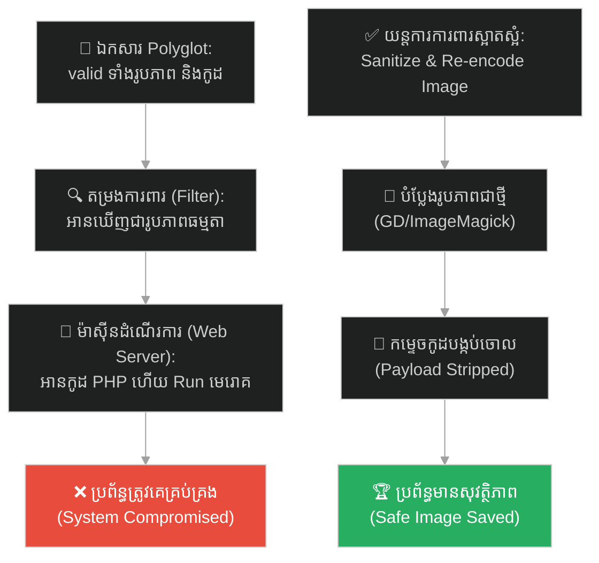
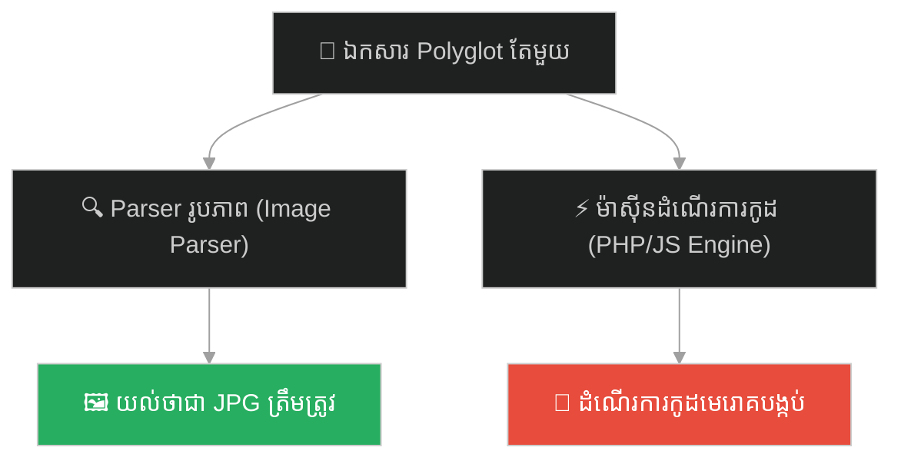
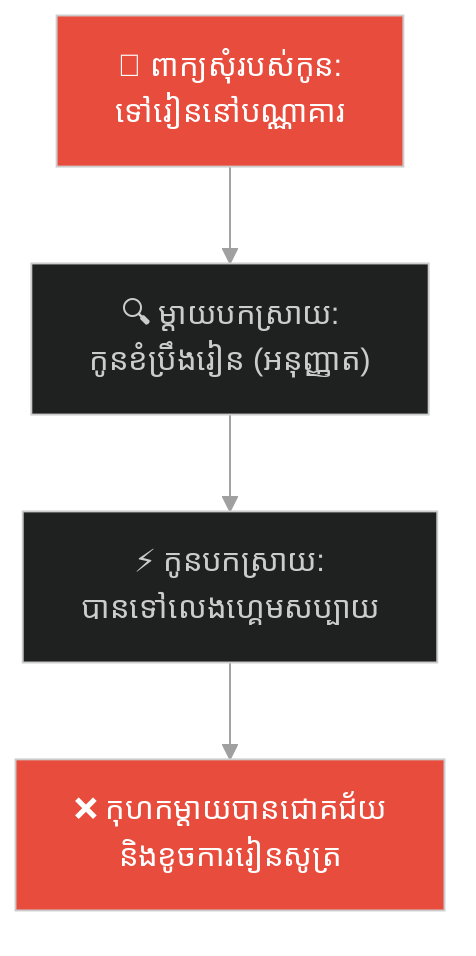
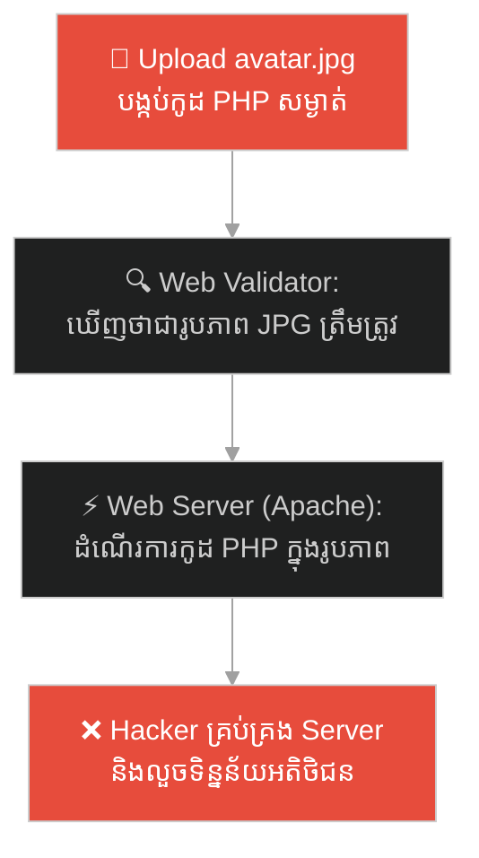
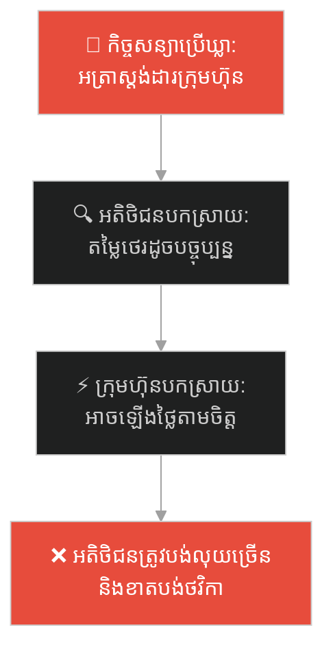
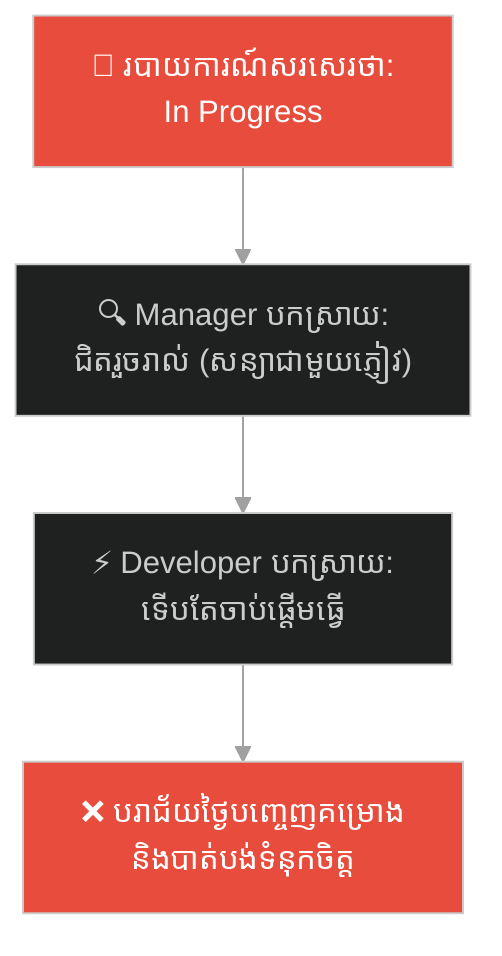
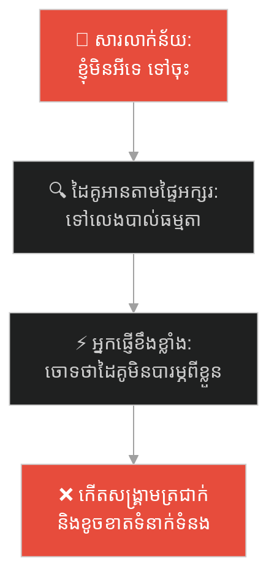
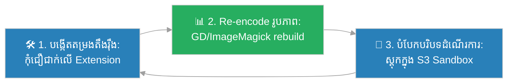

# Polyglot Attack (ការវាយប្រហារពហុទម្រង់)៖ ចារកម្ម និងកំណាព្យមុខពីរ (Polyglot Attack & The Two-Faced Poem)

**Author:** ichamrong  
**Date:** 2026-05-27  
**Tags:** #cybersecurity #polyglot-attack #file-upload #hacking #parser-difference #security #parable  
**Category:** Concepts / Parables  
**Read Time:** ~15 min  

---

## 📌 មាតិកា (Table of Contents)
- [អន្ទាក់ផ្លូវចិត្ត (The Trap)](#0)
- [១. រឿងព្រេងប្រវត្តិសាស្ត្រ៖ សំបុត្រកំណាព្យបំបាំងភ្នែកអ្នកយាមទ្វារ (The Legend of the Innocent Letter)](#1)
  - [អត្ថន័យកំបាំងរបស់ចារកម្ម និងការវាយប្រហារពីខាងក្នុង (The Hidden Meaning)](#1-1)
- [២. បញ្ហា៖ ភាពខុសគ្នានៃការបកស្រាយរវាងប្រព័ន្ធត្រួតពិនិត្យ និងប្រព័ន្ធប្រតិបត្តិការ (The Issue: Parser vs. Execution Engine)](#2)
- [៣. ឧទាហរណ៍ជាក់ស្តែងក្នុងពិភពពិត (Real World Examples)](#3)
  - [ឧទាហរណ៍ទី ១ — កម្រិតស្រាល (គ្រួសារ)៖ ការសុំអនុញ្ញាតបែបន័យពីររបស់កូន (The Double-Meaning Library Request)](#3-1)
  - [ឧទាហរណ៍ទី ២ — កម្រិតមធ្យម (បច្ចេកទេស)៖ ឯកសាររូបភាពបង្កប់កូដ PHP (The PHP Image Polyglot Upload)](#3-2)
  - [ឧទាហរណ៍ទី ៣ — កម្រិតមធ្យម (ធុរកិច្ច)៖ កិច្ចសន្យាដែលមានឃ្លាពីរន័យ (The Ambiguous Contract Loophole)](#3-3)
  - [ឧទាហរណ៍ទី ៤ — កម្រិតមធ្យម (សង្គម/គ្រប់គ្រង)៖ របាយការណ៍វឌ្ឍនភាពដែលបកស្រាយខុសគ្នា (The In-Progress Status Trap)](#3-4)
  - [ឧទាហរណ៍ទី ៥ — កម្រិតធ្ងន់ (ទំនាក់ទំនង)៖ សារលាក់ន័យសង្គ្រាមត្រជាក់ (The Cold War Text Message)](#3-5)
- [៤. ដំណោះស្រាយទូទៅ៖ ការសម្អាតទិន្នន័យ និងការបំបែកបរិបទដំណើរការ (The General Solution: Input Sanitization & Sandboxed Storage)](#4)
- [សេចក្តីសន្និដ្ឋាន (Conclusion)](#5)
- [ឯកសារយោង (References)](#6)
- [Related Posts](#7)

---

## អន្ទាក់ផ្លូវចិត្ត (The Trap)

តើអ្នកធ្លាប់ជួបស្ថានភាពដែលសារ ឬឯកសារមួយ ត្រូវបានមនុស្សពីរនាក់បកស្រាយយល់ន័យខុសគ្នាស្រឡះ រហូតបង្កជាគ្រោះថ្នាក់ដោយមិនដឹងខ្លួនដែរឬទេ?

នៅក្នុងសន្តិសុខបច្ចេកវិទ្យា និងការប្រាស្រ័យទាក់ទង៖
* **យើងងាយនឹងធ្លាក់ក្នុងអន្ទាក់** នៃការជឿជាក់លើការត្រួតពិនិត្យតែទៅលើទម្រង់ខាងក្រៅ (ដូចជា ឈ្មោះប្រភេទឯកសារ ឬពាក្យពេចន៍លំអរលើផ្ទៃក្រៅ)។
* **យើងមើលរំលង** របៀបដែលម៉ាស៊ីនដំណើរការ (Interpreter/Execution Engine) អាចទាញយកអត្ថន័យបង្កប់ដែលមានគ្រោះថ្នាក់មកអនុវត្ត ដោយសារតែវាអានទិន្នន័យក្នុងបរិបទផ្សេង។

ការបញ្ជូនទិន្នន័យដែលមានទម្រង់ត្រឹមត្រូវសម្រាប់តម្រងត្រួតពិនិត្យ តែបង្កប់កូដបំផ្លាញសម្រាប់ម៉ាស៊ីនដំណើរការ ហៅថា **អន្ទាក់ឯកសារពហុទម្រង់ (Polyglot Attack)**។

ដើម្បីយល់ដឹងពីរបៀបដែលចារកម្មប្រើប្រាស់កំណាព្យដើម្បីបំបែកខ្សែការពារ នេះជាផែនទីបង្ហាញផ្លូវ៖
1. **រឿងព្រេងប្រវត្តិសាស្ត្រ (The Historic Legend)** — រឿងរ៉ាវរបស់ចារកម្មផ្ញើកំណាព្យដែលបង្កប់ផែនការយោធា។
2. **បញ្ហា (The Issue)** — ការវិភាគការបកស្រាយខុសគ្នារវាង Parser និង Interpreter ក្នុងប្រព័ន្ធកុំព្យូទ័រ។
3. **ឧទាហរណ៍ជាក់ស្តែងក្នុងពិភពពិត (Real World Examples)** — ពិនិត្យមើលអន្ទាក់នេះក្នុងកម្រិតគ្រួសារ បច្ចេកវិទ្យា ធុរកិច្ច ការគ្រប់គ្រង និងទំនាក់ទំនង។
4. **ដំណោះស្រាយទូទៅ (The General Solution)** — ការកសាងយន្តការបំប្លែងទិន្នន័យ (Data Re-encoding) ការសម្អាត Metadata និងការរក្សាទុកឯកសារក្នុង Sandbox។

---

## ១. រឿងព្រេងប្រវត្តិសាស្ត្រ៖ សំបុត្រកំណាព្យបំបាំងភ្នែកអ្នកយាមទ្វារ (The Legend of the Innocent Letter)

នៅសម័យសង្គ្រាមបុរាណ មានទីក្រុងមួយដែលមានប្រព័ន្ធការពារយ៉ាងតឹងរ៉ឹងបំផុត។ អ្នកយាមទ្វារក្រុងត្រូវបានបញ្ជាយ៉ាងដាច់ខាតពីមេទ័ពថា៖ **"អនុញ្ញាតឱ្យតែសំបុត្រស្នេហា និងកំណាព្យធម្មតាប៉ុណ្ណោះដែលអាចឆ្លងកាត់ចូលក្នុងក្រុងបាន។ ហាមឃាត់រាល់សំបុត្រណាដែលមានពាក្យទាក់ទងនឹងសង្គ្រាម អាវុធ ផែនការយោធា ឬកូដសម្ងាត់សង្ស័យជាដាច់ខាត។"**

ថ្ងៃមួយ មានចារកម្មម្នាក់ចង់ផ្ញើសារសម្ងាត់ទៅកាន់កងទ័ពរបស់ខ្លួនដែលកំពុងបង្កប់ខ្លួននៅខាងក្នុងទីក្រុង។ គាត់ដឹងថា បើគាត់សរសេរជាកូដសម្ងាត់ស្មុគស្មាញ ឬលាក់ផែនទីក្នុងប្រអប់ អ្នកយាមទ្វារក្រុងដែលមានបទពិសោធន៍ច្បាស់ជាស្កេនរកឃើញ ហើយដុតបំផ្លាញវាចោលមិនខាន។ ដូច្នេះ គាត់បានប្រើល្បិចដ៏ឆ្លាតវៃបំផុត។

គាត់បានសរសេរសំបុត្រមួយច្បាប់។ នៅពេលអ្នកយាមទ្វារបើកអាន ពួកគេឃើញវាជា **"កំណាព្យពណ៌នាពីភាពស្រស់ស្អាតនៃផ្កាកុលាប និងសួនច្បារនាដូវក្តៅ"**។ សំបុត្រនោះមានរចនាសម្ព័ន្ធត្រឹមត្រូវ ប្រើប្រាស់ពាក្យពេចន៍ពិរោះរណ្តំ និងគ្មានចន្លោះប្រហោងគួរឱ្យសង្ស័យឡើយ។ អ្នកយាមពិនិត្យមើលយ៉ាងល្អិតល្អន់ ហើយសម្រេចចិត្តថា៖ *"វាជាកំណាព្យធម្មតា ១០០% វាគ្មានគ្រោះថ្នាក់ទេ"* រួចក៏អនុញ្ញាតឱ្យនាំសំបុត្រនោះចូលទៅក្នុងក្រុងដោយគ្មានការរារាំង។

---

### អត្ថន័យកំបាំងរបស់ចារកម្ម និងការវាយប្រហារពីខាងក្នុង (The Hidden Meaning)

ប៉ុន្តែអ្វីដែលអ្នកយាមមិនបានដឹងនោះគឺ ភាសាដែលចារកម្មសរសេរ គឺជា "ភាសាពិសេសដែលបានព្រមព្រៀងគ្នាទុកជាមុន"។ 

នៅពេលសំបុត្រនោះធ្លាក់ដល់ដៃកងទ័ពបង្កប់ខ្លួននៅក្នុងក្រុង ពួកគេមិនបានអានវាដើម្បីគយគន់សម្រស់ផ្កាកុលាបឡើយ។ ពួកគេបានយក "ក្រដាសទម្រង់ពិសេស" ដែលមានចោះប្រហោងចំចំណុចសំខាន់ៗ មកដាក់ពីលើសំបុត្រកំណាព្យនោះ។ 

គួរឱ្យភ្ញាក់ផ្អើល អក្សរដែលលេចចេញតាមប្រហោងនោះ មិនមែនជាន័យកំណាព្យទៀតទេ តែវាបានប្រែទៅជា៖ **"វាយប្រហារទ្វារខាងលិច ម៉ោង ៣ ទៀបភ្លឺ"** យ៉ាងច្បាស់លាស់។ 

សំបុត្រតែមួយច្បាប់ ប៉ុន្តែវាមានសុពលភាពទាំងពីរទម្រង់ក្នុងពេលតែមួយ៖
* សម្រាប់អ្នកយាម (Parser កម្រិតក្រៅ)៖ វាជាកំណាព្យដ៏មានសុវត្ថិភាព។
* សម្រាប់អ្នកទទួលផល (Execution Engine ខាងក្នុង)៖ វាជាផែនការយោធាបំផ្លិចបំផ្លាញ។

ទីក្រុងនោះត្រូវដួលរលំនៅយប់នោះ ព្រោះអ្នកយាមទ្វារបានវាយតម្លៃសំបុត្រតែទៅលើទម្រង់ខាងក្រៅដែលពួកគេមើលឃើញ។

---

## ២. បញ្ហា៖ ភាពខុសគ្នានៃការបកស្រាយរវាងប្រព័ន្ធត្រួតពិនិត្យ និងប្រព័ន្ធប្រតិបត្តិការ (The Issue: Parser vs. Execution Engine)

នៅក្នុងពិភពសម័យទំនើប ជាពិសេសសន្តិសុខបច្ចេកវិទ្យា (Cybersecurity) រឿងនេះតំណាងឱ្យការវាយប្រហារ **Polyglot Attack (ការវាយប្រហារដោយឯកសារពហុទម្រង់)**។ 

បាតុភូតនេះកើតឡើងនៅពេលដែលកម្មវិធីពីរផ្សេងគ្នា អានឯកសារដដែល ប៉ុន្តែយល់ទម្រង់ខុសគ្នា៖

* **Polyglot File៖** គឺជាឯកសារដែលចាប់ផ្តើមដោយ Magic Bytes នៃប្រភេទឯកសារមួយ (ដូចជា `GIF89a` សម្រាប់រូបភាព GIF) ប៉ុន្តែនៅផ្នែកកណ្តាល ឬផ្នែកខាងចុង វាបង្កប់ទៅដោយកូដដំណើរការនៃភាសាមួយផ្សេងទៀត (ដូចជា HTML/JavaScript ឬ PHP)។
* **ចន្លោះប្រហោងនៃតម្រងការពារ៖** ប្រព័ន្ធ Upload ឯកសារភាគច្រើន គ្រាន់តែពិនិត្យមើល Magic Bytes ឬទំហំរូបភាព។ នៅពេលឃើញថាវាជារូបភាពត្រឹមត្រូវ វាក៏អនុញ្ញាតឱ្យរក្សាទុកក្នុង Server។
* **គ្រោះថ្នាក់ពេលដំណើរការ៖** នៅពេលដែលអ្នកប្រើប្រាស់ផ្សេងទៀត ឬ Web Server ហៅឯកសារនោះមកដំណើរការ ម៉ាស៊ីនបកប្រែកូដ (Interpreter) នឹងអានកូដដែលបង្កប់នៅខាងក្នុង ហើយដំណើរការវាភ្លាមៗ ដែលនាំទៅរកការលួចទិន្នន័យ (Cross-Site Scripting - XSS) ឬការគ្រប់គ្រង Server ទាំងស្រុង (Remote Code Execution - RCE)។

---

## ៣. ឧទាហរណ៍ជាក់ស្តែងក្នុងពិភពពិត

---

### ឧទាហរណ៍ទី ១ — កម្រិតស្រាល (គ្រួសារ)៖ ការសុំអនុញ្ញាតបែបន័យពីររបស់កូន (The Double-Meaning Library Request)

កូនប្រុសម្នាក់ចង់ទៅលេងហ្គេមនៅហាងអ៊ីនធឺណិតជាមួយមិត្តភក្តិ។ គាត់បានសុំម្តាយថា៖ *"ម៉ាក់ ខ្ញុំសុំទៅរៀនក្រុមជាមួយមិត្តភក្តិនៅបណ្ណាគារជិតផ្សារណា!"* ម្តាយស្តាប់ឮពាក្យ "រៀនក្រុម" និង "បណ្ណាគារ" ក៏យល់ព្រមភ្លាមៗ។ ប៉ុន្តែសម្រាប់កូន និងមិត្តភក្តិ ពួកគេដឹងថា "បណ្ណាគារជិតផ្សារ" គឺជាភាសានិយាយសម្ងាត់របស់ពួកគេដែលមានន័យថា "ហាងហ្គេមអ៊ីនធឺណិតដែលនៅជិតបណ្ណាគារ"។

សំបុត្រសុំអនុញ្ញាតមានន័យពីរខុសគ្នា អាស្រ័យលើតម្រងបកស្រាយរបស់ម្តាយ និងកូន។

---

### ឧទាហរណ៍ទី ២ — កម្រិតមធ្យម (បច្ចេកទេស)៖ ឯកសាររូបភាពបង្កប់កូដ PHP (The PHP Image Polyglot Upload)

Hacker ម្នាក់បានបង្កើតឯកសារមួយដែលមានឈ្មោះថា `avatar.jpg`។ ឯកសារនេះមាន Magic Bytes ជារូបភាព JPEG ត្រឹមត្រូវ ដែលអាចឆ្លងកាត់ការត្រួតពិនិត្យទំហំ និងប្រភេទរូបភាពរបស់ប្រព័ន្ធវេបសាយ (Web Filter)។ ប៉ុន្តែនៅក្នុង Metadata របស់រូបភាព (EXIF data) គាត់បានសរសេរកូដ PHP: `<?php system($_GET['cmd']); ?>`។

---

### ឧទាហរណ៍ទី ៣ — កម្រិតមធ្យម (ធុរកិច្ច)៖ កិច្ចសន្យាដែលមានឃ្លាពីរន័យ (The Ambiguous Contract Loophole)

នៅក្នុងកិច្ចសន្យាផ្តល់សេវាកម្មច្បាប់ ក្រុមហ៊ុនផ្តល់សេវាកម្មបានសរសេរឃ្លាមួយថា៖ *"រាល់តម្លៃសេវាកម្មបន្ថែម នឹងត្រូវគណនាតាមអត្រាស្តង់ដារបស់ក្រុមហ៊ុន"*។ អតិថិជនអានយល់ថា "អត្រាស្តង់ដារ" គឺស្មើនឹងតម្លៃបច្ចុប្បន្នដែលបានព្រមព្រៀង។ ប៉ុន្តែក្រុមហ៊ុនផ្តល់សេវា ដឹងថាពួកគេអាចកែប្រែ "អត្រាស្តង់ដារ" នៅក្នុងសៀវភៅគោលការណ៍ផ្ទៃក្នុងរបស់ពួកគេនៅពេលណាក៏បាន ដោយគ្មានកាតព្វកិច្ចជូនដំណឹង។

---

### ឧទាហរណ៍ទី ៤ — កម្រិតមធ្យម (សង្គម/គ្រប់គ្រង)៖ របាយការណ៍វឌ្ឍនភាពដែលបកស្រាយខុសគ្នា (The In-Progress Status Trap)

អ្នកអភិវឌ្ឍន៍សរសេររបាយការណ៍ផ្ញើទៅប្រធានគ្រប់គ្រងថា៖ *"មុខងារទូទាត់ប្រាក់គឺ In Progress"*។ ប្រធានគ្រប់គ្រងបកស្រាយតាមរបៀបរបស់គាត់ថា៖ *"កូដជិតរួចរាល់ហើយ អាចដាក់តេស្តសាកល្បងនៅចុងសប្តាហ៍នេះបាន"*។ ប៉ុន្តែសម្រាប់អ្នកអភិវឌ្ឍន៍ "In Progress" មានន័យថា៖ *"ខ្ញុំទើបតែចាប់ផ្តើមអានឯកសារណែនាំ ហើយកូដប្រហែលជាត្រូវសរសេរឡើងវិញទាំងស្រុង ត្រូវការពេលយ៉ាងហោចណាស់ ៣ សប្តាហ៍ទៀត"*។

---

### ឧទាហរណ៍ទី ៥ — កម្រិតធ្ងន់ (ទំនាក់ទំនង)៖ សារលាក់ន័យសង្គ្រាមត្រជាក់ (The Cold War Text Message)

នៅក្នុងទំនាក់ទំនង ដៃគូម្នាក់ផ្ញើសារទៅម្នាក់ទៀតថា៖ *"ធ្វើអ្វីក៏ធ្វើទៅ ខ្ញុំមិនអីទេ (Do whatever you want, I'm fine)"*។ អ្នកទទួលដែលនឿយហត់នឹងការងារ បានអានវាដោយយល់ន័យតាមផ្ទៃអក្សរត្រង់ៗ (Literal Interpretation) ក៏សម្រេចចិត្តទៅលេងបាល់ជាមួយមិត្តភក្តិដោយសប្បាយចិត្ត។ ប៉ុន្តែអ្នកផ្ញើ បានសរសេរសារនោះក្នុងន័យ "សាកល្បងចិត្ត" (Test of Care) ដែលមានន័យបង្កប់ថា៖ *"បើអ្នកហ៊ានទៅចោលខ្ញុំពិតមែន នោះអ្នកមិនខ្វល់ពីអារម្មណ៍ខ្ញុំឡើយ"*។

---

## ៤. ដំណោះស្រាយទូទៅ៖ ការសម្អាតទិន្នន័យ និងការបំបែកបរិបទដំណើរការ (The General Solution: Input Sanitization & Sandboxed Storage)

ដើម្បីការពារប្រព័ន្ធបច្ចេកវិទ្យា និងការប្រាស្រ័យទាក់ទងពីគ្រោះថ្នាក់នៃ Polyglot Attack យើងត្រូវអនុវត្តយន្តការត្រួតពិនិត្យ និងសម្អាតទិន្នន័យយ៉ាងម៉ត់ចត់៖

ជំហាននៃការអនុវត្ត៖
1. **កុំជឿជាក់លើទម្រង់ខាងក្រៅ (Never Trust the Surface)៖** កុំប្រើប្រាស់តែ File Extension ឬ File Header ដើម្បីបញ្ជាក់សុពលភាពឯកសារ។ ត្រូវតែត្រួតពិនិត្យរចនាសម្ព័ន្ធខាងក្នុងឱ្យបានល្អិតល្អន់។
2. **បំប្លែងទិន្នន័យឡើងវិញ (Data Re-encoding / Flattening)៖** សម្រាប់រាល់ឯកសាររូបភាពដែលអ្នកប្រើប្រាស់ Upload ត្រូវប្រើបណ្ណាល័យ (ដូចជា GD หรือ ImageMagick) ដើម្បីគូររូបភាពនោះឡើងវិញ និងរក្សាទុកជាឯកសារថ្មីទាំងស្រុង។ ការធ្វើបែបនេះ នឹងកម្ទេចរាល់កូដមេរោគ ឬ Metadata ដែលបង្កប់នៅខាងក្នុងចោលទាំងអស់។
3. **បំបែកបរិបទផ្ទុកទិន្នន័យ និងដំណើរការ (Separate Storage from Execution)៖** កុំរក្សាទុកឯកសារដែលអតិថិជន Upload នៅក្នុង Server តែមួយជាមួយកូដដំណើរការវេបសាយឡើយ។ រក្សាទុកវានៅក្នុង Storage ដាច់ដោយឡែក (ដូចជា AWS S3) ដែលត្រូវបានកំណត់លក្ខខណ្ឌ "មិនអនុញ្ញាតឱ្យដំណើរការកូដ (No Execution Permission)"។
4. **ភាពច្បាស់លាស់ក្នុងការប្រាស្រ័យទាក់ទង (Avoid Ambiguity)៖** នៅក្នុងជីវិតជាក់ស្តែង និងកិច្ចសន្យាការងារ ចៀសវាងការប្រើប្រាស់ពាក្យន័យពីរ ឬការសន្មត។ ត្រូវសួរ និងបញ្ជាក់ឱ្យច្បាស់លាស់ពីនិយមន័យនីមួយៗ។

---

## 🐇 ធ្លាក់ចូលក្នុងរន្ធទន្សាយ (Enter the Rabbit Hole)

ដើម្បីស្វែងយល់ពីរបៀបដែលស្ថាបត្យករម្នាក់បានបំបែកគំនូរប្លង់វាំងជាបំណែកៗ ដើម្បីកុំឱ្យជាងសំណង់ម្នាក់ៗដឹងពីអាថ៌កំបាំងវាំងទាំងមូល និងរបៀបដែលគោលការណ៍នេះត្រូវបានយកមកប្រើក្នុងបច្ចេកវិទ្យា (Separation of Concerns and Information Hiding) សូមបន្តដំណើរទៅកាន់៖

* 🚀 **[ចាប់ផ្តើមដំណើររុករក (Start the Journey) ➔ Separation of Concerns and Modular Design](./74-the-blind-architect-and-the-diary.md)**

---

## សេចក្តីសន្និដ្ឋាន (Conclusion)

> **«គ្រោះថ្នាក់បំផុតមិនមែនជាទិន្នន័យដែលមើលទៅអាក្រក់នោះទេ គឺទិន្នន័យដែលមើលទៅល្អឥតខ្ចោះនៅខាងក្រៅ តែបង្កប់អាវុធប្រល័យនៅខាងក្នុង។»**

ចូរធ្វើខ្លួនជាវិស្វករសន្តិសុខដែលប្រុងប្រយ័ត្នខ្ពស់ មិនវាយតម្លៃសៀវភៅតែទៅលើក្របខាងក្រៅ ឬវាយតម្លៃឯកសារតែទៅលើ Extension ឡើយ។ ត្រូវតែមានយន្តការត្រួតពិនិត្យរចនាសម្ព័ន្ធជម្រៅ ដើម្បីធានាថា "កំណាព្យផ្កាកុលាប" ដ៏ស្រស់ស្អាត មិនមែនជា "ផែនការយោធា" ដែលនឹងមកបំផ្លាញទីក្រុងរបស់អ្នកពីខាងក្នុង។

---

## ឯកសារយោង (References)

* **Albertini Ange** — *Funky File Formats: Polyglots and Corkami Project* (2014). Black Hat Europe.
* **OWASP** — *Unrestricted File Upload Vulnerability & Prevention Guild* (2020). OWASP Foundation.
* **Douglas Crockford** — *JavaScript: The Good Parts* (2008). ឯកសារពន្យល់ពីហានិភ័យនៃការបកស្រាយកូដដោយមិនសម្អាត (Eval Trap)។

---

## Related Posts

* **[73 Polyglot Attacks & Advanced File Upload Security](../articles/73-file-upload-security.md)** — អត្ថបទវិទ្យាសាស្ត្រលម្អិតអំពីយន្តការបង្កើតឯកសារ Polyglot និងការការពារប្រព័ន្ធកម្រិត Enterprise។
* **[32 The Trojan Horse and the Fall of the Impregnable City](./32-the-trojan-horse.md)** — ការនាំយករថសេះដែលគិតថាជាកាដូសន្តិភាព ចូលមកបំផ្លាញក្រុងពីខាងក្នុង។
* **[41 The Tower of Babel](./41-the-tower-of-babel.md)** — ការខូចខាតប្រព័ន្ធទំនាក់ទំនង និងភាសាបកស្រាយខុសគ្នា។

---

## Related

- [💡 Concepts README](../README.md)
- [📚 Main Repository README](../../../README.md)
- [Developer Habits](../../developer-habits/README.md)
- [Mental Health & Well-being](../../mental-health/README.md)
- [Management & SDLC](../../management/README.md)
