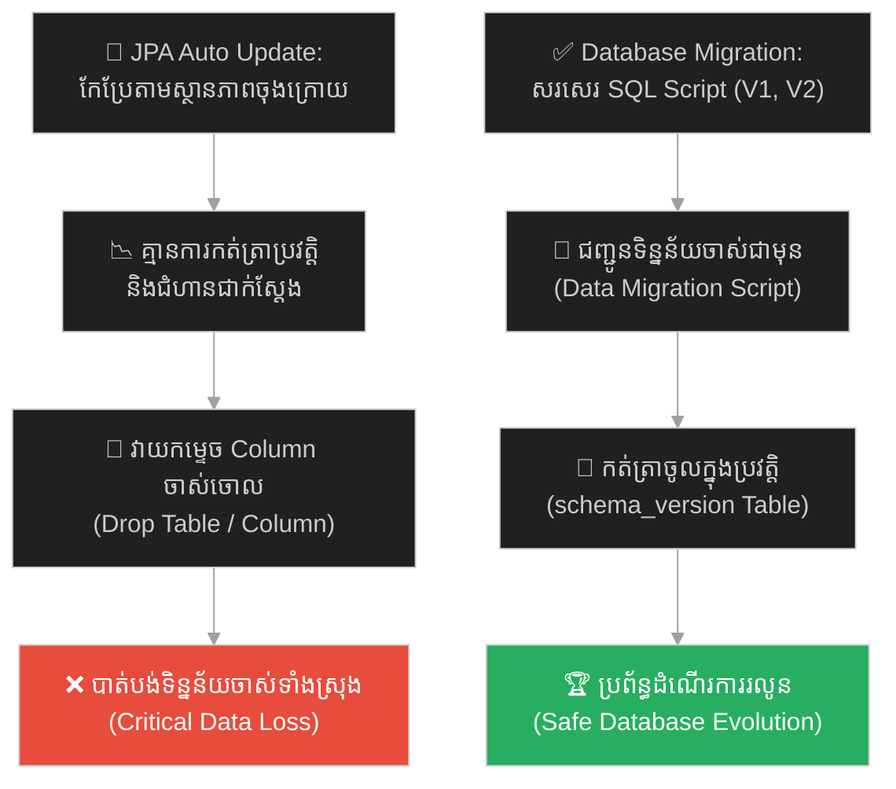
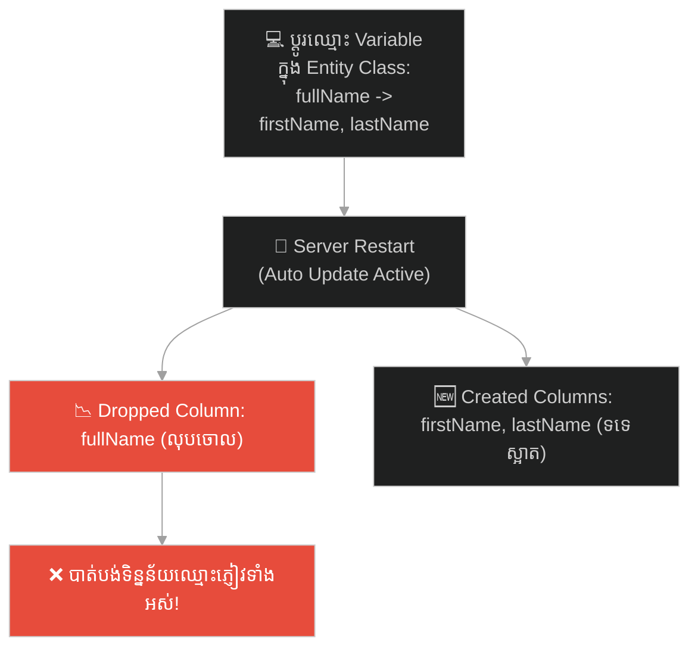
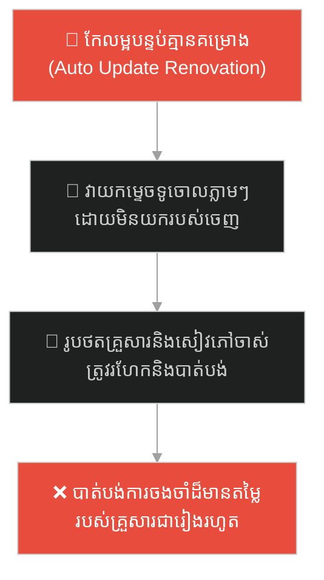
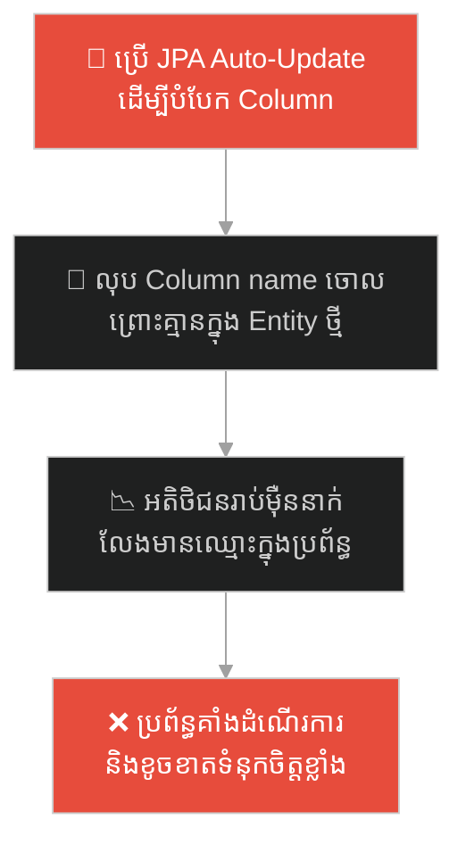
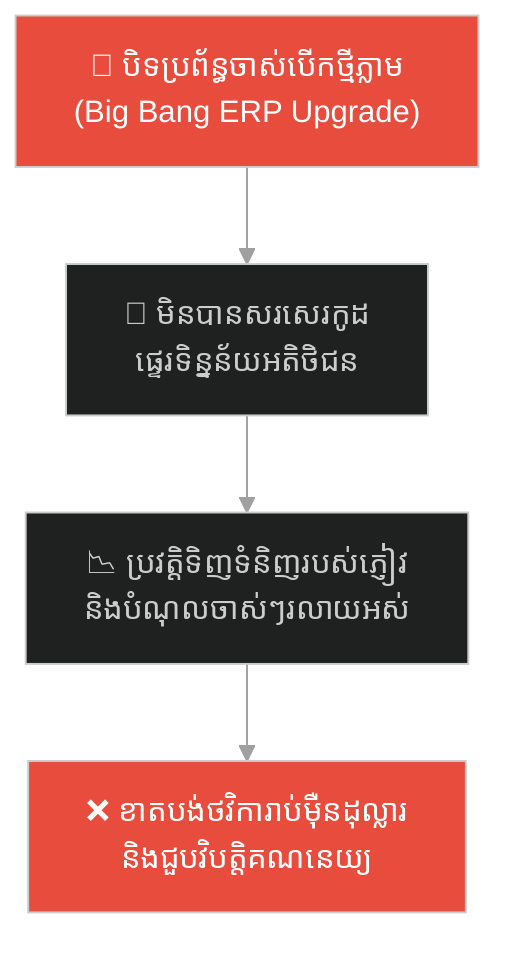
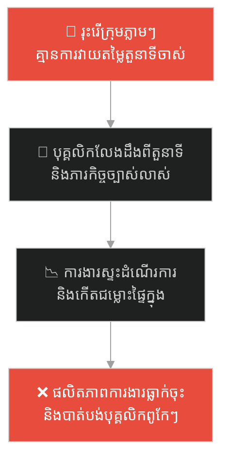
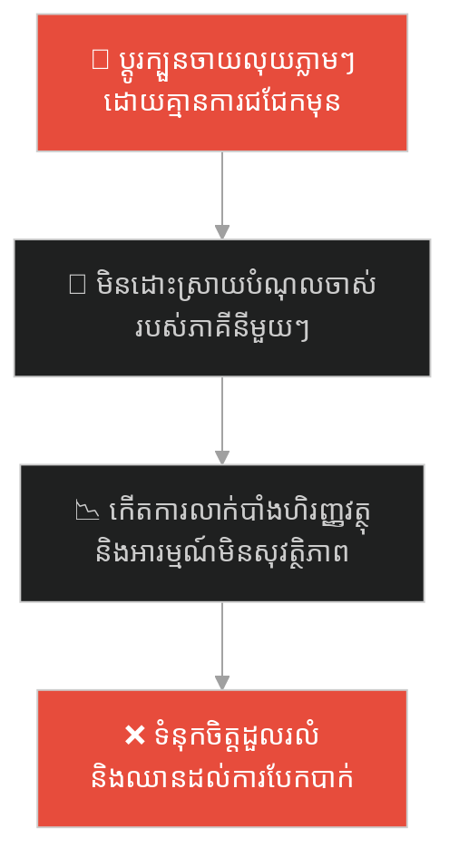
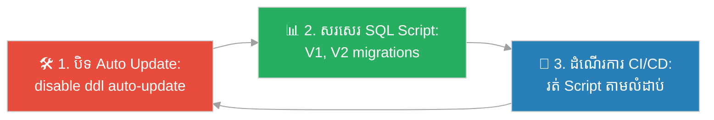

# Database Migration (ការផ្លាស់ប្តូរទិន្នន័យជាជំហាន)៖ ស្ថាបត្យករខ្វាក់ និងសៀវភៅកំណត់ហេតុ (Database Migration & The Blueprint Diary)

**Author:** ichamrong  
**Date:** 2026-05-27  
**Tags:** #database-migration #flyway #liquibase #jpa-update #database-schema #backend #parable  
**Category:** Concepts / Parables  
**Read Time:** ~15 min  

---

## 📌 មាតិកា (Table of Contents)
- [អន្ទាក់ផ្លូវចិត្ត (The Trap)](#0)
- [១. រឿងព្រេងប្រវត្តិសាស្ត្រ៖ ស្ថាបត្យករដែលគ្មានការចងចាំ (The Legend of the Stateless Architect)](#1)
  - [សៀវភៅកំណត់ហេតុរបស់មេជាង និងការផ្លាស់ទីទិន្នន័យ (The Builder's Migration Diary)](#1-1)
- [២. បញ្ហា៖ គ្រោះមហន្តរាយនៃ JPA Auto Update លើប្រព័ន្ធផលិតកម្ម (The Issue: Auto DDL Update Hazard)](#2)
- [៣. ឧទាហរណ៍ជាក់ស្តែងក្នុងពិភពពិត (Real World Examples)](#3)
  - [ឧទាហរណ៍ទី ១ — កម្រិតស្រាល (គ្រួសារ)៖ ការកែលម្អផ្ទះបោះចោលអីវ៉ាន់ចាស់ (The House Renovation Disaster)](#3-1)
  - [ឧទាហរណ៍ទី ២ — កម្រិតមធ្យម (បច្ចេកទេស)៖ ការបំបែក Column ឈ្មោះអតិថិជន (Splitting Database Columns)](#3-2)
  - [ឧទាហរណ៍ទី ៣ — កម្រិតមធ្យម (ធុរកិច្ច)៖ ការផ្លាស់ប្តូរទៅប្រើប្រព័ន្ធ ERP ថ្មី (The ERP Transition Trap)](#3-3)
  - [ឧទាហរណ៍ទី ៤ — កម្រិតមធ្យម (សង្គម/គ្រប់គ្រង)៖ ការរុះរើរចនាសម្ព័ន្ធក្រុមការងារគ្មានកំណត់ត្រា (The Structural Reorganization Chaos)](#3-4)
  - [ឧទាហរណ៍ទី ៥ — កម្រិតធ្ងន់ (ទំនាក់ទំនង)៖ ការប្តូរក្បួនច្បាប់រស់នៅភ្លាមៗ (The Sudden Relationship Rule Shift)](#3-5)
- [៤. ដំណោះស្រាយទូទៅ៖ ការប្រើប្រាស់កម្មវិធីគ្រប់គ្រងកំណែទិន្នន័យ (The General Solution: Version-Controlled Migration Schema)](#4)
- [សេចក្តីសន្និដ្ឋាន (Conclusion)](#5)
- [ឯកសារយោង (References)](#6)
- [Related Posts](#7)

---

## អន្ទាក់ផ្លូវចិត្ត (The Trap)

តើអ្នកធ្លាប់ជួបគ្រោះមហន្តរាយដែលការកែប្រែរចនាសម្ព័ន្ធការងារ ឬប្រព័ន្ធទិន្នន័យ បានលុបបំបាត់ និងបំផ្លាញរាល់សមិទ្ធផលចាស់ៗដែលខំសន្សំរាប់ឆ្នាំចោលក្នុងមួយប៉ព្រិចភ្នែកដែរឬទេ?

នៅក្នុងការអភិវឌ្ឍន៍សូហ្វវែរ និងការគ្រប់គ្រងព័ត៌មាន៖
* **យើងងាយនឹងធ្លាក់ក្នុងអន្ទាក់** នៃការប្រើប្រាស់យន្តការកែប្រែដោយស្វ័យប្រវត្តិតាមស្ថានភាពចុងក្រោយ (State-based auto-update) ដោយមិនខ្វល់ពីដំណើរការផ្លាស់ប្តូរទិន្នន័យជាក់ស្តែង។
* **យើងមើលរំលង** សារៈសំខាន់នៃការកត់ត្រាប្រវត្តិ និងជំហាននីមួយៗនៃការផ្លាស់ប្តូរ (Transition history) ដែលធានាថារាល់របស់ចាស់មិនត្រូវបានបាត់បង់។

ការបណ្តោយឱ្យប្រព័ន្ធស្វ័យប្រវត្តិកែកុនគ្រឹះទិន្នន័យដោយគ្មានកំណត់ត្រា និងការចងចាំ ហៅថា **អន្ទាក់ស្ថាបត្យករខ្វាក់ប្រវត្តិសាស្រ្ត (The Blind Auto-Update Trap)**។

ដើម្បីយល់ដឹងពីរបៀបដែលមេជាងប្រើប្រាស់កំណត់ហេតុដើម្បីការពារទ្រព្យសម្បត្តិ នេះជាផែនទីបង្ហាញផ្លូវ៖
1. **រឿងព្រេងប្រវត្តិសាស្ត្រ (The Historic Legend)** — រឿងរ៉ាវរបស់ស្ថាបត្យករខ្វាក់ និងមេជាងសរសេរកំណត់ហេតុនៃការកែលម្អផ្ទះ។
2. **បញ្ហា (The Issue)** — ហានិភ័យនៃការប្រើប្រាស់ `hibernate.hbm2ddl.auto = update` លើ Production Database។
3. **ឧទាហរណ៍ជាក់ស្តែងក្នុងពិភពពិត (Real World Examples)** — ពិនិត្យមើលអន្ទាក់នេះក្នុងកម្រិតគ្រួសារ បច្ចេកវិទ្យា ធុរកិច្ច ការគ្រប់គ្រង និងទំនាក់ទំនង។
4. **ដំណោះស្រាយទូទៅ (The General Solution)** — ការប្រើប្រាស់ឧបករណ៍គ្រប់គ្រង Database Version (Flyway/Liquibase) និងការធ្វើ Migration Pipelines។

---

## ១. រឿងព្រេងប្រវត្តិសាស្ត្រ៖ ស្ថាបត្យករដែលគ្មានការចងចាំ (The Legend of the Stateless Architect)

នៅទីក្រុងមួយ មានម្ចាស់ផ្ទះម្នាក់ចង់កែលម្អ និងពង្រីកផ្ទះរបស់គាត់ពីមួយឆ្នាំទៅមួយឆ្នាំ ដើម្បីតម្រូវតាមតម្រូវការគ្រួសារ។ គាត់បានជួល **ស្ថាបត្យករម្នាក់ (តំណាងឱ្យ JPA Auto-Update)** មកមើលថែការដ្ឋាននេះ។

ស្ថាបត្យករនេះមានទំនោរចម្លែកមួយ គឺគាត់ **មិនដែលកត់ត្រាប្រវត្តិសាស្រ្ត និងជំហាននៃការសាងសង់អ្វីទាំងអស់**។ រាល់ពេលដែលម្ចាស់ផ្ទះយកគំនូរប្លង់ផ្ទះថ្មី (Entity Model) មកបង្ហាញ ហើយប្រាប់ថា៖ *"ខ្ញុំចង់ប្តូរឈ្មោះបន្ទប់ 'ឃ្លាំងស្តុកអីវ៉ាន់' ទៅជា 'បន្ទប់គេងថ្មី'!"* ស្ថាបត្យករនេះមិនបានយកអីវ៉ាន់ចាស់ចេញពីឃ្លាំងដោយប្រុងប្រយ័ត្ននោះទេ។

គាត់គ្រាន់តែយកញញួរធំទៅវាយកម្ទេចជញ្ជាំង និងរចនាសម្ព័ន្ធឃ្លាំងចាស់ចោលភ្លាមៗ (Drop Column) រួចសាងសង់បន្ទប់គេងថ្មីមួយដែលទទេស្អាត (Create Column) នៅលើទីតាំងចាស់នោះ ពីព្រោះវាលឿន និងស្របតាមគំនូរប្លង់ថ្មី។ ម្ចាស់ផ្ទះខឹងយ៉ាងខ្លាំង ព្រោះអីវ៉ាន់មានតម្លៃរាប់ម៉ឺនដុល្លារដែលធ្លាប់ស្តុកទុកក្នុងឃ្លាំង ត្រូវកម្ទេចចោល និងបាត់បង់ទាំងស្រុង (Data Loss)។ ជាងនេះទៅទៀត បើមានជាងផ្សេងមកធ្វើការបន្ត គ្មានអ្នកណាដឹងទេថារចនាសម្ព័ន្ធផ្ទះត្រូវបានកែប្រែប៉ុន្មានដង និងមានប្រវត្តិបែបណានោះទេ។

---

### សៀវភៅកំណត់ហេតុរបស់មេជាង និងការផ្លាស់ទីទិន្នន័យ (The Builder's Migration Diary)

ដោយទ្រាំមិនបាននឹងការខូចខាត ម្ចាស់ផ្ទះក៏បានបញ្ឈប់ស្ថាបត្យករនោះចោល ហើយជួល **មេជាងម្នាក់ទៀត (តំណាងឱ្យ Flyway ឬ Liquibase)** ដែលមានទម្លាប់កាន់សៀវភៅកំណត់ហេតុការងារជាប់ខ្លួនជានិច្ច។

រាល់ពេលដែលម្ចាស់ផ្ទះចង់កែប្រែផ្ទះ មេជាងនេះមិនមែនចេះតែវាយកម្ទេចភ្លាមៗនោះទេ គាត់តម្រូវឱ្យមានការសរសេរបញ្ជាការងារជាជំហានៗយ៉ាងច្បាស់លាស់ (Migration Scripts ដូចជា `V1`, `V2`, `V3`):
1. **ជំហានទី ១ (V1_Add_New_Bedroom_Structure)៖** សាងសង់គ្រោងជញ្ជាំងសម្រាប់បន្ទប់គេងថ្មី។
2. **ជំហានទី ២ (V2_Migrate_Storage_Items_To_New_Room)៖** ជញ្ជូនរបស់របរទាំងអស់ចេញពីឃ្លាំងចាស់ យកទៅរៀបចំទុកដាក់ក្នុងបន្ទប់ថ្មីដោយសុវត្ថិភាពបំផុត (Data Migration)។
3. **ជំហានទី ៣ (V3_Remove_Old_Storage_Structure)៖** វាយកម្ទេចជញ្ជាំងឃ្លាំងចាស់ចោលដោយសុវត្ថិភាព។

ក្រោយពេលធ្វើរួចរាល់ មេជាងបានកត់ត្រាចូលក្នុងសៀវភៅប្រវត្តិការងារថា គាត់បានបញ្ចប់ការងារដល់ **ជំហានទី ៣** ហើយ។ ថ្ងៃក្រោយ ទោះបីជាមានមេជាងផ្សេងមកពីតំបន់ផ្សេងមកធ្វើការងារបន្ត ក៏ពួកគេគ្រាន់តែបើកសៀវភៅនោះមើល ពួកគេនឹងដឹងច្បាស់ថា ផ្ទះនេះធ្វើដល់ណា ហើយត្រូវបន្តធ្វើការងារ **ជំហានទី ៤** ដោយគ្មានភាពច្របូកច្របល់ និងគ្មានការខូចខាតឡើយ។

---

## ២. បញ្ហា៖ គ្រោះមហន្តរាយនៃ JPA Auto Update លើប្រព័ន្ធផលិតកម្ម (The Issue: Auto DDL Update Hazard)

នៅក្នុងការអភិវឌ្ឍន៍កម្មវិធីសម័យទំនើប ការប្រើប្រាស់ `hibernate.hbm2ddl.auto = update` លើ Production Database គឺជាកំហុសបច្ចេកទេសដ៏គ្រោះថ្នាក់បំផុត៖

* **កង្វះសមត្ថភាពផ្ទេរទិន្នន័យ (No Data Migration Capability)៖** កម្មវិធី ORM (JPA/Hibernate) គ្រាន់តែធ្វើការប្រៀបធៀបគំរូកូដ Entity ជាមួយ Database Schema បច្ចុប្បន្ន។ ប្រសិនបើវាឃើញឈ្មោះ Column ខុសគ្នា វានឹងលុប Column ចាស់ចោល រួចបង្កើត Column ថ្មី។ វាគ្មានលទ្ធភាពយល់ដឹងថាត្រូវផ្ទេរទិន្នន័យចាស់មក Column ថ្មីដោយរបៀបណានោះទេ។
* **កង្វះកំណត់ត្រាប្រវត្តិ (No Version Control for Database)៖** គ្មាននរណាម្នាក់ដឹងថា Database ត្រូវបានផ្លាស់ប្តូរនៅពេលណា និងដោយសារអ្វីឡើយ ដែលធ្វើឱ្យពិបាកខ្លាំងក្នុងការស្វែងរកមូលហេតុនៅពេលមានបញ្ហា។

---

## ៣. ឧទាហរណ៍ជាក់ស្តែងក្នុងពិភពពិត

---

### ឧទាហរណ៍ទី ១ — កម្រិតស្រាល (គ្រួសារ)៖ ការកែលម្អផ្ទះបោះចោលអីវ៉ាន់ចាស់ (The House Renovation Disaster)

គ្រួសារមួយចង់កែប្រែរៀបចំបន្ទប់ទទួលភ្ញៀវឡើងវិញ។ ស្វាមីបានជួលជាងម្នាក់មកជួយធ្វើភ្លាមៗដោយគ្មានការរៀបចំទុកដាក់។ ជាងនោះបានមកដល់ វាយជញ្ជាំង និងបោះចោលរាល់ទូដាក់សៀវភៅ និងអាល់ប៊ុមរូបថតចាស់ៗចោលទៅក្នុងធុងសម្រាម ដើម្បីឱ្យបន្ទប់ថ្មីមើលទៅធំទូលាយស្របតាមប្លង់ដែលស្វាមីចង់បាន។

ការកែលម្អដោយមិនផ្ទេរទ្រព្យសម្បត្តិមុន ធ្វើឱ្យបាត់បង់ការចងចាំដ៏មានតម្លៃរបស់គ្រួសារ។

---

### ឧទាហរណ៍ទី ២ — កម្រិតមធ្យម (បច្ចេកទេស)៖ ការបំបែក Column ឈ្មោះអតិថិជន (Splitting Database Columns)

នៅក្នុងប្រព័ន្ធគ្រប់គ្រងអតិថិជន ក្រុមហ៊ុនចង់បំបែក Column `name` ទៅជា `first_name` និង `last_name`។ ប្រសិនបើប្រើប្រាស់ JPA Auto-Update វានឹងវាយលុប Column `name` ភ្លាមៗ (បាត់បង់ឈ្មោះអតិថិជនទាំងអស់) ហើយបង្កើត `first_name` និង `last_name` ដែលទទេស្អាត។

---

### ឧទាហរណ៍ទី ៣ — កម្រិតមធ្យម (ធុរកិច្ច)៖ ការផ្លាស់ប្តូរទៅប្រើប្រព័ន្ធ ERP ថ្មី (The ERP Transition Trap)

ក្រុមហ៊ុនលក់ទំនិញមួយ បានសម្រេចចិត្តផ្លាស់ប្តូរប្រព័ន្ធគ្រប់គ្រងទិន្នន័យ (ERP) ពីប្រព័ន្ធចាស់ទៅប្រព័ន្ធថ្មី។ ពួកគេមិនបានរៀបចំគម្រោងលម្អិត និងទាញយកទិន្នន័យអតិថិជនចាស់ៗតាមដំណាក់កាលឡើយ ដោយគ្រាន់តែបិទប្រព័ន្ធចាស់ រួចបើកដំណើរការប្រព័ន្ធថ្មីភ្លាមៗ ព្រោះជឿថាប្រព័ន្ធថ្មី "ល្អជាងនិងទំនើបជាង"។

---

### ឧទាហរណ៍ទី ៤ — កម្រិតមធ្យម (សង្គម/គ្រប់គ្រង)៖ ការរុះរើរចនាសម្ព័ន្ធក្រុមការងារគ្មានកំណត់ត្រា (The Structural Reorganization Chaos)

នាយកប្រតិបត្តិថ្មីបានមកដល់ក្រុមហ៊ុន និងរៀបចំរចនាសម្ព័ន្ធគ្រប់គ្រងថ្មីភ្លាមៗ ដោយលុបចោលផ្នែកចាស់ៗ និងបង្កើតផ្នែកការងារថ្មីៗ គ្មានការវាយតម្លៃពីតួនាទី និងប្រវត្តិនៃការងាររបស់បុគ្គលិកម្នាក់ៗពីមុនឡើយ។ បុគ្គលិកលែងដឹងថាខ្លួនត្រូវធ្វើអ្វីខ្លះ និងត្រូវរាយការណ៍ជូនអ្នកណា។

---

### ឧទាហរណ៍ទី ៥ — កម្រិតធ្ងន់ (ទំនាក់ទំនង)៖ ការប្តូរក្បួនច្បាប់រស់នៅភ្លាមៗ (The Sudden Relationship Rule Shift)

គូស្វាមីភរិយាថ្មីថ្មោង បានសម្រេចចិត្តផ្លាស់ប្តូរក្បួនច្បាប់ចាត់ចែងហិរញ្ញវត្ថុក្នុងផ្ទះទាំងស្រុងភ្លាមៗ (ដូចជាការបង្រួបបង្រួមគណនីធនាគារ ឬការឈប់ទិញរបស់របរផ្ទាល់ខ្លួន) ដោយមិនបានជជែកពិភាក្សាអំពីបំណុលផ្ទាល់ខ្លួនពីមុន និងទម្លាប់ចាយវាយចាស់ៗឡើយ។ នេះបង្កើតជាការភ័ន្តច្រឡំ និងការមិនទុកចិត្តគ្នាយ៉ាងខ្លាំង។

---

## ៤. ដំណោះស្រាយទូទៅ៖ ការប្រើប្រាស់កម្មវិធីគ្រប់គ្រងកំណែទិន្នន័យ (The General Solution: Version-Controlled Migration Schema)

ដើម្បីចៀសវាងមហន្តរាយនៃការបាត់បង់ទិន្នន័យ យើងត្រូវអនុវត្តយន្តការគ្រប់គ្រង Database តាមបែប **Version Control (ដូចជា Flyway ឬ Liquibase)**៖

ជំហាននៃការអនុវត្ត៖
1. **បិទយន្តការ Auto-Update លើ Production ដាច់ខាត៖** កំណត់ `hibernate.hbm2ddl.auto = validate` կամ `none` នៅក្នុងបរិស្ថាន Production ដើម្បីការពារកុំឱ្យ JPA ធ្វើការផ្លាស់ប្តូរ DDL ដោយស្វ័យប្រវត្តិ។
2. **សរសេរ SQL Migrations ជាជំហានច្បាស់លាស់ (Transition-based Migrations)៖** សម្រាប់រាល់ការផ្លាស់ប្តូរ Schema ត្រូវតែសរសេរ SQL Script (ឧទាហរណ៍ `V1__init_schema.sql`, `V2__split_name.sql`)។ នៅក្នុង Script ត្រូវសរសេរ៖
   * បង្កើត Column ថ្មី។
   * សរសេរកូដ SQL ដើម្បីផ្ទេរទិន្នន័យពី Column ចាស់ទៅ Column ថ្មី (Data Migration)។
   * លុប Column ចាស់ចោល។
3. **អនុវត្តការសាកល្បងលើ Staging (Test Migrations)៖** ដំណើរការរត់ Migration Scripts ជាមួយទិន្នន័យសាកល្បងដែលមានទំហំ និងរចនាសម្ព័ន្ធដូច Production ដើម្បីធានាថាកូដដំណើរការត្រឹមត្រូវ និងមិនបាត់បង់ទិន្នន័យ។

---

## 🐇 ធ្លាក់ចូលក្នុងរន្ធទន្សាយ (Enter the Rabbit Hole)

ដើម្បីស្វែងយល់ពីរបៀបដែលទីក្រុងដ៏មានបានមួយ បានសាងសង់ទូដែកតែមួយគត់ដើម្បីរក្សាមាសទាំងអស់ ហើយនៅពេលដែលសោរបានបាក់ ទីក្រុងទាំងមូលត្រូវជាប់គាំងសេដ្ឋកិច្ច (Single Point of Failure and High Availability) សូមបន្តដំណើរទៅកាន់៖

* 🚀 **[ចាប់ផ្តើមដំណើររុករក (Start the Journey) ➔ Single Point of Failure and Redundancy](./75-the-banks-only-vault.md)**

---

## សេចក្តីសន្និដ្ឋាន (Conclusion)

> **«ការអភិវឌ្ឍន៍ដែលគ្មានប្រវត្តិសាស្រ្ត គឺជាការបោះជំហានទៅរកការបំផ្លាញទិន្នន័យ។»**

ចូរធ្វើខ្លួនជាមេជាងដែលមានការប្រុងប្រយ័ត្នខ្ពស់ កត់ត្រារាល់ការផ្លាស់ប្តូរ និងរៀបចំផែនការផ្ទេរទ្រព្យសម្បត្តិ ឬទិន្នន័យឱ្យបានច្បាស់លាស់ជាជំហានៗ។ កុំធ្វើខ្លួនជាស្ថាបត្យករខ្វាក់ប្រវត្តិសាស្រ្ត ដែលកែប្រែអ្វីៗតាមប្លង់ចុងក្រោយដោយគ្មានការចងចាំ រហូតធ្វើឱ្យខូចខាតទ្រព្យសម្បត្តិ និងទិន្នន័យទាំងអស់ដែលធ្លាប់បានកសាងឡើង។

---

## ឯកសារយោង (References)

* **Flyway Team** — *Database Migrations Made Easy Guidelines* (2018). Boxfuse.
* **Martin Fowler** — *Evolutionary Database Design* (2016). MartinFowler.com. (ការណែនាំពីរបៀបផ្លាស់ប្តូរ Database តាមបែប Agile)។
* **Vlad Mihalcea** — *High-Performance Java Persistence* (2017). ឯកសារណែនាំពីហានិភ័យនៃការប្រើប្រាស់ hbm2ddl auto update។

---

## Related Posts

* **[74 Database Version Control: Flyway vs. Auto-update](../articles/74-database-migrations.md)** — អត្ថបទបកស្រាយលម្អិតអំពីយុទ្ធសាស្ត្រប្រើប្រាស់ Flyway ក្នុងការគ្រប់គ្រង Database Version សម្រាប់ប្រព័ន្ធធំៗ។
* **[22 The Royal Physician and the Undocumented Antidote](./22-the-royal-physician-and-the-undocumented-antidote.md)** — កង្វះឯកសារណែនាំ និងការរក្សាទុកចំណេះដឹងតែម្នាក់ឯង។
* **[24 The Two Architects and the Scroll of Creation](./24-the-two-architects-and-the-scroll-of-creation.md)** — ការកសាងហេដ្ឋារចនាសម្ព័ន្ធដោយគ្មានកូដកំណត់ត្រា។

---

## Related

- [💡 Concepts README](../README.md)
- [📚 Main Repository README](../../../README.md)
- [Developer Habits](../../developer-habits/README.md)
- [Mental Health & Well-being](../../mental-health/README.md)
- [Management & SDLC](../../management/README.md)
