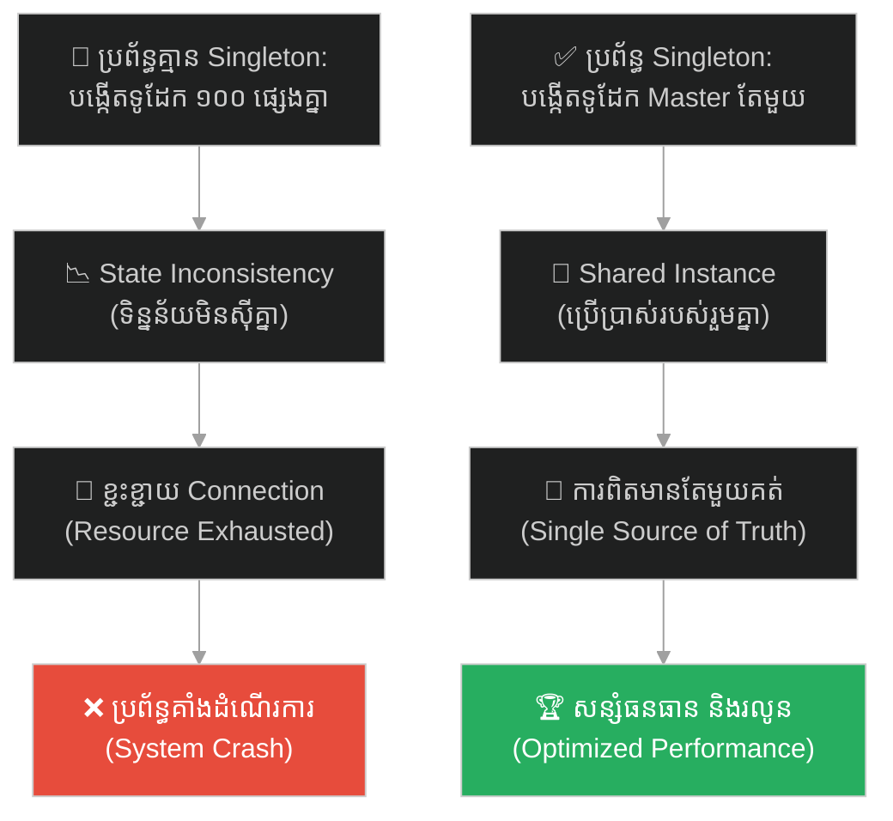
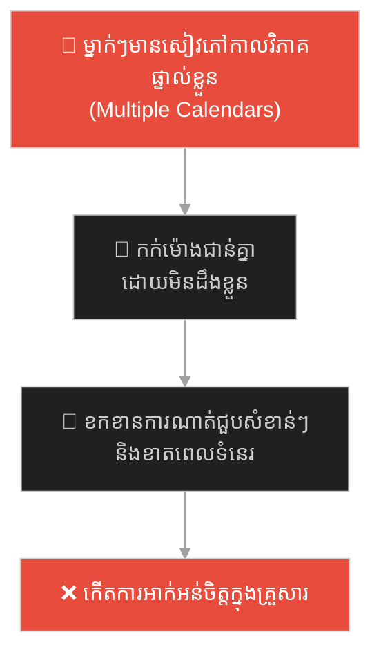
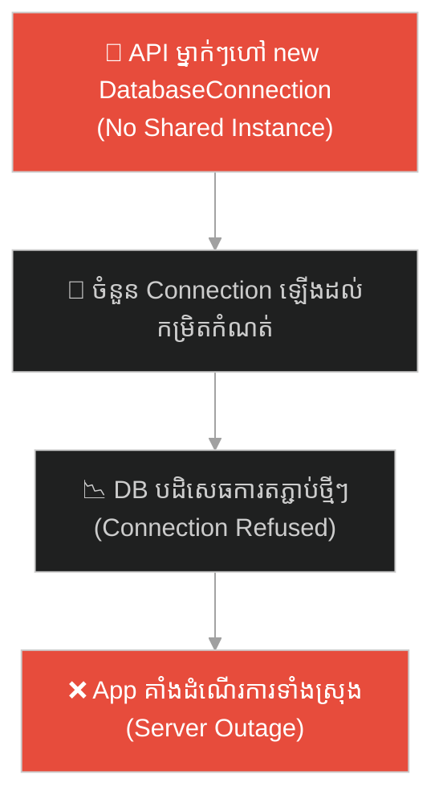
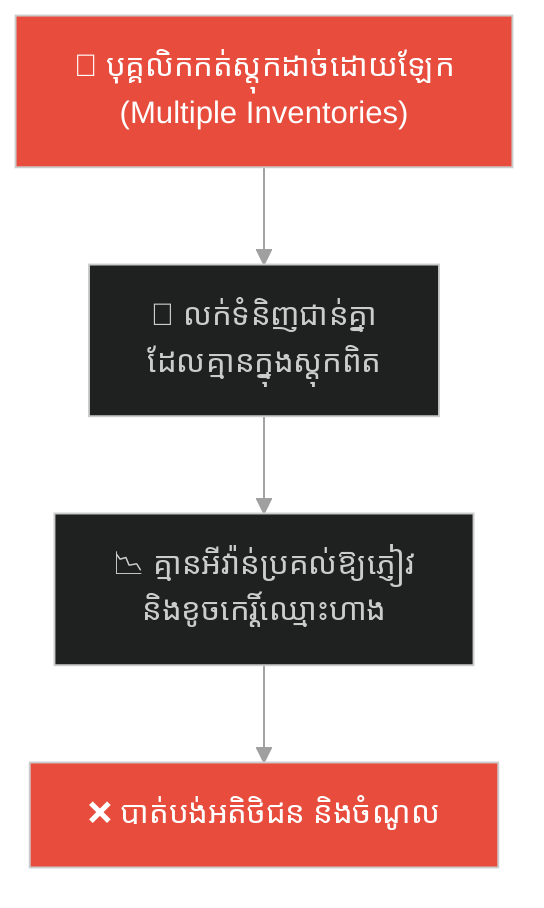
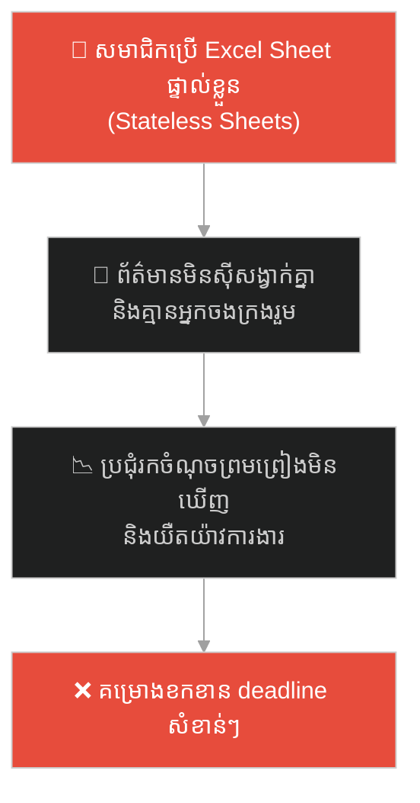
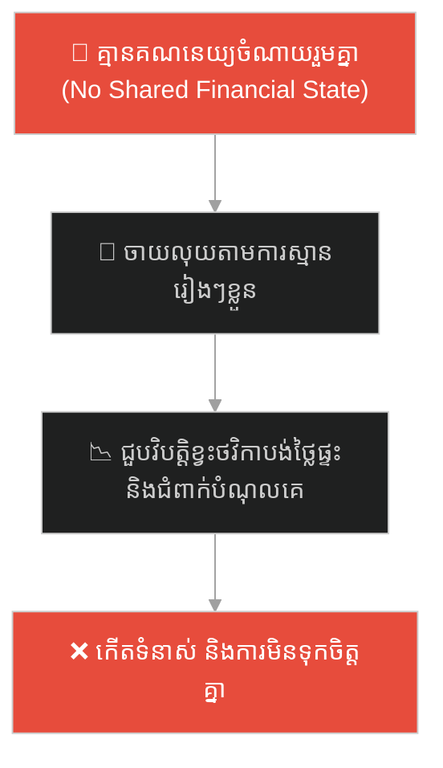
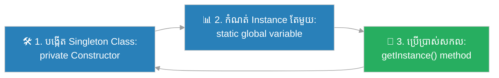

# Singleton Design Pattern (លំនាំរចនាវត្ថុតែមួយ)៖ ទូដែកកណ្តាលរបស់ធនាគារ (Singleton Pattern & The Master Vault)

**Author:** ichamrong  
**Date:** 2026-05-27  
**Tags:** #design-patterns #singleton #architecture #software-engineering #database-pool #shared-resource #parable  
**Category:** Concepts / Parables  
**Read Time:** ~15 min  

---

## 📌 មាតិកា (Table of Contents)
- [អន្ទាក់ផ្លូវចិត្ត (The Trap)](#0)
- [១. រឿងព្រេងប្រវត្តិសាស្ត្រ៖ ធនាគារដែលមានទូដែក ១០០ (The Legend of the Chaotic Bank)](#1)
  - [ដំណោះស្រាយទូដែកកណ្តាលតែមួយគត់ (The Master Vault Solution)](#1-1)
- [២. បញ្ហា៖ ភាពមិនស៊ីគ្នានៃទិន្នន័យ និងការខ្ជះខ្ជាយធនធាន (The Issue: Multiple Instances & Resource Exhaustion)](#2)
- [៣. ឧទាហរណ៍ជាក់ស្តែងក្នុងពិភពពិត (Real World Examples)](#3)
  - [ឧទាហរណ៍ទី ១ — កម្រិតស្រាល (គ្រួសារ)៖ កាលវិភាគគ្រួសារបែកខ្ញែក (The Fragmented Family Calendar)](#3-1)
  - [ឧទាហរណ៍ទី ២ — កម្រិតមធ្យម (បច្ចេកទេស)៖ ការបង្កើត Connection ទៅ Database ច្រើនហួសប្រមាណ (The Database Connection Pool Leak)](#3-2)
  - [ឧទាហរណ៍ទី ៣ — កម្រិតមធ្យម (ធុរកិច្ច)៖ បញ្ជីស្តុកទំនិញផ្ទាល់ខ្លួនរបស់បុគ្គលិកលក់ (The Multi-Ledger Inventory Chaos)](#3-3)
  - [ឧទាហរណ៍ទី ៤ — កម្រិតមធ្យម (សង្គម/គ្រប់គ្រង)៖ របាយការណ៍ការងារបែកខ្ញែកគ្នា (The Dispersed Project Status Spreadsheet)](#3-4)
  - [ឧទាហរណ៍ទី ៥ — កម្រិតធ្ងន់ (ទំនាក់ទំនង)៖ ការរំពឹងទុកលើការគ្រប់គ្រងហិរញ្ញវត្ថុផ្ទុយគ្នា (The Unsynced Couple Budget)](#3-5)
- [៤. ដំណោះស្រាយទូទៅ៖ ការអនុវត្ត Singleton Pattern និងការប្រើប្រាស់ Dependency Injection (The General Solution: Safe Singleton Design Pattern)](#4)
- [សេចក្តីសន្និដ្ឋាន (Conclusion)](#5)
- [ឯកសារយោង (References)](#6)
- [Related Posts](#7)

---

## អន្ទាក់ផ្លូវចិត្ត (The Trap)

តើអ្នកធ្លាប់ជួបភាពច្របូកច្របល់ក្នុងក្រុមការងារ ឬកម្មវិធីកុំព្យូទ័រ ដែលមនុស្សម្នាក់ៗ ឬផ្នែកនីមួយៗ កាន់កាប់ទិន្នន័យដាច់ដោយឡែកពីគ្នា រហូតធ្វើឱ្យស្ថានភាពការងារមិនស៊ីគ្នា និងខ្ជះខ្ជាយធនធានដែរឬទេ?

នៅក្នុងរចនាសម្ព័ន្ធព័ត៌មាន និងការសរសេរកូដ៖
* **យើងងាយនឹងធ្លាក់ក្នុងអន្ទាក់** នៃការបង្កើត Object ឬធនធានថ្មីរាល់ពេលដែលយើងត្រូវការប្រើប្រាស់ (Multiple Instances) ដែលនាំឱ្យប្រព័ន្ធទិន្នន័យលែងមាន "ការពិតតែមួយ"។
* **យើងមើលរំលង** ការគ្រប់គ្រងធនធានរួម (Shared Resources) ដូចជា ការតភ្ជាប់ប្រព័ន្ធទិន្នន័យ (Database Connections) ឬឯកសារកំណត់រចនាសម្ព័ន្ធ (Configurations) ដែលគួរតែត្រូវបានគ្រប់គ្រងដោយចំណុចស្នូលតែមួយ។

ការបណ្តោយឱ្យមានប្រភពព័ត៌មានច្រើន និងការខ្ជះខ្ជាយធនធានប្រព័ន្ធ ហៅថា **អន្ទាក់បែកបាក់ការពិត (Multiple Instances Trap)**។

ដើម្បីយល់ដឹងពីរបៀបដែលធនាគារដោះស្រាយវិបត្តិទូដែកផ្ទាល់ខ្លួន នេះជាផែនទីបង្ហាញផ្លូវ៖
1. **រឿងព្រេងប្រវត្តិសាស្ត្រ (The Historic Legend)** — រឿងរ៉ាវរបស់ធនាគារដែលបង្កើតទូដែកផ្ទាល់ខ្លួនឱ្យបុគ្គលិកម្នាក់ៗ និងភាពវឹកវរនៃសមតុល្យប្រាក់។
2. **បញ្ហា (The Issue)** — ការវិភាគបញ្ហា State Inconsistency និងការប្រើប្រាស់ Singleton Design Pattern។
3. **ឧទាហរណ៍ជាក់ស្តែងក្នុងពិភពពិត (Real World Examples)** — ពិនិត្យមើលអន្ទាក់នេះក្នុងកម្រិតគ្រួសារ បច្ចេកវិទ្យា ធុរកិច្ច ការគ្រប់គ្រង និងទំនាក់ទំនង។
4. **ដំណោះស្រាយទូទៅ (The General Solution)** — ការអនុវត្ត Singleton Pattern (Thread-safety, Private Constructor) និងការប្រើប្រាស់ IOC Container។

---

## ១. រឿងព្រេងប្រវត្តិសាស្ត្រ៖ ធនាគារដែលមានទូដែក ១០០ (The Legend of the Chaotic Bank)

កាលពីដើមឡើយ មានធនាគារថ្មីមួយទើបនឹងបើកដំណើរការនៅក្នុងក្រុង។ អ្នកគ្រប់គ្រងធនាគារនេះចង់ឱ្យបុគ្គលិករបស់គាត់បំពេញការងារបានលឿនបំផុត និងមិនបាច់ដើរចុះដើរឡើង។ ដូច្នេះ គាត់ក៏សម្រេចចិត្តសាងសង់ **ទូដែកផ្ទាល់ខ្លួន (Personal Vault)** ឱ្យបុគ្គលិកគិតលុយ (Teller) ម្នាក់ៗនៅពីក្រោយតុការងាររៀងៗខ្លួន។ ធនាគារនេះមានបុគ្គលិកចំនួន ១០០ នាក់ ដូច្នេះមានទូដែកចំនួន ១០០ ត្រូវបានសាងសង់។

នៅថ្ងៃដំបូងនៃការបើកដំណើរការ បញ្ហាដ៏ធំពីរបានកើតឡើង៖

1. **បញ្ហាទិន្នន័យមិនស៊ីគ្នា (State Inconsistency):** អតិថិជនម្នាក់បានយកលុយ ១,០០០ ដុល្លារទៅផ្ញើនៅតុរបស់ **Teller ទី ១**។ លុយនោះត្រូវបានដាក់ចូលទូដែកទី ១ យ៉ាងត្រឹមត្រូវ។ ពីរម៉ោងក្រោយមក អតិថិជនដដែលបានទៅតុ **Teller ទី ២** ដើម្បីសុំដកលុយ ៥០០ ដុល្លារ។ ប៉ុន្តែនៅពេលដែល Teller ទី ២ បើកទូដែករបស់ខ្លួនមើល ស្រាប់តែប្រាប់អតិថិជនថា៖ *"សុំទោសលោក គណនីរបស់លោកគ្មានលុយសូម្បីតែមួយដុល្លារទេ!"* (ព្រោះទូដែកទី ២ ទទេស្អាត គ្មានទំនាក់ទំនងជាមួយទូដែកទី ១ ឡើយ)។
2. **ការខ្ជះខ្ជាយធនធាន (Resource Exhaustion):** ការសាងសង់ទូដែកដែកថែបខ្នាតធំចំនួន ១០០ បានស៊ីផ្ទៃក្រឡាស្ទើរតែពេញធនាគារ ហើយចំណាយថវិកាសាងសង់យ៉ាងច្រើនមហាសាលដោយមិនចាំបាច់។

ធនាគារជួបភាពវឹកវរទាំងស្រុង ព្រោះគ្មាននរណាម្នាក់ដឹងថា តើទូដែកមួយណាដែលកត់ត្រាសមតុល្យប្រាក់ពិតប្រាកដរបស់អតិថិជនឡើយ។

---

### ដំណោះស្រាយទូដែកកណ្តាលតែមួយគត់ (The Master Vault Solution)

អ្នកគ្រប់គ្រងដឹងកំហុស ក៏បានសម្រេចចិត្តរៀបចំប្រព័ន្ធថ្មីទាំងស្រុង។ គាត់បានបញ្ជាឱ្យជាងវាយកម្ទេចទូដែកតូចៗទាំង ១០០ ចោល រួចសាងសង់ **ទូដែកកណ្តាលដ៏ធំតែមួយគត់ (The Master Vault)** នៅបន្ទប់ក្រោមដីនៃធនាគារ។

ពេលនេះ ទោះបីជាអតិថិជនទៅដាក់ប្រាក់នៅ Teller ទី ១ ក៏ដោយ លុយនោះនឹងត្រូវបញ្ជូនទៅកាន់ Master Vault កណ្តាល។ ពេលគាត់ទៅដកប្រាក់នៅ Teller ទី ២ នោះ Teller ទី ២ ក៏ត្រូវទាញយកលុយ និងធ្វើបច្ចុប្បន្នភាពសមតុល្យប្រាក់ពី Master Vault ដដែលនោះ។

ពេលនេះ ការពិតមានតែមួយគត់ (Single Source of Truth)។ ធនាគារដំណើរការយ៉ាងលឿន សុវត្ថិភាពខ្ពស់ ហើយធនធានក៏ត្រូវបានសន្សំសំចៃយ៉ាងច្រើនបំផុត។

---

## ២. បញ្ហា៖ ភាពមិនស៊ីគ្នានៃទិន្នន័យ និងការខ្ជះខ្ជាយធនធាន (The Issue: Multiple Instances & Resource Exhaustion)

នៅក្នុងវិស្វកម្មផ្នែកទន់ (Software Engineering) រឿងនេះគឺជាការតំណាងឱ្យ **Singleton Design Pattern**៖

> **Singleton មិនមែនជារឿងនៃភាពខ្ជិលច្រអូសនោះទេ — វាគឺជារឿងនៃការពិត។ ក្នុងប្រព័ន្ធមួយ ការពិតគួរតែមានតែមួយគត់។**

ប្រសិនបើនៅក្នុងកូដកម្មវិធីរបស់អ្នក គ្រប់ថ្នាក់សេវាកម្ម (Services) សុទ្ធតែហៅ `new DatabaseConnectionPool()` រៀងៗខ្លួន (សាងសង់ទូដែកផ្ទាល់ខ្លួន) នោះប្រព័ន្ធនឹងបង្កើតការតភ្ជាប់ទៅកាន់ Database រាប់រយដង ដែលនាំឱ្យ៖
* **Database Connection Limit Exceeded៖** Database នឹងគាំងដំណើរការភ្លាមៗ ព្រោះបាត់បង់ធនធានតភ្ជាប់ (Resource Exhaustion)។
* **Config Collision៖** ឯកសារកំណត់រចនាសម្ព័ន្ធ (Configurations) ត្រូវបានអាន និងផ្ទុកឡើងវិញរាប់ពាន់ដង នាំឱ្យល្បឿនដំណើរការធ្លាក់ចុះ។

**Singleton Pattern** ដោះស្រាយបញ្ហានេះដោយធានាថា Class មួយអាចត្រូវបានបង្កើតជា Object ត្រឹមតែ **មួយដងគត់ (Only One Instance)** នៅក្នុង Memory នៃប្រព័ន្ធទាំងមូល និងផ្តល់នូវចំណុចចូលប្រើប្រាស់សកល (Global Access Point)។

---

## ៣. ឧទាហរណ៍ជាក់ស្តែងក្នុងពិភពពិត

---

### ឧទាហរណ៍ទី ១ — កម្រិតស្រាល (គ្រួសារ)៖ កាលវិភាគគ្រួសារបែកខ្ញែក (The Fragmented Family Calendar)

សមាជិកគ្រួសារម្នាក់ៗមានសៀវភៅកាលវិភាគផ្ទាល់ខ្លួន (Multiple Instances)។ ឪពុកគ្រោងនាំកូនទៅលេងសួនច្បារនៅថ្ងៃសៅរ៍ ម្តាយកក់សំបុត្រទៅជួបពេទ្យធ្មេញនៅថ្ងៃសៅរ៍ដដែល ហើយកូនស្រីណាត់មិត្តភក្តិមកលេងផ្ទះ។ ដោយសារតែកាលវិភាគមិនស៊ីគ្នា ពួកគេបានខកខានការណាត់ជួប និងឈ្លោះប្រកែកគ្នា។

ដំណោះស្រាយគឺការប្រើប្រាស់កាលវិភាគឌីជីថលរួមគ្នា (ដូចជា Google Calendar តែមួយគត់ដែលជា Singleton) ដែលសមាជិកគ្រប់រូបប្រើប្រាស់ និងមើលឃើញទិន្នន័យដូចគ្នាក្នុងពេលតែមួយ។

---

### ឧទាហរណ៍ទី ២ — កម្រិតមធ្យម (បច្ចេកទេស)៖ ការបង្កើត Connection ទៅ Database ច្រើនហួសប្រមាណ (The Database Connection Pool Leak)

នៅក្នុងកម្មវិធី Backend ប្រសិនបើ API Controller នីមួយៗបង្កើត Database Connection ថ្មីរាល់ពេលទទួលបាន Request ជំនួសឱ្យការប្រើប្រាស់ Shared Connection Pool តែមួយ នោះនៅពេលមានអតិថិជនចូលមើល ១,០០០ នាក់ក្នុងពេលតែមួយ Server នឹងអស់ Connections ហើយដួលរលំភ្លាមៗ។

---

### ឧទាហរណ៍ទី ៣ — កម្រិតមធ្យម (ធុរកិច្ច)៖ បញ្ជីស្តុកទំនិញផ្ទាល់ខ្លួនរបស់បុគ្គលិកលក់ (The Multi-Ledger Inventory Chaos)

នៅក្នុងហាងលក់គ្រឿងអេឡិចត្រូនិកមួយ បុគ្គលិកលក់ម្នាក់ៗកត់ត្រាបញ្ជីទំនិញនៅក្នុងដៃរបស់ខ្លួនដោយឡែកពីគ្នា (Multiple Ledgers)។ បុគ្គលិកលក់ A ប្រាប់អតិថិជនថាកុំព្យូទ័រស្មាតហ្វូននៅសល់ ២ គ្រឿង ហើយព្រមលក់ឱ្យ។ ក្នុងពេលជាមួយគ្នា បុគ្គលិក B ក៏មើលសៀវភៅរបស់ខ្លួន ឃើញសល់ ២ គ្រឿង ក៏លក់ឱ្យអតិថិជនម្នាក់ទៀត។ ចុងក្រោយ ហាងគ្មានទំនិញគ្រប់គ្រាន់សម្រាប់ប្រគល់ឱ្យភ្ញៀវឡើយ។

---

### ឧទាហរណ៍ទី ៤ — កម្រិតមធ្យម (សង្គម/គ្រប់គ្រង)៖ របាយការណ៍ការងារបែកខ្ញែកគ្នា (The Dispersed Project Status Spreadsheet)

នៅក្នុងការគ្រប់គ្រងគម្រោង សមាជិកក្រុមនីមួយៗបង្កើត Excel Sheet ផ្ទាល់ខ្លួនដើម្បីតាមដានវឌ្ឍនភាពការងារ។ នៅពេលប្រជុំប្រចាំខែ របាយការណ៍របស់ម្នាក់ៗបង្ហាញទិន្នន័យខុសៗគ្នា នាំឱ្យប្រធានគ្រប់គ្រងមិនដឹងថា គម្រោងពិតប្រាកដដំណើរការដល់ណាឡើយ។

---

### ឧទាហរណ៍ទី ៥ — កម្រិតធ្ងន់ (ទំនាក់ទំនង)៖ ការរំពឹងទុកលើការគ្រប់គ្រងហិរញ្ញវត្ថុផ្ទុយគ្នា (The Unsynced Couple Budget)

ប្តីប្រពន្ធពីរនាក់មិនព្រមប្រើប្រាស់គណនេយ្យ ឬសៀវភៅចំណាយរួមគ្នាឡើយ (No Shared Budget)។ ប្តីទិញទូរទស្សន៍ថ្មីព្រោះគិតថាប្រពន្ធសន្សំលុយបានច្រើន ខណៈដែលប្រពន្ធក៏កក់សំបុត្រធ្វើដំណើរកម្សាន្តព្រោះគិតថាប្តីសន្សំបានច្រើន។ ចុងក្រោយ ពួកគេទាំងពីរខ្វះខាតថវិកាសម្រាប់បង់ថ្លៃផ្ទះប្រចាំខែ។

---

## ៤. ដំណោះស្រាយទូទៅ៖ ការអនុវត្ត Singleton Pattern និងការប្រើប្រាស់ Dependency Injection (The General Solution: Safe Singleton Design Pattern)

ដើម្បីធានាថាធនធានរួមត្រូវបានគ្រប់គ្រងដោយចំណុចស្នូលតែមួយ និងមាន "ការពិតតែមួយ" យើងត្រូវអនុវត្តយន្តការបង្កើត Object តែមួយគត់៖

ជំហាននៃការអនុវត្ត៖
1. **Private Constructor៖** កំណត់ Constructor របស់ Class ឱ្យទៅជា `private` ដើម្បីការពារកុំឱ្យ Class ផ្សេងទៀតអាចហៅ `new Class()` បង្កើត Object ថ្មីៗដោយសេរី។
2. **Static Instance Variable៖** បង្កើត Variable មួយប្រភេទ `private static` នៅក្នុង Class នោះដើម្បីរក្សាទុក Object តែមួយគត់ដែលបានបង្កើត។
3. **Thread-Safe Global Access Point៖** បង្កើត Method មួយប្រភេទ `public static getInstance()` ដើម្បីឱ្យ Class ដទៃអាចហៅប្រើប្រាស់ Object នោះបាន។ ត្រូវប្រាកដថាប្រើប្រាស់យន្តការ Synchronization (ដូចជា `synchronized` ឬ Double-Checked Locking ក្នុង Java) ដើម្បីការពារកុំឱ្យ Thread ច្រើនបង្កើត Object ជាន់គ្នាក្នុងពេលតែមួយ។
4. **ការប្រើប្រាស់ Dependency Injection (DI)៖** នៅក្នុង framework ទំនើប (ដូចជា Spring Framework ឬ NestJS) ជំនួសឱ្យការសរសេរ Singleton ដោយខ្លួនឯង ចូរប្រើប្រាស់យន្តការគ្រប់គ្រង Object របស់ Framework (IoC Container) ដែលតាមលំនាំដើម (Default Scope) វានឹងបង្កើត Object ទាំងអស់ជា Singleton ដោយស្វ័យប្រវត្តិ។

---

## 🐇 ធ្លាក់ចូលក្នុងរន្ធទន្សាយ (Enter the Rabbit Hole)

ដើម្បីស្វែងយល់ពីរបៀបដែលហាងលក់នំប៉័ងដ៏ពេញនិយមមួយ មានជាងដុតនំ និងអ្នកគិតលុយលឿនបំផុត ប៉ុន្តែមានចុងភៅធ្វើស្នូលនំប៉័ងយឺតម្នាក់ ធ្វើឱ្យអតិថិជនឈររង់ចាំជាជួរវែង (Bottleneck and Queueing Theory) សូមបន្តដំណើរទៅកាន់៖

* 🚀 **[ចាប់ផ្តើមដំណើររុករក (Start the Journey) ➔ Theory of Constraints and Bottlenecks](./76-the-overwhelmed-sandwich-shop.md)**

---

## សេចក្តីសន្និដ្ឋាន (Conclusion)

> **«ក្នុងប្រព័ន្ធសូហ្វវែរដ៏ល្អឥតខ្ចោះ ក៏ដូចជាការរស់នៅប្រចាំថ្ងៃ ការពិតគួរតែត្រូវបានរក្សាទុកតែមួយកន្លែងគត់។»**

ចូរធ្វើខ្លួនជាស្ថាបត្យករប្រព័ន្ធដែលឆ្លាតវៃ ធានាឱ្យមានការប្រើប្រាស់ធនធានរួមគ្នាជាធ្លុងមួយ ដើម្បីសន្សំសំចៃទំហំ Memory និងការពារការភ័ន្តច្រឡំទិន្នន័យ។ កុំបណ្តោយឱ្យប្រព័ន្ធរបស់អ្នកបង្កើត "ទូដែកតូចៗទាំង ១០០" ដែលនាំឱ្យប្រព័ន្ធទិន្នន័យត្រូវគាំងដំណើរការ និងជួបវិបត្តិ State Inconsistency ឥតឈប់ឈរ។

---

## ឯកសារយោង (References)

* **Erich Gamma, Richard Helm, Ralph Johnson, John Vlissides** — *Design Patterns: Elements of Reusable Object-Oriented Software* (1994). Addison-Wesley. (សៀវភៅគ្រឹះ Gang of Four)។
* **Joshua Bloch** — *Effective Java: Third Edition* (2018). (ការណែនាំពីរបៀបបង្កើត Singleton តាមរយៈ Enum)។
* **Spring Framework Documentation** — *Bean Scopes: Singleton Scope Guidelines* (2021). VMware.

---

## Related Posts

* **[75 Creational Design Patterns in Practice](../articles/75-creational-patterns.md)** — អត្ថបទវិទ្យាសាស្ត្រលម្អិតអំពីការសរសេរកូដ Singleton ឱ្យមានសុវត្ថិភាពខ្ពស់ និងការប្រៀបធៀបជាមួយលំនាំផ្សេងៗ។
* **[22 The Royal Physician and the Undocumented Antidote](./22-the-royal-physician-and-the-undocumented-antidote.md)** — ការបង្រួបបង្រួមចំណេះដឹង និងការកសាងប្រភពការពិតតែមួយ (SSOT)។
* **[41 The Tower of Babel](./41-the-tower-of-babel.md)** — ភាពវឹកវរនៃការបែកខ្ញែកភាសា និងការបកស្រាយព័ត៌មានខុសគ្នា។

---

## Related

- [💡 Concepts README](../README.md)
- [📚 Main Repository README](../../../README.md)
- [Developer Habits](../../developer-habits/README.md)
- [Mental Health & Well-being](../../mental-health/README.md)
- [Management & SDLC](../../management/README.md)
