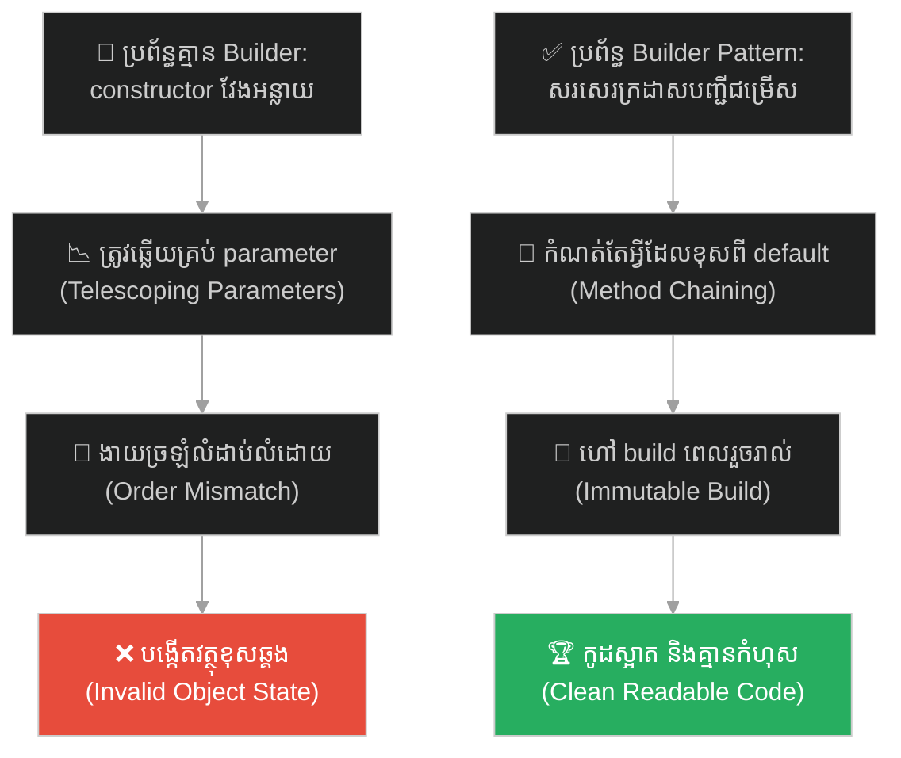
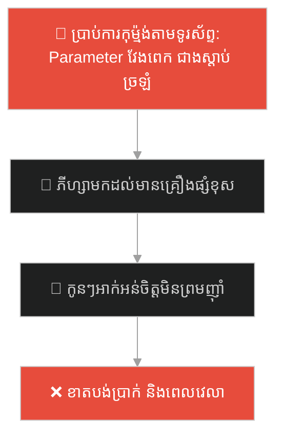
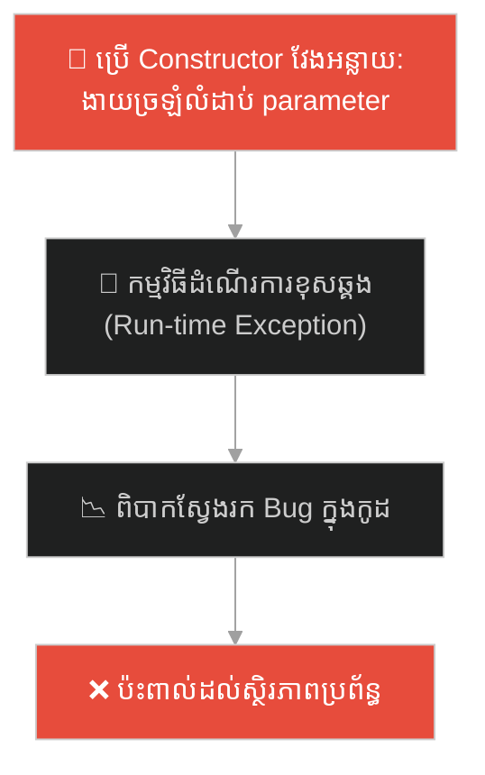
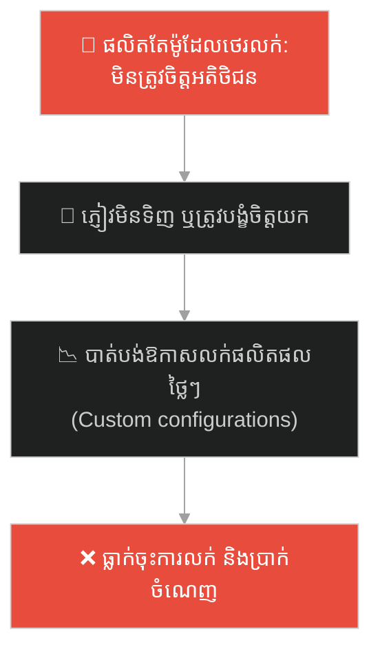
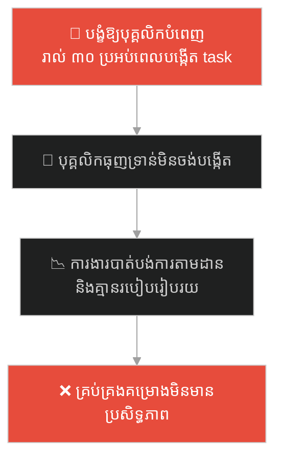
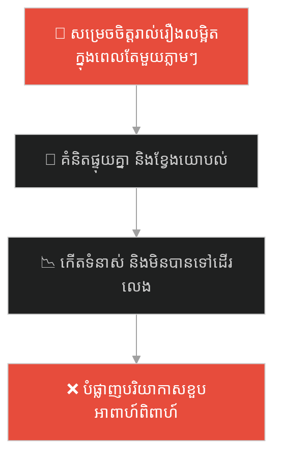
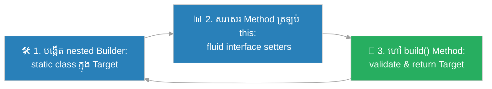

# Builder Design Pattern (លំនាំរចនាបង្កើតវត្ថុជាជំហាន)៖ អ្នករត់តុសួរ ៤៧ សំណួរ (Builder Pattern & The 47-Question Waiter)

**Author:** ichamrong  
**Date:** 2026-05-27  
**Tags:** #design-patterns #builder #software-engineering #telescoping-constructor #clean-code #parable  
**Category:** Concepts / Parables  
**Read Time:** ~15 min  

---

## 📌 មាតិកា (Table of Contents)
- [អន្ទាក់ផ្លូវចិត្ត (The Trap)](#0)
- [១. រឿងព្រេងប្រវត្តិសាស្ត្រ៖ ហាងសាំងវិច និងអ្នករត់តុសួរ ៤៧ សំណួរ (The Legend of the 47-Question Waiter)](#1)
  - [ដំណោះស្រាយក្រដាសបញ្ជីជម្រើសសម្រាប់ការកុម្ម៉ង់ (The Menu Checklist Builder)](#1-1)
- [២. បញ្ហា៖ អន្ទាក់ Telescoping Constructor ក្នុងស្ថាបត្យកម្មកូដ (The Issue: Telescoping Constructor Anti-Pattern)](#2)
- [៣. ឧទាហរណ៍ជាក់ស្តែងក្នុងពិភពពិត (Real World Examples)](#3)
  - [ឧទាហរណ៍ទី ១ — កម្រិតស្រាល (គ្រួសារ)៖ ការបញ្ជាទិញភីហ្សាគ្រួសារដ៏ស្មុគស្មាញ (The Family Pizza Order Night)](#3-1)
  - [ឧទាហរណ៍ទី ២ — កម្រិតមធ្យម (បច្ចេកទេស)៖ ការបង្កើត HTTP Request Object មានប៉ារ៉ាម៉ែត្រច្រើន (The Multi-Parameter HTTP Request)](#3-2)
  - [ឧទាហរណ៍ទី ៣ — កម្រិតមធ្យម (ធុរកិច្ច)៖ ការទិញកុំព្យូទ័រតាមតម្រូវការពិសេស (The Custom Laptop Builder)](#3-3)
  - [ឧទាហរណ៍ទី ៤ — កម្រិតមធ្យម (សង្គម/គ្រប់គ្រង)៖ ការបង្កើតភារកិច្ចការងារក្នុងគម្រោង (The Multi-Attribute Task Creator)](#3-4)
  - [ឧទាហរណ៍ទី ៥ — កម្រិតធ្ងន់ (ទំនាក់ទំនង)៖ ការរៀបចំដំណើរកម្សាន្តគូស្នេហ៍ (The Couple Vacation Planner)](#3-5)
- [៤. ដំណោះស្រាយទូទៅ៖ ការអនុវត្ត Builder Pattern និង Method Chaining (The General Solution: Builder Design Pattern Implementation)](#4)
- [សេចក្តីសន្និដ្ឋាន (Conclusion)](#5)
- [ឯកសារយោង (References)](#6)
- [Related Posts](#7)

---

<a id="0"></a>
## អន្ទាក់ផ្លូវចិត្ត (The Trap)

តើអ្នកធ្លាប់ធុញទ្រាន់នឹងការបង្កើត ឬរៀបចំអ្វីមួយ ដែលតម្រូវឱ្យអ្នកឆ្លើយ ឬផ្តល់ព័ត៌មានលម្អិតជាច្រើន ដែលភាគច្រើនជាអ្វីដែលអ្នកមិនត្រូវការ ឬគ្រាន់តែចង់បានតម្លៃដើម (Default Values) ដែរឬទេ?

នៅក្នុងការសរសេរកូដ និងការរៀបចំដំណើរការការងារ៖
* **យើងងាយនឹងធ្លាក់ក្នុងអន្ទាក់** នៃការប្រើប្រាស់ Constructor ឬទម្រង់បញ្ជូនទិន្នន័យដែលមាន Parameter វែងអន្លាយ និងត្រូវចាំបាច់ឆ្លើយតាមលំដាប់លំដោយ (Telescoping Constructor)។
* **យើងមើលរំលង** ភាពលំបាកក្នុងការអានកូដ និងលទ្ធភាពបង្កកំហុសឆ្គងខ្ពស់ នៅពេលដែលយើងត្រូវបញ្ចូលតម្លៃ `null`, `true`, `false` ជួរដេករាប់សិបដងសម្រាប់របស់ដែលយើងមិនប្រើ។

ការបង្ខំឱ្យឆ្លើយសំណួរច្រើនហួសហេតុ និងការបង្កើតវត្ថុខុសលំដាប់លំដោយ ហៅថា **អន្ទាក់អ្នករត់តុសួរ ៤៧ សំណួរ (Telescoping Constructor Trap)**។

ដើម្បីយល់ដឹងពីរបៀបដែលក្រដាសបញ្ជីជម្រើសជួយសង្គ្រោះហាងសាំងវិច នេះជាផែនទីបង្ហាញផ្លូវ៖
1. **រឿងព្រេងប្រវត្តិសាស្ត្រ (The Historic Legend)** — រឿងរ៉ាវរបស់អតិថិជន និងអ្នករត់តុសួរ ៤៧ សំណួរដែលនាំឱ្យកុម្ម៉ង់អាហារខុស។
2. **បញ្ហា (The Issue)** — ការវិភាគបញ្ហា Telescoping Constructor ក្នុងស្ថាបត្យកម្ម OOP និងអត្ថប្រយោជន៍នៃ Builder Pattern។
3. **ឧទាហរណ៍ជាក់ស្តែងក្នុងពិភពពិត (Real World Examples)** — ពិនិត្យមើលអន្ទាក់នេះក្នុងកម្រិតគ្រួសារ បច្ចេកវិទ្យា ធុរកិច្ច ការគ្រប់គ្រង និងទំនាក់ទំនង។
4. **ដំណោះស្រាយទូទៅ (The General Solution)** — ការអនុវត្តកូដ Builder Pattern ជាមួយ Method Chaining និងការរក្សាភាព Immutable នៃ Object។



---

<a id="1"></a>
## ១. រឿងព្រេងប្រវត្តិសាស្ត្រ៖ ហាងសាំងវិច និងអ្នករត់តុសួរ ៤៧ សំណួរ (The Legend of the 47-Question Waiter)

មានអតិថិជនម្នាក់បានដើរចូលទៅក្នុងហាងលក់សាំងវិចមួយ។ អ្នករត់តុបានយកសៀវភៅមកកត់ រួចសួរគាត់នូវសំណួរចំនួន ៤៧ សំណួរតាមលំដាប់លំដោយយ៉ាងតឹងរ៉ឹងបំផុត៖ 
> *"តើលោកយកនំប៉័ងអ្វី? សាច់ប្រភេទណា? ឈីសប្រភេទណា? ទឹកជ្រលក់អ្វី? បន្លែអ្វីខ្លះ? យកម្ទេសទេ? ដាក់អំបិលទេ?..."*

អតិថិជនគ្រាន់តែចង់បានសាំងវិចសាច់គោធម្មតាមួយ និងបន្ថែមឈីសប៉ុណ្ណោះ ប៉ុន្តែគាត់ត្រូវបង្ខំចិត្តឆ្លើយ "ទេ ទេ ទេ" រហូតដល់ ៤០ ដងសម្រាប់គ្រឿងផ្សំដទៃដែលគាត់មិនចង់បាន។ អ្វីដែលកាន់តែអាក្រក់ ប្រសិនបើគាត់ឆ្លើយរំលងសំណួរទី ៣៤ នោះរាល់ចម្លើយបន្ទាប់ពីនោះនឹងខុសលំដាប់ទាំងអស់ ហើយគាត់នឹងទទួលបានសាំងវិចដាក់ម្ទេសជំនួសឱ្យឈីស។ គាត់មានអារម្មណ៍ធុញទ្រាន់ និងស្មុគស្មាញយ៉ាងខ្លាំង។

---

<a id="1-1"></a>
### ដំណោះស្រាយក្រដាសបញ្ជីជម្រើសសម្រាប់ការកុម្ម៉ង់ (The Menu Checklist Builder)

ហាងសាំងវិចមួយទៀតនៅក្បែរនោះ មានវិធីសាស្រ្តវៃឆ្លាតជាង។ នៅពេលអតិថិជនចូលមកដល់ ពួកគេមិនសួរសំណួរច្រើនឡើយ ពួកគេគ្រាន់តែហុច **ក្រដាសបញ្ជីជម្រើស (Checklist)** មួយសន្លឹក និងប៊ិចមួយដើម។

នៅលើក្រដាសនោះ អ្វីៗទាំងអស់មានជម្រើសដើមរួចជាស្រេច (Default Values ដូចជា នំប៉័ងធម្មតា សាច់គោ)៖
* ប្រសិនបើអតិថិជនចង់បានសាំងវិចធម្មតា គាត់គ្រាន់តែហុចក្រដាសនោះត្រឡប់ទៅវិញភ្លាមៗ (ហៅ `build()`)។
* ប្រសិនបើគាត់ចង់បន្ថែមឈីស គាត់គ្រាន់តែគូសធីកលើប្រអប់ "ឈីស" រួចហុចក្រដាសនោះឱ្យចុងភៅ។

គាត់មិនចាំបាច់ខ្វល់ ឬត្រូវឆ្លើយសំនួរពីជម្រើស ៤៦ ផ្សេងទៀតដែលគាត់មិនត្រូវការនោះទេ ហើយចុងភៅនឹងធ្វើសាំងវិចបានយ៉ាងត្រឹមត្រូវ ១០០% ស្របតាមជម្រើសដែលគាត់ចង់បាន។

---

<a id="2"></a>
## ២. បញ្ហា៖ អន្ទាក់ Telescoping Constructor ក្នុងស្ថាបត្យកម្មកូដ (The Issue: Telescoping Constructor Anti-Pattern)

នៅក្នុងការសរសេរកូដ OOP ប្រសិនបើ Class មួយមាន Constructor ត្រូវការ Parameter ច្រើនពេក នោះវាប្រៀបដូចជាអ្នករត់តុសួរ ៤៧ សំណួរអញ្ចឹង (Telescoping Constructor Anti-Pattern)៖

```java
// ឧទាហរណ៍៖ កូដដែលគ្មាន Builder
new HttpRequest("https://api.com", "POST", headers, body, 10000, 3, true, false, null, "gzip");
```

តើលេខ `10000` តំណាងឱ្យអ្វី? តើ `3` ជាអ្វី? តើ `true` និង `false` តំណាងឱ្យជម្រើសអ្វី? 
* **កូដពិបាកអានខ្លាំង (Poor Readability)៖** អ្នកមើលកូដមិនអាចយល់បានឡើយ លុះត្រាតែទៅបើកអានឯកសារណែនាំ (Documentation)។
* **ងាយច្រឡំលំដាប់លំដោយ (Order Sensitivity)៖** ប្រសិនបើអ្នកសរសេរច្រឡំលំដាប់លំដោយរវាង `true` និង `false` នោះកម្មវិធីនឹងដំណើរការខុសឆ្គងភ្លាមៗ ដោយគ្មានការប្រាប់ដំណឹងកំហុសពេល Compile (Compile-time error)។

**Builder Design Pattern** ដោះស្រាយបញ្ហានេះដោយអនុញ្ញាតឱ្យយើងបង្កើត Object មួយជាជំហានៗ ដោយការកំណត់តែទិន្នន័យណាដែលចាំបាច់ ឬខុសពីតម្លៃលំនាំដើម (Default Values) ប៉ុណ្ណោះ តាមរយៈការតភ្ជាប់ Method (Method Chaining)។

---

<a id="3"></a>
## ៣. ឧទាហរណ៍ជាក់ស្តែងក្នុងពិភពពិត

---

<a id="3-1"></a>
### ឧទាហរណ៍ទី ១ — កម្រិតស្រាល (គ្រួសារ)៖ ការបញ្ជាទិញភីហ្សាគ្រួសារដ៏ស្មុគស្មាញ (The Family Pizza Order Night)

ឪពុកម្នាក់ចង់ទិញភីហ្សាសម្រាប់សមាជិកគ្រួសារ ៥ នាក់។ ជំនួសឱ្យការតេទូរស័ព្ទទៅហាង រួចប្រាប់តាមសំឡេងពីគ្រឿងផ្សំ កម្រាស់នំប៉័ង និងឈីសរបស់ម្នាក់ៗ ដែលនាំឱ្យជាងធ្វើខុស និងភ្លេច គាត់បានបើក App ទូរស័ព្ទ រួចចុចធីកជ្រើសរើសគ្រឿងផ្សំម្តងម្នាក់ៗតាម Builder interface រួចចុច Order។



ការប្រើប្រាស់ App (ភីហ្សា Builder) ជួយឱ្យការកំណត់គ្រឿងផ្សំបានត្រឹមត្រូវ និងច្បាស់លាស់។

---

<a id="3-2"></a>
### ឧទាហរណ៍ទី ២ — កម្រិតមធ្យម (បច្ចេកទេស)៖ ការបង្កើត HTTP Request Object មានប៉ារ៉ាម៉ែត្រច្រើន (The Multi-Parameter HTTP Request)

នៅក្នុងបច្ចេកវិទ្យា ជំនួសឱ្យការសរសេរ Constructor វែងអន្លាយដែលមាន parameter ច្រើន យើងប្រើប្រាស់ Builder pattern ដើម្បីបង្កើត HTTP Request៖

```java
HttpRequest request = HttpRequest.builder()
    .url("https://api.com")
    .method("POST")
    .body("{'id': 1}")
    .timeout(5000)
    .build();
```



---

<a id="3-3"></a>
### ឧទាហរណ៍ទី ៣ — កម្រិតមធ្យម (ធុរកិច្ច)៖ ការទិញកុំព្យូទ័រតាមតម្រូវការពិសេស (The Custom Laptop Builder)

ក្រុមហ៊ុន Apple អនុញ្ញាតឱ្យអតិថិជនទិញ MacBook ដោយជ្រើសរើសទំហំ RAM, CPU, Storage, និងពណ៌តាមតម្រូវការ (Custom Builder)។ ជំនួសឱ្យការបង្កើតម៉ូដែល MacBook ថេររាប់ម៉ឺនប្រភេទ ពួកគេផ្តល់ជម្រើសឱ្យអតិថិជនកំណត់យកអ្វីដែលចង់បាន រួចទើបបញ្ជូនទៅរោងចក្រដំឡើង (Build)។



---

<a id="3-4"></a>
### ឧទាហរណ៍ទី ៤ — កម្រិតមធ្យម (សង្គម/គ្រប់គ្រង)៖ ការបង្កើតភារកិច្ចការងារក្នុងគម្រោង (The Multi-Attribute Task Creator)

នៅក្នុងការគ្រប់គ្រងការងារ ភារកិច្ចមួយ (Task) មានលក្ខណៈជាច្រើនដូចជា៖ ចំណងជើង ថ្ងៃកំណត់ កម្រិតអាទិភាព អ្នកទទួលខុសត្រូវ ផ្នែកការងារ និងការជូនដំណឹង។ ជំនួសឱ្យការបំពេញរាល់ព័ត៌មានទាំងនេះរាល់ពេលបង្កើត Task គំរូ Agile ប្រើប្រាស់ Task Builder ដែលកំណត់តម្លៃលំនាំដើមរួចជាស្រេច (Default: Normal Priority, Assignee: Self, Notification: Active)។



---

<a id="3-5"></a>
### ឧទាហរណ៍ទី ៥ — កម្រិតធ្ងន់ (ទំនាក់ទំនង)៖ ការរៀបចំដំណើរកម្សាន្តគូស្នេហ៍ (The Couple Vacation Planner)

ប្តីប្រពន្ធចង់រៀបចំដំណើរកម្សាន្តខួបអាពាហ៍ពិពាហ៍។ ជំនួសឱ្យការជជែកគ្នាពីចំណុចលម្អិតទាំងអស់ក្នុងពេលតែមួយ (ការកក់សណ្ឋាគារ យន្តហោះ ម្ហូបអាហារ ឡានជួល ទីកន្លែងដើរលេង) ដែលបង្កជាការឈ្លោះប្រកែកគ្នា ពួកគេបានសម្រេចចិត្តប្រើប្រាស់វិធីសាស្ត្រ "កសាងបន្តិចម្តងៗ" (Iterative Planner)៖ កក់សណ្ឋាគារជាមុន រួចទើបសម្រេចចិត្តរើសជើងហោះហើរ និងកន្លែងញ៉ាំអាហារតាមក្រោយ។



---

<a id="4"></a>
## ៤. ដំណោះស្រាយទូទៅ៖ ការអនុវត្ត Builder Pattern និង Method Chaining (The General Solution: Builder Design Pattern Implementation)

ដើម្បីចៀសវាងភាពស្មុគស្មាញនៃ Telescoping Constructor យើងត្រូវអនុវត្តលំនាំរចនា **Builder Pattern** ក្នុងការសរសេរកូដ៖



ជំហាននៃការអនុវត្ត៖
1. **បង្កើត Nested Static Builder Class៖** បង្កើត Class មួយឈ្មោះ `Builder` នៅខាងក្នុង Class គោលដៅរបស់យើង។
2. **សរសេរ Setters ត្រឡប់ `this` (Method Chaining)៖** រាល់ Method សម្រាប់កំណត់តម្លៃឱ្យ Parameter របស់ Builder ត្រូវតែត្រឡប់ Object `Builder` នោះមកវិញ ដើម្បីអាចឱ្យយើងហៅ Method ផ្សេងទៀតបន្តបន្ទាប់គ្នាបាន (ឧទាហរណ៍៖ `.method("GET").timeout(5000)`)។
3. **ហៅ `build()` ពេលបញ្ចប់៖** Method `build()` នឹងត្រួតពិនិត្យភាពត្រឹមត្រូវនៃទិន្នន័យ (Data Validation) រួចទើបបង្កើត និងប្រគល់ Object គោលដៅដែលមានលក្ខណៈ Immutable (មិនអាចកែប្រែបានក្រោយពេលបង្កើត) មកវិញ។
4. **ការប្រើប្រាស់ Annotation (ដូចជា `@Builder` ក្នុង Lombok)៖** សម្រាប់ភាសា Java ឬ TypeScript យើងអាចប្រើប្រាស់បណ្ណាល័យ ឬ Annotation ដើម្បីឱ្យវាបង្កើតកូដ Builder Pattern នេះដោយស្វ័យប្រវត្តិ កាត់បន្ថយការសរសេរកូដដដែលៗ (Boilerplate Code)។

---

## 🐇 ធ្លាក់ចូលក្នុងរន្ធទន្សាយ (Enter the Rabbit Hole)

ដើម្បីស្វែងយល់ពីរបៀបដែលក្រុមហ៊ុនមួយដែលមានប្រធានគ្រប់គ្រងតំបន់ ត្រូវរង់ចាំការសម្រេចចិត្តពីនាយកប្រតិបត្តិនៅទីក្រុងកណ្តាលសម្រាប់រាល់បញ្ហាតូចតាច ធ្វើឱ្យក្រុមហ៊ុនយឺតយ៉ាវ និងចាញ់គូប្រជែង (Centralization vs. Decentralization) សូមបន្តដំណើរទៅកាន់៖

* 🚀 **[ចាប់ផ្តើមដំណើររុករក (Start the Journey) ➔ Consensus & Centralization Problems](./77-the-ceo-and-regional-managers.md)**

---

<a id="5"></a>
## សេចក្តីសន្និដ្ឋាន (Conclusion)

> **«កុំបង្ខំឱ្យនរណាម្នាក់ឆ្លើយ ៤៧ សំណួរ ប្រសិនបើពួកគេគ្រាន់តែចង់បានរបស់សាមញ្ញមួយ។ ចូរផ្តល់ក្រដាសបញ្ជីជម្រើសដ៏ស្អាតស្អំដល់ពួកគេ។»**

ចូរធ្វើខ្លួនជាវិស្វករសូហ្វវែរដែលយល់ចិត្តអ្នកដទៃ សរសេរកូដដែលងាយស្រួលយល់ និងការពារការច្រឡំប៉ារ៉ាម៉ែត្រ។ ការអនុវត្ត Builder Design Pattern មិនត្រឹមតែជួយឱ្យកូដរបស់អ្នកស្អាត និងងាយស្រួលអានប៉ុណ្ណោះទេ ប៉ុន្តែវាក៏ជួយកាត់បន្ថយកំហុសឆ្គងដ៏ស្ងប់ស្ងាត់ (Silent Bugs) ពេលដំណើរការកម្មវិធីផងដែរ។

---

<a id="6"></a>
## ឯកសារយោង (References)

* **Joshua Bloch** — *Effective Java: Item 2 (Consider a builder when faced with many constructor parameters)* (2018). Addison-Wesley.
* **Martin Fowler** — *Fluent Interface Design Patterns Guidelines* (2005). MartinFowler.com.
* **Gang of Four (GoF)** — *Design Patterns: Builder Pattern Implementation Details* (1994).

---

<a id="7"></a>
## Related Posts

* **[76 Fluent API Design with Builder Pattern](../articles/76-builder-pattern.md)** — អត្ថបទវិទ្យាសាស្ត្រលម្អិតអំពីការសរសេរកូដ Builder Pattern ក្នុងភាសាផ្សេងៗ និងរបៀបធ្វើឱ្យវាមានសុវត្ថិភាពខ្ពស់។
* **[44 The Gordian Knot](./44-the-gordian-knot.md)** — ការកាត់បន្ថយភាពស្មុគស្មាញ និងរក្សាភាពសាមញ្ញ (KISS Principle)។
* **[52 The Best Part is No Part](./52-the-best-part-is-no-part.md)** — ការលុបចោលតម្រូវការដែលមិនចាំបាច់ ដើម្បីសម្រួលដំណើរការបង្កើត។

---

## Related

- [💡 Concepts README](../README.md)
- [📚 Main Repository README](../../../README.md)
- [Developer Habits](../../developer-habits/README.md)
- [Mental Health & Well-being](../../mental-health/README.md)
- [Management & SDLC](../../management/README.md)
