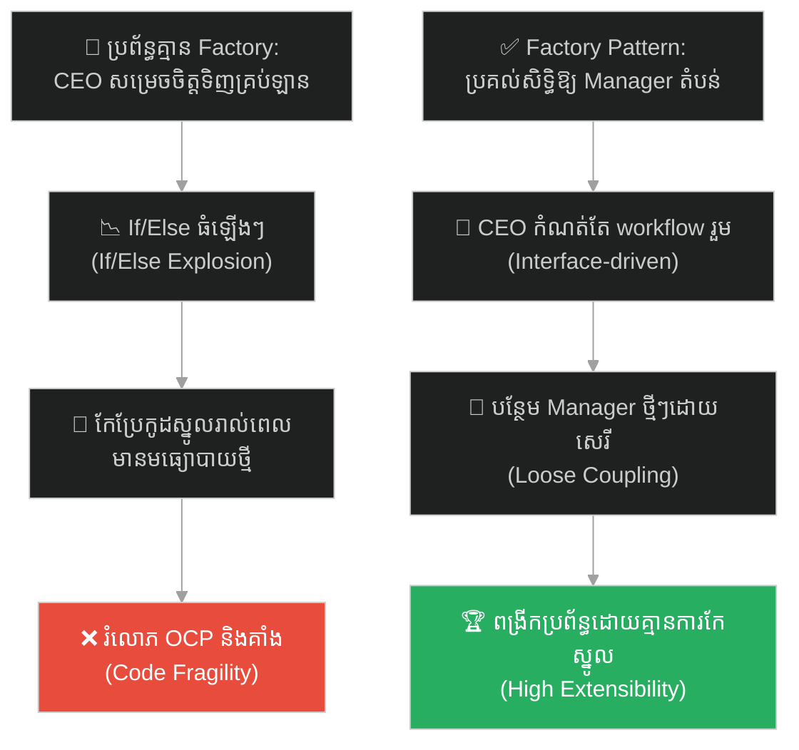
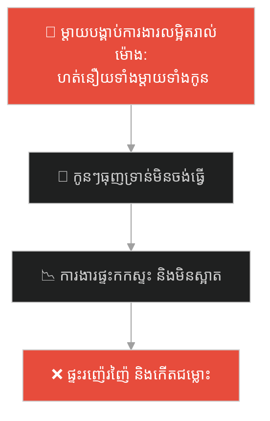
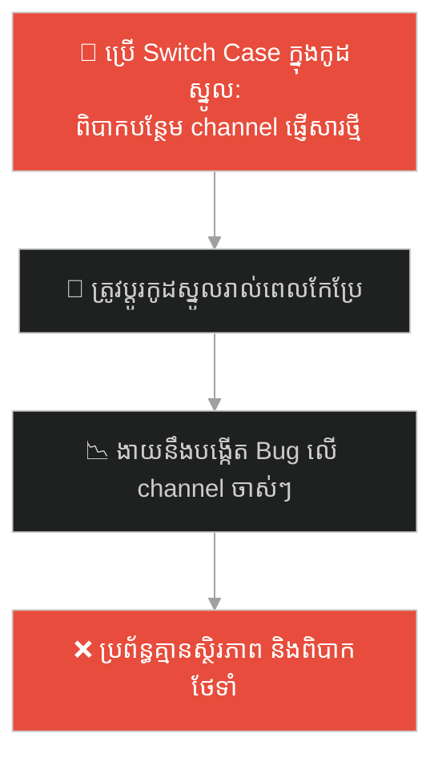
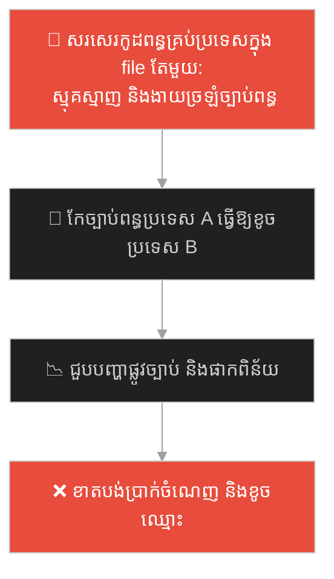
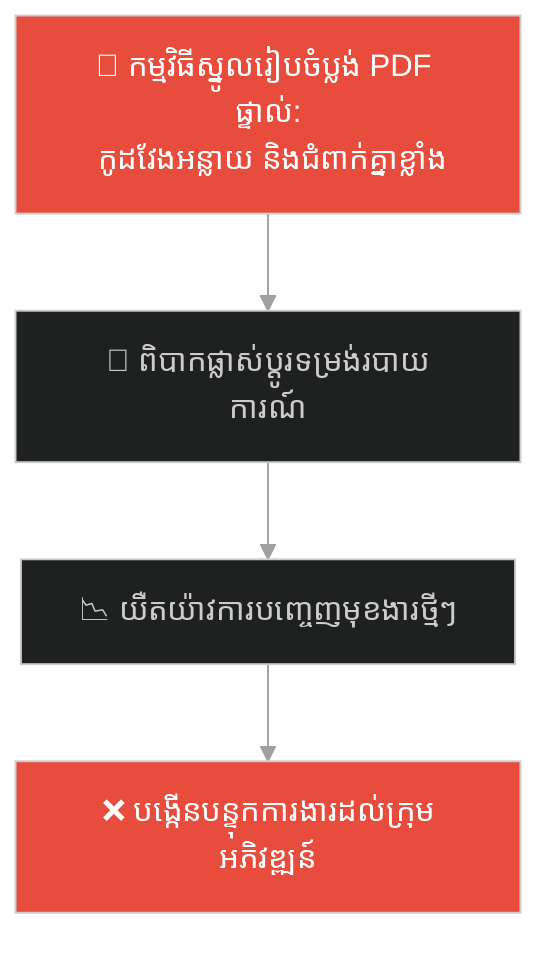
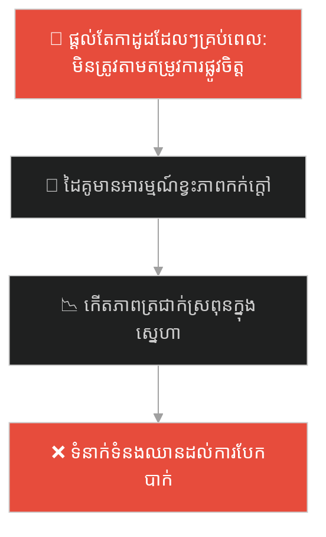
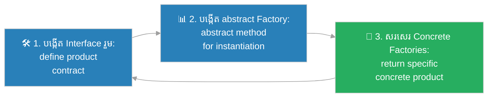

# Factory Method Design Pattern (លំនាំរចនាបង្កើតវត្ថុដោយតំណាង)៖ នាយកប្រតិបត្តិ និងអ្នកគ្រប់គ្រងតំបន់ (Factory Method Pattern & The Regional Managers)

**Author:** ichamrong  
**Date:** 2026-05-27  
**Tags:** #design-patterns #factory-method #architecture #software-engineering #open-closed-principle #delegation #clean-code #parable  
**Category:** Concepts / Parables  
**Read Time:** ~15 min  

---

## 📌 មាតិកា (Table of Contents)
- [អន្ទាក់ផ្លូវចិត្ត (The Trap)](#0)
- [១. រឿងព្រេងប្រវត្តិសាស្ត្រ៖ នាយកប្រតិបត្តិដែលក្តោបក្តាប់គ្រប់កិច្ចការ (The Legend of the Micromanaging CEO)](#1)
  - [ការប្រគល់សិទ្ធិសម្រេចចិត្ត និងការបង្កើតអ្នកគ្រប់គ្រងតំបន់ (The Delegated Factory Workflow)](#1-1)
- [២. បញ្ហា៖ ការរំលោភលើគោលការណ៍ Open/Closed Principle និងការកើនឡើងកូដ If/Else (The Issue: Violating OCP & If/Else Explosion)](#2)
- [៣. ឧទាហរណ៍ជាក់ស្តែងក្នុងពិភពពិត (Real World Examples)](#3)
  - [ឧទាហរណ៍ទី ១ — កម្រិតស្រាល (គ្រួសារ)៖ ការចាត់ចែងការងារផ្ទះរបស់ឪពុកម្តាយ (The Family Chores Delegator)](#3-1)
  - [ឧទាហរណ៍ទី ២ — កម្រិតមធ្យម (បច្ចេកទេស)៖ ប្រព័ន្ធផ្ញើសារជូនដំណឹងពហុទម្រង់ (The Multi-Channel Notification Engine)](#3-2)
  - [ឧទាហរណ៍ទី ៣ — កម្រិតមធ្យម (ធុរកិច្ច)៖ ការគណនាពន្ធសម្រាប់ប្រទេសផ្សេងៗគ្នា (The Global Tax Calculator)](#3-3)
  - [ឧទាហរណ៍ទី ៤ — កម្រិតមធ្យម (សង្គម/គ្រប់គ្រង)៖ ការបង្កើតឯកសាររបាយការណ៍ក្រុមហ៊ុន (The Corporate Document Generator)](#3-4)
  - [ឧទាហរណ៍ទី ៥ — កម្រិតធ្ងន់ (ទំនាក់ទំនង)៖ ការបង្ហាញក្តីស្រឡាញ់តាមចំណូលចិត្តដៃគូ (The Personalized Love Language Factory)](#3-5)
- [៤. ដំណោះស្រាយទូទៅ៖ ការអនុវត្ត Factory Method Pattern និងយន្តការ Polymorphism (The General Solution: Factory Method Pattern with Polymorphism)](#4)
- [សេចក្តីសន្និដ្ឋាន (Conclusion)](#5)
- [ឯកសារយោង (References)](#6)
- [Related Posts](#7)

---

<a id="0"></a>
## អន្ទាក់ផ្លូវចិត្ត (The Trap)

តើអ្នកធ្លាប់ជួបស្ថានភាពដែលប្រព័ន្ធការងារ ឬកូដកម្មវិធីរបស់អ្នក ត្រូវបើកមកកែប្រែរាល់ពេលដែលមានតម្រូវការ ឬមធ្យោបាយថ្មីមួយបន្ថែម ដែលនាំឱ្យប្រព័ន្ធកាន់តែធំ និងស្មុគស្មាញពិបាកថែទាំដែរឬទេ?

នៅក្នុងស្ថាបត្យកម្មព័ត៌មាន និងការសរសេរកូដ៖
* **យើងងាយនឹងធ្លាក់ក្នុងអន្ទាក់** នៃការប្រើប្រាស់លក្ខខណ្ឌប្រៀបធៀបដ៏ធំ (If/Else ឬ Switch Blocks) នៅក្នុងថ្នាក់គ្រប់គ្រងស្នូល ដើម្បីសម្រេចចិត្តបង្កើត និងប្រើប្រាស់ Object ផ្សេងៗគ្នា (Hard Coupling)។
* **យើងមើលរំលង** សារៈសំខាន់នៃការប្រគល់សិទ្ធិសម្រេចចិត្តបង្កើត Object ទៅឱ្យថ្នាក់តំណាង (Delegation/Subclasses) ដែលជួយឱ្យប្រព័ន្ធស្នូលអាចដំណើរការដោយឯករាជ្យ និងអាចពង្រីកបានដោយគ្មានដែនកំណត់។

ការបណ្តោយឱ្យថ្នាក់គ្រប់គ្រងស្នូលដឹងលម្អិតពីរបៀបបង្កើត Object ទាំងអស់ ហៅថា **អន្ទាក់ចាត់ចែងគ្រប់រឿង (The Micromanagement Trap)**។

ដើម្បីយល់ដឹងពីរបៀបដែលនាយកប្រតិបត្តិដោះស្រាយវិបត្តិដឹកជញ្ជូន នេះជាផែនទីបង្ហាញផ្លូវ៖
1. **រឿងព្រេងប្រវត្តិសាស្ត្រ (The Historic Legend)** — រឿងរ៉ាវរបស់នាយកប្រតិបត្តិដែលចង់ចាត់ចែងរាល់មធ្យោបាយដឹកជញ្ជូន និងភាពជាប់គាំងនៃអាជីវកម្ម។
2. **បញ្ហា (The Issue)** — ការវិភាគបញ្ហានៃការរំលោភលើគោលការណ៍ Open/Closed Principle (OCP) ក្នុង OOP។
3. **ឧទាហរណ៍ជាក់ស្តែងក្នុងពិភពពិត (Real World Examples)** — ពិនិត្យមើលអន្ទាក់នេះក្នុងកម្រិតគ្រួសារ បច្ចេកវិទ្យា ធុរកិច្ច ការគ្រប់គ្រង និងទំនាក់ទំនង។
4. **ដំណោះស្រាយទូទៅ (The General Solution)** — ការបង្កើត Interface ួម, ការសរសេរ Factory Method ក្នុង Abstract Class និងការប្រើប្រាស់ Polymorphism។



---

<a id="1"></a>
## ១. រឿងព្រេងប្រវត្តិសាស្ត្រ៖ នាយកប្រតិបត្តិដែលក្តោបក្តាប់គ្រប់កិច្ចការ (The Legend of the Micromanaging CEO)

មានក្រុមហ៊ុនដឹកជញ្ជូនធំមួយ ដែលមាននាយកប្រតិបត្តិ (CEO) ម្នាក់ចូលចិត្តគ្រប់គ្រង និងចាត់ចែងរាល់ការងារតូចតាចទាំងអស់ដោយខ្លួនឯង។ 

រាល់ពេលដែលមានអីវ៉ាន់ត្រូវដឹកជញ្ជូន គាត់ត្រូវមកអង្គុយពិនិត្យមើល និងសម្រេចចិត្ត៖
> *"បើភ្ញៀវនៅក្បែរទីក្រុង យើងត្រូវទៅទិញឡានដឹកទំនិញបន្ថែម! បើភ្ញៀវនៅឆ្លងសមុទ្រ យើងត្រូវទៅជួលកប៉ាល់ដឹកឈើ! បើភ្ញៀវប្រញាប់ យើងត្រូវទៅទិញសំបុត្រយន្តហោះ!"*

រាល់ពេលដែលក្រុមហ៊ុនចង់ពង្រីកសេវាកម្មដឹកជញ្ជូនថ្មី (ឧទាហរណ៍៖ បន្ថែមសេវាដឹកទំនិញតាមរថភ្លើង) CEO រូបនេះត្រូវឈឺក្បាលរៀនសូត្រពីបច្ចេកទេសរថភ្លើង របៀបទិញក្បាលឡាន និងរបៀបគ្រប់គ្រងផ្លូវដែក។ គាត់ត្រូវកែប្រែរាល់សៀវភៅណែនាំការងារ និងបញ្ជាចាស់ៗរបស់គាត់ទាំងអស់តាំងពីដើមមក (តំណាងឱ្យការកែប្រែ If/Else Block ដ៏ធំនៅក្នុងកូដ)។ 

យូរៗទៅ គាត់ធ្វើការលែងទាន់ ឯកសារគរពេញតុ ហើយក្រុមហ៊ុនក៏ត្រូវក្ស័យធន និងជាប់គាំងដំណើរការទាំងស្រុង ព្រោះតែការសម្រេចចិត្តទាំងអស់ត្រូវកកស្ទះនៅត្រង់ចំណុចគាត់តែម្នាក់។

---

<a id="1-1"></a>
### ការប្រគល់សិទ្ធិសម្រេចចិត្ត និងការបង្កើតអ្នកគ្រប់គ្រងតំបន់ (The Delegated Factory Workflow)

នាយកប្រតិបត្តិថ្មីបានមកដល់ ហើយគាត់បានប្រើប្រាស់ប្រព័ន្ធគ្រប់គ្រងការងារថ្មីទាំងស្រុង។ គាត់មិនខ្វល់ខ្វាយពីបច្ចេកទេសលម្អិតនៃមធ្យោបាយដឹកជញ្ជូននីមួយៗឡើយ។ គាត់គ្រាន់តែបង្កើត **នីតិវិធីការងារស្នូល (Core Workflow)** តែមួយគត់៖
`ទទួលអីវ៉ាន់ ➔ ហៅមធ្យោបាយដឹកជញ្ជូនមកផ្ទុក ➔ បញ្ជាឱ្យដឹកជញ្ជូន (deliver()) ទៅដល់ទ្វារផ្ទះអតិថិជន`។

គាត់បានបង្កើតតំណែង **អ្នកគ្រប់គ្រងតំបន់ (Subclasses/Factories)**៖
* **អ្នកគ្រប់គ្រងផ្លូវគោក (Road Logistic Manager)៖** មានតួនាទីផ្តល់ **ឡានដឹកទំនិញ**។
* **អ្នកគ្រប់គ្រងផ្លូវទឹក (Sea Logistic Manager)៖** 有តួនាទីផ្តល់ **កប៉ាល់**។

នៅពេលមានអីវ៉ាន់ត្រូវដឹកជញ្ជូន CEO គ្រាន់តែប្រាប់អ្នកគ្រប់គ្រងតំបន់ពាក់ព័ន្ធថា៖ *"ចូរផ្តល់មធ្យោបាយដឹកជញ្ជូនដែលសមស្របមកឱ្យខ្ញុំ (createTransport())"*។ CEO ទទួលបានអ្វីមួយដែលអាចដឹកអីវ៉ាន់បាន ហើយគាត់គ្រាន់តែបញ្ជាទៅកាន់វត្ថុនោះឱ្យ `deliver()` ទៅជាការស្រេច។ 

ថ្ងៃក្រោយ បើក្រុមហ៊ុនចង់បន្ថែមសេវា "ដឹកតាមរថភ្លើង" គេគ្រាន់តែជួល **អ្នកគ្រប់គ្រងផ្លូវដែក (Rail Logistic Manager)** ម្នាក់បន្ថែមទៀតគឺចប់ជាការស្រេច ដោយមិនចាំបាច់រំខាន ឬកែប្រែប្រព័ន្ធការងារស្នូលរបស់ CEO សូម្បីតែមួយម៉ាត់។

---

<a id="2"></a>
## ២. បញ្ហា៖ ការរំលោភលើគោលការណ៍ Open/Closed Principle និងការកើនឡើងកូដ If/Else (The Issue: Violating OCP & If/Else Explosion)

នៅក្នុងការសរសេរកូដ OOP ប្រសិនបើថ្នាក់ស្នូលរបស់អ្នក (Core Class) ផ្ទុកទៅដោយលក្ខខណ្ឌបង្កើត Object ដូចខាងក្រោម៖

```java
// គំរូកូដដែលរំលោភលើ OCP
public class NotificationService {
    public void send(String type, String message) {
        if (type.equals("email")) {
            EmailNotifier notifier = new EmailNotifier();
            notifier.sendEmail(message);
        } else if (type.equals("sms")) {
            SMSNotifier notifier = new SMSNotifier();
            notifier.sendSMS(message);
        }
    }
}
```

* **ការរំលោភលើ Open/Closed Principle៖** កូដរបស់អ្នកគួរតែបើកសម្រាប់ការពង្រីក (Open for extension) ប៉ុន្តែបិទសម្រាប់ការកែប្រែ (Closed for modification)។ នៅក្នុងកូដខាងលើ រាល់ពេលមានប្រភេទសារថ្មី (ដូចជា Telegram, WhatsApp) អ្នកត្រូវបើកកូដ `NotificationService` មកកែ និងបន្ថែម `else if` ជានិច្ច ដែលងាយនឹងបង្កកំហុសលើមុខងារចាស់ៗ។
* **កូដជំពាក់គ្នាខ្លាំង (Strong Coupling)៖** `NotificationService` ស្គាល់រឿងលម្អិតរបស់ `EmailNotifier` និង `SMSNotifier` ច្រើនហួសហេតុ ធ្វើឱ្យពិបាកក្នុងការសរសេរ Unit Tests។

**Factory Method Pattern** ដោះស្រាយបញ្ហានេះដោយកំណត់ Abstract Method មួយឈ្មោះថា `createNotifier()` នៅក្នុង Parent Class ហើយប្រគល់ភារកិច្ចឱ្យ Subclasses ជាអ្នកបង្កើត Object ជាក់ស្តែង។

---

<a id="3"></a>
## ៣. ឧទាហរណ៍ជាក់ស្តែងក្នុងពិភពពិត

---

<a id="3-1"></a>
### ឧទាហរណ៍ទី ១ — កម្រិតស្រាល (គ្រួសារ)៖ ការចាត់ចែងការងារផ្ទះរបស់ឪពុកម្តាយ (The Family Chores Delegator)

ម្តាយម្នាក់ចង់ឱ្យផ្ទះស្អាតជានិច្ច។ ជំនួសឱ្យការដើរទៅប្រាប់កូនម្នាក់ៗរាល់ម៉ោងពីរបៀបបោសផ្ទះ របៀបដាំបាយ និងរបៀបលាងចាន (Micromanagement) គាត់គ្រាន់តែប្រាប់ថា៖ *"ល្ងាចនេះ កូនៗត្រូវធ្វើការងារផ្ទះដែលខ្លួនទទួលខុសត្រូវឱ្យរួចរាល់ (doChore())"*។ កូនប្រុសច្បងដឹងខ្លួនត្រូវលាងចាន កូនស្រីទីពីរដឹងខ្លួនត្រូវបោសផ្ទះ។



ម្តាយគ្រាន់តែដើរតួជា Parent Class កំណត់ workflow រួម ចំណែកកូនៗដើរតួជា Subclasses អនុវត្តសកម្មភាពជាក់ស្តែង។

---

<a id="3-2"></a>
### ឧទាហរណ៍ទី ២ — កម្រិតមធ្យម (បច្ចេកទេស)៖ ប្រព័ន្ធផ្ញើសារជូនដំណឹងពហុទម្រង់ (The Multi-Channel Notification Engine)

នៅក្នុងការសរសេរកូដ ជំនួសឱ្យការសរសេរ `if/else` ដើម្បីបង្កើតបណ្តាញផ្ញើសារ យើងបង្កើត Factory Method៖

```java
public abstract class NotificationSender {
    // Factory Method
    public abstract Notifier createNotifier();

    public void sendNotification(String message) {
        Notifier notifier = createNotifier();
        notifier.send(message);
    }
}
```



---

<a id="3-3"></a>
### ឧទាហរណ៍ទី ៣ — កម្រិតមធ្យម (ធុរកិច្ច)៖ ការគណនាពន្ធសម្រាប់ប្រទេសផ្សេងៗគ្នា (The Global Tax Calculator)

ក្រុមហ៊ុន SaaS លំដាប់ពិភពលោក ត្រូវគណនាពន្ធដាច់ដោយឡែកសម្រាប់ប្រទេសនីមួយៗ (US Tax, EU Tax, KH Tax)។ ជំនួសឱ្យការសរសេរកូដគណនាពន្ធទាំងអស់ចូលក្នុង Class តែមួយ ពួកគេបង្កើត `TaxCalculatorFactory`។ ប្រទេសនីមួយៗនឹងមាន Subclass ផ្ទាល់ខ្លួនសម្រាប់គណនាពន្ធតាមច្បាប់តំបន់ ដោយមិនប៉ះពាល់ដល់ការគណនារបស់ប្រទេសដទៃឡើយ។



---

<a id="3-4"></a>
### ឧទាហរណ៍ទី ៤ — កម្រិតមធ្យម (សង្គម/គ្រប់គ្រង)៖ ការបង្កើតឯកសាររបាយការណ៍ក្រុមហ៊ុន (The Corporate Document Generator)

នៅក្នុងប្រព័ន្ធគ្រប់គ្រងឯកសារ ក្រុមហ៊ុនត្រូវបង្កើតរបាយការណ៍ជាច្រើនទម្រង់ (PDF Report, Excel Report, HTML Report)។ ជំនួសឱ្យការសរសេរកូដដំឡើង Excel ឬ PDF នៅក្នុងកម្មវិធីស្នូល ពួកគេបង្កើត `DocumentGenerator` ជានាមរូប (Interface) និងអនុញ្ញាតឱ្យ `PDFGenerator` ឬ `ExcelGenerator` ទទួលខុសត្រូវលើការបង្កើតឯកសារជាក់ស្តែង។



---

<a id="3-5"></a>
### ឧទាហរណ៍ទី ៥ — កម្រិតធ្ងន់ (ទំនាក់ទំនង)៖ ការបង្ហាញក្តីស្រឡាញ់តាមចំណូលចិត្តដៃគូ (The Personalized Love Language Factory)

នៅក្នុងទំនាក់ទំនងស្នេហា ដៃគូនីមួយៗមាន "ភាសាស្នេហា" (Love Language) ផ្សេងៗគ្នា (ដូចជា ការផ្តល់កាដូ ការនិយាយពាក្យផ្អែមល្ហែម ការចំណាយពេលជាមួយគ្នា)។ ជំនួសឱ្យការប្រើប្រាស់វិធីសាស្ត្រតែមួយបង្ហាញក្តីស្រឡាញ់ (ដូចជាការទិញតែកាដូជានិច្ច ទោះបីជាដៃគូចង់បានការលួងលោមក៏ដោយ) ដៃគូដែលយល់ចិត្តនឹងដំណើរការដូច Factory Method៖ វាយតម្លៃអារម្មណ៍ និងតម្រូវការដៃគូនៅពេលនោះ រួចផ្តល់នូវការឆ្លើយតបដ៏សមស្របបំផុត។



---

<a id="4"></a>
## ៤. ដំណោះស្រាយទូទៅ៖ ការអនុវត្ត Factory Method Pattern និងយន្តការ Polymorphism (The General Solution: Factory Method Pattern with Polymorphism)

ដើម្បីចៀសវាងភាពស្មុគស្មាញនៃការប្រើប្រាស់ If/Else ក្នុងការបង្កើត Object យើងត្រូវអនុវត្ត **Factory Method Pattern**៖



ជំហាននៃការអនុវត្ត៖
1. **បង្កើត Product Interface រួម៖** បង្កើត Interface រួមមួយ (ដូចជា `Transport` ឬ `Notifier`) ដែលមានកិច្ចសន្យាការងារច្បាស់លាស់ (ដូចជា Method `deliver()` ឬ `send()`)។
2. **បង្កើត Abstract Factory Class៖** បង្កើត Abstract Class មួយ (ដូចជា `Logistics` ឬ `NotificationSender`) ដែលមាន Abstract Factory Method មួយត្រឡប់ប្រភេទ Product Interface នោះមកវិញ។
3. **សរសេរ Concrete Factory Subclasses៖** បង្កើត Class តំណាង (ដូចជា `RoadLogistics` ឬ `EmailSender`) ដែលលាតសន្ធឹង (Extend) ពី Abstract Class នោះ និងបំពេញបន្ថែម (Override) លើ Factory Method ដើម្បីបង្កើត និងប្រគល់ Object ជាក់ស្តែងមកវិញ។
4. **ហៅប្រើប្រាស់តាមយន្តការ Polymorphism៖** នៅក្នុងកូដស្នូល ហៅប្រើប្រាស់តែ Product Interface និងដំណើរការកូដដោយមិនបាច់ដឹងពីប្រភេទ Class ជាក់ស្តែងឡើយ។

---

## 🐇 ធ្លាក់ចូលក្នុងរន្ធទន្សាយ (Enter the Rabbit Hole)

ដើម្បីស្វែងយល់ពីរបៀបដែលហាងលក់គ្រឿងសង្ហារឹមមួយ បានដឹកជញ្ជូនតុ និងកៅអីដែលមានទំហំប្រហោងខ្ចៅខុសៗគ្នា ធ្វើឱ្យអតិថិជនមិនអាចដំឡើងចូលគ្នាបាន (Interface Mismatch and API Contracts) សូមបន្តដំណើរទៅកាន់៖

* 🚀 **[ចាប់ផ្តើមដំណើររុករក (Start the Journey) ➔ API Contracts and Schema Matching](./78-the-mismatched-furniture-store.md)**

---

<a id="5"></a>
## សេចក្តីសន្និដ្ឋាន (Conclusion)

> **«នាយកប្រតិបត្តិដ៏ល្អ មិនមែនជាអ្នកដឹងពីរបៀបបើកឡានដឹកទំនិញ ឬកប៉ាល់នោះទេ គឺជានាយកដែលស្គាល់ពីរបៀបចាត់ចែងការងារឱ្យអ្នកគ្រប់គ្រងតំបន់ធ្វើការងារនោះជំនួសវិញ។»**

ចូរធ្វើខ្លួនជាស្ថាបត្យករកម្មវិធីដែលយល់ដឹងពីសេរីភាពនៃកូដ (Decoupling) អនុញ្ញាតឱ្យប្រព័ន្ធស្នូលដំណើរការដោយមិនបាច់ដឹងពីព័ត៌មានលម្អិតរបស់ Object ជាក់ស្តែងឡើយ។ ការប្រគល់សិទ្ធិសម្រេចចិត្តបង្កើត Object ទៅឱ្យ Subclasses តាមលំនាំ Factory Method នឹងជួយឱ្យកូដរបស់អ្នកមានភាពបត់បែនខ្ពស់ និងអាចពង្រីកបានយ៉ាងងាយស្រួលទៅអនាគត។

---

<a id="6"></a>
## ឯកសារយោង (References)

* **Erich Gamma, Richard Helm, Ralph Johnson, John Vlissides** — *Design Patterns: Elements of Reusable Object-Oriented Software* (1994). Factory Method Chapter.
* **Robert C. Martin** — *Clean Architecture: A Craftsman's Guide to Software Structure and Design* (2017). Prentice Hall. (គោលការណ៍ OCP និង Dependency Inversion)។
* **Martin Fowler** — *Patterns of Enterprise Application Architecture* (2002). Addison-Wesley.

---

<a id="7"></a>
## Related Posts

* **[77 Creational Patterns: The Factory Method in Action](../articles/77-factory-method.md)** — អត្ថបទវិទ្យាសាស្ត្រលម្អិត និងឧទាហរណ៍កូដ Java/C# នៃការអនុវត្ត Factory Method Pattern ក្នុងផលិតកម្មពិត។
* **[41 The Tower of Babel](./41-the-tower-of-babel.md)** — ភាពវឹកវរនៃកិច្ចសន្យាភាសា និងការបកស្រាយព័ត៌មានខុសគ្នា។
* **[64 The Swiss Army Knife](./64-the-swiss-army-knife.md)** — អន្ទាក់ God Object និងគោលការណ៍ Single Responsibility Principle (SRP)។

---

## Related

- [💡 Concepts README](../README.md)
- [📚 Main Repository README](../../../README.md)
- [Developer Habits](../../developer-habits/README.md)
- [Mental Health & Well-being](../../mental-health/README.md)
- [Management & SDLC](../../management/README.md)
