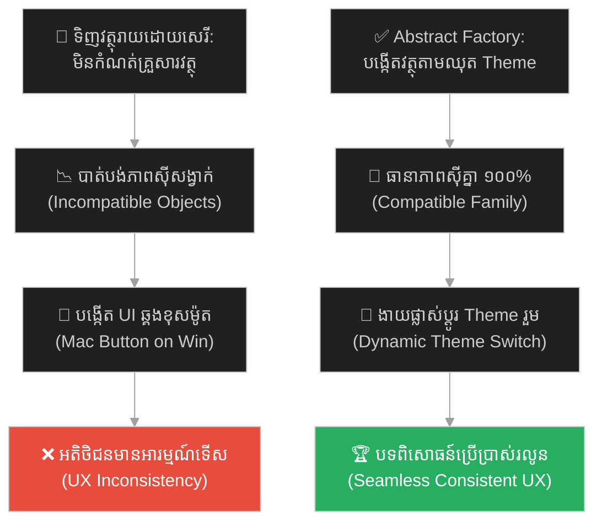
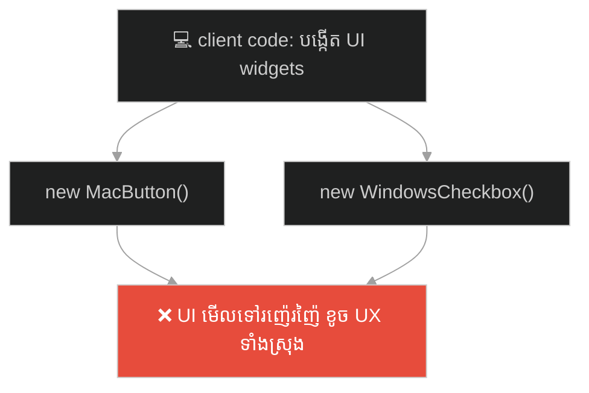
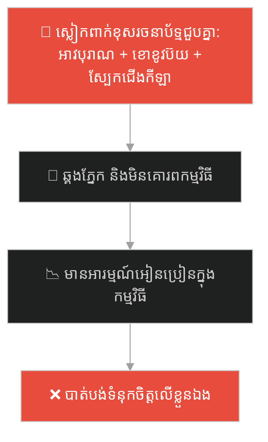
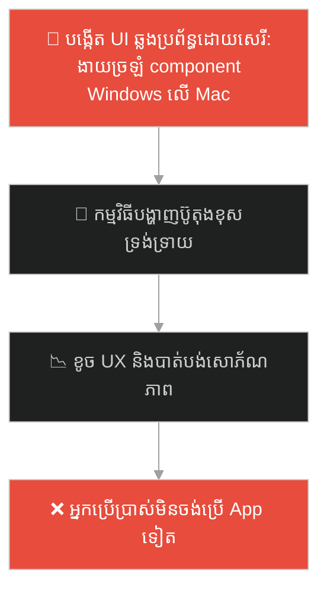
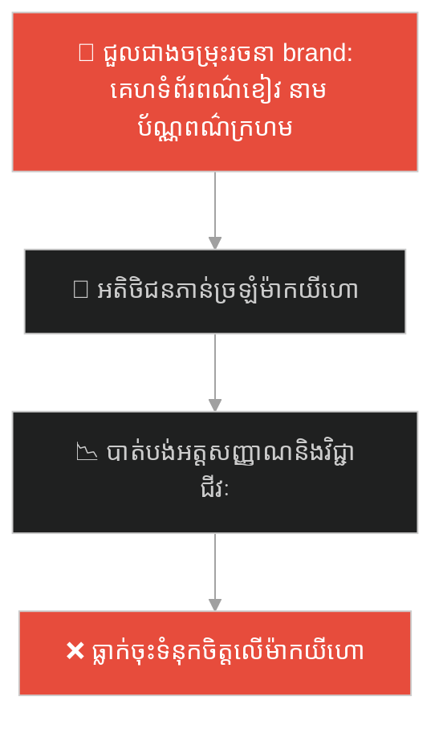
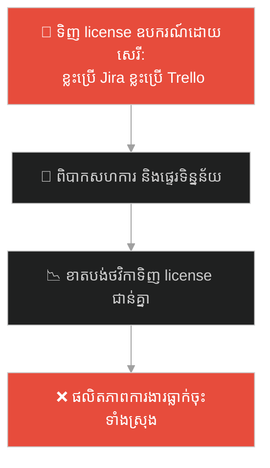
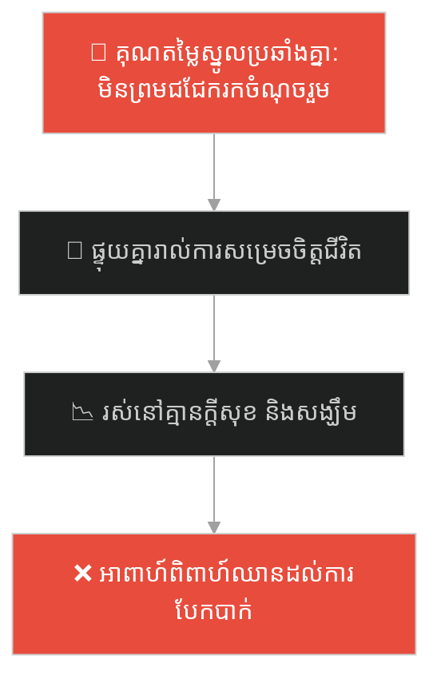
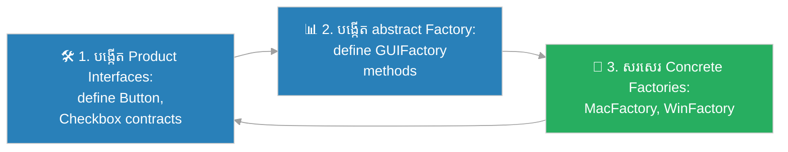

# Abstract Factory Design Pattern (លំនាំរចនាបង្កើតក្រុមវត្ថុទាក់ទងគ្នា)៖ ហាងលក់គ្រឿងសង្ហារឹមចម្រុះ (Abstract Factory Pattern & The Mismatched Furniture)

**Author:** ichamrong  
**Date:** 2026-05-27  
**Tags:** #design-patterns #abstract-factory #architecture #software-engineering #object-family #clean-code #parable  
**Category:** Concepts / Parables  
**Read Time:** ~15 min  

---

## 📌 មាតិកា (Table of Contents)
- [អន្ទាក់ផ្លូវចិត្ត (The Trap)](#0)
- [១. រឿងព្រេងប្រវត្តិសាស្ត្រ៖ បន្ទប់ទទួលភ្ញៀវដ៏ចម្លែក និងគ្រឿងសង្ហារឹមខុសម៉ូត (The Legend of the Mismatched Living Room)](#1)
  - [ដំណោះស្រាយរោងចក្រគ្រឿងសង្ហារឹមជាឈុត (The Matching Set Factory)](#1-1)
- [២. បញ្ហា៖ ការផ្គុំរបស់ខុសម៉ូត និងកង្វះស្ថិរភាពក្រុមវត្ថុ (The Issue: Incompatible Families of Objects)](#2)
- [៣. ឧទាហរណ៍ជាក់ស្តែងក្នុងពិភពពិត (Real World Examples)](#3)
  - [ឧទាហរណ៍ទី ១ — កម្រិតស្រាល (គ្រួសារ)៖ សម្លៀកបំពាក់ទៅកម្មវិធីដែលមិនស៊ីគ្នា (The Mismatched Party Dress)](#3-1)
  - [ឧទាហរណ៍ទី ២ — កម្រិតមធ្យម (បច្ចេកទេស)៖ ប្រព័ន្ធគ្រប់គ្រង UI តាម OS ផ្សេងគ្នា (The Multi-OS UI Component Kit)](#3-2)
  - [ឧទាហរណ៍ទី ៣ — កម្រិតមធ្យម (ធុរកិច្ច)៖ ឈុតអត្តសញ្ញាណម៉ាកយីហោក្រុមហ៊ុន (The Corporate Branding Suite)](#3-3)
  - [ឧទាហរណ៍ទី ៤ — កម្រិតមធ្យម (សង្គម/គ្រប់គ្រង)៖ ដំណើរការការងាររបស់នាយកដ្ឋានផ្សេងគ្នា (The Departmental Tooling Suite)](#3-4)
  - [ឧទាហរណ៍ទី ៥ — កម្រិតធ្ងន់ (ទំនាក់ទំនង)៖ ផែនការជីវិត និងការរំពឹងទុករបស់ដៃគូ (The Mismatched Future Core Values)](#3-5)
- [៤. ដំណោះស្រាយទូទៅ៖ ការអនុវត្ត Abstract Factory Pattern និងការធានាភាពស៊ីគ្នា (The General Solution: Abstract Factory Design Pattern with Product Families)](#4)
- [សេចក្តីសន្និដ្ឋាន (Conclusion)](#5)
- [ឯកសារយោង (References)](#6)
- [Related Posts](#7)

---

<a id="0"></a>
## អន្ទាក់ផ្លូវចិត្ត (The Trap)

តើអ្នកធ្លាប់ជួបភាពទើសភ្នែក ឬកំហុសឆ្គងបច្ចេកទេស ដែលកើតឡើងដោយសារការផ្គុំរបស់របរ ឬវត្ថុផ្សេងៗដែលទោះបីជាល្អៗរៀងៗខ្លួន តែនៅពេលដាក់ចូលគ្នាបែរជាមើលទៅឆ្គង ឬដំណើរការទាស់គ្នាទាំងស្រុងដែរឬទេ?

នៅក្នុងស្ថាបត្យកម្មប្រព័ន្ធ និងការរចនាកម្មវិធី៖
* **យើងងាយនឹងធ្លាក់ក្នុងអន្ទាក់** នៃការបង្កើត និងផ្គុំ Object រាយប៉ាយដោយសេរី ដោយមិនបានធានាថាពួកវាជាក្រុមវត្ថុតែមួយដែលស៊ីគ្នា (Compatible Family of Objects)។
* **យើងមើលរំលង** ហានិភ័យនៃការបង្កើតរបស់របរខុសទម្រង់ (ដូចជាការយក Button ម៉ូត Mac ទៅប្រើជាមួយ Checkbox ម៉ូត Windows) ដែលនាំឱ្យប្រព័ន្ធលែងមានរចនាប័ទ្មតែមួយ និងងាយបង្កកំហុសដំណើរការ។

ការផ្គុំរបស់របរខុសម៉ូត និងការបាត់បង់តុល្យភាពរចនាប័ទ្ម ហៅថា **អន្ទាក់គ្រឿងសង្ហារឹមចម្រុះ (Incompatible Family Trap)**។

ដើម្បីយល់ដឹងពីរបៀបដែលថៅកែសណ្ឋាគារដោះស្រាយវិបត្តិបន្ទប់ទទួលភ្ញៀវ នេះជាផែនទីបង្ហាញផ្លូវ៖
1. **រឿងព្រេងប្រវត្តិសាស្ត្រ (The Historic Legend)** — រឿងរ៉ាវរបស់ថៅកែសណ្ឋាគារទិញគ្រឿងសង្ហារឹមរាយ និងភាពឆ្គងនៃបន្ទប់ទទួលភ្ញៀវ។
2. **បញ្ហា (The Issue)** — ការវិភាគទ្រឹស្តី Abstract Factory Pattern ក្នុងការបង្កើត "ក្រុមវត្ថុដែលទាក់ទងគ្នា"។
3. **ឧទាហរណ៍ជាក់ស្តែងក្នុងពិភពពិត (Real World Examples)** — ពិនិត្យមើលអន្ទាក់នេះក្នុងកម្រិតគ្រួសារ បច្ចេកវិទ្យា ធុរកិច្ច ការគ្រប់គ្រង និងទំនាក់ទំនង។
4. **ដំណោះស្រាយទូទៅ (The General Solution)** — ការបង្កើត Abstract Factory interface, ការអនុវត្ត Concrete Factories និងការគ្រប់គ្រង Dynamic Themes។



---

<a id="1"></a>
## ១. រឿងព្រេងប្រវត្តិសាស្ត្រ៖ បន្ទប់ទទួលភ្ញៀវដ៏ចម្លែក និងគ្រឿងសង្ហារឹមខុសម៉ូត (The Legend of the Mismatched Living Room)

ថៅកែសណ្ឋាគារលំដាប់ផ្កាយប្រាំម្នាក់ ចង់រៀបចំបន្ទប់ទទួលភ្ញៀវដ៏ប្រណីតថ្មីមួយ។ គាត់ត្រូវការគ្រឿងសង្ហារឹមស្នូលចំនួន ៣ គឺ៖ កៅអី សាឡុង និងតុ។ 

ដើម្បីសន្សំថវិកា និងទទួលបានរបស់ល្អៗ គាត់បានទៅបញ្ជាទិញរបស់ទាំង ៣ នេះពីជាងផ្សេងៗគ្នា ដោយគ្រាន់តែប្រាប់ថា "ខ្ញុំត្រូវការកៅអីមួយ សាឡុងមួយ និងតុមួយដែលមានគុណភាពល្អបំផុត។"

នៅថ្ងៃដែលគ្រឿងសង្ហារឹមទាំងអស់ត្រូវបានដឹកមកដល់ សណ្ឋាគាររបស់គាត់មើលទៅគួរឱ្យអស់សំណើច និងឆ្គងភ្នែកជាខ្លាំង៖
* **កៅអី៖** ជារចនាប័ទ្មបុរាណ (Victorian) ធ្វើពីឈើឆ្លាក់លាបទឹកមាស។
* **សាឡុង៖** ជារចនាប័ទ្មទំនើបខ្លាំង (Modern) ធ្វើពីស្បែកពណ៌ខ្មៅនិងជើងដែក។
* **តុ៖** ជារចនាប័ទ្មសិល្បៈចម្លែក (Art Deco) ធ្វើពីកញ្ចក់និងខ្សែដែកខ្វាត់ខ្វែង។

របស់ទាំង ៣ សុទ្ធតែជារបស់ប្រណីត និងមានតម្លៃថ្លៃខ្លាំងរៀងៗខ្លួន ប៉ុន្តែនៅពេលយកមកដាក់ផ្គុំចូលគ្នាក្នុងបន្ទប់តែមួយ ពួកវាបែរជាប្រឆាំង និងទាស់ភ្នែកគ្នាទាំងស្រុង ដែលបង្ហាញពីភាពគ្មានតុល្យភាព និងខ្វះការរៀបចំរចនាប័ទ្ម (Incompatible Objects)។

---

<a id="1-1"></a>
### ដំណោះស្រាយរោងចក្រគ្រឿងសង្ហារឹមជាឈុត (The Matching Set Factory)

ដើម្បីដោះស្រាយបញ្ហាឆ្គងភ្នែកនេះ ថៅកែសណ្ឋាគារបានសម្រេចចិត្តបោះបង់ការទិញរាយទាំងស្រុង ហើយងាកទៅប្រើប្រាស់ **រោងចក្រផលិតជាឈុត (Abstract Factory)** វិញ។

គាត់បានចុះកិច្ចសន្យាជាមួយ "រោងចក្រគ្រឿងសង្ហារឹមម៉ូតទំនើប (Modern Furniture Factory)"។ រោងចក្រនេះធានាអះអាងថា រាល់កៅអី សាឡុង និងតុ ដែលចេញពីរោងចក្ររបស់ខ្លួន គឺត្រូវបានរចនាមកឱ្យត្រូវរចនាប័ទ្មគ្នា និងស៊ីគ្នា (Compatible) ១០០% ជានិច្ច។

ថ្ងៃក្រោយ ប្រសិនបើគាត់ចង់ផ្លាស់ប្តូរសណ្ឋាគារទាំងមូលទៅជារចនាប័ទ្មបុរាណ គាត់គ្រាន់តែដូរទៅចុះកិច្ចសន្យាជាមួយ "រោងចក្រគ្រឿងសង្ហារឹមម៉ូតបុរាណ (Victorian Furniture Factory)" ជាការស្រេច។ គាត់ទទួលបានគ្រឿងសង្ហារឹមគ្រប់ប្រភេទដែលត្រូវគ្នាទាំងស្រុងភ្លាមៗ ដោយមិនបាច់ឈឺក្បាលបារម្ភរឿងទិញរបស់ខុសម៉ូតយកមកផ្គុំគ្នាទៀតឡើយ។

---

<a id="2"></a>
## ២. បញ្ហា៖ ការផ្គុំរបស់ខុសម៉ូត និងកង្វះស្ថិរភាពក្រុមវត្ថុ (The Issue: Incompatible Families of Objects)

នៅក្នុងវិស្វកម្មផ្នែកទន់ (Software Engineering) ជាពិសេសការអភិវឌ្ឍន៍ User Interface (UI) គ្រោះមហន្តរាយគ្រឿងសង្ហារឹមចម្រុះ កើតឡើងញឹកញាប់ណាស់៖



* **កូដជំពាក់នឹង Class ជាក់ស្តែង (Hard Coupling to Concrete Classes)៖** ប្រសិនបើកូដរបស់អ្នកសរសេរ `new MacButton()` ផ្គុំជាមួយ `new WindowsCheckbox()` ដោយផ្ទាល់ នោះនៅពេលកម្មវិធីប្តូរទៅដំណើរការលើប្រព័ន្ធប្រតិបត្តិការ Windows វានឹងបង្ហាញសមាសភាគ UI ខុសឆ្គងភ្នែកអ្នកប្រើប្រាស់ភ្លាមៗ។
* **កង្វះស្ថិរភាពនៃការរចនា (Design Inconsistency)៖** គ្មានយន្តការធានាថា រាល់វត្ថុដែលបង្កើតឡើងក្នុងពេលតែមួយ សុទ្ធតែជារបស់ដែលត្រូវនឹងរចនាប័ទ្មរួមគ្នាឡើយ។

**Abstract Factory Pattern** ដោះស្រាយបញ្ហានេះដោយផ្តល់នូវ Interface មួយសម្រាប់បង្កើត **គ្រួសារនៃវត្ថុដែលពាក់ព័ន្ធគ្នា (Families of related/dependent objects)** ដោយមិនចាំបាច់បញ្ជាក់ពី Class ជាក់ស្តែងរបស់ពួកវាឡើយ។

---

<a id="3"></a>
## ៣. ឧទាហរណ៍ជាក់ស្តែងក្នុងពិភពពិត

---

<a id="3-1"></a>
### ឧទាហរណ៍ទី ១ — កម្រិតស្រាល (គ្រួសារ)៖ សម្លៀកបំពាក់ទៅកម្មវិធីដែលមិនស៊ីគ្នា (The Mismatched Party Dress)

កូនស្រីម្នាក់ត្រូវទៅចូលរួមពិធីមង្គលការរបស់មិត្តភក្តិ។ គាត់បានជ្រើសរើសអាវធំរចនាប័ទ្មបុរាណ តែស្លៀកខោខូវប៊យរហែកជង្គង់រចនាប័ទ្ម Modern និងពាក់ស្បែកជើងកីឡាពណ៌ខៀវភ្លឺ។ ទោះបីជាសម្លៀកបំពាក់នីមួយៗជារបស់ថ្មី និងមានតម្លៃថ្លៃក៏ដោយ ក៏នៅពេលស្លៀកចូលគ្នាមើលទៅឆ្គងភ្នែកខ្លាំង និងមិនសក្តិសមនឹងកម្មវិធីឡើយ។



ដំណោះស្រាយគឺការជ្រើសរើសឈុតសម្លៀកបំពាក់ដែលរចនាមកជាឈុតតែមួយ (សម្លៀកបំពាក់ផ្លូវការ) ដែលធានាភាពត្រូវគ្នាក្នុងកម្មវិធី។

---

<a id="3-2"></a>
### ឧទាហរណ៍ទី ២ — កម្រិតមធ្យម (បច្ចេកទេស)៖ ប្រព័ន្ធគ្រប់គ្រង UI តាម OS ផ្សេងគ្នា (The Multi-OS UI Component Kit)

នៅក្នុងការសរសេរកូដ Frontend យើងប្រើប្រាស់ Abstract Factory ដើម្បីធានាថា រាល់ប៊ូតុង និងប្រអប់ធីក សុទ្ធតែជារបស់ស៊ីគ្នាជានិច្ច អាស្រ័យលើ Factory នៃប្រព័ន្ធប្រតិបត្តិការដែលកំពុងរត់៖

```java
public interface GUIFactory {
    Button createButton();
    Checkbox createCheckbox();
}

public class MacFactory implements GUIFactory {
    public Button createButton() { return new MacButton(); }
    public Checkbox createCheckbox() { return new MacCheckbox(); }
}
```



---

<a id="3-3"></a>
### ឧទាហរណ៍ទី ៣ — កម្រិតមធ្យម (ធុរកិច្ច)៖ ឈុតអត្តសញ្ញាណម៉ាកយីហោក្រុមហ៊ុន (The Corporate Branding Suite)

ក្រុមហ៊ុនធំមួយត្រូវការផលិតសម្ភារៈផ្សព្វផ្សាយ (នាមប័ណ្ណ គេហទំព័រ អាវយឺត និងឡូហ្គោ)។ ជំនួសឱ្យការជួលអ្នករចនាផ្សេងៗគ្នាមកធ្វើម្នាក់មួយៗ នាំឱ្យពណ៌ និង Font អក្សរខុសគ្នាទាំងស្រុង ពួកគេបានជួលទីភ្នាក់ងាររចនាតែមួយគត់ (Branding Agency - Abstract Factory) ដើម្បីបង្កើត Brand Guidelines ដែលធានាថា រាល់សម្ភារៈផ្សព្វផ្សាយទាំងអស់ប្រើប្រាស់រចនាប័ទ្មត្រូវគ្នា ១០០%។



---

<a id="3-4"></a>
### ឧទាហរណ៍ទី ៤ — កម្រិតមធ្យម (សង្គម/គ្រប់គ្រង)៖ ដំណើរការការងាររបស់នាយកដ្ឋានផ្សេងគ្នា (The Departmental Tooling Suite)

នៅក្នុងក្រុមហ៊ុនបច្ចេកវិទ្យា នាយកដ្ឋាននីមួយៗត្រូវការឧបករណ៍ធ្វើការងារជាឈុត។ នាយកដ្ឋានអភិវឌ្ឍន៍ (Dev Dept) ត្រូវការ Jira, Slack, និង GitHub រួមគ្នា។ នាយកដ្ឋានលក់ (Sales Dept) ត្រូវការ Salesforce, Teams, និង Excel។ ជំនួសឱ្យការទិញឧបករណ៍ចម្រុះគ្នារញ៉េរញ៉ៃ ក្រុមហ៊ុនបានកំណត់ "ឈុតឧបករណ៍ការងារតាមនាយកដ្ឋាន" (Departmental Tooling Factories) ដើម្បីធានាថា បុគ្គលិកថ្មីទទួលបានឧបករណ៍ដែលត្រូវនឹងការងាររបស់ពួកគេភ្លាមៗ។



---

<a id="3-5"></a>
### ឧទាហរណ៍ទី ៥ — កម្រិតធ្ងន់ (ទំនាក់ទំនង)៖ ផែនការជីវិត និងការរំពឹងទុករបស់ដៃគូ (The Mismatched Future Core Values)

នៅក្នុងជីវិតអាពាហ៍ពិពាហ៍ ដៃគូទាំងពីរត្រូវមាន "ឈុតគុណតម្លៃស្នូល" (Core Value Family) ដែលស៊ីគ្នា៖ ផែនការហិរញ្ញវត្ថុ របៀបអប់រំកូន និងគោលដៅជីវិតអនាគត។ ប្រសិនបើម្នាក់មានគុណតម្លៃបែប Modern (ចូលចិត្តសេរីភាព មិនចង់បានកូន ចង់ដើរលេងពិភពលោក) ខណៈម្នាក់ទៀតមានគុណតម្លៃបែប Victorian (ចង់បានកូនច្រើន ចង់ទិញផ្ទះថេរ រស់នៅស្ងប់ស្ងាត់) នោះទោះបីជាពួកគេទាំងពីរជាមនុស្សល្អក៏ដោយ ក៏ជីវិតរួមគ្នានឹងជួបទំនាស់គ្មានថ្ងៃបញ្ចប់ ព្រោះគុណតម្លៃទាំងនេះប្រឆាំងគ្នាទាំងស្រុង។



---

<a id="4"></a>
## ៤. ដំណោះស្រាយទូទៅ៖ ការអនុវត្ត Abstract Factory Pattern និងការធានាភាពស៊ីគ្នា (The General Solution: Abstract Factory Design Pattern with Product Families)

ដើម្បីធានាថា រាល់វត្ថុដែលបង្កើតឡើងសុទ្ធតែស៊ីគ្នាជានិច្ច យើងត្រូវអនុវត្តលំនាំរចនា **Abstract Factory Pattern**៖



ជំហាននៃការអនុវត្ត៖
1. **កំណត់ Product Interfaces ជាច្រើន៖** បង្កើត Interface ដាច់ដោយឡែកសម្រាប់ផលិតផលនីមួយៗនៅក្នុងគ្រួសារ (ដូចជា Interface `Chair`, `Sofa`, `Table` ឬ Interface `Button`, `Checkbox`)។
2. **បង្កើត Abstract Factory Interface៖** បង្កើត Interface មួយ (ដូចជា `FurnitureFactory` ឬ `GUIFactory`) ដែលមាន Method សម្រាប់បង្កើតផលិតផលអរូបីទាំងអស់នៅក្នុងគ្រួសារ។
3. **សរសេរ Concrete Factory Classes៖** បង្កើត Class រោងចក្រជាក់ស្តែង (ដូចជា `ModernFurnitureFactory` ឬ `VictorianFurnitureFactory`) ដែលបំពេញបន្ថែម (Override) លើ Method ទាំងអស់ ដើម្បីបង្កើត និងប្រគល់ Object ជាក់ស្តែងដែលត្រូវគ្នាជានិច្ច។
4. ** Client Code ដំណើរការតាមរយៈ Interface៖** នៅក្នុងកូដកម្មវិធីរបស់អ្នក ហៅប្រើប្រាស់តែ Abstract Factory និង Abstract Product interfaces ប៉ុណ្ណោះ។ នេះធានាថា កម្មវិធីអាចដូរ Theme ឬគ្រួសារវត្ថុទាំងមូលបានភ្លាមៗ ដោយគ្រាន់តែប្តូរ Concrete Factory ដែលប្រើប្រាស់។

---

## 🐇 ធ្លាក់ចូលក្នុងរន្ធទន្សាយ (Enter the Rabbit Hole)

ដើម្បីស្វែងយល់ពីរបៀបដែលគ្រូមន្តអាគមម្នាក់ ចង់បញ្ជូនមិត្តភក្តិរបស់ខ្លួនទៅបំពេញភារកិច្ច ប៉ុន្តែដោយសារភាពខ្ជិល បានប្រើប្រាស់មន្តអាគម "ចម្លងរូបភាព" (Cloning/Deep Copy) រហូតបង្កើតជាផលប៉ះពាល់ និងការដណ្តើមអត្តសញ្ញាណគ្នា (Prototype Pattern and Object Copying) សូមបន្តដំណើរទៅកាន់៖

* 🚀 **[ចាប់ផ្តើមដំណើររុករក (Start the Journey) ➔ Prototype Pattern and Object Cloning](./79-the-lazy-wizard-and-the-clone-spell.md)**

---

<a id="5"></a>
## សេចក្តីសន្និដ្ឋាន (Conclusion)

> **«កុំបារម្ភពីការស្វែងរករបស់របរដែលល្អបំផុត។ ចូរធានាថា របស់របរទាំងអស់ដែលអ្នកជ្រើសរើស គឺស៊ីសង្វាក់គ្នា និងត្រូវគ្នាក្នុងរចនាប័ទ្មតែមួយ។»**

ចូរធ្វើខ្លួនជាវិស្វករស្ថាបត្យកម្មដែលយកចិត្តទុកដាក់ខ្ពស់លើស្ថិរភាព និងតុល្យភាពរបស់ប្រព័ន្ធទាំងមូល។ ការអនុវត្ត Abstract Factory Pattern នឹងជួយការពារកូដរបស់អ្នកពីការលាយឡំរបស់របរខុសម៉ូត និងធានាថា រាល់វត្ថុដែលបង្កើតឡើងក្នុងពេលតែមួយ សុទ្ធតែជាសមាជិកដែលស៊ីសង្វាក់គ្នា ១០០% ជានិច្ច។

---

<a id="6"></a>
## ឯកសារយោង (References)

* **Erich Gamma, Richard Helm, Ralph Johnson, John Vlissides** — *Design Patterns: Elements of Reusable Object-Oriented Software* (1994). Abstract Factory Chapter.
* **Robert C. Martin** — *Clean Code: A Handbook of Agile Software Craftsmanship* (2008). (ការធានាតុល្យភាពនិងរចនាប័ទ្មកូដ)។
* **Oracle Java Documentation** — *Abstract Factory Patterns in Java Look and Feel Guidelines* (2019).

---

<a id="7"></a>
## Related Posts

* **[78 Abstract Factory Pattern: Building Consistent Object Families](../articles/78-abstract-factory.md)** — អត្ថបទវិទ្យាសាស្ត្រលម្អិត និងកូដគំរូ C# / Java នៃការអនុវត្ត Abstract Factory ក្នុងប្រព័ន្ធធំៗ។
* **[64 The Swiss Army Knife](./64-the-swiss-army-knife.md)** — ការបំបែកតួនាទី និងរក្សាភាពស៊ីគ្នានៃសមាសភាគ។
* **[41 The Tower of Babel](./41-the-tower-of-babel.md)** — ហានិភ័យនៃកិច្ចសន្យាភាសាដែលមិនស៊ីគ្នា និងការបកស្រាយខុសគ្នា។

---

## Related

- [💡 Concepts README](../README.md)
- [📚 Main Repository README](../../../README.md)
- [Developer Habits](../../developer-habits/README.md)
- [Mental Health & Well-being](../../mental-health/README.md)
- [Management & SDLC](../../management/README.md)
