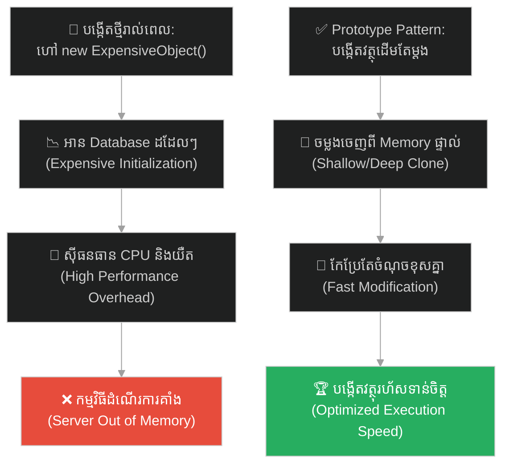
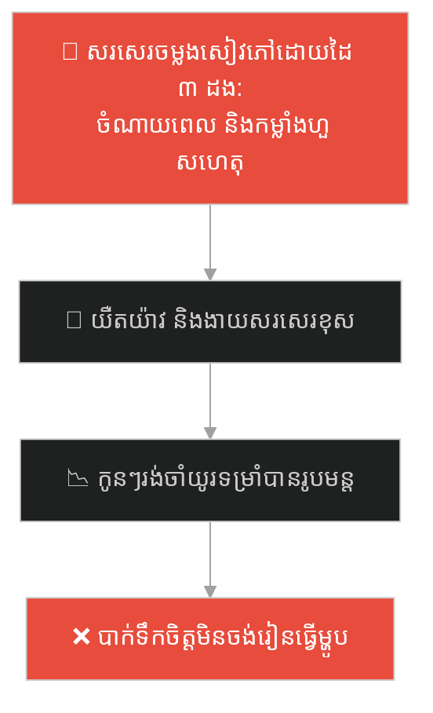
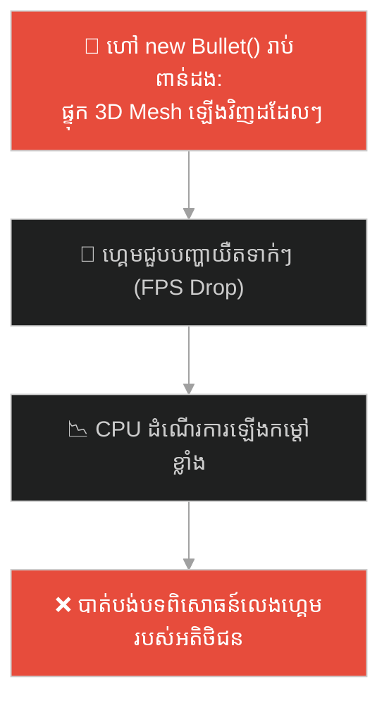
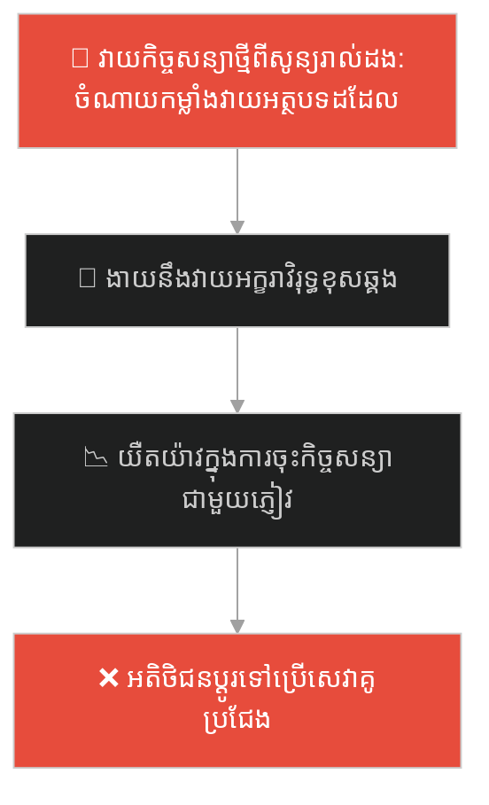
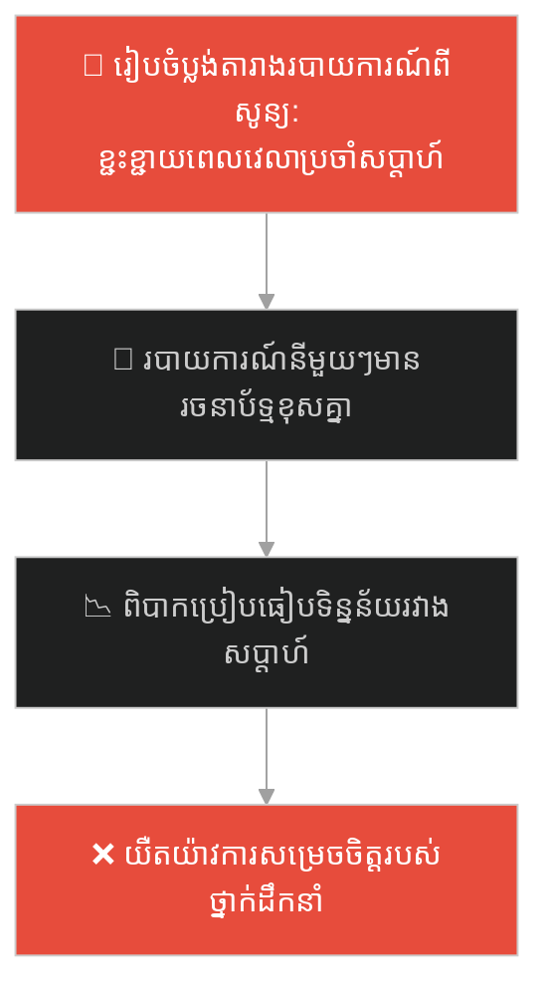
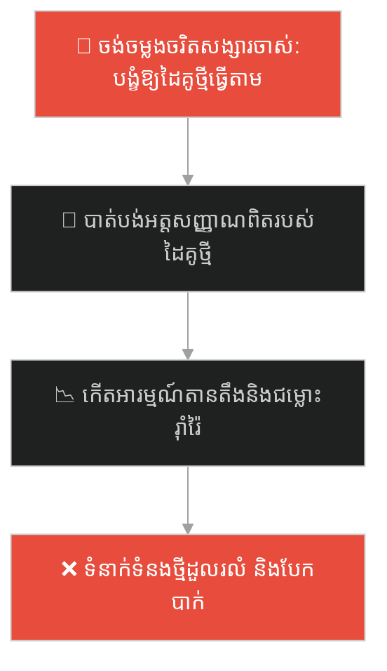
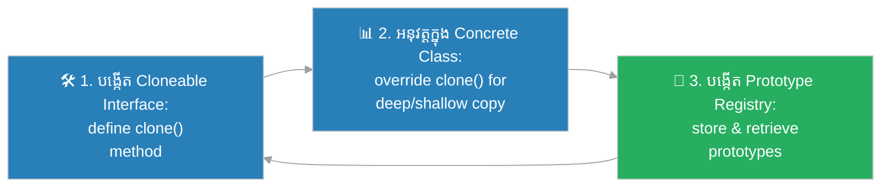

# Prototype Design Pattern (លំនាំរចនាថតចម្លងគំរូវត្ថុ)៖ វេទមន្តខ្ជិល និងមន្តអាគមថតចម្លង (Prototype Pattern & The Lazy Wizard)

**Author:** ichamrong  
**Date:** 2026-05-27  
**Tags:** #design-patterns #prototype #architecture #software-engineering #object-cloning #performance-tuning #clean-code #parable  
**Category:** Concepts / Parables  
**Read Time:** ~15 min  

---

## 📌 មាតិកា (Table of Contents)
- [អន្ទាក់ផ្លូវចិត្ត (The Trap)](#0)
- [១. រឿងព្រេងប្រវត្តិសាស្ត្រ៖ គ្រូមន្តអាគមខ្ជិល និងទ័ពគ្រោងឆ្អឹងម៉ឺននាក់ (The Legend of the Lazy Wizard)](#1)
  - [មន្តអាគមថតចម្លងគំរូ និងការកសាងទ័ពភ្លាមៗ (The Prototype Clone Spell)](#1-1)
- [២. បញ្ហា៖ ការបង្កើតវត្ថុចំណាយធនធានខ្ពស់ និងការទាញទិន្នន័យដដែលៗ (The Issue: Expensive Object Initialization)](#2)
- [៣. ឧទាហរណ៍ជាក់ស្តែងក្នុងពិភពពិត (Real World Examples)](#3)
  - [ឧទាហរណ៍ទី ១ — កម្រិតស្រាល (គ្រួសារ)៖ ការថតចម្លងរូបមន្តម្ហូបប្រចាំគ្រួសារ (The Shared Family Recipe Notebook)](#3-1)
  - [ឧទាហរណ៍ទី ២ — កម្រិតមធ្យម (បច្ចេកទេស)៖ ការបង្កើតគ្រាប់កាំភ្លើងក្នុងហ្គេម 2D (The 2D Game Bullet Spawner)](#3-2)
  - [ឧទាហរណ៍ទី ៣ — កម្រិតមធ្យម (ធុរកិច្ច)៖ គំរូកិច្ចសន្យាស្តង់ដារសម្រាប់អតិថិជន (The Standard Client Contract Template)](#3-3)
  - [ឧទាហរណ៍ទី ៤ — កម្រិតមធ្យម (សង្គម/គ្រប់គ្រង)៖ គំរូរបាយការណ៍វឌ្ឍនភាពការងារ (The Standard Sprint Report Template)](#3-4)
  - [ឧទាហរណ៍ទី ៥ — កម្រិតធ្ងន់ (ទំនាក់ទំនង)៖ ការរំពឹងទុកដៃគូឱ្យដូចមនុស្សចាស់ (The Ex-Partner Behavior Cloning Trap)](#3-5)
- [៤. ដំណោះស្រាយទូទៅ៖ ការអនុវត្ត Prototype Pattern តាមរយៈ Interface Clone (The General Solution: Prototype Pattern with Safe Cloning Mechanisms)](#4)
- [សេចក្តីសន្និដ្ឋាន (Conclusion)](#5)
- [ឯកសារយោង (References)](#6)
- [Related Posts](#7)

---

<a id="0"></a>
## អន្ទាក់ផ្លូវចិត្ត (The Trap)

តើអ្នកធ្លាប់ធុញទ្រាន់នឹងការកសាង ឬបង្កើតអ្វីមួយឡើងវិញពីចំណុចសូន្យ ដែលចំណាយពេល និងកម្លាំងដដែលៗ ខណៈដែលអ្នកអាចយករបស់ចាស់ដែលមានស្រាប់មកថតចម្លង និងកែប្រែបន្តិចបន្តួចបានដែរឬទេ?

នៅក្នុងរចនាសម្ព័ន្ធទិន្នន័យ និងការសរសេរកូដ៖
* **យើងងាយនឹងធ្លាក់ក្នុងអន្ទាក់** នៃការបង្កើត Object ថ្មីពីបាតដៃទទេ (Instantiation from scratch) ដែលតម្រូវឱ្យទាញទិន្នន័យពីប្រព័ន្ធណែនាំ ឬ Database ដដែលៗ (Expensive Initialization)។
* **យើងមើលរំលង** យន្តការចម្លង Object ពី Memory ដោយផ្ទាល់ (Deep Copy / Clone) ដែលលឿនជាង និងប្រើប្រាស់ធនធានតិចជាងការសាងសង់ថ្មីជាច្រើនដង។

ការចំណាយពេលសាងសង់អ្វីៗឡើងវិញពីចំណុចសូន្យដដែលៗ ហៅថា **អន្ទាក់បង្កើតវត្ថុថ្លៃថ្លា (Expensive Instantiation Trap)**។

ដើម្បីយល់ដឹងពីរបៀបដែលគ្រូមន្តអាគមដោះស្រាយវិបត្តិហៅទ័ពគ្រោងឆ្អឹង នេះជាផែនទីបង្ហាញផ្លូវ៖
1. **រឿងព្រេងប្រវត្តិសាស្ត្រ (The Historic Legend)** — រឿងរ៉ាវរបស់គ្រូមន្តអាគមដែលចង់ហៅទ័ពគ្រោងឆ្អឹងម្តងម្នាក់ៗ និងមន្តអាគមថតចម្លង។
2. **បញ្ហា (The Issue)** — ការវិភាគបញ្ហានៃការបង្កើត Object ដែលត្រូវការធនធាន CPU/Memory ខ្ពស់ក្នុង OOP។
3. **ឧទាហរណ៍ជាក់ស្តែងក្នុងពិភពពិត (Real World Examples)** — ពិនិត្យមើលអន្ទាក់នេះក្នុងកម្រិតគ្រួសារ បច្ចេកវិទ្យា ធុរកិច្ច ការគ្រប់គ្រង និងទំនាក់ទំនង។
4. **ដំណោះស្រាយទូទៅ (The General Solution)** — ការបង្កើត Cloneable Interface, ការអនុវត្ត Deep Copy vs. Shallow Copy និងការប្រើប្រាស់ Prototype Registry។



---

<a id="1"></a>
## ១. រឿងព្រេងប្រវត្តិសាស្ត្រ៖ គ្រូមន្តអាគមខ្ជិល និងទ័ពគ្រោងឆ្អឹងម៉ឺននាក់ (The Legend of the Lazy Wizard)

នៅក្នុងព្រៃអាថ៌កំបាំង មានគ្រូមន្តអាគមម្នាក់ (Wizard) ត្រូវការបង្កើតកងទ័ពគ្រោងឆ្អឹងចំនួន ១០,០០០ នាក់ដើម្បីការពារប្រាសាទរបស់ខ្លួនពីការវាយលុករបស់សត្រូវ។

ដើម្បីហៅគ្រោងឆ្អឹងមួយពីឋាននរក (តំណាងឱ្យការហៅ `new Skeleton()`) គាត់ត្រូវសូត្រមន្តយ៉ាងវែង ចំណាយថាមពល (Mana) យ៉ាងច្រើន និងត្រូវរង់ចាំអស់រយៈពេលជាច្រើនម៉ោង ទម្រាំគ្រោងឆ្អឹងមួយផុសចេញពីដី។

ប្រសិនបើគាត់ហៅគ្រោងឆ្អឹងទាំង ១០,០០០ នាក់តាមវិធីបុរាណនេះម្តងមួយៗ (Initialization from Scratch) គាត់ប្រាកដជាត្រូវស្លាប់ដោយសារអស់ថាមពល (Mana Exhaustion) តាំងពីមុនពេលសង្គ្រាមចាប់ផ្តើមទៅទៀត។ វានាំឱ្យខាតពេល និងចំណាយថាមពលហួសកម្រិត។

---

<a id="1-1"></a>
### មន្តអាគមថតចម្លងគំរូ និងការកសាងទ័ពភ្លាមៗ (The Prototype Clone Spell)

ប៉ុន្តែគ្រូមន្តអាគមរូបនេះឆ្លាតណាស់។ គាត់បានប្តូរយុទ្ធសាស្ត្រដឹកនាំការងារ។ 

គាត់បានចំណាយពេល និងថាមពលដ៏ច្រើនលើសលប់ដើម្បីបង្កើត **គ្រោងឆ្អឹងដើមតែមួយគត់ (The Prototype)** ឱ្យមានកម្លាំងខ្លាំងក្លា ពាក់អាវក្រោះដែកថែបពេញលេញ និងកាន់ដាវមុតស្រួច។ 

បន្ទាប់ពីគ្រោងឆ្អឹងគំរូទី ១ លេចរូបរាងឡើង គាត់ឈប់សូត្រមន្តហៅពីឋាននរកទៀតហើយ។ គាត់គ្រាន់តែប្រើប្រាស់ **មន្តអាគមថតចម្លងគំរូ (Clone Spell)** ទៅលើគ្រោងឆ្អឹងទី ១ នោះ។ 

ភ្លាមៗនោះ គ្រោងឆ្អឹងរាប់ពាន់បានបែកខ្លួនចេញមកជាបន្តបន្ទាប់ ដោយមានកម្លាំង អាវក្រោះ និងដាវដូចគ្រោងឆ្អឹងដើម ១០០%។ ការថតចម្លងនេះប្រើពេលត្រឹមតែ ១ វិនាទី និងមិនចំណាយថាមពល (Mana) សូម្បីតែបន្តិច ដែលនាំឱ្យគាត់អាចកសាងកងទ័ពបានភ្លាមៗ និងឈ្នះសង្គ្រាមទាំងស្រុង។

---

<a id="2"></a>
## ២. បញ្ហា៖ ការបង្កើតវត្ថុចំណាយធនធានខ្ពស់ និងការទាញទិន្នន័យដដែលៗ (The Issue: Expensive Object Initialization)

នៅក្នុងការសរសេរកូដកម្មវិធី មាន Object ខ្លះដែលពេលបង្កើតឡើង (Instantiation) ត្រូវការចំណាយធនធានប្រព័ន្ធខ្ពស់ខ្លាំង (Expensive Object Initialization)៖

```java
// គំរូកូដដែលគ្មាន Prototype
for (int i = 0; i < 10000; i++) {
    // មួយៗត្រូវទៅអាន file ឬ query database ដែលនាំឱ្យយឺតខ្លាំង
    ExpensiveProduct product = new ExpensiveProduct(); 
    product.loadFromDatabase(); 
}
```

* **Overhead លើប្រព័ន្ធទិន្នន័យ (Database/IO Overhead)៖** រាល់ពេលហៅ `new` កម្មវិធីត្រូវទៅទាញទិន្នន័យពី Database ឬអានឯកសារធំៗពី Hard Drive ដែលជាដំណើរការយឺតបំផុត (I/O Bound)។
* **ការខាតបង់ CPU លើការដំឡើងឡើងវិញ (Redundant Computations)៖** Object ទាំងនោះមានទិន្នន័យដូចគ្នា ៩៩% ទៅហើយ តែយើងនៅតែចង់ចំណាយ CPU គណនាវាឡើងវិញដដែលៗ។

**Prototype Design Pattern** ដោះស្រាយបញ្ហានេះដោយបង្កើត Object ដើមតែម្តងគត់ (Prototype) រួចប្រើប្រាស់យន្តការចម្លង Memory (Cloning) ដើម្បីបង្កើត Object ថ្មីៗដែលដូចគ្នាទាំងស្រុងដោយល្បឿនលឿនបំផុត។

---

<a id="3"></a>
## ៣. ឧទាហរណ៍ជាក់ស្តែងក្នុងពិភពពិត

---

<a id="3-1"></a>
### ឧទាហរណ៍ទី ១ — កម្រិតស្រាល (គ្រួសារ)៖ ការថតចម្លងរូបមន្តម្ហូបប្រចាំគ្រួសារ (The Shared Family Recipe Notebook)

ម្តាយម្នាក់ចង់ផ្តល់សៀវភៅរូបមន្តធ្វើម្ហូបសម្ងាត់ប្រចាំគ្រួសារដល់កូនៗទាំង ៣ នាក់។ ជំនួសឱ្យការអង្គុយសរសេរចម្លងសៀវភៅទាំងមូលឡើងវិញដោយដៃម្តងមួយចរិត ដែលចំណាយពេលរាប់សប្តាហ៍ គាត់បានយកសៀវភៅនោះទៅហាងកូពី រួចថតចម្លងជា ៣ ក្បាលភ្លាមៗ រួចឱ្យកូនម្នាក់ៗកត់ចំណាំបន្ថែមតាមតម្រូវការ។



ម្តាយបានប្រើសៀវភៅចាស់ជារូបភាពគំរូ (Prototype) និងប្រើប្រាស់ការថតចម្លង (Cloning) ដើម្បីសន្សំពេលវេលា។

---

<a id="3-2"></a>
### ឧទាហរណ៍ទី ២ — កម្រិតមធ្យម (បច្ចេកទេស)៖ ការបង្កើតគ្រាប់កាំភ្លើងក្នុងហ្គេម 2D (The 2D Game Bullet Spawner)

នៅក្នុងការសរសេរហ្គេមបាញ់ប្រហារ (Shooting Game) គ្រាប់កាំភ្លើងរាប់ពាន់គ្រាប់ត្រូវបានបង្កើតឡើងរាល់នាទី។ ជំនួសឱ្យការហៅ `new Bullet()` ដែលត្រូវដំឡើងរូបភាព 3D Mesh និងសម្លេងគ្រាប់កាំភ្លើងឡើងវិញរាល់ដង ហ្គេមប្រើប្រាស់ Prototype Pattern ដើម្បី Clone គ្រាប់កាំភ្លើងគំរូដែលមានស្រាប់ក្នុង Memory ភ្លាមៗ។



---

<a id="3-3"></a>
### ឧទាហរណ៍ទី ៣ — កម្រិតមធ្យម (ធុរកិច្ច)៖ គំរូកិច្ចសន្យាស្តង់ដារសម្រាប់អតិថិជន (The Standard Client Contract Template)

ក្រុមហ៊ុនផ្តល់សេវាកម្មច្បាប់ ត្រូវបង្កើតកិច្ចសន្យាសម្រាប់អតិថិជនរាប់រយនាក់។ ជំនួសឱ្យការវាយអត្ថបទកិច្ចសន្យាទាំង ៥០ ទំព័រឡើងវិញពីចំណុចសូន្យរាល់ដង ពួកគេប្រើប្រាស់ "កិច្ចសន្យាគំរូ" (Standard Template - Prototype) រួចចម្លងវា និងគ្រាន់តែប្តូរឈ្មោះ និងព័ត៌មានអតិថិជនថ្មីចូលជាការស្រេច។



---

<a id="3-4"></a>
### ឧទាហរណ៍ទី ៤ — កម្រិតមធ្យម (សង្គម/គ្រប់គ្រង)៖ គំរូរបាយការណ៍វឌ្ឍនភាពការងារ (The Standard Sprint Report Template)

នៅក្នុងការគ្រប់គ្រងគម្រោង Scrum Master ត្រូវសរសេររបាយការណ៍វាយតម្លៃរៀងរាល់ពីរសប្តាហ៍។ ជំនួសឱ្យការគូរតារាង និងរៀបចំប្លង់របាយការណ៍ថ្មីពីដំបូង ពួកគេប្រើប្រាស់ "Sprint Report Template" (Prototype) រួចចម្លងវា និងគ្រាន់តែបំពេញទិន្នន័យជាក់ស្តែងរបស់សប្តាហ៍នោះចូល។



---

<a id="3-5"></a>
### ឧទាហរណ៍ទី ៥ — កម្រិតធ្ងន់ (ទំនាក់ទំនង)៖ ការរំពឹងទុកដៃគូឱ្យដូចមនុស្សចាស់ (The Ex-Partner Behavior Cloning Trap)

នៅក្នុងទំនាក់ទំនងថ្មី បុគ្គលម្នាក់តែងតែប្រៀបធៀប និងរំពឹងទុកឱ្យដៃគូបច្ចុប្បន្ន មានចរិតលក្ខណៈ ទម្លាប់ចាយវាយ និងរបៀបនិយាយស្តីដូចគ្នាទាំងស្រុងទៅនឹងសង្សារចាស់របស់ខ្លួន (Cloning the Ex)។ ពួកគេព្យាយាមកែប្រែដៃគូថ្មីឱ្យទៅជា "គំរូសង្សារចាស់" ដែលនេះបង្កើតជាការឈឺចាប់ និងការមិនគោរពតម្លៃផ្ទាល់ខ្លួនរបស់ដៃគូបច្ចុប្បន្នឡើយ។



---

<a id="4"></a>
## ៤. ដំណោះស្រាយទូទៅ៖ ការអនុវត្ត Prototype Pattern តាមរយៈ Interface Clone (The General Solution: Prototype Pattern with Safe Cloning Mechanisms)

ដើម្បីធានាថាការថតចម្លង Object ពី Memory ប្រព្រឹត្តទៅដោយសុវត្ថិភាព និងល្បឿនលឿន យើងត្រូវអនុវត្តលំនាំរចនា **Prototype Pattern**៖



ជំហាននៃការអនុវត្ត៖
1. **បង្កើត Prototype Interface៖** បង្កើត Interface រួមមួយ (ដូចជា Interface `Prototype` ឬប្រើ `Cloneable` ក្នុង Java) ដែលមាន Method `clone()` ត្រឡប់ប្រភេទ Object នោះមកវិញ។
2. **Override លើ Method `clone()`៖** នៅក្នុង Class ជាក់ស្តែង ត្រូវសរសេរកូដចម្លង Object ឱ្យបានត្រឹមត្រូវ៖
   * **Shallow Copy៖** ចម្លងតែតម្លៃវាលកម្រិតក្រៅ (Primitives)។ វត្ថុយោង (References) នឹងត្រូវប្រើប្រាស់រួមគ្នា ដែលអាចបង្កហានិភ័យបើកែប្រែ។
   * **Deep Copy (អនុសាសន៍)៖** បង្កើត Object ថ្មីសម្រាប់រាល់វាលយោងទាំងអស់ ដើម្បីធានាថា Object ថ្មីដាច់ដោយឡែកពី Object ចាស់ ១០០% និងគ្មានការពាក់ព័ន្ធគ្នាឡើយ។
3. **បង្កើត Prototype Registry ( اختيار)៖** បង្កើត Class មួយសម្រាប់ផ្ទុក Object គំរូទាំងអស់ (ដូចជា Cache Map) ដើម្បីឱ្យ Client ងាយស្រួលទាញយកមកចម្លងប្រើប្រាស់។

---

## 🐇 ធ្លាក់ចូលក្នុងរន្ធទន្សាយ (Enter the Rabbit Hole)

ដើម្បីស្វែងយល់ពីរបៀបដែលភ្ញៀវទេសចរម្នាក់ បានចូលទៅហាងកាហ្វេដ៏ល្បីល្បាញមួយ ដើម្បីសាកល្បងរសជាតិកាហ្វេខ្មៅដ៏សាមញ្ញ តែត្រូវឆ្លងកាត់ការសួរនាំ និងការរង់ចាំយូរ (Simplifying Complexity and Facade Pattern) សូមបន្តដំណើរទៅកាន់៖

* 🚀 **[ចាប់ផ្តើមដំណើររុករក (Start the Journey) ➔ Facade Pattern and Simplifying Complexity](./80-the-american-tourist.md)**

---

<a id="5"></a>
## សេចក្តីសន្និដ្ឋាន (Conclusion)

> **«កុំបង្កើតកង់សាជាថ្មី ប្រសិនបើអ្នកមានកង់គំរូដ៏ល្អឥតខ្ចោះនៅក្នុងដៃរួចទៅហើយ។ ចូរចម្លងវា និងបន្តទៅមុខ។»**

ចូរធ្វើខ្លួនជាវិស្វករកម្មវិធីដែលយល់ដឹងពីល្បឿន និងប្រសិទ្ធភាពនៃប្រព័ន្ធ (Performance Optimization)។ ការអនុវត្ត Prototype Design Pattern មិនត្រឹមតែជួយឱ្យ Server របស់អ្នកដំណើរការបានលឿនប៉ុណ្ណោះទេ ប៉ុន្តែវាក៏ជួយសន្សំសំចៃធនធានតភ្ជាប់ប្រព័ន្ធទិន្នន័យ (I/O Bound) យ៉ាងច្រើនមហាសាលផងដែរ។

---

<a id="6"></a>
## ឯកសារយោង (References)

* **Erich Gamma, Richard Helm, Ralph Johnson, John Vlissides** — *Design Patterns: Elements of Reusable Object-Oriented Software* (1994). Prototype Design Pattern Chapter.
* **Martin Fowler** — *Patterns of Enterprise Application Architecture: Lazy Load and Object Copying* (2002).
* **Joshua Bloch** — *Effective Java: Item 13 (Override clone judiciously)* (2018).

---

<a id="7"></a>
## Related Posts

* **[79 Prototype Pattern: Efficient Memory Cloning](../articles/79-prototype-pattern.md)** — អត្ថបទវិទ្យាសាស្ត្រលម្អិត និងឧទាហរណ៍កូដ Java/C# នៃការអនុវត្ត Deep Copy/Shallow Copy ក្នុងកម្មវិធីធំៗ។
* **[52 The Best Part is No Part](./52-the-best-part-is-no-part.md)** — ការកាត់បន្ថយតម្រូវការបង្កើត និងរក្សាភាពសាមញ្ញ។
* **[44 The Gordian Knot](./44-the-gordian-knot.md)** — គោលការណ៍រក្សាភាពសាមញ្ញ (KISS Principle) និងការចៀសវាងភាពស្មុគស្មាញ។

---

## Related

- [💡 Concepts README](../README.md)
- [📚 Main Repository README](../../../README.md)
- [Developer Habits](../../developer-habits/README.md)
- [Mental Health & Well-being](../../mental-health/README.md)
- [Management & SDLC](../../management/README.md)
