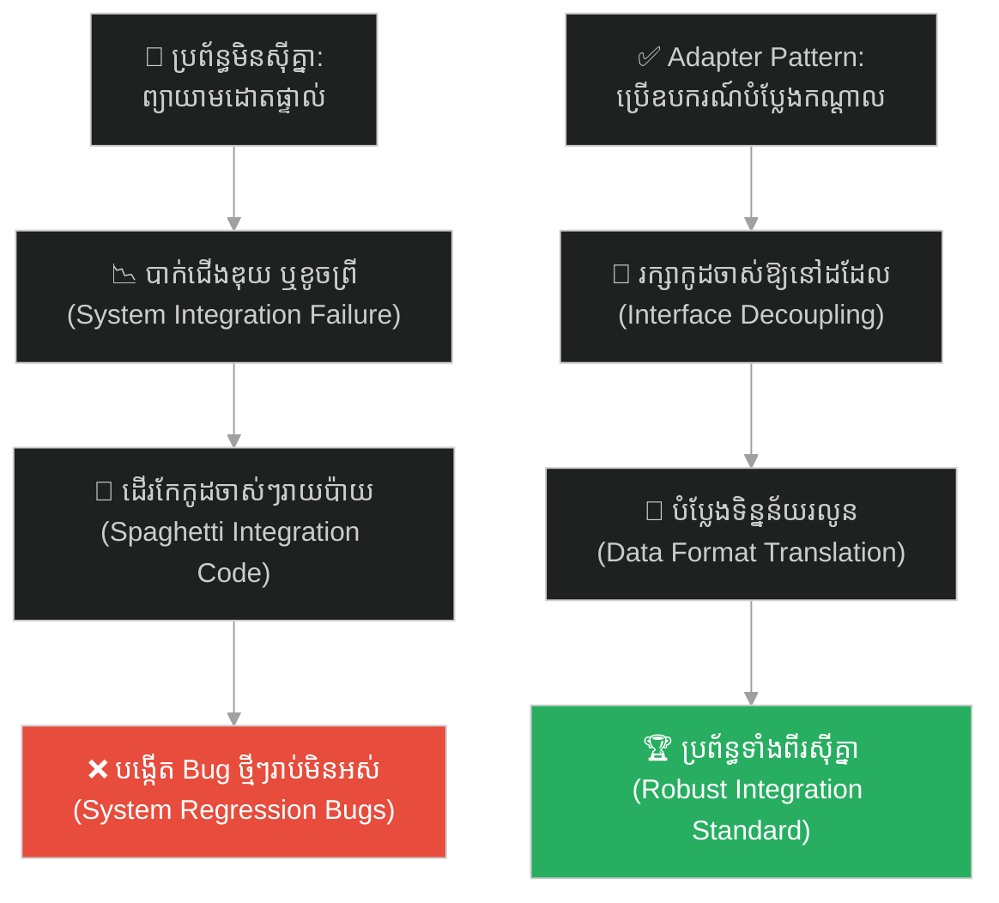
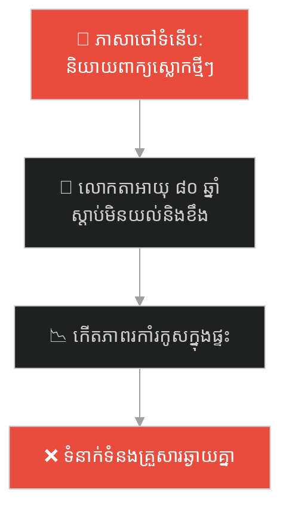
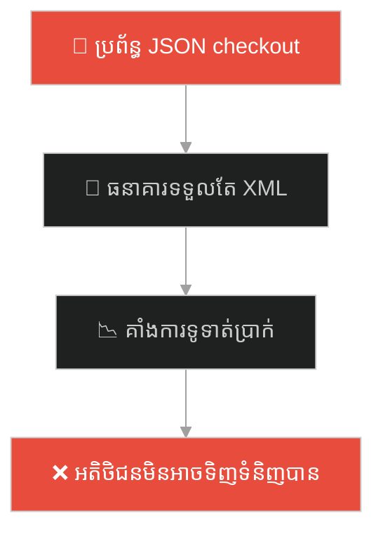
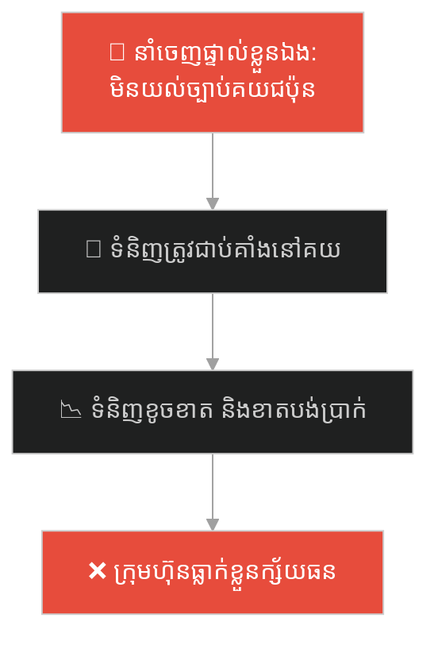
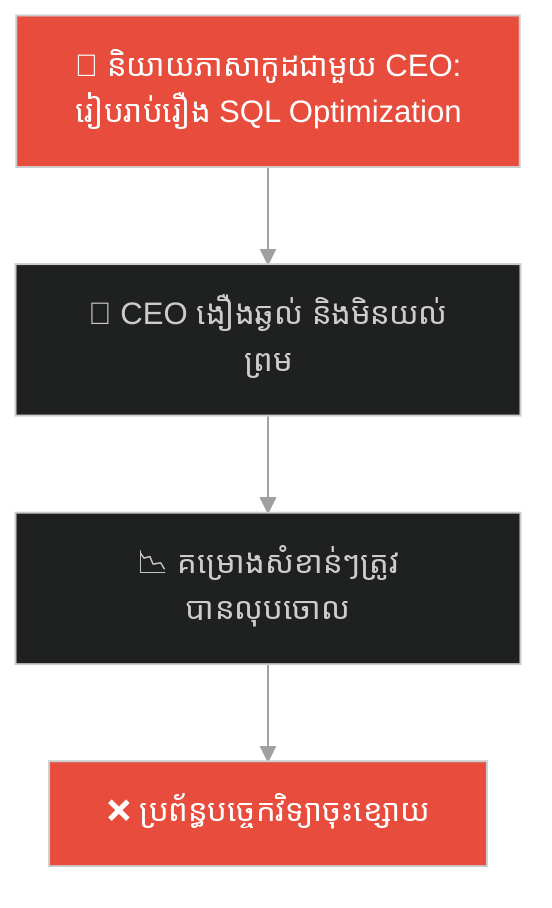
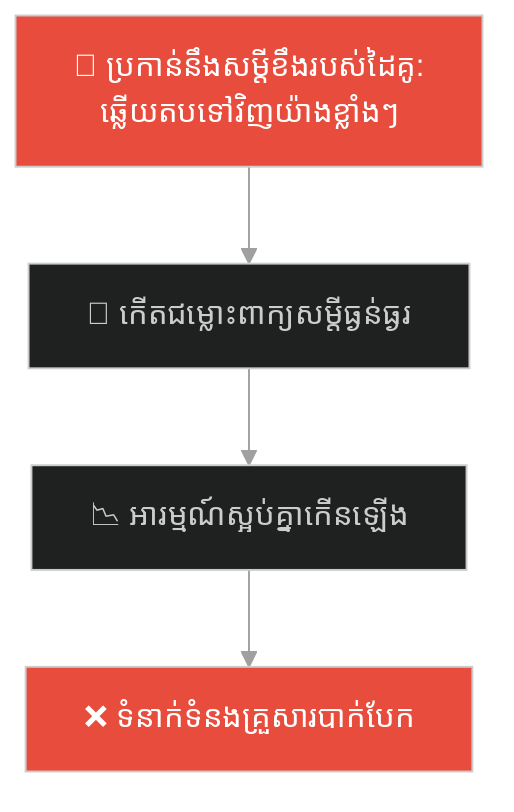
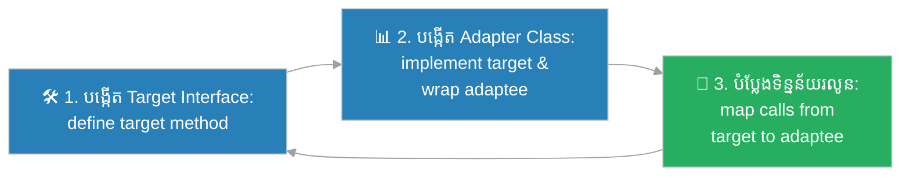

# Adapter Design Pattern (លំនាំរចនាឧបករណ៍បំប្លែង)៖ អ្នកទេសចរអាមេរិក និងឌុយភ្លើង (Adapter Pattern & The American Tourist)

**Author:** ichamrong  
**Date:** 2026-05-27  
**Tags:** #design-patterns #adapter #architecture #software-engineering #parable  
**Category:** Concepts / Parables  
**Read Time:** ~15 min  

---

## 📌 មាតិកា (Table of Contents)
- [អន្ទាក់ផ្លូវចិត្ត (The Trap)](#0)
- [១. រឿងព្រេងប្រវត្តិសាស្ត្រ៖ អ្នកទេសចរអាមេរិក និងឌុយភ្លើងនៅអឺរ៉ុប (The Legend of the American Tourist)](#1)
  - [ឧបករណ៍បំប្លែង និងការដោះស្រាយបញ្ហាភ្លាមៗ (The Adapter Solution)](#1-1)
- [២. បញ្ហា៖ ភាពមិនស៊ីគ្នានៃ Interface និងការចំណាយលើការកែប្រែប្រព័ន្ធ (The Issue: Incompatible Interfaces)](#2)
- [៣. ឧទាហរណ៍ជាក់ស្តែងក្នុងពិភពពិត (Real World Examples)](#3)
  - [ឧទាហរណ៍ទី ១ — កម្រិតស្រាល (គ្រួសារ)៖ ការបកប្រែពាក្យស្លោករបស់ក្មេងៗជូនលោកតា (The Dialect Translator for Grandpa)](#3-1)
  - [ឧទាហរណ៍ទី ២ — កម្រិតមធ្យម (បច្ចេកទេស)៖ ការរួមបញ្ចូល API ទូទាត់ចាស់ XML ទៅប្រព័ន្ធថ្មី JSON (Integrating Legacy XML API to JSON System)](#3-2)
  - [ឧទាហរណ៍ទី ៣ — កម្រិតមធ្យម (ធុរកិច្ច)៖ ការប្រើប្រាស់ភ្នាក់ងារក្នុងស្រុកដើម្បីនាំចេញទំនិញ (Using a Local Agency for Trade Compliance)](#3-3)
  - [ឧទាហរណ៍ទី ៤ — កម្រិតមធ្យម (សង្គម/គ្រប់គ្រង)៖ ការបកប្រែបច្ចេកទេសស្មុគស្មាញជាសូចនាករអាជីវកម្ម (Translating System Tech to Business Metrics)](#3-4)
  - [ឧទាហរណ៍ទី ៥ — កម្រិតធ្ងន់ (ទំនាក់ទំនង)៖ ការបកប្រែការនិយាយស្តីបែបការពារខ្លួនឱ្យទៅជាការស្ថាបនា (Translating Defensive Chat to Constructive Feedback)](#3-5)
- [៤. ដំណោះស្រាយទូទៅ៖ ការអនុវត្ត Adapter Pattern តាមរយៈ Class/Object Adapter (The General Solution: Adapter Pattern with Wrapper Classes)](#4)
- [សេចក្តីសន្និដ្ឋាន (Conclusion)](#5)
- [ឯកសារយោង (References)](#6)
- [Related Posts](#7)

---

<a id="0"></a>
## អន្ទាក់ផ្លូវចិត្ត (The Trap)

តើអ្នកធ្លាប់ជួបបញ្ហាដែលប្រព័ន្ធពីរ ឬសមាសភាគពីរដំណើរការបានល្អរៀងៗខ្លួន ប៉ុន្តែមិនអាចធ្វើការរួមគ្នាបាន ដោយសារទម្រង់ទិន្នន័យ ឬវិធីទំនាក់ទំនងខុសគ្នាដែរឬទេ?

នៅក្នុងការអភិវឌ្ឍកម្មវិធី៖
* **យើងងាយនឹងធ្លាក់ក្នុងអន្ទាក់** នៃការដើរកែសម្រួលកូដចាស់ៗ ឬសមាសភាគខាងក្រៅ (3rd-party libraries) ឱ្យត្រូវគ្នា ដែលនាំឱ្យកូដកាន់តែស្មុគស្មាញ ងាយនឹងបង្កើតកំហុសថ្មីៗ និងខាតពេលវេលា។
* **យើងមើលរំលង** ការបង្កើតស្រទាប់កណ្តាល (Intermediate Layer) ដើម្បីបកប្រែភាសា ឬសម្របសម្រួលទំនាក់ទំនងដោយមិនបាច់ប៉ះពាល់ដល់កូដដើមឡើយ។

ការព្យាយាមសម្របសម្រួលប្រព័ន្ធពីរដែលមិនស៊ីគ្នាដោយការដើរកែកូដរបស់ភាគីទាំងសងខាង ហៅថា **អន្ទាក់កែកូដប្រព័ន្ធមិនស៊ីគ្នា (Incompatible Interface Modification Trap)**។

ដើម្បីយល់ដឹងពីរបៀបសម្របសម្រួលទំនាក់ទំនងនេះ ផែនទីបង្ហាញផ្លូវមានដូចខាងក្រោម៖
1. **រឿងព្រេងប្រវត្តិសាស្ត្រ (The Historic Legend)** — រឿងរ៉ាវរបស់អ្នកទេសចរអាមេរិកដែលមានឧបករណ៍ជើងសំប៉ែត តែជួបព្រីភ្លើងរន្ធមូលនៅអឺរ៉ុប។
2. **បញ្ហា (The Issue)** — ការវិភាគភាពមិនស៊ីគ្នានៃ Interface និងការចំណាយខ្ពស់លើការដើរកែប្រែសមាសភាគនីមួយៗ។
3. **ឧទាហរណ៍ជាក់ស្តែងក្នុងពិភពពិត (Real World Examples)** — ពិនិត្យមើលទំនាក់ទំនងនេះតាមរយៈកម្រិតគ្រួសារ បច្ចេកវិទ្យា ធុរកិច្ច ការគ្រប់គ្រង និងទំនាក់ទំនង។
4. **ដំណោះស្រាយទូទៅ (The General Solution)** — ការអនុវត្ត Adapter Pattern ដើម្បីបង្កើតកូដសម្របសម្រួលដែលប្រកបដោយសុវត្ថិភាព។



---

<a id="1"></a>
## ១. រឿងព្រេងប្រវត្តិសាស្ត្រ៖ អ្នកទេសចរអាមេរិក និងឌុយភ្លើងនៅអឺរ៉ុប (The Legend of the American Tourist)

មានអ្នកទេសចរជាតិអាមេរិកម្នាក់ បានធ្វើដំណើរទៅកាន់ទ្វីបអឺរ៉ុបដើម្បីសម្រាកលំហែកាយ និងបំពេញការងារពីចម្ងាយ។ ពេលទៅដល់បន្ទប់សណ្ឋាគារ គាត់ចង់សាកថ្មកុំព្យូទ័រយួរដៃរបស់គាត់ដើម្បីធ្វើការងារបន្ទាន់។

ទោះជាយ៉ាងណា គាត់ត្រូវជួបនឹងបញ្ហាដ៏ធំមួយ៖ ឌុយសាកថ្មកុំព្យូទ័ររបស់គាត់ជាប្រភេទ **ជើងសំប៉ែត (Flat Prong Plug)** ដែលជាស្តង់ដារប្រើប្រាស់នៅសហរដ្ឋអាមេរិក។ ចំណែកឯព្រីភ្លើងនៅលើជញ្ជាំងបន្ទប់សណ្ឋាគារនៅអឺរ៉ុប គឺជាប្រភេទ **រន្ធមូល (Round Socket)** ដែលជាស្តង់ដារអឺរ៉ុប។ 

គាត់មិនអាចយកឌុយជើងសំប៉ែតទៅរុកចូលក្នុងរន្ធមូលបានឡើយ។ បញ្ហានេះបានធ្វើឱ្យគាត់មិនអាចសាកថ្មកុំព្យូទ័របានឡើយ ទោះបីជាប្រភពអគ្គិសនីសណ្ឋាគារ និងកុំព្យូទ័ររបស់គាត់សុទ្ធតែដំណើរការល្អរៀងៗខ្លួនក៏ដោយ។

---

<a id="1-1"></a>
### ឧបករណ៍បំប្លែង និងការដោះស្រាយបញ្ហាភ្លាមៗ (The Adapter Solution)

អ្នកទេសចរមានជម្រើសខ្លះៗ ប៉ុន្តែជម្រើសភាគច្រើនសុទ្ធតែមិនអាចទៅរួច៖
1. គាត់មិនអាចកាត់ក្បាលខ្សែសាកកុំព្យូទ័រតម្លៃរាប់រយដុល្លាររបស់គាត់ចោល ហើយយកខ្សែភ្លើងទៅតភ្ជាប់ផ្ទាល់ជាមួយជញ្ជាំងបានទេ (មិនអាចកែប្រែប្រព័ន្ធដើម)។
2. គាត់ក៏មិនអាចហៅជាងមកវាយកម្ទេចជញ្ជាំងសណ្ឋាគារដើម្បីប្តូរព្រីភ្លើងអឺរ៉ុបឱ្យទៅជាព្រីភ្លើងស្តង់ដារអាមេរិកបានដែរ (មិនអាចកែប្រែប្រព័ន្ធ 3rd-Party)។

ដំណោះស្រាយដ៏ឆ្លាតវៃ និងងាយស្រួលបំផុតគឺ គាត់បានដើរទៅហាងលក់ទំនិញក្បែរនោះ រួចទិញ **ឧបករណ៍បំប្លែងជើងឌុយ (Power Adapter)** មួយគ្រាប់។ 

* ផ្នែកម្ខាងនៃ Adapter មាន **រន្ធសំប៉ែត** ដែលអាចទទួលឌុយសាកកុំព្យូទ័រអាមេរិកបានយ៉ាងល្អ។
* ផ្នែកម្ខាងទៀតមាន **ជើងមូល** ដែលអាចដោតចូលទៅក្នុងព្រីភ្លើងជញ្ជាំងអឺរ៉ុបបានយ៉ាងម៉ឺងម៉ាត់។

ឧបករណ៍បកប្រែកណ្តាលនេះ បានជួយឱ្យចរន្តអគ្គិសនីហូរចូលកុំព្យូទ័របានយ៉ាងរលូន ដោយមិនបាច់កែប្រែរចនាសម្ព័ន្ធកុំព្យូទ័រ ឬព្រីភ្លើងសណ្ឋាគារឡើយ។

---

<a id="2"></a>
## ២. បញ្ហា៖ ភាពមិនស៊ីគ្នានៃ Interface និងការចំណាយលើការកែប្រែប្រព័ន្ធ (The Issue: Incompatible Interfaces)

នៅក្នុងការសរសេរកូដកម្មវិធី ឬស្ថាបត្យកម្មប្រព័ន្ធ (Software Architecture) បញ្ហានេះកើតឡើងជាញឹកញាប់នៅពេលយើងត្រូវការរួមបញ្ចូល (Integrate) សមាសភាគពីរផ្សេងគ្នា៖

```java
// កូដបច្ចុប្បន្នរំពឹងទុក Interface ទូទាត់ប្រាក់ដុល្លារ
interface USPaymentGateway {
    void payInDollars(double amount);
}

// ប៉ុន្តែសេវាកម្មថ្មីដែលចង់រួមបញ្ចូល បែរជាគិតជាសេន
class EuroPaymentGateway {
    void chargeInCents(int cents) {
        System.out.println("Charged: " + cents + " cents");
    }
}
```

* **ការដើរកែកូដចាស់ៗរាប់រយកន្លែង (High Refactoring Cost)៖** ប្រសិនបើយើងព្យាយាមកែកូដដែលមានស្រាប់ទាំងអស់ឱ្យស្របទៅតាម API ថ្មី វានឹងបង្កើតជាភាពស្មុគស្មាញ និងត្រូវការធ្វើតេស្តឡើងវិញទាំងអស់។
* **មិនអាចកែប្រែរបស់ 3rd-Party បាន (Closed Source Constraints)៖** ជារឿយៗ យើងមិនអាចចូលទៅកែកូដរបស់ Library ខាងក្រៅដែលយើងទាញយកមកប្រើប្រាស់បានឡើយ។

**Adapter Design Pattern** ដោះស្រាយបញ្ហានេះដោយដាក់ Class សម្របសម្រួលមួយ (Adapter class) នៅកណ្តាល ដើម្បីធ្វើជាអ្នកបកប្រែរវាង Interface ចាស់ និងថ្មី។

---

<a id="3"></a>
## ៣. ឧទាហរណ៍ជាក់ស្តែងក្នុងពិភពពិត

---

<a id="3-1"></a>
### ឧទាហរណ៍ទី ១ — កម្រិតស្រាល (គ្រួសារ)៖ ការបកប្រែពាក្យស្លោករបស់ក្មេងៗជូនលោកតា (The Dialect Translator for Grandpa)

នៅក្នុងគ្រួសារមួយ លោកតាមានអាយុ ៨០ ឆ្នាំនិយាយស្តីភាសាបុរាណ ចំណែកចៅប្រុសអាយុ ១៥ ឆ្នាំនិយាយតែភាសាស្លោកទំនើបៗរបស់យុវវ័យសម័យថ្មី។ ពេលពួកគេនិយាយគ្នា ម្នាក់ៗតែងតែងឿងឆ្ងល់ និងមិនយល់ពីគ្នាឡើយ។ ម្តាយក៏ដើរតួជា "អ្នកសម្របសម្រួល (Adapter)" បកប្រែពាក្យយុវវ័យឱ្យលោកតាយល់ និងពន្យល់ចៅពីចរិតលោកតា។



ម្តាយបានធ្វើជាអ្នកបកប្រែសម្របសម្រួល (Adapter) ដើម្បីតភ្ជាប់ភាសារវាងជំនាន់ពីរផ្សេងគ្នា។

---

<a id="3-2"></a>
### ឧទាហរណ៍ទី ២ — កម្រិតមធ្យម (បច្ចេកទេស)៖ ការរួមបញ្ចូល API ទូទាត់ចាស់ XML ទៅប្រព័ន្ធថ្មី JSON (Integrating Legacy XML API to JSON System)

ប្រព័ន្ធ checkout របស់ក្រុមហ៊ុនមួយត្រូវការបញ្ជូនទិន្នន័យទូទាត់ប្រាក់ក្នុងទម្រង់ JSON ប៉ុន្តែសេវាកម្មទូទាត់ប្រាក់របស់ធនាគារដៃគូ ទទួលយកតែទិន្នន័យទម្រង់ XML ប៉ុណ្ណោះ។ ជំនួសឱ្យការសរសេរប្រព័ន្ធ checkout ឡើងវិញ ក្រុមការងារបានបង្កើត XML Payment Adapter មួយដើម្បីបំប្លែងទិន្នន័យ។



---

<a id="3-3"></a>
### ឧទាហរណ៍ទី ៣ — កម្រិតមធ្យម (ធុរកិច្ច)៖ ការប្រើប្រាស់ភ្នាក់ងារក្នុងស្រុកដើម្បីនាំចេញទំនិញ (Using a Local Agency for Trade Compliance)

ក្រុមហ៊ុនផលិតផលកសិកម្មមួយចង់នាំចេញទំនិញទៅកាន់ប្រទេសជប៉ុន។ ប៉ុន្តែពួកគេមិនយល់ច្បាស់ពីលិខិតបទដ្ឋានគតិយុត្ត និងច្បាប់គយស្មុគស្មាញរបស់ជប៉ុនឡើយ។ ពួកគេបានសម្រេចចិត្តជួល "ភ្នាក់ងារគយអាជីព (Custom Broker/Adapter)" ដែលយល់ដឹងពីច្បាប់ទាំងសងខាង ដើម្បីបំពេញបែបបទជំនួសក្រុមហ៊ុនផលិតកម្ម។



---

<a id="3-4"></a>
### ឧទាហរណ៍ទី ៤ — កម្រិតមធ្យម (សង្គម/គ្រប់គ្រង)៖ ការបកប្រែបច្ចេកទេសស្មុគស្មាញជាសូចនាករអាជីវកម្ម (Translating System Tech to Business Metrics)

ប្រធានក្រុមបច្ចេកទេស (Tech Lead) ត្រូវរាយការណ៍អំពីល្បឿន Render ទិន្នន័យរបស់ Server ជូននាយកប្រតិបត្តិ (CEO) ដែលមិនយល់ពីភាសាកូដទាល់តែសោះ។ Tech Lead ឆ្លាតវៃ បានប្រើប្រាស់ Adapter Strategy ដោយបកប្រែពាក្យបច្ចេកទេសស្មុគស្មាញ (Latency, SQL Index) ទៅជាសូចនាករអាជីវកម្មវិញ (Conversion Rate, Infrastructure Cost Savings)។



---

<a id="3-5"></a>
### ឧទាហរណ៍ទី ៥ — កម្រិតធ្ងន់ (ទំនាក់ទំនង)៖ ការបកប្រែការនិយាយស្តីបែបការពារខ្លួនឱ្យទៅជាការស្ថាបនា (Translating Defensive Chat to Constructive Feedback)

នៅក្នុងទំនាក់ទំនងប្តីប្រពន្ធ ពេលខ្លះដៃគូម្នាក់និយាយស្តីបែបការពារខ្លួន (Defensive Tone) ដោយសារមានការហត់នឿយនឹងការងារ។ ដៃគូម្នាក់ទៀតយល់ដឹងពីសិល្បៈទំនាក់ទំនង បានធ្វើជា "ត្រចៀក Adapter" ដោយបកប្រែការនិយាយស្តីនោះ ឱ្យទៅជាតម្រូវការអារម្មណ៍ពិតប្រាកដ និងជួយដោះស្រាយបញ្ហាជាមួយគ្នាដោយក្តីរីករាយ។



---

<a id="4"></a>
## ៤. ដំណោះស្រាយទូទៅ៖ ការអនុវត្ត Adapter Pattern តាមរយៈ Class/Object Adapter (The General Solution: Adapter Pattern with Wrapper Classes)

ដើម្បីដោះស្រាយភាពមិនស៊ីគ្នារវាងសមាសភាគពីរ យើងត្រូវអនុវត្តលំនាំរចនា **Adapter Pattern**៖



ជំហាននៃការអនុវត្ត៖
1. **កំណត់ Target Interface៖** បង្កើត Interface ដែល Client រំពឹងទុក និងចង់ប្រើប្រាស់។
2. **បង្កើត Adapter Class៖** បង្កើត Class ថ្មីមួយដែល implements យក Target Interface នោះ និង wrap យក instance របស់ Adaptee (សមាសភាគដែលមិនស៊ីគ្នា)។
3. **សរសេរ Method សម្របសម្រួល៖** នៅក្នុង Adapter Class ត្រូវសរសេរ Method បកប្រែទិន្នន័យ ឬ Call parameters ឱ្យស្របតាមទម្រង់ដែល Adaptee ត្រូវការ រួចបញ្ជូនទិន្នន័យបន្តទៅឱ្យវា។

---

## 🐇 ធ្លាក់ចូលក្នុងរន្ធទន្សាយ (Enter the Rabbit Hole)

ដើម្បីស្វែងយល់ពីរបៀបដែលហាងកាហ្វេដ៏ល្បីល្បាញមួយ បានផ្លាស់ប្តូរវិធីរៀបចំបញ្ជីមុខម្ហូប និងកាត់បន្ថយភាពស្មុគស្មាញនៃការបង្កើតជម្រើសភេសជ្ជៈរាប់រយមុខ (Class Explosion) តាមរយៈការបន្ថែមគ្រឿងផ្សំជាស្រទាប់ៗថាមវន្ត (Dynamic Augmentation) សូមបន្តដំណើរទៅកាន់៖

* 🚀 **[ចាប់ផ្តើមដំណើររុករក (Start the Journey) ➔ Decorator Pattern and Dynamic Augmentation](./81-the-naked-coffee.md)**

---

<a id="5"></a>
## សេចក្តីសន្និដ្ឋាន (Conclusion)

> **«កុំព្យាយាមវាយកម្ទេចជញ្ជាំង ដើម្បីគ្រាន់តែដោតឌុយភ្លើងមួយគ្រាប់។ ចូរប្រើប្រាស់ឧបករណ៍បំប្លែងដ៏សាមញ្ញ និងមានសុវត្ថិភាព។»**

ចូរធ្វើខ្លួនជាវិស្វករកម្មវិធីដែលយល់ដឹងពីសិល្បៈនៃការតភ្ជាប់សមាសភាគដោយសន្តិវិធី (Decoupled Integration)។ ការអនុវត្ត Adapter Design Pattern មិនត្រឹមតែជួយឱ្យប្រព័ន្ធរបស់អ្នកស៊ីគ្នាយ៉ាងរលូនប៉ុណ្ណោះទេ ប៉ុន្តែវាក៏ជួយរក្សាស្ថិរភាព និងភាពស្អាតស្អំនៃប្រព័ន្ធចាស់របស់អ្នកឱ្យនៅដដែលផងដែរ។

---

<a id="6"></a>
## ឯកសារយោង (References)

* **Erich Gamma, Richard Helm, Ralph Johnson, John Vlissides** — *Design Patterns: Elements of Reusable Object-Oriented Software* (1994). Adapter Design Pattern Chapter.
* **Martin Fowler** — *Patterns of Enterprise Application Architecture: Data Mapper and Adapter Patterns* (2002).
* **Robert C. Martin** — *Clean Code: A Handbook of Agile Software Craftsmanship* (2008).

---

<a id="7"></a>
## Related Posts

* **[80 Adapter Pattern: Connecting Legacy Systems](../articles/80-adapter-pattern.md)** — អត្ថបទវិទ្យាសាស្ត្រលម្អិត និងការអនុវត្តកូដ Java/C# សម្រាប់ប្រព័ន្ធធំៗ។
* **[79 The Lazy Wizard and the Clone Spell](./79-the-lazy-wizard-and-the-clone-spell.md)** — ការថតចម្លង Object ពី Memory ដោយសុវត្ថិភាព និងប្រសិទ្ធភាព។
* **[64 The Swiss Army Knife](./64-the-swiss-army-knife.md)** — ការចៀសវាងភាពស្មុគស្មាញ និងការរក្សាមុខងារជាក់លាក់។

---

## Related

- [💡 Concepts README](../README.md)
- [📚 Main Repository README](../../../README.md)
- [Developer Habits](../../developer-habits/README.md)
- [Mental Health & Well-being](../../mental-health/README.md)
- [Management & SDLC](../../management/README.md)
