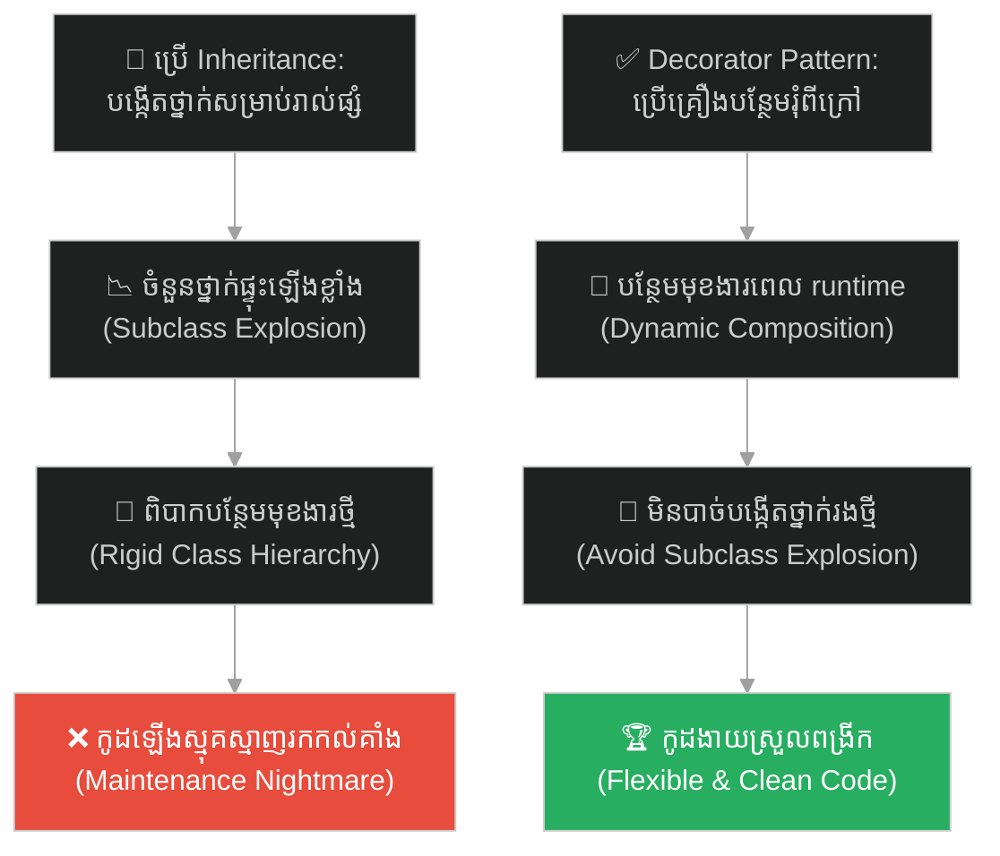
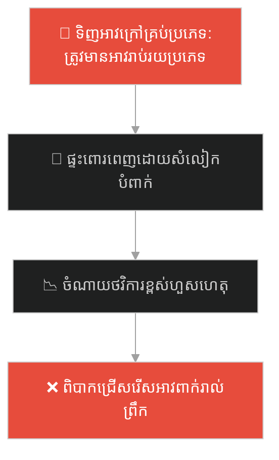
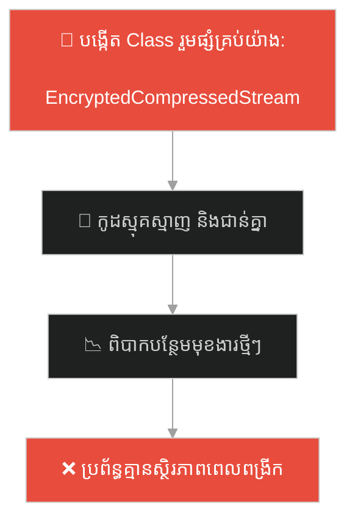
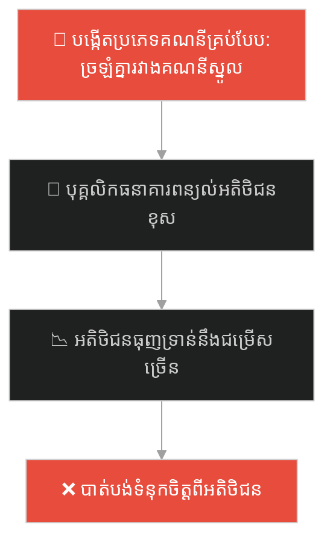
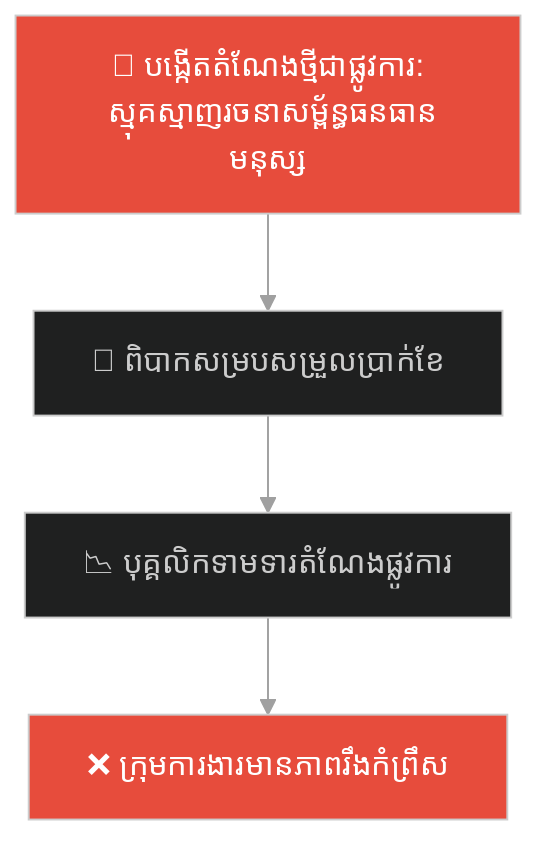
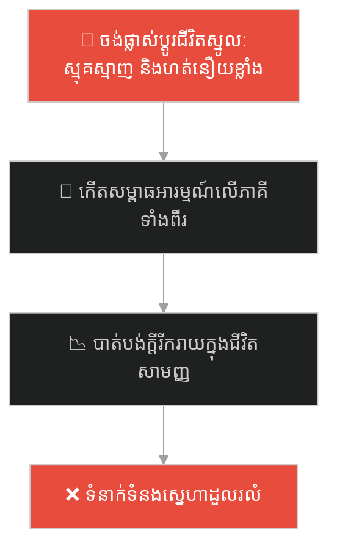
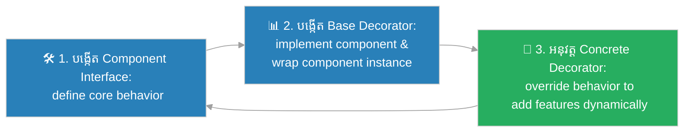

# Decorator Design Pattern (លំនាំរចនាតុបតែងបន្ថែម)៖ កាហ្វេខ្មៅ និងគ្រឿងបន្ថែម (Decorator Pattern & The Naked Coffee)

**Author:** ichamrong  
**Date:** 2026-05-27  
**Tags:** #design-patterns #decorator #architecture #software-engineering #parable  
**Category:** Concepts / Parables  
**Read Time:** ~15 min  

---

## 📌 មាតិកា (Table of Contents)
- [អន្ទាក់ផ្លូវចិត្ត (The Trap)](#0)
- [១. រឿងព្រេងប្រវត្តិសាស្ត្រ៖ ម៉ឺនុយដ៏រញ៉េរញ៉ៃរាប់ពាន់មុខ និងការបង្កើតហាងកាហ្វេ (The Legend of the Naked Coffee)](#1)
  - [ការរុំបន្ថែមពីខាងក្រៅ និងការសម្របសម្រួលតម្លៃ (The Wrapping Add-ons)](#1-1)
- [២. បញ្ហា៖ ការកើនឡើងថ្នាក់រងហួសកម្រិត និងភាពរឹងនៃកូដ (The Issue: Subclass Explosion)](#2)
- [៣. ឧទាហរណ៍ជាក់ស្តែងក្នុងពិភពពិត (Real World Examples)](#3)
  - [ឧទាហរណ៍ទី ១ — កម្រិតស្រាល (គ្រួសារ)៖ ការពាក់អាវរងាបន្ថែមស្រទាប់តាមអាកាសធាតុ (Layering Winter Clothes for Kids)](#3-1)
  - [ឧទាហរណ៍ទី ២ — កម្រិតមធ្យម (បច្ចេកទេស)៖ ការរុំស្ទ្រីមទិន្នន័យដោយការដំឡើងកូដសម្ងាត់ និងការបង្ហាប់ (Wrapping Data Stream with Encryption and Compression)](#3-2)
  - [ឧទាហរណ៍ទី ៣ — កម្រិតមធ្យម (ធុរកិច្ច)៖ កញ្ចប់ធានារ៉ាប់រងបន្ថែមពីលើគណនីធនាគារស្នូល (Bank Account with Insurance Add-ons)](#3-3)
  - [ឧទាហរណ៍ទី ៤ — កម្រិតមធ្យម (សង្គម/គ្រប់គ្រង)៖ ការប្រគល់តួនាទីបណ្តោះអាសន្នបន្ថែមពីលើការងារស្នូល (Adding Temporary Sprint Roles to Devs)](#3-4)
  - [ឧទាហរណ៍ទី ៥ — កម្រិតធ្ងន់ (ទំនាក់ទំនង)៖ ការបន្ថែមសកម្មភាពយកចិត្តទុកដាក់ក្នុងជីវិតប្រចាំថ្ងៃ (Adding Loving Gestures to Daily Routines)](#3-5)
- [៤. ដំណោះស្រាយទូទៅ៖ ការអនុវត្ត Decorator Pattern តាមរយៈ Wrapper Objects (The General Solution: Decorator Pattern with Dynamic Wrapping)](#4)
- [សេចក្តីសន្និដ្ឋាន (Conclusion)](#5)
- [ឯកសារយោង (References)](#6)
- [Related Posts](#7)

---

<a id="0"></a>
## អន្ទាក់ផ្លូវចិត្ត (The Trap)

តើអ្នកធ្លាប់ជួបបញ្ហាដែលអ្នកត្រូវការបង្កើតវត្ថុ ឬមុខងារដែលមានការរួមផ្សំគ្នាជាច្រើនបែបច្រើនយ៉ាង រហូតដល់ថ្នាក់បង្កើតកូដ ឬថ្នាក់រង (Subclasses) រាប់រយសម្រាប់រាល់ការរួមផ្សំគ្នានីមួយៗដែរឬទេ?

នៅក្នុងការរចនាកូដកម្មវិធី៖
* **យើងងាយនឹងធ្លាក់ក្នុងអន្ទាក់** នៃការប្រើប្រាស់ការស្នងមរតក (Inheritance) ដើម្បីពង្រីកមុខងារ ដែលនាំឱ្យចំនួនថ្នាក់រងកើនឡើងជាគុណគុណ (Combinatorial Explosion of Subclasses) ធ្វើឱ្យប្រព័ន្ធរឹងកំព្រឹស និងពិបាកគ្រប់គ្រង។
* **យើងមើលរំលង** យន្តការតុបតែងបន្ថែមជាស្រទាប់ៗតាមបែបថាមវន្ត (Dynamic Composition/Wrapping) ដែលអនុញ្ញាតឱ្យយើងបន្ថែមមុខងារ ឬឥរិយាបថថ្មីៗបានយ៉ាងបត់បែននៅពេលដំណើរការកម្មវិធី (Runtime)។

ការប្រើប្រាស់ Inheritance ហួសកម្រិតដើម្បីរៀបចំរាល់ការរួមផ្សំគ្នានៃមុខងារ ហៅថា **អន្ទាក់ផ្ទុះចំនួនថ្នាក់រង (Subclass Explosion Trap)**។

ដើម្បីយល់ដឹងពីរបៀបតុបតែង និងពង្រីកមុខងារប្រកបដោយភាពបត់បែន នេះជាផែនទីបង្ហាញផ្លូវ៖
1. **រឿងព្រេងប្រវត្តិសាស្ត្រ (The Historic Legend)** — រឿងរ៉ាវរបស់ហាងកាហ្វេដែលធ្លាក់ក្នុងវិបត្តិនៃការបង្កើតម៉ឺនុយរាប់រយមុខសម្រាប់កាហ្វេ និងគ្រឿងលាយ។
2. **បញ្ហា (The Issue)** — ការវិភាគការកើនឡើងចំនួនថ្នាក់រងហួសកម្រិតក្នុង OOP និងភាពរឹងរបស់ប្រព័ន្ធ។
3. **ឧទាហរណ៍ជាក់ស្តែងក្នុងពិភពពិត (Real World Examples)** — ពិនិត្យមើលបញ្ហានេះក្នុងកម្រិតគ្រួសារ បច្ចេកវិទ្យា ធុរកិច្ច ការគ្រប់គ្រង និងទំនាក់ទំនង។
4. **ដំណោះស្រាយទូទៅ (The General Solution)** — ការអនុវត្ត Decorator Pattern ដើម្បីបង្កើត Wrapper Objects ដែលបត់បែន និងធន់នឹងការផ្លាស់ប្តូរ។



---

<a id="1"></a>
## ១. រឿងព្រេងប្រវត្តិសាស្ត្រ៖ ម៉ឺនុយដ៏រញ៉េរញ៉ៃរាប់ពាន់មុខ និងការបង្កើតហាងកាហ្វេ (The Legend of the Naked Coffee)

មានហាងកាហ្វេដ៏ល្បីល្បាញមួយ បានបើកដំណើរការដោយជោគជ័យ។ កាលពីដំបូង ហាងនេះមានលក់តែកាហ្វេខ្មៅសុទ្ធសាមញ្ញមួយមុខគត់ (Black Coffee)។

ទោះជាយ៉ាងណា ដើម្បីបំពេញចិត្តអតិថិជនកាន់តែច្រើន ម្ចាស់ហាងបានចាប់ផ្តើមបន្ថែមគ្រឿងផ្សំផ្សេងៗ។ ពេលមានភ្ញៀវចង់បានទឹកដោះគោ គាត់ក៏បង្កើតម៉ឺនុយថ្មីមួយឈ្មោះថា `Milk Coffee`។ ពេលមានភ្ញៀវចង់បានស្ករ គាត់បង្កើត `Sugar Coffee`។ 

មិនយូរប៉ុន្មាន ភ្ញៀវចង់បានការលាយបញ្ចូលគ្នាកាន់តែស្មុគស្មាញ។ ម្ចាស់ហាងត្រូវបង្ខំចិត្តសរសេរម៉ឺនុយថ្មីៗបន្ថែមជាបន្តបន្ទាប់៖
* `Milk Sugar Coffee`
* `Milk Vanilla Coffee`
* `Sugar Vanilla Caramel Coffee`

នៅពេលដែលហាងបន្ថែមគ្រឿងផ្សំថ្មីមួយមុខទៀត (ដូចជា គ្រាប់គុជ ឬក្រែម) ម្ចាស់ហាងត្រូវរៀបចំការរួមផ្សំថ្មីៗទាំងអស់ ដែលធ្វើឱ្យបញ្ជីម៉ឺនុយរបស់ពួកគេកើនឡើងដល់ ៥១២ មុខឯណោះ! ភ្ញៀវដែលចូលមកទិញត្រូវចំណាយពេលមើលបញ្ជីម៉ឺនុយដ៏វែងអនឡាយ ចំណែកអ្នកឆុងកាហ្វេក៏ត្រូវវិលមុខខ្លាំង ព្រោះតែរូបមន្តកាហ្វេរាប់រយមុខដែលត្រូវចងចាំ។

---

<a id="1-1"></a>
### ការរុំបន្ថែមពីខាងក្រៅ និងការសម្របសម្រួលតម្លៃ (The Wrapping Add-ons)

ម្ចាស់ហាងថ្មីដែលទើបតែចូលមកគ្រប់គ្រង បានមើលឃើញពីភាពគ្មានប្រសិទ្ធភាពនេះ។ គាត់បានសម្រេចចិត្តលុបចោលបញ្ជីម៉ឺនុយដ៏រញ៉េរញ៉ៃទាំង ៥១២ មុខនោះចោលទាំងអស់។

គាត់បានត្រឡប់ទៅរកភាពសាមញ្ញដើមវិញ ដោយរក្សាទុកម៉ឺនុយស្នូលតែ **១ មុខគត់** គឺ៖ `Black Coffee` (កាហ្វេនាកែត/កាហ្វេស្រាត) ក្នុងតម្លៃ ២ ដុល្លារ។ 

បន្ទាប់មក គាត់បង្កើត **គ្រឿងតុបតែងបន្ថែម (Decorators/Add-ons)** ដាក់ដាច់ដោយឡែកពីគ្នា៖
* `Milk` (+១ ដុល្លារ)
* `Sugar` (+០.៥ ដុល្លារ)
* `Vanilla` (+១.៥ ដុល្លារ)

នៅពេលភ្ញៀវម្នាក់ចង់បាន "កាហ្វេទឹកដោះគោបន្ថែមរសជាតិវ៉ានីឡា" អ្នកឆុងកាហ្វេលែងពិបាកទៀតហើយ។ គាត់គ្រាន់តែយកកែវ `Black Coffee` ដើម មករុំបន្ថែមដោយ `Milk` រួចយកទៅរុំបន្ថែមដោយ `Vanilla` ជាស្រទាប់ៗពីខាងក្រៅ។

នៅពេលគិតលុយ៖
* ស្រទាប់ក្រៅបង្អស់ `Vanilla` បូកតម្លៃខ្លួនឯង (១.៥ ដុល្លារ) រួចសួរតម្លៃទៅកាន់ស្រទាប់ខាងក្នុង `Milk`។
* ស្រទាប់ `Milk` បូកតម្លៃខ្លួនឯង (១ ដុល្លារ) រួចសួរតម្លៃទៅកាន់ `Black Coffee`។
* `Black Coffee` ឆ្លើយថាតម្លៃខ្លួន (២ ដុល្លារ)។
* សរុបតម្លៃកាហ្វេទាំងមូល = ៤.៥ ដុល្លារ។ 

វិធីនេះជួយឱ្យហាងកាហ្វេដំណើរការបានលឿន មិនបាច់បង្កើតមុខម្ហូបថ្មីៗរាប់រយមុខ និងអនុញ្ញាតឱ្យភ្ញៀវអាចបង្កើតកាហ្វេតាមការចង់បានរាប់ពាន់របៀបដោយសេរី។

---

<a id="2"></a>
## ២. បញ្ហា៖ ការកើនឡើងថ្នាក់រងហួសកម្រិត និងភាពរឹងនៃកូដ (The Issue: Subclass Explosion)

នៅក្នុងការសរសេរកូដ OOP ភាពស្មុគស្មាញនេះកើតឡើងនៅពេលយើងប្រើប្រាស់ការស្នងមរតក (Inheritance) ដើម្បីដោះស្រាយការរួមផ្សំគ្នានៃមុខងារ៖

```java
// ការប្រើប្រាស់ Inheritance នាំឱ្យចំនួន Class កើនឡើងជាលំដាប់
class BlackCoffee {}
class MilkCoffee extends BlackCoffee {}
class SugarCoffee extends BlackCoffee {}
class MilkSugarCoffee extends MilkCoffee {}
// ហានិភ័យខ្ពស់នៃការបង្កើតកូដស្ទួន និងពិបាកគ្រប់គ្រង
```

* **ការកើនឡើង Class ឥតឈប់ឈរ (Class Proliferation)៖** រាល់ពេលបន្ថែមលក្ខណៈពិសេសថ្មី យើងត្រូវបង្កើត Class ថ្មីៗរាប់សិបដើម្បីគាំទ្រការរួមផ្សំគ្នាទាំងអស់។
* **កង្វះភាពបត់បែនពេលដំណើរការកម្មវិធី (Rigidity at Runtime)៖** យើងមិនអាចបន្ថែម ឬដកមុខងារចេញពី Object មួយបានឡើយនៅពេលកម្មវិធីកំពុងដំណើរការ ព្រោះឥរិយាបថត្រូវបានកំណត់ជាស្រេចតាំងពីដំណាក់កាល Compile។

**Decorator Design Pattern** ជួយដោះស្រាយបញ្ហានេះដោយប្រើប្រាស់យន្តការ **Composition** ជំនួសឱ្យ Inheritance ដោយអនុញ្ញាតឱ្យយើងរុំ Object មួយនៅក្នុង Object មួយទៀតជាស្រទាប់ៗយ៉ាងងាយស្រួល។

---

<a id="3"></a>
## ៣. ឧទាហរណ៍ជាក់ស្តែងក្នុងពិភពពិត

---

<a id="3-1"></a>
### ឧទាហរណ៍ទី ១ — កម្រិតស្រាល (គ្រួសារ)៖ ការពាក់អាវរងាបន្ថែមស្រទាប់តាមអាកាសធាតុ (Layering Winter Clothes for Kids)

ម្តាយម្នាក់រៀបចំសំលៀកបំពាក់ឱ្យកូនប្រុសមុនពេលទៅសាលារៀនក្នុងរដូវរងា។ ជំនួសឱ្យការទិញអាវធំក្រាស់ៗរាប់សិបប្រភេទសម្រាប់រាល់កម្រិតភាពត្រជាក់ (អាវធំទូទៅ អាវធំមានមួក អាវធំការពារទឹកភ្លៀង) គាត់បានពាក់អាវធម្មតាឱ្យកូន រួចរុំថែមដោយអាវរោមចៀម ហើយពាក់អាវធំការពារខ្យល់ពីខាងក្រៅជាស្រទាប់ៗតាមអាកាសធាតុជាក់ស្តែង។



ម្តាយបានប្រើវិធីសាស្រ្តតុបតែងបន្ថែម (Decorator style) ដោយបន្ថែមអាវជាស្រទាប់ៗយ៉ាងងាយស្រួល។

---

<a id="3-2"></a>
### ឧទាហរណ៍ទី ២ — កម្រិតមធ្យម (បច្ចេកទេស)៖ ការរុំស្ទ្រីមទិន្នន័យដោយការដំឡើងកូដសម្ងាត់ និងការបង្ហាប់ (Wrapping Data Stream with Encryption and Compression)

នៅក្នុងការសរសេរកម្មវិធីផ្ញើសារ ស្ទ្រីមទិន្នន័យ (Data Stream) ត្រូវការបំពេញមុខងារផ្សេងៗគ្នាដូចជា បង្ហាប់ទិន្នន័យ (Compression) ការពារកូដសម្ងាត់ (Encryption) និងការកត់ត្រាដំណើរការ (Logging)។ ជំនួសឱ្យការបង្កើត Class ស្មុគស្មាញ វិស្វករបានប្រើ Decorators ដើម្បីរុំ `TextStream` ជាស្រទាប់ៗតាមតម្រូវការ។



---

<a id="3-3"></a>
### ឧទាហរណ៍ទី ៣ — កម្រិតមធ្យម (ធុរកិច្ច)៖ កញ្ចប់ធានារ៉ាប់រងបន្ថែមពីលើគណនីធនាគារស្នូល (Bank Account with Insurance Add-ons)

ធនាគារមួយចង់ផ្តល់សេវាកម្មដល់អតិថិជន។ ជំនួសឱ្យការបង្កើតប្រភេទគណនីធនាគាររាប់សិបប្រភេទ (គណនីសន្សំមានធានារ៉ាប់រងឡាន គណនីសន្សំមានធានារ៉ាប់រងជីវិត) ធនាគារបានរក្សាទុក "គណនីសន្សំស្នូល (Core Savings Account)" តែមួយ រួចអនុញ្ញាតឱ្យអតិថិជនជាវកញ្ចប់ធានារ៉ាប់រងបន្ថែមជាស្រទាប់ៗតាមចិត្ត។



---

<a id="3-4"></a>
### ឧទាហរណ៍ទី ៤ — កម្រិតមធ្យម (សង្គម/គ្រប់គ្រង)៖ ការប្រគល់តួនាទីបណ្តោះអាសន្នបន្ថែមពីលើការងារស្នូល (Adding Temporary Sprint Roles to Devs)

នៅក្នុងការគ្រប់គ្រងក្រុមការងារ ជំនួសឱ្យការបង្កើតតំណែងផ្លូវការថ្មីៗរាល់ពេល (តំណែងវិស្វករកម្មវិធីបូកនឹងអ្នកសម្របសម្រួល តំណែងវិស្វករកម្មវិធីបូកនឹងអ្នកវាយតម្លៃកូដ) ប្រធានក្រុមបានរក្សាតួនាទីស្នូលជា "Software Engineer" រួចបន្ថែមតួនាទីបណ្តោះអាសន្ន (Sprint Lead, Code Reviewer) ទៅលើបុគ្គលិកនីមួយៗជាស្រទាប់ៗតាមដង្ហើមការងារ។



---

<a id="3-5"></a>
### ឧទាហរណ៍ទី ៥ — កម្រិតធ្ងន់ (ទំនាក់ទំនង)៖ ការបន្ថែមសកម្មភាពយកចិត្តទុកដាក់ក្នុងជីវិតប្រចាំថ្ងៃ (Adding Loving Gestures to Daily Routines)

នៅក្នុងទំនាក់ទំនងស្នេហា ជំនួសឱ្យការរំពឹងទុកថាយើងត្រូវផ្លាស់ប្តូរជីវិតរស់នៅស្នូលទាំងស្រុង ឬបង្កើតកម្មវិធីដើរលេងធំដុំដ៏ល្អឥតខ្ចោះរាល់សប្តាហ៍ ដៃគូទាំងសងខាងបានរក្សាជីវិតរស់នៅប្រចាំថ្ងៃដ៏សាមញ្ញ រួចតុបតែងបន្ថែមដោយកាយវិការតូចៗ (ការសរសេរសំបុត្រខ្លីៗ ការជួយលាងចាន ការម៉ាស្សាស្មា) ដើម្បីបង្កើតក្តីស្រឡាញ់រឹងមាំ។



---

<a id="4"></a>
## ៤. ដំណោះស្រាយទូទៅ៖ ការអនុវត្ត Decorator Pattern តាមរយៈ Wrapper Objects (The General Solution: Decorator Pattern with Dynamic Wrapping)

ដើម្បីពង្រីកមុខងារដោយបត់បែន និងជៀសវាងការផ្ទុះឡើងនៃចំនួន Class យើងត្រូវអនុវត្តលំនាំរចនា **Decorator Pattern**៖



ជំហាននៃការអនុវត្ត៖
1. **បង្កើត Component Interface៖** បង្កើត Interface រួមមួយដែលទាំង Object ស្នូល និង Decorators ត្រូវអនុវត្តតាម។
2. **បង្កើត Base Decorator Class៖** បង្កើត Class មួយដែល implements យក Component Interface និង wrap យក instance របស់ Component នោះ។
3. **បង្កើត Concrete Decorators៖** បង្កើត Class បន្ថែមដែលស្នងពី Base Decorator ដើម្បីបន្ថែមមុខងារជាក់លាក់ (ដូចជា បង្ហាប់ទិន្នន័យ បន្ថែមតម្លៃកាហ្វេ) ដោយហៅ Method របស់ Object ខាងក្នុង រួចបន្ថែមឥរិយាបថរបស់ខ្លួនពីលើវា។

---

## 🐇 ធ្លាក់ចូលក្នុងរន្ធទន្សាយ (Enter the Rabbit Hole)

ដើម្បីស្វែងយល់ពីរបៀបដែលភោជនីយដ្ឋានលំដាប់ពិភពលោកមួយ បានសម្រួលភាពស្មុគស្មាញនៃការរៀបចំម្ហូបអាហារ និងការបញ្ជាទិញរបស់អតិថិជន ដោយលាក់បាំងដំណើរការដ៏សែនស្មុគស្មាញរបស់ផ្ទះបាយនៅពីក្រោយ "អ្នករត់តុដ៏ឆ្លាតវៃម្នាក់" (Facade Pattern) សូមបន្តដំណើរទៅកាន់៖

* 🚀 **[ចាប់ផ្តើមដំណើររុករក (Start the Journey) ➔ Facade Pattern and Simplifying Complexity](./82-the-restaurant-waiter.md)**

---

<a id="5"></a>
## សេចក្តីសន្និដ្ឋាន (Conclusion)

> **«កុំបង្កើតថ្នាក់រងថ្មីមួយរាល់ពេលដែលអ្នកចង់បន្ថែមគ្រឿងលាយ។ ចូរចេះប្រើកាយវិការរុំបន្ថែមជាស្រទាប់ៗ ដើម្បីរក្សាភាពស្អាតស្អំនៃប្រព័ន្ធរបស់អ្នក។»**

ចូរធ្វើខ្លួនជាវិស្វករកម្មវិធីដែលយល់ដឹងពីសិល្បៈនៃការបង្កើតប្រព័ន្ធដែលអាចបត់បែនបានខ្ពស់ (Extensible Systems)។ ការអនុវត្ត Decorator Design Pattern មិនត្រឹមតែជួយការពារប្រព័ន្ធរបស់អ្នកពីការផ្ទុះឡើងនៃចំនួន Class ប៉ុណ្ណោះទេ ប៉ុន្តែវាក៏អនុញ្ញាតឱ្យអ្នកបន្ថែមលក្ខណៈពិសេសថ្មីៗបានយ៉ាងរលូន និងមិនប៉ះពាល់ដល់ស្ថិរភាពប្រព័ន្ធដើមឡើយ។

---

<a id="6"></a>
## ឯកសារយោង (References)

* **Erich Gamma, Richard Helm, Ralph Johnson, John Vlissides** — *Design Patterns: Elements of Reusable Object-Oriented Software* (1994). Decorator Design Pattern Chapter.
* **Robert C. Martin** — *Clean Architecture: A Craftsman's Guide to Software Structure and Design* (2017).
* **Joshua Bloch** — *Effective Java: Item 18 (Favor composition over inheritance)* (2018).

---

<a id="7"></a>
## Related Posts

* **[81 Decorator Pattern: Dynamic Behavior Augmentation](../articles/81-decorator-pattern.md)** — អត្ថបទវិទ្យាសាស្ត្រលម្អិត និងឧទាហរណ៍កូដ Java/C# សម្រាប់ការតុបតែងស្ទ្រីមទិន្នន័យ។
* **[80 The American Tourist](./80-the-american-tourist.md)** — ការសម្របសម្រួលប្រព័ន្ធពីរដែលមិនស៊ីគ្នាឱ្យធ្វើការជាមួយគ្នាយ៉ាងរលូន។
* **[64 The Swiss Army Knife](./64-the-swiss-army-knife.md)** — ការរក្សាភាពសាមញ្ញ និងការចៀសវាងភាពចង្អៀតណែននៃមុខងារប្រព័ន្ធ។

---

## Related

- [💡 Concepts README](../README.md)
- [📚 Main Repository README](../../../README.md)
- [Developer Habits](../../developer-habits/README.md)
- [Mental Health & Well-being](../../mental-health/README.md)
- [Management & SDLC](../../management/README.md)
