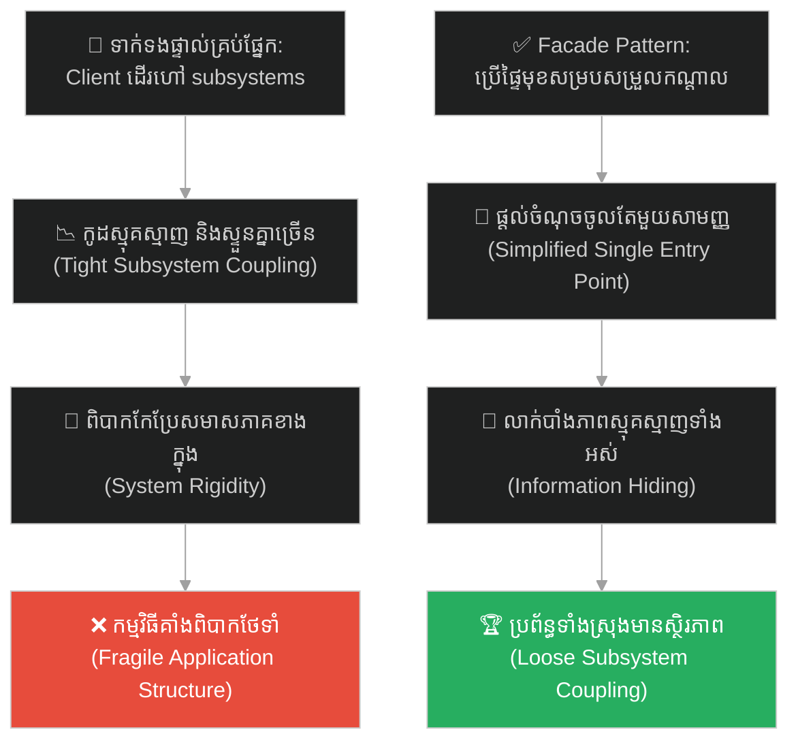
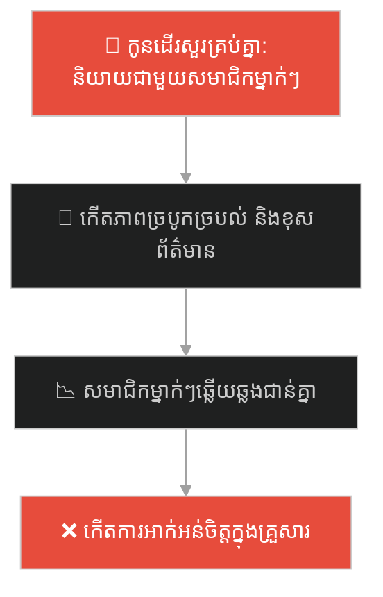
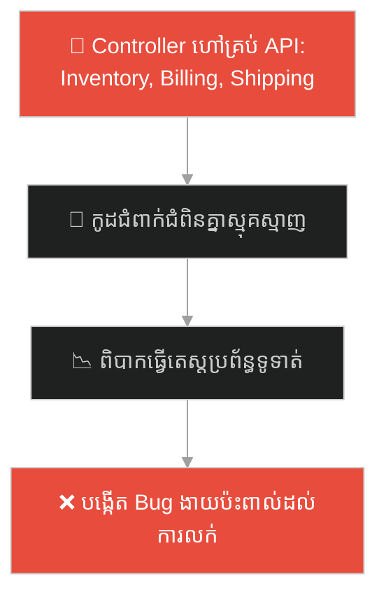
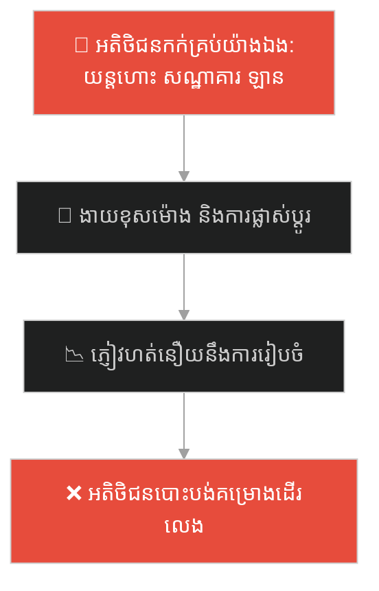
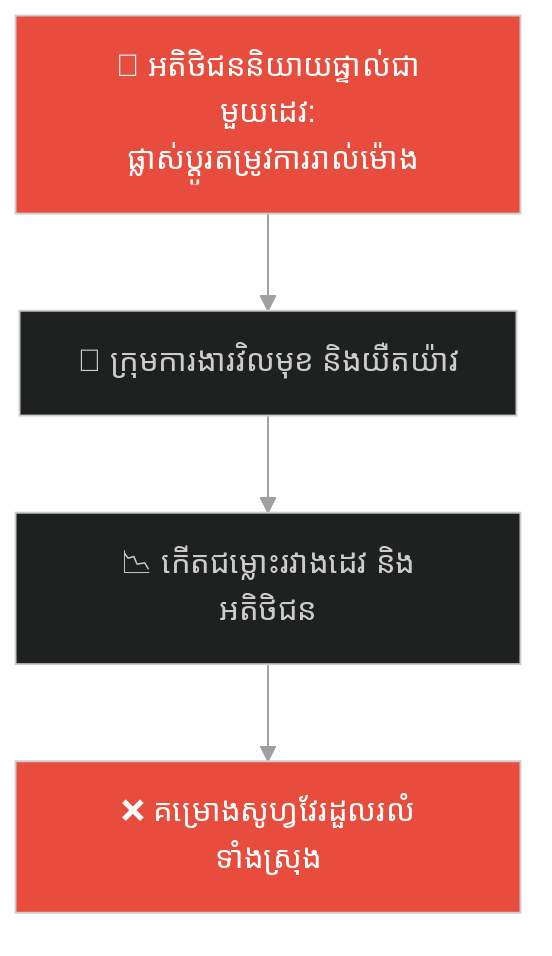
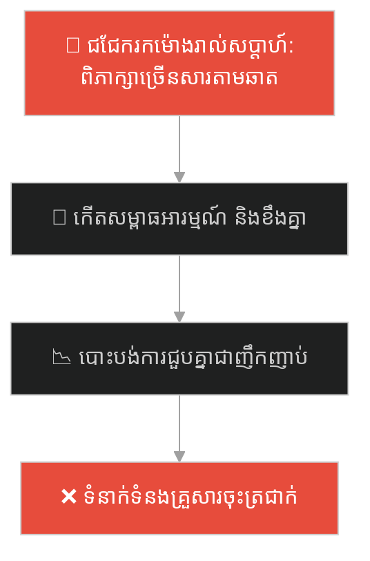
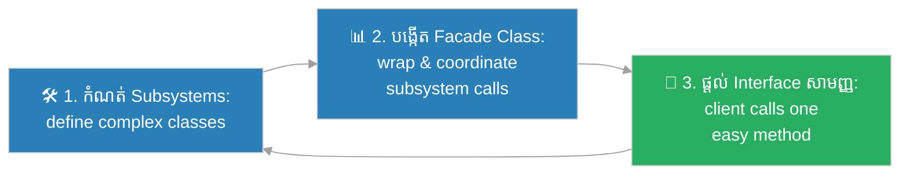

# Facade Design Pattern (លំនាំរចនាផ្ទៃមុខសម្របសម្រួល)៖ អ្នករត់តុក្នុងភោជនីយដ្ឋាន (Facade Pattern & The Restaurant Waiter)

**Author:** ichamrong  
**Date:** 2026-05-27  
**Tags:** #design-patterns #facade #architecture #software-engineering #parable  
**Category:** Concepts / Parables  
**Read Time:** ~15 min  

---

## 📌 មាតិកា (Table of Contents)
- [អន្ទាក់ផ្លូវចិត្ត (The Trap)](#0)
- [១. រឿងព្រេងប្រវត្តិសាស្ត្រ៖ ការហូបចុកដ៏ស្មុគស្មាញ និងដំណើរការផ្ទះបាយ (The Legend of the Complex Kitchen)](#1)
  - [អ្នករត់តុសម្របសម្រួល និងការបញ្ជាទិញដ៏សាមញ្ញ (The Waiter Facade)](#1-1)
- [២. បញ្ហា៖ ការគូសភ្ជាប់សមាសភាគស្មុគស្មាញ និងភាពច្របូកច្របល់នៃកូដ (The Issue: Tight Coupling with Complex Subsystems)](#2)
- [៣. ឧទាហរណ៍ជាក់ស្តែងក្នុងពិភពពិត (Real World Examples)](#3)
  - [ឧទាហរណ៍ទី ១ — កម្រិតស្រាល (គ្រួសារ)៖ មេគ្រួសារជាចំណុចទំនាក់ទំនងសម្របសម្រួលចម្បង (Parent as the Single Point of Family Requests)](#3-1)
  - [ឧទាហរណ៍ទី ២ — កម្រិតមធ្យម (បច្ចេកទេស)៖ ប្រព័ន្ធទូទាត់រួម និងបញ្ជរ Checkout API (Unified Checkout API Facade)](#3-2)
  - [ឧទាហរណ៍ទី ៣ — កម្រិតមធ្យម (ធុរកិច្ច)៖ កញ្ចប់ទេសចរណ៍រួម និងសេវាកម្មភ្នាក់ងារធ្វើដំណើរ (All-in-One Travel Agency Package)](#3-3)
  - [ឧទាហរណ៍ទី ៤ — កម្រិតមធ្យម (សង្គម/គ្រប់គ្រង)៖ គណនីគ្រប់គ្រងអតិថិជន និងអ្នកបច្ចេកទេស (Single Account Manager for Clients)](#3-4)
  - [ឧទាហរណ៍ទី ៥ — កម្រិតធ្ងន់ (ទំនាក់ទំនង)៖ ការកំណត់គោលការណ៍សាមញ្ញក្នុងការដោះស្រាយជម្លោះ (Unified Scheduling Rule in Relationship)](#3-5)
- [៤. ដំណោះស្រាយទូទៅ៖ ការអនុវត្ត Facade Pattern តាមរយៈ Simplified Interfaces (The General Solution: Facade Pattern with Unified Subsystem Entry Points)](#4)
- [សេចក្តីសន្និដ្ឋាន (Conclusion)](#5)
- [ឯកសារយោង (References)](#6)
- [Related Posts](#7)

---

<a id="0"></a>
## អន្ទាក់ផ្លូវចិត្ត (The Trap)

តើអ្នកធ្លាប់ធុញទ្រាន់នឹងការដោះស្រាយ ឬសម្របសម្រួលជាមួយផ្នែកតូចៗរាប់សិបនៅក្នុងប្រព័ន្ធ ដើម្បីគ្រាន់តែបំពេញកិច្ចការដ៏សាមញ្ញមួយដែរឬទេ?

នៅក្នុងការអភិវឌ្ឍប្រព័ន្ធ៖
* **យើងងាយនឹងធ្លាក់ក្នុងអន្ទាក់** នៃការបណ្តោយឱ្យផ្នែកខាងក្រៅ (Client) ទៅប្រាស្រ័យទាក់ទង និងបញ្ជាការងារផ្ទាល់ជាមួយសមាសភាគខាងក្នុងដ៏ស្មុគស្មាញរាប់សិប ដែលនាំឱ្យកូដទាំងមូលជំពាក់ជំពិនគ្នា (Tight Coupling) ពិបាកយល់ និងងាយដួលរលំ។
* **យើងមើលរំលង** ការបង្កើតផ្ទៃមុខសម្របសម្រួលកណ្តាលដ៏សាមញ្ញមួយ (Facade Interface) ដើម្បីផ្តល់នូវផ្លូវចូលតែមួយ និងលាក់បាំងភាពស្មុគស្មាញទាំងអស់នៅពីក្រោយវា។

ការព្យាយាមបង្ខំឱ្យអ្នកប្រើប្រាស់ដើរសម្របសម្រួលជាមួយផ្នែកស្មុគស្មាញរាយប៉ាយដោយខ្លួនឯង ហៅថា **អន្ទាក់សម្របសម្រួលប្រព័ន្ធរញ៉េរញ៉ៃ (Manual Subsystem Coordination Trap)**។

ដើម្បីយល់ដឹងពីរបៀបលាក់បាំងភាពស្មុគស្មាញ និងផ្តល់នូវចំណុចចូលដ៏សាមញ្ញ នេះជាផែនទីបង្ហាញផ្លូវ៖
1. **រឿងព្រេងប្រវត្តិសាស្ត្រ (The Historic Legend)** — រឿងរ៉ាវរបស់ភោជនីយដ្ឋានគ្មានអ្នករត់តុ ដែលតម្រូវឱ្យភ្ញៀវចរចាផ្ទាល់ជាមួយចុងភៅ និងអ្នកលាងចាន។
2. **បញ្ហា (The Issue)** — ការវិភាគភាពជំពាក់ជំពិនគ្នារវាង Client និងសមាសភាគខាងក្នុងប្រព័ន្ធក្នុង OOP។
3. **ឧទាហរណ៍ជាក់ស្តែងក្នុងពិភពពិត (Real World Examples)** — ពិនិត្យមើលបញ្ហានេះក្នុងកម្រិតគ្រួសារ បច្ចេកវិទ្យា ធុរកិច្ច ការគ្រប់គ្រង និងទំនាក់ទំនង។
4. **ដំណោះស្រាយទូទៅ (The General Solution)** — ការអនុវត្ត Facade Pattern ដើម្បីបង្កើត Interface រួមដ៏សាមញ្ញ និងមានសុវត្ថិភាព។



---

<a id="1"></a>
## ១. រឿងព្រេងប្រវត្តិសាស្ត្រ៖ ការហូបចុកដ៏ស្មុគស្មាញ និងដំណើរការផ្ទះបាយ (The Legend of the Complex Kitchen)

ស្រមៃថាមានភោជនីយដ្ឋានដ៏ប្រណីតមួយ មានចុងភៅល្បីៗ អ្នកក្រឡុកស្រាពូកែៗ និងគ្រឿងចានកែវដ៏ស្អាតឥតខ្ចោះ។ ប៉ុន្តែភោជនីយដ្ឋាននេះ មានគោលការណ៍ចម្លែកមួយ៖ **គ្មានអ្នករត់តុ (No Waiter)**។

នៅពេលដែលអតិថិជនម្នាក់ ដើរចូលមកក្នុងភោជនីយដ្ឋាននេះដើម្បីពិសារអាហារពេលល្ងាច គាត់ត្រូវតែបំពេញកិច្ចការស្មុគស្មាញទាំងអស់ដោយខ្លួនឯង៖
1. គាត់ត្រូវដើរចូលទៅក្នុងផ្ទះបាយដ៏ក្តៅ ដើម្បីចរចាជាមួយប្រធានចុងភៅអំពីការចម្អិនសាច់កុំឱ្យដាក់ប៊ីចេង និងរក្សាអនាម័យ។
2. គាត់ត្រូវដើរទៅទូទឹកកកធំដើម្បីជួបអ្នកក្រឡុកស្រា និងលាយភេសជ្ជៈដោយខ្លួនឯង។
3. គាត់ត្រូវដើរទៅផ្នែកលាងចាន ដើម្បីសុំចាន និងកាំបិតស្អាតមកដាក់ម្ហូប។
4. ពេលពិសាររួច គាត់ត្រូវដើរទៅជួបអ្នកគិតលុយ រួចទៅរៀបចំវិក្កយបត្រដោយខ្លួនឯងថែមទៀត។

ទោះបីជាចុងភៅចម្អិនម្ហូបបានឆ្ងាញ់យ៉ាងណាក៏ដោយ បទពិសោធន៍នៃការចូលរួមហូបចុកនេះ គឺជារឿងដ៏អាក្រក់ និងគួរឱ្យធុញទ្រាន់បំផុតសម្រាប់អតិថិជន។

---

<a id="1-1"></a>
### អ្នករត់តុសម្របសម្រួល និងការបញ្ជាទិញដ៏សាមញ្ញ (The Waiter Facade)

ភោជនីយដ្ឋានដែលឆ្លាតវៃ បានដោះស្រាយវិបត្តិនេះភ្លាមៗដោយជួល **អ្នករត់តុ (The Waiter)** ម្នាក់ឱ្យមកបំពេញការងារជាចំណុចកណ្តាល។

អ្នករត់តុ ដើរតួជា **ផ្ទៃមុខសម្របសម្រួល (Facade)** តែមួយគត់សម្រាប់អតិថិជន។ ឥឡូវនេះ អតិថិជនគ្រាន់តែអង្គុយយ៉ាងមានផាសុកភាពនៅតុ រួចបញ្ជាទិញតាមរយៈអ្នករត់តុយ៉ាងខ្លីថា៖ *"សុំបាយឆាគ្រឿងសមុទ្រមួយចាន ទឹកក្រូចកំប៉ុងមួយ និងគិតលុយមក!"*

នៅពីក្រោយខ្នង៖
* អ្នករត់តុនឹងដើរទៅផ្ទះបាយ ដើម្បីបញ្ជាចុងភៅឱ្យចម្អិនអាហារ។
* អ្នករត់តុដើរទៅបញ្ជរភេសជ្ជៈ ដើម្បីយកទឹកក្រូច។
* អ្នករត់តុរៀបចំចាន និងកាំបិតស្អាតយកមកដាក់ជូនភ្ញៀវ។
* អ្នករត់តុដើរទៅគិតលុយ និងយកវិក្កយបត្រមកប្រគល់ជូនភ្ញៀវ។

អតិថិជនមិនចាំបាច់យល់ដឹងអំពីដំណើរការដ៏មមាញឹកនៅក្នុងផ្ទះបាយ ឬការរៀបចំចានកែវឡើយ។ ពួកគេទទួលបានអាហារឆ្ងាញ់ប្រកបដោយភាពរីករាយបំផុត។

---

<a id="2"></a>
## ២. បញ្ហា៖ ការគូសភ្ជាប់សមាសភាគស្មុគស្មាញ និងភាពច្របូកច្របល់នៃកូដ (The Issue: Tight Coupling with Complex Subsystems)

នៅក្នុងការរចនាប្រព័ន្ធកម្មវិធី កូដរបស់យើងជារឿយៗជួបបញ្ហានៅពេលដែល Client ត្រូវស្គាល់ និងហៅប្រើប្រាស់ Class ខាងក្នុងជាច្រើនដើម្បីបំពេញកិច្ចការតែមួយ៖

```java
// កូដដែលគ្មាន Facade គឺ Client ត្រូវស្គាល់គ្រប់សមាសភាគ
AudioMixer mixer = new AudioMixer();
CodecConverter converter = new CodecConverter();
BitrateReader reader = new BitrateReader();
// Client ត្រូវហៅ method រាប់សិបដងដោយខ្លួនឯង
```

* **ភាពជំពាក់ជំពិនគ្នាខ្ពស់ (Tight Coupling)៖** ប្រសិនបើយើងកែប្រែរបៀបធ្វើការរបស់សមាសភាគខាងក្នុងណាមួយ នោះកូដរបស់ Client ក៏នឹងត្រូវរងផលប៉ះពាល់ និងត្រូវការកែសម្រួលទាំងអស់គ្នាដែរ។
* **ភាពស្មុគស្មាញសម្រាប់អ្នកប្រើប្រាស់ (Developer Cognitive Load)៖** អ្នកសរសេរកូដផ្នែកខាងក្រៅ ត្រូវចំណាយពេលយល់ដឹងពីដំណើរការស្មុគស្មាញខាងក្នុងទាំងអស់ ទើបអាចសរសេរកូដប្រើប្រាស់បាន។

**Facade Design Pattern** ដោះស្រាយបញ្ហានេះដោយផ្តល់នូវ Class សាមញ្ញតែមួយ (Facade class) ដើម្បីសម្រួលការបញ្ជាការងាររបស់ Subsystems ទាំងអស់ និងផ្តល់នូវវិធីប្រើប្រាស់ដ៏សាមញ្ញបំផុត។

---

<a id="3"></a>
## ៣. ឧទាហរណ៍ជាក់ស្តែងក្នុងពិភពពិត

---

<a id="3-1"></a>
### ឧទាហរណ៍ទី ១ — កម្រិតស្រាល (គ្រួសារ)៖ មេគ្រួសារជាចំណុចទំនាក់ទំនងសម្របសម្រួលចម្បង (Parent as the Single Point of Family Requests)

នៅក្នុងគ្រួសារមួយ ម្តាយដើរតួជាចំណុចសម្របសម្រួលកណ្តាលសម្រាប់រាល់សំណើរបស់កូនៗ។ ជំនួសឱ្យការឱ្យកូនទៅសួរនាំជីដូនអំពីអាហារ សួរជីតាអំពីសៀវភៅ និងសួរឪពុកអំពីការធ្វើដំណើរ ម្តាយបានប្រមូលរាល់សំណើទាំងអស់ រួចចាត់ចែងសួរនាំ និងរៀបចំជូនកូនៗយ៉ាងសាមញ្ញបំផុត។



ម្តាយបានប្រើវិធីសាស្រ្ត Facade style ដើម្បីជួយសម្រួលការប្រាស្រ័យទាក់ទងរបស់កូនៗ។

---

<a id="3-2"></a>
### ឧទាហរណ៍ទី ២ — កម្រិតមធ្យម (បច្ចេកទេស)៖ ប្រព័ន្ធទូទាត់រួម និងបញ្ជរ Checkout API (Unified Checkout API Facade)

នៅក្នុងប្រព័ន្ធ Checkout របស់វិបសាយទិញទំនិញ ដំណើរការរួមមាន៖ ការត្រួតពិនិត្យស្តុក (Inventory) ការផ្ទៀងផ្ទាត់កាត (Payment) ការកត់ត្រាការលក់ (Billing) និងការផ្ញើសារបញ្ជាក់ (Notification)។ ជំនួសឱ្យការឱ្យ Web Controller ហៅសមាសភាគទាំងនេះផ្ទាល់ ក្រុមការងារបានបង្កើត `CheckoutFacade` ដែលផ្តល់ Method តែមួយគត់គឺ `placeOrder(userId, cartId)`។



---

<a id="3-3"></a>
### ឧទាហរណ៍ទី ៣ — កម្រិតមធ្យម (ធុរកិច្ច)៖ កញ្ចប់ទេសចរណ៍រួម និងសេវាកម្មភ្នាក់ងារធ្វើដំណើរ (All-in-One Travel Agency Package)

ក្រុមហ៊ុនទេសចរណ៍មួយផ្តល់ជូនកញ្ចប់ដំណើរកម្សាន្តទៅក្រៅប្រទេស។ ជំនួសឱ្យការបង្ខំឱ្យអតិថិជនដើរកក់សំបុត្រយន្តហោះខ្លួនឯង កក់សណ្ឋាគារខ្លួនឯង និងស្វែងរកឡានដឹកជញ្ជូន ក្រុមហ៊ុនដើរតួជា Facade ដោយផ្តល់កញ្ចប់ដំណើរកម្សាន្តរួមបញ្ចូលគ្នា "All-in-One Package" យ៉ាងងាយស្រួលបំផុត។



---

<a id="3-4"></a>
### ឧទាហរណ៍ទី ៤ — កម្រិតមធ្យម (សង្គម/គ្រប់គ្រង)៖ គណនីគ្រប់គ្រងអតិថិជន និងអ្នកបច្ចេកទេស (Single Account Manager for Clients)

នៅក្នុងក្រុមហ៊ុនអភិវឌ្ឍន៍សូហ្វវែរ ក្រុមហ៊ុនបានតែងតាំង "Account Manager" ឱ្យធ្វើជាចំណុចទាក់ទងតែមួយគត់សម្រាប់អតិថិជន។ ជំនួសឱ្យការឱ្យអតិថិជនទៅនិយាយផ្ទាល់ជាមួយវិស្វករ Database វិស្វករ Frontend និងអ្នកសរសេរ API Account Manager ទទួលរាល់សំណើ និងយកទៅបែងចែកការងារជូនក្រុមការងារយ៉ាងមានសណ្តាប់ធ្នាប់។



---

<a id="3-5"></a>
### ឧទាហរណ៍ទី ៥ — កម្រិតធ្ងន់ (ទំនាក់ទំនង)៖ ការកំណត់គោលការណ៍សាមញ្ញក្នុងការដោះស្រាយជម្លោះ (Unified Scheduling Rule in Relationship)

នៅក្នុងទំនាក់ទំនងប្តីប្រពន្ធ ពេលខ្លះពួកគេមានភាពមមាញឹកនឹងការងាររៀងៗខ្លួន រហូតដល់ជួបបញ្ហាពិបាកក្នុងការណាត់ជួបគ្នា ឬរៀបចំកម្មវិធីកម្សាន្ត។ ជំនួសឱ្យការជជែកដេញដោលគ្នារាប់ម៉ោងតាមឆាតរាល់សប្តាហ៍ ពួកគេបានបង្កើតគោលការណ៍សាមញ្ញរួម (Facade Rule) មួយគឺ៖ *"រាល់ថ្ងៃសៅរ៍ វេលាម៉ោង ៦ ល្ងាច គឺជាម៉ោងណាត់ជួបជានិច្ច"* ដែលជួយសម្រួលរាល់ការសម្រេចចិត្តដ៏ស្មុគស្មាញ។



---

<a id="4"></a>
## ៤. ដំណោះស្រាយទូទៅ៖ ការអនុវត្ត Facade Pattern តាមរយៈ Simplified Interfaces (The General Solution: Facade Pattern with Unified Subsystem Entry Points)

ដើម្បីជួយសម្រួលការប្រើប្រាស់ និងកាត់បន្ថយភាពជំពាក់ជំពិនគ្នារវាងសមាសភាគ យើងត្រូវអនុវត្តលំនាំរចនា **Facade Pattern**៖



ជំហាននៃការអនុវត្ត៖
1. **កំណត់អត្តសញ្ញាណ Subsystems៖** ប្រមូលផ្តុំ Class ស្មុគស្មាញទាំងអស់ដែលបំពេញការងារទាក់ទងគ្នា។
2. **បង្កើត Facade Class៖** បង្កើត Class កណ្តាលមួយដែល wrap យក Instances របស់ Subsystems ទាំងអស់ និងសម្របសម្រួលដំណើរការការងារក្នុង Methods របស់ខ្លួន។
3. **ផ្តល់នូវ Interface សាមញ្ញ៖** បង្ហាញ Method ងាយៗពីរបីទៅឱ្យ Client ប្រើប្រាស់ ដោយលាក់បាំងរាល់វិធីហៅ និងការរៀបចំលំដាប់លំដោយការងារដ៏ស្មុគស្មាញរបស់ Subsystems ទាំងអស់។

---

## 🐇 ធ្លាក់ចូលក្នុងរន្ធទន្សាយ (Enter the Rabbit Hole)

ដើម្បីស្វែងយល់ពីរបៀបដែលប្រព័ន្ធបញ្ជាឧបករណ៍អេឡិចត្រូនិកក្នុងផ្ទះ បានដោះស្រាយវិបត្តិការកើនឡើងចំនួន Class ឥតឈប់ឈរ នៅពេលរួមបញ្ចូលម៉ាកឧបករណ៍ទូរទស្សន៍ផ្សេងៗគ្នា ជាមួយប្រភេទឧបករណ៍បញ្ជាពីចម្ងាយ (Remote Types vs TV Brands) តាមរយៈការផ្តាច់ចេញរវាងអរូបី និងការអនុវត្ត (Bridge Pattern) សូមបន្តដំណើរទៅកាន់៖

* 🚀 **[ចាប់ផ្តើមដំណើររុករក (Start the Journey) ➔ Bridge Pattern and Decoupling Abstractions](./83-the-universal-remote.md)**

---

<a id="5"></a>
## សេចក្តីសន្និដ្ឋាន (Conclusion)

> **«កុំបណ្តោយឱ្យភ្ញៀវកុម្ម៉ង់អាហារត្រូវដើរចូលទៅដល់ក្នុងផ្ទះបាយ។ ចូរផ្តល់ជូនអ្នករត់តុដ៏ឆ្លាតវៃម្នាក់ ដើម្បីរក្សាភាពស្ងប់ស្ងាត់ និងសណ្តាប់ធ្នាប់នៃភោជនីយដ្ឋានរបស់អ្នក។»**

ចូរធ្វើខ្លួនជាវិស្វករកម្មវិធីដែលយល់ដឹងពីសិល្បៈនៃការកាត់បន្ថយភាពស្មុគស្មាញប្រព័ន្ធ (Simplifying System Complexity)។ ការអនុវត្ត Facade Design Pattern មិនត្រឹមតែជួយឱ្យកូដរបស់ Client មានភាពស្អាត និងងាយយល់ប៉ុណ្ណោះទេ ប៉ុន្តែវាក៏ជួយឱ្យប្រព័ន្ធខាងក្នុងរបស់អ្នកអាចផ្លាស់ប្តូរ និងកែលម្អបានយ៉ាងសេរី ដោយមិនប៉ះពាល់ដល់ភាគីខាងក្រៅឡើយ។

---

<a id="6"></a>
## ឯកសារយោង (References)

* **Erich Gamma, Richard Helm, Ralph Johnson, John Vlissides** — *Design Patterns: Elements of Reusable Object-Oriented Software* (1994). Facade Design Pattern Chapter.
* **Martin Fowler** — *Patterns of Enterprise Application Architecture: Service Layer Pattern* (2002).
* **Steve McConnell** — *Code Complete: A Practical Handbook of Software Construction* (2004).

---

<a id="7"></a>
## Related Posts

* **[82 Facade Pattern: Unified Subsystem Entry Points](../articles/82-facade-pattern.md)** — អត្ថបទវិទ្យាសាស្ត្រលម្អិត និងកូដគំរូសម្រាប់ការសម្រួល API ស្មុគស្មាញ។
* **[81 The Naked Coffee](./81-the-naked-coffee.md)** — ការតុបតែង និងពង្រីកមុខងារបន្ថែមជាស្រទាប់ៗតាមបែប Composition។
* **[52 The Best Part is No Part](./52-the-best-part-is-no-part.md)** — ការកាត់បន្ថយសមាសភាគដែលមិនចាំបាច់ និងការរក្សាភាពសាមញ្ញបំផុត។

---

## Related

- [💡 Concepts README](../README.md)
- [📚 Main Repository README](../../../README.md)
- [Developer Habits](../../developer-habits/README.md)
- [Mental Health & Well-being](../../mental-health/README.md)
- [Management & SDLC](../../management/README.md)
