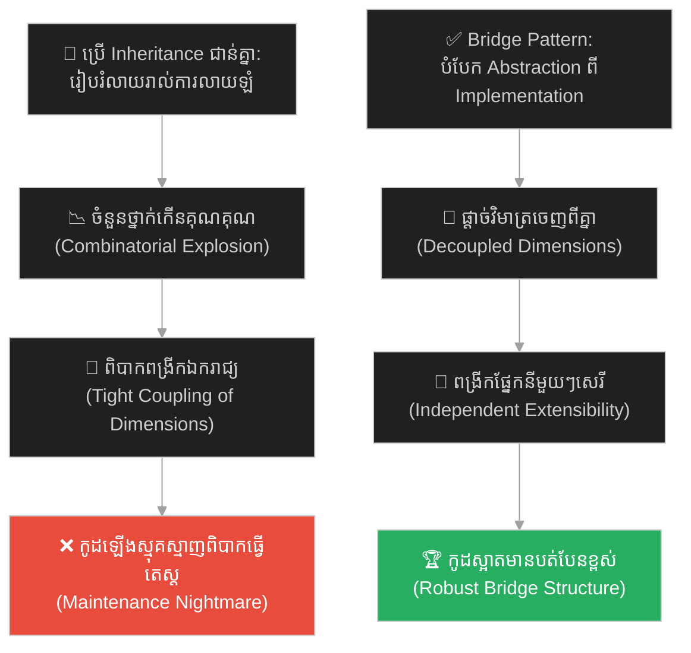
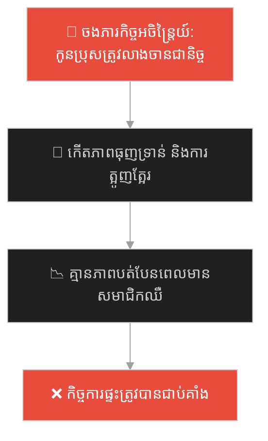
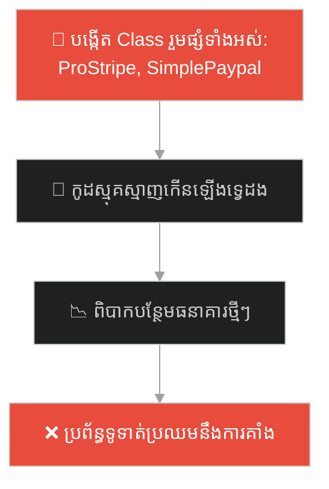
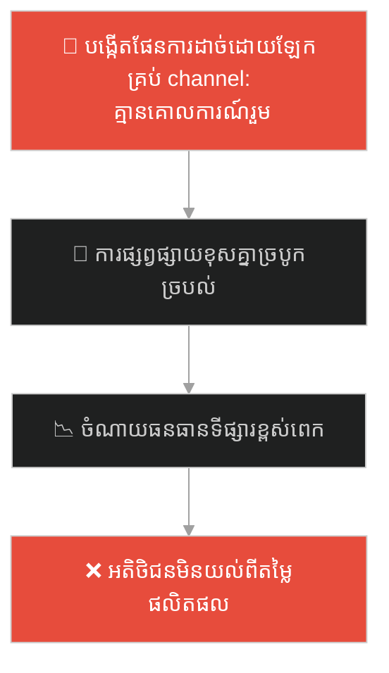
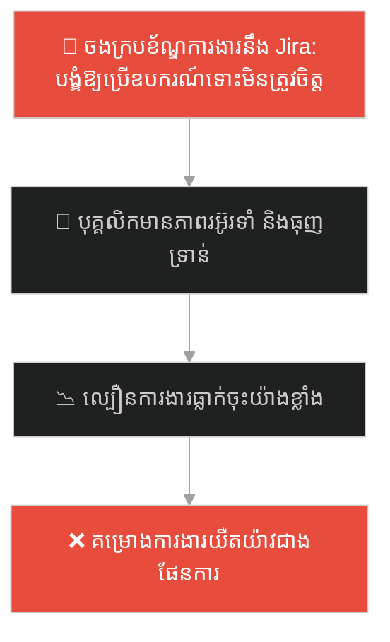
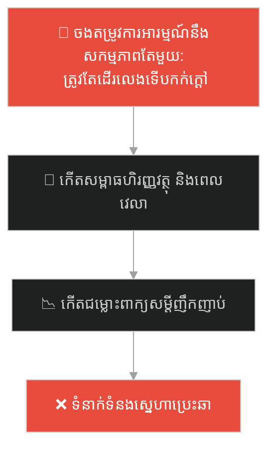
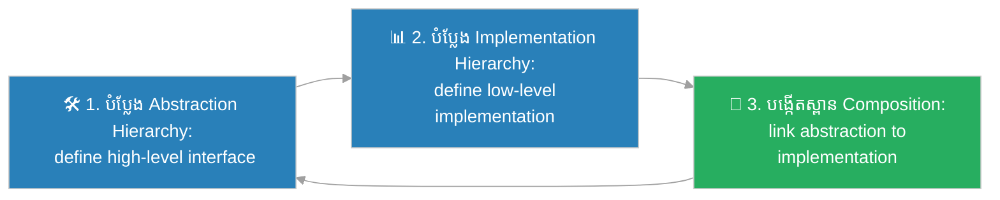

# Bridge Design Pattern (លំនាំរចនាស្ពានតភ្ជាប់)៖ តេឡេបញ្ជាសកល និងម៉ាកទូរទស្សន៍ (Bridge Pattern & The Universal Remote)

**Author:** ichamrong  
**Date:** 2026-05-27  
**Tags:** #design-patterns #bridge #architecture #software-engineering #parable  
**Category:** Concepts / Parables  
**Read Time:** ~15 min  

---

## 📌 មាតិកា (Table of Contents)
- [អន្ទាក់ផ្លូវចិត្ត (The Trap)](#0)
- [១. រឿងព្រេងប្រវត្តិសាស្ត្រ៖ រោងចក្រផលិតតេឡេដ៏វឹកវរ និងទូរទស្សន៍ម៉ាកផ្សេងៗ (The Legend of the Chaotic Remote Factory)](#1)
  - [ការបំបែកជាពីរផ្នែក និងការបង្កើតស្ពានតភ្ជាប់ (The Bridge Solution)](#1-1)
- [២. បញ្ហា៖ ការលាយឡំវិមាត្រពីរ និងការកើនឡើងចំនួនថ្នាក់ជាលំដាប់គុណ (The Issue: Abstraction and Implementation Coupling)](#2)
- [៣. ឧទាហរណ៍ជាក់ស្តែងក្នុងពិភពពិត (Real World Examples)](#3)
  - [ឧទាហរណ៍ទី ១ — កម្រិតស្រាល (គ្រួសារ)៖ ការបបែកកង់បង្វិលកិច្ចការចេញពីសមាជិកគ្រួសារ (Decoupling Chore Abstraction from Family Members)](#3-1)
  - [ឧទាហរណ៍ទី ២ — កម្រិតមធ្យម (បច្ចេកទេស)៖ ស្ពានទូទាត់ប្រាក់ និងប្រព័ន្ធដំណើរការធនាគារ (Decoupling Payment UI Logic from Processors)](#3-2)
  - [ឧទាហរណ៍ទី ៣ — កម្រិតមធ្យម (ធុរកិច្ច)៖ ការផ្តាច់យុទ្ធនាការទីផ្សារចេញពីបណ្តាញផ្សព្វផ្សាយ (Decoupling Marketing Strategy from Channels)](#3-3)
  - [ឧទាហរណ៍ទី ៤ — កម្រិតមធ្យម (សង្គម/គ្រប់គ្រង)៖ ក្របខ័ណ្ឌគ្រប់គ្រងគម្រោង និងឧបករណ៍បច្ចេកវិទ្យា (Decoupling Project Management from Engineering Tools)](#3-4)
  - [ឧទាហរណ៍ទី ៥ — កម្រិតធ្ងន់ (ទំនាក់ទំនង)៖ ការបំបែកតម្រូវការស្នូលចេញពីសកម្មភាពជាក់ស្តែង (Decoupling Relationship Needs from Specific Activities)](#3-5)
- [៤. ដំណោះស្រាយទូទៅ៖ ការអនុវត្ត Bridge Pattern តាមរយៈ Abstraction-Implementation Separation (The General Solution: Bridge Pattern with Composition)](#4)
- [សេចក្តីសន្និដ្ឋាន (Conclusion)](#5)
- [ឯកសារយោង (References)](#6)
- [Related Posts](#7)

---

<a id="0"></a>
## អន្ទាក់ផ្លូវចិត្ត (The Trap)

តើអ្នកធ្លាប់ជួបបញ្ហាដែលប្រព័ន្ធមួយត្រូវការអភិវឌ្ឍ ឬកែលម្អលើពីរវិមាត្រ (Dimensions) ផ្សេងគ្នាក្នុងពេលតែមួយ ដែលធ្វើឱ្យចំនួនកូដរបស់អ្នកកើនឡើងជាគុណគុណរាល់ពេលបន្ថែមលក្ខណៈពិសេសថ្មីដែរឬទេ?

នៅក្នុងស្ថាបត្យកម្មកម្មវិធី៖
* **យើងងាយនឹងធ្លាក់ក្នុងអន្ទាក់** នៃការប្រើប្រាស់ការស្នងមរតក (Inheritance) ដើម្បីរួមបញ្ចូលវិមាត្រពីរចូលគ្នា ដែលនាំឱ្យកូដមានភាពស្មុគស្មាញ និងបង្កើតជា Class ថ្មីៗរាប់សិបដោយជៀសមិនរួច។
* **យើងមើលរំលង** ការផ្តាច់ចេញដាច់ដោយឡែកពីរវាង "អរូបីស្នូល (Abstraction)" និង "ការអនុវត្តជាក់ស្តែង (Implementation)" រួចតភ្ជាប់ពួកគេដោយស្ពានសម្របសម្រួល (Bridge) ជំនួសវិញ។

ការព្យាយាមដោះស្រាយវិមាត្រពីរនៃប្រព័ន្ធដោយប្រើប្រាស់ Inheritance ជាន់គ្នា ហៅថា **អន្ទាក់កូដកើនឡើងជាលំដាប់គុណ (Cartesian Product Class Explosion Trap)**។

ដើម្បីយល់ដឹងពីរបៀបផ្តាច់ Abstraction ចេញពី Implementation ប្រកបដោយប្រសិទ្ធភាព ផែនទីបង្ហាញផ្លូវមានដូចខាងក្រោម៖
1. **រឿងព្រេងប្រវត្តិសាស្ត្រ (The Historic Legend)** — រឿងរ៉ាវរបស់រោងចក្រតេឡេដែលជួបការកើនឡើងចំនួនម៉ូដែលតេឡេ និងម៉ាកទូរទស្សន៍។
2. **បញ្ហា (The Issue)** — ការវិភាគការលាយឡំវិមាត្រពីរនៅក្នុង OOP និងភាពរឹងរបស់ប្រព័ន្ធ។
3. **ឧទាហរណ៍ជាក់ស្តែងក្នុងពិភពពិត (Real World Examples)** — ពិនិត្យមើលបញ្ហានេះក្នុងកម្រិតគ្រួសារ បច្ចេកវិទ្យា ធុរកិច្ច ការគ្រប់គ្រង និងទំនាក់ទំនង។
4. **ដំណោះស្រាយទូទៅ (The General Solution)** — ការអនុវត្ត Bridge Pattern តាមរយៈ Composition ដើម្បីបង្កើតស្ថាបត្យកម្មដែលបត់បែន។



---

<a id="1"></a>
## ១. រឿងព្រេងប្រវត្តិសាស្ត្រ៖ រោងចក្រផលិតតេឡេដ៏វឹកវរ និងទូរទស្សន៍ម៉ាកផ្សេងៗ (The Legend of the Chaotic Remote Factory)

មានរោងចក្រផលិតឧបករណ៍អេឡិចត្រូនិកមួយ ទទួលបានជោគជ័យក្នុងការផលិត **តេឡេបញ្ជាទូរទស្សន៍ (Remote Controls)**។ ពួកគេមានផលិតតេឡេ ២ ប្រភេទគឺ៖ ម៉ូដែលសាមញ្ញ (Basic Remote) និងម៉ូដែលទំនើប (Advanced Remote)។ 

ទោះជាយ៉ាងណា ពួកគេត្រូវផលិតតេឡេទាំងនេះដើម្បីគាំទ្រម៉ាកទូរទស្សន៍ល្បីៗចំនួន ២ គឺ៖ Sony និង Samsung។

ដើម្បីបំពេញតម្រូវការនេះ ក្រុមវិស្វករបានប្រើប្រាស់ការស្នងមរតក (Inheritance) ដោយបង្កើត Class តេឡេដាច់ដោយឡែកពីគ្នា៖
* `BasicSonyRemote`
* `AdvancedSonyRemote`
* `BasicSamsungRemote`
* `AdvancedSamsungRemote`

រហូតមកដល់ពេលនេះ ពួកគេមាន Class ចំនួន ៤ ផ្សេងគ្នា។ ប៉ុន្តែនៅពេលដែលទីផ្សារត្រូវការបន្ថែមទូរទស្សន៍ម៉ាក LG មួយទៀត វិស្វករត្រូវបង្ខំចិត្តបង្កើត Class ថ្មីចំនួន ២ ទៀតគឺ `BasicLGRemote` និង `AdvancedLGRemote`។ 

នៅពេលណាដែលម្ចាស់ហាងចង់បន្ថែមម៉ូដែលតេឡេថ្មីមួយទៀត (ដូចជា Mute Remote) ឬចង់គាំទ្រទូរទស្សន៍ម៉ាកថ្មីៗរាប់សិបទៀត ចំនួន Class ដែលត្រូវបង្កើតថ្មីនឹងកើនឡើងជាគុណគុណ (Cartesian Product Explosion) ដែលធ្វើឱ្យរោងចក្រត្រូវវឹកវរក្នុងការគ្រប់គ្រងខ្សែសង្វាក់ផលិតកម្ម។

---

<a id="1-1"></a>
### ការបំបែកជាពីរផ្នែក និងការបង្កើតស្ពានតភ្ជាប់ (The Bridge Solution)

វិស្វករប្រព័ន្ធម្នាក់ដែលចូលមកអភិវឌ្ឍប្រព័ន្ធ បានមើលឃើញពីគ្រោះថ្នាក់នៃការលាយឡំវិមាត្រពីរនេះ។ គាត់បានកត់សម្គាល់ឃើញថា៖
1. **ម៉ូដែលតេឡេ (Abstraction)** គឺជារូបរាង និងប៊ូតុងដែលភ្ញៀវប្រើប្រាស់ (Basic, Advanced)។
2. **ម៉ាកទូរទស្សន៍ (Implementation)** គឺជាវិធីដែលឧបករណ៍បញ្ជាចរន្ត ឬសញ្ញាពិតប្រាកដទៅកាន់ទូរទស្សន៍ (Sony, Samsung, LG)។

ទាំងពីរនេះ គឺជារឿងពីរដាច់ដោយឡែកពីគ្នា ដែលអាចអភិវឌ្ឍទៅមុខដោយឯករាជ្យរៀងៗខ្លួន។

គាត់បានសម្រេចចិត្តបង្កើត **ស្ពានសម្របសម្រួល (Bridge)** ដោយបំបែកពួកគេជាពីរឋានានុក្រម (Hierarchies)៖
* **ឋានានុក្រម Abstraction (Remote Control)៖** មានតែ `BasicRemote` និង `AdvancedRemote` ប៉ុណ្ណោះ។
* **ឋានានុក្រម Implementation (Device)៖** មានតែ `SonyDevice`, `SamsungDevice` និង `LGDevice`។

នៅក្នុង Class `Remote` គាត់បានភ្ជាប់ខ្សែមួយ (Composition/Reference) ទៅកាន់ `Device`។ នៅពេលអតិថិជនចុចប៊ូតុង "បិទទូរទស្សន៍" លើតេឡេ ម៉ូដែលតេឡេមិនខ្វល់ឡើយថាវាជាទូរទស្សន៍ម៉ាកអ្វី។ វាក៏គ្រាន់តែបញ្ជូនបញ្ជាបន្តទៅកាន់ខ្សែស្ពាននោះថា `device.turnOff()`។ 

ឥឡូវនេះ ប្រសិនបើពួកគេចង់បន្ថែមទូរទស្សន៍ម៉ាក TCL ពួកគេគ្រាន់តែបង្កើត Class `TCLDevice` តែមួយគត់ជារឿងដាច់ដោយឡែក។ ក្រុមការងារមិនចាំបាច់កែប្រែកូដ ឬបង្កើត Class ថ្មីសម្រាប់ Remote ឡើយ។

---

<a id="2"></a>
## ២. បញ្ហា៖ ការលាយឡំវិមាត្រពីរ និងការកើនឡើងចំនួនថ្នាក់ជាលំដាប់គុណ (The Issue: Abstraction and Implementation Coupling)

នៅក្នុង OOP បញ្ហានេះកើតឡើងនៅពេលយើងព្យាយាមបង្កើត Class រួមបញ្ចូលរវាងចំណុចពីរដែលវិវឌ្ឍន៍រៀងៗខ្លួន៖

```java
// ការប្រើប្រាស់ Inheritance ជាន់គ្នាបង្កើតការរួមបញ្ចូលដ៏តឹងរឹង
class BasicSonyRemote extends SonyRemote {}
class AdvancedSonyRemote extends SonyRemote {}
// នាំឱ្យកូដទាំងមូលមានភាពជាន់គ្នាខ្លាំង និងពិបាកពង្រីក
```

* **ការកើនឡើង Class ដោយគ្មានដែនកំណត់ (Combinatorial Proliferation)៖** រាល់ពេលបន្ថែមលក្ខណៈពិសេសក្នុងវិមាត្រមួយ យើងត្រូវបង្កើត Class រួមផ្សំជាច្រើនក្នុងវិមាត្រមួយទៀត។
* **ភាពរឹងរបស់ប្រព័ន្ធ (Rigid Architecture)៖** យើងមិនអាចផ្លាស់ប្តូរការអនុវត្តជាក់ស្តែងរបស់ Object មួយនៅពេលកំពុងដំណើរការកម្មវិធី (Runtime) បានឡើយ ព្រោះវាត្រូវបានចងភ្ជាប់ជាស្រេចតាមរយៈការស្នងមរតក។

**Bridge Design Pattern** ជួយដោះស្រាយបញ្ហានេះដោយប្រើប្រាស់ **Composition** ជំនួសឱ្យ Inheritance ដោយបំបែក Abstraction និង Implementation ឱ្យដាច់ស្រឡះពីគ្នា និងតភ្ជាប់ពួកគេតាមរយៈ Object Reference។

---

<a id="3"></a>
## ៣. ឧទាហរណ៍ជាក់ស្តែងក្នុងពិភពពិត

---

<a id="3-1"></a>
### ឧទាហរណ៍ទី ១ — កម្រិតស្រាល (គ្រួសារ)៖ ការបំបែកកង់បង្វិលកិច្ចការចេញពីសមាជិកគ្រួសារ (Decoupling Chore Abstraction from Family Members)

នៅក្នុងគ្រួសារមួយ ម្តាយរៀបចំ "កង់បង្វិលកិច្ចការផ្ទះ (Chore Wheel - Abstraction)" ដែលមានមុខងារដូចជា បោសផ្ទះ លាងចាន និងបោះសំរាម។ ជំនួសឱ្យការចងភ្ជាប់ភារកិច្ចទាំងនេះទៅលើសមាជិកគ្រួសារម្នាក់ៗជាអចិន្ត្រៃយ៍ (ដូចជា កូនប្រុសត្រូវលាងចានជានិច្ច) ម្តាយបានផ្តាច់វាចេញពីគ្នា ហើយអនុញ្ញាតឱ្យសមាជិកណាក៏ដោយ អាចចុះអនុវត្តការងារទាំងនេះបានតាមដង្ហើមសប្តាហ៍។



ម្តាយបានប្រើគោលការណ៍ Bridge style ដើម្បីបំបែកភារកិច្ចចេញពីអ្នកអនុវត្ត។

---

<a id="3-2"></a>
### ឧទាហរណ៍ទី ២ — កម្រិតមធ្យម (បច្ចេកទេស)៖ ស្ពានទូទាត់ប្រាក់ និងប្រព័ន្ធដំណើរការធនាគារ (Decoupling Payment UI Logic from Processors)

នៅក្នុងការសរសេរប្រព័ន្ធ Checkout ក្រុមការងារមាន UI ទូទាត់ប្រាក់ពីរប្រភេទគឺ៖ ច្រកទូទាត់សាមញ្ញ (Simple UI) និងច្រកទូទាត់កម្រិតខ្ពស់ (Pro UI)។ ពួកគេក៏ត្រូវគាំទ្រប្រព័ន្ធដំណើរការធនាគារផ្សេងៗដូចជា Stripe, PayPal និង ABA។ ជំនួសឱ្យការបង្កើត Class រួមផ្សំ (เช่น ProStripePayment, SimpleABAPayment) ពួកគេបានផ្តាច់ UI ចេញពី Payment Processors។



---

<a id="3-3"></a>
### ឧទាហរណ៍ទី ៣ — កម្រិតមធ្យម (ធុរកិច្ច)៖ ការផ្តាច់យុទ្ធនាការទីផ្សារចេញពីបណ្តាញផ្សព្វផ្សាយ (Decoupling Marketing Strategy from Channels)

ក្រុមហ៊ុនមួយចង់ផ្សព្វផ្សាយផលិតផលថ្មីតាមរយៈយុទ្ធនាការពីរប្រភេទគឺ៖ យុទ្ធនាការបញ្ចុះតម្លៃ (Discount Campaign) និងយុទ្ធនាការបង្កើតម៉ាកយីហោ (Branding Campaign)។ ជំនួសឱ្យការបង្កើតគម្រោងការងារដាច់ដោយឡែកសម្រាប់គ្រប់បណ្តាញផ្សព្វផ្សាយ (Discount Facebook Campaign, Branding TikTok Campaign) ពួកគេបានរៀបចំយុទ្ធសាស្ត្ររួម រួចភ្ជាប់វាទៅកាន់បណ្តាញផ្សេងៗតាមតម្រូវការ។



---

<a id="3-4"></a>
### ឧទាហរណ៍ទី ៤ — កម្រិតមធ្យម (សង្គម/គ្រប់គ្រង)៖ ក្របខ័ណ្ឌគ្រប់គ្រងគម្រោង និងឧបករណ៍បច្ចេកវិទ្យា (Decoupling Project Management from Engineering Tools)

នៅក្នុងការគ្រប់គ្រងគម្រោងសូហ្វវែរ ក្រុមហ៊ុនមានក្របខ័ណ្ឌគ្រប់គ្រងពីរគឺ៖ វិធីសាស្រ្តកម្រិតលឿន (Agile) និងវិធីសាស្រ្តបែបបុរាណ (Waterfall)។ ពួកគេក៏ប្រើប្រាស់ឧបករណ៍បច្ចេកវិទ្យាផ្សេងៗដូចជា Jira, Trello និង Asana។ ជំនួសឱ្យការចងភ្ជាប់ថា Agile ត្រូវតែប្រើ Jira ជានិច្ច ក្រុមហ៊ុនបានផ្តាច់ក្របខ័ណ្ឌការងារចេញពីឧបករណ៍បច្ចេកវិទ្យា។



---

<a id="3-5"></a>
### ឧទាហរណ៍ទី ៥ — កម្រិតធ្ងន់ (ទំនាក់ទំនង)៖ ការបំបែកតម្រូវការស្នូលចេញពីសកម្មភាពជាក់ស្តែង (Decoupling Relationship Needs from Specific Activities)

នៅក្នុងទំនាក់ទំនងស្នេហា ដៃគូទាំងសងខាងមានតម្រូវការស្នូល (Abstraction) ដូចជា ការចង់បានភាពកក់ក្តៅ និងការគោរពគ្នា។ ជំនួសឱ្យការចងភ្ជាប់ថា "ភាពកក់ក្តៅត្រូវតែបង្ហាញឡើងតាមរយៈការដើរលេងក្រៅប្រទេសជាមួយគ្នាតែមួយគត់" ពួកគេបានផ្តាច់វាចេញពីគ្នា ហើយអនុញ្ញាតឱ្យបង្ហាញភាពកក់ក្តៅតាមរយៈសកម្មភាពជាក់ស្តែងជាច្រើនបែប (ការផឹកតែក្តៅជាមួយគ្នា ការជជែកគ្នាយប់ជ្រៅ)។



---

<a id="4"></a>
## ៤. ដំណោះស្រាយទូទៅ៖ ការអនុវត្ត Bridge Pattern តាមរយៈ Abstraction-Implementation Separation (The General Solution: Bridge Pattern with Composition)

ដើម្បីបំបែកវិមាត្រពីរ និងជៀសវាងការកើនឡើងចំនួន Class ឥតឈប់ឈរ យើងត្រូវអនុវត្តលំនាំរចនា **Bridge Pattern**៖



ជំហាននៃការអនុវត្ត៖
1. **បង្កើត Abstraction Hierarchy៖** កំណត់ Class អរូបីស្នូល (ដូចជា Remote) ដែលមាន reference ទៅកាន់ Implementation interface។
2. **បង្កើត Implementation Hierarchy៖** បង្កើត Interface រួមមួយសម្រាប់រាល់ការអនុវត្តជាក់ស្តែង (ដូចជា Device) និងបង្កើត Class ជាក់ស្តែងសម្រាប់ម៉ាកនីមួយៗ (Sony, Samsung)។
3. **តភ្ជាប់តាមរយៈ Bridge៖** នៅក្នុង Abstraction Class ត្រូវហៅការងាររបស់ Implementation interface នៅក្នុង Methods របស់ខ្លួន ដែលអនុញ្ញាតឱ្យវិមាត្រទាំងពីរអភិវឌ្ឍដោយឯករាជ្យពីគ្នា។

---

## 🐇 ធ្លាក់ចូលក្នុងរន្ធទន្សាយ (Enter the Rabbit Hole)

ដើម្បីស្វែងយល់ពីរបៀបដែលប្រព័ន្ធវេចខ្ចប់ទំនិញ និងកាដូ បានសម្រួលវិធីគ្រប់គ្រងកាដូដែលមានការរៀបចំជាស្រទាប់ៗ (កាដូទោល និងប្រអប់កាដូធំៗរួមបញ្ចូលគ្នា) ដោយអនុញ្ញាតឱ្យប្រព័ន្ធដោះស្រាយជាមួយពួកវាទាំងអស់យ៉ាងស្មើភាព និងរលូន (Composite Pattern) សូមបន្តដំណើរទៅកាន់៖

* 🚀 **[ចាប់ផ្តើមដំណើររុករក (Start the Journey) ➔ Composite Pattern and Uniform Interfaces](./84-the-nested-gift-boxes.md)**

---

<a id="5"></a>
## សេចក្តីសន្និដ្ឋាន (Conclusion)

> **«កុំព្យាយាមបង្កើតតេឡេថ្មីមួយសម្រាប់រាល់ម៉ាកទូរទស្សន៍។ ចូរចេះបំបែកឧបករណ៍បញ្ជាចេញពីទូរទស្សន៍ ដើម្បីបង្កើតប្រព័ន្ធបញ្ជាសកលដ៏អស្ចារ្យ។»**

ចូរធ្វើខ្លួនជាវិស្វករកម្មវិធីដែលយល់ដឹងពីសិល្បៈនៃការផ្តាច់ចេញនូវវិមាត្រប្រព័ន្ធ (Decoupled Dimensions)។ ការអនុវត្ត Bridge Design Pattern មិនត្រឹមតែជួយការពារប្រព័ន្ធរបស់អ្នកពីការផ្ទុះឡើងនៃចំនួន Class ប៉ុណ្ណោះទេ ប៉ុន្តែវាក៏ជួយឱ្យអ្នកអាចពង្រីក និងផ្លាស់ប្តូរផ្នែកនីមួយៗបានយ៉ាងសេរី និងប្រកបដោយស្ថិរភាពខ្ពស់។

---

<a id="6"></a>
## ឯកសារយោង (References)

* **Erich Gamma, Richard Helm, Ralph Johnson, John Vlissides** — *Design Patterns: Elements of Reusable Object-Oriented Software* (1994). Bridge Design Pattern Chapter.
* **Robert C. Martin** — *Clean Architecture: A Craftsman's Guide to Software Structure and Design* (2017).
* **Joshua Bloch** — *Effective Java: Favor composition over inheritance* (2018).

---

<a id="7"></a>
## Related Posts

* **[83 Bridge Pattern: Decoupling Abstraction and Implementation](../articles/83-bridge-pattern.md)** — អត្ថបទវិទ្យាសាស្ត្រលម្អិត និងកូដគំរូ Java/C# សម្រាប់ការរចនាស្ពានតភ្ជាប់ប្រព័ន្ធ។
* **[82 The Restaurant Waiter](./82-the-restaurant-waiter.md)** — ការលាក់បាំងភាពស្មុគស្មាញរបស់ Subsystems នៅពីក្រោយផ្ទៃមុខសម្របសម្រួលកណ្តាល។
* **[64 The Swiss Army Knife](./64-the-swiss-army-knife.md)** — ការរក្សាមុខងារជាក់លាក់ និងការជៀសវាងការរួមផ្សំគ្នាដ៏រញ៉េរញ៉ៃ។

---

## Related

- [💡 Concepts README](../README.md)
- [📚 Main Repository README](../../../README.md)
- [Developer Habits](../../developer-habits/README.md)
- [Mental Health & Well-being](../../mental-health/README.md)
- [Management & SDLC](../../management/README.md)
