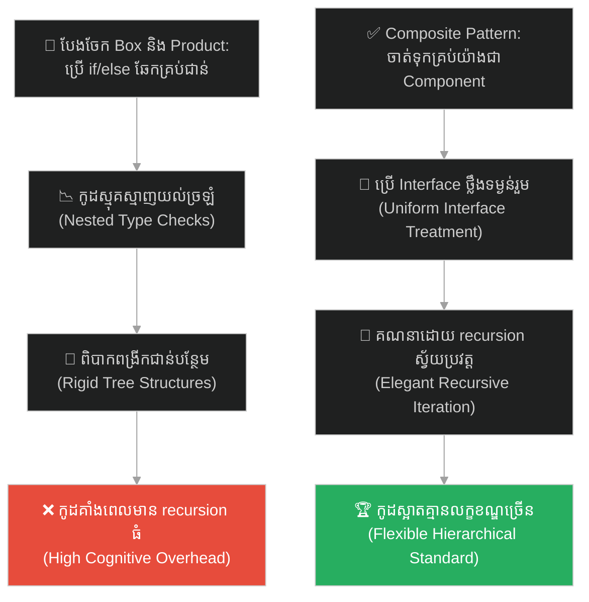
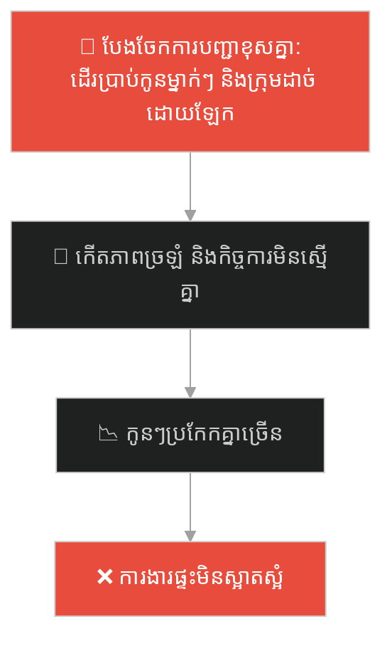
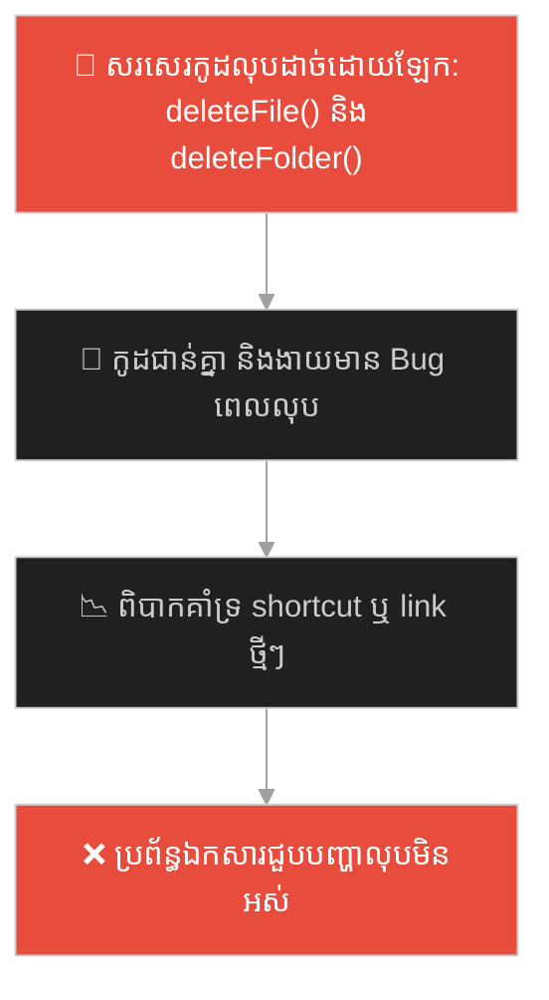
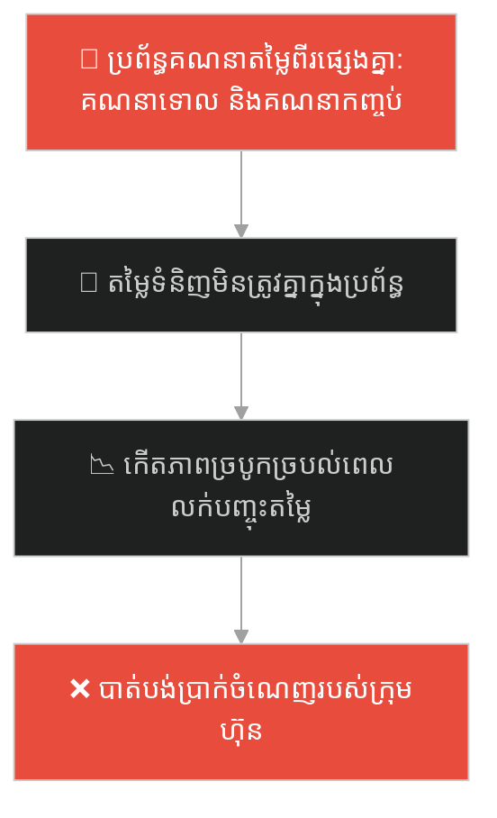
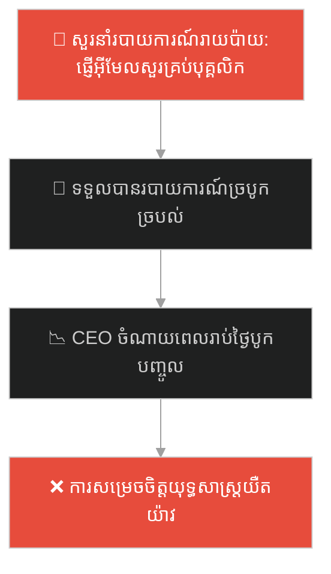
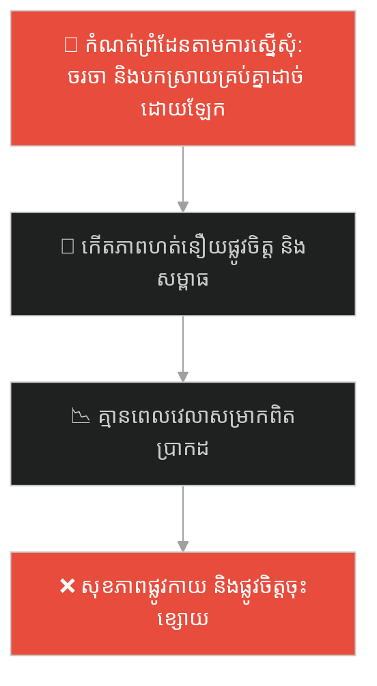
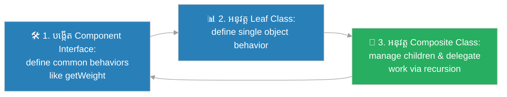

# Composite Design Pattern (លំនាំរចនាសមាសធាតុផ្សំ)៖ ប្រអប់កាដូរុំត្រួតគ្នា (Composite Pattern & The Nested Gift Boxes)

**Author:** ichamrong  
**Date:** 2026-05-27  
**Tags:** #design-patterns #composite #architecture #software-engineering #parable  
**Category:** Concepts / Parables  
**Read Time:** ~15 min  

---

## 📌 មាតិកា (Table of Contents)
- [អន្ទាក់ផ្លូវចិត្ត (The Trap)](#0)
- [១. រឿងព្រេងប្រវត្តិសាស្ត្រ៖ ការថ្លឹងទម្ងន់ដ៏ស្មុគស្មាញ និងប្រអប់កាដូរុំត្រួតគ្នា (The Legend of the Nested Gift Boxes)](#1)
  - [របស់ទាំងអស់គឺតែមួយ និងការថ្លឹងទម្ងន់សាមញ្ញ (The Uniform Weight Label Solution)](#1-1)
- [២. បញ្ហា៖ ការសរសេរកូដលក្ខខណ្ឌស្មុគស្មាញ និងការគ្រប់គ្រងរចនាសម្ព័ន្ធមែកធាង (The Issue: Recursive Tree Layout and If/Else Overhead)](#2)
- [៣. ឧទាហរណ៍ជាក់ស្តែងក្នុងពិភពពិត (Real World Examples)](#3)
  - [ឧទាហរណ៍ទី ១ — កម្រិតស្រាល (គ្រួសារ)៖ ការចាត់ចែងការងារជូនកូនម្នាក់ ឬក្រុមគ្រួសារទាំងមូល (Distributing Chores to a Child or Family Group)](#3-1)
  - [ឧទាហរណ៍ទី ២ — កម្រិតមធ្យម (បច្ចេកទេស)៖ ប្រព័ន្ធគ្រប់គ្រងថត និងឯកសារក្នុងកុំព្យូទ័រ (Folder and File Management in FileSystem)](#3-2)
  - [ឧទាហរណ៍ទី ៣ — កម្រិតមធ្យម (ធុរកិច្ច)៖ ការគណនាតម្លៃទំនិញទោល និងកញ្ចប់ផលិតផលរួមបញ្ចូលគ្នា (Calculating Inventory Value of Bundled Products)](#3-3)
  - [ឧទាហរណ៍ទី ៤ — កម្រិតមធ្យម (សង្គម/គ្រប់គ្រង)៖ ការស្នើសុំរបាយការណ៍ពីបុគ្គល ឬពីនាយកដ្ឋានទាំងមូល (Requesting Progress Reports from Nested Team Structures)](#3-4)
  - [ឧទាហរណ៍ទី ៥ — កម្រិតធ្ងន់ (ទំនាក់ទំនង)៖ ការកំណត់ព្រំដែនសង្គមសម្រាប់បុគ្គល និងក្រុមគ្រួសារ (Setting Social Boundaries for Friends and Family Circles)](#3-5)
- [៤. ដំណោះស្រាយទូទៅ៖ ការអនុវត្ត Composite Pattern តាមរយៈ Recursive Interfaces (The General Solution: Composite Pattern with Component Hierarchies)](#4)
- [សេចក្តីសន្និដ្ឋាន (Conclusion)](#5)
- [ឯកសារយោង (References)](#6)
- [Related Posts](#7)

---

<a id="0"></a>
## អន្ទាក់ផ្លូវចិត្ត (The Trap)

តើអ្នកធ្លាប់ជួបបញ្ហាដែលអ្នកត្រូវដោះស្រាយជាមួយវត្ថុទោល (Leaf) និងក្រុមវត្ថុដែលប្រមូលផ្តុំគ្នា (Composite) ក្នុងទម្រង់រៀបចំជាន់គ្នា (Nested Hierarchies) រហូតដល់ត្រូវសរសេរកូដត្រួតពិនិត្យលក្ខខណ្ឌ (If/Else) ស្មុគស្មាញជាច្រើនជាន់ដែរឬទេ?

នៅក្នុងការអភិវឌ្ឍប្រព័ន្ធ៖
* **យើងងាយនឹងធ្លាក់ក្នុងអន្ទាក់** នៃការបែងចែក និងចាត់ចែងការងាររវាងវត្ថុទោល និងក្រុមប្រមូលផ្តុំដាច់ដោយឡែកពីគ្នា ដែលនាំឱ្យកូដទាំងមូលពោរពេញដោយការឆែកប្រភេទ Object និងកូដត្រួតពិនិត្យដ៏រញ៉េរញ៉ៃ។
* **យើងមើលរំលង** ការចាត់ទុករបស់របរទោល និងប្រអប់ប្រមូលផ្តុំជាវត្ថុតែមួយ (Uniform Treatment) តាមរយៈការប្រើប្រាស់ Interface រួមមួយ។

ការព្យាយាមសរសេរកូដឆែកលក្ខខណ្ឌដាច់ដោយឡែករវាងធាតុទោល និងសមាសភាគផ្សំជាន់គ្នា ហៅថា **អន្ទាក់ត្រួតពិនិត្យប្រភេទសមាសធាតុផ្សំ (Manual Type Checking in Tree Layout Trap)**។

ដើម្បីយល់ដឹងពីរបៀបចាត់ចែងរចនាសម្ព័ន្ធមែកធាងប្រកបដោយភាពងាយស្រួល ផែនទីបង្ហាញផ្លូវមានដូចខាងក្រោម៖
1. **រឿងព្រេងប្រវត្តិសាស្ត្រ (The Historic Legend)** — រឿងរ៉ាវរបស់អ្នកគិតលុយដែលជួបប្រអប់កាដូរុំត្រួតគ្នាជាច្រើនជាន់។
2. **បញ្ហា (The Issue)** — ការវិភាគភាពស្មុគស្មាញនៃការគ្រប់គ្រងប្រព័ន្ធ Tree ក្នុង OOP និងកូដឆែកលក្ខខណ្ឌ។
3. **ឧទាហរណ៍ជាក់ស្តែងក្នុងពិភពពិត (Real World Examples)** — ពិនិត្យមើលបញ្ហានេះក្នុងកម្រិតគ្រួសារ បច្ចេកវិទ្យា ធុរកិច្ច ការគ្រប់គ្រង និងទំនាក់ទំនង។
4. **ដំណោះស្រាយទូទៅ (The General Solution)** — ការអនុវត្ត Composite Pattern ដើម្បីសរសេរកូដឱ្យធាតុទាំងអស់ដំណើរការជាមួយគ្នាបានយ៉ាងស្មើភាព។



---

<a id="1"></a>
## ១. រឿងព្រេងប្រវត្តិសាស្ត្រ៖ ការថ្លឹងទម្ងន់ដ៏ស្មុគស្មាញ និងប្រអប់កាដូរុំត្រួតគ្នា (The Legend of the Nested Gift Boxes)

មានបុរសម្នាក់បានរៀបចំកាដូដ៏ធំមួយ ដើម្បីផ្ញើទៅជូនមិត្តភក្តិរបស់គាត់ដែលរស់នៅខេត្តផ្សេង។ គាត់បានយកប្រអប់កាដូនោះទៅកាន់បញ្ជរគិតលុយរបស់ក្រុមហ៊ុនដឹកជញ្ជូន ដើម្បីបង់ថ្លៃសេវាដឹក។

នៅពេលអ្នកគិតលុយទទួលយកប្រអប់កាដូនោះ គាត់ត្រូវគណនាទម្ងន់សរុបដើម្បីកំណត់តម្លៃ។ បញ្ហាគឺ ប្រអប់កាដូនោះមានរចនាសម្ព័ន្ធស្មុគស្មាញខ្លាំង៖
* នៅក្នុងប្រអប់ធំ មាន **ទូរស័ព្ទដៃមួយគ្រឿង** និងមាន **ប្រអប់តូចមួយទៀត**។
* នៅក្នុងប្រអប់តូចនោះ មាន **ឆ្នាំងសាក** និង **កាសស្តាប់**។

ដោយសារក្រុមហ៊ុនដឹកជញ្ជូនគ្មានប្រព័ន្ធស្តង់ដារ អ្នកគិតលុយត្រូវអង្គុយសរសេររូបមន្ត និងពិនិត្យយ៉ាងលំបាក៖ 
*"ប្រសិនបើវាជារបស់របរទោល (ទូរស័ព្ទ) ខ្ញុំអាចថ្លឹងវាភ្លាមៗ។ ប្រសិនបើវាជាប្រអប់ ខ្ញុំត្រូវបើកប្រអប់នោះ រួចថ្លឹងរបស់របរខាងក្នុងម្តងមួយៗ ហើយបូកបញ្ចូលគ្នា។ ប្រសិនបើនៅក្នុងប្រអប់នោះមានប្រអប់តូចៗជាច្រើនជាន់ទៀត ខ្ញុំប្រាកដជាវង្វេងមិនខាន!"*

គាត់ត្រូវសរសេរកូដឆែកលក្ខខណ្ឌ (If/Else) ជាច្រើនជាន់ ដើម្បីបែងចែករវាង "របស់របរធម្មតា" និង "ប្រអប់រួមបញ្ចូល" ដែលធ្វើឱ្យការងារគិតលុយយឺតយ៉ាវខ្លាំង និងងាយមានកំហុស។

---

<a id="1-1"></a>
### របស់ទាំងអស់គឺតែមួយ និងការថ្លឹងទម្ងន់សាមញ្ញ (The Uniform Weight Label Solution)

ប្រធានផ្នែកដឹកជញ្ជូនថ្មីដែលបានសិក្សាពីស្ថាបត្យកម្មប្រព័ន្ធ បានសម្រេចចិត្តផ្លាស់ប្តូរច្បាប់នេះភ្លាមៗ។ គាត់បានបង្កើតគោលការណ៍រួមមួយគឺ៖ **មិនថាវាជារបស់របរទោល ឬជាប្រអប់រួមបញ្ចូលទេ ពួកវាទាំងអស់ត្រូវតែមានស្លាកសញ្ញារួម "ស្វែងរកទម្ងន់ (getWeight())" ដូចៗគ្នា**។

ឥឡូវនេះ៖
* នៅពេលហៅ `getWeight()` លើ **ទូរស័ព្ទដៃ** វានឹងប្រាប់ភ្លាមៗថាវាមានទម្ងន់ 200g ( Leaf Node )។
* នៅពេលហៅ `getWeight()` លើ **ប្រអប់តូច** ( Composite Node ) វានឹងសួររកទម្ងន់ពីរបស់របរទាំងអស់ដែលនៅក្នុងនោះ (ឆ្នាំងសាក ១០០g + កាស ៥០g) រួចឆ្លើយមកវិញភ្លាមៗថា ខ្ញុំមានទម្ងន់ ១៥០g។
* នៅពេលហៅ `getWeight()` លើ **ប្រអប់ធំ** វានឹងសួររកទម្ងន់ពីរបស់របរ និងប្រអប់តូចដែលនៅក្នុងនោះ (ទូរស័ព្ទ ២០០g + ប្រអប់តូច ១៥០g) រួចប្រគល់លទ្ធផលសរុប ៣៥០g ដោយស្វ័យប្រវត្តតាមរយៈ Recursion។

អ្នកគិតលុយលែងខ្វល់ខ្វាយអំពីការបើកកាដូ ឬឆែកមើលថាតើខាងក្នុងមានប្រអប់ប៉ុន្មានជាន់ទៀតហើយ។ គាត់គ្រាន់តែហៅ Method `getWeight()` លើប្រអប់ធំជាការស្រេច។

---

<a id="2"></a>
## ២. បញ្ហា៖ ការសរសេរកូដលក្ខខណ្ឌស្មុគស្មាញ និងការគ្រប់គ្រងរចនាសម្ព័ន្ធមែកធាង (The Issue: Recursive Tree Layout and If/Else Overhead)

នៅក្នុងការរចនាកូដកម្មវិធី បញ្ហានេះតែងតែកើតមានឡើងនៅពេលយើងដោះស្រាយរចនាសម្ព័ន្ធមែកធាង (Tree Structures) ដូចជា File System, Org Chart, ឬ XML Node៖

```java
// កូដដែលគ្មាន Composite ត្រូវប្រើ if/else ឆែកប្រភេទជានិច្ច
if (item instanceof File) {
    totalSize += ((File) item).getSize();
} else if (item instanceof Directory) {
    totalSize += ((Directory) item).calculateTotalSize();
}
```

* **កូដស្មុគស្មាញ និងពិបាកថែទាំ (Code Fragility)៖** រាល់ពេលបន្ថែមប្រភេទសមាសធាតុថ្មី យើងត្រូវទៅកែកូដឆែកលក្ខខណ្ឌនៅគ្រប់កន្លែងទាំងអស់ក្នុងកម្មវិធី។
* **ការបាត់បង់ភាពសាមញ្ញ (Loss of Uniformity)៖** Client ត្រូវដឹងច្បាស់ពីប្រភេទជាក់ស្តែងរបស់ Object នីមួយៗ ទើបអាចបញ្ជាការងារបាន ដែលផ្ទុយពីគោលការណ៍ Abstraction។

**Composite Design Pattern** ជួយដោះស្រាយបញ្ហានេះដោយផ្តល់នូវ Component Interface រួមមួយ ដើម្បីឱ្យទាំង Leaf (របស់របរ) និង Composite (ប្រអប់) អាចអនុវត្តតាម ដែលអនុញ្ញាតឱ្យយើងបញ្ជាការងារលើពួកវាទាំងអស់ដោយប្រើកូដតែមួយ។

---

<a id="3"></a>
## ៣. ឧទាហរណ៍ជាក់ស្តែងក្នុងពិភពពិត

---

<a id="3-1"></a>
### ឧទាហរណ៍ទី ១ — កម្រិតស្រាល (គ្រួសារ)៖ ការចាត់ចែងការងារជូនកូនម្នាក់ ឬក្រុមគ្រួសារទាំងមូល (Distributing Chores to a Child or Family Group)

នៅក្នុងគ្រួសារមួយ ម្តាយចង់ចាត់ចែងភារកិច្ចសម្អាតផ្ទះ។ ជំនួសឱ្យការប្រើប្រាស់វិធីសាស្ត្រខុសគ្នាសម្រាប់កូនម្នាក់ៗ និងក្រុមគ្រួសារ (ដូចជា និយាយជាមួយកូនម្នាក់បែបផ្សេង និងនិយាយជាមួយក្រុមគ្រួសារបែបផ្សេង) ម្តាយបានចាត់ទុកកូនម្នាក់ៗ និងក្រុមក្មេងៗទាំងអស់ជា "អ្នកបំពេញភារកិច្ច (Component)" ដូចគ្នា។ គាត់គ្រាន់តែបញ្ជាទៅកាន់អ្នកតំណាង នោះភារកិច្ចនឹងត្រូវបែងចែកបន្តដោយស្វ័យប្រវត្ត។



ម្តាយបានប្រើគោលការណ៍ Composite style ដើម្បីចាត់ចែងភារកិច្ចឱ្យមានភាពស្មើភាព។

---

<a id="3-2"></a>
### ឧទាហរណ៍ទី ២ — កម្រិតមធ្យម (បច្ចេកទេស)៖ ប្រព័ន្ធគ្រប់គ្រងថត និងឯកសារក្នុងកុំព្យូទ័រ (Folder and File Management in FileSystem)

នៅក្នុងប្រព័ន្ធកុំព្យូទ័រ ថត (Folder) អាចផ្ទុកទាំងឯកសារទោល (File) និងថតតូចៗជាច្រើនជាន់ទៀត។ ជំនួសឱ្យការសរសេរកូដដាច់ដោយឡែកសម្រាប់លុប File និងលុប Folder វិស្វករបានចាត់ទុកពួកវាទាំងអស់ជា `FileSystemNode` ដែលមាន Method `delete()` ដូចគ្នា។



---

<a id="3-3"></a>
### ឧទាហរណ៍ទី ៣ — កម្រិតមធ្យម (ធុរកិច្ច)៖ ការគណនាតម្លៃទំនិញទោល និងកញ្ចប់ផលិតផលរួមបញ្ចូលគ្នា (Calculating Inventory Value of Bundled Products)

ក្រុមហ៊ុនលក់ទំនិញអនឡាញលក់ទាំងទំនិញទោល (ដូចជា ខ្មៅដៃ សៀវភៅ) និងកញ្ចប់ផលិតផលរួមគ្នា (Bundle - ដូចជា កញ្ចប់សិក្សាដែលមានខ្មៅដៃ សៀវភៅ និងជ័រលុប)។ ជំនួសឱ្យការសរសេរប្រព័ន្ធកត់ត្រាតម្លៃពីរផ្សេងគ្នា ក្រុមហ៊ុនបានអនុវត្ត Composite Pattern ដោយឱ្យទាំងទំនិញទោល និងកញ្ចប់ផលិតផលប្រើប្រាស់ Method `getPrice()` ដូចគ្នា។



---

<a id="3-4"></a>
### ឧទាហរណ៍ទី ៤ — កម្រិតមធ្យម (សង្គម/គ្រប់គ្រង)៖ ការស្នើសុំរបាយការណ៍ពីបុគ្គល ឬពីនាយកដ្ឋានទាំងមូល (Requesting Progress Reports from Nested Team Structures)

នៅក្នុងក្រុមហ៊ុនធំមួយ នាយកប្រតិបត្តិ (CEO) ចង់បានរបាយការណ៍ការងារ។ ជំនួសឱ្យការសរសេរអ៊ីមែល និងទម្រង់សួរនាំដាច់ដោយឡែកសម្រាប់បុគ្គលិកម្នាក់ៗ និងប្រធាននាយកដ្ឋាននីមួយៗ CEO គ្រាន់តែផ្ញើសំណើ "សុំរបាយការណ៍ការងារ (getReport())" ទៅកាន់ថ្នាក់ដឹកនាំជាន់ខ្ពស់ នោះវានឹងប្រមូលទិន្នន័យបន្តបន្ទាប់ពីគ្រប់ផ្នែករហូតដល់បុគ្គលិកថ្នាក់ក្រោមដោយស្វ័យប្រវត្តិ។



---

<a id="3-5"></a>
### ឧទាហរណ៍ទី ៥ — កម្រិតធ្ងន់ (ទំនាក់ទំនង)៖ ការកំណត់ព្រំដែនសង្គមសម្រាប់បុគ្គល និងក្រុមគ្រួសារ (Setting Social Boundaries for Friends and Family Circles)

នៅក្នុងជីវិតរស់នៅ បុគ្គលម្នាក់ត្រូវកំណត់ពេលវេលា និងព្រំដែនផ្ទាល់ខ្លួន (Social Boundaries)។ ជំនួសឱ្យការដោះស្រាយ និងកំណត់គោលការណ៍ផ្សេងៗគ្នាសម្រាប់មិត្តភក្តិម្នាក់ៗ និងក្រុមគ្រួសារស្មុគស្មាញ (ដែលនាំឱ្យហត់នឿយអារម្មណ៍) គាត់បានកំណត់គោលការណ៍រួមមួយគឺ៖ *"រាល់ថ្ងៃអាទិត្យ គឺជាថ្ងៃសម្រាកផ្ទាល់ខ្លួន មិនទទួលរាល់ការជួបជុំទាំងអស់"* ដែលចាត់ទុកទាំងមិត្តភក្តិទោល និងក្រុមគ្រួសារទាំងមូលជា "Component" ស្មើៗគ្នា។



---

<a id="4"></a>
## ៤. ដំណោះស្រាយទូទៅ៖ ការអនុវត្ត Composite Pattern តាមរយៈ Recursive Interfaces (The General Solution: Composite Pattern with Component Hierarchies)

ដើម្បីដោះស្រាយ និងគ្រប់គ្រងរចនាសម្ព័ន្ធជាន់គ្នាប្រកបដោយភាពងាយស្រួល យើងត្រូវអនុវត្តលំនាំរចនា **Composite Pattern**៖



ជំហាននៃការអនុវត្ត៖
1. **បង្កើត Component Interface៖** បង្កើត Interface រួមមួយដែលកំណត់រាល់កិច្ចការទាំងឡាយដែលទាំងរបស់របរទោល និងប្រអប់រួមបញ្ចូលត្រូវបំពេញ (ដូចជា `getWeight()`, `getPrice()`)។
2. **អនុវត្ត Leaf Class៖** បង្កើត Class សម្រាប់របស់របរទោល ដែលអនុវត្តការងារដោយផ្ទាល់ និងគ្មានកូនចៅនៅពីក្រោមឡើយ។
3. **អនុវត្ត Composite Class៖** បង្កើត Class សម្រាប់ប្រអប់រួមបញ្ចូល ដែលអាចផ្ទុក Array របស់ Components (ទាំង Leafs និង Composites ផ្សេងទៀត)។ នៅក្នុង Methods របស់ខ្លួន វានឹងរុញបញ្ជាបន្តទៅឱ្យកូនៗទាំងអស់របស់វា និងប្រមូលលទ្ធផលសរុបត្រឡប់មកវិញតាមរយៈ Recursion។

---

## 🐇 ធ្លាក់ចូលក្នុងរន្ធទន្សាយ (Enter the Rabbit Hole)

ដើម្បីស្វែងយល់ពីរបៀបដែលប្រព័ន្ធបង្កើតរូបភាពភាគល្អិតក្នុងហ្គេម 3D ខ្នាតយក្ស បានដោះស្រាយបញ្ហាកង្វះខាត Memory យ៉ាងធ្ងន់ធ្ងរ នៅពេលបង្កើតគ្រាប់កាំភ្លើង ឬភាគល្អិតរាប់លានក្នុងពេលតែមួយ តាមរយៈការចែករំលែកទិន្នន័យស្នូល និងការរក្សាទុកតែទិន្នន័យផ្លាស់ប្តូរ (Flyweight Pattern) សូមបន្តដំណើរទៅកាន់៖

* 🚀 **[ចាប់ផ្តើមដំណើររុករក (Start the Journey) ➔ Flyweight Pattern and Memory Optimization](./85-the-forest-of-a-million-trees.md)**

---

<a id="5"></a>
## សេចក្តីសន្និដ្ឋាន (Conclusion)

> **«កុំព្យាយាមសរសេរកូដឆែកលក្ខខណ្ឌ ដើម្បីបែងចែករវាងប្រអប់ និងរបស់របរ។ ចូរចាត់ទុកពួកវាទាំងអស់ជាសមាជិកដ៏ស្មើភាព ដើម្បីរក្សាភាពស្រស់ស្អាត និងល្បឿននៃប្រព័ន្ធរបស់អ្នក។»**

ចូរធ្វើខ្លួនជាវិស្វករកម្មវិធីដែលយល់ដឹងពីសិល្បៈនៃការគ្រប់គ្រងរចនាសម្ព័ន្ធមែកធាង (Tree Representation)។ ការអនុវត្ត Composite Design Pattern មិនត្រឹមតែជួយឱ្យកូដរបស់អ្នកមានភាពសាមញ្ញ និងជៀសវាងការសរសេរកូដលក្ខខណ្ឌច្រើនជាន់ប៉ុណ្ណោះទេ ប៉ុន្តែវាក៏ជួយឱ្យប្រព័ន្ធរបស់អ្នកអាចគាំទ្រការរួមផ្សំគ្នាដ៏សំបូរបែបដោយគ្មានដែនកំណត់ឡើយ។

---

<a id="6"></a>
## ឯកសារយោង (References)

* **Erich Gamma, Richard Helm, Ralph Johnson, John Vlissides** — *Design Patterns: Elements of Reusable Object-Oriented Software* (1994). Composite Design Pattern Chapter.
* **Robert C. Martin** — *Clean Code: A Handbook of Agile Software Craftsmanship* (2008).
* **Martin Fowler** — *Refactoring: Improving the Design of Existing Code* (2018).

---

<a id="7"></a>
## Related Posts

* **[84 Composite Pattern: Uniform Object and Hierarchy Treatment](../articles/84-composite-pattern.md)** — អត្ថបទវិទ្យាសាស្ត្រលម្អិត និងកូដគំរូ Java/C# សម្រាប់ប្រព័ន្ធ FileSystem ជាន់គ្នា។
* **[83 The Universal Remote](./83-the-universal-remote.md)** — ការផ្តាច់ Abstraction ចេញពី Implementation ដើម្បីឱ្យវិមាត្រទាំងពីរអភិវឌ្ឍដោយឯករាជ្យ។
* **[64 The Swiss Army Knife](./64-the-swiss-army-knife.md)** — ការរក្សាមុខងារជាក់លាក់ និងការជៀសវាងការកសាងសមាសភាគស្មុគស្មាញហួសហេតុ។

---

## Related

- [💡 Concepts README](../README.md)
- [📚 Main Repository README](../../../README.md)
- [Developer Habits](../../developer-habits/README.md)
- [Mental Health & Well-being](../../mental-health/README.md)
- [Management & SDLC](../../management/README.md)
