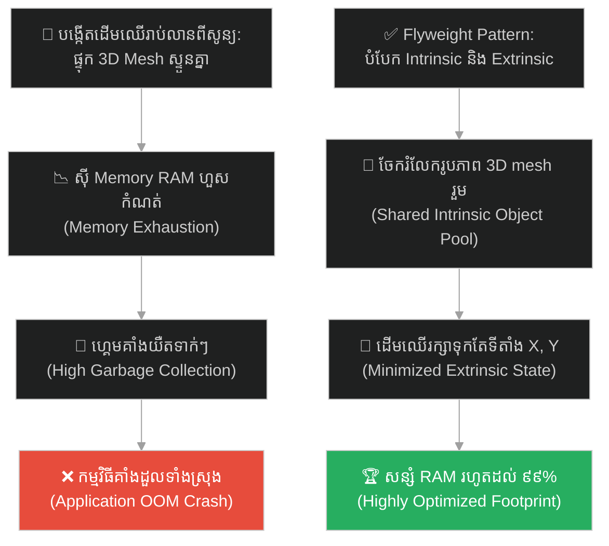
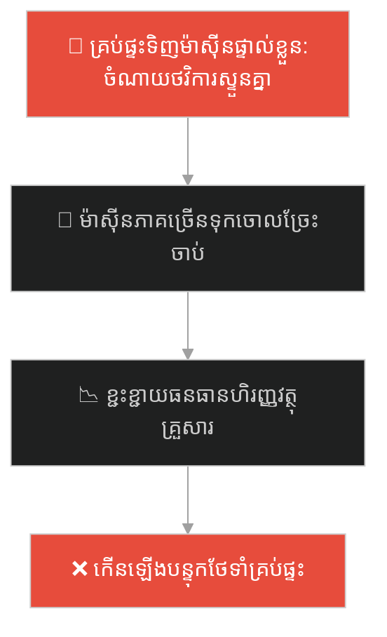
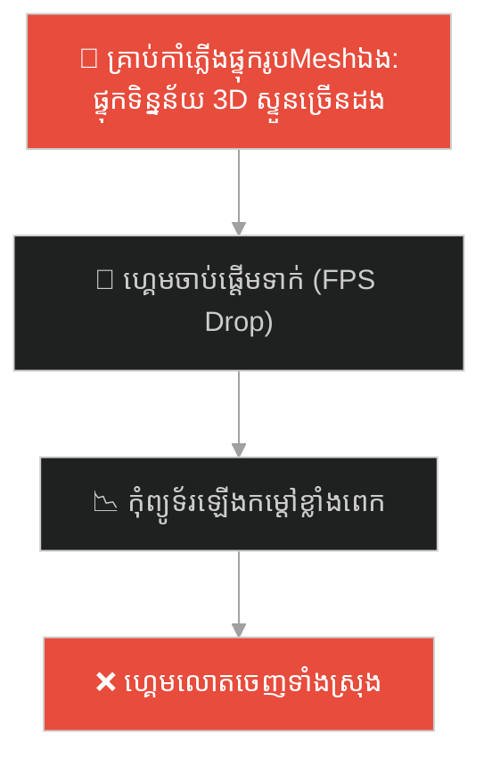
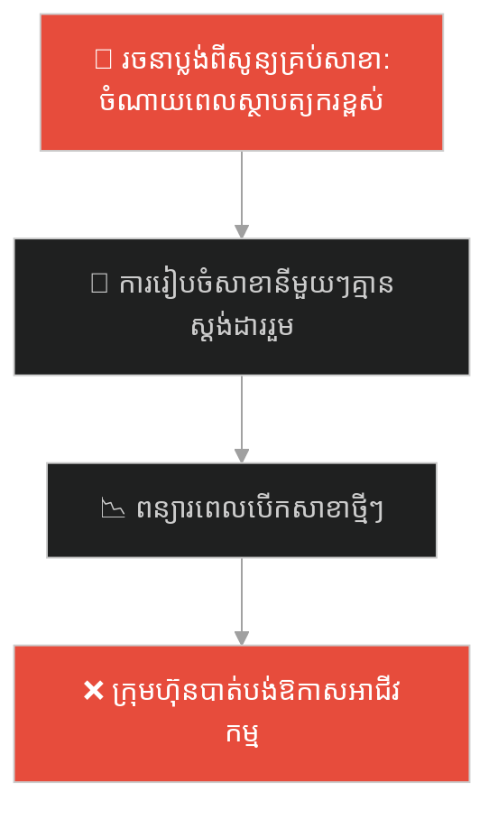
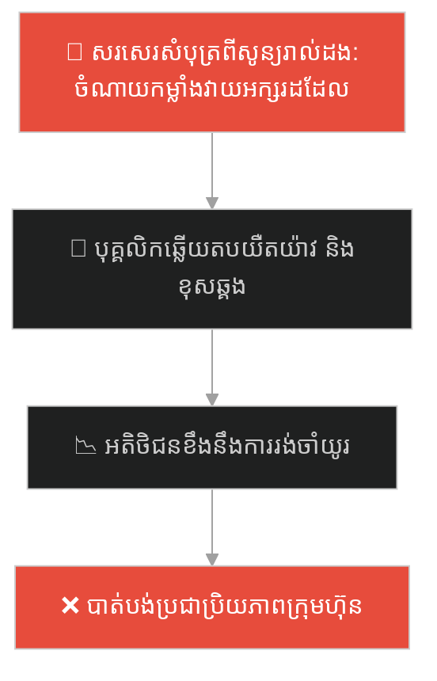
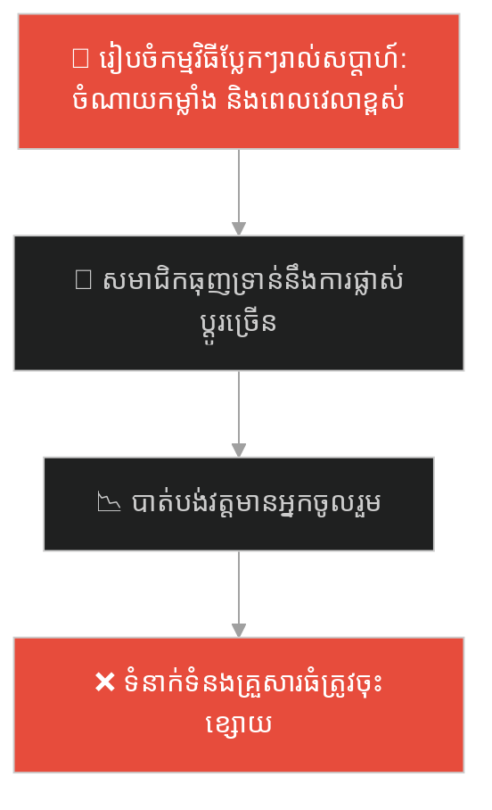
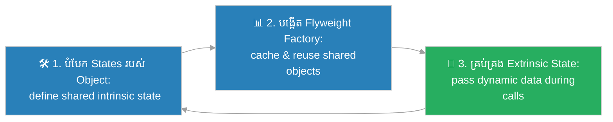

# Flyweight Design Pattern (លំនាំរចនាការចែករំលែកទម្ងន់ស្រាល)៖ ព្រៃឈើរាប់លានដើម (Flyweight Pattern & The Forest of a Million Trees)

**Author:** ichamrong  
**Date:** 2026-05-27  
**Tags:** #design-patterns #flyweight #architecture #software-engineering #parable  
**Category:** Concepts / Parables  
**Read Time:** ~15 min  

---

## 📌 មាតិកា (Table of Contents)
- [អន្ទាក់ផ្លូវចិត្ត (The Trap)](#0)
- [១. រឿងព្រេងប្រវត្តិសាស្ត្រ៖ ព្រៃឈើរាប់លានដើម និងវិបត្តិកង្វះខាត Memory (The Legend of the Forest of a Million Trees)](#1)
  - [ការបែងចែកវិញ្ញាណរួម និងការសន្សំសំចៃធនធាន (The Shared Model Solution)](#1-1)
- [២. បញ្ហា៖ ការប្រើប្រាស់ Memory ហួសប្រមាណ និងការបង្កើត Object ស្ទួនៗ (The Issue: Massive Object Memory Overhead and Duplicate States)](#2)
- [៣. ឧទាហរណ៍ជាក់ស្តែងក្នុងពិភពពិត (Real World Examples)](#3)
  - [ឧទាហរណ៍ទី ១ — កម្រិតស្រាល (គ្រួសារ)៖ ការប្រើប្រាស់ឧបករណ៍ធ្ងន់ៗរួមគ្នាក្នុងសហគមន៍ (Sharing Heavy Lawn Mowers in the Neighborhood)](#3-1)
  - [ឧទាហរណ៍ទី ២ — កម្រិតមធ្យម (បច្ចេកទេស)៖ ការបង្កើតភាគល្អិត ឬគ្រាប់កាំភ្លើងក្នុងហ្គេម 3D (Rendering Millions of Particles in Game Engines)](#3-2)
  - [ឧទាហរណ៍ទី ៣ — កម្រិតមធ្យម (ធុរកិច្ច)៖ ការប្រើប្រាស់ប្លង់គំរូហាងដដែលៗសម្រាប់ហាងម៉ាកល្បី (Reusing Store Blueprints for Franchise Outlets)](#3-3)
  - [ឧទាហរណ៍ទី ៤ — កម្រិតមធ្យម (សង្គម/គ្រប់គ្រង)៖ ការបង្កើតគំរូការងារស្តង់ដារសម្រាប់ផ្នែកសេវាកម្មអតិថិជន (Standardized Task Templates for Customer Support Tickets)](#3-4)
  - [ឧទាហរណ៍ទី ៥ — កម្រិតធ្ងន់ (ទំនាក់ទំនង)៖ ការពឹងផ្អែកលើប្រពៃណីសហគមន៍រួមដើម្បីបង្កើតភាពស្និទ្ធស្នាល (Relying on Shared Community Traditions to Bond)](#3-5)
- [៤. ដំណោះស្រាយទូទៅ៖ ការអនុវត្ត Flyweight Pattern តាមរយៈ Intrinsic-Extrinsic Separation (The General Solution: Flyweight Pattern with Shared Intrinsic State Pools)](#4)
- [សេចក្តីសន្និដ្ឋាន (Conclusion)](#5)
- [ឯកសារយោង (References)](#6)
- [Related Posts](#7)

---

<a id="0"></a>
## អន្ទាក់ផ្លូវចិត្ត (The Trap)

តើអ្នកធ្លាប់ជួបបញ្ហាដែលកម្មវិធីរបស់អ្នកគាំង ឬដំណើរការយឺតយ៉ាវយ៉ាងខ្លាំង ដោយសារតែត្រូវផ្ទុក ឬបង្កើតរបស់ដែលស្រដៀងៗគ្នារាប់សិបម៉ឺនដងនៅក្នុង Memory ដែរឬទេ?

នៅក្នុងការរចនាប្រព័ន្ធ៖
* **យើងងាយនឹងធ្លាក់ក្នុងអន្ទាក់** នៃការបង្កើត Object ថ្មីទាំងស្រុងរាល់ពេលដែលត្រូវការប្រើ (Instantiation from scratch) ទោះបីជា Object ទាំងនោះមានទិន្នន័យរួមដូចគ្នា ៩៩% ក៏ដោយ ដែលនាំឱ្យខាតបង់ធនធានប្រព័ន្ធ និងស៊ី RAM ហួសកម្រិត។
* **យើងមើលរំលង** ការទាញយកផ្នែកដែលដូចគ្នា និងមិនផ្លាស់ប្តូរ (Intrinsic State) ទៅដាក់រួមគ្នាក្នុង Object ចែករំលែកតែមួយ រួចរក្សាទុកដាច់ដោយឡែកតែផ្នែកដែលប្រែប្រួល (Extrinsic State) របស់ Object នីមួយៗ។

ការព្យាយាមបង្កើតរបស់របររាប់លានដែលដូចគ្នាឡើងវិញដដែលៗក្នុង Memory ហៅថា **អន្ទាក់ផ្ទុកទិន្នន័យស្ទួនបំផ្លាញប្រព័ន្ធ (Redundant Object Memory Exhaustion Trap)**។

ដើម្បីយល់ដឹងពីរបៀបសន្សំសំចៃ Memory និងការចែករំលែកទិន្នន័យដ៏ល្អឥតខ្ចោះ នេះជាផែនទីបង្ហាញផ្លូវ៖
1. **រឿងព្រេងប្រវត្តិសាស្ត្រ (The Historic Legend)** — រឿងរ៉ាវរបស់វិស្វករហ្គេមដែលព្យាយាមដាំដើមឈើរាប់លានដើមរហូតដល់កុំព្យូទ័រគាំង។
2. **បញ្ហា (The Issue)** — ការវិភាគការស៊ី Memory ខ្ពស់ក្នុង OOP និងការបង្កើត Object ស្ទួនគ្នា។
3. **ឧទាហរណ៍ជាក់ស្តែងក្នុងពិភពពិត (Real World Examples)** — ពិនិត្យមើលបញ្ហានេះក្នុងកម្រិតគ្រួសារ បច្ចេកវិទ្យា ធុរកិច្ច ការគ្រប់គ្រង និងទំនាក់ទំនង។
4. **ដំណោះស្រាយទូទៅ (The General Solution)** — ការអនុវត្ត Flyweight Pattern ដើម្បីបង្កើតយន្តការសន្សំសំចៃ Memory ដ៏មានប្រសិទ្ធភាព។



---

<a id="1"></a>
## ១. រឿងព្រេងប្រវត្តិសាស្ត្រ៖ ព្រៃឈើរាប់លានដើម និងវិបត្តិកង្វះខាត Memory (The Legend of the Forest of a Million Trees)

នៅក្នុងស្ទូឌីយោអភិវឌ្ឍន៍ហ្គេម 3D ដ៏ធំមួយ ក្រុមអ្នកសរសេរកម្មវិធីចង់បង្កើតពិភពលោកហ្គេមដ៏អស្ចារ្យ ដែលមាន **ព្រៃឈើដ៏ក្រាស់ឃ្មឹកមានដើមឈើចំនួន ១,០០០,០០០ ដើម**។

ចំពោះដើមឈើនីមួយៗ ពួកគេបានបង្កើត Object ថ្មីមួយពីបាតដៃទទេ (ហៅថា `new Tree()`) ដែលមានផ្ទុក៖
* រូបរាងលម្អិត 3D Mesh (ទំហំ 10MB)
* ពណ៌ និងរូបភាពសម្បកឈើ (Texture ទំហំ 10MB)
* ទីតាំងនៅក្នុងហ្គេម (Coordinates X, Y coordinates: 1KB)

ដើមឈើមួយដើមត្រូវប្រើប្រាស់ Memory ទំហំ 20MB។ នៅពេលដែលហ្គេមបង្កើតដើមឈើចំនួន ១ លានដើមដើម្បីដាំជាព្រៃឈើ វាក៏ត្រូវការការចងចាំ RAM រហូតដល់ទៅ **២០,០០០ ជីហ្គាបៃ (20 TB)**! គ្រាន់តែអ្នកលេងបើកហ្គេមភ្លាម កុំព្យូទ័រទាំងអស់បានគាំងដំណើរការ និងលោតចេញពីហ្គេមភ្លាមៗដោយសារខ្វះខាត Memory (Out of Memory)។

---

<a id="1-1"></a>
### ការបែងចែកវិញ្ញាណរួម និងការសន្សំសំចៃធនធាន (The Shared Model Solution)

ដើម្បីសង្គ្រោះគម្រោងហ្គេមនេះ វិស្វករប្រព័ន្ធដ៏ឆ្លាតវៃម្នាក់បានចូលមកកត់សម្គាល់ឃើញពីភាពគ្មានប្រសិទ្ធភាពនេះ។ គាត់បានវិភាគឃើញថា ដើមឈើទាំង ១ លានដើមនោះ៖
1. **រូបរាង 3D និងពណ៌ (Intrinsic State - វិញ្ញាណរួម)៖** គឺដូចគ្នាបេះបិទរវាងដើមឈើនីមួយៗ និងមិនដែលប្រែប្រួលឡើយ។
2. **ទីតាំង X, Y (Extrinsic State - លក្ខណៈរៀងខ្លួន)៖** គឺជាផ្នែកតែមួយគត់ដែលខុសគ្នាពីដើមឈើមួយទៅដើមឈើមួយទៀត។

គាត់បានសម្រេចចិត្តប្រើប្រាស់ **លំនាំរចនា Flyweight Pattern** ដោយដកយករូបរាង 3D Mesh និង Texture ទាំងអស់ ចេញពីដើមឈើនីមួយៗ ហើយបង្កើតជា Object កណ្តាលតែមួយគត់ហៅថា `TreeModel` (ទំហំ 20MB)។

បន្ទាប់មក ដើមឈើទាំង ១ លានដើមលែងផ្ទុករូបភាព 3D ធ្ងន់ៗទៀតហើយ។ ពួកវាគ្រាន់តែរក្សាទុកទីតាំង (X, Y) របស់វា និង **ភ្ជាប់ខ្សែស្ពាន Reference** ទៅកាន់ `TreeModel` តែមួយគត់នោះ។ 

ពេលនេះ ដើមឈើទាំង ១ លានប្រើអស់ត្រឹមតែ 1MB (ព្រោះរក្សាទុកតែទិន្នន័យ X, Y តូច) បូករួមនឹងទំហំ 20MB របស់ `TreeModel` នាំឱ្យហ្គេមទាំងស្រុងប្រើប្រាស់ Memory សរុបត្រឹមតែ **២១ MB** ប៉ុណ្ណោះ! ព្រៃឈើរាប់លានដើមត្រូវបានបង្ហាញឡើងយ៉ាងរស់រវើក និងរលូនបំផុតលើកុំព្យូទ័រធម្មតា។

---

<a id="2"></a>
## ២. បញ្ហា៖ ការប្រើប្រាស់ Memory ហួសប្រមាណ និងការបង្កើត Object ស្ទួនៗ (The Issue: Massive Object Memory Overhead and Duplicate States)

នៅក្នុងការសរសេរកូដកម្មវិធី បញ្ហានេះកើតមានឡើងជាញឹកញាប់នៅពេលកម្មវិធីត្រូវការគ្រប់គ្រងរបស់រាប់ម៉ឺនដង ដូចជា អក្សរនីមួយៗក្នុង Word, ឬ Cell នីមួយៗក្នុង Excel៖

```java
// កូដដែលគ្មាន Flyweight បង្កើត Object ធ្ងន់ៗរាល់ពេល
for (int i = 0; i < 1000000; i++) {
    // ផ្ទុក Mesh និង Texture ដដែលៗរាប់លានដងក្នុង RAM
    Tree tree = new Tree(10, 20, "oak_mesh.3ds", "oak_texture.png"); 
}
```

* **ការខាតបង់ RAM ខ្ពស់ (Memory Inefficiency)៖** ការបង្កើត Object ច្រើនហួសប្រមាណបង្កើតបន្ទុកធ្ងន់ដល់ Garbage Collector ដែលនាំឱ្យកម្មវិធីយឺតយ៉ាវ។
* **ភាពលំបាកក្នុងការគ្រប់គ្រងទិន្នន័យ (Redundancy)៖** ប្រសិនបើចង់ផ្លាស់ប្តូររូបភាព Texture របស់ដើមឈើ យើងត្រូវដើរកែប្រែ Object ទាំង ១ លានដើមនោះ។

**Flyweight Design Pattern** ជួយដោះស្រាយបញ្ហានេះដោយបែងចែករដ្ឋរបស់ Object ជាពីរ៖ Intrinsic (ទិន្នន័យចែករំលែក) និង Extrinsic (ទិន្នន័យឆ្លងកាត់ពេលហៅ Method) ដើម្បីសន្សំសំចៃ Memory បានដល់ទៅ ៩៩%។

---

<a id="3"></a>
## ៣. ឧទាហរណ៍ជាក់ស្តែងក្នុងពិភពពិត

---

<a id="3-1"></a>
### ឧទាហរណ៍ទី ១ — កម្រិតស្រាល (គ្រួសារ)៖ ការប្រើប្រាស់ឧបករណ៍ធ្ងន់ៗរួមគ្នាក្នុងសហគមន៍ (Sharing Heavy Lawn Mowers in the Neighborhood)

នៅក្នុងសហគមន៍ផ្ទះជិតខាងគ្នា ជំនួសឱ្យការឱ្យគ្រប់ក្រុមគ្រួសារទាំងអស់ទៅទិញម៉ាស៊ីនកាត់ស្មៅដ៏ធ្ងន់ និងថ្លៃម្នាក់មួយគ្រឿងទុកនៅក្នុងផ្ទះរៀងៗខ្លួន (ដែលនាំឱ្យខ្ជះខ្ជាយថវិការ និងខូចដោយគ្មាននរណាប្រើ) សហគមន៍បានទិញម៉ាស៊ីនកាត់ស្មៅគំរូតែមួយ (Flyweight) ទុកនៅសាលាសហគមន៍ រួចអនុញ្ញាតឱ្យសមាជិកម្នាក់ៗមកខ្ចីយកទៅប្រើប្រាស់តាមផ្ទះរៀងៗខ្លួន។



សហគមន៍បានប្រើប្រាស់គោលការណ៍ Flyweight style ដើម្បីសន្សំសំចៃធនធាន។

---

<a id="3-2"></a>
### ឧទាហរណ៍ទី ២ — កម្រិតមធ្យម (បច្ចេកទេស)៖ ការបង្កើតភាគល្អិត ឬគ្រាប់កាំភ្លើងក្នុងហ្គេម 3D (Rendering Millions of Particles in Game Engines)

នៅក្នុងហ្គេមបាញ់ប្រហារ គ្រាប់កាំភ្លើងរាប់ម៉ឺនគ្រាប់ត្រូវហោះលើអេក្រង់ក្នុងពេលតែមួយ។ ជំនួសឱ្យការឱ្យគ្រាប់នីមួយៗផ្ទុករូបភាព Mesh 3D ផ្ទាល់ខ្លួន ហ្គេមបានបង្កើត `BulletModel` (Flyweight) រួមមួយ រួចឱ្យគ្រាប់កាំភ្លើងនីមួយៗរក្សាទុកតែទីតាំង (X, Y, Z) និងល្បឿនហោះហើរប៉ុណ្ណោះ។



---

<a id="3-3"></a>
### ឧទាហរណ៍ទី ៣ — កម្រិតមធ្យម (ធុរកិច្ច)៖ ការប្រើប្រាស់ប្លង់គំរូហាងដដែលៗសម្រាប់ហាងម៉ាកល្បី (Reusing Store Blueprints for Franchise Outlets)

ក្រុមហ៊ុនកាហ្វេហ្វ្រេនឆាយ (Franchise) ដ៏ធំមួយចង់បើកសាខាថ្មីចំនួន ៥០០ កន្លែងទូទាំងប្រទេស។ ជំនួសឱ្យការឱ្យស្ថាបត្យកររចនាប្លង់ហាងថ្មីស្រឡាង សរសេរពណ៌ និងរៀបចំគ្រឿងសង្ហារឹមពីចំណុចសូន្យសម្រាប់គ្រប់សាខា ក្រុមហ៊ុនបានប្រើប្រាស់ "ប្លង់គំរូស្តង់ដាររួម (Shared Blueprint)" តែមួយ រួចគ្រាន់តែកែប្រែអាសយដ្ឋាន និងទីតាំងដីជាក់ស្តែងប៉ុណ្ណោះ។



---

<a id="3-4"></a>
### ឧទាហរណ៍ទី ៤ — កម្រិតមធ្យម (សង្គម/គ្រប់គ្រង)៖ ការបង្កើតគំរូការងារស្តង់ដារសម្រាប់ផ្នែកសេវាកម្មអតិថិជន (Standardized Task Templates for Customer Support Tickets)

នៅក្នុងផ្នែកគាំទ្រអតិថិជន បុគ្គលិកត្រូវដោះស្រាយការងាររាប់ម៉ឺនសំណើក្នុងមួយថ្ងៃ។ ជំនួសឱ្យការសរសេរលិខិតឆ្លើយតប និងលក្ខខណ្ឌដោះស្រាយពីចំណុចសូន្យសម្រាប់រាល់សំបុត្រសំណើ (Ticket) បុគ្គលិកប្រើប្រាស់ "គំរូឆ្លើយតបស្តង់ដាររួម (Template Email - Intrinsic)" រួចគ្រាន់តែបំពេញឈ្មោះអតិថិជន និងលេខគណនីជាក់ស្តែង (Extrinsic) ប៉ុណ្ណោះ។



---

<a id="3-5"></a>
### ឧទាហរណ៍ទី ៥ — កម្រិតធ្ងន់ (ទំនាក់ទំនង)៖ ការពឹងផ្អែកលើប្រពៃណីសហគមន៍រួមដើម្បីបង្កើតភាពស្និទ្ធស្នាល (Relying on Shared Community Traditions to Bond)

នៅក្នុងការរៀបចំកម្មវិធីជួបជុំសមាជិកគ្រួសារធំដែលមានសមាជិករាប់រយនាក់ ជំនួសឱ្យការឱ្យអ្នករៀបចំកម្មវិធីអង្គុយច្នៃប្រឌិតប្រធានបទថ្មី ស្វែងរកមុខម្ហូបប្លែកៗ និងរៀបចំតន្ត្រីថ្មីស្រឡាងសម្រាប់សមាជិកម្នាក់ៗ (ដែលនាំឱ្យហត់នឿយខ្លាំង និងគ្មានអ្នកចូលរួម) គ្រួសារបានពឹងផ្អែកលើ "ពិធីបុណ្យចូលឆ្នាំប្រពៃណីរួម (Shared Festival)" ដែលជា Flyweight វប្បធម៌ រួចគ្រាន់តែមកជួបជុំគ្នានិយាយលេងកម្សាន្តប៉ុណ្ណោះ។



---

<a id="4"></a>
## ៤. ដំណោះស្រាយទូទៅ៖ ការអនុវត្ត Flyweight Pattern តាមរយៈ Intrinsic-Extrinsic Separation (The General Solution: Flyweight Pattern with Shared Intrinsic State Pools)

ដើម្បីសន្សំសំចៃ Memory និងជៀសវាងការបង្កើត Object ស្ទួនៗ យើងត្រូវអនុវត្តលំនាំរចនា **Flyweight Pattern**៖



ជំហាននៃការអនុវត្ត៖
1. **បំបែកទិន្នន័យជាពីរផ្នែក៖** កំណត់ Intrinsic State (ទិន្នន័យរួម មិនផ្លាស់ប្តូរ) និង Extrinsic State (ទិន្នន័យប្រែប្រួលរៀងខ្លួន)។
2. **បង្កើត Flyweight Class៖** បង្កើត Class ដែលផ្ទុកតែ Intrinsic State និងមាន Method ទទួលយក Extrinsic State ជា Parameter ពេលហៅការងារ។
3. **បង្កើត Flyweight Factory៖** បង្កើត Class កណ្តាលមួយដើម្បីគ្រប់គ្រង Pool របស់ Flyweights (ដូចជា Map Cache)។ ប្រសិនបើ Object ដែលស្នើសុំមានស្រាប់ក្នុង Pool វានឹងប្រគល់របស់នោះទៅវិញ តែបើគ្មានទេ វានឹងបង្កើតថ្មី និងរក្សាទុកក្នុង Pool សម្រាប់ប្រើប្រាស់លើកក្រោយ។

---

## 🐇 ធ្លាក់ចូលក្នុងរន្ធទន្សាយ (Enter the Rabbit Hole)

ដើម្បីស្វែងយល់ពីរបៀបដែលព្រះរាជាណាចក្រដ៏អស្ចារ្យមួយ បានសម្រួលការការពារព្រំដែន និងការគ្រប់គ្រងច្រកទ្វារប្រាសាទ ដោយដាក់ "ទ្វារអនុញ្ញាតសម្របសម្រួលកណ្តាល" ដើម្បីត្រួតពិនិត្យ និងការពារផ្ទះស្តេចពីជនខិលខូច (Proxy Pattern) សូមបន្តដំណើរទៅកាន់៖

* 🚀 **[ចាប់ផ្តើមដំណើររុករក (Start the Journey) ➔ Proxy Pattern and Controlled Access](./86-the-kings-gatekeeper.md)**

---

<a id="5"></a>
## សេចក្តីសន្និដ្ឋាន (Conclusion)

> **«កុំព្យាយាមបង្កើតរបស់របររាប់លានឡើងវិញពីចំណុចសូន្យ ក្នុងពេលដែលអ្នកអាចចែករំលែកវិញ្ញាណរួមដ៏ល្អឥតខ្ចោះបាន។ ចូរចេះសន្សំសំចៃដើម្បីរក្សាស្ថិរភាពប្រព័ន្ធ។»**

ចូរធ្វើខ្លួនជាវិស្វករកម្មវិធីដែលយល់ដឹងពីសិល្បៈនៃការបង្កើនប្រសិទ្ធភាពធនធានប្រព័ន្ធ (Memory Optimization)។ ការអនុវត្ត Flyweight Design Pattern មិនត្រឹមតែជួយសង្គ្រោះប្រព័ន្ធរបស់អ្នកពីវិបត្តិ OOM (Out of Memory) ប៉ុណ្ណោះទេ ប៉ុន្តែវាក៏ជួយឱ្យប្រព័ន្ធរបស់អ្នកមានល្បឿនលឿន និងអាចគាំទ្រទិន្នន័យខ្នាតយក្សបានយ៉ាងងាយស្រួល។

---

<a id="6"></a>
## ឯកសារយោង (References)

* **Erich Gamma, Richard Helm, Ralph Johnson, John Vlissides** — *Design Patterns: Elements of Reusable Object-Oriented Software* (1994). Flyweight Design Pattern Chapter.
* **Joshua Bloch** — *Effective Java: Item 6 (Avoid creating unnecessary objects)* (2018).
* **Martin Fowler** — *Patterns of Enterprise Application Architecture: Lighter Weight Entities* (2002).

---

<a id="7"></a>
## Related Posts

* **[85 Flyweight Pattern: Shared Intrinsic States for Memory Efficiency](../articles/85-flyweight-pattern.md)** — អត្ថបទវិទ្យាសាស្ត្រលម្អិត និងកូដគំរូ Java/C# សម្រាប់ការរចនា Object Pool ភាគល្អិត។
* **[84 The Nested Gift Boxes](./84-the-nested-gift-boxes.md)** — ការរៀបចំរបស់របរជាក្រុមជាន់គ្នាប្រកបដោយឯកសណ្ឋានភាព។
* **[64 The Swiss Army Knife](./64-the-swiss-army-knife.md)** — ការរក្សាភាពសាមញ្ញ និងការចៀសវាងការផ្ទុកមុខងារធ្ងន់ៗស្ទួនគ្នា។

---

## Related

- [💡 Concepts README](../README.md)
- [📚 Main Repository README](../../../README.md)
- [Developer Habits](../../developer-habits/README.md)
- [Mental Health & Well-being](../../mental-health/README.md)
- [Management & SDLC](../../management/README.md)
