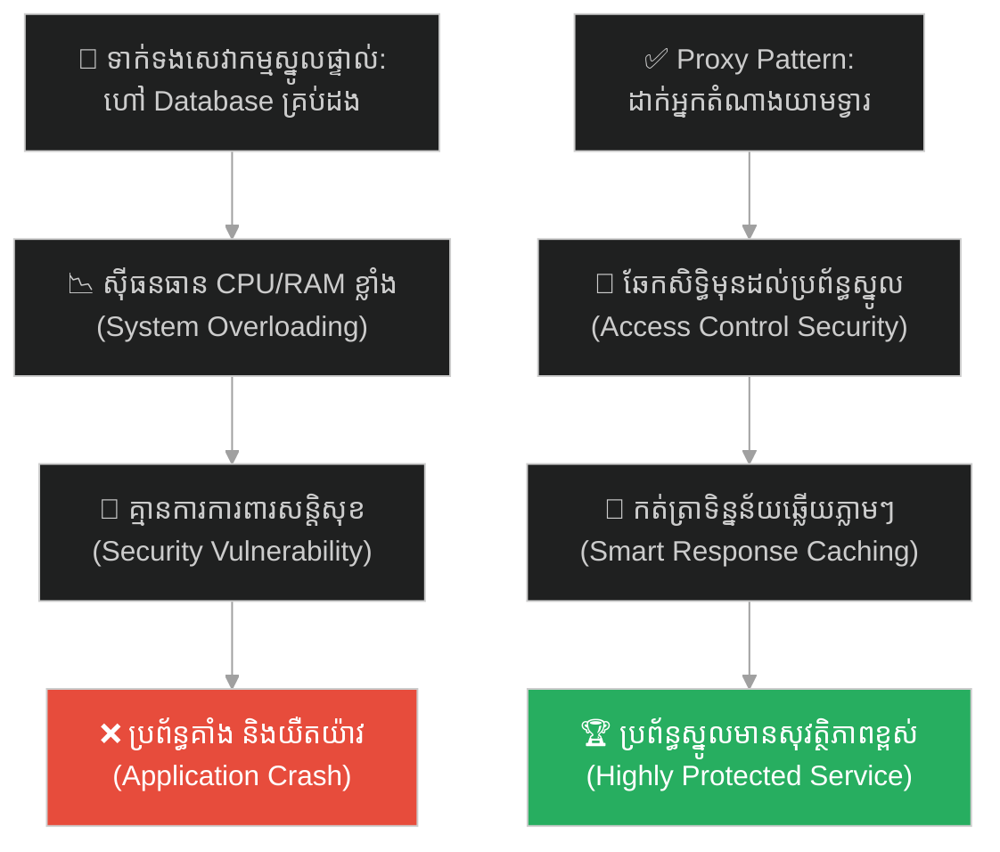
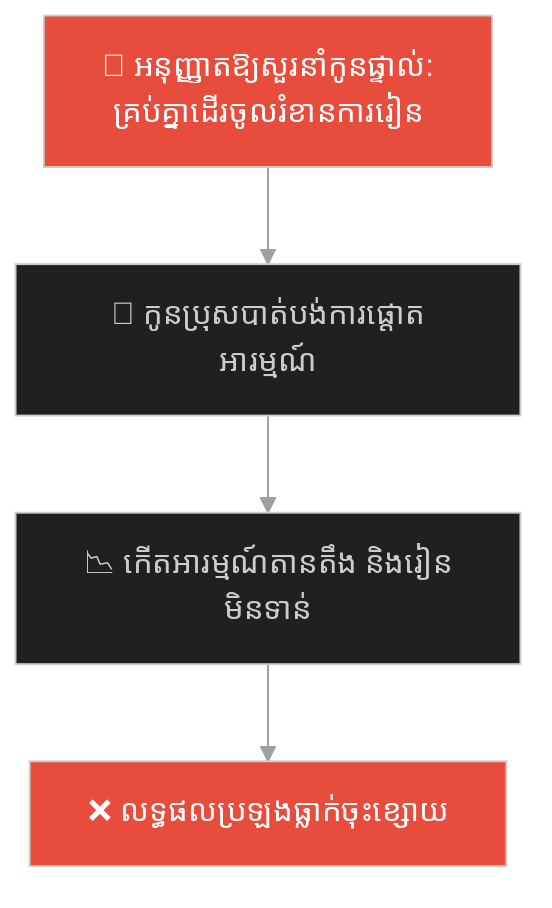
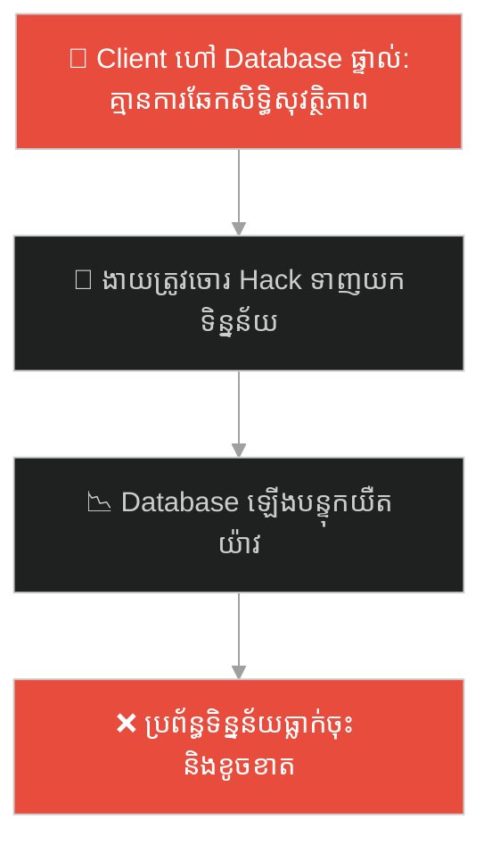
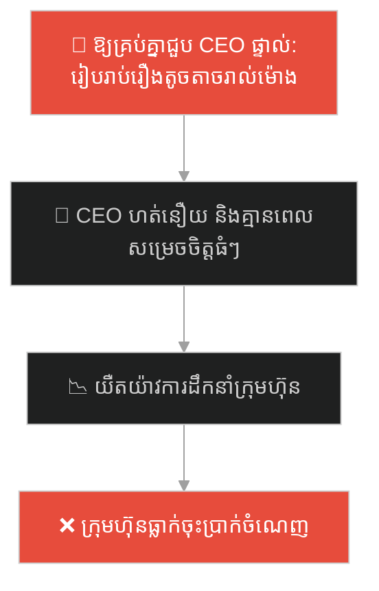
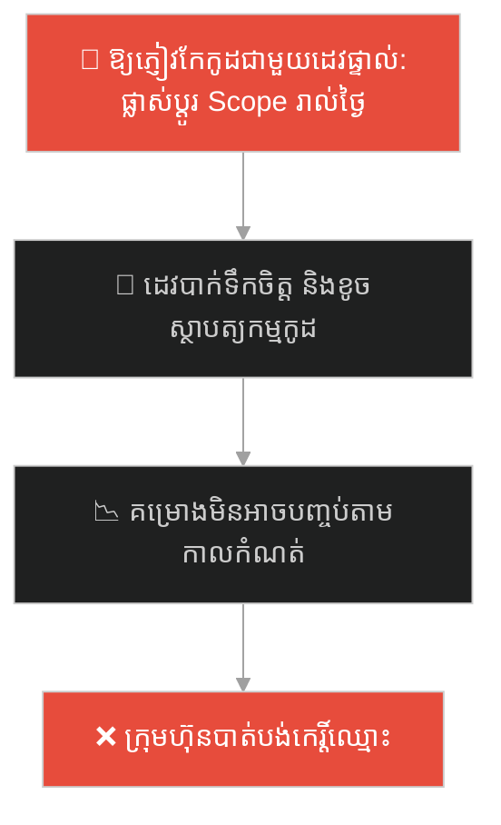
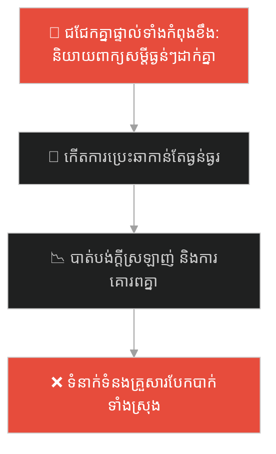
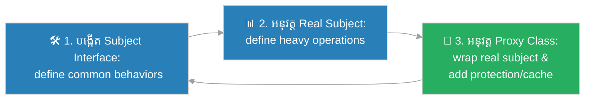

# Proxy Design Pattern (លំនាំរចនាអ្នកតំណាងការពារ)៖ អ្នកយាមទ្វារព្រះរាជា (Proxy Pattern & The King's Gatekeeper)

**Author:** ichamrong  
**Date:** 2026-05-27  
**Tags:** #design-patterns #proxy #architecture #software-engineering #parable  
**Category:** Concepts / Parables  
**Read Time:** ~15 min  

---

## 📌 មាតិកា (Table of Contents)
- [អន្ទាក់ផ្លូវចិត្ត (The Trap)](#0)
- [១. រឿងព្រេងប្រវត្តិសាស្ត្រ៖ ព្រះរាជាដែលធ្វើការលើសកម្លាំង និងការបើកវាំងសេរី (The Legend of the Overworked King)](#1)
  - [អ្នកយាមទ្វារដ៏ឆ្លាតវៃ និងការការពារព្រះមហាក្សត្រ (The Smart Gatekeeper Solution)](#1-1)
- [២. បញ្ហា៖ ការផ្ទុកសេវាកម្មធ្ងន់ៗ និងការរំខានប្រព័ន្ធដដែលៗ (The Issue: Heavy Resource Access and Lack of Protection)](#2)
- [៣. ឧទាហរណ៍ជាក់ស្តែងក្នុងពិភពពិត (Real World Examples)](#3)
  - [ឧទាហរណ៍ទី ១ — កម្រិតស្រាល (គ្រួសារ)៖ មាតាបិតាត្រួតពិនិត្យការហៅទូរស័ព្ទ និងសន្តិសុខកូនៗ (Parent Screening Salesmen to Protect Studying Kids)](#3-1)
  - [ឧទាហរណ៍ទី ២ — កម្រិតមធ្យម (បច្ចេកទេស)៖ ម៉ាស៊ីនមេសម្របសម្រួល ប្រព័ន្ធសន្តិសុខ និង Caching (API Proxy Server Checking Roles and Caching)](#3-2)
  - [ឧទាហរណ៍ទី ៣ — កម្រិតមធ្យម (ធុរកិច្ច)៖ ជំនួយការនាយកប្រតិបត្តិសម្របសម្រួលកិច្ចការងារ (Executive Assistant Managing Schedule for the CEO)](#3-3)
  - [ឧទាហរណ៍ទី ៤ — កម្រិតមធ្យម (សង្គម/គ្រប់គ្រង)៖ អ្នកគ្រប់គ្រងគម្រោងសម្របសម្រួលសំណើពីអតិថិជន (Project Manager Filtering Client Requests for Developers)](#3-4)
  - [ឧទាហរណ៍ទី ៥ — កម្រិតធ្ងន់ (ទំនាក់ទំនង)៖ ការប្រើប្រាស់មិត្តជិតស្និទ្ធជាអ្នកនាំពាក្យសម្របសម្រួល (Relying on a Mutual Friend to Deliver Difficult Feedback Gently)](#3-5)
- [៤. ដំណោះស្រាយទូទៅ៖ ការអនុវត្ត Proxy Pattern តាមរយៈ Placeholder Wrapper Classes (The General Solution: Proxy Pattern with Lazy Initialization and Access Control)](#4)
- [សេចក្តីសន្និដ្ឋាន (Conclusion)](#5)
- [ឯកសារយោង (References)](#6)
- [Related Posts](#7)

---

<a id="0"></a>
## អន្ទាក់ផ្លូវចិត្ត (The Trap)

តើអ្នកធ្លាប់ជួបបញ្ហាដែលប្រព័ន្ធស្នូល ឬ Database របស់អ្នជួបការគាំងដំណើរការ ឬយឺតយ៉ាវយ៉ាងខ្លាំង ដោយសារតែត្រូវទទួលរាល់សំណើការងាររាប់ម៉ឺនដងពីគ្រប់ទិសទីដោយគ្មានការត្រួតពិនិត្យ និងស្ទាក់ចាប់មុនដែរឬទេ?

នៅក្នុងការរចនាកូដកម្មវិធី៖
* **យើងងាយនឹងធ្លាក់ក្នុងអន្ទាក់** នៃការអនុញ្ញាតឱ្យសមាសភាគខាងក្រៅ (Client) ចូលទៅហៅ ឬប្រាស្រ័យទាក់ទងដោយផ្ទាល់ជាមួយ Object ធ្ងន់ៗ (Heavy Services) ដែលនាំឱ្យប្រព័ន្ធគ្មានសុវត្ថិភាព ខ្ជះខ្ជាយថាមពល CPU និងងាយដួលរលំ។
* **យើងមើលរំលង** ការដាក់របស់តំណាង ឬ placeholder (Proxy) នៅខាងមុខ ដើម្បីត្រួតពិនិត្យសិទ្ធិ កត់ត្រាទិន្នន័យ (Caching) និងការពារប្រព័ន្ធស្នូលឱ្យទទួលបានតែការងារធំៗពិតប្រាកដ។

ការព្យាយាមអនុញ្ញាតឱ្យ Client ទាក់ទងផ្ទាល់ជាមួយសមាសភាគស្នូលធ្ងន់ៗដោយគ្មានការការពារ ហៅថា **អន្ទាក់រត់ចូលប្រព័ន្ធស្នូលដោយសេរី (Unprotected Core Resource Access Trap)**។

ដើម្បីយល់ដឹងពីរបៀបស្ទាក់ចាប់ គ្រប់គ្រងសិទ្ធិ និងសន្សំសំចៃការងាររបស់ប្រព័ន្ធស្នូល ផែនទីបង្ហាញផ្លូវមានដូចខាងក្រោម៖
1. **រឿងព្រេងប្រវត្តិសាស្ត្រ (The Historic Legend)** — រឿងរ៉ាវរបស់ព្រះរាជាដែលធ្វើការហត់នឿយហួសកម្លាំង និងការតែងតាំងអ្នកយាមទ្វារ។
2. **បញ្ហា (The Issue)** — ការវិភាគបន្ទុកធ្ងន់លើប្រព័ន្ធស្នូល និងភាពគ្មានការការពារក្នុង OOP។
3. **ឧទាហរណ៍ជាក់ស្តែងក្នុងពិភពពិត (Real World Examples)** — ពិនិត្យមើលបញ្ហានេះក្នុងកម្រិតគ្រួសារ បច្ចេកវិទ្យា ធុរកិច្ច ការគ្រប់គ្រង និងទំនាក់ទំនង។
4. **ដំណោះស្រាយទូទៅ (The General Solution)** — ការអនុវត្ត Proxy Pattern តាមរយៈ Placeholder ដើម្បីបង្កើតរនាំងការពារ និង Caching ដ៏ឆ្លាតវៃ។



---

<a id="1"></a>
## ១. រឿងព្រេងប្រវត្តិសាស្ត្រ៖ ព្រះរាជាដែលធ្វើការលើសកម្លាំង និងការបើកវាំងសេរី (The Legend of the Overworked King)

កាលពីព្រេងនាយ មានព្រះរាជាដ៏មានចិត្តសប្បុរសមួយអង្គ គ្រងរាជ្យសម្បត្តិប្រកបដោយធម៌។ ព្រះអង្គបានសន្យាជាមួយប្រជារាស្ត្រថា នឹងដោះស្រាយរាល់ទុក្ខលំបាក និងការបញ្ហានានារបស់រាស្ត្រដោយផ្ទាល់។

ដើម្បីបង្ហាញពីភាពស្មោះត្រង់ ព្រះរាជាបានបញ្ជាឱ្យ **បើកទ្វារវាំងចោល** ដោយមិនឱ្យមានឆ្មាំយាមឡើយ ដើម្បីឱ្យអ្នកភូមិណា ក៏អាចដើរចូលមកសួរនាំ និងសុំជំនួយពីព្រះអង្គបានដោយសេរីគ្រប់ពេលវេលា។

ទោះជាយ៉ាងណា មិនយូរប៉ុន្មាន ភាពច្របូកច្របល់ដ៏ធំក៏បានកើតឡើង៖
1. មានក្មេងៗតូចៗរត់ចូលមកសុំប្រាក់ទិញស្ករគ្រាប់ ដែលធ្វើឱ្យព្រះរាជាត្រូវខាតពេលដោះស្រាយកិច្ចការជាតិធំៗ (គ្មានការគ្រប់គ្រងសិទ្ធិចូល)។
2. មានអ្នកភូមិរាប់រយនាក់ដើរចូលមកសួររឿងដដែលៗ ដូចជា ម៉ោងបើកទំនប់ទឹកកសិកម្ម ដែលធ្វើឱ្យព្រះអង្គត្រូវខិតខំឆ្លើយប្រាប់រាប់រយដងដដែលៗ (គ្មានការកត់ត្រាទិន្នន័យ Cache)។
3. មានជនខិលខូច និងចោរលួចបង្កប់ខ្លួនចូលមកប៉ុនប៉ងធ្វើបាបព្រះរាជាដល់ក្នុងបន្ទប់ផ្ទំទៀតផង។

ទីបំផុត ព្រះរាជាបានធ្លាក់ខ្លួនឈឺជាទម្ងន់ ដោយសារតែការធ្វើការងារហួសកម្លាំង និងគ្មានពេលសម្រាកសោះឡើយ ដែលធ្វើឱ្យរាជការទាំងមូលត្រូវគាំងដំណើរការទាំងស្រុង។

---

<a id="1-1"></a>
### អ្នកយាមទ្វារដ៏ឆ្លាតវៃ និងការការពារព្រះមហាក្សត្រ (The Smart Gatekeeper Solution)

ដើម្បីសង្គ្រោះព្រះរាជា និងនគរទាំងមូល ក្រុមសេនាធិការបានរៀបចំយុទ្ធសាស្ត្រថ្មីភ្លាមៗ ដោយតែងតាំង **អ្នកយាមទ្វារព្រះរាជា (The Gatekeeper / Proxy)** ឱ្យមកឈរយាមនៅច្រកទ្វារវាំងខាងក្រៅ។ អ្នកយាមទ្វារនេះពាក់អាវក្រោះយ៉ាងស្វាហាប់ និងមានអំណាចតំណាងឱ្យព្រះរាជា ១០០%។

ឥឡូវនេះ ប្រជារាស្ត្រទាំងអស់ដែលមកដល់វាំង ត្រូវតែនិយាយចរចាជាមួយអ្នកយាមទ្វារនេះជាមុនសិន។

អ្នកយាមទ្វារមានតួនាទីបំពេញកិច្ចការសំខាន់ៗចំនួន ៣៖
* **ការការពារសន្តិសុខ (Protection Proxy)៖** គាត់នឹងសួររកអត្តសញ្ញាណ និងបណ្តេញក្មេងៗ ឬជនខិលខូចចេញភ្លាមៗ ដោយមិនអនុញ្ញាតឱ្យចូលទៅរំខានដល់ព្រះរាជាឡើយ។
* **ការកត់ត្រាទិន្នន័យឆ្លើយតប (Caching Proxy)៖** នៅពេលអ្នកភូមិដំបូងមកសួរនាំពីម៉ោងបើកទំនប់ទឹក អ្នកយាមចូលទៅសួរព្រះរាជា រួចយកចម្លើយមកប្រាប់ និងសរសេរកត់ទុកក្នុងសៀវភៅ។ ពេលអ្នកភូមិក្រោយៗមកសួររឿងដដែល គាត់គ្រាន់តែបើកសៀវភៅឆ្លើយភ្លាមៗ ដោយមិនបាច់ទៅសួរនាំព្រះរាជាឡើយ។
* **ការកាត់បន្ថយបន្ទុក (Lazy Initialization)៖** ព្រះរាជាអាចមានពេលវេលាសម្រាក និងមានសុវត្ថិភាពខ្ពស់ ព្រោះព្រះអង្គត្រូវចេញមុខដោះស្រាយតែរឿងណាដែលធំៗ និងថ្មីៗពិតប្រាកដប៉ុណ្ណោះ។

---

<a id="2"></a>
## ២. បញ្ហា៖ ការផ្ទុកសេវាកម្មធ្ងន់ៗ និងការរំខានប្រព័ន្ធដដែលៗ (The Issue: Heavy Resource Access and Lack of Protection)

នៅក្នុងវិស្វកម្មសូហ្វវែរ បញ្ហានេះកើតឡើងនៅពេលយើងមាន Object ធ្ងន់ៗ (ដូចជា 3rd-party API client, Database Connection, Graphics Loader) ដែល Client គ្រប់គ្នាអាចហៅប្រើប្រាស់ផ្ទាល់បាន៖

```java
// កូដដែលគ្មាន Proxy គឺ Client គ្រប់គ្នាចូលទៅរំខាន Database
DatabaseConnection db = new DatabaseConnection();
db.query("SELECT * FROM users"); // ធ្វើការងារធ្ងន់រាល់ដង
```

* **ការធ្លាក់ចុះនៃល្បឿនប្រព័ន្ធ (Performance Degradation)៖** រាល់ពេល Client ហៅសេវាកម្ម កម្មវិធីត្រូវចំណាយធនធាន CPU/Memory គណនា ឬទាញទិន្នន័យដដែលៗពី Database ដែលនាំឱ្យយឺតយ៉ាវ។
* **បញ្ហាសន្តិសុខ និងសុវត្ថិភាព (Security Vulnerability)៖** គ្មានស្រទាប់ត្រួតពិនិត្យសិទ្ធិរបស់ Client មុនពេលពួកគេចូលទៅប៉ះពាល់ ឬកែប្រែទិន្នន័យស្នូល។

**Proxy Design Pattern** ជួយដោះស្រាយបញ្ហានេះដោយបង្កើត Class សម្របសម្រួលមួយ (Proxy class) ដែល implement យក Interface ដូចគ្នានឹង Object ពិត ដើម្បីឱ្យវាក្លាយជាខែលការពារ និង Caching ដ៏ឆ្លាតវៃនៅខាងមុខ។

---

<a id="3"></a>
## ៣. ឧទាហរណ៍ជាក់ស្តែងក្នុងពិភពពិត

---

<a id="3-1"></a>
### ឧទាហរណ៍ទី ១ — កម្រិតស្រាល (គ្រួសារ)៖ មាតាបិតាត្រួតពិនិត្យការហៅទូរស័ព្ទ និងសន្តិសុខកូនៗ (Parent Screening Salesmen to Protect Studying Kids)

នៅក្នុងគ្រួសារមួយ កូនប្រុសកំពុងខិតខំរៀនសូត្រត្រៀមប្រឡងបាក់ឌុបយ៉ាងមមាញឹក។ ជំនួសឱ្យការបណ្តោយឱ្យអ្នកលក់ទំនិញ ឬអ្នកផ្សព្វផ្សាយផ្សេងៗដើរចូលមកសួរនាំ និងរំខានកូនប្រុសដោយផ្ទាល់ ម្តាយបានដើរតួជា "អ្នកយាមទ្វារ (Proxy)" ដោយស្ទាក់សួរនាំ សុំការផ្ទៀងផ្ទាត់ និងដោះស្រាយបញ្ហាតូចតាចជំនួសកូនប្រុសទាំងអស់។



ម្តាយបានប្រើគោលការណ៍ Proxy style ដើម្បីការពារពេលវេលារៀនសូត្ររបស់កូន។

---

<a id="3-2"></a>
### ឧទាហរណ៍ទី ២ — កម្រិតមធ្យម (បច្ចេកទេស)៖ ម៉ាស៊ីនមេសម្របសម្រួល ប្រព័ន្ធសន្តិសុខ និង Caching (API Proxy Server Checking Roles and Caching)

នៅក្នុងការសរសេរកម្មវិធី Web Client ត្រូវការទាញយកព័ត៌មានពី Database។ ជំនួសឱ្យការឱ្យ Client ហៅ Database ផ្ទាល់ វិស្វករបានដាក់ `DatabaseProxy` មួយនៅខាងមុខ ដើម្បីឆែកមើល Token សន្តិសុខ (Authorization) និងផ្តល់ទិន្នន័យដែលបានរក្សាទុកក្នុង Cache ភ្លាមៗបើមានស្រាប់។



---

<a id="3-3"></a>
### ឧទាហរណ៍ទី ៣ — កម្រិតមធ្យម (ធុរកិច្ច)៖ ជំនួយការនាយកប្រតិបត្តិសម្របសម្រួលកិច្ចការងារ (Executive Assistant Managing Schedule for the CEO)

នៅក្នុងក្រុមហ៊ុនធំមួយ នាយកប្រតិបត្តិ (CEO) ត្រូវដោះស្រាយកិច្ចការសំខាន់ៗជាច្រើន។ ជំនួសឱ្យការអនុញ្ញាតឱ្យបុគ្គលិកគ្រប់គ្នា ឬភ្ញៀវខាងក្រៅចូលជួបជជែក និងរាយការណ៍រឿងតូចតាចដោយផ្ទាល់ ក្រុមហ៊ុនបានជួល "ជំនួយការផ្ទាល់ខ្លួន (Executive Assistant - Proxy)" ឱ្យមកត្រួតពិនិត្យ ឆែករបៀបវារៈ និងកក់ម៉ោងជួបជុំយ៉ាងមានសណ្តាប់ធ្នាប់។



---

<a id="3-4"></a>
### ឧទាហរណ៍ទី ៤ — កម្រិតមធ្យម (សង្គម/គ្រប់គ្រង)៖ អ្នកគ្រប់គ្រងគម្រោងសម្របសម្រួលសំណើពីអតិថិជន (Project Manager Filtering Client Requests for Developers)

នៅក្នុងក្រុមការងារសូហ្វវែរ ជំនួសឱ្យការអនុញ្ញាតឱ្យអតិថិជនមកទាក់ទង និងផ្លាស់ប្តូរតម្រូវការការងារផ្ទាល់ជាមួយវិស្វករសរសេរកូដ (Developers) ដែលធ្វើឱ្យដេវវិលមុខ និងខូចដំណើរការការងារ ក្រុមហ៊ុនបានឱ្យអ្នកគ្រប់គ្រងគម្រោង (Project Manager - Proxy) មកទទួលសំណើ សម្របសម្រួល ត្រួតពិនិត្យ និងបកប្រែជាការងារបច្ចេកវិទ្យាយ៉ាងមានប្រសិទ្ធភាព។



---

<a id="3-5"></a>
### ឧទាហរណ៍ទី ៥ — កម្រិតធ្ងន់ (ទំនាក់ទំនង)៖ ការប្រើប្រាស់មិត្តជិតស្និទ្ធជាអ្នកនាំពាក្យសម្របសម្រួល (Relying on a Mutual Friend to Deliver Difficult Feedback Gently)

នៅក្នុងទំនាក់ទំនងស្នេហា ឬមិត្តភាព ពេលខ្លះដៃគូទាំងសងខាងមានការយល់ច្រឡំ ឬជម្លោះពាក្យសម្តីធ្ងន់ធ្ងរ ដែលមិនអាចនិយាយទល់មុខគ្នាបានឡើយ ព្រោះងាយនឹងកើតការខឹងសម្បារកាន់តែខ្លាំង។ ពួកគេបានជ្រើសរើស "មិត្តជិតស្និទ្ធរួមម្នាក់ (Mutual Friend - Proxy)" ឱ្យដើរតួជាអ្នកនាំពាក្យ បកស្រាយសម្តីឱ្យទន់ភ្លន់ និងជួយសម្របសម្រួលឱ្យទាំងសងខាងយល់ចិត្តគ្នាឡើងវិញ។



---

<a id="4"></a>
## ៤. ដំណោះស្រាយទូទៅ៖ ការអនុវត្ត Proxy Pattern តាមរយៈ Placeholder Wrapper Classes (The General Solution: Proxy Pattern with Lazy Initialization and Access Control)

ដើម្បីសរសេរកូដការពារប្រព័ន្ធស្នូល និងជួយសន្សំសំចៃការងាររបស់វា យើងត្រូវអនុវត្តលំនាំរចនា **Proxy Pattern**៖



ជំហាននៃការអនុវត្ត៖
1. **បង្កើត Subject Interface៖** បង្កើត Interface រួមមួយដែលទាំង Real Subject (ប្រព័ន្ធស្នូល) និង Proxy Class (អ្នកតំណាង) ត្រូវអនុវត្តតាម។
2. **អនុវត្ត Real Subject Class៖** សរសេរកូដសម្រាប់ប្រព័ន្ធស្នូលដែលធ្វើការងារធ្ងន់ៗជាក់ស្តែង។
3. **អនុវត្ត Proxy Class៖** សរសេរកូដសម្រាប់ Class សម្របសម្រួល ដែល implements យក Subject Interface និង wrap យក Instance របស់ Real Subject។ នៅក្នុង Methods របស់វា ត្រូវបន្ថែមការឆែកសិទ្ធិ (Access Control) ការកត់ត្រាទិន្នន័យចម្លើយ (Caching) ឬការដំឡើងយឺតយ៉ាវ (Lazy Initialization) មុនពេលបញ្ជូនការងារបន្តទៅឱ្យ Real Subject។

---

## 🐇 ធ្លាក់ចូលក្នុងរន្ធទន្សាយ (Enter the Rabbit Hole)

ដើម្បីស្វែងយល់ពីរបៀបដែលប្រព័ន្ធទូរស័ព្ទ ឬសេវាកម្មបំរើអតិថិជន បានសម្រួលការបញ្ជូនសំណើការងាររបស់អតិថិជន ទៅកាន់បុគ្គលិកដែលមានសមត្ថភាពសមស្របជាបន្តបន្ទាប់ ដោយមិនបាច់ឱ្យអតិថិជនរត់ដើររកខ្លួនឯង (Chain of Responsibility Pattern) សូមបន្តដំណើរទៅកាន់៖

* 🚀 **[ចាប់ផ្តើមដំណើររុករក (Start the Journey) ➔ Chain of Responsibility Pattern and Sequential Handling](./87-the-customer-service-hotline.md)**

---

<a id="5"></a>
## សេចក្តីសន្និដ្ឋាន (Conclusion)

> **«កុំបណ្តោយឱ្យអ្នកណាក៏អាចដើរចូលទៅដល់បន្ទប់គេងរបស់ស្តេចបានឡើយ។ ចូរដាក់ឆ្មាំយាមទ្វារដ៏ឆ្លាតវៃម្នាក់ ដើម្បីរក្សាសុវត្ថិភាព និងភាពស្ងប់ស្ងាត់នៃព្រះរាជាណាចក្ររបស់អ្នក។»**

ចូរធ្វើខ្លួនជាវិស្វករកម្មវិធីដែលយល់ដឹងពីសិល្បៈនៃការបង្កើតខែលការពារប្រព័ន្ធ (Defensive Software Architecture)។ ការអនុវត្ត Proxy Design Pattern មិនត្រឹមតែជួយការពារប្រព័ន្ធរបស់អ្នកពីការវាយប្រហារ និងការរំខានដដែលៗប៉ុណ្ណោះទេ ប៉ុន្តែវាក៏ជួយឱ្យប្រព័ន្ធរបស់អ្នកដំណើរការបានយ៉ាងលឿន និងមានស្ថិរភាពខ្ពស់បំផុត។

---

<a id="6"></a>
## ឯកសារយោង (References)

* **Erich Gamma, Richard Helm, Ralph Johnson, John Vlissides** — *Design Patterns: Elements of Reusable Object-Oriented Software* (1994). Proxy Design Pattern Chapter.
* **Steve McConnell** — *Code Complete: A Practical Handbook of Software Construction* (2004).
* **Joshua Bloch** — *Effective Java: Item 85 (Prefer alternatives to Java serialization)* (2018).

---

<a id="7"></a>
## Related Posts

* **[86 Proxy Pattern: Controlled Access and Lazy Resource Initialization](../articles/86-proxy-pattern.md)** — អត្ថបទវិទ្យាសាស្ត្រលម្អិត និងកូដគំរូ Java/C# សម្រាប់ការរចនា Proxy សន្តិសុខ។
* **[85 The Forest of a Million Trees](./85-the-forest-of-a-million-trees.md)** — ការសន្សំសំចៃ Memory តាមរយៈការចែករំលែកវិញ្ញាណរួមរបស់ Object។
* **[64 The Swiss Army Knife](./64-the-swiss-army-knife.md)** — ការចៀសវាងភាពស្មុគស្មាញ និងការគ្រប់គ្រងមុខងារប្រកបដោយសណ្តាប់ធ្នាប់។

---

## Related

- [💡 Concepts README](../README.md)
- [📚 Main Repository README](../../../README.md)
- [Developer Habits](../../developer-habits/README.md)
- [Mental Health & Well-being](../../mental-health/README.md)
- [Management & SDLC](../../management/README.md)
