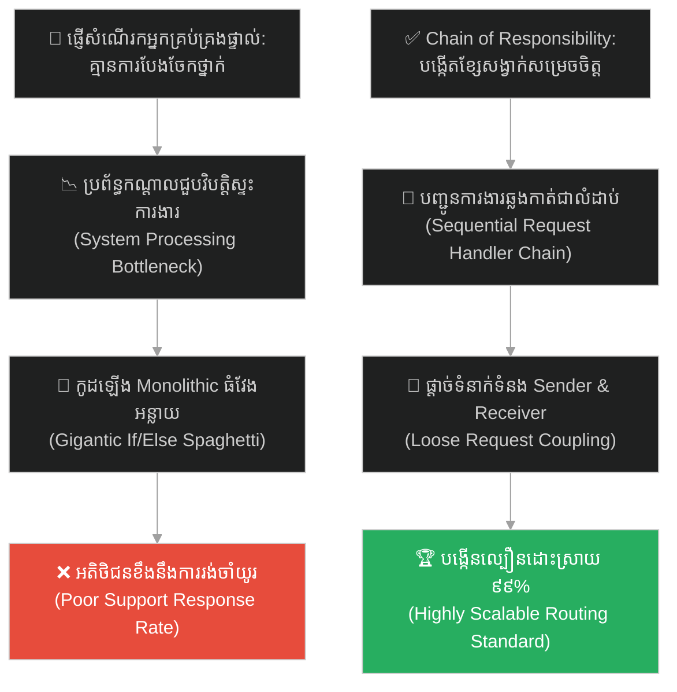
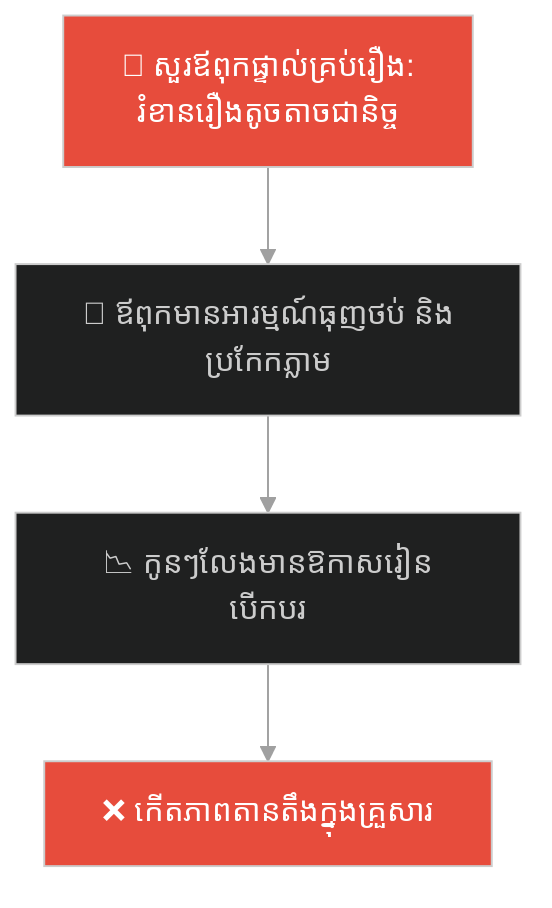
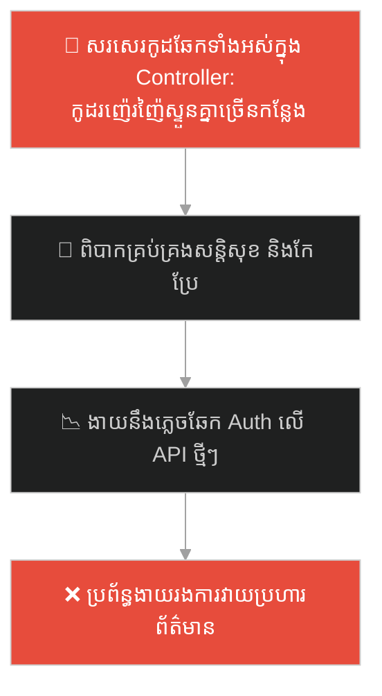
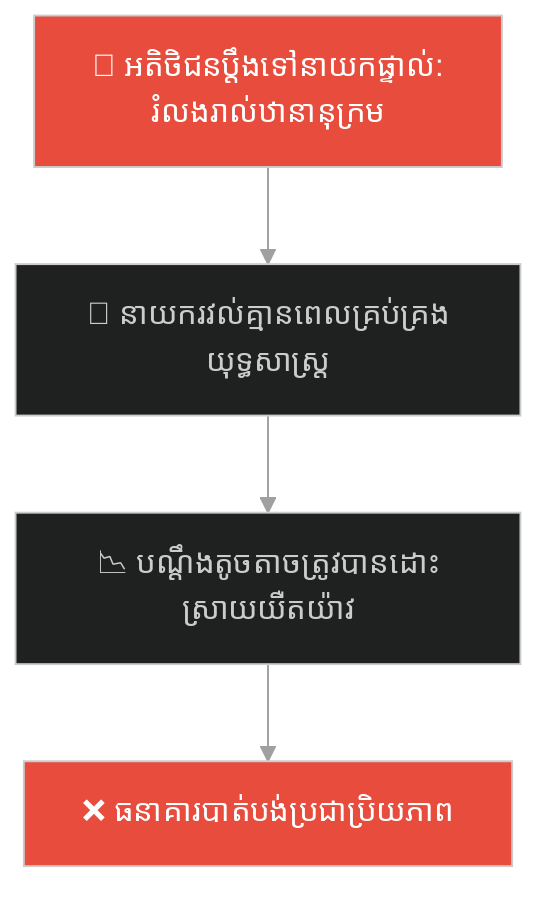
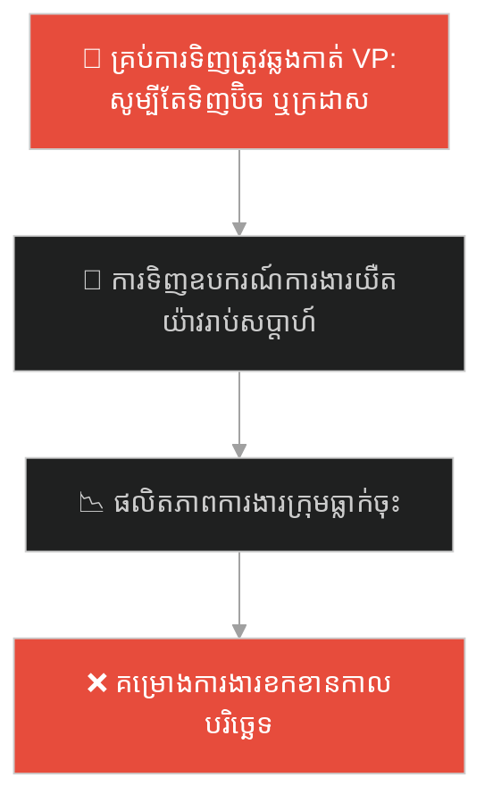
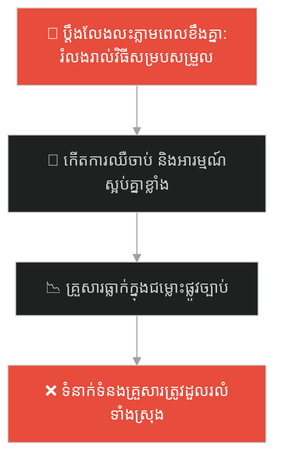
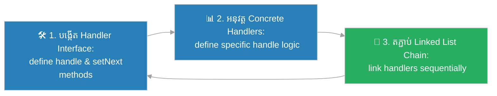

# Chain of Responsibility Design Pattern (លំនាំរចនាខ្សែសង្វាក់ទទួលខុសត្រូវ)៖ ខ្សែទូរស័ព្ទបម្រើអតិថិជន (Chain of Responsibility & The Customer Service Hotline)

**Author:** ichamrong  
**Date:** 2026-05-27  
**Tags:** #design-patterns #chain-of-responsibility #architecture #software-engineering #parable  
**Category:** Concepts / Parables  
**Read Time:** ~15 min  

---

## 📌 មាតិកា (Table of Contents)
- [អន្ទាក់ផ្លូវចិត្ត (The Trap)](#0)
- [១. រឿងព្រេងប្រវត្តិសាស្ត្រ៖ ខ្សែទូរស័ព្ទបម្រើអតិថិជន និងអ្នកគ្រប់គ្រងដែលធ្វើការហួសកម្លាំង (The Legend of the Customer Service Hotline)](#1)
  - [ខ្សែសង្វាក់នៃការទទួលខុសត្រូវ និងការដោះស្រាយជាលំដាប់លំដោយ (The Chain of Responsibility Solution)](#1-1)
- [២. បញ្ហា៖ ការចងភ្ជាប់សំណើការងារផ្ទាល់ និងវិបត្តិកូដលក្ខខណ្ឌវែងអន្លាយ (The Issue: Tight Coupling and Giant If/Else Spaghetti Chains)](#2)
- [៣. ឧទាហរណ៍ជាក់ស្តែងក្នុងពិភពពិត (Real World Examples)](#3)
  - [ឧទាហរណ៍ទី ១ — កម្រិតស្រាល (គ្រួសារ)៖ ការសុំការអនុញ្ញាតខ្ចីឡានពីបងប្រុស ម្តាយ និងឪពុក (Asking Older Sibling, Mom, and Dad Sequentially)](#3-1)
  - [ឧទាហរណ៍ទី ២ — កម្រិតមធ្យម (បច្ចេកទេស)៖ ស្រទាប់ស្ទាក់ចាប់ Request ក្នុងប្រព័ន្ធ Web Middleware (HTTP Request Passing Through Logging, Auth, and Rate-Limiter)](#3-2)
  - [ឧទាហរណ៍ទី ៣ — កម្រិតមធ្យម (ធុរកិច្ច)៖ ការដោះស្រាយបណ្តឹងតវ៉ារបស់អតិថិជនតាមលំដាប់តំណែង (Handling Client Complaints from Support to Regional Directors)](#3-3)
  - [ឧទាហរណ៍ទី ៤ — កម្រិតមធ្យម (សង្គម/គ្រប់គ្រង)៖ ការអនុម័តកញ្ចប់ថវិការគម្រោងតាមឋានានុក្រម (Budget Approvals Rising Through Leads, Directors, and VPs)](#3-4)
  - [ឧទាហរណ៍ទី ៥ — កម្រិតធ្ងន់ (ទំនាក់ទំនង)៖ ការដោះស្រាយវិវាទគ្រួសារពីស្រាលទៅធ្ងន់ (Resolving Domestic Disputes from Discussion to Counseling)](#3-5)
- [៤. ដំណោះស្រាយទូទៅ៖ ការអនុវត្ត Chain of Responsibility Pattern តាមរយៈ Handler Linked Lists (The General Solution: Chain of Responsibility with Decoupled Handler Chains)](#4)
- [សេចក្តីសន្និដ្ឋាន (Conclusion)](#5)
- [ឯកសារយោង (References)](#6)
- [Related Posts](#7)

---

<a id="0"></a>
## អន្ទាក់ផ្លូវចិត្ត (The Trap)

តើអ្នកធ្លាប់ជួបបញ្ហាដែលអ្នកត្រូវសរសេរកូដលក្ខខណ្ឌ `if/else` វែងអន្លាយរាប់រយបន្ទាត់ ដើម្បីចាត់ចែង ឬបញ្ជូនសំណើការងារ (Request) ទៅកាន់ផ្នែកផ្សេងៗរហូតដល់ថ្នាក់កូដមានភាពរញ៉េរញ៉ៃ និងពិបាកអភិវឌ្ឍបន្ថែមដែរឬទេ?

នៅក្នុងការរចនាកូដកម្មវិធី៖
* **យើងងាយនឹងធ្លាក់ក្នុងអន្ទាក់** នៃការចងភ្ជាប់សំណើការងារ (Request Sender) ទៅនឹងអ្នកដោះស្រាយសំណើជាក់លាក់ (Request Receiver) ដោយផ្ទាល់ ឬទុកឱ្យ Class កណ្តាលតែមួយ (God Object) ទទួលខុសត្រូវរាល់ការសម្រេចចិត្តទាំងអស់។
* **យើងមើលរំលង** យន្តការបង្កើតខ្សែសង្វាក់តំណភ្ជាប់ (Chain of Handlers) ដែលអនុញ្ញាតឱ្យសំណើការងារធ្វើដំណើរឆ្លងកាត់អ្នកដោះស្រាយជាបន្តបន្ទាប់ រហូតដល់ជួបអ្នកដែលអាចសម្រេចចិត្តដោះស្រាយវាបាន។

ការព្យាយាមដោះស្រាយរាល់ប្រភេទសំណើទាំងអស់នៅក្នុង Class តែមួយដោយប្រើប្រាស់កូដលក្ខខណ្ឌរញ៉េរញ៉ៃ ហៅថា **អន្ទាក់ចាត់ចែងសំណើការងាររាយប៉ាយ (Monolithic Request Handling Spaghetti Trap)**។

ដើម្បីយល់ដឹងពីរបៀបផ្តាច់ Sender និង Receiver និងការបញ្ជូនការងារជាខ្សែសង្វាក់ប្រកបដោយប្រសិទ្ធភាព នេះជាផែនទីបង្ហាញផ្លូវ៖
1. **រឿងព្រេងប្រវត្តិសាស្ត្រ (The Historic Legend)** — រឿងរ៉ាវរបស់ក្រុមហ៊ុនដែលមានអតិថិជនទូរស័ព្ទរកអ្នកគ្រប់គ្រងដើម្បីសួរនាំរឿងតូចតាច។
2. **បញ្ហា (The Issue)** — ការវិភាគភាពជំពាក់ជំពិនគ្នាក្នុង OOP និងភាពរឹងកំព្រឹសនៃកូដលក្ខខណ្ឌវែងៗ។
3. **ឧទាហរណ៍ជាក់ស្តែងក្នុងពិភពពិត (Real World Examples)** — ពិនិត្យមើលបញ្ហានេះក្នុងកម្រិតគ្រួសារ បច្ចេកវិទ្យា ធុរកិច្ច ការគ្រប់គ្រង និងទំនាក់ទំនង។
4. **ដំណោះស្រាយទូទៅ (The General Solution)** — ការអនុវត្ត Chain of Responsibility Pattern តាមរយៈ Handler Chain ដើម្បីបង្កើតស្ថាបត្យកម្មកូដដ៏បត់បែន។



---

<a id="1"></a>
## ១. រឿងព្រេងប្រវត្តិសាស្ត្រ៖ ខ្សែទូរស័ព្ទបម្រើអតិថិជន និងអ្នកគ្រប់គ្រងដែលធ្វើការហួសកម្លាំង (The Legend of the Customer Service Hotline)

នៅក្នុងក្រុមហ៊ុនលក់ផលិតផលបច្ចេកវិទ្យាដ៏ធំមួយ ក្រុមហ៊ុនបានបង្កើតប្រព័ន្ធសេវាគាំទ្រអតិថិជន។ កាលពីដំបូង ដើម្បីធានាបាននូវការផ្តល់សេវាកម្មដ៏ល្អបំផុត ក្រុមហ៊ុនបានបោះពុម្ពលេខទូរស័ព្ទផ្ទាល់ខ្លួនរបស់ **អ្នកគ្រប់គ្រងទូទៅ (General Manager)** នៅលើគេហទំព័រ ដើម្បីឱ្យអតិថិជនអាចទូរស័ព្ទមកបានគ្រប់ពេល។

មិនយូរប៉ុន្មាន បញ្ហាដ៏ធ្ងន់ធ្ងរមួយក៏បានកើតឡើង៖
* អ្នកគ្រប់គ្រងទូទៅត្រូវទទួលទូរស័ព្ទរាប់ពាន់ដងក្នុងមួយថ្ងៃ ដែលធ្វើឱ្យគាត់លែងមានពេលវេលាកសាងយុទ្ធសាស្ត្រសម្រាប់ក្រុមហ៊ុនទៀតហើយ។
* ក្នុងចំណោមទូរស័ព្ទទាំង ១,០០០ គ្រឿងនោះ៖
  * ៨០០ ដង គឺជារឿងកំប៉ិកកំប៉ុកបំផុត (ដូចជា របៀបប្តូរលេខសម្ងាត់ ឬសួររកម៉ោងបើកទ្វារ)។
  * ១៥០ ដង គឺជារឿងកម្រិតមធ្យម (ដូចជា សុំប្តូរទំហំអាវ ឬទាមទារការដឹកជញ្ជូនឡើងវិញ)។
  * មានតែ ៥០ ដងប៉ុណ្ណោះដែលជារឿងធំដុំពិតប្រាកដ ដែលត្រូវការការសម្រេចចិត្តផ្លូវច្បាប់ ឬអំណាចហិរញ្ញវត្ថុរបស់ព្រះអង្គផ្ទាល់។

ដោយសារគាត់ត្រូវដោះស្រាយរាល់បញ្ហាទាំងអស់តែម្នាក់ឯង អ្នកគ្រប់គ្រងទូទៅបានធ្លាក់ខ្លួនអស់កម្លាំងទាំងស្រុង ចំណែកឯអតិថិជនក៏ត្រូវរង់ចាំទូរស័ព្ទរាប់ម៉ោងទម្រាំបានជួបគាត់ (Bottleneck)។

---

<a id="1-1"></a>
### ខ្សែសង្វាក់នៃការទទួលខុសត្រូវ និងការដោះស្រាយជាលំដាប់លំដោយ (The Chain of Responsibility Solution)

ប្រធានផ្នែកសេវាកម្មថ្មី បានមើលឃើញពីគ្រោះថ្នាក់នៃការសម្រេចចិត្ត Monolithic នេះ។ គាត់បានសម្រេចចិត្តរៀបចំប្រព័ន្ធ **"ខ្សែសង្វាក់នៃការទទួលខុសត្រូវ"** ដោយបែងចែកអ្នកទទួលទូរស័ព្ទជា ៣ ថ្នាក់៖
1. **បុគ្គលិកជួរមុខ (Junior Support):** ជាចំណុចចូលដំបូងគេនៃរាល់ទូរស័ព្ទទាំងអស់។
2. **ប្រធានក្រុម (Senior Lead):** ជាថ្នាក់បន្ទាប់នៅក្នុងខ្សែសង្វាក់។
3. **អ្នកគ្រប់គ្រងទូទៅ (General Manager):** ជាអ្នកនៅចុងបញ្ចប់នៃខ្សែសង្វាក់។

ឥឡូវនេះ នៅពេលអតិថិជនម្នាក់ទូរស័ព្ទចូលមក៖
* **Junior Support** ទទួលទូរស័ព្ទជាមុនគេ។ ប្រសិនបើជារឿងសាមញ្ញ (ដូចជា ប្តូរលេខសម្ងាត់) គាត់ដោះស្រាយវាភ្លាម រួចបិទទូរស័ព្ទ។ ប្រសិនបើជារឿងធំ គាត់នឹងមិនប្រកែក ឬព្យាយាមដោះស្រាយឡើយ គាត់គ្រាន់តែ **បញ្ជូនសញ្ញាទូរស័ព្ទ (Pass)** ទៅឱ្យ Senior Lead។
* **Senior Lead** ទទួលបានទូរស័ព្ទ។ ប្រសិនបើជារឿងប្តូរទំនិញ គាត់ចាត់ចែងដោះស្រាយភ្លាម។ ប្រសិនបើជារឿងប្តឹងទាមទារសំណងផ្លូវច្បាប់ គាត់បញ្ជូនវាបន្តទៅកាន់ចុងបញ្ចប់នៃខ្សែសង្វាក់។
* **General Manager** ទទួលបានតែទូរស័ព្ទចំនួន ៥០ គ្រឿងប៉ុណ្ណោះក្នុងមួយថ្ងៃ ដែលសុទ្ធសឹងតែជារឿងសំខាន់ៗបំផុត ដែលត្រូវការវត្តមានរបស់គាត់។

ប្រព័ន្ធដំណើរការបានយ៉ាងលឿន អតិថិជនទទួលបានចម្លើយភ្លាមៗ ហើយអ្នកគ្រប់គ្រងទូទៅក៏អាចបំពេញការងាររបស់ខ្លួនបានយ៉ាងមានប្រសិទ្ធភាពបំផុត។

---

<a id="2"></a>
## ២. បញ្ហា៖ ការចងភ្ជាប់សំណើការងារផ្ទាល់ និងវិបត្តិកូដលក្ខខណ្ឌវែងអន្លាយ (The Issue: Tight Coupling and Giant If/Else Spaghetti Chains)

នៅក្នុងស្ថាបត្យកម្មសូហ្វវែរ ភាពស្មុគស្មាញនេះកើតឡើងនៅពេលយើងសរសេរកូដចាត់ចែង Request ទាំងអស់នៅក្នុង Class កណ្តាលតែមួយ៖

```java
// កូដដែលគ្មាន Chain ប្រើប្រាស់ If/Else ដ៏វែង និងពិបាកពង្រីក
if (request.getType().equals("low")) {
    handleLowLevel(request);
} else if (request.getType().equals("medium")) {
    handleMediumLevel(request);
} else if (request.getType().equals("high")) {
    handleHighLevel(request);
}
```

* **ភាពជំពាក់ជំពិនគ្នាខ្ពស់ (Tight Coupling)៖** Client ត្រូវស្គាល់ច្បាស់ពី Class ណាដែលត្រូវដោះស្រាយសំណើរបស់ខ្លួន ដែលធ្វើឱ្យប្រព័ន្ធរឹងកំព្រឹស។
* **ការបំពានគោលការណ៍ Single Responsibility៖** Class កណ្តាលត្រូវដឹងពីគ្រប់ដំណើរការ និងវិធីដោះស្រាយរបស់គ្រប់ផ្នែកទាំងអស់ ដែលងាយនឹងបង្កើត Bug ពេលកែប្រែ។

**Chain of Responsibility Design Pattern** ជួយដោះស្រាយបញ្ហានេះដោយបំបែក Handler នីមួយៗទៅជា Class ដាច់ដោយឡែកពីគ្នា រួចតម្រៀបពួកគេជា Linked List សម្របសម្រួល។ 元素នីមួយៗក្នុងខ្សែសង្វាក់សម្រេចចិត្តដោយខ្លួនឯងថាតើត្រូវដោះស្រាយ ឬបញ្ជូនទៅកាន់អ្នកបន្ទាប់។

---

<a id="3"></a>
## ៣. ឧទាហរណ៍ជាក់ស្តែងក្នុងពិភពពិត

---

<a id="3-1"></a>
### ឧទាហរណ៍ទី ១ — កម្រិតស្រាល (គ្រួសារ)៖ ការសុំការអនុញ្ញាតខ្ចីឡានពីបងប្រុស ម្តាយ និងឪពុក (Asking Older Sibling, Mom, and Dad Sequentially)

នៅក្នុងគ្រួសារមួយ កូនស្រីម្នាក់ចង់សុំអនុញ្ញាតខ្ចីឡានទៅដើរលេង។ ជំនួសឱ្យការទៅសួរឪពុកភ្លាម (ដែលនាំឱ្យគាត់ខឹងព្រោះកំពុងរវល់ការងារធំ) កូនស្រីបានអនុវត្តយុទ្ធសាស្ត្រខ្សែសង្វាក់៖ គាត់សួរទៅបងប្រុសមុន តែបើបងប្រុសគ្មានអំណាចសម្រេច គាត់សួរទៅម្តាយ ហើយបើម្តាយនៅតែមិនហ៊ានសម្រេច ទើបសំណើត្រូវបានបញ្ជូនទៅដល់ឪពុក។



កូនស្រីបានប្រើប្រាស់គោលការណ៍ Chain of Responsibility style ដើម្បីបញ្ជូនសំណើសុំប្រកបដោយប្រសិទ្ធភាព។

---

<a id="3-2"></a>
### ឧទាហរណ៍ទី ២ — កម្រិតមធ្យម (បច្ចេកទេស)៖ ស្រទាប់ស្ទាក់ចាប់ Request ក្នុងប្រព័ន្ធ Web Middleware (HTTP Request Passing Through Logging, Auth, and Rate-Limiter)

នៅក្នុងការអភិវឌ្ឍ Web API រាល់ HTTP Request ដែលចូលមកត្រូវឆ្លងកាត់ការត្រួតពិនិត្យជាបន្តបន្ទាប់។ ជំនួសឱ្យការសរសេរកូដឆែកទាំងអស់ក្នុង Controller តែមួយ វិស្វករបានបង្កើតខ្សែសង្វាក់ Middleware៖ Logger (កត់ត្រាព័ត៌មាន) -> Auth (ផ្ទៀងផ្ទាត់សិទ្ធិ) -> RateLimiter (ត្រួតពិនិត្យល្បឿនហៅ API) -> Controller។



---

<a id="3-3"></a>
### ឧទាហរណ៍ទី ៣ — កម្រិតមធ្យម (ធុរកិច្ច)៖ ការដោះស្រាយបណ្តឹងតវ៉ារបស់អតិថិជនតាមលំដាប់តំណែង (Handling Client Complaints from Support to Regional Directors)

នៅក្នុងធនាគារមួយ ជំនួសឱ្យការឱ្យរាល់បណ្តឹងរបស់អតិថិជនធ្លាក់ទៅដល់ដៃនាយកប្រចាំតំបន់ផ្ទាល់ ដែលនាំឱ្យគ្មានពេលដោះស្រាយ ធនាគារបានរៀបចំខ្សែសង្វាក់ដោះស្រាយ៖ សំណើត្រូវដោះស្រាយដោយភ្នាក់ងារជួរមុខសិន បើមិនពេញចិត្តត្រូវបញ្ជូនទៅកាន់ប្រធានសាខា ហើយបើនៅតែដោះស្រាយមិនចេញ ទើបបញ្ជូនទៅដល់ដៃនាយកប្រចាំតំបន់។



---

<a id="3-4"></a>
### ឧទាហរណ៍ទី ៤ — កម្រិតមធ្យម (សង្គម/គ្រប់គ្រង)៖ ការអនុម័តកញ្ចប់ថវិការគម្រោងតាមឋានានុក្រម (Budget Approvals Rising Through Leads, Directors, and VPs)

នៅក្នុងការគ្រប់គ្រងហិរញ្ញវត្ថុក្រុមហ៊ុន ជំនួសឱ្យការឱ្យរាល់ការចំណាយទាំងអស់ (ទោះបីជាការទិញប៊ិចកម្រិត ១០ ដុល្លារ) ត្រូវសុំការអនុម័តពីប្រធានហិរញ្ញវត្ថុ VP ក្រុមហ៊ុនបានបង្កើតប្រព័ន្ធខ្សែសង្វាក់៖ Team Lead អនុម័តក្រោម ១០០$, Director អនុម័តក្រោម ១,០០០$ ហើយលើសពីនោះ ទើបត្រូវបញ្ជូនទៅដល់ VP។



---

<a id="3-5"></a>
### ឧទាហរណ៍ទី ៥ — កម្រិតធ្ងន់ (ទំនាក់ទំនង)៖ ការដោះស្រាយវិវាទគ្រួសារពីស្រាលទៅធ្ងន់ (Resolving Domestic Disputes from Discussion to Counseling)

នៅក្នុងទំនាក់ទំនងប្តីប្រពន្ធ ពេលជួបបញ្ហាខ្វែងគំនិតគ្នា ជំនួសឱ្យការរត់ទៅរកការលែងលះ ឬប្តឹងផ្តល់គ្នាដល់តុលាការភ្លាមៗ (ដែលជាការបំផ្លាញទំនាក់ទំនង) ពួកគេអនុវត្តខ្សែសង្វាក់ដោះស្រាយ៖ ជជែកគ្នាដោយសន្តិវិធីពីរនាក់សិន បើមិនចេញត្រូវសុំការសម្របសម្រួលពីឪពុកម្តាយ ហើយបើនៅតែដោះស្រាយមិនចេញ ទើបទៅជួបអ្នកប្រឹក្សាយោបល់អាជីព។



---

<a id="4"></a>
## ៤. ដំណោះស្រាយទូទៅ៖ ការអនុវត្ត Chain of Responsibility Pattern តាមរយៈ Handler Linked Lists (The General Solution: Chain of Responsibility with Decoupled Handler Chains)

ដើម្បីបញ្ជូនសំណើការងារ និងកាត់បន្ថយភាពជំពាក់ជំពិនគ្នារវាងសមាសភាគ យើងត្រូវអនុវត្តលំនាំរចនា **Chain of Responsibility Pattern**៖



ជំហាននៃការអនុវត្ត៖
1. **បង្កើត Handler Interface/Base Class៖** កំណត់ Method `setNext(Handler)` ដើម្បីភ្ជាប់ទៅកាន់ធាតុបន្ទាប់ និង Method `handle(Request)` សម្រាប់ដំណើរការសំណើ។
2. **អនុវត្ត Concrete Handlers៖** បង្កើត Class ជាក់ស្តែងសម្រាប់ធាតុនីមួយៗ (Junior, Senior, Manager)។ នៅក្នុង Method `handle()` ត្រូវពិនិត្យថាតើខ្លួនអាចដោះស្រាយបានដែរឬទេ? បើដោះស្រាយបាន ត្រូវឆ្លើយតបវិញ តែបើមិនបាន ត្រូវបញ្ជូនបន្តទៅកាន់ `nextHandler.handle(request)`។
3. **តភ្ជាប់ខ្សែសង្វាក់ការងារ៖** នៅក្នុងកូដបញ្ជា (Client) ត្រូវតម្រៀប និងតភ្ជាប់ Handlers នីមួយៗជាលំដាប់លំដោយ (ដូចជា `junior.setNext(senior); senior.setNext(manager);`) រួចចាប់ផ្តើមហៅ Method លើអ្នកទីមួយ។

---

## 🐇 ធ្លាក់ចូលក្នុងរន្ធទន្សាយ (Enter the Rabbit Hole)

ដើម្បីស្វែងយល់ពីរបៀបដែលបណ្ណារក្ស ឬប្រព័ន្ធផ្ទុកសៀវភៅ បានសម្រួលការស្វែងរក និងការអានសៀវភៅរាប់ម៉ឺនក្បាលនៅក្នុងធ្នើសៀវភៅវេទមន្ត ដោយមិនបាច់ឱ្យអតិថិជនដឹងពីរចនាសម្ព័ន្ធផ្ទុកទិន្នន័យ (Iterator Pattern) សូមបន្តដំណើរទៅកាន់៖

* 🚀 **[ចាប់ផ្តើមដំណើររុករក (Start the Journey) ➔ Iterator Pattern and Collection Traversal](./88-the-magical-bookshelf.md)**

---

<a id="5"></a>
## សេចក្តីសន្និដ្ឋាន (Conclusion)

> **«កុំបណ្តោយឱ្យរាល់សំណើកំប៉ិកកំប៉ុកធ្លាក់ទៅដល់ដៃអ្នកសម្រេចចិត្តជាន់ខ្ពស់ភ្លាមៗ។ ចូររៀបចំខ្សែសង្វាក់ដោះស្រាយឱ្យមានសណ្តាប់ធ្នាប់ ដើម្បីរក្សាស្ថិរភាព និងប្រសិទ្ធភាពការងារ។»**

ចូរធ្វើខ្លួនជាវិស្វករកម្មវិធីដែលយល់ដឹងពីសិល្បៈនៃការផ្តាច់ទំនាក់ទំនង និងចាត់ចែងសំណើការងារ (Request Routing Architecture)។ ការអនុវត្ត Chain of Responsibility Design Pattern មិនត្រឹមតែជួយកាត់បន្ថយភាពជំពាក់ជំពិនរបស់កូដប៉ុណ្ណោះទេ ប៉ុន្តែវាក៏ជួយឱ្យអ្នកអាចបន្ថែម ដកចេញ ឬផ្លាស់ប្តូរលំដាប់លំដោយនៃខ្សែសង្វាក់ដោះស្រាយបានយ៉ាងងាយស្រួលបំផុត។

---

<a id="6"></a>
## ឯកសារយោង (References)

* **Erich Gamma, Richard Helm, Ralph Johnson, John Vlissides** — *Design Patterns: Elements of Reusable Object-Oriented Software* (1994). Chain of Responsibility Chapter.
* **Robert C. Martin** — *Clean Code: A Handbook of Agile Software Craftsmanship* (2008).
* **Martin Fowler** — *Patterns of Enterprise Application Architecture: Pipeline Architecture* (2002).

---

<a id="7"></a>
## Related Posts

* **[87 Chain of Responsibility: Decoupling Request Senders and Receivers](../articles/87-chain-of-responsibility.md)** — អត្ថបទវិទ្យាសាស្ត្រលម្អិត និងកូដគំរូ Java/C# សម្រាប់ប្រព័ន្ធ Middleware។
* **[86 The King's Gatekeeper](./86-the-kings-gatekeeper.md)** — ការការពារ និងស្ទាក់ចាប់សំណើការងាររបស់ប្រព័ន្ធស្នូលតាមរយៈ Proxy។
* **[64 The Swiss Army Knife](./64-the-swiss-army-knife.md)** — ការរក្សាភាពសាមញ្ញ និងការចៀសវាងការរួមបញ្ចូលមុខងារស្មុគស្មាញហួសប្រមាណ។

---

## Related

- [💡 Concepts README](../README.md)
- [📚 Main Repository README](../../../README.md)
- [Developer Habits](../../developer-habits/README.md)
- [Mental Health & Well-being](../../mental-health/README.md)
- [Management & SDLC](../../management/README.md)
