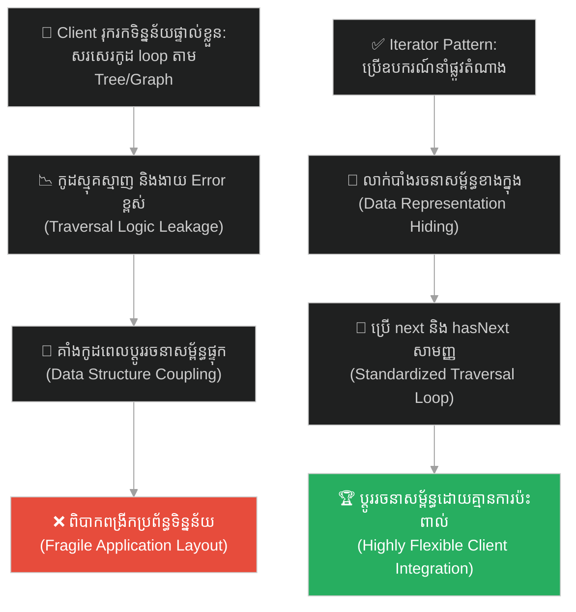
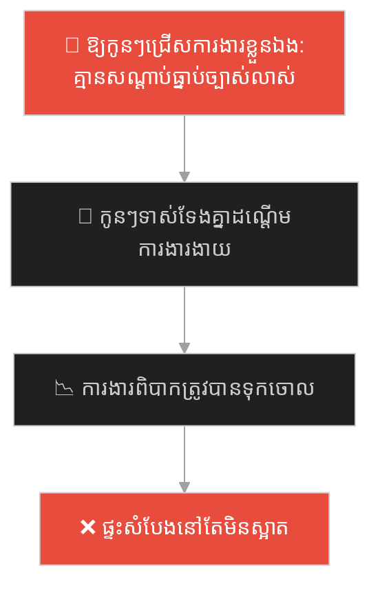
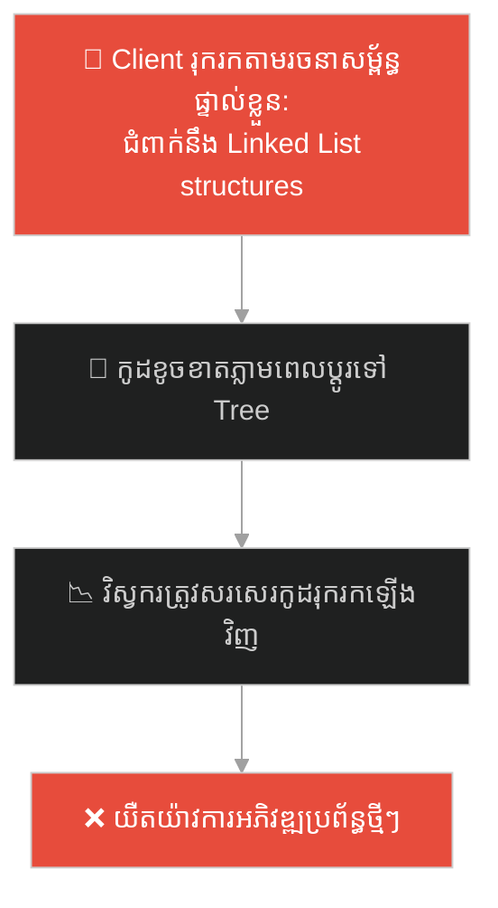
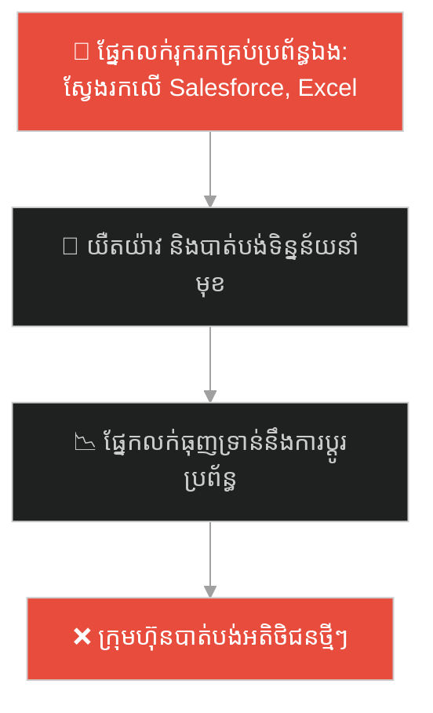
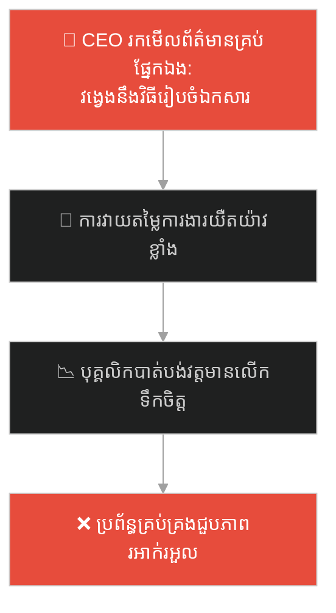
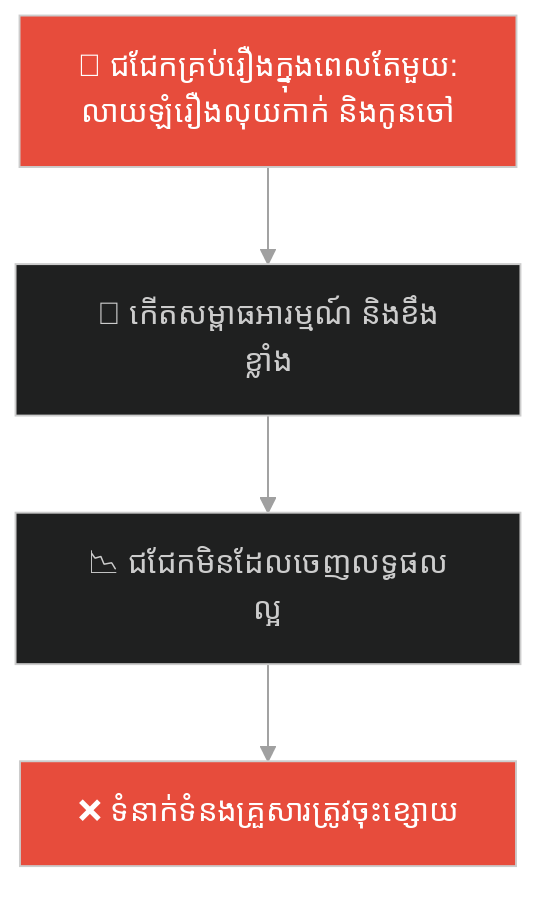
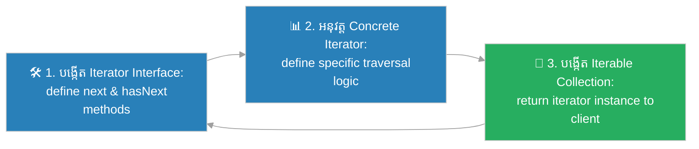

# Iterator Design Pattern (លំនាំរចនាឧបករណ៍នាំផ្លូវទិន្នន័យ)៖ ធ្នើសៀវភៅវេទមន្ត (Iterator Pattern & The Magical Bookshelf)

**Author:** ichamrong  
**Date:** 2026-05-27  
**Tags:** #design-patterns #iterator #architecture #software-engineering #parable  
**Category:** Concepts / Parables  
**Read Time:** ~15 min  

---

## 📌 មាតិកា (Table of Contents)
- [អន្ទាក់ផ្លូវចិត្ត (The Trap)](#0)
- [១. រឿងព្រេងប្រវត្តិសាស្ត្រ៖ បណ្ណាល័យដ៏ស្មុគស្មាញ និងធ្នើសៀវភៅវេទមន្ត (The Legend of the Labyrinth Library)](#1)
  - [ប៊ូតុងនាំផ្លូវ និងការអានដោយគ្មានការបារម្ភ (The Magic Button Solution)](#1-1)
- [២. បញ្ហា៖ ការលាតត្រដាងរចនាសម្ព័ន្ធទិន្នន័យ និងភាពរឹងរបស់ប្រព័ន្ធ (The Issue: Exposing Collection Structures and Traversal Rigidity)](#2)
- [៣. ឧទាហរណ៍ជាក់ស្តែងក្នុងពិភពពិត (Real World Examples)](#3)
  - [ឧទាហរណ៍ទី ១ — កម្រិតស្រាល (គ្រួសារ)៖ ការអានបញ្ជីការងារផ្ទះពីក្តារខៀនសាមញ្ញ (Reading Chore List from Board Sequentially)](#3-1)
  - [ឧទាហរណ៍ទី ២ — កម្រិតមធ្យម (បច្ចេកទេស)៖ ការទាញយកបញ្ជីប្រើប្រាស់ដោយគ្មានការខ្វល់ខ្វាយពីរចនាសម្ព័ន្ធ (Looping User Collection without Tree/Graph Details)](#3-2)
  - [ឧទាហរណ៍ទី ៣ — កម្រិតមធ្យម (ធុរកិច្ច)៖ ការពិនិត្យបញ្ជីអតិថិជនរំពឹងទុកពីប្រព័ន្ធ CRM ផ្សេងៗ (Scanning Leads Sequentially Across Multiple CRMs)](#3-3)
  - [ឧទាហរណ៍ទី ៤ — កម្រិតមធ្យម (សង្គម/គ្រប់គ្រង)៖ ការវាយតម្លៃលទ្ធផលការងាររបស់បុគ្គលិកតាមផ្នែក (Reviewing Employee Performance Records Across Departments)](#3-4)
  - [ឧទាហរណ៍ទី ៥ — កម្រិតធ្ងន់ (ទំនាក់ទំនង)៖ ការពិភាក្សាប្រធានបទមួយម្តងៗក្នុងទំនាក់ទំនងគ្រួសារ (Structured Conversation Prompts During Weekly Check-ins)](#3-5)
- [៤. ដំណោះស្រាយទូទៅ៖ ការអនុវត្ត Iterator Pattern តាមរយៈ Standardized Traversers (The General Solution: Iterator Pattern with Decoupled Traversal Interfaces)](#4)
- [សេចក្តីសន្និដ្ឋាន (Conclusion)](#5)
- [ឯកសារយោង (References)](#6)
- [Related Posts](#7)

---

<a id="0"></a>
## អន្ទាក់ផ្លូវចិត្ត (The Trap)

តើអ្នកធ្លាប់ជួបបញ្ហាដែលអ្នកត្រូវសរសេរកូដរុករកយ៉ាងស្មុគស្មាញនៅក្នុង Client ដើម្បីទាញយករបស់របរចេញពី Collection ផ្សេងៗ ដែលនាំឱ្យកូដរបស់ Client ជាប់ជំពាក់យ៉ាងតឹងរឹងទៅនឹងរចនាសម្ព័ន្ធទិន្នន័យ (Data Structure) ខាងក្នុងដែរឬទេ?

នៅក្នុងការរចនាកូដកម្មវិធី៖
* **<a id="0-trap"></a>យើងងាយនឹងធ្លាក់ក្នុងអន្ទាក់** នៃការបើកបង្ហាញរចនាសម្ព័ន្ធផ្ទុកទិន្នន័យខាងក្នុង (ដូចជា Array, Binary Tree, Graph) ទៅឱ្យ Client ដឹង ដែលធ្វើឱ្យ Client ត្រូវសរសេរកូដរុករកផ្ទាល់ខ្លួន។ នៅពេលយើងប្តូរវិធីផ្ទុកទិន្នន័យ កូដរបស់ Client នឹងត្រូវ Error ទាំងអស់។
* **យើងមើលរំលង** ការផ្តល់នូវឧបករណ៍នាំផ្លូវតំណាងសកលមួយ (Iterator) ដែលលាក់បាំងភាពស្មុគស្មាញនៃការរុករកទិន្នន័យទាំងអស់នៅពីក្រោយ Methods ដ៏សាមញ្ញពីរគឺ `next()` និង `hasNext()`។

ការព្យាយាមរុករក និងឆែកមើលរចនាសម្ព័ន្ធផ្ទុកទិន្នន័យខាងក្នុងដោយខ្លួនឯង ហៅថា **អន្ទាក់ចងភ្ជាប់រចនាសម្ព័ន្ធទិន្នន័យស្នូល (Tight Data Structure Coupling Trap)**។

ដើម្បីយល់ដឹងពីរបៀបលាក់បាំងរចនាសម្ព័ន្ធផ្ទុក និងការទាញទិន្នន័យយ៉ាងសាមញ្ញ នេះជាផែនទីបង្ហាញផ្លូវ៖
1. **រឿងព្រេងប្រវត្តិសាស្ត្រ (The Historic Legend)** — រឿងរ៉ាវរបស់អ្នកអានដែលវង្វេងក្នុងបណ្ណាល័យបុរាណដែលមានរៀបចំសៀវភៅខុសៗគ្នា។
2. **បញ្ហា (The Issue)** — ការវិភាគភាពជំពាក់ជំពិននៃរចនាសម្ព័ន្ធទិន្នន័យក្នុង OOP និងភាពរឹងរបស់ប្រព័ន្ធ។
3. **ឧទាហរណ៍ជាក់ស្តែងក្នុងពិភពពិត (Real World Examples)** — ពិនិត្យមើលបញ្ហានេះក្នុងកម្រិតគ្រួសារ បច្ចេកវិទ្យា ធុរកិច្ច ការគ្រប់គ្រង និងទំនាក់ទំនង។
4. **ដំណោះស្រាយទូទៅ (The General Solution)** — ការអនុវត្ត Iterator Pattern ដើម្បីបង្កើតយន្តការនាំផ្លូវទិន្នន័យដ៏ស្រស់ស្អាត។



---

<a id="1"></a>
## ១. រឿងព្រេងប្រវត្តិសាស្ត្រ៖ បណ្ណាល័យដ៏ស្មុគស្មាញ និងធ្នើសៀវភៅវេទមន្ត (The Legend of the Labyrinth Library)

កាលពីព្រេងនាយ មានអ្នកអានដ៏ឧស្សាហ៍ម្នាក់ បានធ្វើដំណើរទៅកាន់បណ្ណាល័យបុរាណដ៏ល្បីល្បាញមួយ ដើម្បីស្វែងរកចំណេះដឹង។ គាត់ចង់អានសៀវភៅទាំងអស់ដែលមាននៅក្នុងបណ្ណាល័យនោះម្តងមួយក្បាលៗដោយគ្មានការរំលង។

ទោះជាយ៉ាងណា ពេលចូលទៅដល់ខាងក្នុង គាត់ត្រូវស្រឡាំងកាំង៖ សៀវភៅនៅក្នុងបណ្ណាល័យនេះ មិនត្រូវបានរៀបចំទុកដាក់តាមរបៀបតែមួយឡើយ៖
* **បន្ទប់ទី ១ (រចនាសម្ព័ន្ធ Array)៖** សៀវភៅត្រូវបានរៀបចំតម្រៀបជាជួរត្រង់ៗយ៉ាងវែងនៅលើធ្នើវែង។
* **បន្ទប់ទី ២ (រចនាសម្ព័ន្ធ Tree)៖** សៀវភៅត្រូវបានព្យួរនៅលើមែកឈើវេទមន្ត តាមឋានានុក្រមពីធំទៅតូច។
* **បន្ទប់ទី ៣ (រចនាសម្ព័ន្ធ Graph)៖** សៀវភៅត្រូវបានរៀបចំជាបណ្តាញខ្វែងខ្វាត់ ដែលសៀវភៅមួយចង្អុលទៅសៀវភៅបីទៀត។

ដើម្បីអានសៀវភៅទាំងអស់ អ្នកអានត្រូវបង្ខំចិត្តរៀនពីក្បួនរុករក (Traversal Algorithms) ទាំង ៣ ប្រភេទផ្សេងគ្នាយ៉ាងលំបាក។ គាត់ត្រូវចំណាយពេលគិតខ្វល់ខ្វាយពីរបៀបដើររុករកជាជាងផ្តោតអារម្មណ៍ទៅលើការអានសៀវភៅ។

---

<a id="1-1"></a>
### ប៊ូតុងនាំផ្លូវ និងការអានដោយគ្មានការបារម្ភ (The Magic Button Solution)

បណ្ណារក្សដ៏ចំណានម្នាក់បានមើលឃើញពីទុក្ខលំបាករបស់អ្នកអាន។ គាត់បានដើរមកជិត រួចហុច **ឧបករណ៍នាំផ្លូវសកល (The Magic Iterator Button)** មួយគ្រាប់ទៅឱ្យគាត់។

ឧបករណ៍នេះមានប៊ូតុងបញ្ជាសាមញ្ញបំផុតតែ ២ ប៉ុណ្ណោះ៖
1. **hasNext() (តើនៅមានសៀវភៅទៀតទេ?)៖** ភ្លើងសញ្ញានឹងភ្លឺបើនៅមានសៀវភៅមិនទាន់អាន។
2. **next() (យកសៀវភៅបន្ទាប់មកឱ្យខ្ញុំ!)៖** នៅពេលចុច ប៊ូតុងនឹងដើរទៅយកសៀវភៅបន្ទាប់មកហុចជូនភ្លាមៗ។

ឥឡូវនេះ អ្នកអានលែងខ្វល់ខ្វាយ និងលែងវង្វេងទៀតហើយ។ គាត់គ្រាន់តែអង្គុយនៅលើកៅអីយ៉ាងមានផាសុកភាព រួចចុច `next()` ម្តងហើយម្តងទៀត។ មិនថាសៀវភៅត្រូវបានរៀបចំទុកដាក់ជា Array, Tree ឬ Graph ខាងក្នុងឡើយ ឧបករណ៍នាំផ្លូវនឹងចាត់ចែងរុករក និងយកមកប្រគល់ជូនគាត់យ៉ាងរលូនរហូតដល់អស់សៀវភៅក្នុងបណ្ណាល័យ។

---

<a id="2"></a>
## ២. បញ្ហា៖ ការលាតត្រដាងរចនាសម្ព័ន្ធទិន្នន័យ និងភាពរឹងរបស់ប្រព័ន្ធ (The Issue: Exposing Collection Structures and Traversal Rigidity)

នៅក្នុងការសរសេរកូដ OOP ភាពស្មុគស្មាញនេះកើតឡើងនៅពេលយើងលាតត្រដាងរចនាសម្ព័ន្ធផ្ទុកទិន្នន័យ (Internal Representation) របស់ Class ទៅកាន់ Client ខាងក្រៅ៖

```java
// កូដដែលគ្មាន Iterator គឺ Client ត្រូវដឹងពីរបៀប loop ផ្ទាល់ខ្លួន
List<Book> books = library.getBooksList(); // លេចធ្លាយប្រភេទ List
for (int i = 0; i < books.size(); i++) {
    // Client ត្រូវសរសេរ loop ផ្ទាល់ខ្លួន
}
```

* **ភាពជំពាក់ជំពិនគ្នាយ៉ាងតឹងរឹង (Tight Coupling)៖** ប្រសិនបើយើងសម្រេចចិត្តប្តូរវិធីរក្សាទុកសៀវភៅពី `ArrayList` ទៅជា `HashMap` ឬ `BinaryTree` នោះកូដរបស់ Client ទាំងអស់នឹងត្រូវ Error និងខូចខាតភ្លាមៗ។
* **ការបំពានគោលការណ៍ Encapsulation៖** ព័ត៌មានលម្អិតនៃការរៀបចំទិន្នន័យត្រូវបានលាតត្រដាង ដែលបាត់បង់សុវត្ថិភាពប្រព័ន្ធ។

**Iterator Design Pattern** ជួយដោះស្រាយបញ្ហានេះដោយបំបែកកូដរុករក (Traversal Logic) ចេញពី Collection ហើយដាក់វានៅក្នុង Class នាំផ្លូវដាច់ដោយឡែក (Iterator class) ដែលជួយឱ្យ Client អាច Loop ទាញយកទិន្នន័យដោយប្រើប្រាស់ Interface សកលតែមួយ។

---

<a id="3"></a>
## ៣. ឧទាហរណ៍ជាក់ស្តែងក្នុងពិភពពិត

---

<a id="3-1"></a>
### ឧទាហរណ៍ទី ១ — កម្រិតស្រាល (គ្រួសារ)៖ ការអានបញ្ជីការងារផ្ទះពីក្តារខៀនសាមញ្ញ (Reading Chore List from Board Sequentially)

នៅក្នុងគ្រួសារមួយ ម្តាយបានសរសេរបញ្ជីការងារផ្ទះ (បោសផ្ទះ លាងចាន ស្រោចផ្កា) នៅលើក្តារខៀនក្នុងផ្ទះបាយ។ កូនៗត្រូវធ្វើការងារទាំងនេះម្តងមួយៗ។ ជំនួសឱ្យការខ្វល់ខ្វាយថាតើការងារណាជាអាទិភាពខ្ពស់ ឬការងារណាដែលត្រូវធ្វើមុនតាមឋានានុក្រមស្មុគស្មាញ កូនៗគ្រាន់តែអានពីលើចុះក្រោម ហើយសម្អាតម្តងមួយៗយ៉ាងសាមញ្ញបំផុត។



កូនៗបានប្រើគោលការណ៍ Iterator style ដើម្បីដោះស្រាយការងារផ្ទះម្តងមួយៗដោយរលូន។

---

<a id="3-2"></a>
### ឧទាហរណ៍ទី ២ — កម្រិតមធ្យម (បច្ចេកទេស)៖ ការទាញយកបញ្ជីប្រើប្រាស់ដោយគ្មានការខ្វល់ខ្វាយពីរចនាសម្ព័ន្ធ (Looping User Collection without Tree/Graph Details)

នៅក្នុងការសរសេរកម្មវិធី ក្រុមការងារត្រូវការ Loop បង្ហាញឈ្មោះអ្នកប្រើប្រាស់ (Users) ទាំងអស់នៅលើ Web Interface។ មិនថាបញ្ជីព័ត៌មានអ្នកប្រើប្រាស់ត្រូវបានរក្សាទុកជា Binary Search Tree ឬជា Linked List នៅក្នុង Database ឡើយ Client គ្រាន់តែប្រើប្រាស់ `userIterator` ដើម្បីទាញយកទិន្នន័យយ៉ាងងាយស្រួល។



---

<a id="3-3"></a>
### ឧទាហរណ៍ទី ៣ — កម្រិតមធ្យម (ធុរកិច្ច)៖ ការពិនិត្យបញ្ជីអតិថិជនរំពឹងទុកពីប្រព័ន្ធ CRM ផ្សេងៗ (Scanning Leads Sequentially Across Multiple CRMs)

ក្រុមហ៊ុនមួយចង់ស្វែងរកបញ្ជីអតិថិជនរំពឹងទុក (Leads) ដើម្បីធ្វើទីផ្សារ។ ព័ត៌មានអតិថិជនត្រូវបានរក្សាទុកនៅលើប្រព័ន្ធផ្សេងៗគ្នា (ខ្លះនៅលើ Salesforce, ខ្លះនៅលើ Google Sheets, ខ្លះនៅលើ Database ផ្ទាល់ខ្លួន)។ ជំនួសឱ្យការឱ្យផ្នែកលក់រៀនពីវិធីស្វែងរករបស់គ្រប់ប្រព័ន្ធ ក្រុមហ៊ុនបានបង្កើត Unified Lead Iterator ដើម្បីបង្ហាញបញ្ជីម្តងមួយៗរលូន។



---

<a id="3-4"></a>
### ឧទាហរណ៍ទី ៤ — កម្រិតមធ្យម (សង្គម/គ្រប់គ្រង)៖ ការវាយតម្លៃលទ្ធផលការងាររបស់បុគ្គលិកតាមផ្នែក (Reviewing Employee Performance Records Across Departments)

នៅក្នុងការវាយតម្លៃការងារប្រចាំឆ្នាំ នាយកប្រតិបត្តិ (CEO) ត្រូវពិនិត្យមើលលទ្ធផលការងាររបស់បុគ្គលិកទាំងអស់។ ជំនួសឱ្យការឱ្យ CEO ដើរចូលទៅដល់ក្នុងប្រព័ន្ធផ្ទុកឯកសាររបស់គ្រប់នាយកដ្ឋាន (ដែលរៀបចំខុសៗគ្នា) ផ្នែកធនធានមនុស្សបានប្រើប្រាស់ Iterator Strategy ដោយប្រមូល និងបង្ហាញបញ្ជីវាយតម្លៃម្តងម្នាក់ៗយ៉ាងស្អាត។



---

<a id="3-5"></a>
### ឧទាហរណ៍ទី ៥ — កម្រិតធ្ងន់ (ទំនាក់ទំនង)៖ ការពិភាក្សាប្រធានបទមួយម្តងៗក្នុងទំនាក់ទំនងគ្រួសារ (Structured Conversation Prompts During Weekly Check-ins)

នៅក្នុងទំនាក់ទំនងប្តីប្រពន្ធ ជារឿយៗពួកគេត្រូវការពិភាក្សាអំពីបញ្ហាផ្សេងៗដូចជា ហិរញ្ញវត្ថុ ការអប់រំកូន និងសុខភាព។ ជំនួសឱ្យការនិយាយលាយឡំគ្នា ប្តឹងផ្តល់ និងជជែកវែកញែករឿងគ្រប់យ៉ាងក្នុងពេលតែមួយ (ដែលនាំឱ្យច្របូកច្របល់ និងខឹងគ្នា) ពួកគេបានរៀបចំសន្លឹកបៀរសំណួរ (Conversation Prompts - Iterator) រួចទាញយកមកជជែកគ្នាប្រចាំសប្តាហ៍ម្តងមួយសន្លឹកៗយ៉ាងយកចិត្តទុកដាក់។



---

<a id="4"></a>
## ៤. ដំណោះស្រាយទូទៅ៖ ការអនុវត្ត Iterator Pattern តាមរយៈ Standardized Traversers (The General Solution: Iterator Pattern with Decoupled Traversal Interfaces)

ដើម្បីលាក់បាំងរចនាសម្ព័ន្ធផ្ទុកទិន្នន័យខាងក្នុង និងជួយសម្រួលការរុករកទិន្នន័យ យើងត្រូវអនុវត្តលំនាំរចនា **Iterator Pattern**៖



ជំហាននៃការអនុវត្ត៖
1. **បង្កើត Iterator Interface៖** កំណត់ Method `next()` ដើម្បីទាញយកធាតុបន្ទាប់ និង `hasNext()` ដើម្បីពិនិត្យមើលថាតើនៅមានធាតុសេសសល់ដែរឬទេ។
2. **បង្កើត Concrete Iterator Class៖** បង្កើត Class ជាក់ស្តែងសម្រាប់រុករកលើ Collection ជាក់លាក់។ វារក្សាទុកទីតាំងបច្ចុប្បន្ន (Current Index/Cursor) និងយល់ដឹងច្បាស់ពីរបៀបដើររុករកលើរចនាសម្ព័ន្ធខាងក្នុងរបស់ Collection នោះ។
3. **អនុវត្ត Iterable Interface លើ Collection៖** ផ្តល់ Method `createIterator()` នៅក្នុង Collection Class របស់អ្នក ដើម្បីបង្កើត និងប្រគល់ Instance របស់ Iterator ត្រឡប់ទៅឱ្យ Client ប្រើប្រាស់ដោយជោគជ័យ។

---

## 🐇 ធ្លាក់ចូលក្នុងរន្ធទន្សាយ (Enter the Rabbit Hole)

ដើម្បីស្វែងយល់ពីរបៀបដែលប្រព័ន្ធទិញសំបុត្រដឹកជញ្ជូន អាចផ្លាស់ប្តូរមធ្យោបាយធ្វើដំណើរ (យន្តហោះ ឡានក្រុង រថភ្លើង) យ៉ាងបត់បែនរហ័សតាមចំណង់ចំណូលចិត្ត និងថវិការបស់អ្នកដំណើរ ដោយមិនបាច់កែប្រែកូដបញ្ជាទិញ (Strategy Pattern) សូមបន្តដំណើរទៅកាន់៖

* 🚀 **[ចាប់ផ្តើមដំណើររុករក (Start the Journey) ➔ Strategy Pattern and Interchangeable Algorithms](./89-the-three-transport-tickets.md)**

---

<a id="5"></a>
## សេចក្តីសន្និដ្ឋាន (Conclusion)

> **«កុំបង្ខំឱ្យអ្នកអានសៀវភៅត្រូវដើររៀនក្បួនរុករកធ្នើរដដែលៗ។ ចូរផ្តល់ជូនឧបករណ៍នាំផ្លូវដ៏សាមញ្ញ ដើម្បីរក្សាភាពស្អាតស្អំ និងការផ្តោតអារម្មណ៍លើទិន្នន័យពិត។»**

ចូរធ្វើខ្លួនជាវិស្វករកម្មវិធីដែលយល់ដឹងពីសិល្បៈនៃការលាក់បាំងព័ត៌មានលម្អិតរបស់ទិន្នន័យ (Information Hiding in Collections)។ ការអនុវត្ត Iterator Design Pattern មិនត្រឹមតែជួយឱ្យកូដរបស់ Client មានភាពសាមញ្ញ និងងាយយល់ប៉ុណ្ណោះទេ ប៉ុន្តែវាក៏ជួយឱ្យអ្នកអាចអភិវឌ្ឍ ឬផ្លាស់ប្តូរវិធីរក្សាទុកទិន្នន័យខាងក្នុងប្រព័ន្ធបានយ៉ាងងាយស្រួល និងគ្មានការប៉ះពាល់ដល់ស្ថិរភាពឡើយ។

---

<a id="6"></a>
## ឯកសារយោង (References)

* **Erich Gamma, Richard Helm, Ralph Johnson, John Vlissides** — *Design Patterns: Elements of Reusable Object-Oriented Software* (1994). Iterator Design Pattern Chapter.
* **Joshua Bloch** — *Effective Java: Item 58 (Prefer for-each loops to traditional for loops)* (2018).
* **Martin Fowler** — *Refactoring: Improving the Design of Existing Code: Replace Loop with Pipeline* (2018).

---

<a id="7"></a>
## Related Posts

* **[88 Iterator Pattern: Standardizing Collection Traversals](../articles/88-iterator-pattern.md)** — អត្ថបទវិទ្យាសាស្ត្រលម្អិត និងកូដគំរូ Java/C# សម្រាប់ការរចនា Custom Iterator។
* **[87 The Customer Service Hotline](./87-the-customer-service-hotline.md)** — ការបញ្ជូនសំណើការងារជាបន្តបន្ទាប់ឆ្លងកាត់ខ្សែសង្វាក់ទទួលខុសត្រូវ។
* **[64 The Swiss Army Knife](./64-the-swiss-army-knife.md)** — ការរក្សាភាពសាមញ្ញ និងការចៀសវាងភាពចង្អៀតណែននៃមុខងារប្រព័ន្ធ។

---

## Related

- [💡 Concepts README](../README.md)
- [📚 Main Repository README](../../../README.md)
- [Developer Habits](../../developer-habits/README.md)
- [Mental Health & Well-being](../../mental-health/README.md)
- [Management & SDLC](../../management/README.md)
