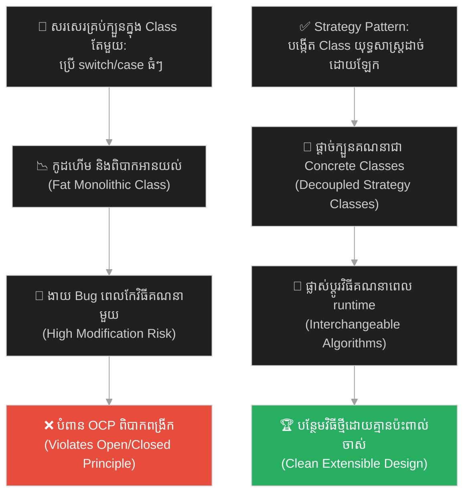
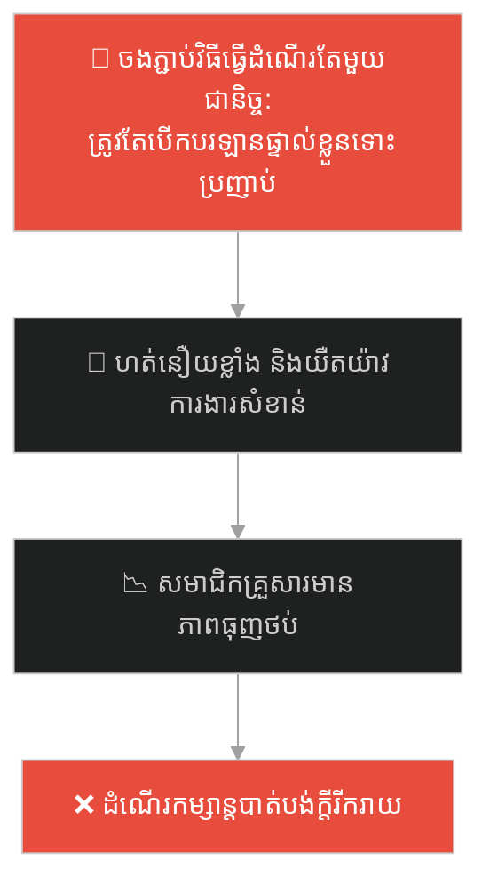
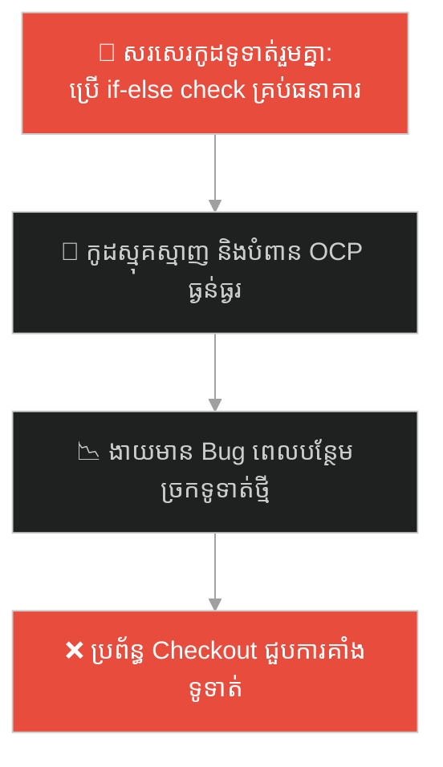
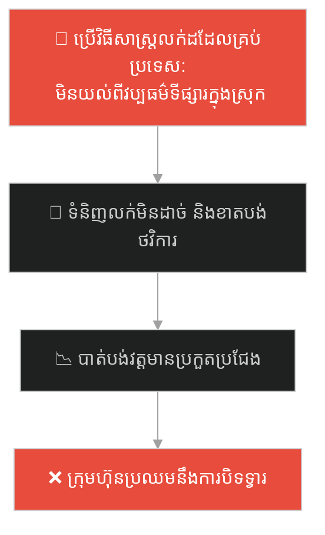
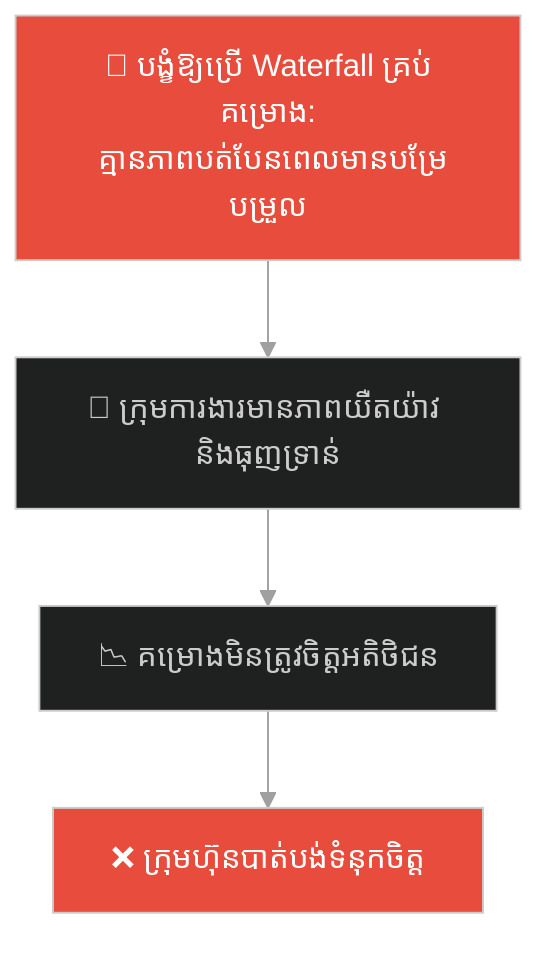
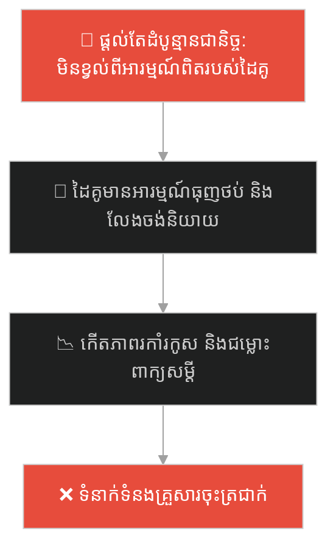
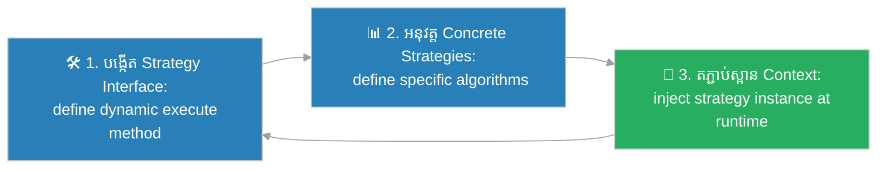

# Strategy Design Pattern (លំនាំរចនាយុទ្ធសាស្ត្រផ្លាស់ប្តូរ)៖ សំបុត្រធ្វើដំណើរទាំងបី (Strategy Pattern & The Three Transport Tickets)

**Author:** ichamrong  
**Date:** 2026-05-27  
**Tags:** #design-patterns #strategy #architecture #software-engineering #parable  
**Category:** Concepts / Parables  
**Read Time:** ~15 min  

---

## 📌 មាតិកា (Table of Contents)
- [អន្ទាក់ផ្លូវចិត្ត (The Trap)](#0)
- [១. រឿងព្រេងប្រវត្តិសាស្ត្រ៖ អ្នកធ្វើដំណើរដ៏ស្មុគស្មាញ និងផែនទីក្នុងខួរក្បាល (The Legend of the Hardcoded Traveler)](#1)
  - [សំបុត្រធ្វើដំណើរទាំងបី និងការផ្លាស់ប្តូរយុទ្ធសាស្ត្រ (The Strategy Ticket Solution)](#1-1)
- [២. បញ្ហា៖ កូដលក្ខខណ្ឌវែងអន្លាយ និងការលំបាកក្នុងការបន្ថែមវិធីគណនា (The Issue: Massive Switch/Case Logic and Open/Closed Principle Violation)](#2)
- [៣. ឧទាហរណ៍ជាក់ស្តែងក្នុងពិភពពិត (Real World Examples)](#3)
  - [ឧទាហរណ៍ទី ១ — កម្រិតស្រាល (គ្រួសារ)៖ ការជ្រើសរើសមធ្យោបាយធ្វើដំណើរទៅលំហែកាយ (Choosing Vacation Transit Strategies)](#3-1)
  - [ឧទាហរណ៍ទី ២ — កម្រិតមធ្យម (បច្ចេកទេស)៖ ការផ្លាស់ប្តូរវិធីទូទាត់ប្រាក់ក្នុងប្រព័ន្ធ Checkout (Swapping Payment Strategies Dynamically at Runtime)](#3-2)
  - [ឧទាហរណ៍ទី ៣ — កម្រិតមធ្យម (ធុរកិច្ច)៖ ការជ្រើសរើសយុទ្ធសាស្ត្រវាយលុកទីផ្សារតាមតំបន់ (Selecting Regional Market Entry Strategies)](#3-3)
  - [ឧទាហរណ៍ទី ៤ — កម្រិតមធ្យម (សង្គម/គ្រប់គ្រង)៖ ការផ្លាស់ប្តូរក្របខ័ណ្ឌការងាររបស់ក្រុមអភិវឌ្ឍន៍ (Swapping Scrum, Kanban, or Waterfall Project Frameworks)](#3-4)
  - [ឧទាហរណ៍ទី ៥ — កម្រិតធ្ងន់ (ទំនាក់ទំនង)៖ ការជ្រើសរើសវិធីសាស្ត្រគាំទ្រអារម្មណ៍ដៃគូ (Choosing Emotional Support Strategies Depending on Mood)](#3-5)
- [៤. ដំណោះស្រាយទូទៅ៖ ការអនុវត្ត Strategy Pattern តាមរយៈ Interface Decoupling (The General Solution: Strategy Pattern with Interchangeable Algorithms)](#4)
- [សេចក្តីសន្និដ្ឋាន (Conclusion)](#5)
- [ឯកសារយោង (References)](#6)
- [Related Posts](#7)

---

<a id="0"></a>
## អន្ទាក់ផ្លូវចិត្ត (The Trap)

តើអ្នកធ្លាប់ជួបបញ្ហាដែលអ្នកត្រូវសរសេរកូដលក្ខខណ្ឌ `switch-case` ធំៗរាប់សិបបន្ទាត់ ដើម្បីជ្រើសរើសវិធីសាស្ត្រ ឬក្បួនគណនា (Algorithms) ផ្សេងៗគ្នាទៅតាមស្ថានភាពជាក់ស្តែងដែរឬទេ?

នៅក្នុងការអភិវឌ្ឍប្រព័ន្ធ៖
* **យើងងាយនឹងធ្លាក់ក្នុងអន្ទាក់** នៃការលាយបញ្ចូលក្បួនគណនាផ្សេងៗគ្នាយ៉ាងណែនណាន់តាប់នៅក្នុង Class ស្នូលតែមួយ (Hardcoded Logic) ដែលបំពានគោលការណ៍ Open/Closed Principle ធ្វើឱ្យកូដទាំងមូលហើមធំ និងងាយបង្ក Bug ពេលកែប្រែ។
* **យើងមើលរំលង** ការផ្តាច់យករាល់ក្បួនគណនា ឬឥរិយាបថទាំងនោះ ទៅដាក់ក្នុង Class ដាច់ដោយឡែកពីគ្នា (Strategy Classes) ដែលអនុញ្ញាតឱ្យយើងអាចផ្លាស់ប្តូរពួកវាបានយ៉ាងបត់បែននៅពេលកំពុងដំណើរការ (Runtime)។

ការព្យាយាមរៀបចំគ្រប់វិធីគណនាដដែលៗនៅក្នុង Class ស្នូលតែមួយ ហៅថា **អន្ទាក់កូដលក្ខខណ្ឌវិវឌ្ឍន៍រញ៉េរញ៉ៃ (Hardcoded Multi-Algorithm Spaghetti Trap)** Earth.

ដើម្បីយល់ដឹងពីរបៀបផ្តាច់ក្បួនគណនា និងការផ្លាស់ប្តូរយុទ្ធសាស្ត្រយ៉ាងមានសណ្តាប់ធ្នាប់ ផែនទីបង្ហាញផ្លូវមានដូចខាងក្រោម៖
1. **រឿងព្រេងប្រវត្តិសាស្ត្រ (The Historic Legend)** — រឿងរ៉ាវរបស់អ្នកធ្វើដំណើរដែលព្យាយាមចងចាំគ្រប់ផែនទីធ្វើដំណើរទាំងអស់នៅក្នុងខួរក្បាល។
2. **បញ្ហា (The Issue)** — ការវិភាគភាពជំពាក់ជំពិនគ្នាក្នុង OOP និងការបំពានគោលការណ៍ Open/Closed Principle។
3. **ឧទាហរណ៍ជាក់ស្តែងក្នុងពិភពពិត (Real World Examples)** — ពិនិត្យមើលបញ្ហានេះក្នុងកម្រិតគ្រួសារ បច្ចេកវិទ្យា ធុរកិច្ច ការគ្រប់គ្រង និងទំនាក់ទំនង។
4. **ដំណោះស្រាយទូទៅ (The General Solution)** — ការអនុវត្ត Strategy Pattern តាមរយៈ Composition ដើម្បីបង្កើតប្រព័ន្ធដែលអាចបត់បែនបានខ្ពស់។



---

<a id="1"></a>
## ១. រឿងព្រេងប្រវត្តិសាស្ត្រ៖ អ្នកធ្វើដំណើរដ៏ស្មុគស្មាញ និងផែនទីក្នុងខួរក្បាល (The Legend of the Hardcoded Traveler)

មានបុរសម្នាក់ត្រូវការធ្វើដំណើរទៅកាន់ព្រលានយន្តហោះជានិច្ច ដើម្បីបំពេញការងារអាជីវកម្មរបស់គាត់។ 

រាល់ពេលដែលគាត់រៀបចំខ្លួនចេញពីផ្ទះ គាត់ត្រូវយកក្បួនធ្វើដំណើរ និងផែនទីទាំងអស់មកផ្ទុក និងគណនាយ៉ាងស្មុគស្មាញនៅក្នុងខួរក្បាលរបស់គាត់ (Hardcoded Logic)៖
*"ប្រសិនបើខ្ញុំមានប្រាក់ និងប្រញាប់ខ្លាំង ខ្ញុំត្រូវហៅតាក់ស៊ី។ ផ្លូវតាក់ស៊ីត្រូវបត់តាមនេះ ជួបស្ទះចរាចរណ៍នៅត្រង់នេះ ត្រូវបង់លុយតាមនេះ... ប្រសិនបើខ្ញុំចង់សន្សំប្រាក់ ខ្ញុំត្រូវជិះឡានក្រុង។ ឡានក្រុងត្រូវដើរទៅចំណតនេះ ត្រូវរង់ចាំប៉ុន្មាននាទី... ប្រសិនបើខ្ញុំអស់ប្រាក់ ខ្ញុំត្រូវដើរ។ ផ្លូវដើរត្រូវកាត់តាមព្រៃនេះ..."*

រាល់ពេលដែលគាត់ចង់បន្ថែមវិធីធ្វើដំណើរថ្មីមួយទៀត (ដូចជា ជិះកង់) គាត់ត្រូវរៀនទន្ទេញផែនទីជិះកង់ថ្មីបន្ថែមទៀតចូលក្នុងខួរក្បាលរបស់គាត់។ យូរៗទៅ ខួរក្បាលរបស់គាត់ពោរពេញទៅដោយក្បួនធ្វើដំណើរ និងផែនទីដ៏រញ៉េរញ៉ៃ ដែលធ្វើឱ្យគាត់ស្មុគស្មាញ អស់កម្លាំង និងងាយនឹងសម្រេចចិត្តខុសពេលប្រញាប់ខ្លាំង។

---

<a id="1-1"></a>
### សំបុត្រធ្វើដំណើរទាំងបី និងការផ្លាស់ប្តូរយុទ្ធសាស្ត្រ (The Strategy Ticket Solution)

នៅថ្ងៃមួយ គាត់បានសម្រេចចិត្ត "លាងសម្អាតខួរក្បាល" របស់ខ្លួនចោល ដោយឈប់ទន្ទេញផែនទី និងក្បួនធ្វើដំណើរទាំងអស់នោះទៀតហើយ។

គាត់បានទិញ **សំបុត្រធ្វើដំណើរ (Strategy Tickets)** ចំនួន ៣ សន្លឹកមកដាក់ក្នុងហោប៉ៅ ដែលសន្លឹកនីមួយៗតំណាងឱ្យមធ្យោបាយធ្វើដំណើរផ្សេងៗគ្នា៖
* **Taxi Strategy Ticket:** សម្រាប់ហៅតាក់ស៊ីរហ័ស។
* **Bus Strategy Ticket:** សម្រាប់ជិះឡានក្រុងសន្សំសំចៃ។
* **Walk Strategy Ticket:** សម្រាប់ដើរលំហែកាយ។

ឥឡូវនេះ នៅពេលគាត់ចេញពីផ្ទះ គាត់គ្រាន់តែមើលស្ថានភាពជាក់ស្តែង (Context) រួចដកសំបុត្រដែលសមស្របមកប្រើ៖
* ប្រសិនបើមេឃកំពុងភ្លៀង និងប្រញាប់ខ្លាំង គាត់ដក `Taxi Strategy Ticket` រួចប្រគល់ជូនអ្នកបើកបរ ហើយនិយាយខ្លីថា៖ *"ទៅព្រលានយន្តហោះ (goToAirport())"*។
* ប្រសិនបើមានពេលច្រើន គាត់ដក `Bus Strategy Ticket` រួចហុចឱ្យអ្នកបើកបរ ហើយនិយាយថា៖ *"ទៅព្រលានយន្តហោះ (goToAirport())"*។

គាត់ (Client) លែងខ្វល់ខ្វាយថាឡានត្រូវបត់ឆ្វេង ឬបត់ស្តាំទៀតហើយ ព្រោះក្បួនរត់ទាំងអស់ត្រូវបានចាត់ចែងដោយអ្នកបើកបរ (Concrete Strategy Classes)។ ប្រសិនបើថ្ងៃក្រោយ គាត់ចង់បន្ថែមមធ្យោបាយជិះកង់ គាត់គ្រាន់តែទិញ `Bicycle Strategy Ticket` មួយសន្លឹកទៀតមកដាក់ក្នុងហោប៉ៅជាការស្រេច ដោយមិនចាំបាច់កែប្រែរចនាសម្ព័ន្ធខួរក្បាលរបស់គាត់ឡើយ។

---

<a id="2"></a>
## ២. បញ្ហា៖ កូដលក្ខខណ្ឌវែងអន្លាយ និងការលំបាកក្នុងការបន្ថែមវិធីគណនា (The Issue: Massive Switch/Case Logic and Open/Closed Principle Violation)

នៅក្នុងការរចនាស្ថាបត្យកម្មសូហ្វវែរ ភាពស្មុគស្មាញនេះកើតឡើងនៅពេលយើងសរសេរកូដលក្ខខណ្ឌ `switch/case` ធំៗនៅក្នុង Class តែមួយ៖

```java
// កូដដែលគ្មាន Strategy បំពាន OCP យ៉ាងធ្ងន់ធ្ងរ
public double calculateDiscount(String customerType, double price) {
    if (customerType.equals("VIP")) {
        return price * 0.8; // ក្បួន VIP
    } else if (customerType.equals("MEMBER")) {
        return price * 0.9; // ក្បួន Member
    }
    // ងាយនឹងមាន Bug ពេលបន្ថែមប្រភេទអតិថិជនថ្មី
}
```

* **ការបំពានគោលការណ៍ Open/Closed Principle (OCP)៖** រាល់ពេលចង់បន្ថែមយុទ្ធសាស្ត្រគណនាថ្មី យើងត្រូវចូលទៅកែប្រែកូដនៅក្នុង Class ដើម ដែលងាយនឹងប៉ះពាល់ដល់ស្ថិរភាពកូដចាស់។
* **ការបាត់បង់លក្ខណៈផ្ទុកដោយឡែក (High Coupling)៖** វិធីគណនាទាំងអស់ត្រូវបានចងភ្ជាប់យ៉ាងស្អិតជាមួយ Class ប្រើប្រាស់ ដែលធ្វើឱ្យពិបាកធ្វើតេស្តសាកល្បងកូដរៀងៗខ្លួន។

**Strategy Design Pattern** ជួយដោះស្រាយបញ្ហានេះដោយបំបែកក្បួនគណនា ឬ algorithm នីមួយៗទៅជា Class ដាច់ដោយឡែកពីគ្នា ដែលអនុវត្តតាម Interface រួមមួយ។ វិធីនេះជួយឱ្យយើងអាចផ្លាស់ប្តូរវិធីគណនាបានយ៉ាងរលូនពេលកំពុងដំណើរការកម្មវិធី។

---

<a id="3"></a>
## ៣. ឧទាហរណ៍ជាក់ស្តែងក្នុងពិភពពិត

---

<a id="3-1"></a>
### ឧទាហរណ៍ទី ១ — កម្រិតស្រាល (គ្រួសារ)៖ ការជ្រើសរើសមធ្យោបាយធ្វើដំណើរទៅលំហែកាយ (Choosing Vacation Transit Strategies)

នៅក្នុងគ្រួសារមួយ ឪពុកម្តាយរៀបចំគម្រោងធ្វើដំណើរទៅលេងខេត្តសៀមរាប។ ជំនួសឱ្យការប្រើប្រាស់វិធីសាស្ត្រតែមួយជានិច្ច ពួកគេជ្រើសរើសយុទ្ធសាស្ត្រទៅតាមថវិកា និងពេលវេលា៖ ប្រសិនបើមានពេលតិច ពួកគេជ្រើសរើសការហោះហើរ (Fly Strategy) ប្រសិនបើចង់សន្សំសំចៃ និងមើលទេសភាព ពួកគេជ្រើសរើសបើកបរឡានផ្ទាល់ខ្លួន (Drive Strategy)។



គ្រួសារបានប្រើប្រាស់គោលការណ៍ Strategy style ដើម្បីសម្រេចចិត្តធ្វើដំណើរប្រកបដោយភាពរីករាយ។

---

<a id="3-2"></a>
### ឧទាហរណ៍ទី ២ — កម្រិតមធ្យម (បច្ចេកទេស)៖ ការផ្លាស់ប្តូរវិធីទូទាត់ប្រាក់ក្នុងប្រព័ន្ធ Checkout (Swapping Payment Strategies Dynamically at Runtime)

នៅក្នុងប្រព័ន្ធ Checkout របស់វិបសាយទិញទំនិញ អតិថិជនមានជម្រើសទូទាត់ប្រាក់ផ្សេងៗគ្នាដូចជា Stripe, PayPal និង Crypto។ ជំនួសឱ្យការសរសេរកូដលក្ខខណ្ឌ `if-else` ច្របូកច្របល់ វិស្វករបានបង្កើត Interface `PaymentStrategy` រួចឱ្យ Class ធនាគារនីមួយៗអនុវត្តតាម ដែលអនុញ្ញាតឱ្យផ្លាស់ប្តូរវិធីទូទាត់ប្រាក់បានយ៉ាងរលូន។



---

<a id="3-3"></a>
### ឧទាហរណ៍ទី ៣ — កម្រិតមធ្យម (ធុរកិច្ច)៖ ការជ្រើសរើសយុទ្ធសាស្ត្រវាយលុកទីផ្សារតាមតំបន់ (Selecting Regional Market Entry Strategies)

ក្រុមហ៊ុននាំចេញទំនិញមួយចង់ពង្រីកទីផ្សារទៅកាន់ប្រទេសផ្សេងៗ។ ជំនួសឱ្យការប្រើប្រាស់វិធីសាស្ត្រលក់ដដែលៗទូទាំងពិភពលោក ក្រុមហ៊ុនបានជ្រើសរើសយុទ្ធសាស្ត្រតាមតំបន់៖ ប្រទេសជប៉ុន ប្រើប្រាស់យុទ្ធសាស្ត្រភាពជាដៃគូជាមួយភ្នាក់ងារក្នុងស្រុក (Joint Venture Strategy) ប្រទេសអាមេរិក ប្រើប្រាស់យុទ្ធសាស្ត្រទីផ្សារឌីជីថលផ្ទាល់ (Direct Digital Marketing Strategy)។



---

<a id="3-4"></a>
### ឧទាហរណ៍ទី ៤ — កម្រិតមធ្យម (សង្គម/គ្រប់គ្រង)៖ ការផ្លាស់ប្តូរក្របខ័ណ្ឌការងាររបស់ក្រុមអភិវឌ្ឍន៍ (Swapping Scrum, Kanban, or Waterfall Project Frameworks)

នៅក្នុងការដឹកនាំក្រុមការងារសូហ្វវែរ ជំនួសឱ្យការបង្ខំឱ្យប្រើវិធីសាស្ត្រតែមួយគត់សម្រាប់គ្រប់គម្រោង (ដែលនាំឱ្យគ្មានប្រសិទ្ធភាព) ប្រធានក្រុមការងារបានជ្រើសរើសក្របខ័ណ្ឌការងារឱ្យត្រូវនឹងតម្រូវការគម្រោង៖ គម្រោងដែលមិនច្បាស់លាស់ ប្រើប្រាស់យុទ្ធសាស្ត្រ Scrum គម្រោងសាមញ្ញថែទាំប្រព័ន្ធ ប្រើប្រាស់យុទ្ធសាស្ត្រ Kanban។



---

<a id="3-5"></a>
### ឧទាហរណ៍ទី ៥ — កម្រិតធ្ងន់ (ទំនាក់ទំនង)៖ ការជ្រើសរើសវិធីសាស្ត្រគាំទ្រអារម្មណ៍ដៃគូ (Choosing Emotional Support Strategies Depending on Mood)

នៅក្នុងទំនាក់ទំនងប្តីប្រពន្ធ ពេលដៃគូម្នាក់ជួបទុក្ខលំបាក ឬហត់នឿយនឹងការងារ ជំនួសឱ្យការប្រើប្រាស់វិធីសាស្ត្រដដែលៗ (ដូចជា ដើរទៅផ្តល់ដំបូន្មានជានិច្ច ទោះបីជាដៃគូត្រូវការត្រឹមតែការលួងលោម) ដៃគូឆ្លាតវៃបានផ្លាស់ប្តូរយុទ្ធសាស្ត្រ៖ ពេលខ្លះប្រើប្រាស់យុទ្ធសាស្ត្រស្តាប់ដោយយកចិត្តទុកដាក់ (Active Listening Strategy) ពេលខ្លះប្រើប្រាស់យុទ្ធសាស្ត្រផ្តល់កម្លាំងចិត្ត (Encouragement Strategy)។



---

<a id="4"></a>
## ៤. ដំណោះស្រាយទូទៅ៖ ការអនុវត្ត Strategy Pattern តាមរយៈ Interface Decoupling (The General Solution: Strategy Pattern with Interchangeable Algorithms)

ដើម្បីបំបែកក្បួនគណនា និងជួយឱ្យពួកវាអាចផ្លាស់ប្តូរគ្នាបានយ៉ាងបត់បែន យើងត្រូវអនុវត្តលំនាំរចនា **Strategy Pattern**៖



ជំហាននៃការអនុវត្ត៖
1. **បង្កើត Strategy Interface៖** កំណត់ Interface រួមមួយដែលប្រកាស Method សម្រាប់អនុវត្តក្បួនគណនា (ដូចជា `execute()`, `calculate()`)។
2. **បង្កើត Concrete Strategy Classes៖** បង្កើត Class ជាក់ស្តែងសម្រាប់វិធីគណនានីមួយៗ (Taxi, Bus, Walk) ដែល implements យក Strategy Interface នោះ និងសរសេរកូដចាត់ចែងការងារជាក់ស្តែងរៀងៗខ្លួន។
3. **រៀបចំ Context Class៖** បង្កើត Class ដែលត្រូវប្រើប្រាស់យុទ្ធសាស្ត្រ (ដូចជា Traveler)។ វារក្សាទុក reference ទៅកាន់ Strategy interface និងអនុញ្ញាតឱ្យ Client ធ្វើការដោតបញ្ចូល (Inject) យុទ្ធសាស្ត្រជាក់ស្តែងណាមួយតាមរយៈ Setter ឬ Constructor នៅពេលកំពុងដំណើរការកម្មវិធី។

---

## 🐇 ធ្លាក់ចូលក្នុងរន្ធទន្សាយ (Enter the Rabbit Hole)

ដើម្បីស្វែងយល់ពីរបៀបដែលប្រព័ន្ធបញ្ជាចរាចរណ៍អាកាស បានសម្រួលការប្រាស្រ័យទាក់ទង និងការសម្របសម្រួលជើងហោះហើររបស់យន្តហោះរាប់សិបគ្រឿងក្នុងពេលតែមួយ ដោយដាក់ "អ្នកសម្របសម្រួលកណ្តាល" ដើម្បីការពារយន្តហោះមិនឱ្យបុកគ្នា (Mediator Pattern) សូមបន្តដំណើរទៅកាន់៖

* 🚀 **[ចាប់ផ្តើមដំណើររុករក (Start the Journey) ➔ Mediator Pattern and Centralized Coordination](./90-the-air-traffic-controller.md)**

---

<a id="5"></a>
## សេចក្តីសន្និដ្ឋាន (Conclusion)

> **«កុំព្យាយាមចងចាំគ្រប់ផែនទីធ្វើដំណើរទាំងអស់នៅក្នុងខួរក្បាលស្នូលរបស់អ្នក។ ចូរទិញសំបុត្រធ្វើដំណើរដ៏សាមញ្ញមកដាក់ក្នុងហោប៉ៅ ដើម្បីសម្រួលដល់ការធ្វើដំណើរដ៏អស្ចារ្យ។»**

ចូរធ្វើខ្លួនជាវិស្វករកម្មវិធីដែលយល់ដឹងពីសិល្បៈនៃការរចនាកូដដែលអាចពង្រីកបានខ្ពស់ (Clean & Extensible Software Architecture)។ ការអនុវត្ត Strategy Design Pattern មិនត្រឹមតែជួយឱ្យកូដរបស់អ្នកមានសណ្តាប់ធ្នាប់ ជៀសវាងការសរសេរកូដលក្ខខណ្ឌច្រើនជាន់ប៉ុណ្ណោះទេ ប៉ុន្តែវាក៏ជួយឱ្យអ្នកអាចបន្ថែម ឬផ្លាស់ប្តូរក្បួនគណនាថ្មីៗបានយ៉ាងងាយស្រួល និងគ្មានការប៉ះពាល់ដល់ស្ថិរភាពឡើយ។

---

<a id="6"></a>
## ឯកសារយោង (References)

* **Erich Gamma, Richard Helm, Ralph Johnson, John Vlissides** — *Design Patterns: Elements of Reusable Object-Oriented Software* (1994). Strategy Design Pattern Chapter.
* **Robert C. Martin** — *Clean Architecture: A Craftsman's Guide to Software Structure and Design* (2017).
* **Joshua Bloch** — *Effective Java: Item 20 (Prefer interfaces to abstract classes)* (2018).

---

<a id="7"></a>
## Related Posts

* **[89 Strategy Pattern: Interchangeable Algorithms and Behavior Swapping](../articles/89-strategy-pattern.md)** — អត្ថបទវិទ្យាសាស្ត្រលម្អិត និងកូដគំរូ Java/C# សម្រាប់ការរចនា Discount Strategies។
* **[88 The Magical Bookshelf](./88-the-magical-bookshelf.md)** — ការនាំផ្លូវទិន្នន័យពី Collection ដោយលាក់បាំងរចនាសម្ព័ន្ធផ្ទុកខាងក្នុងយ៉ាងមានសុវត្ថិភាព។
* **[64 The Swiss Army Knife](./64-the-swiss-army-knife.md)** — ការរក្សាភាពសាមញ្ញ និងការចៀសវាងភាពចង្អៀតណែននៃមុខងារប្រព័ន្ធ។

---

## Related

- [💡 Concepts README](../README.md)
- [📚 Main Repository README](../../../README.md)
- [Developer Habits](../../developer-habits/README.md)
- [Mental Health & Well-being](../../mental-health/README.md)
- [Management & SDLC](../../management/README.md)
