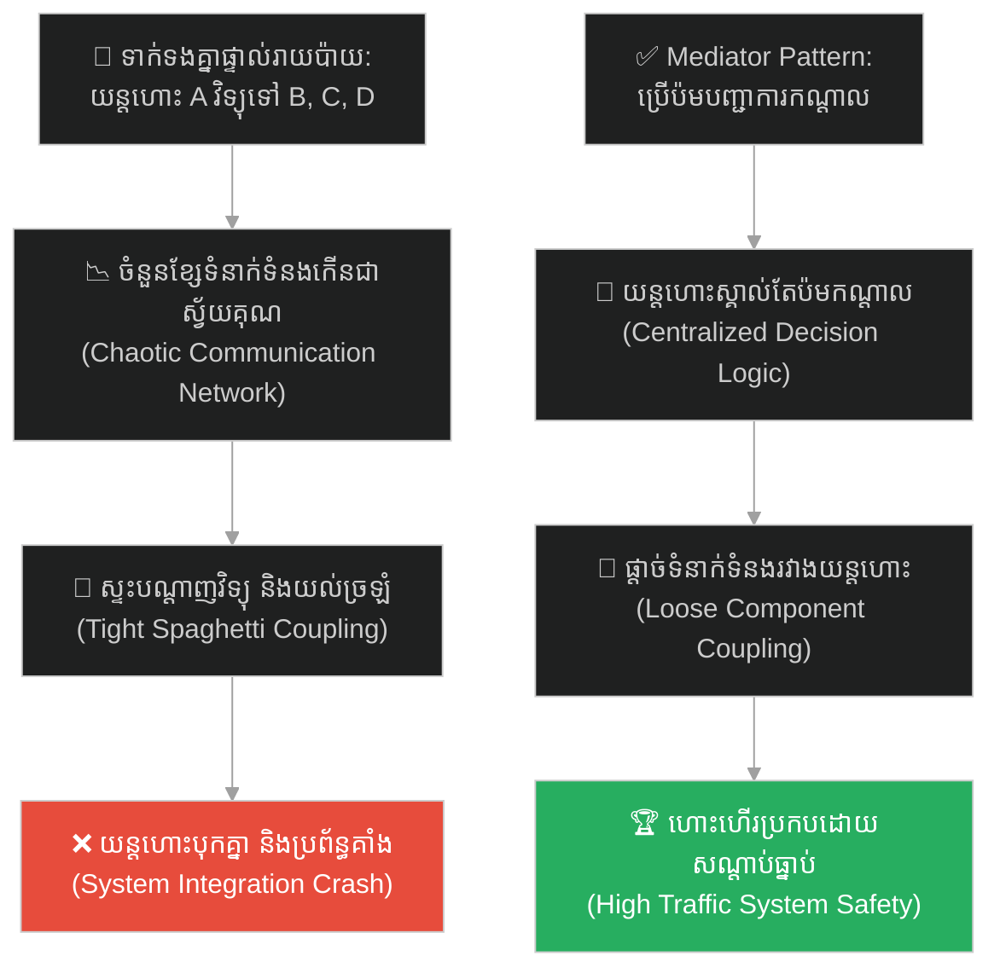
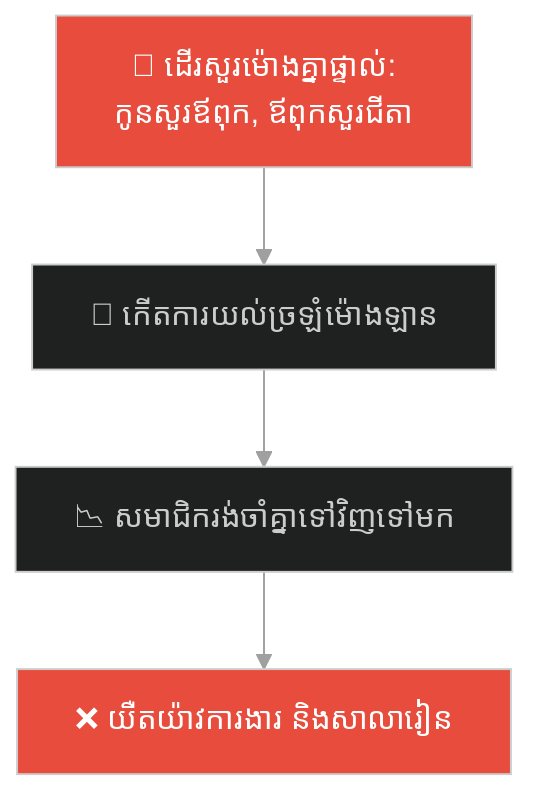
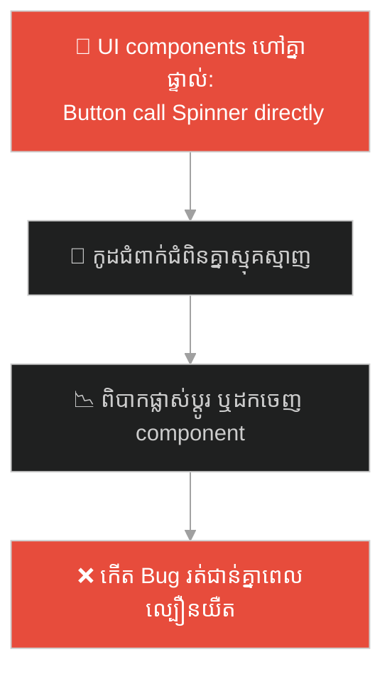
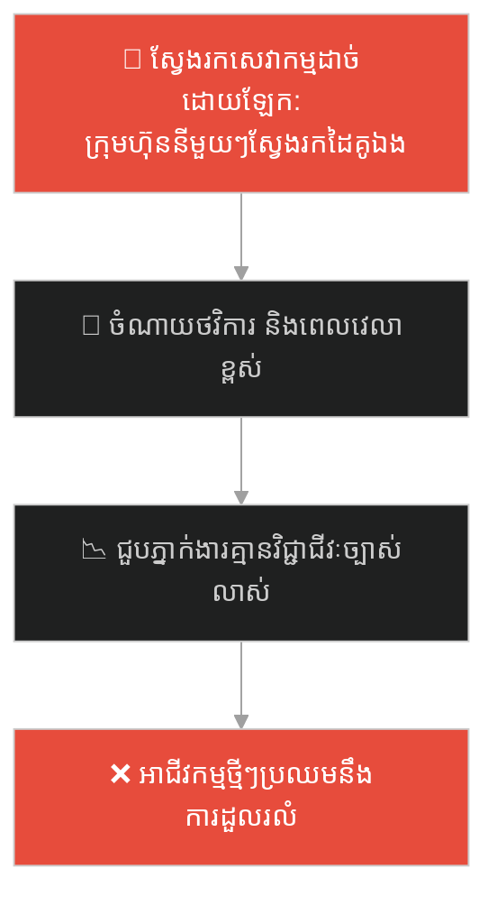
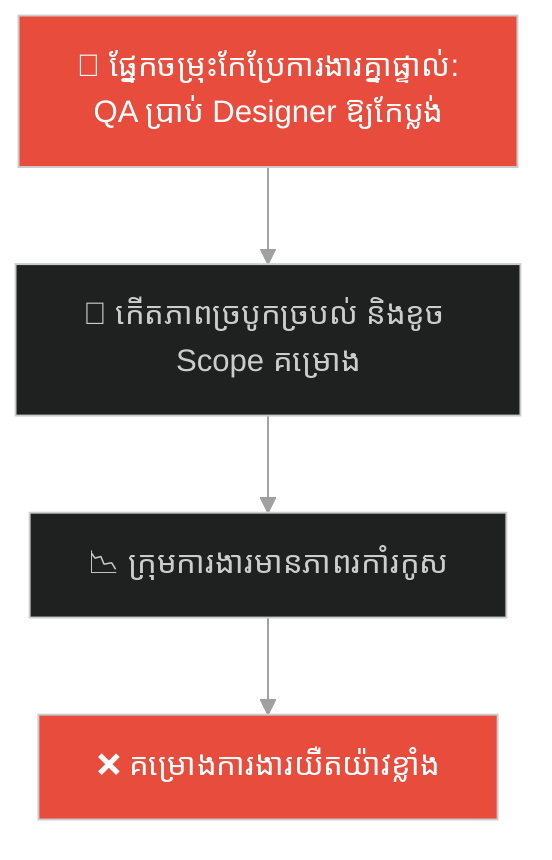
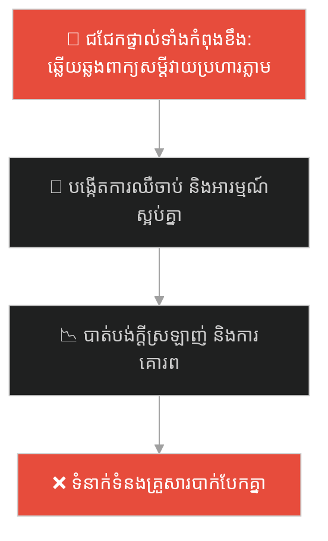
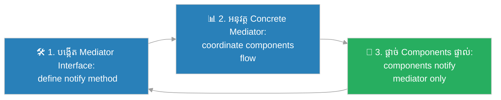

# Mediator Design Pattern (លំនាំរចនាអ្នកសម្របសម្រួលកណ្តាល)៖ អ្នកបញ្ជាចរាចរណ៍ផ្លូវអាកាស (Mediator Pattern & The Air Traffic Controller)

**Author:** ichamrong  
**Date:** 2026-05-27  
**Tags:** #design-patterns #mediator #architecture #software-engineering #parable  
**Category:** Concepts / Parables  
**Read Time:** ~15 min  

---

## 📌 មាតិកា (Table of Contents)
- [អន្ទាក់ផ្លូវចិត្ត (The Trap)](#0)
- [១. រឿងព្រេងប្រវត្តិសាស្ត្រ៖ ការប្រាស្រ័យទាក់ទងដ៏វឹកវរ និងយន្តហោះរាប់រយគ្រឿង (The Legend of the Chaotic Communication)](#1)
  - [ប៉មបញ្ជាការកណ្តាល និងការហោះហើរប្រកបដោយសណ្តាប់ធ្នាប់ (The Control Tower Solution)](#1-1)
- [២. បញ្ហា៖ បណ្តាញគូសភ្ជាប់សំបុកពីងពាង និងការកើនឡើងទំនាក់ទំនងយ៉ាងគំហុក (The Issue: Spiderweb Coupling and N-to-N Communication Complexity)](#2)
- [៣. ឧទាហរណ៍ជាក់ស្តែងក្នុងពិភពពិត (Real World Examples)](#3)
  - [ឧទាហរណ៍ទី ១ — កម្រិតស្រាល (គ្រួសារ)៖ មាតាសម្របសម្រួលរវាងសមាជិកគ្រួសារ និងសាលារៀន (Parent Coordinating Dad, Grandparents, and School)](#3-1)
  - [ឧទាហរណ៍ទី ២ — កម្រិតមធ្យម (បច្ចេកទេស)៖ ច្រកបញ្ជូនសារព្រឹត្តិការណ៍កណ្តាលក្នុងប្រព័ន្ធ UI (Event Bus coordinating UI components)](#3-2)
  - [ឧទាហរណ៍ទី ៣ — កម្រិតមធ្យម (ធុរកិច្ច)៖ ភ្នាក់ងារគាំទ្រគម្រោងសម្រាប់ក្រុមហ៊ុនរង (Startup Incubator managing multi-startup logistics)](#3-3)
  - [ឧទាហរណ៍ទី ៤ — កម្រិតមធ្យម (សង្គម/គ្រប់គ្រង)៖ អ្នកសម្របសម្រួលគម្រោងរវាងផ្នែកចម្រុះ (Project Coordinator managing Devs, QA, and Designers)](#3-4)
  - [ឧទាហរណ៍ទី ៥ — កម្រិតធ្ងន់ (ទំនាក់ទំនង)៖ ការប្រើប្រាស់ទិនានុប្បវត្តិរួមដើម្បីចៀសវាងជម្លោះពាក្យសម្តី (Using a Shared Journal to communicate instead of direct arguments)](#3-5)
- [៤. ដំណោះស្រាយទូទៅ៖ ការអនុវត្ត Mediator Pattern តាមរយៈ Centralized Event Routers (The General Solution: Mediator Pattern with Loose Component Coupling)](#4)
- [សេចក្តីសន្និដ្ឋាន (Conclusion)](#5)
- [ឯកសារយោង (References)](#6)
- [Related Posts](#7)

---

<a id="0"></a>
## អន្ទាក់ផ្លូវចិត្ត (The Trap)

តើអ្នកធ្លាប់ជួបបញ្ហាដែលសមាសភាគ ឬវត្ថុផ្សេងៗនៅក្នុងប្រព័ន្ធ ព្យាយាមទាក់ទង និងផ្លាស់ប្តូរទិន្នន័យគ្នាទៅវិញទៅមកដោយផ្ទាល់ រហូតបង្កើតជាបណ្តាញទំនាក់ទំនងខ្វាត់ខ្វែងដូចសំបុកពីងពាងដែរឬទេ?

នៅក្នុងការអភិវឌ្ឍប្រព័ន្ធ៖
* **យើងងាយនឹងធ្លាក់ក្នុងអន្ទាក់** នៃការបណ្តោយឱ្យវត្ថុនីមួយៗត្រូវស្គាល់ និងគ្រប់គ្រងការងាររបស់វត្ថុរាប់សិបផ្សេងទៀតដោយផ្ទាល់ (Tight N-to-N Coupling) ដែលធ្វើឱ្យការបន្ថែមសមាសភាគថ្មីក្លាយជាសុបិនអាក្រក់ និងងាយបង្កើត Bug ជះឥទ្ធិពលគ្នាពេញប្រព័ន្ធ។
* **យើងមើលរំលង** ការបង្កើតវត្ថុសម្របសម្រួលកណ្តាលតែមួយ (Mediator) ដើម្បីឱ្យធាតុទាំងអស់ទាក់ទងតែជាមួយវាកណ្តាល ដោយមិនបាច់ស្គាល់ ឬទាក់ទងគ្នាដោយផ្ទាល់ឡើយ។

ការព្យាយាមរៀបចំទំនាក់ទំនងខ្វាត់ខ្វែងរវាងសមាសភាគទាំងអស់ដោយផ្ទាល់ ហៅថា **អន្ទាក់គូសភ្ជាប់សំបុកពីងពាង (Spiderweb Coupling Trap)**។

ដើម្បីយល់ដឹងពីរបៀបបង្កើតចំណុចសម្របសម្រួលកណ្តាល និងកាត់បន្ថយភាពជំពាក់ជំពិន ផែនទីបង្ហាញផ្លូវមានដូចខាងក្រោម៖
1. **រឿងព្រេងប្រវត្តិសាស្ត្រ (The Historic Legend)** — រឿងរ៉ាវរបស់យន្តហោះរាប់រយគ្រឿងដែលព្យាយាមវិទ្យុទាក់ទងគ្នាដើម្បីចុះចត និងការបង្កើតប៉មបញ្ជាការ។
2. **បញ្ហា (The Issue)** — ការវិភាគភាពកើនឡើងទំនាក់ទំនងស្វ័យគុណ និងភាពជំពាក់ជំពិនគ្នាក្នុង OOP។
3. **ឧទាហរណ៍ជាក់ស្តែងក្នុងពិភពពិត (Real World Examples)** — ពិនិត្យមើលបញ្ហានេះក្នុងកម្រិតគ្រួសារ បច្ចេកវិទ្យា ធុរកិច្ច ការគ្រប់គ្រង និងទំនាក់ទំនង។
4. **ដំណោះស្រាយទូទៅ (The General Solution)** — ការអនុវត្ត Mediator Pattern ដើម្បីបង្កើតច្រកសម្របសម្រួលកណ្តាលដ៏បត់បែន។



---

<a id="1"></a>
## ១. រឿងព្រេងប្រវត្តិសាស្ត្រ៖ ការប្រាស្រ័យទាក់ទងដ៏វឹកវរ និងយន្តហោះរាប់រយគ្រឿង (The Legend of the Chaotic Communication)

នៅលើលំហអាកាសនៃអាកាសយានដ្ឋានដ៏មមាញឹកមួយ មានយន្តហោះចម្រុះខ្នាតចំនួន ១០០ គ្រឿង កំពុងហោះហើរព័ទ្ធជុំវិញដើម្បីរង់ចាំលំដាប់ចុះចត (Landing) និងត្រៀមហោះឡើង (Takeoff)។

កាលពីមុន អាកាសយានដ្ឋាននេះគ្មានអ្នកសម្របសម្រួលចរាចរណ៍ឡើយ។ ច្បាប់ធ្វើដំណើរគឺ៖ យន្តហោះនីមួយៗត្រូវទទួលខុសត្រូវលើសុវត្ថិភាពខ្លួនឯង ដោយប្រើប្រាស់វិទ្យុទាក់ទងគ្នាទៅវិញទៅមក។

នៅពេលយន្តហោះ A ចង់ចុះចត ពីឡុតត្រូវបើកវិទ្យុសួរទៅកាន់យន្តហោះ ៩៩ គ្រឿងទៀតថា៖ *"តើមានអ្នកណាកំពុងប្រើប្រាស់ផ្លូវរត់ (Runway) ដែរឬទេ? តើខ្ញុំអាចចុះចតបានទេ?"* យន្តហោះ B, C, D ក៏ត្រូវធ្វើដូចគ្នា។

លទ្ធផលគឺ៖
* បណ្តាញវិទ្យុទាក់ទងត្រូវបានកកស្ទះ និងពោរពេញដោយសំឡេងអ៊ូអរ រំខានគ្នាទៅវិញទៅមក។
* ពីឡុតត្រូវស្គាល់ និងតាមដានទីតាំងរបស់យន្តហោះ ៩៩ គ្រឿងផ្សេងទៀតគ្រប់វិនាទី (Tight Coupling)។
* ខ្សែទំនាក់ទំនងកើនឡើងយ៉ាងគំហុកដល់ទៅ ១០០ × ៩៩ = ៩,៩០០ ខ្សែ! ការយល់ច្រឡំ និងការស្ទះបណ្តាញបានធ្វើឱ្យយន្តហោះជាច្រើនដងស្ទើរតែបុកគ្នានៅកណ្តាលអាកាស។

---

<a id="1-1"></a>
### ប៉មបញ្ជាការកណ្តាល និងការហោះហើរប្រកបដោយសណ្តាប់ធ្នាប់ (The Control Tower Solution)

ដើម្បីបញ្ឈប់ចលាចលនេះ អាកាសយានដ្ឋានបានសាងសង់ **ប៉មបញ្ជាការចរាចរណ៍ផ្លូវអាកាស (Air Traffic Control Tower)** ដ៏ទំនើបមួយនៅកណ្តាល។

ពួកគេបានប្រកាសច្បាប់ថ្មីដាច់ខាត៖ **យន្តហោះទាំងអស់ ហាមនិយាយទាក់ទងគ្នាដោយផ្ទាល់ជាដាច់ខាត!**

ឥឡូវនេះ៖
* យន្តហោះនីមួយៗត្រូវស្គាល់ និងទាក់ទងតែជាមួយ **ប៉មបញ្ជាការ (The Mediator)** តែមួយគត់។
* នៅពេលយន្តហោះ A ចង់ចុះចត ពីឡុតគ្រាន់តែផ្ញើសារទៅកាន់ប៉មបញ្ជាការ។ ប៉មបញ្ជាការ ដែលមើលឃើញរូបភាពរួមរបស់យន្តហោះទាំង ១០០ គ្រឿង នឹងគណនាលំដាប់លំដោយ រួចបញ្ជាទៅយន្តហោះ A ថា៖ *"យន្តហោះ A អនុញ្ញាតឱ្យចុះចត! យន្តហោះ B ត្រូវរង់ចាំនៅកម្ពស់ ៣,០០០ ហ្វីតសិន!"*

យន្តហោះនីមួយៗលែងខ្វល់ខ្វាយពីវត្តមានរបស់យន្តហោះ ៩៩ គ្រឿងទៀតហើយ។ ពួកគេគ្រាន់តែស្តាប់បង្គាប់ប៉មកណ្តាលជាការស្រេច។ ប្រសិនបើមានយន្តហោះទី ១០១ ចូលមកដល់ វាក៏គ្រាន់តែភ្ជាប់វិទ្យុទៅកាន់ប៉មកណ្តាល ដោយមិនបាច់ទៅរៀបចំទំនាក់ទំនងជាមួយយន្តហោះចាស់ៗទាំង ១០០ គ្រឿងឡើយ។

---

<a id="2"></a>
## ២. បញ្ហា៖ បណ្តាញគូសភ្ជាប់សំបុកពីងពាង និងការកើនឡើងទំនាក់ទំនងយ៉ាងគំហុក (The Issue: Spiderweb Coupling and N-to-N Communication Complexity)

នៅក្នុងការរចនាកូដកម្មវិធី បញ្ហានេះកើតឡើងជាញឹកញាប់នៅពេល Components ផ្សេងៗក្នុង UI (ប៊ូតុង, TextField, Checkbox, Dropdown) ព្យាយាមកែប្រែស្ថានភាពគ្នាទៅវិញទៅមកដោយផ្ទាល់៖

```java
// កូដដែលគ្មាន Mediator គឺ Component នីមួយៗត្រូវស្គាល់គ្នាទៅវិញទៅមក
class Button {
    TextField textField;
    ListBox listBox;
    
    void onClick() {
        textField.clear();
        listBox.refresh();
    }
}
```

* **ភាពជំពាក់ជំពិនគ្នាស្មុគស្មាញ (High Maintenance Cost)៖** ប្រសិនបើយើងបន្ថែម Component ថ្មីមួយទៀត យើងត្រូវចូលទៅកែប្រែកូដរបស់ Components ចាស់ៗទាំងអស់ ដើម្បីឱ្យពួកវាស្គាល់របស់ថ្មីនោះ។
* **ភាពលំបាកក្នុងការយកទៅប្រើប្រាស់ឡើងវិញ (Low Reusability)៖** យើងមិនអាចដកយក Button ឬ ListBox ទៅប្រើប្រាស់ក្នុង Page ផ្សេងទៀតបានឡើយ ព្រោះវាត្រូវបានចងភ្ជាប់ទៅនឹងសមាសភាគរាប់សិបនៅក្នុង Page ចាស់។

**Mediator Design Pattern** ជួយដោះស្រាយបញ្ហានេះដោយណែនាំឱ្យបង្កើត Class កណ្តាលមួយ (Mediator class) ដើម្បីទទួលរាល់ព័ត៌មានពីគ្រប់ Components រួចចាត់ចែង និងបញ្ជាការងារបន្តយ៉ាងមានសណ្តាប់ធ្នាប់ លាក់បាំងរាល់ភាពស្មុគស្មាញនៃការប្រាស្រ័យទាក់ទងទាំងអស់។

---

<a id="3"></a>
## ៣. ឧទាហរណ៍ជាក់ស្តែងក្នុងពិភពពិត

---

<a id="3-1"></a>
### ឧទាហរណ៍ទី ១ — កម្រិតស្រាល (គ្រួសារ)៖ មាតាសម្របសម្រួលរវាងសមាជិកគ្រួសារ និងសាលារៀន (Parent Coordinating Dad, Grandparents, and School)

នៅក្នុងគ្រួសារមួយ កូនៗត្រូវការទៅរៀន ឪពុកត្រូវធ្វើការ ជីដូនជីតាត្រូវទៅវត្ត។ ជំនួសឱ្យការឱ្យសមាជិកម្នាក់ៗដើរសួរនាំ សម្របសម្រួលម៉ោងឡាន និងកក់ម៉ោងបាយគ្នាទៅវិញទៅមកខ្វាត់ខ្វែង ម្តាយដើរតួជា "អ្នកសម្របសម្រួលកណ្តាល (Mediator)" ប្រមូលរាល់ព័ត៌មាន និងចាត់ចែងម៉ោងធ្វើដំណើរឱ្យគ្រប់គ្នាដោយជោគជ័យ។



ម្តាយបានប្រើគោលការណ៍ Mediator style ដើម្បីរក្សាសណ្តាប់ធ្នាប់គ្រួសារ។

---

<a id="3-2"></a>
### ឧទាហរណ៍ទី ២ — កម្រិតមធ្យម (បច្ចេកទេស)៖ ច្រកបញ្ជូនសារព្រឹត្តិការណ៍កណ្តាលក្នុងប្រព័ន្ធ UI (Event Bus coordinating UI components)

នៅក្នុងការសរសេរកម្មវិធីវិបសាយ ជំនួសឱ្យការឱ្យប៊ូតុងចុះឈ្មោះ (Register Button) ទៅហៅ Method របស់ Spinner ផ្ទាល់ ហៅ API Client ផ្ទាល់ និងហៅ Notification Alert ផ្ទាល់ វិស្វករបានបង្កើត `EventBus` ឬ `FormController` (Mediator) មួយ។ ធាតុនីមួយៗគ្រាន់តែផ្ញើព្រឹត្តិការណ៍ (Event) ទៅកាន់ Mediator រួចវាជាអ្នកចាត់ចែងការងារបន្ត។



---

<a id="3-3"></a>
### ឧទាហរណ៍ទី ៣ — កម្រិតមធ្យម (ធុរកិច្ច)៖ ភ្នាក់ងារគាំទ្រគម្រោងសម្រាប់ក្រុមហ៊ុនរង (Startup Incubator managing multi-startup logistics)

នៅក្នុងមជ្ឈមណ្ឌលគាំទ្រអាជីវកម្មថ្មីៗ (Incubator) មានក្រុមហ៊ុនទើបបង្កើតថ្មីចំនួន ៥០ កន្លែង។ ជំនួសឱ្យការឱ្យក្រុមហ៊ុននីមួយៗដើរស្វែងរកអ្នកច្បាប់ ស្វែងរកគណនេយ្យករ និងជួលការិយាល័យដោយផ្ទាល់ខ្វាត់ខ្វែង មជ្ឈមណ្ឌលដើរតួជា Mediator ដោយផ្តល់សេវាកម្មច្បាប់ និងគណនេយ្យរួមកណ្តាល ជួយសម្រួលរាល់សំណើរបស់ក្រុមហ៊ុនទាំងអស់យ៉ាងលឿន។



---

<a id="3-4"></a>
### ឧទាហរណ៍ទី ៤ — កម្រិតមធ្យម (សង្គម/គ្រប់គ្រង)៖ អ្នកសម្របសម្រួលគម្រោងរវាងផ្នែកចម្រុះ (Project Coordinator managing Devs, QA, and Designers)

នៅក្នុងការគ្រប់គ្រងគម្រោងអភិវឌ្ឍន៍សូហ្វវែរ ជំនួសឱ្យការឱ្យវិស្វករកម្មវិធី (Developers) វិស្វករតេស្តកូដ (QA) និងអ្នករចនាប្លង់ (Designers) ជជែកពិភាក្សាច្របូកច្របល់ និងផ្លាស់ប្តូរ Scope ការងារគ្នាទៅវិញទៅមកដោយគ្មានសណ្តាប់ធ្នាប់ ក្រុមហ៊ុនបានតែងតាំងអ្នកសម្របសម្រួលគម្រោង (Project Coordinator - Mediator) ឱ្យធ្វើជាចំណុចកណ្តាលសម្រេចចិត្ត។



---

<a id="3-5"></a>
### ឧទាហរណ៍ទី ៥ — កម្រិតធ្ងន់ (ទំនាក់ទំនង)៖ ការប្រើប្រាស់ទិនានុប្បវត្តិរួមដើម្បីចៀសវាងជម្លោះពាក្យសម្តី (Using a Shared Journal to communicate instead of direct arguments)

នៅក្នុងទំនាក់ទំនងប្តីប្រពន្ធ ជួនកាលការនិយាយជជែកផ្ទាល់គ្នានៅពេលកំពុងខឹងខ្លាំង ងាយនឹងបង្កើតឱ្យមានការប្រើប្រាស់ពាក្យសម្តីធ្ងន់ៗ និងជម្លោះវាយប្រហារគ្នា។ ពួកគេបានសម្រេចចិត្តប្រើប្រាស់ "ទិនានុប្បវត្តិរួម (Shared Journal - Mediator)" មួយទុកនៅលើតុ។ ម្នាក់ៗសរសេររាល់អារម្មណ៍ និងការរំពឹងទុករបស់ខ្លួនចូលក្នុងនោះ រួចឱ្យដៃគូម្នាក់ទៀតមកអាន និងឆ្លើយតបវិញយ៉ាងទន់ភ្លន់ និងយោគយល់។



---

<a id="4"></a>
## ៤. ដំណោះស្រាយទូទៅ៖ ការអនុវត្ត Mediator Pattern តាមរយៈ Centralized Event Routers (The General Solution: Mediator Pattern with Loose Component Coupling)

ដើម្បីផ្តាច់ទំនាក់ទំនង និងសម្រួលការប្រាស្រ័យទាក់ទងគ្នារវាងសមាសភាគ យើងត្រូវអនុវត្តលំនាំរចនា **Mediator Pattern**៖



ជំហាននៃការអនុវត្ត៖
1. **បង្កើត Mediator Interface៖** ប្រកាស Method សកលមួយ (ដូចជា `notify(sender, event)`) សម្រាប់ឱ្យសមាសភាគទាំងអស់ផ្ញើសារប្រាប់នៅពេលមានការប្រែប្រួល។
2. **អនុវត្ត Concrete Mediator Class៖** បង្កើត Class កណ្តាលមួយដែលរក្សាទុក References ទៅកាន់ Components ទាំងអស់។ នៅក្នុង Method `notify()` ត្រូវសរសេរកូដសម្រេចចិត្តថាតើត្រូវហៅ Method របស់ Component ណាផ្សេងទៀតបន្ត ផ្អែកលើព្រឹត្តិការណ៍ដែលទទួលបាន។
3. **កែសម្រួល Components (Colleagues)៖** ធ្វើឱ្យ Components ទាំងអស់លែងស្គាល់គ្នាទៅវិញទៅមក។ ពួកវាគ្រាន់តែរក្សាទុក Reference ទៅកាន់ Mediator Interface រួចផ្ញើសារប្រាប់វារាល់ពេលដែលខ្លួនបំពេញភារកិច្ចរួចរាល់។

---

## 🐇 ធ្លាក់ចូលក្នុងរន្ធទន្សាយ (Enter the Rabbit Hole)

ដើម្បីស្វែងយល់ពីរបៀបដែលប្រព័ន្ធរក្សាទុកព័ត៌មាន អាចចាប់យក និងស្តារស្ថានភាពរបស់ Object ឡើងវិញបានយ៉ាងលឿន (ដូចជាការចងចាំចំណុច Save Point ក្នុងហ្គេម) ដោយមិនបាច់បំពានលើគោលការណ៍លាក់បាំងទិន្នន័យឯកជន (Encapsulation Principle) តាមរយៈការប្រើប្រាស់សញ្ញាសម្ងាត់ (Memento Pattern) សូមបន្តដំណើរទៅកាន់៖

* 🚀 **[ចាប់ផ្តើមដំណើររុករក (Start the Journey) ➔ Memento Pattern and State Restoration](./91-the-checkpoint-crystal.md)**

---

<a id="5"></a>
## សេចក្តីសន្និដ្ឋាន (Conclusion)

> **«កុំបណ្តោយឱ្យយន្តហោះទាំងអស់ត្រូវវិទ្យុទាក់ទងគ្នាដោយផ្ទាល់ដើម្បីសុំចុះចត។ ចូរផ្តល់ជូនប៉មបញ្ជាការចរាចរណ៍កណ្តាលដ៏ឆ្លាតវៃម្នាក់ ដើម្បីរក្សាសុវត្ថិភាព និងភាពរលូននៃការហោះហើរ។»**

ចូរធ្វើខ្លួនជាវិស្វករកម្មវិធីដែលយល់ដឹងពីសិល្បៈនៃការកាត់បន្ថយភាពជំពាក់ជំពិនគ្នារវាងសមាសភាគ (Loose Coupling)។ ការអនុវត្ត Mediator Design Pattern មិនត្រឹមតែជួយឱ្យកូដរបស់អ្នកមានភាពស្អាត និងងាយស្រួលពង្រីកប៉ុណ្ណោះទេ ប៉ុន្តែវាក៏ជួយឱ្យសមាសភាគនីមួយៗអាចយកទៅប្រើប្រាស់ឡើងវិញបានយ៉ាងងាយស្រួលនៅគ្រប់ទីកន្លែង។

---

<a id="6"></a>
## ឯកសារយោង (References)

* **Erich Gamma, Richard Helm, Ralph Johnson, John Vlissides** — *Design Patterns: Elements of Reusable Object-Oriented Software* (1994). Mediator Design Pattern Chapter.
* **Robert C. Martin** — *Clean Architecture: A Craftsman's Guide to Software Structure and Design* (2017).
* **Steve McConnell** — *Code Complete: A Practical Handbook of Software Construction* (2004).

---

<a id="7"></a>
## Related Posts

* **[90 Mediator Pattern: Loose Coupling via Centralized Communication](../articles/90-mediator-pattern.md)** — អត្ថបទវិទ្យាសាស្ត្រលម្អិត និងកូដគំរូ Java/C# សម្រាប់ការរចនា Event Controller។
* **[89 The Three Transport Tickets](./89-the-three-transport-tickets.md)** — ការអនុវត្តយុទ្ធសាស្ត្រគណនាផ្សេងៗគ្នា និងការផ្លាស់ប្តូរយ៉ាងបត់បែនពេលដំណើរការ។
* **[64 The Swiss Army Knife](./64-the-swiss-army-knife.md)** — ការរក្សាភាពសាមញ្ញ និងការចៀសវាងភាពចង្អៀតណែននៃមុខងារប្រព័ន្ធ។

---

## Related

- [💡 Concepts README](../README.md)
- [📚 Main Repository README](../../../README.md)
- [Developer Habits](../../developer-habits/README.md)
- [Mental Health & Well-being](../../mental-health/README.md)
- [Management & SDLC](../../management/README.md)
