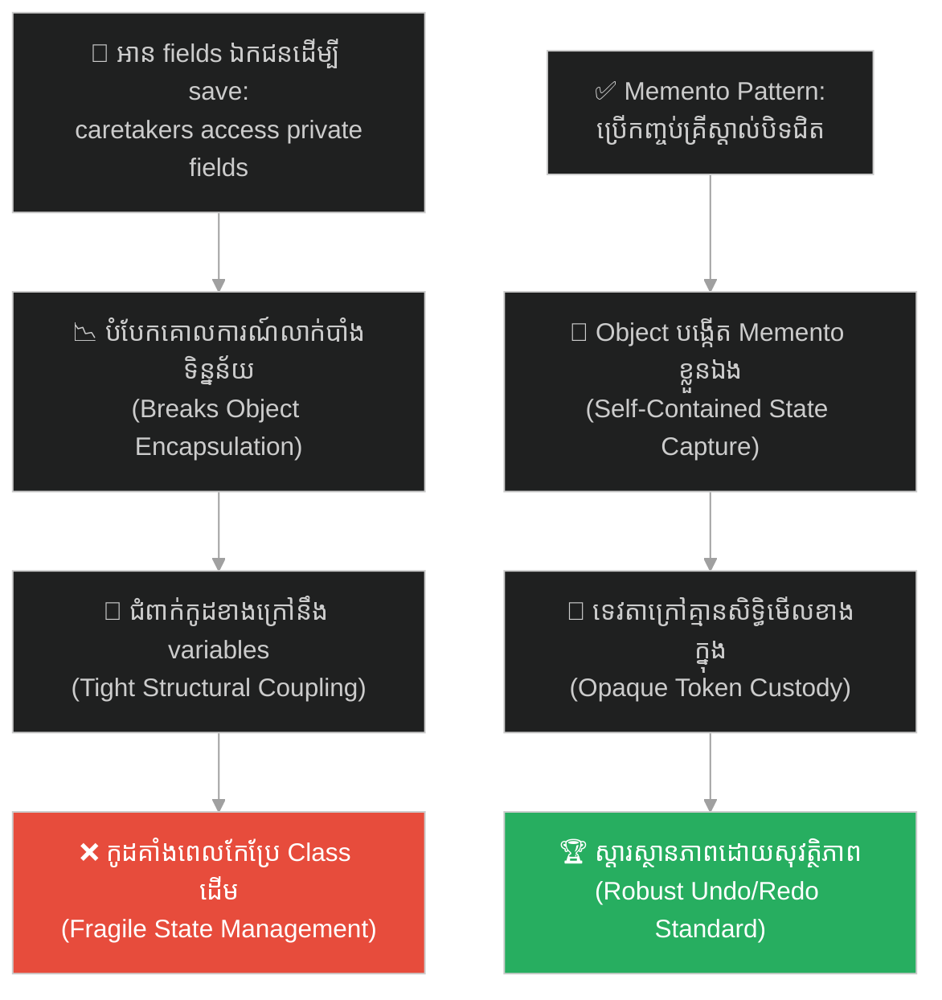
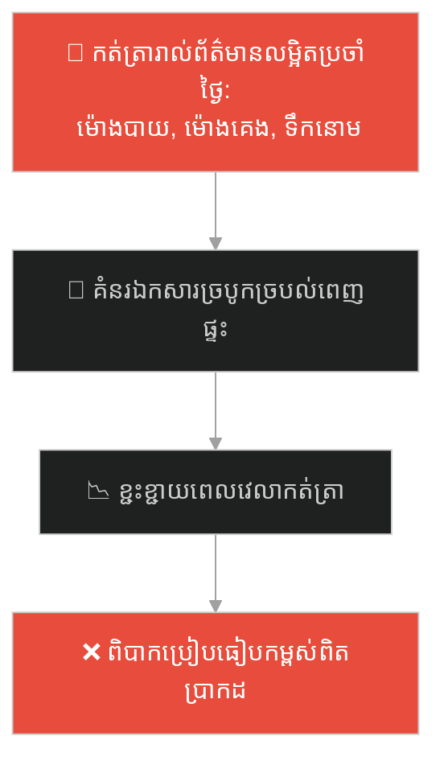
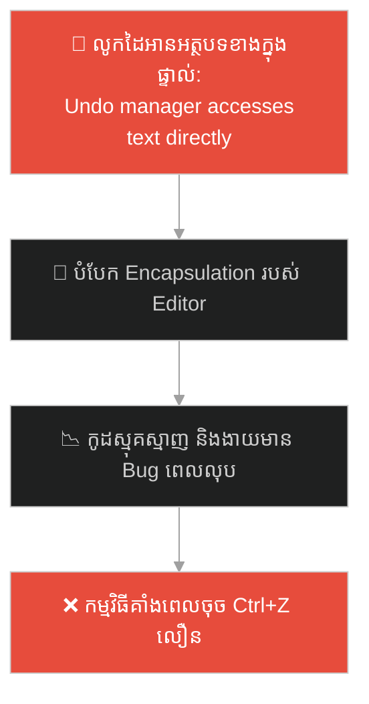
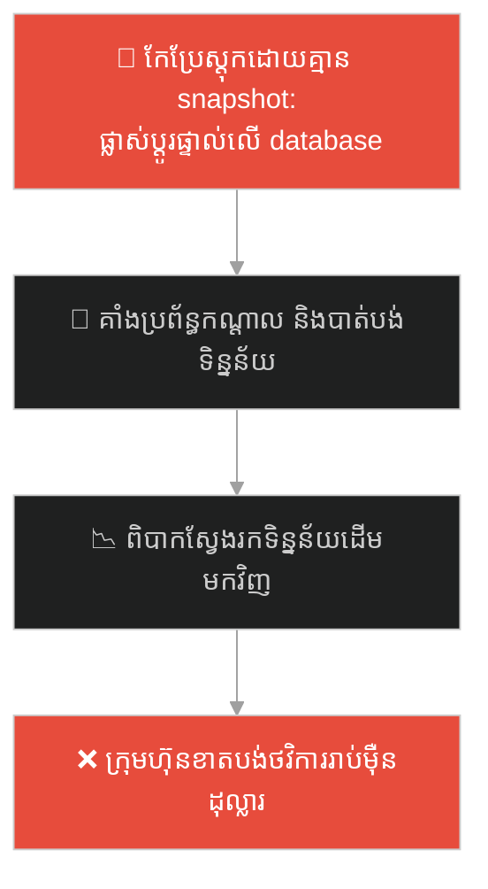
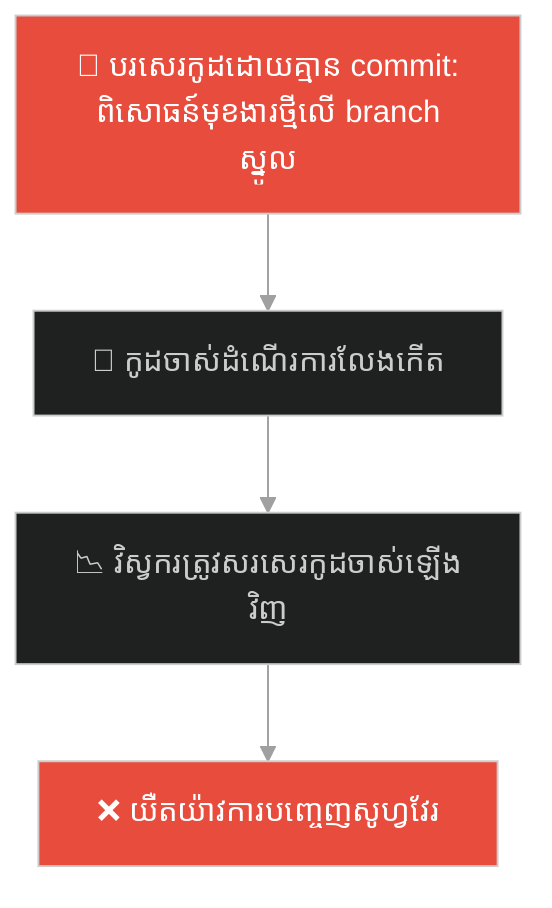
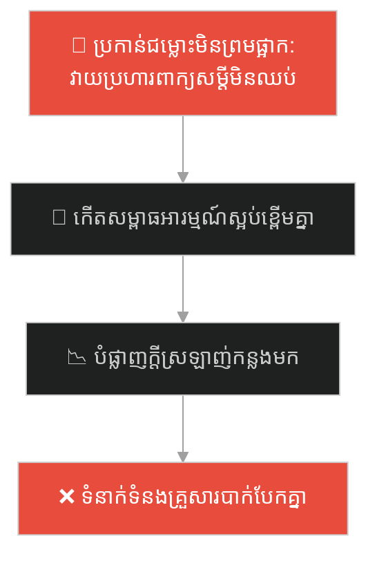
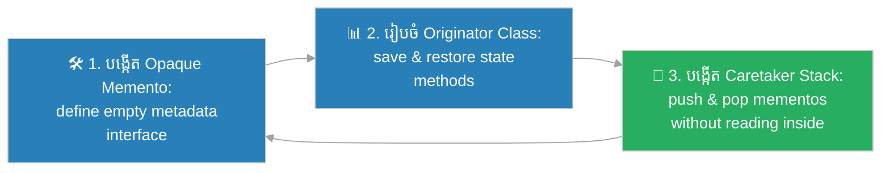

# Memento Design Pattern (លំនាំរចនារក្សាទុកស្ថានភាពអតីតកាល)៖ គ្រីស្តាល់រក្សាទុកពេលវេលា (Memento Pattern & The Checkpoint Crystal)

**Author:** ichamrong  
**Date:** 2026-05-27  
**Tags:** #design-patterns #memento #architecture #software-engineering #parable  
**Category:** Concepts / Parables  
**Read Time:** ~15 min  

---

## 📌 មាតិកា (Table of Contents)
- [អន្ទាក់ផ្លូវចិត្ត (The Trap)](#0)
- [១. រឿងព្រេងប្រវត្តិសាស្ត្រ៖ គ្រីស្តាល់រក្សាទុកពេលវេលា និងការផ្សងព្រេងប្រថុយប្រថាន (The Legend of the Checkpoint Crystal)](#1)
  - [ទេវតាថែរក្សា និងការត្រលប់មកសភាពដើមភ្លាមៗ (The Caretaker and Memento Solution)](#1-1)
- [២. បញ្ហា៖ ការលេចធ្លាយព័ត៌មានឯកជន និងការបំផ្លាញការលាក់បាំងទិន្នន័យ (The Issue: Encapsulation Violation and Internal State Exposure)](#2)
- [៣. ឧទាហរណ៍ជាក់ស្តែងក្នុងពិភពពិត (Real World Examples)](#3)
  - [ឧទាហរណ៍ទី ១ — កម្រិតស្រាល (គ្រួសារ)៖ ការកត់ត្រាកំណត់ត្រាសម្គាល់កម្ពស់កូនៗនៅលើជញ្ជាំង (Recording Children's Height Milestones on a Wall)](#3-1)
  - [ឧទាហរណ៍ទី ២ — កម្រិតមធ្យម (បច្ចេកទេស)៖ ប្រព័ន្ធទាញថយក្រោយ Undo/Redo នៅក្នុងកម្មវិធីវាយអត្ថបទ (Text Editor Undo/Redo Mechanism)](#3-2)
  - [ឧទាហរណ៍ទី ៣ — កម្រិតមធ្យម (ធុរកិច្ច)៖ ការថតរូបភាពស្តុកទំនិញមុនពេលកែប្រែប្រព័ន្ធ (Automatic Inventory Snapshot Before Batch Updates)](#3-3)
  - [ឧទាហរណ៍ទី ៤ — កម្រិតមធ្យម (សង្គម/គ្រប់គ្រង)៖ ការបង្កើតកូដបម្រុង Git Commit មុនពេលប្តូរកូដពិសោធន៍ (Creating a Git Commit Before Experimental Branches)](#3-4)
  - [ឧទាហរណ៍ទី ៥ — កម្រិតធ្ងន់ (ទំនាក់ទំនង)៖ ការយល់ព្រម "ផ្អាក" និងការត្រលប់ទៅរកសន្យាដើម (Agreeing to a "Reset" or "Time-out" in Relationships)](#3-5)
- [៤. ដំណោះស្រាយទូទៅ៖ ការអនុវត្ត Memento Pattern តាមរយៈ Opaque Tokens (The General Solution: Memento Pattern with Encapsulated State Tokens)](#4)
- [សេចក្តីសន្និដ្ឋាន (Conclusion)](#5)
- [ឯកសារយោង (References)](#6)
- [Related Posts](#7)

---

<a id="0"></a>
## អន្ទាក់ផ្លូវចិត្ត (The Trap)

តើអ្នកធ្លាប់ជួបបញ្ហាដែលប្រព័ន្ធរបស់អ្នកត្រូវការថតចម្លង និងរក្សាទុកព័ត៌មាន ឬស្ថានភាព (State) របស់ Object ធំៗដើម្បីទាញថយក្រោយ (Undo) ប៉ុន្តែត្រូវបង្ខំចិត្តបើកបង្ហាញព័ត៌មានលម្អិតឯកជន (Encapsulated fields) របស់វាទៅឱ្យប្រព័ន្ធខាងក្រៅដឹងដែរឬទេ?

នៅក្នុងការអភិវឌ្ឍកម្មវិធី៖
* **យើងងាយនឹងធ្លាក់ក្នុងអន្ទាក់** នៃការអនុញ្ញាតឱ្យប្រព័ន្ធខាងក្រៅ (Caretaker) ចូលទៅអាន និងកត់ត្រាវាលទិន្នន័យសម្ងាត់របស់ Object ដោយផ្ទាល់ ដែលបំផ្លាញគោលការណ៍លាក់បាំងទិន្នន័យ (Encapsulation) ធ្វើឱ្យកូដទាំងមូលងាយរងគ្រោះ និងមានភាពជំពាក់ជំពិនគ្នាខ្ពស់។
* **យើងមើលរំលង** យន្តការរចនាដែលអនុញ្ញាតឱ្យ Object ខ្លួនឯងជាអ្នកបង្កើត និងស្តារស្ថានភាពរបស់វាឡើងវិញ តាមរយៈការប្រគល់ "សញ្ញាសម្ងាត់បិទជិត (Memento Token)" ទៅឱ្យអ្នកក្រៅរក្សាទុកដោយគ្មានសិទ្ធិមើល ឬកែប្រែឡើយ។

ការព្យាយាមទាញយកទិន្នន័យឯកជនរបស់ Object មកកត់ត្រានៅក្រៅ Class ហៅថា **អន្ទាក់បំផ្លាញការលាក់បាំងទិន្នន័យ (Encapsulation Violation Trap)**។

ដើម្បីយល់ដឹងពីរបៀបថតចម្លង និងស្តារស្ថានភាព Object ប្រកបដោយសុវត្ថិភាពខ្ពស់ នេះជាផែនទីបង្ហាញផ្លូវ៖
1. **រឿងព្រេងប្រវត្តិសាស្ត្រ (The Historic Legend)** — រឿងរ៉ាវរបស់វីរបុរសដែលប្រយុទ្ធជាមួយបិសាច និងការរក្សាទុកពេលវេលាតាមរយៈគ្រីស្តាល់វេទមន្ត។
2. **បញ្ហា (The Issue)** — ការវិភាគភាពលេចធ្លាយព័ត៌មានឯកជន និងការបំផ្លាញ Encapsulation ក្នុង OOP។
3. **ឧទាហរណ៍ជាក់ស្តែងក្នុងពិភពពិត (Real World Examples)** — ពិនិត្យមើលបញ្ហានេះក្នុងកម្រិតគ្រួសារ បច្ចេកវិទ្យា ធុរកិច្ច ការគ្រប់គ្រង និងទំនាក់ទំនង។
4. **ដំណោះស្រាយទូទៅ (The General Solution)** — ការអនុវត្ត Memento Pattern ដើម្បីបង្កើតសញ្ញាសម្ងាត់បិទជិតដែលមានសុវត្ថិភាព។



---

<a id="1"></a>
## ១. រឿងព្រេងប្រវត្តិសាស្ត្រ៖ គ្រីស្តាល់រក្សាទុកពេលវេលា និងការផ្សងព្រេងប្រថុយប្រថាន (The Legend of the Checkpoint Crystal)

កាលពីព្រេងនាយ នៅក្នុងពិភពវេទមន្តដ៏អាថ៌កំបាំង មានវីរបុរសម្នាក់ (Originator) ត្រូវចូលទៅក្នុងរូងភ្នំបិសាចដ៏ខ្មៅងងឹត ដើម្បីកម្ចាត់ស្តេចបិសាច។

ប្រសិនបើគាត់ដើរចូលទៅប្រយុទ្ធភ្លាមៗ ហើយភ្លាត់ស្នៀតត្រូវបិសាចវាយសម្រុកទាល់តែស្លាប់ (តំណាងឱ្យការគាំងកម្មវិធី ឬ Error) នោះការខិតខំប្រឹងប្រែង និងជីវិតផ្សងព្រេងរបស់គាត់កន្លងមកនឹងត្រូវបាត់បង់ទាំងស្រុង។ គាត់នឹងត្រូវស្លាប់ជាស្ថាពរ ហើយគ្មានជម្រើស "Undo" ឡើយ។

គាត់មិនអាចដើររាយការណ៍គ្រប់ស្ថានភាពកម្លាំង ឈាម និងក្បាច់គុនរបស់គាត់ទៅឱ្យមនុស្សគ្រប់គ្នាក្នុងភូមិដឹងបានឡើយ ព្រោះកាលណាចោរ ឬសត្រូវដឹងពីចំណុចខ្សោយរបស់គាត់ ពួកគេនឹងរកវិធីកម្ចាត់គាត់ជាមិនខាន (ត្រូវការពារ Encapsulation របស់រាងកាយ)។

---

<a id="1-1"></a>
### ទេវតាថែរក្សា និងការត្រលប់មកសភាពដើមភ្លាមៗ (The Caretaker and Memento Solution)

ដើម្បីដោះស្រាយការប្រឈមមុខនេះ វីរបុរសបានប្រើប្រាស់ **គ្រីស្តាល់រក្សាទុកពេលវេលា (The Checkpoint Crystal / Memento)** មួយគ្រាប់។

មុនពេលបោះជំហានចូលទៅជួបបិសាច វីរបុរសបានសូត្រមន្តដើម្បីចាប់យក (Capture) ស្ថានភាពរាងកាយបច្ចុប្បន្នរបស់គាត់ (ឈាម ១០០%, កម្លាំងម៉ាណា ៥០, អាវុធពេញលេញ) រួចចាក់បញ្ចូល និងបិទជិតយ៉ាងណែននៅក្នុងគ្រីស្តាល់នោះ។

បន្ទាប់មក គាត់បានប្រគល់គ្រីស្តាល់បិទជិតនោះទៅឱ្យ **ទេវតាថែរក្សា (The Caretaker)** ម្នាក់ដែលហោះហើរការពារគាត់ពីខាងលើ។ 
* ទេវតាថែរក្សាគ្មានសិទ្ធិមើល ឬកែប្រែព័ត៌មានខាងក្នុងគ្រីស្តាល់ឡើយ (Opaque Object)។
* ទេវតាគ្រាន់តែរក្សាវាយ៉ាងមានសុវត្ថិភាពនៅក្នុងកាបូបទិព្វ។

វីរបុរសបោះជំហានទៅប្រយុទ្ធ! គាត់រងការវាយប្រហារយ៉ាងខ្លាំងរហូតដល់ឈាមសល់ត្រឹម ១០% និងហៀបនឹងបាត់បង់ជីវិត។ ភ្លាមៗនោះ គាត់បានស្រែកហៅទេវតាថា៖ *"សូមហុចគ្រីស្តាល់របស់ខ្ញុំមកវិញ!"*

ពេលទទួលបានគ្រីស្តាល់ភ្លាម វីរបុរសបានបើកវាចេញ។ មួយរំពេចនោះ រាងកាយរបស់គាត់ត្រូវបានស្តារ (Restore) ត្រលប់ទៅកាន់ស្ថានភាពឈាម ១០០% និងទីតាំងឈរមុនពេលប្រយុទ្ធវិញភ្លាមៗដោយជោគជ័យ (State Restoration)។ គាត់អាចបន្តប្រយុទ្ធ និងកម្ចាត់បិសាចបានយ៉ាងងាយស្រួល។

---

<a id="2"></a>
## ២. បញ្ហា៖ ការលេចធ្លាយព័ត៌មានឯកជន និងការបំផ្លាញការលាក់បាំងទិន្នន័យ (The Issue: Encapsulation Violation and Internal State Exposure)

នៅក្នុងវិស្វកម្មសូហ្វវែរ បញ្ហានេះកើតឡើងនៅពេលយើងសរសេរមុខងារ Undo/Redo នៅក្នុងកម្មវិធីវាយអត្ថបទ ឬហ្គេម៖

```java
// កូដដែលគ្មាន Memento គឺ Client ខាងក្រៅត្រូវដឹងពី variables ទាំងអស់
EditorState state = new EditorState();
state.text = editor.getText();
state.cursorPosition = editor.getCursor();
// ប្រសិនបើ Editor កែប្រែ variable ខាងក្នុង នោះកូដរក្សាទុកនឹង Error
```

* **ការលេចធ្លាយព័ត៌មានលម្អិត (Loss of Encapsulation)៖** ប្រព័ន្ធខាងក្រៅត្រូវដឹងពីគ្រប់ Variable ឯកជនរបស់ Object ស្នូល ដើម្បីអាចរក្សាទុកបាន ដែលផ្ទុយពីគោលការណ៍ SOLID។
* **ភាពជំពាក់ជំពិនគ្នាយ៉ាងខ្លាំង (Tight Coupling)៖** រាល់ការផ្លាស់ប្តូរ Variables ខាងក្នុងរបស់ Object ធំ នឹងតម្រូវឱ្យកែកូដរក្សាទុក (Caretaker) នៅខាងក្រៅទាំងអស់។

**Memento Design Pattern** ជួយដោះស្រាយបញ្ហានេះដោយឱ្យ Object ស្នូល (Originator) ជាអ្នកបង្កើត និងអានទិន្នន័យ Memento របស់ខ្លួនដោយផ្ទាល់។ Memento Token ត្រូវបានកំណត់ជា Interface បិទជិត ដែលអ្នកដទៃអាចកាន់បាន តែមិនអាចមើល ឬកែប្រែវាលខាងក្នុងបានឡើយ។

---

<a id="3"></a>
## ៣. ឧទាហរណ៍ជាក់ស្តែងក្នុងពិភពពិត

---

<a id="3-1"></a>
### ឧទាហរណ៍ទី ១ — កម្រិតស្រាល (គ្រួសារ)៖ ការកត់ត្រាកម្ពស់កូនៗនៅលើជញ្ជាំង (Recording Children's Height Milestones on a Wall)

នៅក្នុងគ្រួសារមួយ ឪពុកម្តាយកត់ត្រាការលូតលាស់កម្ពស់របស់កូនៗដោយគូសបន្ទាត់សម្គាល់នៅលើគែមជញ្ជាំងផ្ទះបាយរាល់ឆ្នាំ។ ជំនួសឱ្យការកត់ត្រារាល់ព័ត៌មានលម្អិតស្មុគស្មាញ (របបអាហារប្រចាំថ្ងៃ ម៉ោងគេង ទម្ងន់ជាក់ស្តែង) ឪពុកម្តាយរក្សាទុកតែ "សញ្ញាសម្គាល់កម្ពស់សាមញ្ញ" ដើម្បីដឹងពីការលូតលាស់ និងស្តារការចងចាំឡើងវិញយ៉ាងរហ័ស។



ឪពុកម្តាយបានប្រើគោលការណ៍ Memento style ដើម្បីចងចាំចំណុចលូតលាស់សំខាន់ៗរបស់កូន។

---

<a id="3-2"></a>
### ឧទាហរណ៍ទី ២ — កម្រិតមធ្យម (បច្ចេកទេស)៖ ប្រព័ន្ធទាញថយក្រោយ Undo/Redo នៅក្នុងកម្មវិធីវាយអត្ថបទ (Text Editor Undo/Redo Mechanism)

នៅក្នុងកម្មវិធីដូចជា Microsoft Word ឬ VS Code នៅពេលអ្នកសរសេរអត្ថបទខុស អ្នកចុច Ctrl+Z ដើម្បីទាញថយក្រោយ។ ជំនួសឱ្យការឱ្យប្រព័ន្ធរក្សាកូដធំ ទៅលូកដៃអានអក្សរ និង Variable ទាំងអស់ក្នុង Editor កម្មវិធីប្រើប្រាស់ Memento Pattern ដើម្បីចាប់យកស្ថានភាពអត្ថបទបិទជិត រក្សាទុកក្នុង History Stack។



---

<a id="3-3"></a>
### ឧទាហរណ៍ទី ៣ — កម្រិតមធ្យម (ធុរកិច្ច)៖ ការថតរូបភាពស្តុកទំនិញមុនពេលកែប្រែប្រព័ន្ធ (Automatic Inventory Snapshot Before Batch Updates)

នៅក្នុងប្រព័ន្ធគ្រប់គ្រងឃ្លាំងទំនិញ មុនពេលរត់កម្មវិធីដំឡើងតម្លៃទំនិញ ឬកែប្រែស្តុកខ្នាតធំ (Batch Update) ប្រព័ន្ធតែងតែថតយករូបភាពស្តុកបច្ចុប្បន្ន (Snapshot - Memento) ទុកដាច់ដោយឡែក។ ប្រសិនបើមានបញ្ហាបច្ចេកទេស ឬកំហុសគណនាកើតឡើង ក្រុមហ៊ុនអាចស្តារទិន្នន័យស្តុកដើមត្រលប់មកវិញបានភ្លាមៗ។



---

<a id="3-4"></a>
### ឧទាហរណ៍ទី ៤ — កម្រិតមធ្យម (សង្គម/គ្រប់គ្រង)៖ ការបង្កើតកូដបម្រុង Git Commit មុនពេលប្តូរកូដពិសោធន៍ (Creating a Git Commit Before Experimental Branches)

នៅក្នុងការគ្រប់គ្រងក្រុមការងារអភិវឌ្ឍន៍សូហ្វវែរ មុនពេលវិស្វករប្តូរកូដស្មុគស្មាញ ឬធ្វើតេស្តមុខងារថ្មីដែលប្រថុយប្រថាន ពួកគេតែងតែបង្កើត Git Commit (Memento) យ៉ាងស្អាត។ ប្រសិនបើកូដថ្មីនោះមានបញ្ហា ឬមិនដំណើរការ ពួកគេគ្រាន់តែប្រើប្រាស់ `git reset --hard` ដើម្បីទាញកូដឱ្យត្រលប់មកសភាពដើមភ្លាមៗ។



---

<a id="3-5"></a>
### ឧទាហរណ៍ទី ៥ — កម្រិតធ្ងន់ (ទំនាក់ទំនង)៖ ការយល់ព្រម "ផ្អាក" និងការត្រលប់ទៅរកសន្យាដើម (Agreeing to a "Reset" or "Time-out" in Relationships)

នៅក្នុងទំនាក់ទំនងប្តីប្រពន្ធ ពេលខ្លះជម្លោះពាក្យសម្តីកើនឡើងយ៉ាងក្តៅគគុកដែលងាយនឹងបង្កើតឱ្យមានការបែកបាក់។ ដៃគូទាំងពីរដែលបានព្រមព្រៀងគ្នាពីមុន បានប្រើប្រាស់យុទ្ធសាស្ត្រ "Memento Rule" ដោយយល់ព្រមផ្អាកការជជែកដេញដោល (Time-out) រួចរំលឹក និងត្រលប់ទៅរកក្តីស្រឡាញ់ និងការសន្យាដើមដែលធ្លាប់បានធ្វើជាមួយគ្នាយ៉ាងមានសុភមង្គល។



---

<a id="4"></a>
## ៤. ដំណោះស្រាយទូទៅ៖ ការអនុវត្ត Memento Pattern តាមរយៈ Opaque Tokens (The General Solution: Memento Pattern with Encapsulated State Tokens)

ដើម្បីអនុញ្ញាតឱ្យ Object ចាប់យក និងស្តារស្ថានភាពរបស់វាឡើងវិញដោយមិនបំពាន Encapsulation យើងត្រូវអនុវត្តលំនាំរចនា **Memento Pattern**៖



ជំហាននៃការអនុវត្ត៖
1. **បង្កើត Memento Interface/Token៖** ប្រកាស Interface បិទជិតមួយ (Opaque interface) ដែលគ្មាន Method សម្រាប់កែប្រែទិន្នន័យខាងក្នុងឡើយ ដើម្បីកុំឱ្យអ្នកដទៃលូកដៃអានបាន។
2. **អនុវត្តនៅក្នុង Originator (Object ស្នូល)៖** សរសេរ Method `save()` ដើម្បីបង្កើត Memento Object ថ្មីមួយដែលផ្ទុកស្ថានភាពរបស់វា និង Method `restore(memento)` ដើម្បីអានទិន្នន័យពី Memento នោះ រួចកំណត់ស្ថានភាពខ្លួនឯងឡើងវិញ។
3. **រៀបចំ Caretaker Class៖** បង្កើតអ្នកគ្រប់គ្រងខាងក្រៅ (Caretaker) ដើម្បីរក្សាទុកបញ្ជី Mementos (ដូចជា Stack សម្រាប់ Undo) ដោយគ្រាន់តែទទួលយក និងហុច Memento Tokens ទាំងនោះ ត្រលប់ទៅឱ្យ Originator វិញនៅពេលត្រូវការ Undo។

---

## 🐇 ធ្លាក់ចូលក្នុងរន្ធទន្សាយ (Enter the Rabbit Hole)

ដើម្បីស្វែងយល់ពីរបៀបដែលប្រព័ន្ធចែកចាយព័ត៌មាន បានដោះស្រាយវិបត្តិការស៊ីម៉ាស៊ីនយ៉ាងធ្ងន់ធ្ងរ នៅពេលអតិថិជនរាប់ម៉ឺននាក់ត្រូវអង្គុយឆែកមើលបម្រែបម្រួលទិន្នន័យរាល់នាទី (Polling Bias) តាមរយៈការចុះឈ្មោះ និងការផ្ញើដំណឹងស្វ័យប្រវត្តនៅពេលមានការផ្លាស់ប្តូរ (Observer Pattern) សូមបន្តដំណើរទៅកាន់៖

* 🚀 **[ចាប់ផ្តើមដំណើររុករក (Start the Journey) ➔ Observer Pattern and Event Broadcasting](./92-the-newspaper-subscription.md)**

---

<a id="5"></a>
## សេចក្តីសន្និដ្ឋាន (Conclusion)

> **«កុំបណ្តោយឱ្យអ្នកដទៃលូកដៃអានវាលទិន្នន័យសម្ងាត់របស់អ្នក ដើម្បីគ្រាន់តែជួយរក្សាទុកវា។ ចូរចេះប្រើប្រាស់សញ្ញាសម្ងាត់បិទជិត ដើម្បីរក្សាភាពស្អាតស្អំ និងសុវត្ថិភាពនៃប្រព័ន្ធរបស់អ្នក។»**

ចូរធ្វើខ្លួនជាវិស្វករកម្មវិធីដែលយល់ដឹងពីសិល្បៈនៃការរក្សាស្ថិរភាពស្ថានភាពរបស់ Object (Encapsulated State Management)។ ការអនុវត្ត Memento Design Pattern មិនត្រឹមតែជួយឱ្យអ្នកបង្កើតមុខងារ Undo/Redo ប្រកបដោយភាពងាយស្រួលប៉ុណ្ណោះទេ ប៉ុន្តែវាក៏ជួយការពារសុវត្ថិភាព និងភាពស្អាតស្អំនៃប្រព័ន្ធកូដរបស់អ្នកឱ្យនៅដដែលផងដែរ។

---

<a id="6"></a>
## ឯកសារយោង (References)

* **Erich Gamma, Richard Helm, Ralph Johnson, John Vlissides** — *Design Patterns: Elements of Reusable Object-Oriented Software* (1994). Memento Design Pattern Chapter.
* **Martin Fowler** — *Patterns of Enterprise Application Architecture: Memento and Rollback Patterns* (2002).
* **Joshua Bloch** — *Effective Java: Item 50 (Make defensive copies when needed)* (2018).

---

<a id="7"></a>
## Related Posts

* **[91 Memento Pattern: Capturing and Restoring Object States](../articles/91-memento-pattern.md)** — អត្ថបទវិទ្យាសាស្ត្រលម្អិត និងកូដគំរូ Java/C# សម្រាប់ប្រព័ន្ធ Undo History Stack។
* **[90 The Air Traffic Controller](./90-the-air-traffic-controller.md)** — ការសម្របសម្រួលទំនាក់ទំនងរវាងវត្ថុចម្រុះតាមរយៈអ្នកសម្របសម្រួលកណ្តាល។
* **[64 The Swiss Army Knife](./64-the-swiss-army-knife.md)** — ការរក្សាមុខងារជាក់លាក់ និងការចៀសវាងភាពស្មុគស្មាញរបស់សមាសភាគ។

---

## Related

- [💡 Concepts README](../README.md)
- [📚 Main Repository README](../../../README.md)
- [Developer Habits](../../developer-habits/README.md)
- [Mental Health & Well-being](../../mental-health/README.md)
- [Management & SDLC](../../management/README.md)
