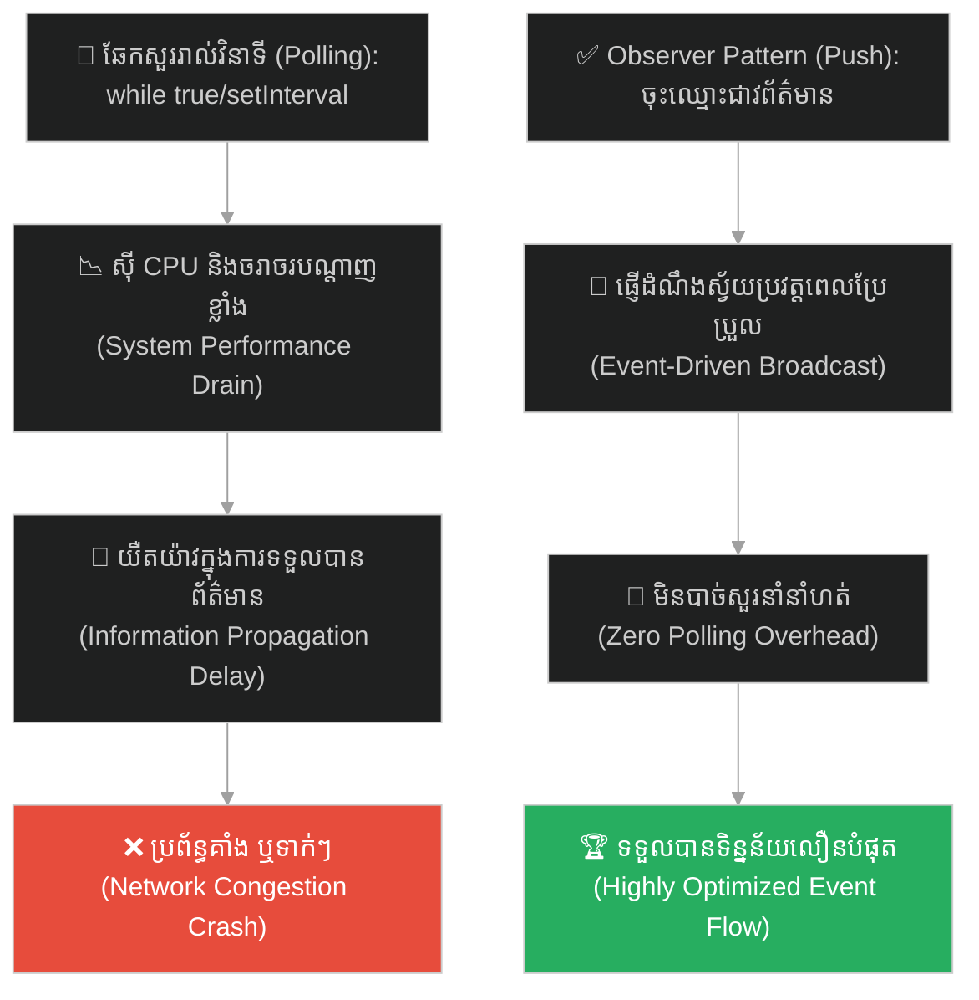
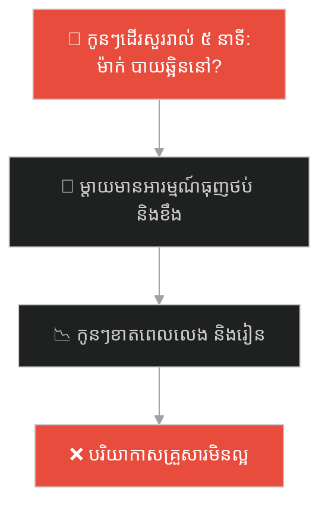
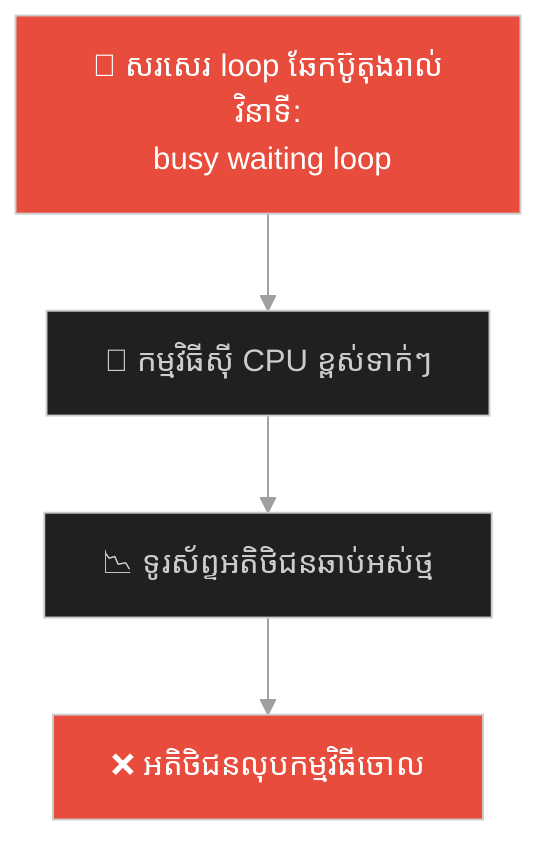
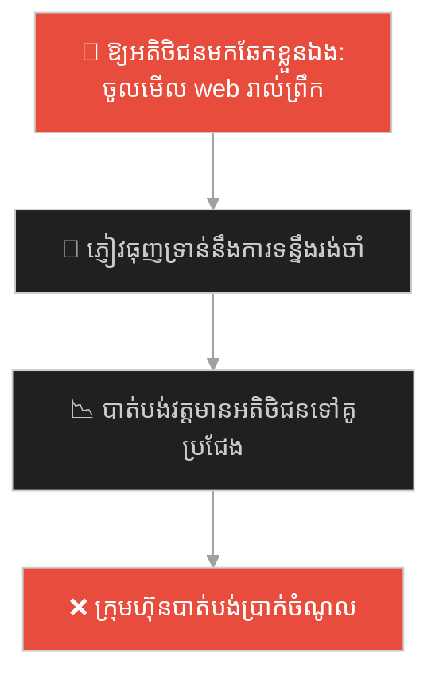
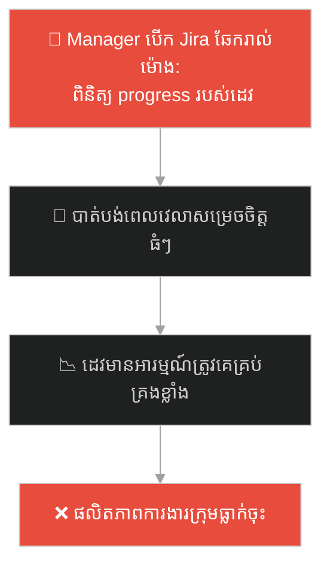
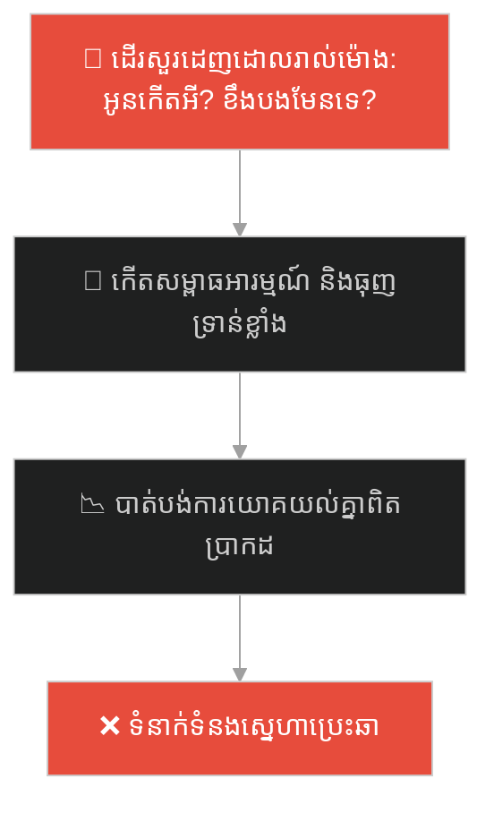
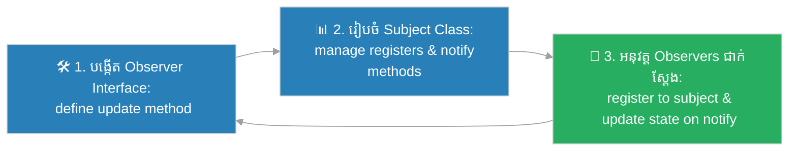

# Observer Design Pattern (លំនាំរចនាអ្នកសង្កេតការណ៍ព្រឹត្តិការណ៍)៖ អ្នកប្រកាសព័ត៌មាន និងអ្នកភូមិ (Observer Pattern & The Newspaper Subscription)

**Author:** ichamrong  
**Date:** 2026-05-27  
**Tags:** #design-patterns #observer #architecture #software-engineering #parable  
**Category:** Concepts / Parables  
**Read Time:** ~15 min  

---

## 📌 មាតិកា (Table of Contents)
- [អន្ទាក់ផ្លូវចិត្ត (The Trap)](#0)
- [១. រឿងព្រេងប្រវត្តិសាស្ត្រ៖ អ្នកប្រកាសព័ត៌មាន និងការដើរសួរព័ត៌មានដដែលៗ (The Legend of the Town Crier)](#1)
  - [បញ្ជីឈ្មោះអ្នកជាវ និងការជូនដំណឹងស្វ័យប្រវត្តិ (The Subscription Solution)](#1-1)
- [២. បញ្ហា៖ ការរង់ចាំឆែកមើលស្ថានភាពដដែលៗ និងការខ្ជះខ្ជាយធនធាន (The Issue: Polling Overheads and Inefficient State Monitoring)](#2)
- [៣. ឧទាហរណ៍ជាក់ស្តែងក្នុងពិភពពិត (Real World Examples)](#3)
  - [ឧទាហរណ៍ទី ១ — កម្រិតស្រាល (គ្រួសារ)៖ ការជូនដំណឹងម៉ោងបាយតាមឆាតរួម (Family Group Chat Broadcast for Dinner Times)](#3-1)
  - [ឧទាហរណ៍ទី ២ — កម្រិតមធ្យម (បច្ចេកទេស)៖ ការអនុវត្ត Event Listeners ក្នុងកម្មវិធី UI (Event Listeners and Reactive State Updates)](#3-2)
  - [ឧទាហរណ៍ទី ៣ — កម្រិតមធ្យម (ធុរកិច្ច)៖ ការជូនដំណឹងទំនិញចូលស្តុកវិញសម្រាប់អតិថិជន (Back-in-Stock Email Alerts for Shoppers)](#3-3)
  - [ឧទាហរណ៍ទី ៤ — កម្រិតមធ្យម (សង្គម/គ្រប់គ្រង)៖ ការដំឡើង Slack Webhooks ពេល Jira Ticket រួចរាល់ (Slack Webhooks for Automated Jira Ticket Transitions)](#3-4)
  - [ឧទាហរណ៍ទី ៥ — កម្រិតធ្ងន់ (ទំនាក់ទំនង)៖ ការស្វែងយល់ពីតម្រូវការដៃគូដោយសង្កេតសញ្ញាមិនមែនសម្តី (Noticing Emotional Cues and Reacting Supportively)](#3-5)
- [៤. ដំណោះស្រាយទូទៅ៖ ការអនុវត្ត Observer Pattern តាមរយៈ Pub-Sub Models (The General Solution: Observer Pattern with Subject-Observer Registration)](#4)
- [សេចក្តីសន្និដ្ឋាន (Conclusion)](#5)
- [ឯកសារយោង (References)](#6)
- [Related Posts](#7)

---

<a id="0"></a>
## អន្ទាក់ផ្លូវចិត្ត (The Trap)

តើអ្នកធ្លាប់ជួបបញ្ហាដែលប្រព័ន្ធ ឬសមាសភាគរបស់អ្នក ត្រូវចំណាយកម្លាំង CPU ឬធនធានបណ្តាញយ៉ាងខ្លាំង ដោយសារតែត្រូវរង់ចាំសួរនាំ ឬពិនិត្យមើលបម្រែបម្រួលស្ថានភាពរបស់ Object ផ្សេងទៀតជារៀងរាល់វិនាទី (Polling) ដែរឬទេ?

នៅក្នុងការអភិវឌ្ឍប្រព័ន្ធ៖
* **យើងងាយនឹងធ្លាក់ក្នុងអន្ទាក់** នៃការបណ្តោយឱ្យ Client ដើរឆែកមើលស្ថានភាពរបស់ Subject ដដែលៗដោយគ្មានប្រសិទ្ធភាព (Busy Waiting / Polling) ដែលនាំឱ្យស៊ីធនធានប្រព័ន្ធខ្ពស់ បង្កើតឱ្យមានចរាចរកកស្ទះ និងពន្យារពេលដឹងព័ត៌មានពិត។
* **យើងមើលរំលង** គោលការណ៍ចុះឈ្មោះជាវ (Subscribe) និងការរុញព័ត៌មានមកវិញ (Push/Broadcast) ស្វ័យប្រវត្ត នៅពេលដែល Subject ពិតជាមានការផ្លាស់ប្តូរស្ថានភាព។

ការព្យាយាមរង់ចាំ និងឆែកសួររកបម្រែបម្រួលទិន្នន័យដដែលៗពីសមាសភាគផ្សេងទៀត ហៅថា **អន្ទាក់ខាតបង់ធនធានលើការឆែកមើលព័ត៌មាន (Inefficient State Polling Trap)**។

ដើម្បីយល់ដឹងពីរបៀបបង្កើតប្រព័ន្ធរុញព័ត៌មានប្រកបដោយសណ្តាប់ធ្នាប់ នេះជាផែនទីបង្ហាញផ្លូវ៖
1. **រឿងព្រេងប្រវត្តិសាស្ត្រ (The Historic Legend)** — រឿងរ៉ាវរបស់អ្នកភូមិដែលដើរទៅមុខរាជវាំងរាល់ព្រឹកដើម្បីសួរព័ត៌មានថ្មីៗ និងការចុះឈ្មោះជាវ។
2. **បញ្ហា (The Issue)** — ការវិភាគការស៊ី CPU ខ្ពស់លើការ Polling ក្នុង OOP និងភាពគ្មានប្រសិទ្ធភាព។
3. **ឧទាហរណ៍ជាក់ស្តែងក្នុងពិភពពិត (Real World Examples)** — ពិនិត្យមើលបញ្ហានេះក្នុងកម្រិតគ្រួសារ បច្ចេកវិទ្យា ធុរកិច្ច ការគ្រប់គ្រង និងទំនាក់ទំនង។
4. **ដំណោះស្រាយទូទៅ (The General Solution)** — ការអនុវត្ត Observer Pattern ដើម្បីបង្កើតប្រព័ន្ធចុះឈ្មោះ និងផ្សព្វផ្សាយព្រឹត្តិការណ៍។



---

<a id="1"></a>
## ១. រឿងព្រេងប្រវត្តិសាស្ត្រ៖ អ្នកប្រកាសព័ត៌មាន និងការដើរសួរព័ត៌មានដដែលៗ (The Legend of the Town Crier)

កាលពីព្រេងនាយ នៅក្នុងភូមិដ៏ស្ងប់ស្ងាត់មួយ ប្រជារាស្ត្រទាំងអស់មានបំណងចង់ដឹងព័ត៌មាន ឬរាជសារថ្មីៗពីព្រះរាជាដើម្បីរៀបចំជីវភាពរស់នៅ។

ទោះជាយ៉ាងណា ដោយសារនគរគ្មានប្រព័ន្ធជូនដំណឹងជាផ្លូវការ អ្នកភូមិម្នាក់ៗត្រូវដើរទៅកាន់មុខរាជវាំងជារៀងរាល់ព្រឹក រួចសួរនាំឆ្មាំយាមទ្វារវាំងថា៖ *"តើថ្ងៃនេះព្រះរាជាមានចេញរាជសារថ្មីទេ?"*

លទ្ធផលគឺ៖
* ៩៩% នៃរាល់ព្រឹកដែលពួកគេទៅសួរ ឆ្មាំតែងតែឆ្លើយថា៖ *"គ្មានរាជសារថ្មីទេ!"*។
* ការធ្វើដំណើរដដែលៗរាល់ព្រឹក (Polling) បានធ្វើឱ្យអ្នកភូមិត្រូវខាតបង់ពេលវេលាធ្វើស្រែចំការ និងការងាររកស៊ីប្រចាំថ្ងៃរបស់ពួកគេយ៉ាងច្រើន។
* ច្រកទ្វារវាំងត្រូវបានកកស្ទះដោយសារមនុស្សរាប់ពាន់នាក់សម្រុកទៅសួរនាំរឿងដដែលៗ (High CPU & Network Traffic)។

---

<a id="1-1"></a>
### បញ្ជីឈ្មោះអ្នកជាវ និងការជូនដំណឹងស្វ័យប្រវត្តិ (The Subscription Solution)

ព្រះរាជាដ៏មានប្រាជ្ញា បានមើលឃើញពីភាពគ្មានប្រសិទ្ធភាពនេះ។ ព្រះអង្គបានបញ្ជាឱ្យដាក់ **សៀវភៅចុះឈ្មោះជាវ (The Subscription Book)** មួយក្បាលនៅច្រកទ្វារវាំង។

ព្រះអង្គប្រកាសថា៖ *"អ្នកភូមិទាំងឡាយ លែងបាច់ធ្វើដំណើរមកសួរនាំរាល់ថ្ងៃទៀតហើយ! អ្នកណាចង់ទទួលបានរាជសារថ្មី សូមសរសេរឈ្មោះ និងអាសយដ្ឋានផ្ទះ (Subscribe) នៅក្នុងសៀវភៅនេះជាការស្រេច!"*

អ្នកភូមិសប្បាយចិត្តខ្លាំងណាស់។ ពួកគេបាននាំគ្នាទៅចុះឈ្មោះ រួចត្រលប់ទៅធ្វើការងារនៅផ្ទះរៀងៗខ្លួនយ៉ាងស្ងប់ស្ងាត់ ដោយមិនបាច់ខាតពេលដើរមកសួរនាំទៀតឡើយ។

ពីរខែក្រោយមក នៅពេលមានព្រឹត្តិការណ៍ជាតិដ៏ធំកើតឡើង ព្រះរាជាបានប្រគល់រាជសារទៅឱ្យ **អ្នកប្រកាសព័ត៌មាន (The Town Crier / Subject)**។ 
* អ្នកប្រកាសព័ត៌មានគ្រាន់តែបើកសៀវភៅចុះឈ្មោះមើល។
* គាត់ជិះសេះយកសំបុត្ររាជសារទៅចែកជូន និងស្រែកប្រកាសដល់ផ្ទះអ្នកភូមិដែលបានចុះឈ្មោះទាំងអស់ក្នុងពេលតែមួយ (Push Notification / Notify Observers)។

អ្នកភូមិទទួលបានព័ត៌មានទាន់ហេតុការណ៍ដោយស្ងប់សុខ និងមិនបាច់ខ្ជះខ្ជាយកម្លាំងឡើយ។

---

<a id="2"></a>
## ២. បញ្ហា៖ ការរង់ចាំឆែកមើលស្ថានភាពដដែលៗ និងការខ្ជះខ្ជាយធនធាន (The Issue: Polling Overheads and Inefficient State Monitoring)

នៅក្នុងវិស្វកម្មផ្នែកទន់ ភាពស្មុគស្មាញនេះកើតឡើងនៅពេលយើងសរសេរកូដឆែកបម្រែបម្រួលរបស់ Object ផ្សេងទៀតដោយប្រើ `while(true)` ឬ `setInterval`៖

```java
// កូដដែលគ្មាន Observer គឺប្រើប្រាស់ Polling ស៊ីម៉ាស៊ីនខ្លាំង
while (true) {
    if (button.isClicked()) {
        doSomething();
    }
    Thread.sleep(100); // ឆែករាល់ 100ms ស៊ី CPU ឥតឈប់
}
```

* **ការខាតបង់ថាមពលប្រព័ន្ធ (Performance Overhead)៖** កម្មវិធីត្រូវចំណាយ CPU គណនាដដែលៗទោះបីជាគ្មានទិន្នន័យប្រែប្រួល ដែលធ្វើឱ្យទូរស័ព្ទឆាប់អស់ថ្ម ឬ Server ក្តៅខ្លាំង។
* **ភាពជំពាក់ជំពិនគ្នាយ៉ាងតឹងរឹង (Tight Structural Coupling)៖** Client ត្រូវដឹង និងគ្រប់គ្រងយន្តការឆែកមើលរបស់ Subject ផ្ទាល់ខ្លួន ដែលធ្វើឱ្យពិបាកកែប្រែ។

**Observer Design Pattern** ជួយដោះស្រាយបញ្ហានេះដោយប្រើគោលការណ៍ "កុំទាក់ទងមកយើង យើងនឹងទាក់ទងទៅអ្នក (Don't call us, we'll call you)"។ Subject ផ្ទុករក្សា Array របស់ Observers។ នៅពេលមានការប្រែប្រួល Subject នឹង Loop ហៅ Method `update()` របស់ Observers ទាំងអស់ដោយស្វ័យប្រវត្តិ។

---

<a id="3"></a>
## ៣. ឧទាហរណ៍ជាក់ស្តែងក្នុងពិភពពិត

---

<a id="3-1"></a>
### ឧទាហរណ៍ទី ១ — កម្រិតស្រាល (គ្រួសារ)៖ ការជូនដំណឹងម៉ោងបាយតាមឆាតរួម (Family Group Chat Broadcast for Dinner Times)

នៅក្នុងគ្រួសារមួយ ម្តាយរៀបចំអាហារពេលល្ងាចរួចរាល់។ ជំនួសឱ្យការឱ្យកូនៗម្នាក់ៗដើរចូលផ្ទះបាយសួររៀងរាល់ ៥ នាទីថា *"ម៉ាក់! បាយឆ្អិននៅ?"* (Polling) ម្តាយគ្រាន់តែផ្ញើសារចូលក្នុងឆាតក្រុមគ្រួសារតែម្តងគត់ (Observer Broadcast) នោះកូនៗទាំងអស់នឹងដឹង និងដើរមកតុបាយព្រមគ្នាភ្លាមៗ។



ម្តាយបានប្រើប្រាស់វិធីសាស្ត្រ Observer style ដើម្បីសម្រួលទំនាក់ទំនងក្នុងផ្ទះ។

---

<a id="3-2"></a>
### ឧទាហរណ៍ទី ២ — កម្រិតមធ្យម (បច្ចេកទេស)៖ ការអនុវត្ត Event Listeners ក្នុងកម្មវិធី UI (Event Listeners and Reactive State Updates)

នៅក្នុងការសរសេរកម្មវិធី Frontend (ដូចជា React, Angular) ជំនួសឱ្យការឱ្យកម្មវិធីសរសេរ loop ឆែកមើលប៊ូតុងថាចុចហើយឬនៅ វិស្វករបានចុះឈ្មោះ Event Listener `onClick`។ ពេលអតិថិជនចុចលើប៊ូតុង ព្រឹត្តិការណ៍ត្រូវបានរុញទៅឱ្យកូដដោះស្រាយ (Callback) ដំណើរការភ្លាមៗ។



---

<a id="3-3"></a>
### ឧទាហរណ៍ទី ៣ — កម្រិតមធ្យម (ធុរកិច្ច)៖ ការជូនដំណឹងទំនិញចូលស្តុកវិញសម្រាប់អតិថិជន (Back-in-Stock Email Alerts for Shoppers)

វិបសាយលក់ទំនិញអនឡាញដ៏ធំមួយ មានទូរស័ព្ទម៉ូដែលពេញនិយមដែលដាច់ស្តុក។ ជំនួសឱ្យការបង្ខំឱ្យអតិថិជនចូលមកបើកវិបសាយឆែកមើលរាល់ថ្ងៃ វិបសាយផ្តល់ប៊ូតុង "ប្រាប់ខ្ញុំពេលមានស្តុកវិញ (Notify Me)"។ នៅពេលទំនិញចូលមកដល់ឃ្លាំង ប្រព័ន្ធផ្ញើអ៊ីមែលប្រាប់អតិថិជនដែលចុះឈ្មោះទាំងអស់ដោយស្វ័យប្រវត្ត។



---

<a id="3-4"></a>
### ឧទាហរណ៍ទី ៤ — កម្រិតមធ្យម (សង្គម/គ្រប់គ្រង)៖ ការដំឡើង Slack Webhooks ពេល Jira Ticket រួចរាល់ (Slack Webhooks for Automated Jira Ticket Transitions)

នៅក្នុងការគ្រប់គ្រងក្រុមការងារ ជំនួសឱ្យការឱ្យប្រធានក្រុម (Manager) អង្គុយបើកមើលប្រព័ន្ធ Jira រៀងរាល់ម៉ោងដើម្បីដឹងថាដេវធ្វើការរួចរាល់ឬនៅ ក្រុមការងារបានដំឡើង Slack Webhook (Observer)។ ពេល Task ត្រូវប្តូរទៅ "Done" វានឹងរុញដំណឹងចូល Slack ភ្លាមៗ ជួយឱ្យប្រធានក្រុមអាចដឹង និងវាយតម្លៃការងាររលូន។



---

<a id="3-5"></a>
### ឧទាហរណ៍ទី ៥ — កម្រិតធ្ងន់ (ទំនាក់ទំនង)៖ ការស្វែងយល់ពីតម្រូវការដៃគូដោយសង្កេតសញ្ញាមិនមែនសម្តី (Noticing Emotional Cues and Reacting Supportively)

នៅក្នុងទំនាក់ទំនងស្នេហា ជំនួសឱ្យការបង្ខំឱ្យដៃគូម្នាក់ទៀតត្រូវដើរតាមសួរដេញដោលរាល់ម៉ោងថា *"តើអូនកើតអីទេ? តើអូនខឹងបងឬ?"* (ដែលបង្កើតសម្ពាធអារម្មណ៍) ដៃគូដែលយល់ចិត្តបានបង្កើតការយកចិត្តទុកដាក់ (Observer Mindset) សង្កេតសញ្ញាស្ងប់ស្ងាត់ ឬទឹកមុខរបស់ដៃគូ រួចចូលទៅផ្តល់កម្លាំងចិត្ត និងដោះស្រាយបញ្ហាជាមួយគ្នាភ្លាមៗដោយមិនបាច់ដេញដោលឡើយ។



---

<a id="4"></a>
## ៤. ដំណោះស្រាយទូទៅ៖ ការអនុវត្ត Observer Pattern តាមរយៈ Pub-Sub Models (The General Solution: Observer Pattern with Subject-Observer Registration)

ដើម្បីបង្កើតប្រព័ន្ធចុះឈ្មោះ និងផ្សព្វផ្សាយដំណឹងស្វ័យប្រវត្តិ យើងត្រូវអនុវត្តលំនាំរចនា **Observer Pattern**៖



ជំហាននៃការអនុវត្ត៖
1. **បង្កើត Observer Interface៖** ប្រកាស Method ទទួលដំណឹងរួមមួយ (ដូចជា `update(data)`) សម្រាប់ឱ្យ Observers ទាំងអស់អនុវត្តតាម។
2. **បង្កើត Subject Class/Interface៖** ផ្តល់ Method `attach(Observer)` សម្រាប់ចុះឈ្មោះ `detach(Observer)` សម្រាប់ដកឈ្មោះចេញ និង `notify()` សម្រាប់ Loop ហៅ `observer.update()` របស់ Observers ទាំងអស់នៅក្នុងបញ្ជីរបស់ខ្លួន។
3. **ចុះឈ្មោះ និងដំណើរការ៖** នៅក្នុងកូដបញ្ជា Client ត្រូវបង្កើត Observers ជាក់ស្តែង រួចចុះឈ្មោះពួកវាទៅកាន់ Subject នោះ។ នៅពេល Subject មានការប្រែប្រួលទិន្នន័យ វានឹងហៅ `notify()` ដើម្បីរុញដំណឹងទៅឱ្យ Observers ទាំងអស់ដោយជោគជ័យ។

---

## 🐇 ធ្លាក់ចូលក្នុងរន្ធទន្សាយ (Enter the Rabbit Hole)

ដើម្បីស្វែងយល់ពីរបៀបដែលភោជនីយដ្ឋាន ឬប្រព័ន្ធបញ្ជាការងារ បានសម្រួលការគ្រប់គ្រងសំណើរបស់អតិថិជន ដោយវេចខ្ចប់រាល់ព័ត៌មានលម្អិតនៃសំណើនីមួយៗ ឱ្យទៅជា "សន្លឹកបៀរការងារអរូបី" ដែលអាចរៀបជាជួរ (Queue) ពន្យារពេលធ្វើការ ឬទាញថយក្រោយ Undo (Command Pattern) សូមបន្តដំណើរទៅកាន់៖

* 🚀 **[ចាប់ផ្តើមដំណើររុករក (Start the Journey) ➔ Command Pattern and Action Encapsulation](./93-the-waiters-order-pad.md)**

---

<a id="5"></a>
## សេចក្តីសន្និដ្ឋាន (Conclusion)

> **«កុំដើរមកសួរនាំយើងរាល់ព្រឹកឡើយ។ ចូរចុះឈ្មោះជាវនៅក្នុងសៀវភៅ នោះយើងនឹងរុញព័ត៌មានថ្មីៗទៅដល់ផ្ទះរបស់អ្នកភ្លាមៗនៅពេលវាពិតជាលេចរូបរាងឡើង។»**

ចូរធ្វើខ្លួនជាវិស្វករកម្មវិធីដែលយល់ដឹងពីសិល្បៈនៃការបង្កើតប្រព័ន្ធជំរុញព្រឹត្តិការណ៍ (Event-Driven Architecture)។ ការអនុវត្ត Observer Design Pattern មិនត្រឹមតែជួយសន្សំសំចៃធនធាន CPU/Network របស់ម៉ាស៊ីនយ៉ាងមហាសាលប៉ុណ្ណោះទេ ប៉ុន្តែវាក៏ជួយឱ្យប្រព័ន្ធរបស់អ្នកដំណើរការបានទាន់ពេលវេលា និងមានភាពបត់បែនខ្ពស់បំផុត។

---

<a id="6"></a>
## ឯកសារយោង (References)

* **Erich Gamma, Richard Helm, Ralph Johnson, John Vlissides** — *Design Patterns: Elements of Reusable Object-Oriented Software* (1994). Observer Design Pattern Chapter.
* **Martin Fowler** — *Patterns of Enterprise Application Architecture: Event Collaboration* (2002).
* **ReactiveX** — *Reactive Extensions and the Observer Pattern principles* (2012).

---

<a id="7"></a>
## Related Posts

* **[92 Observer Pattern: Automated State Change Broadcasting](../articles/92-observer-pattern.md)** — អត្ថបទវិទ្យាសាស្ត្រលម្អិត និងកូដគំរូ Java/C# សម្រាប់ការរចនា Pub-Sub System។
* **[91 The Checkpoint Crystal](./91-the-checkpoint-crystal.md)** — ការថតចម្លង និងស្តារស្ថានភាពរបស់ Object ឡើងវិញដោយមិនបំពាន Encapsulation។
* **[64 The Swiss Army Knife](./64-the-swiss-army-knife.md)** — ការរក្សាមុខងារជាក់លាក់ និងការចៀសវាងការខាតបង់ធនធានប្រព័ន្ធ។

---

## Related

- [💡 Concepts README](../README.md)
- [📚 Main Repository README](../../../README.md)
- [Developer Habits](../../developer-habits/README.md)
- [Mental Health & Well-being](../../mental-health/README.md)
- [Management & SDLC](../../management/README.md)
