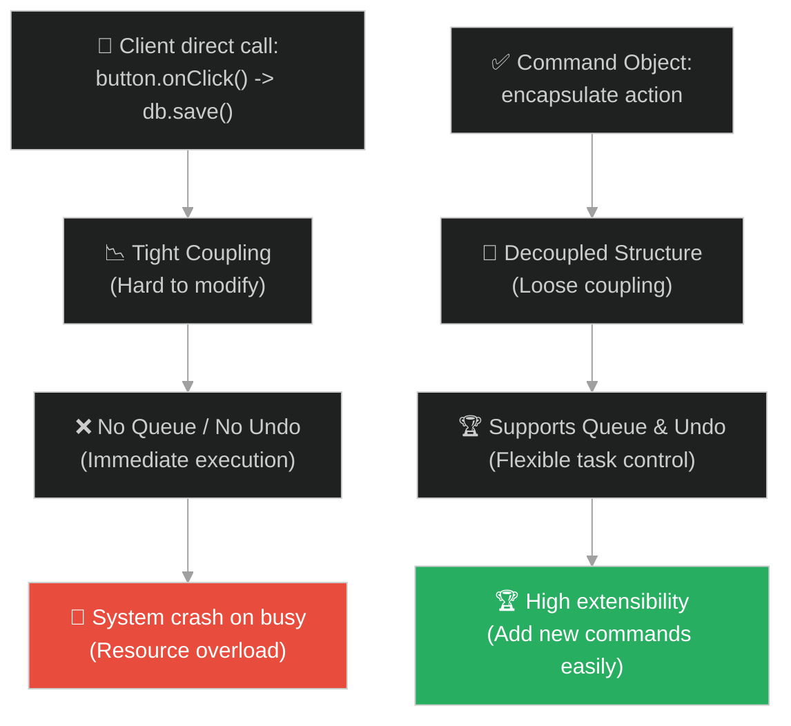
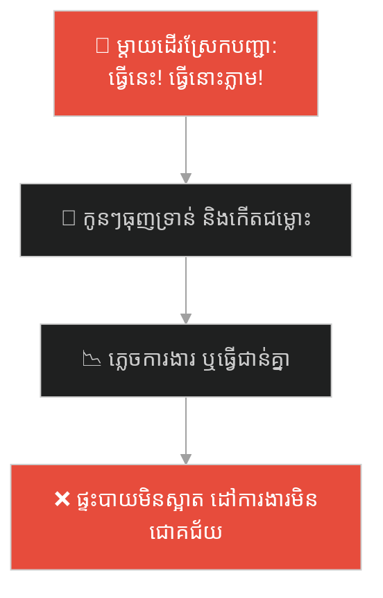
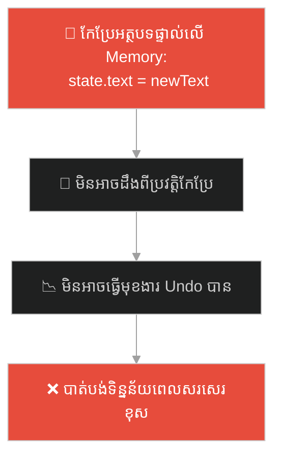
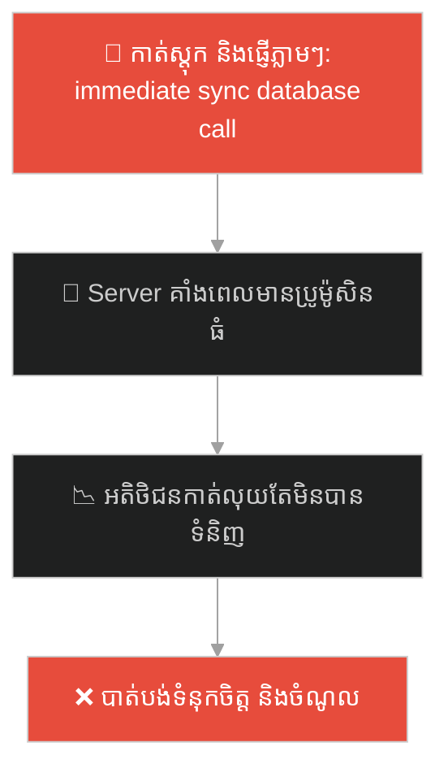
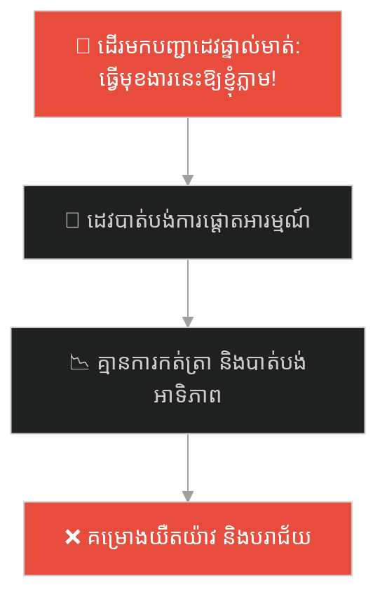
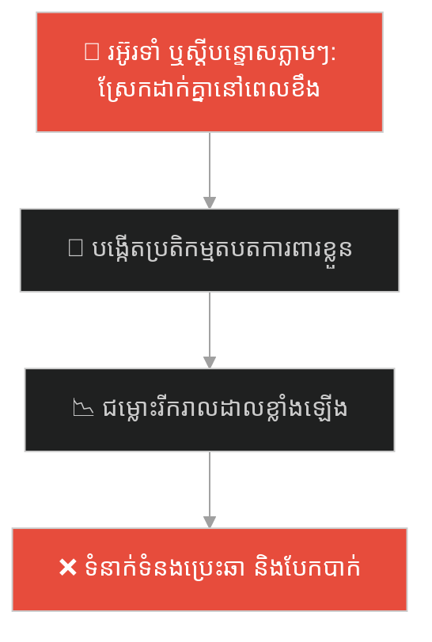
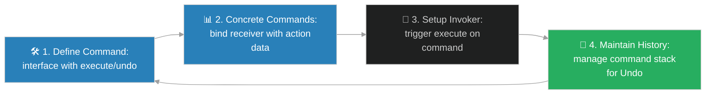

# Command Design Pattern (លំនាំរចនាបញ្ជាការងារ)៖ ក្រដាសកុម្ម៉ង់របស់អ្នករត់តុ (Command Pattern & The Waiter's Order Pad)

**Author:** ichamrong  
**Date:** 2026-05-28  
**Tags:** #design-patterns #command #architecture #software-engineering #parable  
**Category:** Concepts / Parables  
**Read Time:** ~15 min  

---

## 📌 មាតិកា (Table of Contents)
- [អន្ទាក់ផ្លូវចិត្ត (The Trap)](#0)
- [១. រឿងព្រេងប្រវត្តិសាស្ត្រ៖ អ្នកកុម្ម៉ង់ផ្ទាល់ និងភាពច្របូកច្របល់ក្នុងផ្ទះបាយ (The Legend of the Order Chaos)](#1)
  - [ក្រដាសកុម្ម៉ង់អាហាររបស់អ្នករត់តុ (The Waiter's Written Order System)](#1-1)
- [២. បញ្ហា៖ ភាពជំពាក់ជំពិនគ្នាយ៉ាងតឹងរឹង និងអវត្តមាននៃការគ្រប់គ្រងសណ្តាប់ធ្នាប់ (The Issue: Tight Coupling and the Absence of Action Queue/Undo)](#2)
- [៣. ឧទាហមណ៍ជាក់ស្តែងក្នុងពិភពពិត (Real World Examples)](#3)
  - [ឧទាហរណ៍ទី ១ — កម្រិតស្រាល (គ្រួសារ)៖ សន្លឹកកិច្ចការប្រចាំសប្តាហ៍របស់កូនៗ (Weekly Chore Cards for Kids)](#3-1)
  - [ឧទាហរណ៍ទី ២ — កម្រិតមធ្យម (បច្ចេកទេស)៖ មុខងារ Undo/Redo នៅក្នុង Text Editor (Undo/Redo History in Text Editors)](#3-2)
  - [ឧទាហរណ៍ទី ៣ — កម្រិតមធ្យម (ធុរកិច្ច)៖ ការគ្រប់គ្រងការបញ្ជាទិញក្នុងប្រព័ន្ធ e-Commerce (Order Processing Queue in e-Commerce Fulfillment)](#3-3)
  - [ឧទាហរណ៍ទី ៤ — កម្រិតមធ្យម (សង្គម/គ្រប់គ្រង)៖ ប្រព័ន្ធសន្លឹកបៀការងារ Kanban ក្នុង Agile Teams (Kanban Task Cards in Agile Project Management)](#3-4)
  - [ឧទាហរណ៍ទី ៥ — កម្រិតធ្ងន់ (ទំនាក់ទំនង)៖ ការសរសេរបញ្ជីសំណូមពរចិត្តសាស្ត្រដើម្បីដោះស្រាយជម្លោះ (Written Relationship Request Envelopes for Shared Commitments)](#3-5)
- [៤. ដំណោះស្រាយទូទៅ៖ ការអនុវត្ត Command Pattern ជាមួយ Undo-Redo Mechanics (The General Solution: Command Pattern with Invoker-Receiver Decoupling)](#4)
- [សេចក្តីសន្និដ្ឋាន (Conclusion)](#5)
- [ឯកសារយោង (References)](#6)
- [Related Posts](#7)

---

<a id="0"></a>
## អន្ទាក់ផ្លូវចិត្ត (The Trap)

តើអ្នកធ្លាប់ជួបបញ្ហាដែល UI Component ឬសមាសភាគគ្រប់គ្រងការស្នើសុំ (Request Trigger) ត្រូវបានចងភ្ជាប់យ៉ាងស្អិតរមួតជាមួយកូដប្រតិបត្តិការផ្ទាល់ (Business Logic Execution) ដែរឬទេ? ភាពជំពាក់ជំពិននេះធ្វើឱ្យអ្នកមិនអាចពន្យារពេលបញ្ជា មិនអាចរៀបចំជាជួរ (Queue) ឬបង្កើតមុខងារលុបចោលវិញ (Undo/Redo) បានឡើយ។

នៅក្នុងការអភិវឌ្ឍប្រព័ន្ធ៖
* **យើងងាយនឹងធ្លាក់ក្នុងអន្ទាក់** នៃការបណ្តោយឱ្យផ្នែកបញ្ជា (Invoker) ហៅទៅកាន់ផ្នែកអនុវត្តផ្ទាល់ (Receiver) ភ្លាមៗ (Direct Tight Coupling) ដែលនាំឱ្យបាត់បង់ភាពបត់បែន និងបង្កើតភាពស្មុគស្មាញនៅពេលចង់កែប្រែ ឬបន្ថែមមុខងារថ្មីៗ។
* **យើងមើលរំលង** យន្តការ "បំប្លែងសកម្មភាពឱ្យទៅជាវត្ថុ (Encapsulating request as an object)" ដែលជួយឱ្យរាល់ការបញ្ជាទាំងអស់ក្លាយជា Entity ឯករាជ្យ អាចគ្រប់គ្រង ផ្ទេរ ឬលុបចោលតាមលំដាប់លំដោយបាន។

ការព្យាយាមអនុវត្តសកម្មភាពភ្លាមៗដោយគ្មានការបំប្លែងជាវត្ថុឯករាជ្យ ហៅថា **អន្ទាក់ចងភ្ជាប់សកម្មភាពផ្ទាល់ (Direct Execution Coupling Trap)**។

ដើម្បីយល់ដឹងពីរបៀបគ្រប់គ្រងសកម្មភាពប្រកបដោយសណ្តាប់ធ្នាប់ នេះជាផែនទីបង្ហាញផ្លូវ៖
1. **រឿងព្រេងប្រវត្តិសាស្ត្រ (The Historic Legend)** — រឿងរ៉ាវរបស់ភោជនីយដ្ឋានគ្មានអ្នករត់តុ ដែលនាំឱ្យកើតមានការស្រែកបញ្ជាច្របូកច្របល់ និងដំណោះស្រាយដោយសន្លឹកបៀក្រដាសកុម្ម៉ង់។
2. **បញ្ហា (The Issue)** — ការវិភាគការចងភ្ជាប់កូដតឹងរឹង និងការបាត់បង់លទ្ធភាពបង្កើត Queue/Undo ក្នុង Object-Oriented Design។
3. **ឧទាហរណ៍ជាក់ស្តែងក្នុងពិភពពិត (Real World Examples)** — ពិនិត្យមើលបញ្ហានេះក្នុងកម្រិតគ្រួសារ បច្ចេកវិទ្យា ធុរកិច្ច ការគ្រប់គ្រង និងទំនាក់ទំនង។
4. **ដំណោះស្រាយទូទៅ (The General Solution)** — ការបង្កើត Command Pattern ដើម្បីផ្ដាច់ទំនាក់ទំនងរវាងផ្នែកបញ្ជា និងផ្នែកអនុវត្ត។



---

<a id="1"></a>
## ១. រឿងព្រេងប្រវត្តិសាស្ត្រ៖ អ្នកកុម្ម៉ង់ផ្ទាល់ និងភាពច្របូកច្របល់ក្នុងផ្ទះបាយ (The Legend of the Order Chaos)

កាលពីព្រេងនាយ មានភោជនីយដ្ឋានដ៏ពេញនិយមមួយកន្លែងនៅក្នុងទីក្រុងអ៊ូអរ។ ភោជនីយដ្ឋាននោះលក់អាហារឆ្ងាញ់ៗជាច្រើនមុខ ប៉ុន្តែមានរបៀបគ្រប់គ្រងប្លែកគេ៖ គឺគ្មានអ្នករត់តុឡើយ។

នៅពេលអតិថិជនដើរចូលមកញ៉ាំអាហារ៖
* ពួកគេត្រូវដើរចូលទៅក្នុងផ្ទះបាយដោយផ្ទាល់ រួចស្រែកប្រាប់ចុងភៅដែលកំពុងឈរនៅមុខខ្ទះថា៖ *"ឆាសាច់គោមួយចាន!"* ឬ *"ស្ងោរជ្រក់មាន់មួយចាន!"*។
* ប្រសិនបើចុងភៅកំពុងជាប់ដៃធ្វើអាហារឱ្យអ្នកផ្សេង គាត់មិនអាចកត់ត្រាទុកបានទេ ដែលធ្វើឱ្យការកុម្ម៉ង់ខ្លះត្រូវភ្លេច ឬលំដាប់លំដោយច្របូកច្របល់។
* នៅពេលអតិថិជនម្នាក់ចង់ប្តូរចិត្តលុបចោលមុខម្ហូប (Undo) ឬចង់ប្តូរពីសាច់គោទៅសាច់ជ្រូក គាត់ត្រូវរត់ចូលផ្ទះបាយម្តងទៀត រួចស្រែកជជែកជាមួយចុងភៅយ៉ាងក្តៅក្រហាយ។
* ចុងភៅមិនអាចផ្តោតអារម្មណ៍លើការធ្វើម្ហូបបានឡើយ ព្រោះត្រូវឈ្លោះ និងស្តាប់ការស្រែករបស់អតិថិជនរាប់សិបនាក់ក្នុងពេលតែមួយ (Tight Coupling & Context Switching)។

---

<a id="1-1"></a>
### ក្រដាសកុម្ម៉ង់អាហាររបស់អ្នករត់តុ (The Waiter's Written Order System)

ម្ចាស់ហាងដែលមានប្រាជ្ញា បានរកឃើញចំណុចខ្សោយដ៏ធំនេះ។ គាត់បានសម្រេចចិត្តផ្លាស់ប្តូរប្រព័ន្ធការងារទាំងស្រុង ដោយជួល **អ្នករត់តុ (Invoker)** និងបង្កើត **ក្រដាសកុម្ម៉ង់ (Command Objects)**។

ឥឡូវនេះ៖
1. **អ្នករត់តុ** ដើរទៅរកអតិថិជនម្នាក់ៗ កត់ត្រារាល់តម្រូវការអាហារចុះលើ **ក្រដាសកុម្ម៉ង់** តូចមួយ។
2. ក្រដាសកុម្ម៉ង់នីមួយៗផ្ទុកព័ត៌មានគ្រប់គ្រាន់រួមមាន៖ ឈ្មោះម្ហូប លេខតុ និងកំណត់សម្គាល់ពិសេស។
3. អ្នករត់តុយកក្រដាសនោះទៅដោតនៅលើ **របារដែកដោតវិក្កយបត្រ (Queue)** នៅក្នុងផ្ទះបាយ។
4. ចុងភៅគ្រាន់តែដកក្រដាសចេញពីរបារដែកម្តងមួយសន្លឹកតាមលំដាប់លំដោយ (First-In, First-Out) រួចធ្វើម្ហូបដោយស្ងប់ស្ងាត់ ដោយមិនបាច់ដឹងថាអតិថិជនជាអ្នកណាឡើយ។

ប្រសិនបើអតិថិជនចង់លុបចោលការកុម្ម៉ង់ (Undo) អ្នករត់តុគ្រាន់តែរត់ទៅរករបារដែក ទាញយកក្រដាសកុម្ម៉ង់នោះមកហែកចោល ជាការស្រេច។ សកម្មភាពកុម្ម៉ង់ត្រូវបានបំប្លែងទៅជា "វត្ថុឯករាជ្យ" (Objectified Action) ដែលអាចផ្ទុក ផ្ទេរ ពន្យារពេល និងលុបចោលបានដោយជោគជ័យ។

---

<a id="2"></a>
## ២. បញ្ហា៖ ភាពជំពាក់ជំពិនគ្នាយ៉ាងតឹងរឹង និងអវត្តមាននៃការគ្រប់គ្រងសណ្តាប់ធ្នាប់ (The Issue: Tight Coupling and the Absence of Action Queue/Undo)

នៅក្នុងវិស្វកម្មផ្នែកទន់ ភាពជំពាក់ជំពិននេះកើតឡើងនៅពេលសមាសភាគ UI (ដូចជា ប៊ូតុង ឬមីនុយ) ហៅទៅកាន់ Business Logic ឬ Database Function ដោយផ្ទាល់៖

```java
// កូដដែលគ្មាន Command Pattern គឺចងភ្ជាប់ UI និង Logic តឹងរឹង
public class SaveButton {
    private Database db;

    public SaveButton(Database db) {
        this.db = db;
    }

    public void onClick() {
        db.saveData(); // ហៅប្រតិបត្តិការផ្ទាល់ មិនអាចពន្យារពេល ឬធ្វើ Undo បានឡើយ
    }
}
```

* **ភាពមិនអាចគ្រប់គ្រងប្រវត្តិសកម្មភាព (Lack of Command History)៖** ដោយសារការហៅសកម្មភាពត្រូវបានធ្វើឡើងភ្លាមៗ កម្មវិធីមិនអាចកត់ត្រាទុកថាមានអ្វីខ្លះត្រូវបានចុច ដើម្បីផ្តល់មុខងារ Undo/Redo បានឡើយ។
* **ភាពជំពាក់ជំពិនរវាង UI និង Operation (High Structural Coupling)៖** ប៊ូតុងត្រូវស្គាល់ Database Object ផ្ទាល់ខ្លួន ដែលធ្វើឱ្យពិបាកយកប៊ូតុងនោះទៅប្រើប្រាស់ឡើងវិញក្នុងបរិបទផ្សេង។

**Command Design Pattern** ជួយដោះស្រាយបញ្ហានេះដោយណែនាំ `Command Interface` ដែលមាន Method `execute()`។ រាល់សកម្មភាពទាំងអស់ត្រូវបានបង្កើតជា Class ផ្សេងៗគ្នាដែលទទទួលស្គាល់ Interface នេះ។ ផ្នែកបញ្ជា (Invoker) គ្រាន់តែទទួលយក Object នៃប្រភេទ `Command` រួចហៅ `execute()` ដោយមិនបាច់ខ្វល់ពីព័ត៌មានលម្អិតឡើយ។

---

<a id="3"></a>
## ៣. ឧទាហរណ៍ជាក់ស្តែងក្នុងពិភពពិត

---

<a id="3-1"></a>
### ឧទាហរណ៍ទី ១ — កម្រិតស្រាល (គ្រួសារ)៖ សន្លឹកកិច្ចការប្រចាំសប្តាហ៍របស់កូនៗ (Weekly Chore Cards for Kids)

នៅក្នុងគ្រួសារមួយ ម្តាយចង់ឱ្យកូនៗជួយធ្វើការងារផ្ទះ។ ជំនួសឱ្យការដើរស្រែកបញ្ជាកូនៗរាល់ម៉ោង ដែលធ្វើឱ្យកូនៗធុញទ្រាន់ និងភ្លេចការងារ (Direct Call Trap) ម្តាយបានសរសេរការងារនីមួយៗលើ **បៀរកិច្ចការ (Chore Cards)** ដូចជា "បោសផ្ទះ", "លាងចាន", "ស្រោចផ្កា" រួចបិទលើក្តារខៀន។ កូនៗដើរមកដកបៀរការងារយកទៅធ្វើម្តងមួយៗយ៉ាងមានសណ្តាប់ធ្នាប់។



ម្តាយបានប្រើប្រាស់វិធីសាស្ត្រ Command Style ដើម្បីសម្រួលការបែងចែកការងារក្នុងផ្ទះ។

---

<a id="3-2"></a>
### ឧទាហរណ៍ទី ២ — កម្រិតមធ្យម (បច្ចេកទេស)៖ មុខងារ Undo/Redo នៅក្នុង Text Editor (Undo/Redo History in Text Editors)

នៅក្នុងកម្មវិធីសរសេរអត្ថបទ (ដូចជា VS Code, MS Word) រាល់ពេលអ្នកវាយអក្សរ លុបអក្សរ ឬផាត់ពណ៌ កម្មវិធីមិនគ្រាន់តែកែប្រែអត្ថបទភ្លាមៗនោះទេ។ វាបង្កើត **Command Object** មួយ (ឧទាហរណ៍៖ `InsertTextCommand`, `DeleteTextCommand`) រួចរក្សាទុកវាទៅក្នុង **Command History Stack**។ នៅពេលអ្នកចុច `Ctrl + Z` វាគ្រាន់តែទាញយក Command ចុងក្រោយចេញពី Stack រួចហៅ Method `undo()` ដើម្បីត្រលប់ទៅស្ថានភាពដើមវិញ។



---

<a id="3-3"></a>
### ឧទាហរណ៍ទី ៣ — កម្រិតមធ្យម (ធុរកិច្ច)៖ ការគ្រប់គ្រងការបញ្ជាទិញក្នុងប្រព័ន្ធ e-Commerce (Order Processing Queue in e-Commerce Fulfillment)

នៅក្នុងក្រុមហ៊ុនលក់ទំនិញអនឡាញដ៏ធំមួយ ពេលអតិថិជនចុចកុម្ម៉ង់ទិញ ប្រព័ន្ធមិនរត់ទៅកាត់ស្តុក ឬផ្ញើទំនិញភ្លាមៗនោះទេ។ ប្រព័ន្ធនឹងបង្កើត **Order Command Object** មួយ រួចផ្ញើវាទៅកាន់ **Message Queue (RabbitMQ / Kafka)**។ ក្រុមការងារនៅក្នុងឃ្លាំងទំនិញ (Receiver) ទាញយកការបញ្ជាទិញទាំងនោះមកវេចខ្ចប់តាមលំដាប់លំដោយ ធានាថាប្រព័ន្ធមិនគាំងទោះជាមានមនុស្សកុម្ម៉ង់រាប់លាននាក់ក្នុងពេលតែមួយក៏ដោយ។



---

<a id="3-4"></a>
### ឧទាហរណ៍ទី ៤ — កម្រិតមធ្យម (សង្គម/គ្រប់គ្រង)៖ ប្រព័ន្ធសន្លឹកបៀការងារ Kanban ក្នុង Agile Teams (Kanban Task Cards in Agile Project Management)

នៅក្នុងការគ្រប់គ្រងគម្រោងទន់ (Agile Software Development) ជំនួសឱ្យការឱ្យអតិថិជន ឬអ្នកគ្រប់គ្រងដើរទៅបញ្ជាអ្នកសរសេរកូដផ្ទាល់រាល់ថ្ងៃ (Direct Instruction Chaos) ក្រុមការងារប្រើប្រាស់ **Kanban Board (Jira/Trello)**។ រាល់សកម្មភាពត្រូវធ្វើ ត្រូវបានបង្កើតជា **Task Card (Command Object)** ដាក់ក្នុងផ្នែក Backlog។ ដេវគ្រាន់តែទាញយកកាតទាំងនោះទៅធ្វើតាមអាទិភាព ធានាបាននូវលំហូរការងាររលូន និងមានរបៀបរៀបរយ។



---

<a id="3-5"></a>
### ឧទាហរណ៍ទី ៥ — កម្រិតធ្ងន់ (ទំនាក់ទំនង)៖ ការសរសេរបញ្ជីសំណូមពរចិត្តសាស្ត្រដើម្បីដោះស្រាយជម្លោះ (Written Relationship Request Envelopes for Shared Commitments)

នៅក្នុងទំនាក់ទំនងប្តីប្រពន្ធ ជំនួសឱ្យការស្រែករអ៊ូរទាំ ឬស្តីបន្ទោសគ្នាភ្លាមៗនៅពេលមានរឿងមិនពេញចិត្ត (ដែលបង្កើតឱ្យមានប្រតិកម្មតបត និងជម្លោះក្តៅក្រហាយ) គូស្វាមីភរិយាដែលយល់ចិត្តគ្នាបានប្រើវិធី "សរសេរសន្លឹកសំណូមពរ" ដាក់ក្នុងប្រអប់រួម។ រៀងរាល់ចុងសប្តាហ៍ ពួកគេបើកប្រអប់ជាមួយគ្នា រួចពិភាក្សាដោះស្រាយសំណូមពរនីមួយៗដោយសន្តិវិធី និងមានការត្រៀមលក្ខណៈអារម្មណ៍រួចជាស្រេច។



---

<a id="4"></a>
## ៤. ដំណោះស្រាយទូទៅ៖ ការអនុវត្ត Command Pattern ជាមួយ Undo-Redo Mechanics (The General Solution: Command Pattern with Invoker-Receiver Decoupling)

ដើម្បីផ្ដាច់ទំនាក់ទំនងរវាងផ្នែកបញ្ជា (Invoker) និងផ្នែកអនុវត្ត (Receiver) យើងត្រូវអនុវត្តលំនាំរចនា **Command Design Pattern**៖



ជំហាននៃការអនុវត្ត៖
1. **បង្កើត Command Interface៖** ប្រកាស Method `execute()` និង `undo()` (បើចង់បានមុខងារត្រលប់ក្រោយ)។
2. **បង្កើត Concrete Command Classes៖** Class នីមួយៗតំណាងឱ្យសកម្មភាពមួយ (ដូចជា `SaveCommand`, `DeleteCommand`) ដោយវាផ្ទុករក្សា Reference ទៅកាន់ Receiver (អ្នកធ្វើការងារពិតប្រាកដ) និង Parameter ចាំបាច់នានា។
3. **រៀបចំ Invoker៖** សមាសភាគបញ្ជា (ដូចជា Button) គ្រាន់តែរក្សាទុក Command Object រួចហៅ `command.execute()` នៅពេលមាន Trigger។
4. **គ្រប់គ្រងប្រវត្តិសកម្មភាព (Optional History Stack)៖** រាល់ពេល Command ត្រូវបានប្រតិបត្តិ យើងរុញវាចូលទៅក្នុង Stack មួយ។ នៅពេលត្រូវការ `Undo` យើងគ្រាន់តែទាញវាចេញមកវិញ រួចហៅ `command.undo()` នោះប្រព័ន្ធនឹងវិលត្រលប់ទៅរកស្ថានភាពដើមដោយស្វ័យប្រវត្ត និងមានសុវត្ថិភាព។

---

## 🐇 ធ្លាក់ចូលក្នុងរន្ធទន្សាយ (Enter the Rabbit Hole)

ដើម្បីស្វែងយល់ពីរបៀបដែលម៉ាស៊ីនលក់ទំនិញស្វ័យប្រវត្ត ឬប្រព័ន្ធគ្រប់គ្រងលំហូរដំណើរការ អាចផ្លាស់ប្តូរឥរិយាបទរបស់ខ្លួនទាំងស្រុង នៅពេលស្ថានភាពផ្ទៃក្នុង (Internal State) របស់វាផ្លាស់ប្តូរ ដោយមិនបាច់សរសេរលក្ខខណ្ឌ `if-else` ច្រើនជាន់ស្មុគស្មាញ (State Pattern) សូមបន្តដំណើរទៅកាន់៖

* 🚀 **[ចាប់ផ្តើមដំណើររុករក (Start the Journey) ➔ State Pattern and Context State Transitions](./94-the-magic-vending-machine.md)**

---

<a id="5"></a>
## សេចក្តីសន្និដ្ឋាន (Conclusion)

> **«ការផ្ដាច់ទំនាក់ទំនងរវាងផ្នែកបញ្ជា និងផ្នែកអនុវត្ត គឺជាសោរគ្រឹះនៃសេរីភាពលំហូរការងារ និងលទ្ធភាពត្រលប់ក្រោយ»**

ការប្រើប្រាស់ Command Design Pattern ជួយបំប្លែងរាល់សំណើការងារឱ្យទៅជា Entity ឯករាជ្យ ដែលជួយឱ្យប្រព័ន្ធរបស់អ្នកមានស្ថិរភាពខ្ពស់ ងាយស្រួលពង្រីក (Open-Closed Principle) និងមានលទ្ធភាពបង្កើតមុខងារកម្រិតខ្ពស់ដូចជា Queueing, Scheduling និង Undo/Redo ប្រកបដោយប្រសិទ្ធភាពខ្ពស់បំផុត។

---

<a id="6"></a>
## ឯកសារយោង (References)

* **Gamma, E., Helm, R., Johnson, R., & Vlissides, J.** — *Design Patterns: Elements of Reusable Object-Oriented Software* (1994). Command pattern specifications and history lists.
* **Freeman, E., & Robson, E.** — *Head First Design Patterns* (2004). Decoupling triggers from execution with command objects.

---

<a id="7"></a>
## Related Posts

* [[Behavioral Patterns: Command](../../clean-code/design-patterns/03-behavioral-patterns.md#7-command)] — ការពន្យល់លម្អិតអំពីលំនាំរចនាបញ្ជាការងារ។
* [[Memento Pattern & The Checkpoint Crystal](./91-the-checkpoint-crystal.md)] — របៀបរក្សាទុកស្ថានភាពរបស់ Object ដើម្បីជួយដល់ប្រព័ន្ធ Undo/Redo។
