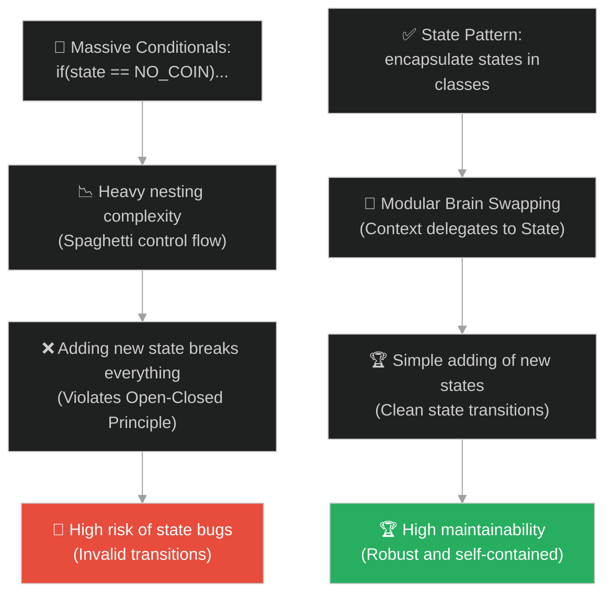
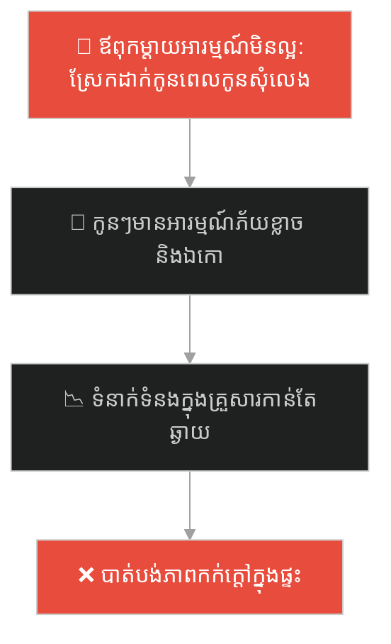
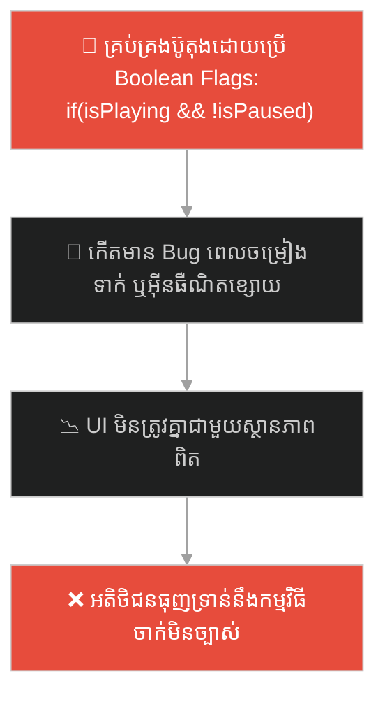
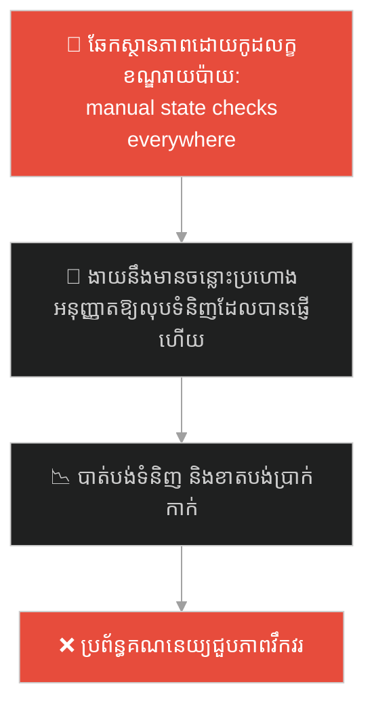
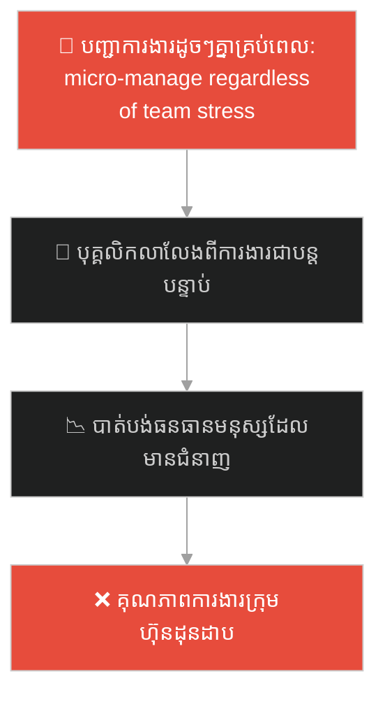
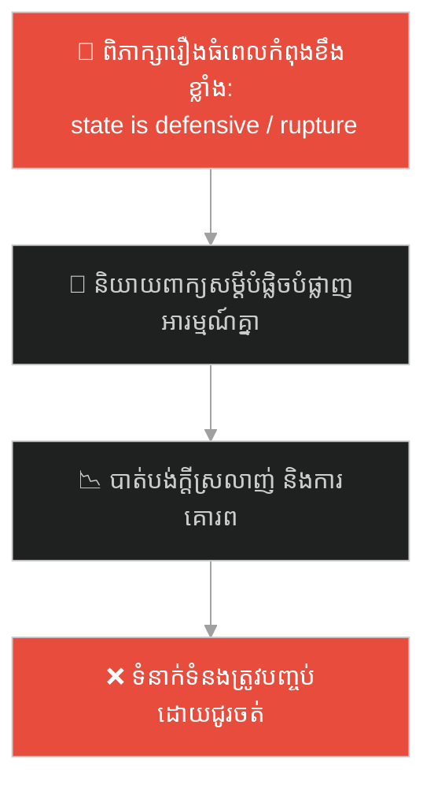
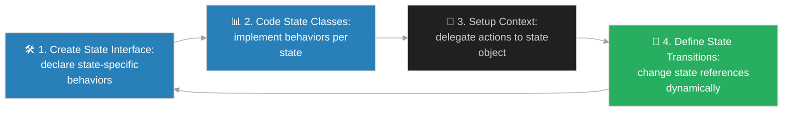

# State Design Pattern (លំនាំរចនាម៉ាស៊ីនស្ថានភាព)៖ ម៉ាស៊ីនលក់ភេសជ្ជៈវេទមន្ត (State Pattern & The Magic Vending Machine)

**Author:** ichamrong  
**Date:** 2026-05-28  
**Tags:** #design-patterns #state #architecture #software-engineering #parable  
**Category:** Concepts / Parables  
**Read Time:** ~15 min  

---

## 📌 មាតិកា (Table of Contents)
- [អន្ទាក់ផ្លូវចិត្ត (The Trap)](#0)
- [១. រឿងព្រេងប្រវត្តិសាស្ត្រ៖ ម៉ាស៊ីនលក់ភេសជ្ជៈ និងប្រព័ន្ធខួរក្បាល If-Else ដ៏ស្មុគស្មាញ (The Legend of the If-Else Vending Machine)](#1)
  - [ការផ្លាស់ប្តូរខួរក្បាលរបស់ម៉ាស៊ីនតាមស្ថានភាព (Swapping the State Brains)](#1-1)
- [២. បញ្ហា៖ កូដលក្ខខណ្ឌដ៏វែងអន្លាយ និងភាពលំបាកក្នុងការបន្ថែមស្ថានភាពថ្មី (The Issue: Massive Conditionals and Fragile State Transitions)](#2)
- [៣. ឧទាហមណ៍ជាក់ស្តែងក្នុងពិភពពិត (Real World Examples)](#3)
  - [ឧទាហរណ៍ទី ១ — កម្រិតស្រាល (គ្រួសារ)៖ ការផ្លាស់ប្តូរឥរិយាបថរបស់ឪពុកម្តាយតាមអារម្មណ៍ (Parental Mood-Based Reactivity)](#3-1)
  - [ឧទាហរណ៍ទី ២ — កម្រិតមធ្យម (បច្ចេកទេស)៖ ការអនុវត្ត State Machine ក្នុង Media Player (Audio/Video Player State Controls)](#3-2)
  - [ឧទាហរណ៍ទី ៣ — កម្រិតមធ្យម (ធុរកិច្ច)៖ ការផ្លាស់ប្តូរស្ថានភាពការបញ្ជាទិញទំនិញ (Order Lifecycle States in e-Commerce Logistics)](#3-3)
  - [ឧទាហរណ៍ទី ៤ — កម្រិតមធ្យម (សង្គម/គ្រប់គ្រង)៖ ស្ថានភាពសីលធម៌ និងផលិតភាពការងាររបស់ក្រុមការងារ (Team Morale and Productivity Cycles)](#3-4)
  - [ឧទាហរណ៍ទី ៥ — កម្រិតធ្ងន់ (ទំនាក់ទំនង)៖ ស្ថានភាពជឿជាក់ និងការបើកចំហចិត្តរវាងដៃគូ (Emotional Trust and Openness States in Partnership)](#3-5)
- [៤. ដំណោះស្រាយទូទៅ៖ ការអនុវត្ត State Pattern ជាមួយ Context-State Delegation (The General Solution: State Pattern with Modular State Classes)](#4)
- [សេចក្តីសន្និដ្ឋាន (Conclusion)](#5)
- [ឯកសារយោង (References)](#6)
- [Related Posts](#7)

---

<a id="0"></a>
## អន្ទាក់ផ្លូវចិត្ត (The Trap)

តើអ្នកធ្លាប់ជួបបញ្ហាដែល Class មួយមានអាកប្បកិរិយា ឬប្រតិកម្មខុសគ្នាស្រឡះ ទៅតាមស្ថានភាពបច្ចុប្បន្ន (Internal State) របស់វា ហើយអ្នកបានជ្រើសរើសការដោះស្រាយដោយសរសេរលក្ខខណ្ឌ `if-else` ឬ `switch-case` ច្រើនជាន់លាយឡំគ្នាដែរឬទេ? កូដបែបនេះងាយនឹងខូចខាតខ្លាំងនៅពេលអ្នកចង់បន្ថែមស្ថានភាព (State) ថ្មី។

នៅក្នុងការអភិវឌ្ឍប្រព័ន្ធ៖
* **យើងងាយនឹងធ្លាក់ក្នុងអន្ទាក់** នៃការប្រើប្រាស់អថេរ Flag (ដូចជា `boolean isPaid`, `boolean isEmpty`) និងសរសេរលក្ខខណ្ឌស្មុគស្មាញដើម្បីគ្រប់គ្រងឥរិយាបថ ដែលនាំឱ្យកើតមានកូដដុះដាលធំទ្រលុកទ្រលាយ (Spaghetti Code) និងពិបាកកែសម្រួល។
* **យើងមើលរំលង** យន្តការ "បំប្លែងស្ថានភាពនីមួយៗឱ្យទៅជា Class ឯករាជ្យ" ដែលជួយឱ្យ Object ដើមអាចផ្លាស់ប្តូរឥរិយាបទរបស់ខ្លួនទាំងស្រុងដោយគ្រាន់តែប្តូរ Reference ទៅកាន់ Object នៃស្ថានភាពបច្ចុប្បន្ន។

ការព្យាយាមគ្រប់គ្រងលំហូរម៉ាស៊ីនស្ថានភាពដោយប្រើតែលក្ខខណ្ឌ `if-else` ហៅថា **អន្ទាក់ម៉ាស៊ីនស្ថានភាពរញ៉េរញ៉ៃ (Conditional State Machine Trap)**។

ដើម្បីយល់ដឹងពីរបៀបបត់បែនឥរិយាបទតាមស្ថានភាព នេះជាផែនទីបង្ហាញផ្លូវ៖
1. **រឿងព្រេងប្រវត្តិសាស្ត្រ (The Historic Legend)** — រឿងរ៉ាវរបស់ម៉ាស៊ីនលក់ភេសជ្ជៈដែលប្រើខួរក្បាល If-Else ដ៏សែនរញ៉េរញ៉ៃ និងដំណោះស្រាយប្តូរខួរក្បាលតាមស្ថានភាពជាក់ស្តែង។
2. **បញ្ហា (The Issue)** — ការវិភាគការរីករាលដាលនៃលក្ខខណ្ឌ `switch-case` ក្នុង OOP និងភាពរឹងរូសនៃការថែទាំកូដ។
3. **ឧទាហរណ៍ជាក់ស្តែងក្នុងពិភពពិត (Real World Examples)** — ពិនិត្យមើលបញ្ហានេះក្នុងកម្រិតគ្រួសារ បច្ចេកវិទ្យា ធុរកិច្ច ការគ្រប់គ្រង និងទំនាក់ទំនង។
4. **ដំណោះស្រាយទូទៅ (The General Solution)** — ការបង្កើត State Pattern ដើម្បីអនុញ្ញាតឱ្យមានការបែងចែកឥរិយាបទតាម Class ស្ថានភាពដាច់ដោយឡែក។



---

<a id="1"></a>
## ១. រឿងព្រេងប្រវត្តិសាស្ត្រ៖ ម៉ាស៊ីនលក់ភេសជ្ជៈ និងប្រព័ន្ធខួរក្បាល If-Else ដ៏ស្មុគស្មាញ (The Legend of the If-Else Vending Machine)

កាលពីព្រេងនាយ នៅក្នុងទីក្រុងបច្ចេកវិទ្យាមួយ មានវិស្វករម្នាក់បានបង្កើតម៉ាស៊ីនលក់ភេសជ្ជៈស្វ័យប្រវត្តដំបូងគេបង្អស់។ ម៉ាស៊ីននេះមានប៊ូតុងបញ្ជាតែមួយគត់គឺ "ទម្លាក់ភេសជ្ជៈ"។

ដើម្បីចាត់ចែងអាកប្បកិរិយារបស់ប៊ូតុងនេះ៖
* វិស្វករបានសរសេរកូដបញ្ជាដ៏ស្មុគស្មាញមួយនៅក្នុង "ប្រអប់ខួរក្បាល" របស់ម៉ាស៊ីន៖ *"ប្រសិនបើ ម៉ាស៊ីនគ្មានកាក់ ពេលចុចត្រូវស្រែកប្រកាសថា 'សូមទម្លាក់កាក់ជាមុនសិន'។ ប្រសិនបើ ម៉ាស៊ីនមានកាក់ ត្រូវទម្លាក់ទឹកភេសជ្ជៈមួយកំប៉ុង រួចផ្លាស់ប្តូរទៅជាគ្មានកាក់។ ប្រសិនបើ ម៉ាស៊ីនអស់ទឹក ត្រូវលោតភ្លើងក្រហម 'ទឹកអស់ហើយ'..."*
* ដំបូងឡើយ ម៉ាស៊ីននេះដំណើរការបានល្អ។ ប៉ុន្តែនៅពេលម្ចាស់ហាងចង់បន្ថែមមុខងារ "កំពុងថែទាំ (Maintenance Mode)" ដើម្បីឱ្យជាងបច្ចេកទេសអាចសាកល្បងម៉ាស៊ីនដោយមិនបាច់ទម្លាក់កាក់ វិស្វករត្រូវបើកប្រអប់ខួរក្បាលដ៏ធំ រួចកែសម្រួលលក្ខខណ្ឌ `if-else` រាប់សិបកន្លែង។
* ការកែប្រែដោយចៃដន្យបានធ្វើឱ្យប៉ះពាល់ដល់ប្រព័ន្ធទម្លាក់ទឹកធម្មតា បង្កើតឱ្យមានកំហុសបច្ចេកទេស (Bugs) ធ្វើឱ្យម៉ាស៊ីនទម្លាក់ទឹកឥតគិតថ្លៃ ឬលេបកាក់របស់អតិថិជនចោល។ ខួរក្បាលរបស់ម៉ាស៊ីនបានក្លាយជា Spaghetti ដ៏គួរឱ្យខ្លាច។

---

<a id="1-1"></a>
### ការផ្លាស់ប្តូរខួរក្បាលរបស់ម៉ាស៊ីនតាមស្ថានភាព (Swapping the State Brains)

វិស្វករដ៏ឆ្នើមម្នាក់ទៀតបានមកដល់។ គាត់បានសម្រេចចិត្តផ្លាស់ប្តូរការរចនានៃប្រអប់ខួរក្បាលទាំងស្រុង។ គាត់បានលុបចោលរាល់លក្ខខណ្ឌ `if-else` ឬ `switch-case` ទាំងអស់ចេញពីប្រព័ន្ធបញ្ជាស្នូល។

ផ្ទុយទៅវិញ គាត់បានបង្កើត **ប្រអប់ខួរក្បាលតូចៗចំនួន ៣ ដាច់ដោយឡែកពីគ្នា**៖
1. **ខួរក្បាល "ស្ថានភាពគ្មានកាក់" (No Coin State Brain)**
2. **ខួរក្បាល "ស្ថានភាពមានកាក់" (Has Coin State Brain)**
3. **ខួរក្បាល "ស្ថានភាពអស់ទឹក" (Out of Stock State Brain)**

នៅក្នុងខ្លួនរបស់ម៉ាស៊ីន គាត់បានរចនា **រន្ធដោតខួរក្បាលជាសកលតែមួយគត់ (Brain Slot / Context)**។ 
* នៅពេលធម្មតា ម៉ាស៊ីនត្រូវបានដោតភ្ជាប់ជាមួយខួរក្បាល "ស្ថានភាពគ្មានកាក់"។ នៅពេលអតិថិជនចុចប៊ូតុង ខួរក្បាលនេះដឹងខ្លួនឯងថាត្រូវបន្លឺសំឡេងប្រាប់ឱ្យដាក់កាក់។
* នៅពេលអតិថិជនទម្លាក់កាក់ចូល រន្ធដកខួរក្បាលចាស់ចេញភ្លាម រួចដោតខួរក្បាល "ស្ថានភាពមានកាក់" ចូលជំនួសវិញ (State Transition)។
* ឥឡូវនេះ បើអតិថិជនចុចប៊ូតុងដដែល ខួរក្បាលថ្មីនេះនឹងបញ្ជាឱ្យទម្លាក់ទឹកភេសជ្ជៈភ្លាមៗ ដោយមិនបាច់សួរនាំ ឬឆ្លងកាត់លក្ខខណ្ឌ `if` ឡើយ។

នៅពេលចង់បន្ថែម "ស្ថានភាពកំពុងថែទាំ" ពួកគេគ្រាន់តែបង្កើតប្រអប់ខួរក្បាលទី ៤ ថ្មីមួយដាច់ដោយឡែក រួចកំណត់ពេលដោតវាចូល ដោយមិនបាច់ប៉ះពាល់ដល់ខួរក្បាល ៣ ចាស់ទាល់តែសោះ។ អាកប្បកិរិយារបស់ម៉ាស៊ីនផ្លាស់ប្តូរទៅតាម "ខួរក្បាលដែលដោតភ្ជាប់" យ៉ាងរលូន។

---

<a id="2"></a>
## ២. បញ្ហា៖ កូដលក្ខខណ្ឌដ៏វែងអន្លាយ និងភាពលំបាកក្នុងការបន្ថែមស្ថានភាពថ្មី (The Issue: Massive Conditionals and Fragile State Transitions)

នៅក្នុងការសរសេរកម្មវិធី OOP ភាពជំពាក់ជំពិននេះកើតឡើងនៅពេលយើងព្យាយាមគ្រប់គ្រងរាល់ State ទាំងអស់ដោយប្រើអថេរ Enums នៅក្នុង Class តែមួយ៖

```java
// កូដដែលគ្មាន State Pattern គឺពឹងផ្អែកលើ Enum និង If/Else ដ៏ធំ
public class Document {
    public enum State { DRAFT, MODERATION, PUBLISHED }
    private State state = State.DRAFT;

    public void publish() {
        if (state == State.DRAFT) {
            state = State.MODERATION; // ប្តូរទៅ Moderation
        } else if (state == State.MODERATION) {
            state = State.PUBLISHED; // ប្តូរទៅ Published
        } else if (state == State.PUBLISHED) {
            // គ្មានអ្វីកើតឡើង
        }
    }
    
    public void reject() {
        if (state == State.MODERATION) {
            state = State.DRAFT;
        }
        // ... លក្ខខណ្ឌកើនឡើងជាលំដាប់រាល់ពេលមាន Method ថ្មី
    }
}
```

* **ការបំពានគោលការណ៍ Single Responsibility Principle (SRP)៖** Class តែមួយត្រូវគ្រប់គ្រងរាល់ឥរិយាបថ និងលក្ខខណ្ឌផ្លាស់ប្តូររបស់រាល់ State ទាំងអស់។
* **ការបំពានគោលការណ៍ Open-Closed Principle (OCP)៖** រាល់ពេលចង់បន្ថែម State ថ្មី (ដូចជា `ARCHIVED`) យើងត្រូវកែប្រែកូដនៅក្នុងរាល់ Method ទាំងអស់នៃ Document Class។

**State Design Pattern** ដោះស្រាយបញ្ហានេះដោយបង្កើត `State Interface` រួចអនុវត្ត Class ដាច់ដោយឡែកសម្រាប់ State នីមួយៗ (ដូចជា `DraftState`, `PublishedState`)។ Document Class (Context) គ្រាន់តែរក្សារន្ធដោត `State state` ហើយរាល់ពេលមានការហៅសកម្មភាព វានឹងរុញការងារទៅឱ្យ `state.publish(this)` ឬ `state.reject(this)`។

---

<a id="3"></a>
## ៣. ឧទាហរណ៍ជាក់ស្តែងក្នុងពិភពពិត

---

<a id="3-1"></a>
### ឧទាហរណ៍ទី ១ — កម្រិតស្រាល (គ្រួសារ)៖ ការផ្លាស់ប្តូរឥរិយាបថរបស់ឪពុកម្តាយតាមអារម្មណ៍ (Parental Mood-Based Reactivity)

នៅក្នុងគ្រួសារមួយ ឥរិយាបថរបស់ឪពុកម្តាយចំពោះសំណើរបស់កូនៗ (ដូចជា សុំលុយទៅទិញរបស់លេង) គឺប្រែប្រួលទាំងស្រុងទៅតាម "ស្ថានភាពអារម្មណ៍ (State)" របស់ពួកគាត់។ ប្រសិនបើពួកគាត់ស្ថិតក្នុង "ស្ថានភាពអារម្មណ៍រីករាយ" ពួកគាត់នឹងយល់ព្រមភ្លាម។ ផ្ទុយទៅវិញ បើស្ថិតក្នុង "ស្ថានភាពហត់នឿយ/ខឹង" សំណើដដែលនោះនឹងត្រូវបដិសេធភ្លាម។ កូនៗដែលឆ្លាតតែងសង្កេតមើល "State" របស់ឪពុកម្តាយជាមុនសិន ទើបសម្រេចចិត្តសួរនាំ។



ការដឹងពីស្ថានភាពអារម្មណ៍ជួយសម្រួលទំនាក់ទំនងឱ្យមានភាពទន់ភ្លន់ និងយោគយល់។

---

<a id="3-2"></a>
### ឧទាហរណ៍ទី ២ — កម្រិតមធ្យម (បច្ចេកទេស)៖ ការអនុវត្ត State Machine ក្នុង Media Player (Audio/Video Player State Controls)

នៅក្នុងកម្មវិធីចាក់ចម្រៀង (ដូចជា Spotify, YouTube) ប៊ូតុង "ចុច Play/Pause" មានឥរិយាបថខុសគ្នាស្រឡះទៅតាមស្ថានភាពកម្មវិធី។ ប្រសិនបើស្ថិតក្នុង `ReadyState` ការចុចប៊ូតុងនឹងចាប់ផ្តើមចាក់ចម្រៀង និងប្តូរទៅ `PlayingState`។ បើស្ថិតក្នុង `PlayingState` ការចុចប៊ូតុងដដែលនោះ នឹងធ្វើឱ្យផ្អាកចម្រៀង និងប្តូរទៅ `PausedState`។ វិស្វករប្រើប្រាស់ State Pattern ដើម្បីចៀសវាងការសរសេរកូដ `if(isPlaying) ... else ...` ដ៏សែនច្របូកច្របូល។



---

<a id="3-3"></a>
### ឧទាហរណ៍ទី ៣ — កម្រិតមធ្យម (ធុរកិច្ច)៖ ការផ្លាស់ប្តូរស្ថានភាពការបញ្ជាទិញទំនិញ (Order Lifecycle States in e-Commerce Logistics)

នៅក្នុងប្រព័ន្ធគ្រប់គ្រងការបញ្ជាទិញ (Order Processing System) ការបញ្ជាទិញនីមួយៗឆ្លងកាត់ស្ថានភាពជាច្រើន៖ `Ordered` -> `Paid` -> `Shipped` -> `Delivered`។ សកម្មភាព "លុបចោលការបញ្ជាទិញ (Cancel Order)" គឺត្រូវបានអនុញ្ញាត និងដំណើរការដោយជោគជ័យលុះត្រាតែស្ថិតក្នុងស្ថានភាព `Ordered` ឬ `Paid` ប៉ុណ្ណោះ។ បើសិនជាទំនិញត្រូវបានផ្ញើចេញរួចហើយ (`Shipped`) សកម្មភាព Cancel នឹងត្រូវបដិសេធ។ ក្រុមហ៊ុនប្រើប្រាស់ State Classes ដើម្បីធានាសុវត្ថិភាពច្បាប់អាជីវកម្ម។



---

<a id="3-4"></a>
### ឧទាហរណ៍ទី ៤ — កម្រិតមធ្យម (សង្គម/គ្រប់គ្រង)៖ ស្ថានភាពសីលធម៌ និងផលិតភាពការងាររបស់ក្រុមការងារ (Team Morale and Productivity Cycles)

នៅក្នុងការគ្រប់គ្រងស្ថាប័ន ក្រុមការងារតែងតែឆ្លងកាត់ស្ថានភាពផ្សេងៗគ្នា៖ `High Morale` (ផលិតភាពការងារខ្ពស់ និងរំភើប), `Burnout` (ហត់នឿយ និងយឺតយ៉ាវ), ឬ `Anxiety` (បារម្ភពីស្ថិរភាពការងារ)។ ប្រធានដឹកនាំដែលមានប្រាជ្ញា (Manager) មិនប្រើប្រាស់វិធីសាស្ត្របញ្ជាដដែលៗឡើយ។ នៅពេលក្រុមស្ថិតក្នុងស្ថានភាព `Burnout` គាត់នឹងប្រើប្រាស់ "យុទ្ធសាស្ត្រថែទាំ និងសម្រាក"។ នៅពេលក្រុមស្ថិតក្នុងស្ថានភាព `High Morale` គាត់នឹងប្រើ "យុទ្ធសាស្ត្រជំរុញ និងពង្រីកការងារ" ដើម្បីទទួលបានផលិតផលអតិបរមា។



---

<a id="3-5"></a>
### ឧទាហរណ៍ទី ៥ — កម្រិតធ្ងន់ (ទំនាក់ទំនង)៖ ស្ថានភាពជឿជាក់ និងការបើកចំហចិត្តរវាងដៃគូ (Emotional Trust and Openness States in Partnership)

នៅក្នុងទំនាក់ទំនងស្នេហា និងមិត្តភាព ទំនាក់ទំនងតែងតែស្ថិតនៅក្នុងស្ថានភាពផ្សេងៗគ្នា៖ `Deep Trust` (ជឿជាក់ខ្លាំង បើកចំហ និងងាយយល់ចិត្ត), `Defensive` (ការពារខ្លួន មិនទុកចិត្ត និងងាយយល់ច្រឡំ), ឬ `Rupture` (ប្រេះឆា និងបិទចិត្តទាំងស្រុង)។ ការព្យាយាមពិភាក្សាពីរឿងធំៗ ឬអនាគតវែងឆ្ងាយ នៅពេលទំនាក់ទំនងកំពុងស្ថិតក្នុងស្ថានភាព `Defensive` ឬ `Rupture` នឹងនាំទៅរកការឈ្លោះប្រកែកគ្នាកាន់តែខ្លាំង។ ដៃគូដែលយល់ចិត្ត តែងដឹងពីរបៀបនាំយកទំនាក់ទំនងទៅកាន់ស្ថានភាព `Deep Trust` ជាមុនសិន ទើបចាប់ផ្តើមពិភាក្សារឿងសំខាន់ៗ។



---

<a id="4"></a>
## ៤. ដំណោះស្រាយទូទៅ៖ ការអនុវត្ត State Pattern ជាមួយ Context-State Delegation (The General Solution: State Pattern with Modular State Classes)

ដើម្បីផ្លាស់ប្តូរឥរិយាបថរបស់ Object ទៅតាមស្ថានភាពដោយមិនបាច់ប្រើប្រាស់ `if-else` យើងត្រូវអនុវត្តលំនាំរចនា **State Design Pattern**៖



ជំហាននៃការអនុវត្ត៖
1. **បង្កើត State Interface៖** ប្រកាស Method ទាំងអស់ដែលតំណាងឱ្យសកម្មភាពរបស់ Object (ដូចជា `handleInsertCoin()`, `handlePressButton()`)។
2. **បង្កើត Concrete State Classes៖** អនុវត្ត Class ដាច់ដោយឡែកសម្រាប់ស្ថានភាពនីមួយៗ ដោយ Class ទាំងនោះជាអ្នកចាត់ចែងសកម្មភាព និងផ្លាស់ប្តូរស្ថានភាពរបស់ Context ផ្ទាល់ខ្លួន។
3. **រៀបចំ Context Class៖** Object ដើម (ដូចជា VendingMachine) រក្សាទុក Reference ទៅកាន់ `State state` បច្ចុប្បន្ន។ រាល់ពេលមានសកម្មភាព Context គ្រាន់តែហៅ `state.handleAction(this)`។
4. **អនុវត្តការផ្លាស់ប្តូរស្ថានភាព (Transitions)៖** អនុញ្ញាតឱ្យ State Classes បច្ចុប្បន្ន ដូរ Reference របស់ Context ទៅកាន់ State ថ្មី នៅពេលលក្ខខណ្ឌផ្លាស់ប្តូរត្រូវបានបំពេញ ធានាបាននូវលំហូរស្ថានភាពរលូន និងស្អាតស្អំ។

---

## 🐇 ធ្លាក់ចូលក្នុងរន្ធទន្សាយ (Enter the Rabbit Hole)

ដើម្បីស្វែងយល់ពីរបៀបដែលមេចុងភៅដ៏ល្បីល្បាញ ឬស្ថាបត្យករប្រព័ន្ធ បានបង្កើតរចនាសម្ព័ន្ធការងារជាជំហានៗដ៏រឹងមាំមួយ ដែលអនុញ្ញាតឱ្យសមាជិកផ្សេងទៀតអាចបំពេញព័ត៌មានលម្អិតនៃជំហាននីមួយៗ ដោយមិនអាចផ្លាស់ប្តូរលំដាប់លំដៅការងាររួមបានឡើយ (Template Method Pattern) សូមបន្តដំណើរទៅកាន់៖

* 🚀 **[ចាប់ផ្តើមដំណើររុករក (Start the Journey) ➔ Template Method Pattern and Algorithm Customization](./95-the-master-bakers-recipe.md)**

---

<a id="5"></a>
## សេចក្តីសន្និដ្ឋាន (Conclusion)

> **«ការផ្លាស់ប្តូរឥរិយាបថតាមរយៈការប្តូរខួរក្បាល គឺប្រសើរជាងការបង្ខិតបង្ខំខួរក្បាលមួយឱ្យស៊ូទ្រាំនឹងរាល់លក្ខខណ្ឌទាំងអស់»**

ការប្រើប្រាស់ State Design Pattern ជួយផ្ដាច់កូដស្មុគស្មាញនៃលក្ខខណ្ឌចេញពី Class ដើម ជួយឱ្យកូដរបស់អ្នកងាយស្រួលអាន ងាយស្រួលធ្វើតេស្ត (Unit Test) និងមានលទ្ធភាពពង្រីកខ្ពស់ (Open-Closed Principle) ធានាឱ្យប្រព័ន្ធរបស់អ្នកវិវឌ្ឍទៅមុខដោយរលូន និងគ្មានភាពរឹងរូសឡើយ។

---

<a id="6"></a>
## ឯកសារយោង (References)

* **Gamma, E., Helm, R., Johnson, R., & Vlissides, J.** — *Design Patterns: Elements of Reusable Object-Oriented Software* (1994). State pattern specifications and context state machines.
* **Freeman, E., & Robson, E.** — *Head First Design Patterns* (2004). Simplifying complex state conditionals using decoupled state classes.

---

<a id="7"></a>
## Related Posts

* [[Behavioral Patterns: State](../../clean-code/design-patterns/03-behavioral-patterns.md#8-state)] — ការពន្យល់លម្អិតអំពីលំនាំរចនាម៉ាស៊ីនស្ថានភាព។
* [[Command Design Pattern & The Waiter's Order Pad](./93-the-waiters-order-pad.md)] — របៀបបម្លែងសកម្មភាពបញ្ជាជាវត្ថុឯករាជ្យ ដែលអាចប្រើរួមជាមួយម៉ាស៊ីនស្ថានភាព។
