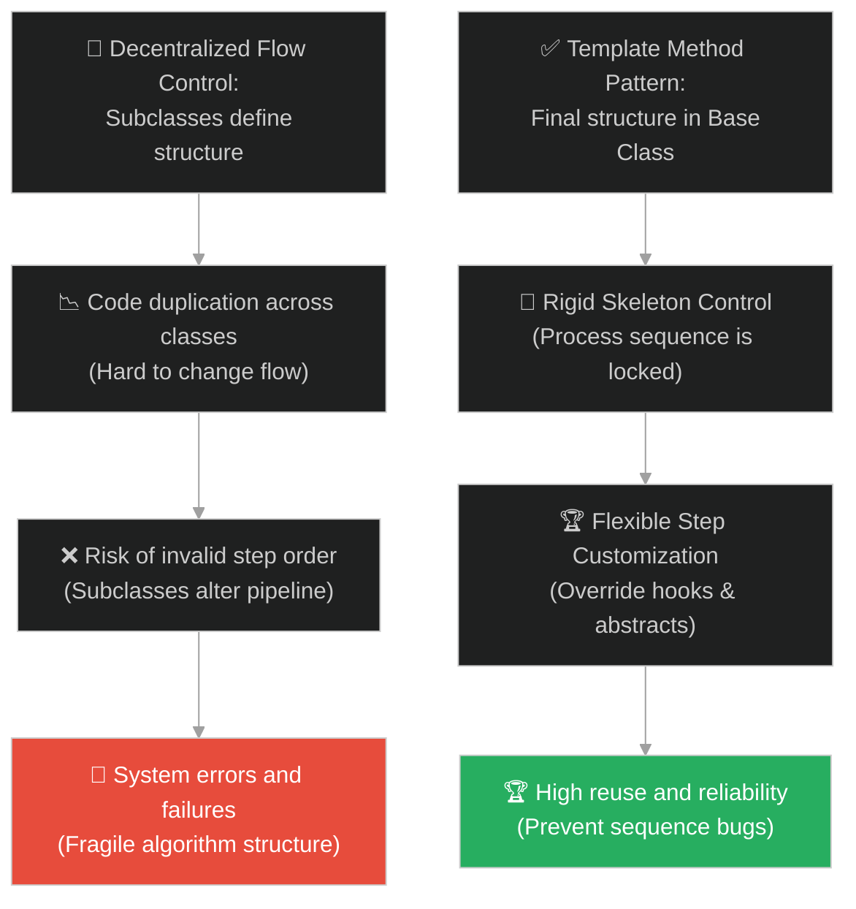
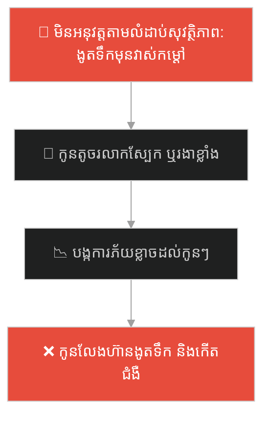
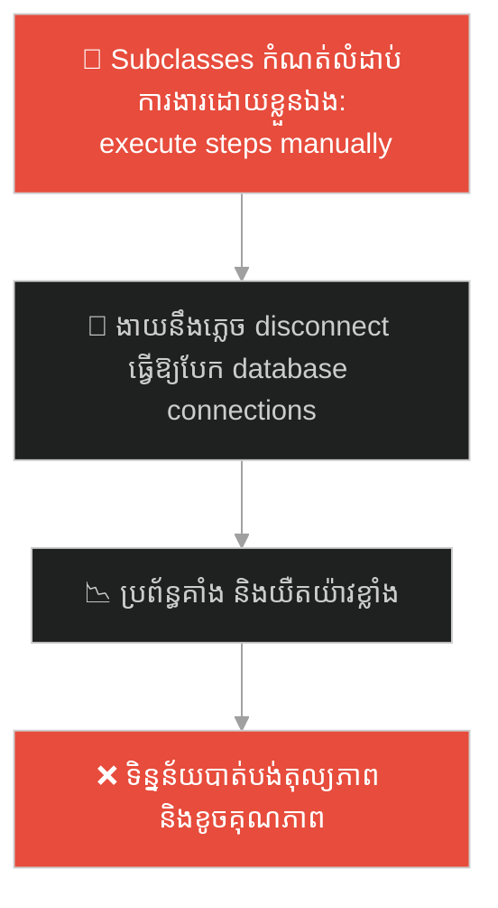
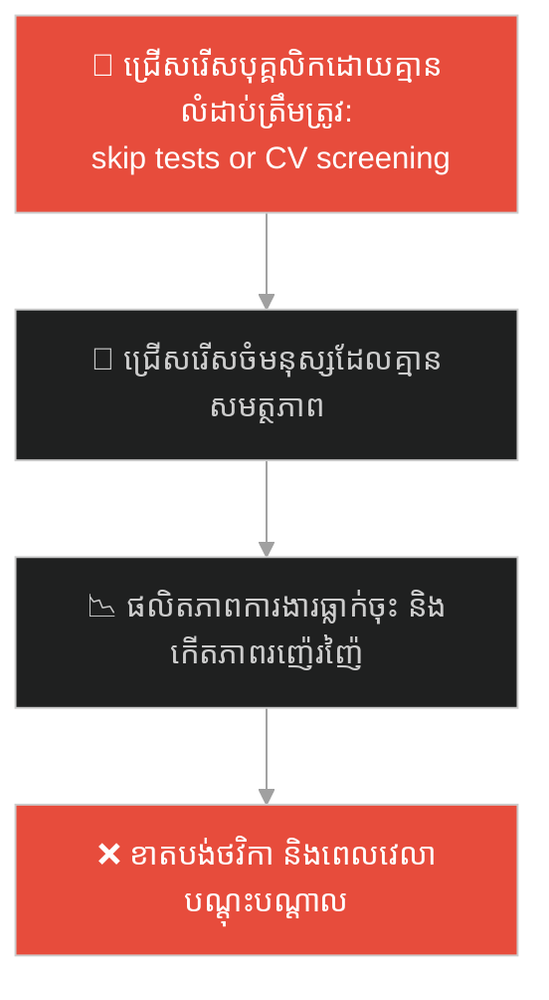
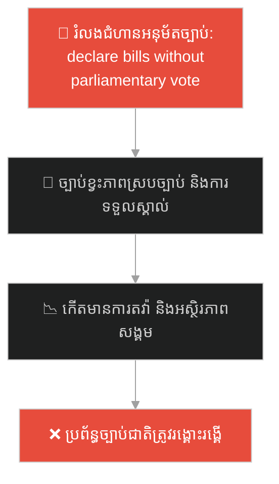
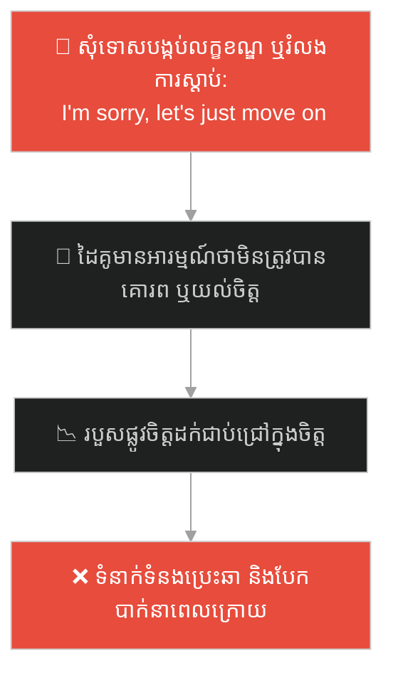
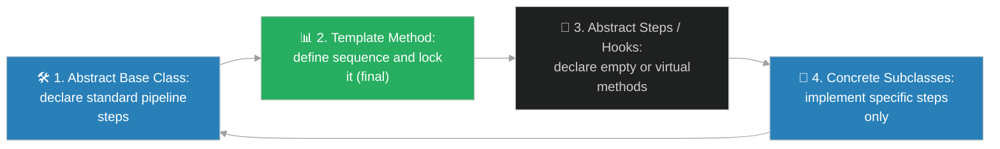

# Template Method Design Pattern (លំនាំរចនាវិធីសាស្ត្រគំរូ)៖ រូបមន្តធ្វើនំរបស់មេចុងភៅ (Template Method Pattern & The Master Baker's Recipe)

**Author:** ichamrong  
**Date:** 2026-05-28  
**Tags:** #design-patterns #template-method #architecture #software-engineering #parable  
**Category:** Concepts / Parables  
**Read Time:** ~15 min  

---

## 📌 មាតិកា (Table of Contents)
- [អន្ទាក់ផ្លូវចិត្ត (The Trap)](#0)
- [១. រឿងព្រេងប្រវត្តិសាស្ត្រ៖ សិស្សដែលមិនគោរពលំដាប់លំដោយ និងនំដែលរលាយ (The Legend of the Melted Toppings)](#1)
  - [រូបមន្តចាក់សោររបស់មេចុងភៅ (The Master's Locked Algorithm Structure)](#1-1)
- [២. បញ្ហា៖ ការចម្លងកូដរាយប៉ាយ និងអវត្តមាននៃការគ្រប់គ្រងលំហូរ (The Issue: Code Duplication and Vulnerable Process Flow)](#2)
- [៣. ឧទាហមណ៍ជាក់ស្តែងក្នុងពិភពពិត (Real World Examples)](#3)
  - [ឧទាហរណ៍ទី ១ — កម្រិតស្រាល (គ្រួសារ)៖ ជំហាននៃការងូតទឹកឱ្យកូនតូចប្រកបដោយសុវត្ថិភាព (Bath Time Routine for Toddlers)](#3-1)
  - [ឧទាហរណ៍ទី ២ — កម្រិតមធ្យម (បច្ចេកទេស)៖ ការកសាង Data Pipeline (Data Extraction, Transformation, and Loading - ETL)](#3-2)
  - [ឧទាហរណ៍ទី ៣ — កម្រិតមធ្យម (ធុរកិច្ច)៖ ជំហានស្វែងរក និងជ្រើសរើសបុគ្គលិករបស់ក្រុមហ៊ុន (Structured Employee Recruitment Pipeline)](#3-3)
  - [ឧទាហរណ៍ទី ៤ — កម្រិតមធ្យម (សង្គម/គ្រប់គ្រង)៖ ដំណើរការនៃការបង្កើត និងអនុម័តច្បាប់ (Legislative Bill Approval Process)](#3-4)
  - [ឧទាហរណ៍ទី ៥ — កម្រិតធ្ងន់ (ទំនាក់ទំនង)៖ ជំហានស្ដារទំនុកចិត្ត និងផ្សះផ្សាក្រោយមានការយល់ច្រឡំ (Conflict Resolution and Reconciliation Sequence)](#3-5)
- [៤. ដំណោះស្រាយទូទៅ៖ ការអនុវត្ត Template Method Pattern ជាមួយ Final Base Algorithms (The General Solution: Template Method with Rigid Flow and Flexible Steps)](#4)
- [សេចក្តីសន្និដ្ឋាន (Conclusion)](#5)
- [ឯកសារយោង (References)](#6)
- [Related Posts](#7)

---

<a id="0"></a>
## អន្ទាក់ផ្លូវចិត្ត (The Trap)

តើអ្នកធ្លាប់ជួបបញ្ហាដែល Class ផ្សេងៗគ្នាមានលំហូរប្រតិបត្តិការ (Algorithm Steps) ដូចគ្នាទាំងស្រុង ប៉ុន្តែជំហានលម្អិតខ្លះមានលក្ខណៈខុសប្លែកគ្នា ធ្វើឱ្យអ្នកត្រូវបង្ខំចិត្តចម្លងកូដរចនាសម្ព័ន្ធរួមដដែលៗ (Code Duplication) ដែរឬទេ? លើសពីនេះ វាងាយនឹងមាននរណាម្នាក់កែប្រែលំដាប់លំដៅការងារស្នូល ដែលធ្វើឱ្យប្រព័ន្ធទាំងមូលត្រូវខូចខាត។

នៅក្នុងការអភិវឌ្ឍប្រព័ន្ធ៖
* **យើងងាយនឹងធ្លាក់ក្នុងអន្ទាក់** នៃការបណ្តោយឱ្យ Subclass គ្រប់គ្រង និងអនុវត្តរចនាសម្ព័ន្ធលំហូរការងារដោយខ្លួនឯងទាំងស្រុង ដែលនាំឱ្យកើតមានការសរសេរកូដស្ទួនគ្នានៃជំហានដដែលៗ និងងាយនឹងបង្កកំហុសនៅពេលនរណាម្នាក់លួចផ្លាស់ប្តូរលំដាប់ការងារ។
* **យើងមើលរំលង** យន្តការ "កំណត់ និងចាក់សោរលំហូរការងារស្នូលនៅក្នុង Base Class" ហើយអនុញ្ញាតឱ្យ Subclasses កែសម្រួលតែជំហានជាក់លាក់មួយចំនួនដែលត្រូវការបត់បែនប៉ុណ្ណោះ។

ការព្យាយាមទុកឱ្យ Subclass អនុវត្ត និងផ្លាស់ប្តូរលំហូររួមដោយសេរី ហៅថា **អន្ទាក់បំពានលំដាប់លំហូរការងារ (Algorithm Structure Fragmentation Trap)**។

ដើម្បីយល់ដឹងពីរបៀបបង្កើតរចនាសម្ព័ន្ធការងារដ៏រឹងមាំ នេះជាផែនទីបង្ហាញផ្លូវ៖
1. **រឿងព្រេងប្រវត្តិសាស្ត្រ (The Historic Legend)** — រឿងរ៉ាវរបស់សិស្សធ្វើនំដែលកែប្រែជំហានតាមចិត្តចង់ ធ្វើឱ្យនំខូចគុណភាព និងដំណោះស្រាយចាក់សោររូបមន្តរបស់មេចុងភៅ។
2. **បញ្ហា (The Issue)** — ការវិភាគភាពស្ទួនគ្នានៃកូដ និងគ្រោះថ្នាក់នៃការបាត់បង់ការគ្រប់គ្រងលំដាប់ការងារក្នុង OOP។
3. **ឧទាហរណ៍ជាក់ស្តែងក្នុងពិភពពិត (Real World Examples)** — ពិនិត្យមើលបញ្ហានេះក្នុងកម្រិតគ្រួសារ បច្ចេកវិទ្យា ធុរកិច្ច ការគ្រប់គ្រង និងទំនាក់ទំនង។
4. **ដំណោះស្រាយទូទៅ (The General Solution)** — ការបង្កើត Template Method Pattern ដើម្បីចាក់សោរទម្រង់ការងារ និងបើកទ្វារឱ្យបត់បែនជំហានជាក់លាក់។



---

<a id="1"></a>
## ១. រឿងព្រេងប្រវត្តិសាស្ត្រ៖ សិស្សដែលមិនគោរពលំដាប់លំដោយ និងនំដែលរលាយ (The Legend of the Melted Toppings)

កាលពីព្រេងនាយ មានសាលាបង្រៀនធ្វើនំដ៏ល្បីល្បាញមួយ។ មេចុងភៅដ៏ចំណានម្នាក់បានបង្រៀនសិស្សពីរបៀបធ្វើនំខេក។ គាត់បានពន្យល់ថា ការធ្វើនំខេកមាន ៣ ជំហានដាច់ខាត៖
1. **លាយម្សៅ (Dough Mixing)**
2. **ដុតក្នុងឡ (Baking)**
3. **តុបតែងមុខនំ (Topping/Decorating)**

ដំបូងឡើយ៖
* មេចុងភៅបានទុកសេរីភាពឱ្យសិស្សម្នាក់ៗយកជំហានទាំងនេះទៅអនុវត្តដោយខ្លួនឯង។
* សិស្សទីមួយចង់ធ្វើនំស្ត្របឺរី គាត់បានយកម្សៅលាយជាមួយស្ត្របឺរីស្រស់ រួចដុតវា។ លទ្ធផលគឺ ស្ត្របឺរីឡើងរលួយ និងបាត់បង់រសជាតិអស់។
* សិស្សទីពីរចង់ធ្វើនំសូកូឡា គាត់កាន់តែប្លែក៖ គាត់បានចាក់គ្រីមសូកូឡាតុបតែងលើម្សៅឆៅជាមុន រួចទើបយកទៅដាក់ក្នុងឡដុត។ កម្តៅឡដ៏ក្តៅបានធ្វើឱ្យគ្រីមសូកូឡារលាយ និងឆេះខ្លោច ចេញមកជាកំទេចខ្មៅៗ ញ៉ាំមិនកើតឡើយ។
* នំខេកទាំងអស់ខូចគុណភាពទាំងស្រុង ព្រោះសិស្សអាចផ្លាស់ប្តូរ **លំដាប់លំដោយនៃការអនុវត្ត (Process Structure)** តាមតែចិត្តរបស់ពួកគេ។

---

<a id="1-1"></a>
### រូបមន្តចាក់សោររបស់មេចុងភៅ (The Master's Locked Algorithm Structure)

ដើម្បីដោះស្រាយបញ្ហានេះ មេចុងភៅបានផ្លាស់ប្តូរវិធីសាស្ត្របង្រៀន។ គាត់បានបង្កើត **ក្តាររូបមន្តមាសចាក់សោរ (The Locked Template Card)** មួយព្យួរលើជញ្ជាំង។

នៅលើក្តារនោះ គាត់បានកំណត់លំហូរការងារយ៉ាងច្បាស់លាស់ និងមិនអាចកែប្រែបានឡើយ៖
* **Method ធ្វើនំ (Final Algorithm):** ត្រូវតែដំណើរការ `លាយម្សៅ` -> បន្ទាប់មក `ដកយកទៅដុត` -> បន្ទាប់មក `តុបតែង`។
* ជំហាន `លាយម្សៅ` និង `ដុត` គឺត្រូវបានធ្វើឡើងតាមរូបមន្តស្តង់ដារ និងចាក់សោរមិនឱ្យសិស្សកែប្រែឡើយ (Protected/Locked Steps)។
* ប៉ុន្តែត្រង់ជំហាន `តុបតែង` គាត់បានទុកជាចន្លោះទទេ (Abstract Hole) ដើម្បីឱ្យសិស្សសរសេរផ្ទាល់ខ្លួនបាន។

ឥឡូវនេះ៖
* សិស្សទីមួយធ្វើនំស្ត្របឺរី គ្រាន់តែបំពេញកន្លែងទំនេរជំហានតុបតែងថា *"ដាក់ស្ត្របឺរីស្រស់ពីលើ"*។
* សិស្សទីពីរធ្វើនំសូកូឡា គ្រាន់តែបំពេញកន្លែងទំនេរថា *"ស្រោចទឹកសូកូឡាពីលើ"*។

នៅពេលពួកគេចាប់ផ្តើមធ្វើនំ ប្រព័ន្ធការងាររបស់សាលានឹងដំណើរការ លាយម្សៅ និង ដុត យ៉ាងត្រឹមត្រូវតាមក្បួនខ្នាតរបស់មេចុងភៅ រួចហៅសកម្មភាពតុបតែងផ្ទាល់ខ្លួនរបស់សិស្សនៅជំហានចុងក្រោយដោយស្វ័យប្រវត្ត។ នំទាំងអស់ចេញមកមានគុណភាពខ្ពស់ និងស្រស់ស្អាតជាទីបំផុត។

---

<a id="2"></a>
## ២. បញ្ហា៖ ការចម្លងកូដរាយប៉ាយ និងអវត្តមាននៃការគ្រប់គ្រងលំហូរ (The Issue: Code Duplication and Vulnerable Process Flow)

នៅក្នុងវិស្វកម្មផ្នែកទន់ ភាពជំពាក់ជំពិននេះកើតឡើងនៅពេលយើងសរសេរ Class ច្រើនដែលបំពេញលំហូរការងារដូចគ្នា ប៉ុន្តែជំហានខ្លះខុសគ្នា៖

```java
// Class ទាំងពីរមាន Algorithm ដូចគ្នាខ្លាំង នាំឱ្យស្ទួនកូដ និងងាយខូចលំដាប់ការងារ
public class PDFDataMiner {
    public void mineData() {
        openFile();
        extractText(); // ជំហានជាក់លាក់សម្រាប់ PDF
        analyzeData();
        closeFile();
    }
}

public class CSVDataMiner {
    public void mineData() {
        openFile();
        extractCSV();  // ជំហានជាក់លាក់សម្រាប់ CSV
        analyzeData();
        closeFile();
    }
}
```

* **ភាពស្ទួនគ្នានៃកូដ (Code Duplication)៖** Method `openFile()`, `analyzeData()` និង `closeFile()` ត្រូវបានសរសេរស្ទួនគ្នាក្នុង Class ទាំងពីរ។ បើថ្ងៃក្រោយចង់ដូររបៀប Analyze យើងត្រូវដើរកែគ្រប់ Class ទាំងអស់។
* **ភាពមិនអាចគ្រប់គ្រងលំដាប់ការងារ (Vulnerable Sequencing)៖** Subclass អាចកែសម្រួលលំហូរដោយចៃដន្យ ដូចជាការវិភាគទិន្នន័យមុនពេលបើក File ដែលនាំឱ្យប្រព័ន្ធគាំង (NullPointerException)។

**Template Method Pattern** ជួយដោះស្រាយបញ្ហានេះដោយបង្កើត Base Class មួយ រួចកំណត់ `Template Method` មួយដែលត្រូវបានចាក់សោរ (`final` ក្នុង Java/C#)។ Method នេះកំណត់លំដាប់លំដៅនៃការហៅជំហាននីមួយៗយ៉ាងតឹងរឹង។ ជំហានណាដែលដូចគ្នាត្រូវបានសរសេរកូដរួចជាស្រេចក្នុង Base Class ចំណែកជំហានណាដែលប្លែក ត្រូវបានប្រកាសជា `abstract` ដើម្បីឱ្យ Subclasses យកទៅបំពេញ។

---

<a id="3"></a>
## ៣. ឧទាហរណ៍ជាក់ស្តែងក្នុងពិភពពិត

---

<a id="3-1"></a>
### ឧទាហរណ៍ទី ១ — កម្រិតស្រាល (គ្រួសារ)៖ ជំហាននៃការងូតទឹកឱ្យកូនតូចប្រកបដោយសុវត្ថិភាព (Bath Time Routine for Toddlers)

នៅក្នុងគ្រួសារមួយ ឪពុកម្តាយត្រូវងូតទឹកឱ្យកូនតូច។ ជំហាននៃសុវត្ថិភាពត្រូវតែមានលំដាប់លំដោយតឹងរឹង៖ `វាស់កម្តៅទឹក` -> `ងូតទឹកដុសសាប៊ូ` -> `ជូតខ្លួនឱ្យស្ងួត` -> `ស្លៀកពាក់`។ ប្រសិនបើមាននរណាម្នាក់ផ្លាស់ប្តូរលំដាប់ (ដូចជា ងូតទឹកមុនវាស់កម្តៅទឹក នាំឱ្យទឹកក្តៅពេក ឬស្លៀកពាក់មុនជូតខ្លួន) វានឹងបង្កគ្រោះថ្នាក់ ឬជំងឺដល់កូន។ ឪពុកម្តាយបានចាក់សោរលំដាប់លំដោយនេះ ហើយគ្រាន់តែអនុញ្ញាតឱ្យកូនជ្រើសរើស "ប្រភេទសាប៊ូ" ឬ "ពណ៌ខោអាវ" តែប៉ុណ្ណោះ។



ការអនុវត្តតាមគំរូការងារច្បាស់លាស់ ធានាបាននូវសុវត្ថិភាព និងភាពកក់ក្តៅដល់កូនតូច។

---

<a id="3-2"></a>
### ឧទាហរណ៍ទី ២ — កម្រិតមធ្យម (បច្ចេកទេស)៖ ការកសាង Data Pipeline (Data Extraction, Transformation, and Loading - ETL)

នៅក្នុងការអភិវឌ្ឍប្រព័ន្ធទិន្នន័យ (Data Engineering) ដំណើរការ ETL តែងតែដំណើរការតាមជំហាន៖ `Connect()` -> `ExtractData()` -> `TransformData()` -> `LoadToDatabase()` -> `Disconnect()`។ រចនាសម្ព័ន្ធនេះត្រូវតែចាក់សោរដើម្បីធានាថា Data មិនរលាយ ឬបាត់បង់ការ Connect។ វិស្វករបានបង្កើត Base Class `DataPipeline` ដែលមាន Template Method `runETL()` និងអនុញ្ញាតឱ្យ Subclasses កែសម្រួលតែជំហាន `TransformData()` ទៅតាមប្រភេទប្រភពទិន្នន័យ (JSON, SQL, CSV) ប៉ុណ្ណោះ។



---

<a id="3-3"></a>
### ឧទាហរណ៍ទី ៣ — កម្រិតមធ្យម (ធុរកិច្ច)៖ ជំហានស្វែងរក និងជ្រើសរើសបុគ្គលិករបស់ក្រុមហ៊ុន (Structured Employee Recruitment Pipeline)

នៅក្នុងនាយកដ្ឋានធនធានមនុស្ស (HR) ដំណើរការជ្រើសរើសបុគ្គលិកត្រូវតែដើរតាមលំដាប់ស្តង់ដារ៖ `ផ្សព្វផ្សាយការងារ` -> `ពិនិត្យ CV` -> `ធ្វើតេស្តសមត្ថភាព` -> `សម្ភាសន៍ផ្ទាល់` -> `ផ្តល់ការងារ (Offer)`។ ប្រសិនបើមាននាយកដ្ឋានណាមួយលោតរំលងជំហាន (ដូចជា សម្ភាសន៍ និងផ្តល់ការងារដោយមិនបានពិនិត្យ CV ឬធ្វើតេស្តសមត្ថភាព) ក្រុមហ៊ុនងាយនឹងទទួលបានបុគ្គលិកដែលគ្មានជំនាញពិតប្រាកដ ឬបំពានច្បាប់ការងារ។ ក្រុមហ៊ុនបានបង្កើតប្រព័ន្ធជ្រើសរើសបុគ្គលិកចាក់សោរលំហូរនេះ គ្រាន់តែអនុញ្ញាតឱ្យនាយកដ្ឋាននីមួយៗកំណត់ "សំណួរតេស្ត" ឬ "លក្ខខណ្ឌសម្ភាសន៍" ដោយខ្លួនឯង។



---

<a id="3-4"></a>
### ឧទាហរណ៍ទី ៤ — កម្រិតមធ្យម (សង្គម/គ្រប់គ្រង)៖ ដំណើរការនៃការបង្កើត និងអនុម័តច្បាប់ (Legislative Bill Approval Process)

នៅក្នុងការគ្រប់គ្រងរដ្ឋបាលសាធារណៈ ការអនុម័តច្បាប់ត្រូវតែដើរតាមជំហានដែលចែងក្នុងរដ្ឋធម្មនុញ្ញ៖ `សរសេរព្រាងច្បាប់` -> `ឆ្លងកាត់ការពិភាក្សាក្នុងរដ្ឋសភា` -> `អនុម័តដោយព្រឹទ្ធសភា` -> `ឡាយព្រះហស្តលេខាដោយព្រះមហាក្សត្រ`។ លំហូរការងារនេះត្រូវបានកំណត់យ៉ាងរឹងមាំ និងមិនអាចផ្លាស់ប្តូរបានឡើយ។ ទោះជាយ៉ាងណា ខ្លឹមសារលម្អិតនៃច្បាប់ (ជំហានអនុវត្តជាក់ស្តែង) គឺអាចត្រូវបានសរសេរខុសៗគ្នាទៅតាមប្រភេទច្បាប់ (ច្បាប់ហិរញ្ញវត្ថុ ច្បាប់បរិស្ថាន)។



---

<a id="3-5"></a>
### ឧទាហរណ៍ទី ៥ — កម្រិតធ្ងន់ (ទំនាក់ទំនង)៖ ជំហានស្ដារទំនុកចិត្ត និងផ្សះផ្សាក្រោយមានការយល់ច្រឡំ (Conflict Resolution and Reconciliation Sequence)

នៅក្នុងទំនាក់ទំនងស៊ីជម្រៅ នៅពេលមានការយល់ច្រឡំ ឬកំហុសឆ្គងកើតឡើង ការផ្សះផ្សាត្រូវការជំហានចិត្តសាស្ត្រដែលមិនអាចរំលងបាន៖ `ស្តាប់ទស្សនៈគ្នាដោយមិនកាត់សម្តី` -> `ទទួលស្គាល់កំហុស និងអារម្មណ៍របស់ដៃគូ` -> `ស្នើសុំការអភ័យទោសដោយស្មោះ` -> `ព្រមព្រៀងគ្នាលើដំណោះស្រាយកែប្រែនាពេលអនាគត`។ ប្រសិនបើដៃគូរំលងជំហាន (ដូចជា សុំទោស និងសុំឱ្យបំភ្លេចចោលភ្លាម ដោយមិនបានស្តាប់ ឬទទួលស្គាល់ការឈឺចាប់របស់ដៃគូ) របួសផ្លូវចិត្តនឹងមិនអាចជាសះស្បើយឡើយ។ យន្តការនេះត្រូវតែដើរតាមលំដាប់លំដោយ ដើម្បីកសាង Deep Trust ឡើងវិញ។



---

<a id="4"></a>
## ៤. ដំណោះស្រាយទូទៅ៖ ការអនុវត្ត Template Method Pattern ជាមួយ Final Base Algorithms (The General Solution: Template Method with Rigid Flow and Flexible Steps)

ដើម្បីការពាររចនាសម្ព័ន្ធការងារស្នូល និងអនុញ្ញាតឱ្យមានការបត់បែនជំហានលម្អិត យើងត្រូវអនុវត្តលំនាំរចនា **Template Method Design Pattern**៖



ជំហាននៃការអនុវត្ត៖
1. **បង្កើត Abstract Base Class៖** ប្រកាសជំហានការងារនីមួយៗជា Method (ដូចជា `stepOne()`, `stepTwo()`)។
2. **បង្កើត Template Method៖** សរសេរ Method មួយដែលកំណត់លំដាប់នៃការហៅ Method ជំហានខាងលើ (ដូចជា `run() { stepOne(); stepTwo(); }`) រួចចាក់សោរវា (`final` keyword) ដើម្បីការពារការកែប្រែដោយ Subclass។
3. **ប្រកាស Abstract Steps & Hooks៖** ជំហានណាដែល Subclasses ត្រូវតែអនុវត្តដោយខ្លួនឯង ត្រូវប្រកាសជា `abstract`។ ជំហានណាដែលមានឥរិយាបថស្តង់ដារ ត្រូវសរសេរកូដលំនាំដើម (Virtual/Hooks) ដើម្បីឱ្យ Subclasses អាច Override តាមតម្រូវការ ឬមិនបាច់ក៏បាន។
4. **បង្កើត Concrete Subclasses៖** Subclasses នីមួយៗគ្រាន់តែដំឡើង (Inherit) ពី Base Class រួចសរសេរបំពេញតែជំហាន Abstract ឬ Hooks ដែលខ្លួនចង់បត់បែន ដោយមិនបាច់បារម្ភពីរចនាសម្ព័ន្ធលំហូរការងាររួមឡើយ។

---

## 🐇 ធ្លាក់ចូលក្នុងរន្ធទន្សាយ (Enter the Rabbit Hole)

ដើម្បីស្វែងយល់ពីរបៀបដែលភ្នាក់ងារពន្ធដាររបស់ព្រះរាជា ឬប្រព័ន្ធប្រតិបត្តិការផ្នែកទន់ អាចដើរពិនិត្យ និងប្រមូលទិន្នន័យពីគ្រប់សមាសភាគផ្សេងៗគ្នា ដោយមិនបាច់ផ្លាស់ប្តូរ ឬសរសេរកូដបន្ថែមនៅក្នុងសមាសភាគទាំងនោះទាល់តែសោះ (Visitor Pattern) សូមបន្តដំណើរទៅកាន់៖

* 🚀 **[ចាប់ផ្តើមដំណើររុករក (Start the Journey) ➔ Visitor Pattern and Double Dispatch Operations](./96-the-royal-tax-collector.md)**

---

<a id="5"></a>
## សេចក្តីសន្និដ្ឋាន (Conclusion)

> **«កំណត់លំហូរការងារឱ្យច្បាស់លាស់ពីខាងលើ ប៉ុន្តែទុកឱ្យផ្នែកខាងក្រោមមានសេរីភាពបំពេញព័ត៌មានលម្អិត»**

ការប្រើប្រាស់ Template Method Design Pattern ជួយលុបបំបាត់ការចម្លងកូដស្ទួនគ្នា ការពារស្ថិរភាពលំហូរការងារស្នូល និងអនុញ្ញាតឱ្យមានភាពបត់បែនខ្ពស់ក្នុងការពង្រីកមុខងារថ្មីៗ ធានាឱ្យប្រព័ន្ធរបស់អ្នកដំណើរការប្រកបដោយរបៀបរៀបរយ និងរឹងមាំបំផុត។

---

<a id="6"></a>
## ឯកសារយោង (References)

* **Gamma, E., Helm, R., Johnson, R., & Vlissides, J.** — *Design Patterns: Elements of Reusable Object-Oriented Software* (1994). Template Method pattern specifications and hook method mechanisms.
* **Martin, R. C.** — *Clean Code: A Handbook of Agile Software Craftsmanship* (2008). Reusing algorithms and avoiding code duplication with structural templates.

---

<a id="7"></a>
## Related Posts

* [[Behavioral Patterns: Template Method](../../clean-code/design-patterns/03-behavioral-patterns.md#9-template-method)] — ការពន្យល់លម្អិតអំពីលំនាំរចនាវិធីសាស្ត្រគំរូ។
* [[State Design Pattern & The Magic Vending Machine](./94-the-magic-vending-machine.md)] — របៀបបត់បែនឥរិយាបទតាមស្ថានភាពរបស់ Object ជំនួសឱ្យការចាក់សោរជំហានការងារ។
