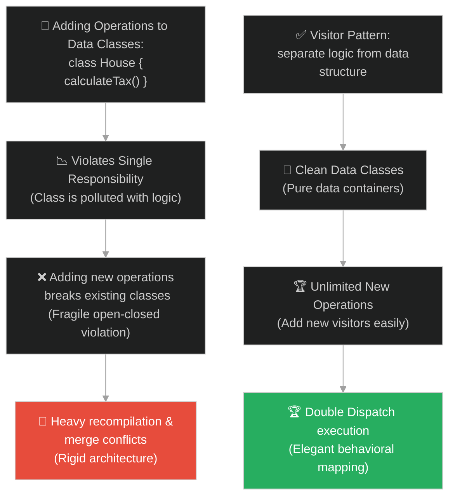
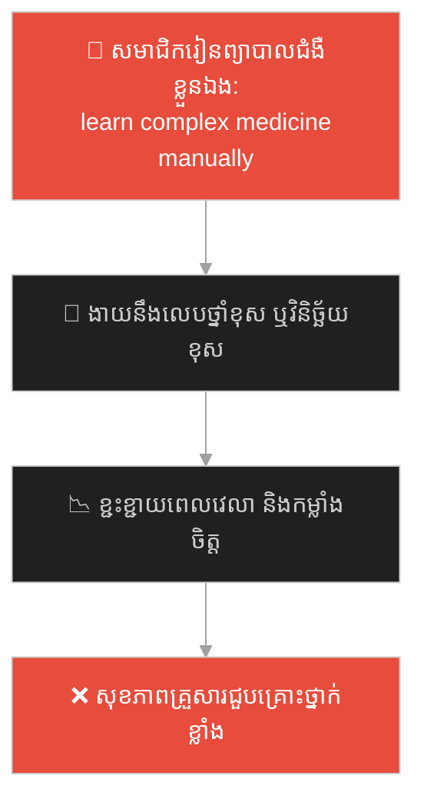
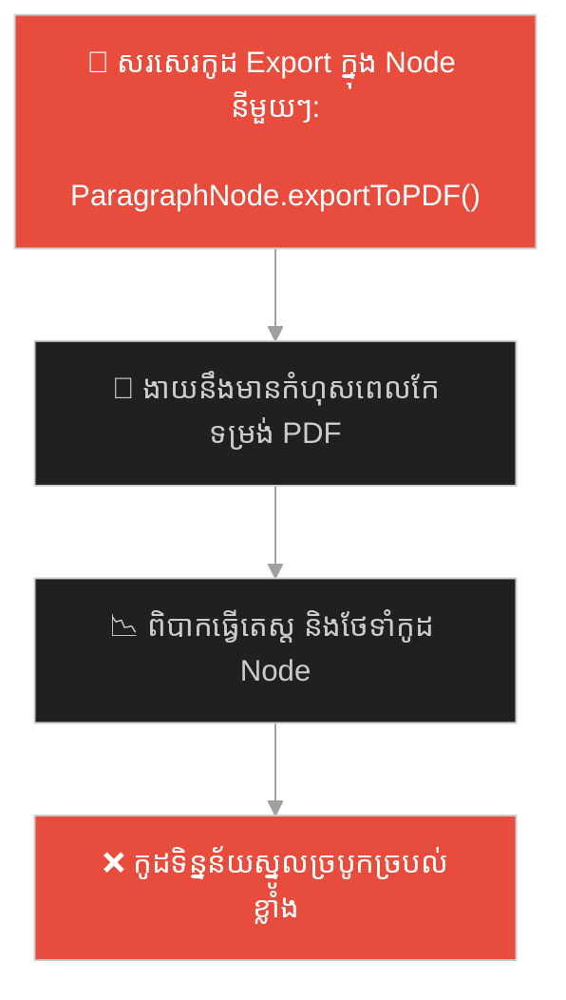
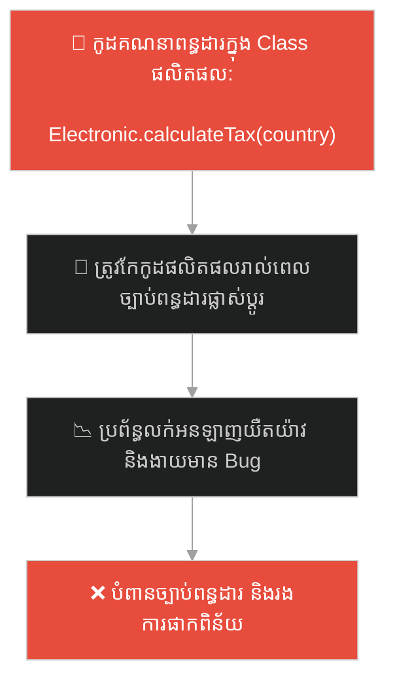
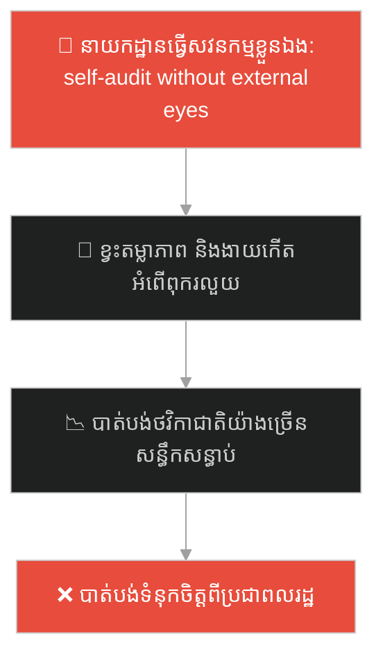
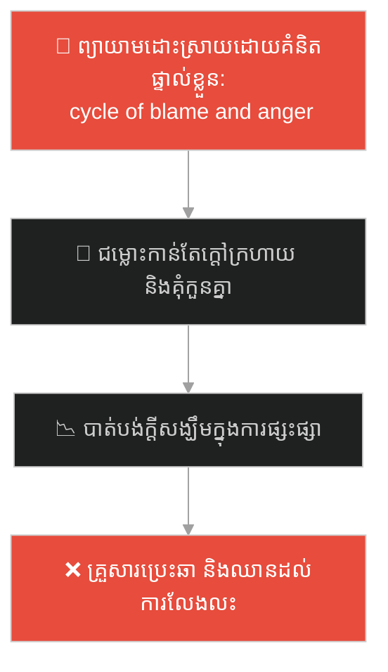
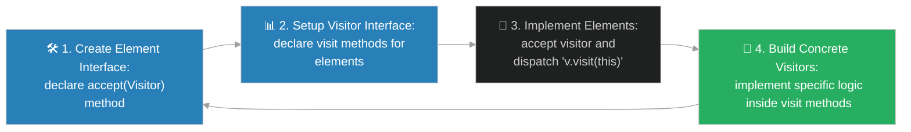

# Visitor Design Pattern (លំនាំរចនាអ្នកទស្សនា)៖ អ្នកប្រមូលពន្ធរាជការ និងរបៀបគោះទ្វារអគារ (Visitor Pattern & The Royal Tax Collector)

**Author:** ichamrong  
**Date:** 2026-05-28  
**Tags:** #design-patterns #visitor #architecture #software-engineering #parable  
**Category:** Concepts / Parables  
**Read Time:** ~15 min  

---

## 📌 មាតិកា (Table of Contents)
- [អន្ទាក់ផ្លូវចិត្ត (The Trap)](#0)
- [១. រឿងព្រេងប្រវត្តិសាស្ត្រ៖ ផ្ទះដែលត្រូវចេះគណនាពន្ធដារ និងក្រុមហ៊ុនធានារ៉ាប់រង (The Legend of Self-Calculating Houses)](#1)
  - [មន្ត្រីពន្ធដារ និងអ្នកទស្សនាមកគោះទ្វារ (The Visit and Accept Double Dispatch Solution)](#1-1)
- [២. បញ្ហា៖ ការបំពានគោលការណ៍ Single Responsibility និងភាពលំបាកក្នុងការបន្ថែមប្រតិបត្តិការ (The Issue: Polluting Data Classes with Behavioral Logic)](#2)
- [៣. ឧទាហមណ៍ជាក់ស្តែងក្នុងពិភពពិត (Real World Examples)](#3)
  - [ឧទាហរណ៍ទី ១ — កម្រិតស្រាល (គ្រួសារ)៖ វេជ្ជបណ្ឌិតចុះពិនិត្យសុខភាពសមាជិកគ្រួសារដល់ផ្ទះ (Mobile Health Check Visitor for Family Members)](#3-1)
  - [ឧទាហរណ៍ទី ២ — កម្រិតមធ្យម (បច្ចេកទេស)៖ ការនាំចេញឯកសារ XML/JSON/PDF ពី Abstract Syntax Tree (Document Exporting from Syntax Trees)](#3-2)
  - [ឧទាហរណ៍ទី ៣ — កម្រិតមធ្យម (ធុរកិច្ច)៖ ការគណនាថ្លៃដឹកជញ្ជូន និងពន្ធលើទំនិញច្រើនប្រភេទ (Customs Duty and Shipping Cost Calculator)](#3-3)
  - [ឧទាហរណ៍ទី ៤ — កម្រិតមធ្យម (សង្គម/គ្រប់គ្រង)៖ ក្រុមសវនករឯករាជ្យចុះវាយតម្លៃនាយកដ្ឋានរដ្ឋ (Independent Auditing Team for State Departments)](#3-4)
  - [ឧទាហរណ៍ទី ៥ — កម្រិតធ្ងន់ (ទំនាក់ទំនង)៖ ទីប្រឹក្សាអាពាហ៍ពិពាហ៍ជួយស្តាប់ និងដោះស្រាយបញ្ហារវាងប្តីប្រពន្ធ (Relationship Counselor Auditing Family Dynamics)](#3-5)
- [៤. ដំណោះស្រាយទូទៅ៖ ការអនុវត្ត Visitor Pattern តាមរយៈ Double Dispatch Mechanics (The General Solution: Visitor Pattern with Element-Visitor Decoupling)](#4)
- [សេចក្តីសន្និដ្ឋាន (Conclusion)](#5)
- [ឯកសារយោង (References)](#6)
- [Related Posts](#7)

---

<a id="0"></a>
## អន្ទាក់ផ្លូវចិត្ត (The Trap)

តើអ្នកធ្លាប់ជួបបញ្ហាដែលត្រូវបន្ថែមមុខងារប្រតិបត្តិការថ្មីៗ (Operations, Reports, Exports) ទៅលើសំណុំនៃ Class ផ្សេងៗគ្នា (Object Structure) ជាញឹកញាប់ ហើយរាល់ពេលបន្ថែម អ្នកត្រូវកែប្រែ ឬសរសេរកូដបន្ថែមទៅក្នុង Class ដើមទាំងនោះដែរឬទេ? ការធ្វើបែបនេះមិនត្រឹមតែបំពានគោលការណ៍ Single Responsibility ប៉ុណ្ណោះទេ ថែមទាំងធ្វើឱ្យកូដទិន្នន័យ (Data Model) ត្រូវកខ្វក់ដោយសារកូដប្រតិបត្តិការក្រៅបរិបទ។

នៅក្នុងការអភិវឌ្ឍប្រព័ន្ធ៖
* **យើងងាយនឹងធ្លាក់ក្នុងអន្ទាក់** នៃការបន្ថែម Method ប្រតិបត្តិការផ្ទាល់ទៅក្នុង Data Classes (ដូចជា `save()`, `exportToPDF()`, `calculateTax()`) ដែលធ្វើឱ្យ Class ទាំងនោះមានទំហំធំទ្រលុកទ្រលាយ និងបង្កហានិភ័យខូចខាតទិន្នន័យស្នូលរាល់ពេលមានតម្រូវការរបាយការណ៍ថ្មី។
* **យើងមើលរំលង** យន្តការ "បំបែកទិន្នន័យ (Data) ចេញពីប្រតិបត្តិការ (Logic)" ដែលអនុញ្ញាតឱ្យយើងបន្ថែមប្រតិបត្តិការថ្មីៗបានដោយសេរី ដោយមិនបាច់កែប្រែ Class ដើមសូម្បីតែមួយបន្ទាត់។

ការព្យាយាមដាក់កូដប្រតិបត្តិការគ្រប់បែបយ៉ាងទៅក្នុង Data Model Classes ហៅថា **អន្ទាក់បំពុល Class ទិន្នន័យ (Data-Logic Pollution Trap)**។

ដើម្បីយល់ដឹងពីរបៀបបំបែកទិន្នន័យ និងប្រតិបត្តិការប្រកបដោយសណ្តាប់ធ្នាប់ នេះជាផែនទីបង្ហាញផ្លូវ៖
1. **រឿងព្រេងប្រវត្តិសាស្ត្រ (The Historic Legend)** — រឿងរ៉ាវរបស់ភូមិដែលផ្ទះនីមួយៗត្រូវចេះគណនាពន្ធដារ និងធានារ៉ាប់រងដោយខ្លួនឯង រហូតដល់មានការបង្កើតមន្ត្រីពន្ធដារចល័តចុះគោះទ្វារ។
2. **បញ្ហា (The Issue)** — ការវិភាគការបំពានគោលការណ៍ SRP/OCP នៅក្នុង OOP និងភាពរឹងរូសនៃការបន្ថែមមុខងារថ្មីៗ។
3. **ឧទាហរណ៍ជាក់ស្តែងក្នុងពិភពពិត (Real World Examples)** — ពិនិត្យមើលបញ្ហានេះក្នុងកម្រិតគ្រួសារ បច្ចេកវិទ្យា ធុរកិច្ច ការគ្រប់គ្រង និងទំនាក់ទំនង។
4. **ដំណោះស្រាយទូទៅ (The General Solution)** — ការអនុវត្ត Visitor Pattern ដើម្បីផ្តល់លទ្ធភាពហៅវិធីសាស្ត្រពីរជាន់ (Double Dispatch)។



---

<a id="1"></a>
## ១. រឿងព្រេងប្រវត្តិសាស្ត្រ៖ ផ្ទះដែលត្រូវចេះគណនាពន្ធដារ និងក្រុមហ៊ុនធានារ៉ាប់រង (The Legend of Self-Calculating Houses)

កាលពីព្រេងនាយ មានព្រះរាជាដ៏មានអំណាចមួយព្រះអង្គ បានគ្រប់គ្រងលើដែនដីដែលមានភូមិជាច្រើន។ នៅក្នុងភូមើនីមួយៗ មានសំណង់អគារ ៣ ប្រភេទខុសៗគ្នា៖ ផ្ទះធម្មតា, កសិដ្ឋានដាំដុះ, និងហាងលក់ទំនិញ។

ដើម្បីសម្រួលដល់ការប្រមូលពន្ធប្រចាំឆ្នាំ៖
* ព្រះរាជាបានបញ្ជាឱ្យវិស្វកររដ្ឋបាលបន្ថែមមុខងារ `គណនាពន្ធ (calculateTax)` ទៅក្នុងអគារនីមួយៗ។ ដូច្នេះ ផ្ទះធម្មតា កសិដ្ឋាន និងហាង ត្រូវមានតួនាទីរៀនសូត្រពីរបៀបគណនាពន្ធដោយខ្លួនឯង។
* ឆ្នាំដំបូង អ្វីៗដំណើរការបានល្អ។ ប៉ុន្តែនៅឆ្នាំបន្ទាប់ ព្រះរាជាចង់ឱ្យអគារទាំងនោះទិញ **ធានារ៉ាប់រងអគ្គិភ័យ (Fire Insurance)**។ វិស្វករត្រូវបង្ខំចិត្តបើកប្លង់គំនូរ និងកែកូដសំណង់របស់ផ្ទះ កសិដ្ឋាន និងហាងម្តងទៀត ដើម្បីបន្ថែមមុខងារ `គណនាថ្លៃធានារ៉ាប់រង (calculateInsurance)`។
* ដល់ឆ្នាំទីបី ព្រះរាជាចង់ធ្វើសវនកម្មសុវត្ថិភាពអគារ វិស្វករត្រូវរត់ទៅកែសំណង់ម្តងទៀត ដើម្បីបន្ថែមមុខងារ `វាយតម្លៃសុវត្ថិភាព (evaluateSafety)`។
* អគារទាំងនោះលែងជាអគារសម្រាប់រស់នៅ ឬលក់ដូរធម្មតាទៀតហើយ។ វាបានក្លាយជាការិយាល័យពន្ធដារ ក្រុមហ៊ុនធានារ៉ាប់រង និងនាយកដ្ឋានសវនកម្ម (Polluted Classes)។ រាល់ពេលមានតម្រូវការច្បាប់ថ្មី ពួកគេត្រូវវាយកម្ទេច និងកែកែសម្រួលសំណង់របស់ផ្ទះគ្រប់ប្រភេទ ធ្វើឱ្យកើតមានការរង្គោះរង្គើ និងការបែកបាក់សំណង់ជាញឹកញាប់ (Tight Coupling Breakdown)។

---

<a id="1-1"></a>
### មន្ត្រីពន្ធដារ និងអ្នកទស្សនាមកគោះទ្វារ (The Visit and Accept Double Dispatch Solution)

ម្ចាស់ហាងដែលមានគំនិតច្នៃប្រឌិត បានរកឃើញវិធីសាស្ត្រថ្មីដ៏អស្ចារ្យ។ គាត់បានទូលថ្វាយព្រះរាជាឱ្យ **ដកចេញនូវរាល់ក្បួនគណនាស្មុគស្មាញទាំងអស់** ចេញពីអគារនីមួយៗ។ ផ្ទះ កសិដ្ឋាន និងហាង ត្រូវរក្សាភាពស្អាតស្អំត្រឹមតែជាកន្លែងស្នាក់នៅ និងផ្ទុកទិន្នន័យ (Data container) ប៉ុណ្ណោះ។

ផ្ទុយទៅវិញ គាត់បានស្នើឱ្យបង្កើត **អ្នកទស្សនាចល័ត (Visitors)**៖
1. **មន្ត្រីពន្ធដារចល័ត (TaxCollectorVisitor):** ផ្ទុករាល់ក្បួនគណនាពន្ធសម្រាប់អគារគ្រប់ប្រភេទនៅក្នុងខ្លួន។
2. **ភ្នាក់ងារធានារ៉ាប់រង (InsuranceVisitor):** ផ្ទុករាល់ក្បួនគណនាធានារ៉ាប់រងនៅក្នុងខ្លួន។
3. **សវនករសុវត្ថិភាព (SafetyVisitor):** ផ្ទុករាល់ក្បួនវាយតម្លៃសុវត្ថិភាពនៅក្នុងខ្លួន។

នៅក្នុងសំណង់អគារនីមួយៗ ពួកគេគ្រាន់តែសាងសង់ **ទ្វារស្វាគមន៍ស្តង់ដារមួយហៅថា `accept(Visitor)`**។
* នៅពេលមន្ត្រីពន្ធដារដើរមកដល់ផ្ទះធម្មតា គាត់គោះទ្វារ។ ផ្ទះគ្រាន់តែបើកទ្វារស្វាគមន៍ (`accept`) រួចប្រាប់ថា៖ *"ខ្ញុំជាផ្ទះធម្មតា សូមលោកគណនាពន្ធតាមក្បួនរបស់លោកចុះ"*។
* មន្ត្រីពន្ធដារបើកសៀវភៅក្បួនរបស់គាត់ រួចប្រើរូបមន្តគណនាពន្ធសម្រាប់ផ្ទះធម្មតាភ្លាមៗ (`visitHouse(this)`)។
* នៅពេលមានតម្រូវការគណនាធានារ៉ាប់រង ព្រះរាជាគ្រាន់តែបញ្ជូន ភ្នាក់ងារធានារ៉ាប់រង ឱ្យដើរចូលភូមិគោះទ្វារដូចគ្នា។ 

អគារទាំងអស់នៅតែស្អាតស្អំ មិនដែលត្រូវបានវាយកម្ទេច ឬកែប្រែកូដសំណង់សូម្បីតែមួយបន្ទាត់ឡើយ ព្រោះរាល់ Logic ថ្មីៗត្រូវបានវេចខ្ចប់នៅក្នុងខ្លួនអ្នកទស្សនា (Visitor Objects) យ៉ាងមានសណ្តាប់ធ្នាប់។

---

<a id="2"></a>
## ២. បញ្ហា៖ ការបំពានគោលការណ៍ Single Responsibility និងភាពលំបាកក្នុងការបន្ថែមប្រតិបត្តិការ (The Issue: Polluting Data Classes with Behavioral Logic)

នៅក្នុងវិស្វកម្មផ្នែកទន់ ភាពជំពាក់ជំពិននេះកើតឡើងនៅពេលយើងសរសេរ Class ច្រើនដែលបំពេញតួនាទីជា Data Models ប៉ុន្តែត្រូវរ៉ាប់រង Logic ប្រតិបត្តិការក្រៅបរិបទ៖

```java
// កូដដែលគ្មាន Visitor Pattern គឺបំពាន SRP និង OCP
public interface Node {
    void draw();
    void exportToPDF(); // ត្រូវបន្ថែម Method នេះកែគ្រប់កន្លែង
    void analyzeDependencies(); // ត្រូវបន្ថែម Method នេះកែគ្រប់កន្លែងម្តងទៀត
}

public class TextNode implements Node {
    public void draw() { /* logic */ }
    public void exportToPDF() { /* logic PDF direct */ }
    public void analyzeDependencies() { /* logic analyze direct */ }
}
```

* **ការបំពានគោលការណ៍ Single Responsibility Principle (SRP)៖** Class `TextNode` ក្រៅពីត្រូវគ្រប់គ្រងទិន្នន័យអត្ថបទ និងការគូររូបភាព ត្រូវមកគ្រប់គ្រងរបៀប Export ទៅ PDF និងរបៀបវិភាគទិន្នន័យ ដែលធ្វើឱ្យកូដមានភាពជំពាក់ជំពិនខ្លាំង។
* **ការបំពានគោលការណ៍ Open-Closed Principle (OCP)៖** រាល់ពេលចង់បន្ថែមប្រតិបត្តិការថ្មី (ដូចជា `exportToJSON()`) យើងត្រូវកែប្រែរាល់ Class ទាំងអស់ដែលទទទួលស្គាល់ Interface `Node`។

**Visitor Design Pattern** ជួយដោះស្រាយបញ្ហានេះដោយប្រើគោលការណ៍ **Double Dispatch**។ យើងបង្កើត interface `Visitor` ដែលមាន method ដូចជា `visitTextNode(TextNode)`, `visitImageNode(ImageNode)`។ Node នីមួយៗគ្រាន់តែអនុវត្ត method តែមួយគត់គឺ `accept(Visitor v) { v.visitTextNode(this); }`។ ឥឡូវនេះ យើងអាចបង្កើត Visitor ថ្មីៗ (ដូចជា `PDFExportVisitor`, `JSONExportVisitor`) ដោយសេរី ដោយមិនបាច់ប៉ះពាល់ដល់ Node Classes ឡើយ។

---

<a id="3"></a>
## ៣. ឧទាហមណ៍ជាក់ស្តែងក្នុងពិភពពិត

---

<a id="3-1"></a>
### ឧទាហរណ៍ទី ១ — កម្រិតស្រាល (គ្រួសារ)៖ វេជ្ជបណ្ឌិតចុះពិនិត្យសុខភាពសមាជិកគ្រួសារដល់ផ្ទះ (Mobile Health Check Visitor for Family Members)

នៅក្នុងគ្រួសារមួយ សមាជិកនីមួយៗមានអាយុ និងរបៀបរស់នៅខុសគ្នា (ជីតា ឪពុក កូនតូច)។ ជំនួសឱ្យការឱ្យសមាជិកម្នាក់ៗត្រូវចេះរៀនវេជ្ជសាស្ត្រដើម្បីពិនិត្យជំងឺខ្លួនឯង (Direct Responsibility Trap) គ្រួសារបានជួល **គ្រូពេទ្យចល័ត (Visitor)** មកផ្ទះ។ គ្រូពេទ្យដើរទៅរកសមាជិកម្នាក់ៗ។ ជីតាបើកទ្វារទទួល (`accept`) គ្រូពេទ្យពិនិត្យសម្ពាធឈាមជីតា។ កូនតូចបើកទ្វារទទួល គ្រូពេទ្យវាស់កម្ពស់ និងពិនិត្យធ្មេញកូនតូច។ សមាជិកគ្រួសារនៅតែជាខ្លួនឯង ចំណែកឯក្បួនព្យាបាល និងពិនិត្យជំងឺស្ថិតនៅក្នុងខួរក្បាលរបស់គ្រូពេទ្យទាំងអស់។



ការចុះពិនិត្យដោយអ្នកជំនាញចល័ត ធានាបាននូវសុវត្ថិភាព និងប្រសិទ្ធភាពខ្ពស់បំផុត។

---

<a id="3-2"></a>
### ឧទាហរណ៍ទី ២ — កម្រិតមធ្យម (បច្ចេកទេស)៖ ការនាំចេញឯកសារ XML/JSON/PDF ពី Abstract Syntax Tree (Document Exporting from Syntax Trees)

នៅក្នុង Compiler ឬ Text Parser (ដូចជា HTML/Markdown Parser) ឯកសារត្រូវបានបំប្លែងទៅជា Tree Structure ដែលមាន Node ច្រើនប្រភេទ (ParagraphNode, ImageNode, HeadingNode)។ ជំនួសឱ្យការសរសេរកូដនាំចេញ (Export Logic) ទៅជា XML, HTML, ឬ PDF នៅក្នុង Node នីមួយៗ វិស្វករបានបង្កើត `NodeVisitor` interface។ ពួកគេអាចដំឡើង `HTMLExportVisitor`, `PDFExportVisitor` ដើម្បីដើររក Node នីមួយៗ រួចបម្លែងវាជាទ្រង់ទ្រាយឯកសារដែលត្រូវការ ដោយមិនប៉ះពាល់ដល់ Node Structure ឡើយ។



---

<a id="3-3"></a>
### ឧទាហរណ៍ទី ៣ — កម្រិតមធ្យម (ធុរកិច្ច)៖ ការគណនាថ្លៃដឹកជញ្ជូន និងពន្ធលើទំនិញច្រើនប្រភេទ (Customs Duty and Shipping Cost Calculator)

នៅក្នុងវិស័យ e-Commerce និងភស្តុភារកម្ម (Logistics) កន្ត្រកទំនិញរបស់អតិថិជនមានទំនិញខុសៗគ្នា៖ ម្ហូបអាហារ គ្រឿងអេឡិចត្រូនិក និងសម្លៀកបំពាក់។ ជំនួសឱ្យការឱ្យទំនិញនីមួយៗចេះគណនាពន្ធនាំចូល និងថ្លៃដឹកជញ្ជូនទៅតាមប្រទេសផ្សេងៗដោយខ្លួនឯង (ដែលធ្វើឱ្យ Data class កាន់តែធំ) ក្រុមហ៊ុនបានបង្កើត **ShippingVisitor** និង **TaxVisitor**។ ពេលទស្សនាកន្ត្រកទំនិញ ប្រព័ន្ធនឹងដើរគណនាពន្ធ និងថ្លៃដឹកជញ្ជូនដោយផ្អែកលើរូបមន្តច្បាប់របស់ប្រទេសនីមួយៗយ៉ាងត្រឹមត្រូវ និងងាយស្រួលធ្វើបច្ចុប្បន្នភាព។



---

<a id="3-4"></a>
### ឧទាហរណ៍ទី ៤ — កម្រិតមធ្យម (សង្គម/គ្រប់គ្រង)៖ ក្រុមសវនករឯករាជ្យចុះវាយតម្លៃនាយកដ្ឋានរដ្ឋ (Independent Auditing Team for State Departments)

នៅក្នុងការគ្រប់គ្រងរដ្ឋបាលសាធារណៈ នាយកដ្ឋាននីមួយៗ (នាយកដ្ឋានហិរញ្ញវត្ថុ នាយកដ្ឋានអប់រំ នាយកដ្ឋានសុខាភិបាល) មានការងារស្នូលរៀងៗខ្លួន។ ជំនួសឱ្យការតម្រូវឱ្យនាយកដ្ឋាននីមួយៗត្រូវបង្កើតក្រុមសវនកម្មផ្ទៃក្នុងដាច់ដោយឡែក ដែលធ្វើឱ្យខាតបង់ធនធាន និងខ្វះតម្លាភាព រដ្ឋាភិបាលបានបង្កើត **គណៈកម្មការសវនកម្មឯករាជ្យ (Auditing Visitor)**។ ក្រុមសវនករនេះចុះទៅកាន់នាយកដ្ឋាននីមួយៗ ពិនិត្យបញ្ជីគណនេយ្យ និងវាយតម្លៃការងារដោយប្រើរូបមន្តស្តង់ដារជាតិ ធានាបាននូវភាពស្អាតស្អំ និងតម្លាភាពខ្ពស់បំផុត។



---

<a id="3-5"></a>
### ឧទាហរណ៍ទី ៥ — កម្រិតធ្ងន់ (ទំនាក់ទំនង)៖ ទីប្រឹក្សាអាពាហ៍ពិពាហ៍ជួយស្តាប់ និងដោះស្រាយបញ្ហារវាងប្តីប្រពន្ធ (Relationship Counselor Auditing Family Dynamics)

នៅក្នុងជីវិតអាពាហ៍ពិពាហ៍ ប្តីប្រពន្ធតែងមានទស្សនៈ និងអារម្មណ៍ផ្សេងគ្នា (ប្តីគិតរឿងធំៗ ប្រពន្ធបារម្ភរឿងលម្អិតប្រចាំថ្ងៃ)។ នៅពេលកើតមានភាពទាល់ច្រក និងជម្លោះដដែលៗដែលពួកគេមិនអាចដោះស្រាយបានដោយខ្លួនឯង ពួកគេបានអញ្ជើញ **ទីប្រឹក្សាអាពាហ៍ពិពាហ៍ (Counselor Visitor)**។ ទីប្រឹក្សានេះចូលមកកាន់ជីវិតរបស់ពួកគេ។ ពួកគេគ្រាន់តែបើកចិត្តស្វាគមន៍ (`accept`) និងនិយាយការពិត។ ទីប្រឹក្សាប្រើប្រាស់ជំនាញចិត្តសាស្ត្ររបស់ខ្លួន វាយតម្លៃស្ថានភាព និងជួយសម្របសម្រួលដោះស្រាយជម្លោះដោយសន្តិវិធី និងមិនលំអៀង។



---

<a id="4"></a>
## ៤. ដំណោះស្រាយទូទៅ៖ ការអនុវត្ត Visitor Pattern តាមរយៈ Double Dispatch Mechanics (The General Solution: Visitor Pattern with Element-Visitor Decoupling)

ដើម្បីបំបែកកូដប្រតិបត្តិការ (Logic) ចេញពី Class ទិន្នន័យ (Element Structure) យើងត្រូវអនុវត្តលំនាំរចនា **Visitor Design Pattern**៖



ជំហាននៃការអនុវត្ត៖
1. **បង្កើត Element Interface៖** ប្រកាស Method `accept(Visitor)` ដែលជាទ្វារចូលស្តង់ដារសម្រាប់ Element នីមួយៗ។
2. **បង្កើត Visitor Interface៖** ប្រកាស Method `visit(ConcreteElement)` សម្រាប់រាល់ប្រភេទ Element ជាក់ស្តែងទាំងអស់ដែលមាននៅក្នុងប្រព័ន្ធ (ដូចជា `visitHouse(House)`, `visitFarm(Farm)`)។
3. **អនុវត្ត Double Dispatch ក្នុង Elements៖** Concrete Element Classes នីមួយៗត្រូវដំឡើង Method `accept(Visitor v)` ដោយគ្រាន់តែសរសេរ៖ `v.visit(this)`។ នេះអនុញ្ញាតឱ្យប្រព័ន្ធដឹងថាក្បួន `visit` ណាត្រូវរត់ដោយផ្អែកលើប្រភេទជាក់ស្តែងរបស់ Element (Double Dispatch)។
4. **បង្កើត Concrete Visitors៖** បង្កើត Class ថ្មីៗដែលទទទួលស្គាល់ `Visitor` interface (ដូចជា `TaxVisitor`, `ExportVisitor`) រួចសរសេរកូដប្រតិបត្តិការលម្អិតនៅក្នុង Method `visit` នីមួយៗយ៉ាងមានសុវត្ថិភាព និងឯករាជ្យភាព។

---

## 🐇 ធ្លាក់ចូលក្នុងរន្ធទន្សាយ (Enter the Rabbit Hole)

ដើម្បីស្វែងយល់ពីរបៀបដែលតន្ត្រីករដ៏ឆ្នើម ឬវិស្វករប្រព័ន្ធ បានបង្កើតម៉ាស៊ីនបកប្រែភាសា និងបកស្រាយនិមិត្តសញ្ញា (Interpreter Pattern) ដែលអនុញ្ញាតឱ្យប្រព័ន្ធអាចអាន យល់ និងដំណើរការ "ភាសា ឬកូដបញ្ជាជាក់លាក់" ដោយខ្លួនឯងយ៉ាងរលូន សូមបន្តដំណើរទៅកាន់៖

* 🚀 **[ចាប់ផ្តើមដំណើររុករក (Start the Journey) ➔ Interpreter Pattern and Grammar Parsing](./97-the-musician-and-the-sheet-music.md)**

---

<a id="5"></a>
## សេចក្តីសន្និដ្ឋាន (Conclusion)

> **«រក្សាទិន្នន័យឱ្យនៅស្អាតស្អំ ហើយអនុញ្ញាតឱ្យសកម្មភាពខាងក្រៅមកបំពេញការងារដោយទន់ភ្លន់»**

ការប្រើប្រាស់ Visitor Design Pattern ជួយឱ្យប្រព័ន្ធរបស់អ្នកគោរពគោលការណ៍ Open-Closed យ៉ាងខ្ជាប់ខ្ជួន អនុញ្ញាតឱ្យអ្នកបន្ថែមប្រតិបត្តិការថ្មីៗរាប់សិបបានដោយគ្មានហានិភ័យប៉ះពាល់ដល់ Data Structures ដើម ធានាឱ្យសំណង់ប្រព័ន្ធទាំងមូលដំណើរការប្រកបដោយរបៀបរៀបរយ និងប្រសិទ្ធភាពខ្ពស់បំផុត។

---

<a id="6"></a>
## ឯកសារយោង (References)

* **Gamma, E., Helm, R., Johnson, R., & Vlissides, J.** — *Design Patterns: Elements of Reusable Object-Oriented Software* (1994). Visitor pattern specifications, double dispatch mechanics, and syntax tree traversal.
* **Fowler, M.** — *Refactoring: Improving the Design of Existing Code* (1999). Separating logic from structural containers to reduce class size and dependencies.

---

<a id="7"></a>
## Related Posts

* [[Behavioral Patterns: Visitor](../../clean-code/design-patterns/03-behavioral-patterns.md#10-visitor)] — ការពន្យល់លម្អិតអំពីលំនាំរចនាអ្នកទស្សនា។
* [[Template Method Pattern & The Master Baker's Recipe](./95-the-master-bakers-recipe.md)] — របៀបគ្រប់គ្រងជំហានការងារដោយចាក់សោររចនាសម្ព័ន្ធរួម ដែលអាចប្រើរួមជាមួយការចុះពិនិត្យរបស់ Visitor។
