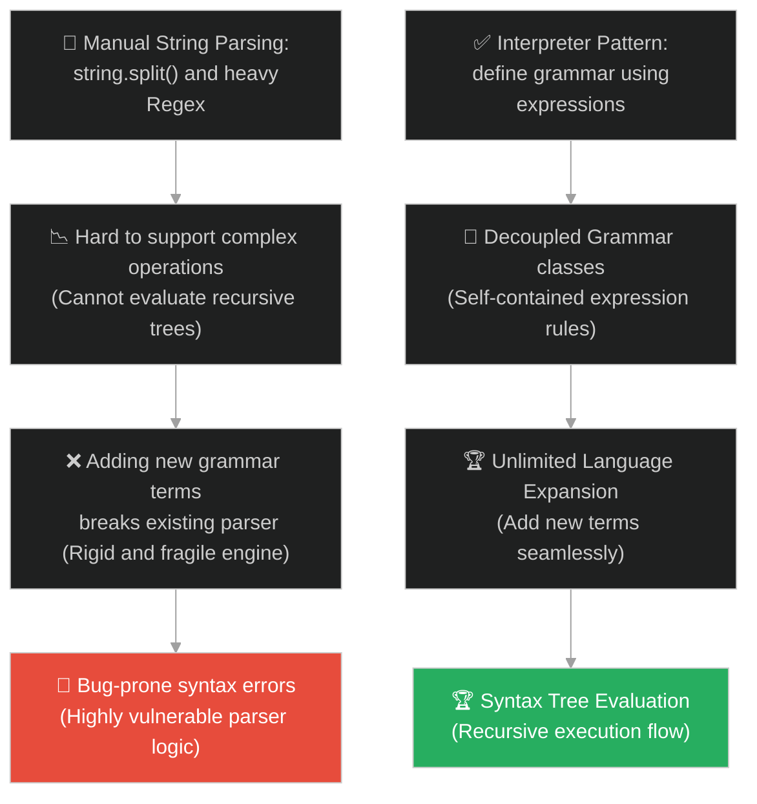
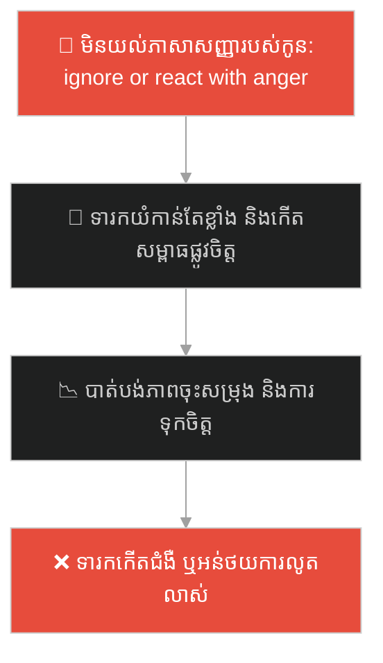
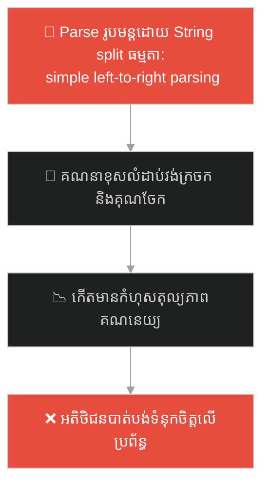
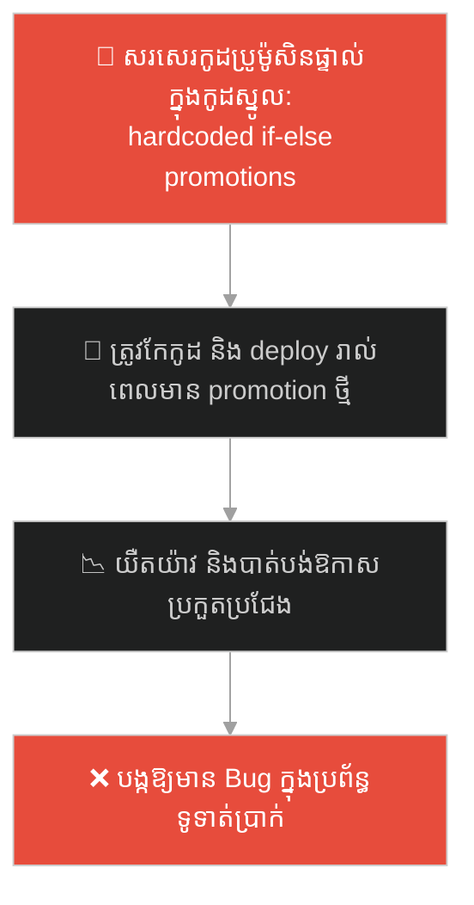
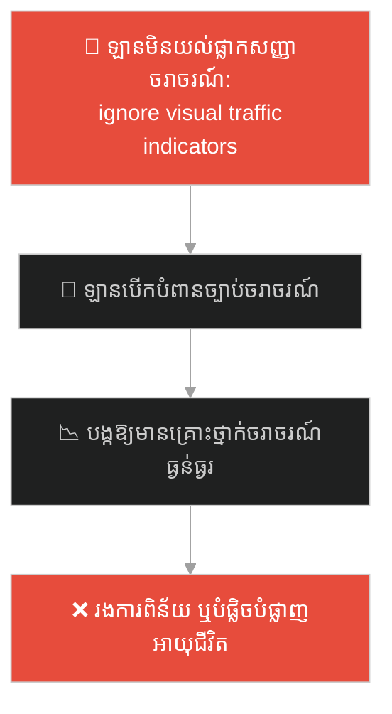
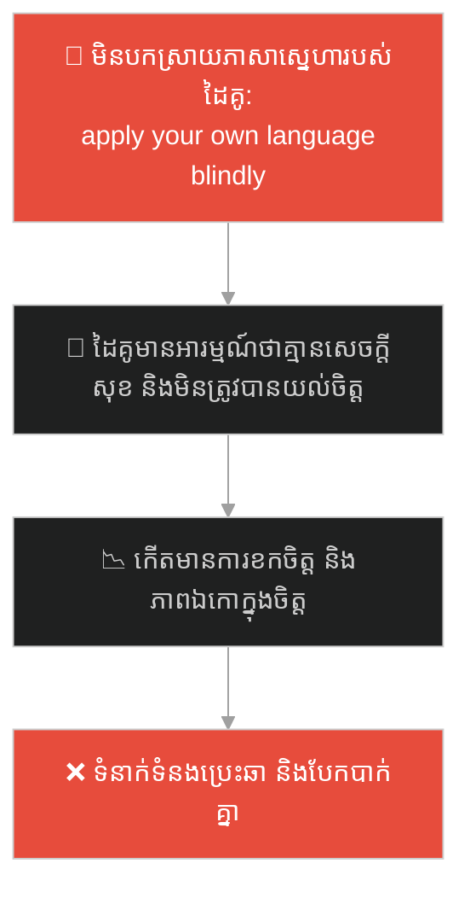
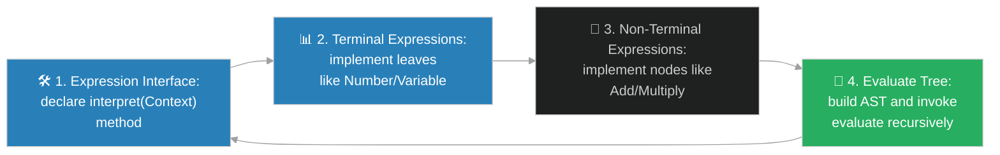

# Interpreter Design Pattern (លំនាំរចនាអ្នកបកស្រាយភាសា)៖ តន្ត្រីករ និងក្រដាសណោតភ្លេង (Interpreter Pattern & The Musician and the Sheet Music)

**Author:** ichamrong  
**Date:** 2026-05-28  
**Tags:** #design-patterns #interpreter #architecture #software-engineering #parable  
**Category:** Concepts / Parables  
**Read Time:** ~15 min  

---

## 📌 មាតិកា (Table of Contents)
- [អន្ទាក់ផ្លូវចិត្ត (The Trap)](#0)
- [១. រឿងព្រេងប្រវត្តិសាស្ត្រ៖ និមិត្តសញ្ញាអរូបី និងបទភ្លេងដែលបាត់បង់អត្ថន័យ (The Legend of the Silent Sheet Music)](#1)
  - [តន្ត្រីករជាអ្នកបកស្រាយ និងបង្កើតសម្លេងតន្ត្រី (The Musician as the Living Interpreter)](#1-1)
- [២. បញ្ហា៖ ការសរសេរកូដបកប្រែភាសារញ៉េរញ៉ៃ និងកង្វះលទ្ធភាពពង្រីក (The Issue: Massive Hardcoded Parsers and Inflexible Language Rules)](#2)
- [៣. ឧទាហមណ៍ជាក់ស្តែងក្នុងពិភពពិត (Real World Examples)](#3)
  - [ឧទាហរណ៍ទី ១ — កម្រិតស្រាល (គ្រួសារ)៖ ការបកស្រាយភាសាសញ្ញារបស់ទារក (Deciphering Baby Cries and Gestures)](#3-1)
  - [ឧទាហរណ៍ទី ២ — កម្រិតមធ្យម (បច្ចេកទេស)៖ ការបង្កើតប្រព័ន្ធគណនារូបមន្តគណិតវិទ្យា (Mathematical Expression Evaluator)](#3-2)
  - [ឧទាហរណ៍ទី ៣ — កម្រិតមធ្យម (ធុរកិច្ច)៖ ការអនុវត្តច្បាប់បញ្ចុះតម្លៃសម្រាប់ផលិតផល (Rule Engine for e-Commerce Dynamic Pricing)](#3-3)
  - [ឧទាហរណ៍ទី ៤ — កម្រិតមធ្យម (សង្គម/គ្រប់គ្រង)៖ ការបកស្រាយច្បាប់ចរាចរណ៍តាមរយៈផ្លាកសញ្ញា (Interpreting Traffic Signs for Autonomous Vehicles)](#3-4)
  - [ឧទាហរណ៍ទី ៥ — កម្រិតធ្ងន់ (ទំនាក់ទំនង)៖ ការយល់ដឹងពីភាសាសេចក្តីស្រឡាញ់របស់ដៃគូ (Interpreting Partner Love Languages in Daily Actions)](#3-5)
- [៤. ដំណោះស្រាយទូទៅ៖ ការអនុវត្ត Interpreter Pattern ជាមួយ Syntax Tree Structures (The General Solution: Interpreter Pattern with Composite Expression Trees)](#4)
- [សេចក្តីសន្និដ្ឋាន (Conclusion)](#5)
- [ឯកសារយោង (References)](#6)
- [Related Posts](#7)

---

<a id="0"></a>
## អន្ទាក់ផ្លូវចិត្ត (The Trap)

តើអ្នកធ្លាប់ជួបបញ្ហាដែលត្រូវបង្កើតប្រព័ន្ធដើម្បីអាន យល់ និងអនុវត្ត "ភាសា ឬកូដបញ្ជាជាក់លាក់" (Domain-Specific Language - DSL) ដូចជារូបមន្តគណិតវិទ្យា លក្ខខណ្ឌតម្រងទិន្នន័យ (Filters) ឬកូដកំណត់រចនាសម្ព័ន្ធ ហើយអ្នកបានសរសេរកូដបកប្រែដោយប្រើលក្ខខណ្ឌសរសេរកូដរាយប៉ាយ (String Parsing switch-cases) ដែរឬទេ? កូដបែបនេះងាយនឹងខូចខាតខ្លាំងនៅពេលមានការកែប្រែច្បាប់វេយ្យាករណ៍ (Grammar Rules)។

នៅក្នុងការអភិវឌ្ឍប្រព័ន្ធ៖
* **យើងងាយនឹងធ្លាក់ក្នុងអន្ទាក់** នៃការសរសេរ String Processing Functions ដ៏ធំទ្រលុកទ្រលាយ ដែលព្យាយាម Parse និមិត្តសញ្ញា និងអត្ថបទដោយប្រើ Regex ឬ if-else ច្រើនជាន់ ដែលនាំឱ្យកើតមានកូដពិបាកយល់ គ្មានលទ្ធភាពពង្រីក និងងាយនឹងខុសឆ្គង។
* **យើងមើលរំលង** យន្តការ "បំប្លែងរាល់ច្បាប់វេយ្យាករណ៍ និងនិមិត្តសញ្ញាឱ្យទៅជា Class ឯករាជ្យ" ដែលអនុញ្ញាតឱ្យយើងកសាង Abstract Syntax Tree (AST) រួចដំណើរការវាយតម្លៃ (Evaluation) ដោយស្វ័យប្រវត្ត និងរលូនបំផុត។

ការព្យាយាម Parse ភាសា និងលក្ខខណ្ឌដោយប្រើ String Manipulation ផ្ទាល់ ហៅថា **អន្ទាក់បកស្រាយភាសាដោយប្រើ String Manipulation (String Parser Spaghetti Trap)**។

ដើម្បីយល់ដឹងពីរបៀបបកស្រាយភាសាសញ្ញាប្រកបដោយសណ្តាប់ធ្នាប់ នេះជាផែនទីបង្ហាញផ្លូវ៖
1. **រឿងព្រេងប្រវត្តិសាស្ត្រ (The Historic Legend)** — រឿងរ៉ាវរបស់ក្រដាសណោតភ្លេងដែលមានតែនិមិត្តសញ្ញាចម្លែកៗ ដែលមនុស្សធម្មតាមិនអាចយល់បាន រហូតដល់មានការបកស្រាយដោយតន្ត្រីករដែលមានក្បួនក្នុងខួរក្បាល។
2. **បញ្ហា (The Issue)** — ការវិភាគភាពលំបាកនៃការកសាង Parser ក្នុង OOP និងភាពរឹងរូសនៃការបន្ថែមវេយ្យាករណ៍ថ្មី។
3. **ឧទាហរណ៍ជាក់ស្តែងក្នុងពិភពពិត (Real World Examples)** — ពិនិត្យមើលបញ្ហានេះក្នុងកម្រិតគ្រួសារ បច្ចេកវិទ្យា ធុរកិច្ច ការគ្រប់គ្រង និងទំនាក់ទំនង។
4. **ដំណោះស្រាយទូទៅ (The General Solution)** — ការអនុវត្ត Interpreter Pattern ដើម្បីបង្កើតរចនាសម្ព័ន្ធ Composite Expression Tree សម្រាប់បកស្រាយភាសា។



---

<a id="1"></a>
## ១. រឿងព្រេងប្រវត្តិសាស្ត្រ៖ និមិត្តសញ្ញាអរូបី និងបទភ្លេងដែលបាត់បង់អត្ថន័យ (The Legend of the Silent Sheet Music)

កាលពីព្រេងនាយ មានអ្នកតែងនិពន្ធបទភ្លេងដ៏អស្ចារ្យម្នាក់។ ថ្ងៃមួយ គាត់បានសរសេរបទភ្លេងដ៏ពិរោះអស្ចារ្យបំផុតក្នុងជីវិតរបស់គាត់នៅលើសន្លឹកក្រដាសមួយសន្លឹក។

ទោះជាយ៉ាងណា៖
* គាត់មិនបានសរសេរបទភ្លេងនោះជាពាក្យពេចន៍ ឬអក្សរធម្មតាឡើយ។ គាត់បានប្រើ **និមិត្តសញ្ញាអរូបីចម្លែកៗ** ដូចជា 🎼 (ផ្ដើម), ⏸ (ផ្អាក), 🎵🎵 (ល្បឿនលឿន) និងសញ្ញាផ្សេងៗទៀត ដែលគាត់បានបង្កើតឡើង (Syntax and Grammar Rules)។
* នៅពេលគាត់យកក្រដាសនោះទៅឱ្យអ្នកភូមិ និងមនុស្សធម្មតាមើល ពួកគេឃើញត្រឹមតែទឹកខ្មៅ និងគំនូរចម្លែកៗដែលគ្មានតម្លៃ ឬគ្មានសម្លេងអ្វីកើតឡើងទាល់តែសោះ។ ពួកគេគ្មាន "ក្បួនបកប្រែ" នៅក្នុងខួរក្បាលដើម្បីផ្លាស់ប្តូររូបគំនូរទាំងនោះឱ្យទៅជាសម្លេងបានឡើយ។
* ក្រដាសណោតភ្លេងនោះនៅតែស្ងប់ស្ងាត់ និងគ្មានអត្ថន័យចំពោះពួកគេ (No Execution Context)។

---

<a id="1-1"></a>
### តន្ត្រីករជាអ្នកបកស្រាយ និងបង្កើតសម្លេងតន្ត្រី (The Musician as the Living Interpreter)

ប៉ុន្តែនៅពេលសន្លឹកក្រដាសនោះ ធ្លាក់ទៅដល់ដៃរបស់ **តន្ត្រីករដ៏ជំនាញម្នាក់ (The Interpreter)** អ្វីៗបានផ្លាស់ប្តូរភ្លាមៗ។

ខួរក្បាលរបស់តន្ត្រីកររូបនោះ ត្រូវបានបណ្តុះបណ្តាលឱ្យទទទួលស្គាល់ **ក្បួនវេយ្យាករណ៍តន្ត្រី (Musical Grammar Rules)** រួចជាស្រេច៖
* ពេលភ្នែកគាត់សម្លឹងឃើញសញ្ញា 🎼 គាត់ដឹងភ្លាមថាត្រូវយកដៃទាញខ្សែហ្គីតាឱ្យខ្លាំង (Evaluate to Action)។
* ពេលភ្នែកគាត់ឃើញសញ្ញា ⏸ គាត់ដឹងភ្លាមថាត្រូវបញ្ឈប់សម្លេង និងផ្អាក ២ វិនាទី។
* ពេលឃើញសញ្ញា 🎵🎵 គាត់ដឹងថាត្រូវដេញខ្សែសម្លេងឱ្យលឿន និងទន់ភ្លន់។

តន្ត្រីកររូបនោះបានដើរតួជា **ម៉ាស៊ីនបកស្រាយ (The Interpreter Engine)**។ គាត់បានអាននិមិត្តសញ្ញានីមួយៗតាមលំដាប់លំដោយ បម្លែងវាឱ្យទៅជាសកម្មភាពរូបវន្ត និងបង្កើតបានជាបទភ្លេងដ៏ពិរោះរណ្តំអណ្តែតអណ្តូងពាសពេញទីក្រុង។ គាត់បានប្រែក្លាយ "ទឹកខ្មៅអរូបីលើក្រដាស" ឱ្យទៅជា "សម្លេងដ៏មានជីវិតពិតប្រាកដ" ដោយជោគជ័យ។

---

<a id="2"></a>
## ២. បញ្ហា៖ ការសរសេរកូដបកប្រែភាសារញ៉េរញ៉ៃ និងកង្វះលទ្ធភាពពង្រីក (The Issue: Massive Hardcoded Parsers and Inflexible Language Rules)

នៅក្នុងវិស្វកម្មផ្នែកទន់ ភាពជំពាក់ជំពិននេះកើតឡើងនៅពេលយើងព្យាយាមបង្កើត Rules Engine ឬ Formula Evaluator ដោយប្រើវិធីសរសេរកូដលក្ខខណ្ឌដេញដោល String៖

```java
// កូដដែលគ្មាន Interpreter Pattern គឺប្រើប្រាស់ String Split និង Regex ដ៏ធំ
public class FormulaEvaluator {
    public int evaluate(String expression) {
        if (expression.contains("+")) {
            String[] parts = expression.split("\\+");
            return Integer.parseInt(parts[0].trim()) + Integer.parseInt(parts[1].trim());
        }
        // ... លក្ខខណ្ឌកើនឡើងជាលំដាប់ និងមិនអាចគណនារូបមន្តស្មុគស្មាញ (2 + 3) * 5 បានឡើយ
        return 0;
    }
}
```

* **ភាពមិនអាចពង្រីកច្បាប់វេយ្យាករណ៍ (Rigid Grammar Expansion)៖** រាល់ពេលចង់បន្ថែម Operator ថ្មី (ដូចជា `-` ឬ `*`) យើងត្រូវសរសេរកូដ Parse ស្មុគស្មាញ និងប៉ះពាល់ដល់កូដចាស់។
* **ភាពលំបាកក្នុងការគណនា recursive (Complex Evaluation)៖** កូដលក្ខខណ្ឌសាមញ្ញមិនអាចដោះស្រាយលក្ខខណ្ឌដែលមានវង់ក្រចក ឬលក្ខខណ្ឌស្មុគស្មាញច្រើនជាន់បានឡើយ។

**Interpreter Design Pattern** ដោះស្រាយបញ្ហានេះដោយប្រើគោលការណ៍ **Composite Pattern**។ យើងបង្កើត interface `Expression` ដែលមាន method `interpret(Context c)`។ យើងបង្កើត Class ពីរប្រភេទ៖
1. **Terminal Expression:** តំណាងឱ្យធាតុផ្សំតូចបំផុតដែលមិនអាចបំបែកបាន (ដូចជា `NumberExpression` ឬ `VariableExpression`)។
2. **Non-Terminal Expression:** តំណាងឱ្យច្បាប់វេយ្យាករណ៍ដែលរួមបញ្ចូល Expression ផ្សេងទៀត (ដូចជា `AddExpression(LeftExpr, RightExpr)` ឬ `MultiplyExpression`)។

យើងកសាង Abstract Syntax Tree (AST) ពី Expression ទាំងនេះ រួចហៅ `interpret()` ពីកំពូល Tree វានឹងដំណើរការគណនាចុះក្រោមជារូបរាង Recursively យ៉ាងរលូន និងស្រស់ស្អាត។

---

<a id="3"></a>
## ៣. ឧទាហមណ៍ជាក់ស្តែងក្នុងពិភពពិត

---

<a id="3-1"></a>
### ឧទាហរណ៍ទី ១ — កម្រិតស្រាល (គ្រួសារ)៖ ការបកស្រាយភាសាសញ្ញារបស់ទារក (Deciphering Baby Cries and Gestures)

នៅក្នុងគ្រួសារមួយ ទារកតូចមិនទាន់អាចនិយាយភាសាមនុស្សបានឡើយ។ គាត់ប្រើតែ "ភាសាសញ្ញា" ដូចជា យំខ្លាំងៗ (ឃ្លាន), យកដៃញីភ្នែក (ងងុយគេង), ឬចង្អុលដៃទៅក្រៅ (ចង់លេង)។ ជំនួសឱ្យការខឹង ឬមិនយល់ស្របនឹងការយំរបស់កូន (Direct Ignore Trap) ម្តាយដ៏ឆ្លាតវៃបានដើរតួជា **Interpreter**។ គាត់បកស្រាយសញ្ញានីមួយៗរបស់កូនឱ្យទៅជាសកម្មភាពថែទាំ៖ យំ = បញ្ចុកទឹកដោះគោ, ញីភ្នែក = បីបំពេរឱ្យគេង ធានាបាននូវការលូតលាស់របស់កូនដោយក្តីសុខ។



ការយល់ចិត្ត និងបកស្រាយត្រូវសញ្ញារបស់កូន ជួយកសាងចំណងគ្រួសារដ៏កក់ក្តៅ និងរឹងមាំ។

---

<a id="3-2"></a>
### ឧទាហរណ៍ទី ២ — កម្រិតមធ្យម (បច្ចេកទេស)៖ ការបង្កើតប្រព័ន្ធគណនារូបមន្តគណិតវិទ្យា (Mathematical Expression Evaluator)

នៅក្នុងកម្មវិធីគណនេយ្យ ឬ Excel ពេលអតិថិជនសរសេររូបមន្តគណនា ដូចជា `= (A1 + B2) * 10` ប្រព័ន្ធត្រូវបកស្រាយរូបមន្តនេះដើម្បីទាញយកតម្លៃពិត។ វិស្វករប្រើប្រាស់ Interpreter Pattern ដើម្បីបំប្លែងរូបមន្តនេះទៅជា Tree នៃ `AddExpression` និង `MultiplyExpression` រួចគណនាតម្លៃចេញមកយ៉ាងត្រឹមត្រូវតាមច្បាប់លេខនព្វន្ត ធានាគ្មានកំហុសលំដាប់ប្រតិបត្តិការឡើយ។



---

<a id="3-3"></a>
### ឧទាហរណ៍ទី ៣ — កម្រិតមធ្យម (ធុរកិច្ច)៖ ការអនុវត្តច្បាប់បញ្ចុះតម្លៃសម្រាប់ផលិតផល (Rule Engine for e-Commerce Dynamic Pricing)

នៅក្នុងប្រព័ន្ធ e-Commerce ដ៏ធំ ក្រុមហ៊ុនចង់ផ្លាស់ប្តូរច្បាប់ប្រូម៉ូសិនបញ្ចុះតម្លៃជាញឹកញាប់ ដូចជា៖ *"ប្រសិនបើ អតិថិជនជា VIP AND ទិញទំនិញលើសពី $100 OR ថ្ងៃនេះជាថ្ងៃបុណ្យ"*។ ជំនួសឱ្យការឱ្យដេវកែកូដរាល់ពេលច្បាប់ផ្លាស់ប្តូរ វិស្វករបានបង្កើត **Rules Engine Interpreter**។ ពួកគាត់សរសេរច្បាប់ជាភាសាសាមញ្ញ រួចឱ្យប្រព័ន្ធ Interpreter បកប្រែ និងអនុវត្តច្បាប់ទាំងនោះដោយស្វ័យប្រវត្ត លឿនរហ័សទាន់ចិត្តអាជីវកម្ម។



---

<a id="3-4"></a>
### ឧទាហរណ៍ទី ៤ — កម្រិតមធ្យម (សង្គម/គ្រប់គ្រង)៖ ការបកស្រាយច្បាប់ចរាចរណ៍តាមរយៈផ្លាកសញ្ញា (Interpreting Traffic Signs for Autonomous Vehicles)

នៅក្នុងការអភិវឌ្ឍឡានបើកបរស្វ័យប្រវត្ត (Self-Driving Cars) ឡានត្រូវអាន និងយល់ពីផ្លាកសញ្ញាចរាចរណ៍នៅតាមផ្លូវ (ដូចជា ផ្លាកសញ្ញាឈប់, ផ្លាកសញ្ញាកំណត់ល្បឿន, ផ្លាកសញ្ញាឯកទិស)។ ឡានមានប្រព័ន្ធ **Computer Vision Interpreter** ដែលបកស្រាយរាល់និមិត្តសញ្ញារូបភាពទាំងនោះ ឱ្យទៅជាបញ្ជាការងាររបស់ម៉ាស៊ីន៖ ឃើញផ្លាកសញ្ញាឈប់ = ជាន់ហ្វ្រាំង និងបញ្ឈប់ឡាន ធានាសុវត្ថិភាពខ្ពស់លើដងផ្លូវ។



---

<a id="3-5"></a>
### ឧទាហរណ៍ទី ៥ — កម្រិតធ្ងន់ (ទំនាក់ទំនង)៖ ការយល់ដឹងពីភាសាសេចក្តីស្រឡាញ់របស់ដៃគូ (Interpreting Partner Love Languages in Daily Actions)

នៅក្នុងទំនាក់ទំនងស្នេហា មនុស្សម្នាក់ៗមាន "ភាសាសេចក្តីស្រឡាញ់ (Love Languages)" ខុសៗគ្នា៖ សម្តីបញ្ជាក់ចិត្ត (Words of Affirmation), សកម្មភាពបម្រើថែទាំ (Acts of Service), ឬពេលវេលាមានគុណភាព (Quality Time)។ ប្រសិនបើដៃគូមិនចេះបកស្រាយភាសាស្នេហារបស់គ្នា (ឧទាហរណ៍៖ ប្រពន្ធចង់បាន acts of service ប៉ុន្តែប្តូរមកជាការទិញកាដូថ្លៃៗ ដែលប្រពន្ធមិនពេញចិត្ត) ពួកគេនឹងមានអារម្មណ៍ថាគ្មានសេចក្តីសុខ ទោះបីខំប្រឹងប្រែងខ្លាំងក៏ដោយ។ ការរៀនក្លាយជា **Interpreter** នៃសកម្មភាពប្រចាំថ្ងៃរបស់ដៃគូ ជួយឱ្យយល់ដឹង និងបំពេញតម្រូវការអារម្មណ៍គ្នាទៅវិញទៅមកយ៉ាងល្អប្រសើរ។



---

<a id="4"></a>
## ៤. ដំណោះស្រាយទូទៅ៖ ការអនុវត្ត Interpreter Pattern ជាមួយ Syntax Tree Structures (The General Solution: Interpreter Pattern with Composite Expression Trees)

ដើម្បីបកស្រាយ និងដំណើរការភាសាសញ្ញា ឬរូបមន្តប្រកបដោយប្រសិទ្ធភាព យើងត្រូវអនុវត្តលំនាំរចនា **Interpreter Design Pattern**៖



ជំហាននៃការអនុវត្ត៖
1. **បង្កើត Expression Interface៖** ប្រកាស Method `interpret(Context)` ដែលជាចំណុចកណ្តាលនៃការវាយតម្លៃ Expression នីមួយៗ។
2. **បង្កើត Terminal Expressions៖** Class តំណាងឱ្យធាតុផ្សំចុងក្រោយ (ដូចជា `NumberExpression` ដែលគ្រាន់តែហុចតម្លៃលេខ ឬ `VariableExpression` ដែលទាញយកតម្លៃអថេរពី Context)។
3. **បង្កើត Non-Terminal Expressions៖** Class តំណាងឱ្យច្បាប់ ឬលក្ខខណ្ឌរួមបញ្ចូលគ្នា (ដូចជា `AddExpression` ឬ `AndExpression`) ដោយពួកវាផ្ទុករក្សា Reference ទៅកាន់ sub-expressions ផ្សេងទៀត រួចអនុវត្ត Method `interpret` ដោយបូកបញ្ចូល ឬផ្សំលទ្ធផលពី sub-expressions ទាំងនោះ។
4. **កសាង និងវាយតម្លៃ Syntax Tree៖** កម្មវិធីបញ្ជា (Client) ដើរតួជាអ្នកបំប្លែងអត្ថបទ (Parser) ទៅជា Abstract Syntax Tree (AST) រួចហៅ `interpret(context)` ពី Node កំពូល ដែលវានឹងគណនាចុះក្រោម Recursively ទាល់តែទទួលបានលទ្ធផលចុងក្រោយភ្លាមៗ និងមានសុវត្ថិភាព។

---

## 🐇 ធ្លាក់ចូលក្នុងរន្ធទន្សាយ (Enter the Rabbit Hole)

ដើម្បីស្វែងយល់ពីរបៀបដែលអ្នកគ្រប់គ្រងរោងភាពយន្តដ៏ធំ ឬវិស្វករប្រព័ន្ធ បានចាត់ចែងរៀបចំកន្លែងអង្គុយជាជួរៗដ៏មានរបៀបរៀបរយ ដែលអនុញ្ញាតឱ្យប្រព័ន្ធអាចស្វែងរក និងទាញយកទិន្នន័យបានយ៉ាងលឿនរហ័សបំផុតដោយប្រើប្រាស់សន្ទស្សន៍សាមញ្ញ (Arrays) សូមបន្តដំណើរទៅកាន់៖

* 🚀 **[ចាប់ផ្តើមដំណើររុករក (Start the Journey) ➔ Arrays and Contiguous Memory Storage](./98-the-cinema-seats.md)**

---

<a id="5"></a>
## សេចក្តីសន្និដ្ឋាន (Conclusion)

> **«ការបកស្រាយនិមិត្តសញ្ញាអរូបីឱ្យទៅជាសកម្មភាពជាក់ស្តែង គឺជាសិល្បៈនៃការបង្កើតជីវិតដល់ភាសា»**

ការប្រើប្រាស់ Interpreter Design Pattern ជួយឱ្យប្រព័ន្ធរបស់អ្នកយល់ដឹងពីភាសាសាមញ្ញៗ ឬច្បាប់ស្មុគស្មាញដោយបត់បែនខ្ពស់ ងាយស្រួលពង្រីកច្បាប់ថ្មីៗ និងលុបបំបាត់ការសរសេរកូដ Parser ស្មុគស្មាញ ធានាឱ្យប្រព័ន្ធដំណើរការប្រកបដោយប្រសិទ្ធភាព និងស្ថិរភាពខ្ពស់បំផុត។

---

<a id="6"></a>
## ឯកសារយោង (References)

* **Gamma, E., Helm, R., Johnson, R., & Vlissides, J.** — *Design Patterns: Elements of Reusable Object-Oriented Software* (1994). Interpreter pattern specifications and abstract syntax tree parsing.
* **Freeman, E., & Robson, E.** — *Head First Design Patterns* (2004). Simplifying domain specific expressions using object-oriented grammar representation.

---

<a id="7"></a>
## Related Posts

* [[Behavioral Patterns: Interpreter](../../clean-code/design-patterns/03-behavioral-patterns.md#11-interpreter)] — ការពន្យល់លម្អិតអំពីលំនាំរចនាអ្នកបកស្រាយភាសា។
* [[Visitor Design Pattern & The Royal Tax Collector](./96-the-royal-tax-collector.md)] — របៀបប្រើប្រាស់ Visitor ដើម្បីចុះដើរពិនិត្យ និងវាយតម្លៃ Abstract Syntax Trees របស់ Interpreter។
