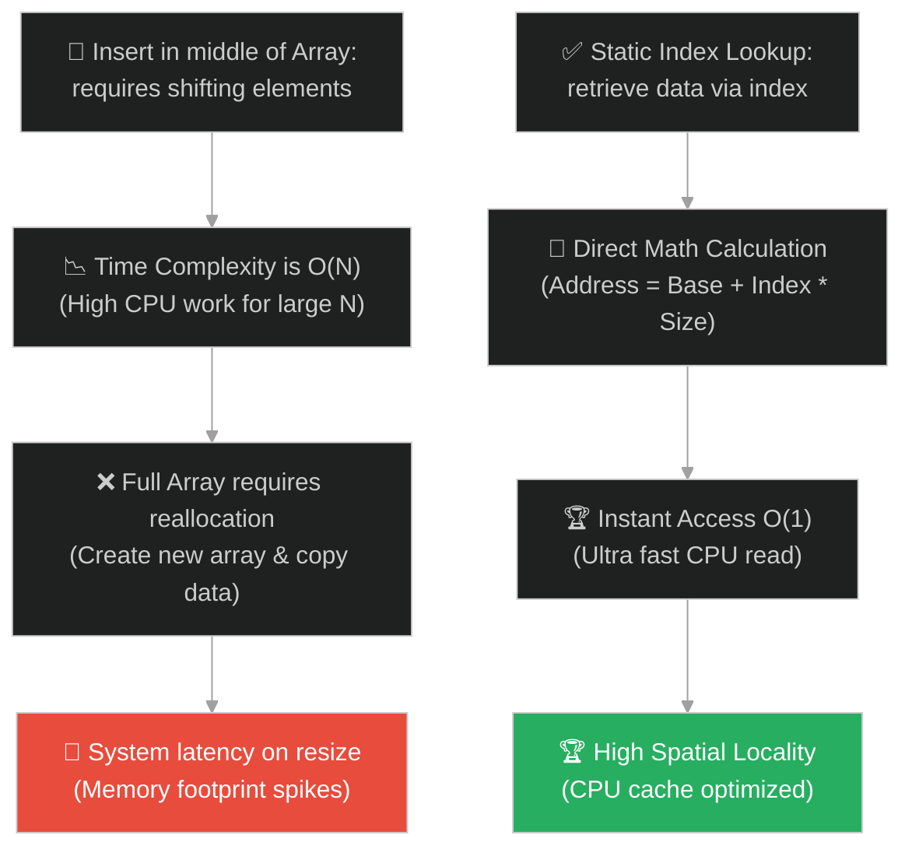
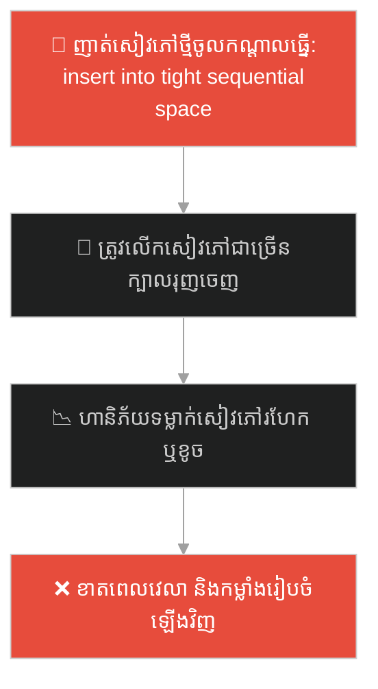
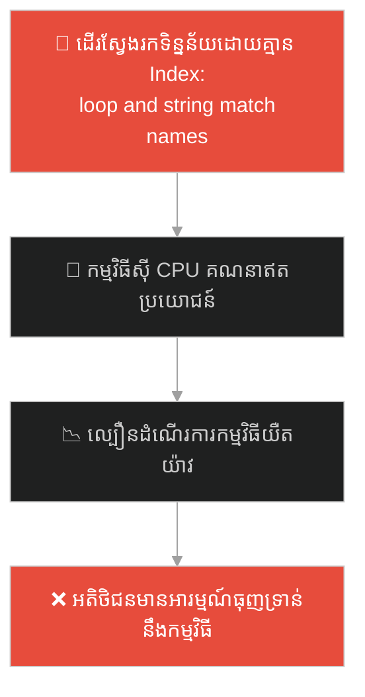
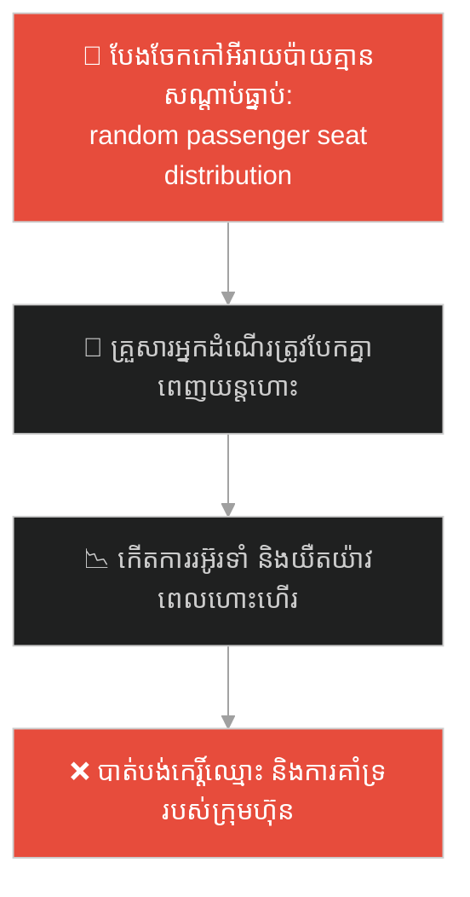
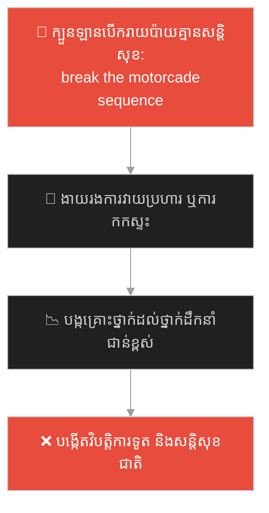
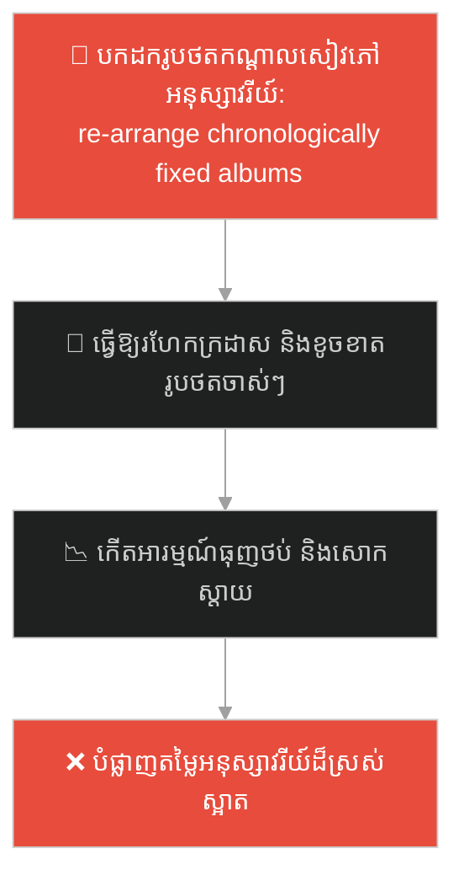
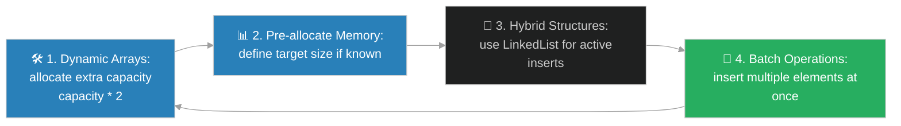

# Array Data Structure (រចនាសម្ព័ន្ធទិន្នន័យអារេ)៖ កៅអីរោងកុន និងខ្សែភាពយន្ត (Arrays & The Cinema Seats)

**Author:** ichamrong  
**Date:** 2026-05-28  
**Tags:** #dsa #data-structures #arrays #memory #parable  
**Category:** Concepts / Parables  
**Read Time:** ~15 min  

---

## 📌 មាតិកា (Table of Contents)
- [អន្ទាក់ផ្លូវចិត្ត (The Trap)](#0)
- [១. រឿងព្រេងប្រវត្តិសាស្ត្រ៖ មិត្តភក្តិទាំងបីនាក់ និងកៅអីជាប់គ្នាក្នុងរោងកុន (The Legend of cinema contiguous seats)](#1)
  - [មិត្តភក្តិយឺតយ៉ាវ និងការផ្លាស់ប្តូរជួរដ៏គួរឱ្យធុញទ្រាន់ (Shifting and Moving Array Resizing)](#1-1)
- [២. បញ្ហា៖ ការចងភ្ជាប់ការចងចាំជាប់គ្នា និងការចំណាយលើការរុញទិន្នន័យ (The Issue: Contiguous Memory Allocations and Shifting Overheads)](#2)
- [៣. ឧទាហមណ៍ជាក់ស្តែងក្នុងពិភពពិត (Real World Examples)](#3)
  - [ឧទាហរណ៍ទី ១ — កម្រិតស្រាល (គ្រួសារ)៖ ការរៀបចំសៀវភៅតាមលំដាប់លើធ្នើ (Sequential Bookshelf Organization)](#3-1)
  - [ឧទាហរណ៍ទី ២ — កម្រិតមធ្យម (បច្ចេកទេស)៖ ការទាញយកទិន្នន័យតាមរយៈ Indexes (Fast Index Lookup in Ram Arrays)](#3-2)
  - [ឧទាហរណ៍ទី ៣ — កម្រិតមធ្យម (ធុរកិច្ច)៖ ការគ្រប់គ្រងជួរកៅអីអ្នកដំណើរលើយន្តហោះ (Contiguous Aircraft Seating Assignments)](#3-3)
  - [ឧទាហរណ៍ទី ៤ — កម្រិតមធ្យម (សង្គម/គ្រប់គ្រង)៖ ជួរក្បួនរថយន្តគណៈប្រតិភូផ្លូវការ (Sequential Diplomatic Motorcade Formations)](#3-4)
  - [ឧទាហរណ៍ទី ៥ — កម្រិតធ្ងន់ (ទំនាក់ទំនង)៖ ការរក្សាទុកអនុស្សាវរីយ៍ប្រចាំថ្ងៃតាមកាលបរិច្ឆេទ (Rigid Chronological Memory Books)](#3-5)
- [៤. ដំណោះស្រាយទូទៅ៖ តុល្យភាពរវាង Arrays និង Dynamic Resizing Mechanics (The General Solution: Optimizing Array Allocations and Dynamic Resizing)](#4)
- [សេចក្តីសន្និដ្ឋាន (Conclusion)](#5)
- [ឯកសារយោង (References)](#6)
- [Related Posts](#7)

---

<a id="0"></a>
## អន្ទាក់ផ្លូវចិត្ត (The Trap)

តើអ្នកធ្លាប់ជួបបញ្ហាដែលត្រូវរក្សាទុកទិន្នន័យជាសំណុំលំដាប់លំដោយ ហើយអ្នកបានប្រើប្រាស់ Array ដែលមានទំហំចាក់សោរ (Fixed Size Array) ធ្វើឱ្យអ្នកមិនអាចបន្ថែមទិន្នន័យថ្មីបាននៅពេលវាពេញ ឬត្រូវចំណាយថាមពលគណនាយ៉ាងខ្លាំង (Performance Penalty) ក្នុងការរុញទិន្នន័យថយក្រោយ (Shifting) រាល់ពេលបន្ថែមទិន្នន័យនៅចំកណ្តាលដែរឬទេ?

នៅក្នុងការរៀបចំទិន្នន័យ៖
* **យើងងាយនឹងធ្លាក់ក្នុងអន្ទាក់** នៃការគិតថា Array គឺល្អបំផុតសម្រាប់គ្រប់ស្ថានភាពទិន្នន័យ ដោយមើលរំលងការខាតបង់ថាមពល CPU លើការចម្លង និងផ្លាស់ទីទិន្នន័យក្នុង Memory (O(N) operations for insertion/deletion) នៅពេលទិន្នន័យមានការផ្លាស់ប្តូរទំហំញឹកញាប់។
* **យើងមើលរំលង** លក្ខខណ្ឌតម្រូវការបម្រុង Memory ជាប់គ្នា (Contiguous Allocation) ដែលអាចនាំឱ្យបរាជ័យក្នុងការស្វែងរកបន្ទប់ទំនេរ បើទោះជាទំហំ Memory សរុបនៅសល់គ្រប់គ្រាន់ក៏ដោយ (Out of Memory due to fragmentation)។

ការពឹងផ្អែកលើ Array សម្រាប់សំណុំទិន្នន័យដែលផ្លាស់ប្តូរទំហំ និងមានការបន្ថែម/លុបញឹកញាប់ ហៅថា **អន្ទាក់រចនាសម្ព័ន្ធទិន្នន័យថេរ (Fixed Contiguous Array Allocation Trap)**។

ដើម្បីយល់ដឹងពីចំណុចខ្លាំង និងខ្សោយរបស់ Array នេះជាផែនទីបង្ហាញផ្លូវ៖
1. **រឿងព្រេងប្រវត្តិសាស្ត្រ (The Historic Legend)** — រឿងរ៉ាវរបស់មិត្តភក្តិដែលចង់ទិញសំបុត្រកៅអីជាប់គ្នាក្នុងរោងកុន និងភាពវឹកវរនៃការផ្លាស់ប្តូរកន្លែងនៅពេលមានមិត្តភក្តិមកយឺត។
2. **បញ្ហា (The Issue)** — ការវិភាគយន្តការ Contiguous Allocation នៅក្នុង RAM និងការគណនា Time Complexity O(N) លើការបញ្ចូល/លុបទិន្នន័យ។
3. **ឧទាហមណ៍ជាក់ស្តែងក្នុងពិភពពិត (Real World Examples)** — ពិនិត្យមើលបញ្ហានេះក្នុងកម្រិតគ្រួសារ បច្ចេកវិទ្យា ធុរកិច្ច ការគ្រប់គ្រង និងទំនាក់ទំនង។
4. **ដំណោះស្រាយទូទៅ (The General Solution)** — ការដោះស្រាយដោយអនុវត្តតុល្យភាពរវាង static allocation, dynamic scaling, និង hybrid data structures។



---

<a id="1"></a>
## ១. រឿងព្រេងប្រវត្តិសាស្ត្រ៖ មិត្តភក្តិទាំងបីនាក់ និងកៅអីជាប់គ្នាក្នុងរោងកុន (The Legend of cinema contiguous seats)

កាលពីព្រេងនាយ នៅក្នុងទីក្រុងមួយ មានមិត្តភក្តិជិតស្និទ្ធ ៣ នាក់ចង់ទៅមើលខ្សែភាពយន្តជាមួយគ្នា។ ដើម្បីងាយស្រួលនិយាយលេង និងចែករំលែកពោតលីងញ៉ាំ៖
* ពួកគេចង់អង្គុយ **ជាប់គ្នាល្អជាជួរតែមួយ**។ ពួកគេបានទៅបញ្ជរទិញសំបុត្រកៅអីលេខ ២, លេខ ៣, និងលេខ ៤ ជាប់គ្នា (Contiguous Memory Structure)។
* អត្ថប្រយោជន៍ដ៏អស្ចារ្យគឺ៖ ប្រសិនបើអ្នកដឹងថា Trang (មិត្តទីមួយ) អង្គុយនៅកៅអីលេខ ២ អ្នកអាចគណនារកកៅអីមិត្តបន្ទាប់ភ្លាមៗដោយមិនបាច់ដើរសួរនាំ៖ គឺ Sok នៅកៅអីលេខ ៣ (លេខ ២ + ១) និង Sao នៅកៅអីលេខ ៤ (លេខ ២ + ២)។ នេះផ្តល់នូវ **ល្បឿនរកឃើញលឿនបំផុត (O(1) Direct Lookup)**។
* ពួកគេអាចទាក់ទងគ្នា និងហុចពោតលីងឱ្យគ្នាបានភ្លាមៗ ដោយមិនបាច់ងើបដើរឆ្លងកាត់នរណាម្នាក់ឡើយ (High Spatial Cache Locality)។

---

<a id="1-1"></a>
### មិត្តភក្តិយឺតយ៉ាវ និងការផ្លាស់ប្តូរជួរដ៏គួរឱ្យធុញទ្រាន់ (Shifting and Moving Array Resizing)

ប៉ុន្តែ មុនពេលខ្សែភាពយន្តចាប់ផ្តើមបញ្ចាំង ៥ នាទី មិត្តភក្តិទី ៤ ឈ្មោះ Rith បានមកដល់យ៉ាងប្រញាប់ប្រញាល់។ គាត់ចង់អង្គុយសម្រាកជាមួយពួកគេដែរ។
* Rith សុំអង្គុយចន្លោះកណ្តាលរវាង Trang (លេខ ២) និង Sok (លេខ ៣)។
* ដើម្បីឱ្យ Rith អាចអង្គុយបាន Sok ត្រូវបង្ខំចិត្តងើបឡើង ផ្លាស់ទីទៅអង្គុយកៅអីលេខ ៤ ហើយ Sao ត្រូវងើបឡើងផ្លាស់ទីទៅអង្គុយកៅអីលេខ ៥ (O(N) Shifting Action)។ មនុស្សដទៃទៀតមើលមកពួកគេដោយការរំខាន។
* រឹតតែអាក្រក់ជាងនេះទៅទៀត ប្រសិនបើកៅអីលេខ ៥ មានអ្នកផ្សេងទិញអង្គុយបាត់ទៅហើយ ពួកគេមិនអាចរុញគ្នាបានទៀតឡើយ។
* ដំណោះស្រាយតែមួយគត់គឺ៖ **ពួកគេទាំង ៣ នាក់ត្រូវងើបដើរចេញទាំងអស់គ្នា** ដើរទៅរកជួរថ្មីទាំងស្រុងដែលមានកៅអីទំនេរ ៤ កន្លែងជាប់គ្នា រួចចាប់ផ្តើមអង្គុយរៀបជួរម្តងទៀតពីដើម (O(N) Reallocation and Copying)។

ការស្វែងរកកៅអីជាប់គ្នាគឺអស្ចារ្យសម្រាប់អង្គុយមើល និងទំនាក់ទំនងលឿន ប៉ុន្តែវាជាសុបិន្តអាក្រក់នៅពេលមានការផ្លាស់ប្តូរកៅអី ឬមានសមាជិកថ្មីចូលរួម។

---

<a id="2"></a>
## ២. បញ្ហា៖ ការចងភ្ជាប់ការចងចាំជាប់គ្នា និងការចំណាយលើការរុញទិន្នន័យ (The Issue: Contiguous Memory Allocations and Shifting Overheads)

នៅក្នុងកុំព្យូទ័រ Array ត្រូវបានរក្សាទុកនៅក្នុង RAM ជាប្លុក Memory ជាប់ៗគ្នា (Contiguous Block)។ នេះមានន័យថាកុំព្យូទ័រអាចគណនាអាសយដ្ឋានរបស់ Element ទី `i` បានភ្លាមៗ៖

$$\text{Address} = \text{BaseAddress} + i \times \text{ElementSize}$$

សមីការគណិតវិទ្យាសាមញ្ញនេះផ្តល់នូវល្បឿន Direct Lookup O(1) ដ៏លឿនបំផុត។ ទោះជាយ៉ាងណា ភាពជំពាក់ជំពិនកើតឡើងនៅពេលយើងបញ្ចូល (Insert) ឬលុប (Delete) ទិន្នន័យ៖

```java
// ការបញ្ចូលទិន្នន័យនៅកណ្តាល Array គឺចំណាយពេលវេលា និងកម្លាំង CPU ខ្លាំង
public void insertAt(int[] array, int index, int value) {
    // ត្រូវរុញទិន្នន័យពីក្រោយ index ថយក្រោយម្តងមួយៗ
    for (int i = array.length - 1; i > index; i--) {
        array[i] = array[i - 1]; // O(N) Shifting overhead
    }
    array[index] = value;
}
```

* **ការចំណាយលើការផ្លាស់ទី (Shifting Cost O(N))៖** ប្រសិនបើអារេមានទិន្នន័យ ១ លានធាតុ ហើយយើងចង់បញ្ចូលធាតុថ្មីនៅចំកណ្តាល កុំព្យូទ័រត្រូវធ្វើការងារចម្លង និងរុញទិន្នន័យចំនួន ៥០ ម៉ឺនដង ដែលធ្វើឱ្យប្រព័ន្ធរត់យឺតយ៉ាវភ្លាមៗ។
* **បញ្ហាទំហំមិនអាចផ្លាស់ប្តូរបាន (Fixed Size Limit)៖** Array មិនអាចពង្រីកទំហំខ្លួនឯងបានឡើយ។ នៅពេលវាពេញ កម្មវិធីត្រូវបង្កើត Array ថ្មីដែលមានទំហំធំជាងមុន រួចចម្លងទិន្នន័យទាំងអស់ពី Array ចាស់ទៅថ្មី (Reallocation & Copying) ដែលស៊ីធនធានម៉ាស៊ីនយ៉ាងធ្ងន់ធ្ងរ។

---

<a id="3"></a>
## ៣. ឧទាហមណ៍ជាក់ស្តែងក្នុងពិភពពិត

---

<a id="3-1"></a>
### ឧទាហរណ៍ទី ១ — កម្រិតស្រាល (គ្រួសារ)៖ ការរៀបចំសៀវភៅតាមលំដាប់លើធ្នើ (Sequential Bookshelf Organization)

នៅក្នុងធ្នើសៀវភៅរបស់គ្រួសារ សៀវភៅរឿងភាគត្រូវបានរៀបចំតម្រៀបតាមលេខរៀងពី ១ ដល់ ១០ ជាប់គ្នាយ៉ាងស្អាត។ ជំនួសឱ្យការរុញសៀវភៅរញ៉េរញ៉ៃ (Direct Mix Trap) ពួកគេបានរៀបវាឱ្យនៅជាប់គ្នា។ ប្រសិនបើយើងចង់រកមើលសៀវភៅភាគ ៥ យើងអាចលូកដៃទៅទាញយកបានភ្លាមៗ (O(1) Lookup)។ ប៉ុន្តែបើមានសមាជិកគ្រួសារម្នាក់ទិញ "សៀវភៅភាគពិសេស ៤.៥" មក ហើយចង់ញាត់វាចូលចន្លោះភាគ ៤ និងភាគ ៥ គាត់ត្រូវបង្ខំចិត្តរុញភាគ ៥ ដល់ភាគ ១០ ទៅស្តាំម្តងមួយក្បាល ដើម្បីបង្កើតចន្លោះទំនេរ។



ការរៀបចំជាលំដាប់ជាប់គ្នាផ្តល់ភាពស្រស់ស្អាត និងស្វែងរកលឿន ប៉ុន្តែពិបាកក្នុងការបន្ថែមបញ្ចូល។

---

<a id="3-2"></a>
### ឧទាហរណ៍ទី ២ — កម្រិតមធ្យម (បច្ចេកទេស)៖ ការទាញយកទិន្នន័យតាមរយៈ Indexes (Fast Index Lookup in Ram Arrays)

នៅក្នុងការសរសេរកម្មវិធី ប្រសិនបើយើងត្រូវបង្កើតតារាងរាយនាមខែទាំង ១២ ក្នុងឆ្នាំ `["Jan", "Feb", ... "Dec"]` ដោយសារឈ្មោះខែមិនសូវផ្លាស់ប្តូរ យើងប្រើប្រាស់ Array។ នៅពេលចង់ទាញយកឈ្មោះខែទី ៧ កម្មវិធីគ្រាន់តែហៅ `months[6]` វានឹងហុចតម្លៃ `"Jul"` មកវិញភ្លាមៗក្នុងរយៈពេល 0 ណាណូវិនាទី ព្រោះកុំព្យូទ័រមិនបាច់ស្វែងរក ឬ Loop ឡើយ។ នេះគឺជាចំណុចខ្លាំងបំផុតរបស់ Array ក្នុង RAM។



---

<a id="3-3"></a>
### ឧទាហរណ៍ទី ៣ — កម្រិតមធ្យម (ធុរកិច្ច)៖ ការគ្រប់គ្រងជួរកៅអីអ្នកដំណើរលើយន្តហោះ (Contiguous Aircraft Seating Assignments)

នៅក្នុងប្រព័ន្ធគ្រប់គ្រងជើងហោះហើរ កៅអីលើយន្តហោះត្រូវបានតម្រៀបជាជួរៗជាប់គ្នា។ នៅពេលក្រុមគ្រួសារមួយទិញសំបុត្រហោះហើរ ពួកគេចង់បានកៅអីជាប់គ្នា (Contiguous Seats) ដើម្បីមើលថែគ្នា។ ប្រសិនបើយន្តហោះពេញអស់កៅអីជាប់គ្នា ពួកគេមិនអាចអង្គុយជាមួយគ្នាបានឡើយ ទោះបីលើយន្តហោះមានកៅអីទំនេររាយប៉ាយ (Fragmented Seats) ចំនួន ១០ កន្លែងក៏ដោយ។ ក្រុមហ៊ុនអាកាសចរណ៍ត្រូវប្រឈមនឹងការតវ៉ា ឬត្រូវប្តូរកន្លែងអង្គុយអ្នកដំណើរផ្សេងទៀតយ៉ាងច្របូកច្របល់។



---

<a id="3-4"></a>
### ឧទាហរណ៍ទី ៤ — កម្រិតមធ្យម (សង្គម/គ្រប់គ្រង)៖ ជួរក្បួនរថយន្តគណៈប្រតិភូផ្លូវការ (Sequential Diplomatic Motorcade Formations)

នៅក្នុងការគ្រប់គ្រងសន្តិសុខ និងពិធីការរដ្ឋ ក្បួនរថយន្តរបស់គណៈប្រតិភូជាន់ខ្ពស់ត្រូវតែបើកបរជាជួរជាប់ៗគ្នាយ៉ាងតឹងរឹង៖ `ឡាននាំមុខ` -> `ឡានគណៈប្រតិភូ` -> `ឡានការពារសន្តិសុខ` -> `ឡានពេទ្យ`។ គ្មានឡានជនស៊ីវិលណាអាចចូលមកកាត់ផ្តាច់ ឬញាត់ចូលកណ្តាលក្បួនបានឡើយ (No Random Insertion)។ ប្រសិនបើមានឡានណាមួយខូច ឬត្រូវដកចេញ ឡានពីក្រោយទាំងអស់ត្រូវបន្ថយល្បឿន និងរុញលំដាប់យ៉ាងប្រុងប្រយ័ត្ន ដើម្បីរក្សាសុវត្ថិភាព និងទ្រង់ទ្រាយក្បួនរថយន្ត។



---

<a id="3-5"></a>
### ឧទាហរណ៍ទី ៥ — កម្រិតធ្ងន់ (ទំនាក់ទំនង)៖ ការរក្សាទុកអនុស្សាវរីយ៍ប្រចាំថ្ងៃតាមកាលបរិច្ឆេទ (Rigid Chronological Memory Books)

នៅក្នុងទំនាក់ទំនងស្នេហា គូស្នេហ៍ខ្លះចូលចិត្តរក្សាទុកអនុស្សាវរីយ៍តាមលំដាប់កាលបរិច្ឆេទតឹងរឹង (Chronological Order) ដូចជា សៀវភៅរូបថតអនុស្សាវរីយ៍ ដែលរូបថតនីមួយៗត្រូវបិទជាប់គ្នាតាមលំដាប់ថ្ងៃខែឆ្នាំ។ ប្រសិនបើថ្ងៃណាមួយពួកគេចង់បន្ថែម "រូបថតចាស់ដ៏មានន័យមួយសន្លឹក" ដែលរកឃើញឡើងវិញចំកណ្តាលសៀវភៅ ពួកគេត្រូវបង្ខំចិត្តបក និងផ្លាស់ប្តូររូបថតរាប់សិបសន្លឹកពីក្រោយថយក្រោយទាំងអស់ ដែលអាចធ្វើឱ្យខូចខាតក្រដាសសៀវភៅ ឬបាត់បង់សណ្តាប់ធ្នាប់ដើម។



---

<a id="4"></a>
## ៤. ដំណោះស្រាយទូទៅ៖ តុល្យភាពរវាង Arrays និង Dynamic Resizing Mechanics (The General Solution: Optimizing Array Allocations and Dynamic Resizing)

ដើម្បីរក្សាបាននូវល្បឿន Direct Access O(1) របស់ Array និងចៀសវាងការខាតបង់ថាមពលគណនាលើ Shifting/Reallocation យើងត្រូវអនុវត្តវិធីសាស្ត្រដោះស្រាយដ៏មានប្រសិទ្ធភាព៖



ជំហាននៃការដោះស្រាយ៖
1. **ប្រើប្រាស់ Dynamic Arrays (ArrayList/Vector)៖** នៅពេល Array ពេញ វានឹងស្វែងរក Memory ថ្មីដែលមានទំហំធំជាងមុន ២ ដង (Capacity * 2) ស្វ័យប្រវត្ត។ យុទ្ធសាស្ត្រនេះជួយឱ្យការ Reallocation កើតឡើងតិចតួចបំផុត (Amortized O(1) Insertion)។
2. **កំណត់ទំហំទុកជាមុន (Pre-allocation)៖** ប្រសិនបើយើងដឹងជាមុនថានឹងត្រូវរក្សាទុកទិន្នន័យចំនួន ១ ម៉ឺនធាតុ យើងត្រូវបង្កើត Array ដែលមានទំហំ ១ ម៉ឺនជាមុន ដើម្បីចៀសវាងការ Resizing ឥតប្រយោជន៍ជាច្រើនដង។
3. **ជ្រើសរើស Hybrid Structure ឱ្យត្រូវនឹងការងារ៖** 
   * បើសកម្មភាពចម្បងគឺការស្វែងរកទិន្នន័យ (Access/Read) ➔ ប្រើ **Array**។
   * បើសកម្មភាពចម្បងគឺការបន្ថែម ឬលុបទិន្នន័យនៅកណ្តាល (Insert/Delete) ➔ ប្រើ **Linked List** ជំនួសវិញ។
4. **ធ្វើប្រតិបត្តិការជាកញ្ចប់ (Batch Operations)៖** ប្រសិនបើត្រូវបន្ថែមទិន្នន័យច្រើន ត្រូវបន្ថែមវាក្នុងពេលតែមួយជាជាងសរសេរ Loop បន្ថែមម្តងមួយៗ ដើម្បីចៀសវាងការ Shifting Memory ដដែលៗជាច្រើនដង។

---

## 🐇 ធ្លាក់ចូលក្នុងរន្ធទន្សាយ (Enter the Rabbit Hole)

ដើម្បីស្វែងយល់ពីរបៀបដែលចារកម្មសម្ងាត់របស់ព្រះរាជា ឬប្រព័ន្ធទិន្នន័យផ្នែកទន់ បានប្រើប្រាស់ប្រព័ន្ធផែនទីបង្ហាញផ្លូវដោយប្រើ "សំបុត្រសម្ងាត់ដែលចង្អុលបង្ហាញបន្តគ្នា" (Linked Lists) ដែលអនុញ្ញាតឱ្យពួកគេអាចបន្ថែម ឬលុបដំណាក់កាលការងារបានភ្លាមៗ O(1) ដោយមិនបាច់ផ្លាស់ទី ឬរៀបជួរការងារចាស់ទាល់តែសោះ សូមបន្តដំណើរទៅកាន់៖

* 🚀 **[ចាប់ផ្តើមដំណើររុករក (Start the Journey) ➔ Linked Lists and Dynamic Pointer Chains](./99-the-spys-treasure-hunt.md)**

---

<a id="5"></a>
## សេចក្តីសន្និដ្ឋាន (Conclusion)

> **«កម្លាំងរបស់អារេ គឺស្ថិតនៅលើភាពរឹងមាំ និងលំដាប់លំដោយជាប់គ្នា ប៉ុន្តែភាពទន់ភ្លន់នៃការលូតលាស់ ទាមទារឱ្យមានការរៀបចំ capacity ដ៏វៃឆ្លាត»**

ការយល់ដឹងពីយន្តការការងារ RAM របស់ Array ជួយឱ្យអ្នកអាចសរសេរកូដដែលមានប្រសិទ្ធភាពខ្ពស់ ជ្រើសរើសទំហំទុកជាមុនបានត្រឹមត្រូវ និងទាញយកប្រយោជន៍ពីល្បឿន direct access O(1) ដ៏អស្ចារ្យបំផុត ដោយគ្មានការខាតបង់ធនធានម៉ាស៊ីនឡើយ។

---

<a id="6"></a>
## ឯកសារយោង (References)

* **Knuth, D. E.** — *The Art of Computer Programming, Volume 1: Fundamental Algorithms* (1997). Contiguous memory allocation, static arrays, and random access characteristics.
* **Cormen, T. H., Leiserson, C. E., Rivest, R. L., & Stein, C.** — *Introduction to Algorithms* (2009). Dynamic array scaling and amortized execution cost analysis.

---

<a id="7"></a>
## Related Posts

* [[DSA: Arrays](../dsa/01-linear-structures.md#1-arrays-contiguous-power)] — ការពន្យល់លម្អិត និងស៊ីជម្រៅអំពី Arrays ក្នុងរចនាសម្ព័ន្ធទិន្នន័យ។
* [[Linked Lists & The Spy's Treasure Hunt](./99-the-spys-treasure-hunt.md)] — របៀបប្រើប្រាស់ខ្សែសង្វាក់ចង្អុលបង្ហាញ (Pointers) ដើម្បីដោះស្រាយបញ្ហានៃការ Shifting/Reallocation របស់ Array។
