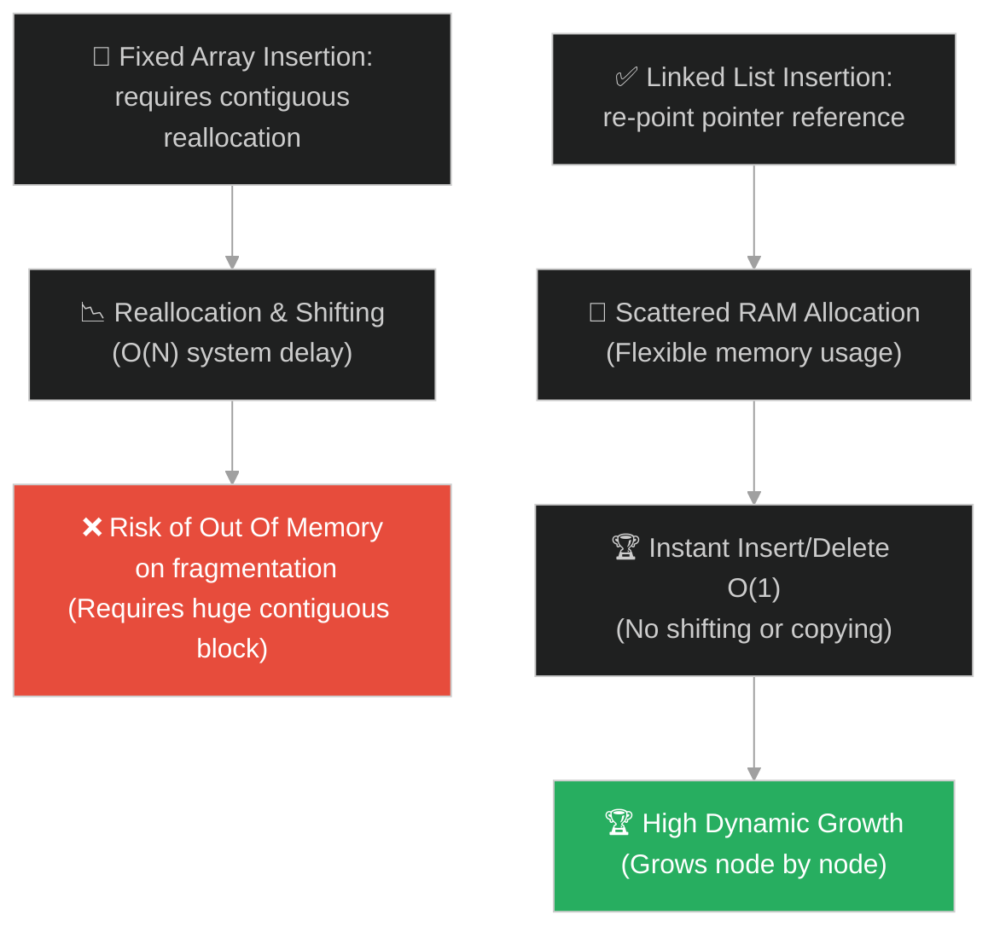
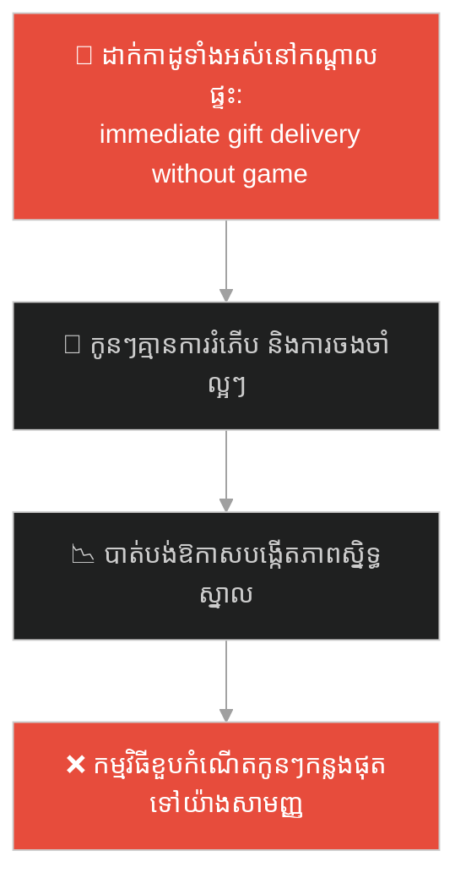
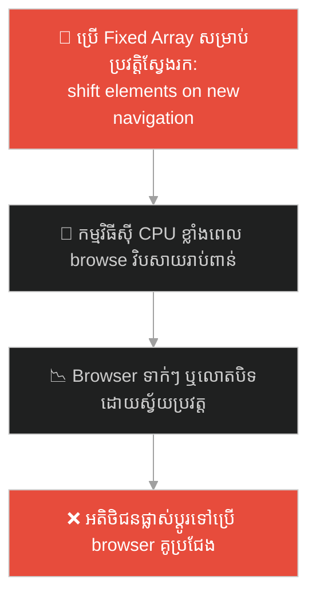
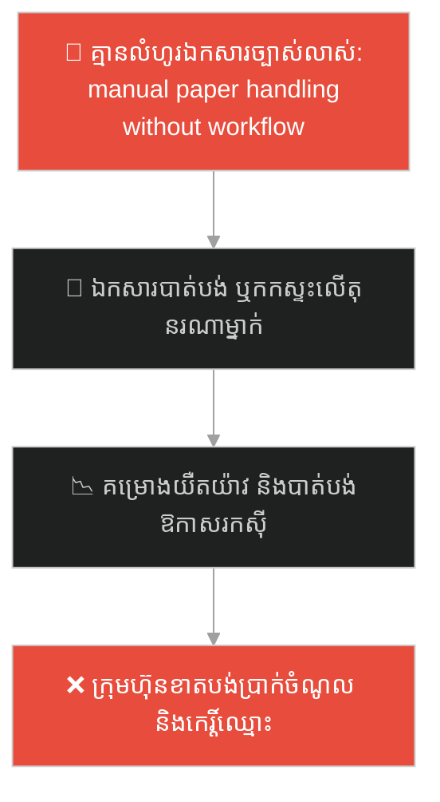
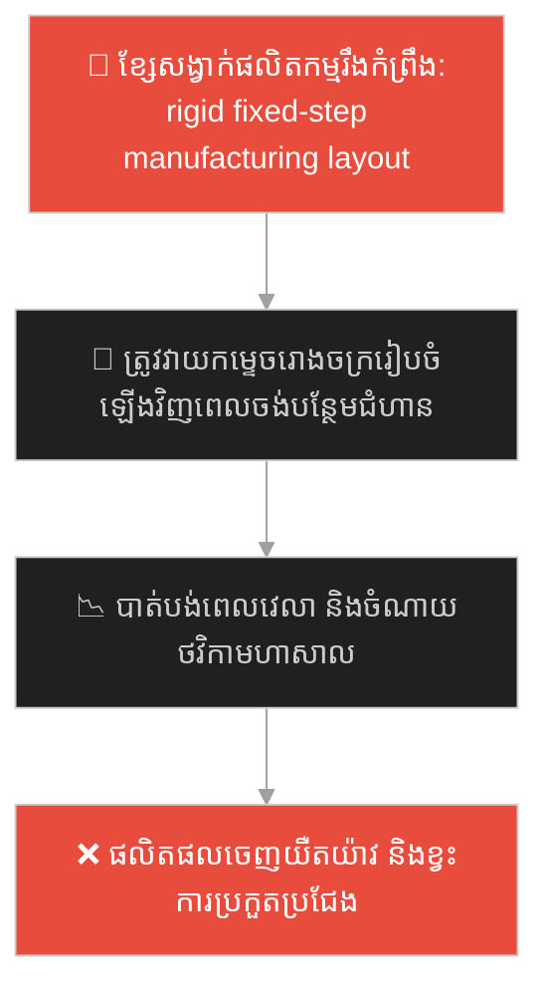
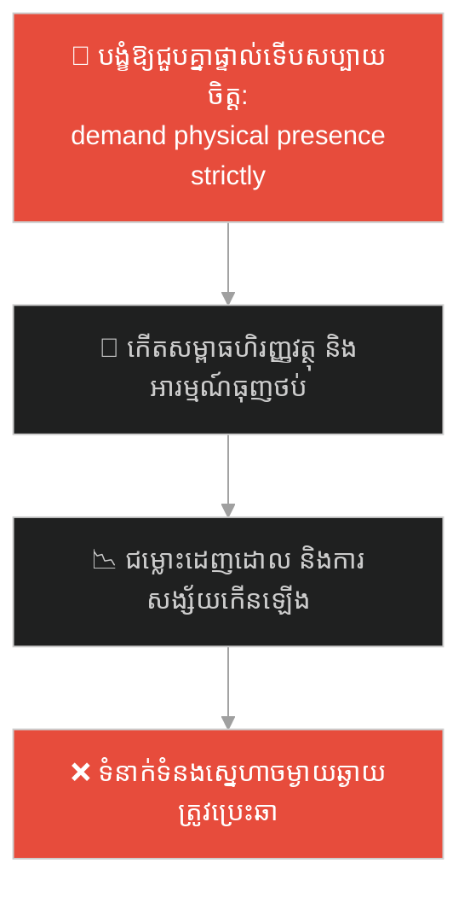
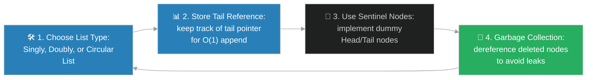

# Linked List Data Structure (រចនាសម្ព័ន្ធទិន្នន័យបញ្ជីចងភ្ជាប់)៖ ចារកម្ម និងល្បែងរកកំណប់ (Linked Lists & The Spy's Treasure Hunt)

**Author:** ichamrong  
**Date:** 2026-05-28  
**Tags:** #dsa #data-structures #linked-lists #memory #parable  
**Category:** Concepts / Parables  
**Read Time:** ~15 min  

---

## 📌 មាតិកា (Table of Contents)
- [អន្ទាក់ផ្លូវចិត្ត (The Trap)](#0)
- [១. រឿងព្រេងប្រវត្តិសាស្ត្រ៖ ចារកម្មសម្ងាត់ និងការលាក់ប្រអប់កំណប់រាយប៉ាយ (The Legend of the Scattered Clues)](#1)
  - [ការបញ្ចូលប្រអប់សម្ងាត់ថ្មីដោយការកាត់តខ្សែសង្វាក់ (Chain Re-pointing Double Link Solution)](#1-1)
- [២. បញ្ហា៖ ការចំណាយលើការបែងចែកអង្គចងចាំ និងការលុបបំបាត់ការរុញទិន្នន័យ (The Issue: Fragmented Allocation and O(N) Traversal vs O(1) Insertion)](#2)
- [៣. ឧទាហមណ៍ជាក់ស្តែងក្នុងពិភពពិត (Real World Examples)](#3)
  - [ឧទាហរណ៍ទី ១ — កម្រិតស្រាល (គ្រួសារ)៖ ល្បែងដេញតាមរកកាដូខួបកំណើត (Birthday Treasure Hunt Game for Kids)](#3-1)
  - [ឧទាហរណ៍ទី ២ — កម្រិតមធ្យម (បច្ចេកទេស)៖ មុខងារប្រវត្តិប្រើងាររាវរកឡើងវិញ (Browser History Navigations)](#3-2)
  - [ឧទាហរណ៍ទី ៣ — កម្រិតមធ្យម (ធុរកិច្ច)៖ លំហូរឯកសារអនុម័តបន្តគ្នា (Multi-stage Document Approval Chain)](#3-3)
  - [ឧទាហរណ៍ទី ៤ — កម្រិតមធ្យម (សង្គម/គ្រប់គ្រង)៖ ជួរខ្សែសង្វាក់នៃការផ្គត់ផ្គង់ផលិតកម្ម (Factory Assembly Line Sequencing)](#3-4)
  - [ឧទាហរណ៍ទី ៥ — កម្រិតធ្ងន់ (ទំនាក់ទំនង)៖ ខ្សែសង្វាក់យោគយល់ និងការស្ដារជំនឿចិត្តបន្តបន្ទាប់ (Connected Micro-Conversations over Long Distance)](#3-5)
- [៤. ដំណោះស្រាយទូទៅ៖ ការប្រើប្រាស់ Linked Lists ក្នុងប្រព័ន្ធទិន្នន័យទំនើប (The General Solution: Practical Implementation of Linked Lists and Memory Management)](#4)
- [សេចក្តីសន្និដ្ឋាន (Conclusion)](#5)
- [ឯកសារយោង (References)](#6)
- [Related Posts](#7)

---

<a id="0"></a>
## អន្ទាក់ផ្លូវចិត្ត (The Trap)

តើអ្នកធ្លាប់ជួបបញ្ហាដែលប្រព័ន្ធរបស់អ្នក ត្រូវបន្ថែម ឬលុបទិន្នន័យនៅចំកណ្តាលសំណុំលំដាប់លំដោយជាញឹកញាប់ ហើយរាល់ពេលអនុវត្ត កម្មវិធីត្រូវចំណាយ CPU យ៉ាងធ្ងន់ធ្ងរលើការរុញទិន្នន័យថយក្រោយ (Shifting) ឬចម្លងអារេថ្មី (Reallocation) ដែរឬទេ? ភាពយឺតយ៉ាវនេះអាចដោះស្រាយបាន ប្រសិនបើយើងឈប់បង្ខំឱ្យទិន្នន័យទាំងអស់ត្រូវស្ថិតនៅប្លុក Memory ជាប់ៗគ្នា។

នៅក្នុងការរៀបចំទិន្នន័យ៖
* **យើងងាយនឹងធ្លាក់ក្នុងអន្ទាក់** នៃការបន្តប្រើប្រាស់ Array សម្រាប់ប្រព័ន្ធដែលមានការ Add/Remove ឌីណាមិកញឹកញាប់ ដោយគិតថាវាសាមញ្ញ ប៉ុន្តែត្រូវចំណាយពេលប្រតិបត្តិការយឺត (O(N) performance cost for insertion)។
* **យើងមើលរំលង** យន្តការ "ប្រើខ្សែសង្វាក់ចង្អុលបង្ហាញ (Pointers/References)" ដើម្បីភ្ជាប់ទិន្នន័យដែលបែកខ្ចាត់ខ្ចាយក្នុង Memory ជួយឱ្យការបន្ថែម/លុបទិន្នន័យលឿន O(1) ដូចផ្លេកបន្ទោរ។

ការព្យាយាមរក្សាទុកទិន្នន័យឌីណាមិកក្នុងប្លុក Memory ជាប់គ្នាប៉ុណ្ណោះ ហៅថា **អន្ទាក់ចងភ្ជាប់ទីតាំងអង្គចងចាំ (Contiguous Memory Rigid Allocation Trap)**។

ដើម្បីយល់ដឹងពីរបៀបបត់បែនទីតាំងទិន្នន័យ នេះជាផែនទីបង្ហាញផ្លូវ៖
1. **រឿងព្រេងប្រវត្តិសាស្ត្រ (The Historic Legend)** — រឿងរ៉ាវរបស់ចារកម្មដែលលាក់កំបប់ដោយប្រើសំបុត្រប្រាប់តម្រុយចង្អុលបន្តគ្នា និងភាពងាយស្រួលក្នុងការបន្ថែមតម្រុយថ្មីដោយមិនរើកន្លែងចាស់។
2. **បញ្ហា (The Issue)** — ការវិភាគការបែងចែក Memory មិនជាប់គ្នា (Non-contiguous memory) ក្នុង Heap និងការប្រៀបធៀប Time Complexity (O(1) insert vs O(N) access)។
3. **ឧទាហមណ៍ជាក់ស្តែងក្នុងពិភពពិត (Real World Examples)** — ពិនិត្យមើលបញ្ហានេះក្នុងកម្រិតគ្រួសារ បច្ចេកវិទ្យា ធុរកិច្ច ការគ្រប់គ្រង និងទំនាក់ទំនង។
4. **ដំណោះស្រាយទូទៅ (The General Solution)** — ការអនុវត្ត Linked List ក្នុងប្រព័ន្ធទិន្នន័យទំនើប និងតុល្យភាពក្នុងការគ្រប់គ្រង Memory។



---

<a id="1"></a>
## ១. រឿងព្រេងប្រវត្តិសាស្ត្រ៖ ចារកម្មសម្ងាត់ និងការលាក់ប្រអប់កំណប់រាយប៉ាយ (The Legend of the Scattered Clues)

កាលពីព្រេងនាយ នៅក្នុងនគរមួយដែលពោរពេញដោយគ្រោះថ្នាក់ ចារកម្មសម្ងាត់ដ៏ឆ្នើមម្នាក់ ត្រូវការលាក់ទុកប្លង់ផែនទីចារកម្មដ៏សំខាន់បំផុតមួយ។ 
* ដោយសារគាត់មិនអាចរកកន្លែងទំនេរធំមួយ ដែលមានសុវត្ថិភាពដើម្បីលាក់ផែនទីទាំងមូលជាប់គ្នាបាន (No Large Contiguous Space) គាត់បានសម្រេចចិត្តកាត់ប្លង់ផែនទីនោះជា ៣ ចំណែក។
* គាត់បានលាក់បំណែកនីមួយៗនៅក្នុង **ប្រអប់កំណប់តូចៗចំនួន ៣** រួចយកទៅលាក់នៅទីតាំងរាយប៉ាយខុសៗគ្នាក្នុងក្រុង (Scattered Heap Memory)៖
  1. **ប្រអប់ទី១:** លាក់នៅសួនច្បាររាជវាំង។ ក្នុងនោះគាត់ដាក់ផែនទីទី១ និងក្រដាសតូចមួយសរសេរថា៖ *"ចូរទៅរកប្រអប់បន្ទាប់នៅចំណតឡានក្រុង"* (Next Pointer)។
  2. **ប្រអប់ទី២:** លាក់នៅចំណតឡានក្រុង។ ក្នុងនោះមានផែនទីទី២ និងក្រដាសសរសេរថា៖ *"ចូរទៅរកប្រអប់ចុងក្រោយនៅលើដំបូលវិហារ"*។
  3. **ប្រអប់ទី៣:** លាក់នៅលើដំបូលវិហារ។ ក្នុងនោះមានផែនទីទី៣ ចុងក្រោយ។
* នៅពេលដៃគូចារកម្មរបស់គាត់ចង់អានផែនទី៖ គាត់មិនអាចរត់ទៅដំបូលវិហារផ្ទាល់បានទេ ព្រោះគាត់មិនដឹងថាប្រអប់នៅកន្លែងណាឡើយ (No Random Access)។
* គាត់ត្រូវតែចាប់ផ្តើមពីសួនច្បារ ស្វែងរកប្រអប់ទី១ រួចទទួលបានតម្រុយនាំទៅចំណតឡាន រួចទទួលបានតម្រុយនាំទៅដំបូលវិហារ (Sequential Traversal O(N))។ នេះជាដំណើរការដើររកស៊ីពេលខ្លាំង។

---

<a id="1-1"></a>
### ការបញ្ចូលប្រអប់សម្ងាត់ថ្មីដោយការកាត់តខ្សែសង្វាក់ (Chain Re-pointing Double Link Solution)

ប៉ុន្តែថ្ងៃមួយ ចារកម្មចង់បន្ថែម "បំណែកផែនទីទី ១.៥ (ជំនួយពិសេស)" ចូលចន្លោះប្រអប់ទី១ (សួនច្បារ) និងទី២ (ចំណតឡាន)។
* តើគាត់ត្រូវដើរទៅផ្លាស់ទីទីតាំងរបស់ប្រអប់ទី២ និងទី៣ មែនទេ? ទេ! គាត់មិនបាច់រំកិលប្រអប់ចាស់ទាំងនោះសូម្បីតែមួយមីលីម៉ែត្រ (No Shifting Needed)។
* គាត់គ្រាន់តែយកប្រអប់ទី ១.៥ ថ្មី ទៅលាក់នៅ **បន្ទប់ទឹកសាធារណៈ**។
* គាត់សរសេរក្រដាសក្នុងប្រអប់ថ្មីនោះឱ្យចង្អុលទៅ៖ *"ទៅចំណតឡានក្រុង"*។
* បន្ទាប់មក គាត់គ្រាន់តែដើរទៅសួនច្បារ បើកប្រអប់ទី១ រួចលុបអក្សរចាស់ចោល ហើយសរសេរថ្មីថា៖ *"ចូរទៅរកប្រអប់បន្ទាប់នៅបន្ទប់ទឹកសាធារណៈ"*។

ការកាត់តខ្សែសង្វាក់នេះ លឿនរហ័សដូចផ្លេកបន្ទោរ (O(1) Dynamic Insertion)។ ប្រអប់រាប់រយផ្សេងទៀតនៅក្នុងខ្សែសង្វាក់ មិនត្រូវបានប៉ះពាល់ ឬផ្លាស់ទីទាល់តែសោះ។

---

<a id="2"></a>
## ២. បញ្ហា៖ ការចំណាយលើការបែងចែកអង្គចងចាំ និងការលុបបំបាត់ការរុញទិន្នន័យ (The Issue: Fragmented Allocation and O(N) Traversal vs O(1) Insertion)

នៅក្នុង DSA **Linked List** គឺជារចនាសម្ព័ន្ធលីនេអ៊ែរដែល Element នីមួយៗ (ហៅថា Node) មិនស្ថិតនៅជាប់គ្នាក្នុង Memory ឡើយ។ Node នីមួយៗផ្ទុកទិន្នន័យ (Data) និងអាសយដ្ឋានចង្អុលទៅ Node បន្ទាប់ (Pointer/Reference)៖

```java
// Node នីមួយៗចង្អុលទៅ Node បន្ទាប់តាម Reference
class Node {
    int data;
    Node next; // Reference to the next node in RAM

    Node(int data) {
        this.data = data;
        this.next = null;
    }
}
```

* **ភាពទន់ខ្សោយលើការស្វែងរក (Traversal Cost O(N))៖** ដោយសារ Node ស្ថិតនៅបែកខ្ចាត់ខ្ចាយ កុំព្យូទ័រមិនអាចគណនាអាសយដ្ឋានរបស់ Node ទី `i` តាមរយៈ Index បានឡើយ។ កុំព្យូទ័រត្រូវតែ Loop តាម Pointer ពីក្បាល (Head) ម្តងមួយៗរហូតដល់ Node ទី `i` (O(N) Sequential Search) ដែលធ្វើឱ្យការអានទិន្នន័យយឺតជាង Array។
* **ចំណុចខ្លាំងលើការបញ្ចូល/លុប (O(1) Insertion/Deletion)៖** ប្រសិនបើយើងដឹងទីតាំង Node ត្រូវបញ្ចូលរួចហើយ ការបញ្ចូលគឺគ្រាន់តែប្តូរខ្សែចង្អុលប៉ុណ្ណោះ៖

```java
// ការបញ្ចូល Node ថ្មីនៅកណ្តាល Linked List គឺលឿនខ្លាំង
newNode.next = prevNode.next; // ចង្អុល Node ថ្មីទៅ Node បន្ទាប់
prevNode.next = newNode;      // ចង្អុល Node មុនមក Node ថ្មី
```

គ្មានការរុញទិន្នន័យ (Shifting) គ្មានការ Copy ទិន្នន័យ និងគ្មានការបារម្ភពីរឿងពេញ Memory ឡើយ ព្រោះទិន្នន័យត្រូវបានបន្ថែមឌីណាមិកម្តងមួយ Node យ៉ាងទន់ភ្លន់ និងមានប្រសិទ្ធភាពខ្ពស់។

---

<a id="3"></a>
## ៣. ឧទាហមណ៍ជាក់ស្តែងក្នុងពិភពពិត

---

<a id="3-1"></a>
### ឧទាហរណ៍ទី ១ — កម្រិតស្រាល (គ្រួសារ)៖ ល្បែងដេញតាមរកកាដូខួបកំណើត (Birthday Treasure Hunt Game for Kids)

នៅក្នុងគ្រួសារមួយ ឪពុកម្តាយរៀបចំល្បែងស្វែងរកកាដូខួបកំណើតឱ្យកូនៗ។ ជំនួសឱ្យការដាក់កាដូទាំងអស់នៅកណ្តាលផ្ទះ (Direct Gift Placement Trap) ពួកគាត់បានលាក់សំបុត្រតម្រុយតាមកន្លែងផ្សេងៗ៖ សំបុត្រទី១ នៅក្រោមខ្នើយប្រាប់ឱ្យកូនទៅរកសំបុត្រទី២ ក្នុងទូរទឹកកក។ សំបុត្រទី២ ប្រាប់ឱ្យទៅរកសំបុត្រទី៣ ក្នុងឡាន។ នេះគឺជា Linked List ជាក់ស្តែង។ កូនៗត្រូវដើររកតាមលំដាប់លំដោយ ជួយបង្កើតការកម្សាន្ត និងភាពរីករាយយ៉ាងខ្លាំង។



ការប្រើខ្សែសង្វាក់តម្រុយ បង្កើតឱ្យមានក្តីរំភើប និងទំនាក់ទំនងដ៏អស្ចារ្យ។

---

<a id="3-2"></a>
### ឧទាហរណ៍ទី ២ — កម្រិតមធ្យម (បច្ចេកទេស)៖ មុខងារប្រវត្តិប្រើងាររាវរកឡើងវិញ (Browser History Navigations)

នៅក្នុង Web Browser (ដូចជា Google Chrome, Safari) ពេលអ្នកចុចលើ Link ទៅកាន់វិបសាយថ្មីៗ ប្រព័ន្ធរក្សាទុកប្រវត្តិស្វែងរកក្នុង **Doubly Linked List**។ Node នីមួយៗផ្ទុក URL និងចង្អុលទៅ URL មុន (Back) និង URL បន្ទាប់ (Forward)។ នៅពេលអ្នកចុចប៊ូតុង "Back" ឬ "Forward" ប្រព័ន្ធគ្រាន់តែរំកិល Pointer ទៅកាន់ Node មុន ឬក្រោយភ្លាមៗ ធានាបាននូវការរុករកទិន្នន័យរលូនឥតខ្ចោះ។



---

<a id="3-3"></a>
### ឧទាហរណ៍ទី ៣ — កម្រិតមធ្យម (ធុរកិច្ច)៖ លំហូរឯកសារអនុម័តបន្តគ្នា (Multi-stage Document Approval Chain)

នៅក្នុងការគ្រប់គ្រងស្ថាប័ន ដំណើរការឯកសារអនុម័ត (Approval Workflow) ត្រូវឆ្លងកាត់មនុស្សជាច្រើន៖ `បុគ្គលិក` -> `ប្រធានក្រុម` -> `ប្រធាននាយកដ្ឋាន` -> `នាយកហិរញ្ញវត្ថុ` -> `CEO`។ នេះជា Linked List នៃអំណាចអនុម័ត។ ប្រសិនបើនាយកដ្ឋានចង់បន្ថែម "អ្នកពិនិត្យច្បាប់ (Legal Officer)" ចូលចន្លោះប្រធានក្រុម និងប្រធាននាយកដ្ឋាន ពួកគេគ្រាន់តែប្តូរ Reference ចង្អុលឱ្យឯកសារហូរទៅកាន់ Legal Officer ជាមុន រួចទើបបន្តទៅប្រធាននាយកដ្ឋាន ធានាលំហូរឯកសារឌីណាមិកដោយមិនបាច់រៀបចំរចនាសម្ព័ន្ធក្រុមហ៊ុនថ្មីឡើយ។



---

<a id="3-4"></a>
### ឧទាហរណ៍ទី ៤ — កម្រិតមធ្យម (សង្គម/គ្រប់គ្រង)៖ ជួរខ្សែសង្វាក់នៃការផ្គត់ផ្គង់ផលិតកម្ម (Factory Assembly Line Sequencing)

នៅក្នុងរោងចក្រដំឡើងឡាន ខ្សែសង្វាក់ផលិតកម្ម (Assembly Line) ដំណើរការតាមជំហានបន្តគ្នា៖ `ដំឡើងគ្រោងឆ្អឹង` -> `បំពាក់ម៉ាស៊ីន` -> `បាញ់ថ្នាំ` -> `ដំឡើងកង់` -> `ពិនិត្យគុណភាព`។ ប្រសិនបើរោងចក្រចង់បន្ថែម "ជំហានលាងសម្អាត និងវ៉ារនីស" មុនពេលបាញ់ថ្នាំ វិស្វករដំឡើងគ្រាន់តែប្តូរកៅអីបញ្ជូនការងារ (Chains) ឱ្យឆ្លងកាត់ម៉ាស៊ីនលាងសម្អាតជាមុន រួចទើបបញ្ជូនទៅផ្នែកបាញ់ថ្នាំ ធានាបាននូវការកែសម្រួលខ្សែសង្វាក់ផលិតកម្មទន់ភ្លន់បំផុត។



---

<a id="3-5"></a>
### ឧទាហរណ៍ទី ៥ — កម្រិតធ្ងន់ (ទំនាក់ទំនង)៖ ខ្សែសង្វាក់យោគយល់ និងការស្ដារជំនឿចិត្តបន្តបន្ទាប់ (Connected Micro-Conversations over Long Distance)

នៅក្នុងទំនាក់ទំនងស្នេហាចម្ងាយឆ្ងាយ (Long Distance Relationship) គូស្នេហ៍មិនអាចជួបគ្នាផ្ទាល់រាល់ថ្ងៃបានឡើយ (No contiguous quality time)។ ពួកគេរក្សាទំនាក់ទំនងតាមរយៈ "ខ្សែសង្វាក់នៃការផ្ញើសារ និងការសន្ទនាតូចៗប្រចាំថ្ងៃ (Connected Micro-conversations)"។ សារនីមួយៗចង្អុលបង្ហាញ និងភ្ជាប់ទៅកាន់សារមុន និងបង្កើតក្តីសង្ឃឹមសម្រាប់ថ្ងៃស្អែក។ ប្រសិនបើពួកគេចង់បន្ថែម "ការភ្ញាក់ផ្អើលពិសេស (Surprise Gift Delivery)" ពួកគេគ្រាន់តែស៊កវាចូលទៅក្នុងខ្សែសង្វាក់សន្ទនា ដោយមិនបាច់ផ្លាស់ប្តូរការរស់នៅប្រចាំថ្ងៃរបស់ដៃគូ ជួយឱ្យស្នេហានៅតែផ្អែមល្ហែម និងយល់ចិត្តគ្នាជានិច្ច។



---

<a id="4"></a>
## ៤. ដំណោះស្រាយទូទៅ៖ ការប្រើប្រាស់ Linked Lists ក្នុងប្រព័ន្ធទិន្នន័យទំនើប (The General Solution: Practical Implementation of Linked Lists and Memory Management)

ដើម្បីទទួលបានអត្ថប្រយោជន៍ជាអតិបរមាពី **Linked List** និងគ្រប់គ្រងការចំណាយ Memory ឱ្យមានប្រសិទ្ធភាព យើងត្រូវអនុវត្តវិធីសាស្ត្រស្តង់ដារ៖



ជំហាននៃការអនុវត្ត៖
1. **ជ្រើសរើសប្រភេទ Linked List ឱ្យត្រូវនឹងការងារ៖**
   * **Singly Linked List:** សាមញ្ញ ប្រើប្រាស់ Memory តិច (Pointer ចង្អុលទៅមុខតែមួយទិស)។
   * **Doubly Linked List:** បត់បែនខ្លាំង (ចង្អុលទៅមុខផង ថយក្រោយផង) ល្អសម្រាប់សកម្មភាពដែលត្រូវការដើរថយក្រោយ (ដូចជា Browser History)។
2. **រក្សាទុក Reference ទៅកាន់កន្ទុយ (Tail Pointer)៖** ក្រៅពីដឹងក្បាល (Head) យើងត្រូវរក្សាចង្អុលទៅកន្ទុយ (`Tail`) ដើម្បីឱ្យការបន្ថែមទិន្នន័យនៅខាងចុង (Append) ដំណើរការលឿន O(1) ដោយមិនបាច់ Loop ពីក្បាលទៅកន្ទុយឡើយ។
3. **ប្រើប្រាស់ Sentinel Nodes (Dummy Nodes)៖** បង្កើត dummy Head និង dummy Tail ដើម្បីលុបបំបាត់ការសរសេរកូដឆែកលក្ខខណ្ឌ `if(head == null)` ជួយឱ្យកូដបន្ថែម/លុប ខ្លី ស្អាត និងមានសុវត្ថិភាពខ្ពស់។
4. **លុបបំបាត់ការធ្លាយ Memory (Memory Leak Prevention)៖** ក្នុងភាសាដែលគ្មាន Garbage Collector ស្វ័យប្រវត្ត (ដូចជា C/C++) រាល់ពេលលុប Node យើងត្រូវលុបបំបាត់ការចង្អុល (Dereference) និងហៅ `free()` ឬ `delete` ឱ្យបានត្រឹមត្រូវ ដើម្បីចៀសវាងការខាតបង់ទំហំ RAM ឥតប្រយោជន៍។

---

## 🐇 ធ្លាក់ចូលក្នុងរន្ធទន្សាយ (Enter the Rabbit Hole)

ដើម្បីស្វែងយល់ពីរបៀបដែលចុងភៅភោជនីយដ្ឋាន ឬវិស្វករប្រព័ន្ធទិន្នន័យ បានចាត់ចែងរៀបចំឯកសារ ឬការងារជាជួរៗដ៏មានរបៀបរៀបរយ ដោយប្រើប្រាស់គោលការណ៍ "នរណាមកមុនធ្វើមុន" (Queues) ឬ "នរណាមកក្រោយធ្វើមុន" (Stacks) ដើម្បីគ្រប់គ្រងលំហូរទិន្នន័យ និងធនធានប្រព័ន្ធប្រកបដោយប្រសិទ្ធភាពខ្ពស់បំផុត សូមបន្តដំណើរទៅកាន់៖

* 🚀 **[ចាប់ផ្តើមដំណើររុករក (Start the Journey) ➔ Stacks, Queues, and Linear Buffer Controllers](./100-the-dish-stack-and-the-ticket-queue.md)**

---

<a id="5"></a>
## សេចក្តីសន្និដ្ឋាន (Conclusion)

> **«សេរីភាពនៃការបែកខ្ចាត់ខ្ចាយ គឺសក្តិសមបំផុតសម្រាប់ប្រព័ន្ធដែលមានការប្រែប្រួល និងលូតលាស់ជាលំដាប់»**

ការប្រើប្រាស់ Linked List ជួយលុបបំបាត់ការខាតបង់ថាមពល CPU លើការចម្លង និងរុញទិន្នន័យ Memory ជួយឱ្យប្រព័ន្ធរបស់អ្នកមានភាពឌីណាមិកខ្ពស់ ងាយស្រួលពង្រីក និងដោះស្រាយបញ្ហា RAM Fragmentation ប្រកបដោយប្រសិទ្ធភាព និងស្ថិរភាពខ្ពស់បំផុត។

---

<a id="6"></a>
## ឯកសារយោង (References)

* **Knuth, D. E.** — *The Art of Computer Programming, Volume 1: Fundamental Algorithms* (1997). Linked allocation, pointer manipulation, and doubly linked lists structures.
* **Cormen, T. H., Leiserson, C. E., Rivest, R. L., & Stein, C.** — *Introduction to Algorithms* (2009). Dynamic lists, sentinel representation, and complexity bounds.

---

<a id="7"></a>
## Related Posts

* [[DSA: Linked Lists](../dsa/01-linear-structures.md#2-linked-lists-dynamic-flexibility)] — ការពន្យល់លម្អិត និងស៊ីជម្រៅអំពី Linked Lists ក្នុង DSA។
* [[Array Data Structure & The Cinema Seats](./98-the-cinema-seats.md)] — ការយល់ដឹងពីចំណុចខ្លាំងរបស់ Arrays ដែលមានល្បឿន direct access O(1) លឿនជាង Linked Lists។
