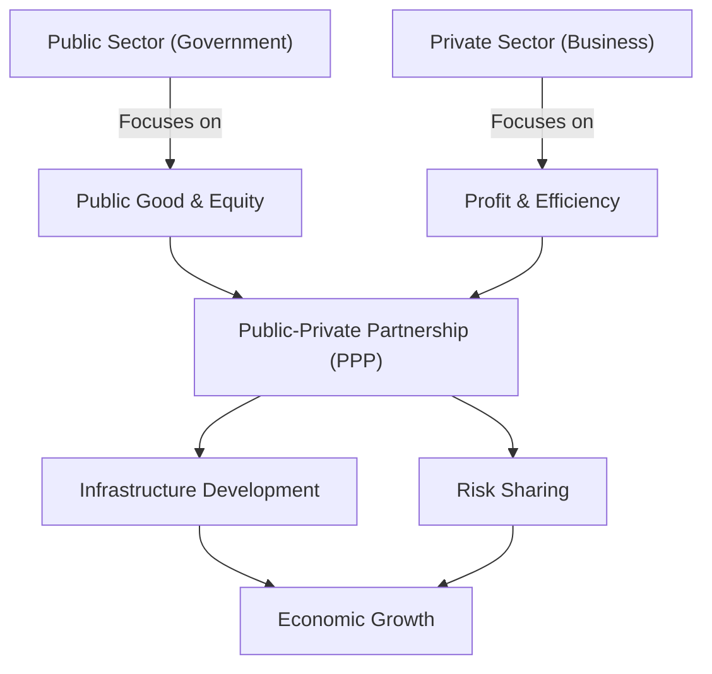

# The City Builder and the Merchant (អ្នកសាងសង់ទីក្រុង និងឈ្មួញ)

**Author:** ichamrong  
**Date:** 2026-05-26  
**Tags:** #public-administration #ppp #public-private-partnership #efficiency #public-good  
**Category:** Concepts / Parables  
**Read Time:** ~5 min  

---

## 📌 មាតិកា (Table of Contents)
- [ការសាងសង់ស្ពាន (Building the Bridge)](#ការសាងសង់ស្ពាន-building-the-bridge)
- [ការចរចាភាពជាដៃគូ (Negotiating the Partnership)](#ការចរចាភាពជាដៃគូ-negotiating-the-partnership)
- [លទ្ធផលជោគជ័យ (The Successful Outcome)](#លទ្ធផលជោគជ័យ-the-successful-outcome)
- [ការវិភាគទ្រឹស្តី៖ Public-Private Partnerships (Theoretical Breakdown)](#ការវិភាគទ្រឹស្តី-public-private-partnerships-theoretical-breakdown)
- [Related Posts](#related-posts)

---

## ការសាងសង់ស្ពាន (Building the Bridge)

In a growing kingdom, a great river divided the capital from the fertile farming lands. The King needed a new bridge to allow the farmers to bring their crops to the city markets, ensuring the city's food supply and economic growth (Economic Growth). He appointed his most trusted official, the City Builder, to manage the project.

The City Builder was deeply committed to the public good (Public Good). He designed a grand bridge, wide enough for armies and strong enough to last a thousand years. However, when he presented the plan, the royal treasury was nearly empty. The project would take ten years to fund and build. 

---

## ការចរចាភាពជាដៃគូ (Negotiating the Partnership)

Realizing the urgency, the City Builder approached the kingdom's wealthiest Merchant. He proposed a partnership (Public-Private Partnership): the Merchant would use his vast resources and efficient workers to build the bridge in just one year. In return, the Merchant would be allowed to collect a small toll from the traders crossing the bridge for twenty years, after which the bridge would belong entirely to the kingdom.

The Merchant agreed but demanded the right to set the toll price himself. The City Builder refused, knowing the Merchant might charge so much that poor farmers couldn't cross, defeating the purpose of the bridge. They negotiated (Negotiation) intensely. Finally, they agreed that the toll would be capped at a low, affordable rate, but the Merchant would also be granted exclusive rights to build storehouses near the city entrance, allowing him to profit from the increased trade volume.

---

## លទ្ធផលជោគជ័យ (The Successful Outcome)

The bridge was built swiftly and efficiently (Efficiency). The farmers sold their crops, the city thrived, and the Merchant grew wealthier through his storehouses without exploiting the people. The partnership succeeded because the City Builder protected the public interest (Public Interest) while harnessing the Merchant's drive for efficiency and profit.

---

(The Khmer translation follows below for the entire story.)

នៅក្នុងនគរដែលកំពុងអភិវឌ្ឍមួយ មានទន្លេដ៏ធំមួយដែលខណ្ឌចែករាជធានី និងតំបន់កសិកម្មដ៏មានជីជាតិ។ ព្រះរាជាត្រូវការស្ពានថ្មីមួយ ដើម្បីអនុញ្ញាតឱ្យកសិករនាំយកកសិផលរបស់ពួកគេមកកាន់ទីផ្សារទីក្រុង ដែលធានាបាននូវការផ្គត់ផ្គង់ស្បៀងអាហារ និងកំណើនសេដ្ឋកិច្ច (Economic Growth) របស់ទីក្រុង។ ព្រះអង្គបានតែងតាំងមន្ត្រីជាទីទុកចិត្តបំផុតរបស់ព្រះអង្គ គឺអ្នកសាងសង់ទីក្រុង (City Builder) ឱ្យគ្រប់គ្រងគម្រោងនេះ។

អ្នកសាងសង់ទីក្រុងមានការប្តេជ្ញាចិត្តយ៉ាងមុតមាំចំពោះប្រយោជន៍សាធារណៈ (Public Good)។ គាត់បានរចនាស្ពានដ៏ធំមួយ ដែលមានទំហំធំទូលាយល្មមសម្រាប់កងទ័ព និងរឹងមាំគ្រប់គ្រាន់ដើម្បីប្រើប្រាស់បានមួយពាន់ឆ្នាំ។ ទោះជាយ៉ាងណាក៏ដោយ នៅពេលដែលគាត់បង្ហាញផែនការ ឃ្លាំងរតនាគារជាតិស្ទើរតែទទេស្អាត។ គម្រោងនេះនឹងត្រូវចំណាយពេលដប់ឆ្នាំដើម្បីផ្តល់មូលនិធិ និងសាងសង់។

ដោយដឹងពីភាពបន្ទាន់ អ្នកសាងសង់ទីក្រុងបានទៅជួបឈ្មួញ (Merchant) ដ៏មានទ្រព្យសម្បត្តិស្តុកស្តម្ភបំផុតនៅក្នុងនគរ។ គាត់បានស្នើរសុំភាពជាដៃគូ (Public-Private Partnership): ឈ្មួញនឹងប្រើប្រាស់ធនធានដ៏ច្រើនសន្ធឹកសន្ធាប់ និងកម្មករប្រកបដោយប្រសិទ្ធភាពរបស់គាត់ ដើម្បីសាងសង់ស្ពានក្នុងរយៈពេលតែមួយឆ្នាំប៉ុណ្ណោះ។ ជាថ្នូរមកវិញ ឈ្មួញនឹងត្រូវបានអនុញ្ញាតឱ្យប្រមូលថ្លៃឆ្លងកាត់ស្ពាន (Toll) ក្នុងចំនួនតិចតួចពីពាណិជ្ជករដែលឆ្លងកាត់រយៈពេលម្ភៃឆ្នាំ បន្ទាប់ពីនោះស្ពាននឹងក្លាយជារបស់នគរទាំងស្រុង។

ឈ្មួញបានយល់ព្រម ប៉ុន្តែបានទាមទារសិទ្ធិក្នុងការកំណត់តម្លៃឆ្លងកាត់ដោយខ្លួនឯង។ អ្នកសាងសង់ទីក្រុងបានបដិសេធ ដោយដឹងថាឈ្មួញអាចនឹងគិតប្រាក់ច្រើនពេក ដែលធ្វើឱ្យកសិករក្រីក្រមិនអាចឆ្លងកាត់បាន ដែលជាការបំផ្លាញគោលបំណងដើមនៃស្ពាននេះ។ ពួកគេបានធ្វើការចរចា (Negotiation) យ៉ាងស្វិតស្វាញ។ ទីបំផុត ពួកគេបានយល់ព្រមថា ថ្លៃឆ្លងកាត់នឹងត្រូវកំណត់ក្នុងកម្រិតទាបមួយដែលអាចទទួលយកបាន ប៉ុន្តែឈ្មួញក៏នឹងត្រូវបានផ្តល់សិទ្ធិផ្តាច់មុខក្នុងការសាងសង់ឃ្លាំងស្តុកទំនិញនៅជិតច្រកចូលទីក្រុងផងដែរ ដែលអនុញ្ញាតឱ្យគាត់ទទួលបានប្រាក់ចំណេញពីការកើនឡើងនៃទំហំពាណិជ្ជកម្ម។

ស្ពាននេះត្រូវបានសាងសង់យ៉ាងរហ័ស និងប្រកបដោយប្រសិទ្ធភាព (Efficiency)។ កសិករបានលក់កសិផលរបស់ពួកគេ ទីក្រុងមានការរីកចម្រើន ហើយឈ្មួញកាន់តែមានទ្រព្យសម្បត្តិច្រើនឡើងតាមរយៈឃ្លាំងរបស់គាត់ ដោយមិនបានកេងប្រវ័ញ្ចលើប្រជាជនឡើយ។ ភាពជាដៃគូបានទទួលជោគជ័យ ដោយសារតែអ្នកសាងសង់ទីក្រុងបានការពារផលប្រយោជន៍សាធារណៈ (Public Interest) ស្របពេលដែលទាញយកអត្ថប្រយោជន៍ពីភាពប៉ិនប្រសប់ និងគោលដៅប្រាក់ចំណេញរបស់ឈ្មួញ។

---

## ការវិភាគទ្រឹស្តី៖ Public-Private Partnerships (Theoretical Breakdown)

The story illustrates the core concept of a **Public-Private Partnership (PPP)**, a critical strategy in modern public administration. 

Governments often have a mandate to provide large-scale public goods (like infrastructure, healthcare, or education) but may lack the immediate capital, specialized expertise, or operational efficiency to deliver them quickly. Private companies possess capital, innovation, and a drive for efficiency, but their primary motive is profit, not social welfare.

A successful PPP balances these opposing forces. The public sector (the City Builder) sets the regulatory framework to ensure the project serves the public interest and remains equitable (capping the toll). The private sector (the Merchant) takes on the construction and operational risks in exchange for a reasonable return on investment (the toll revenue and storehouse rights). 

### Key Takeaways for Public Administration:
1. **Leveraging Private Efficiency:** Bureaucracies are often slow; private entities are optimized for speed and cost-control.
2. **Protecting the Public Interest:** Contracts must be tightly negotiated to prevent monopolies or exploitation of citizens.
3. **Risk Allocation:** The party best equipped to manage a specific risk (e.g., construction delays for the private sector, regulatory changes for the government) should bear it.

---

## Related Posts

- **[Public-Private Partnerships](../../../../colleges/robert-kennedy-college/mba-public-administration/public-governance/01-public-private-partnerships.md)** — A deep dive into PPP structures, risk allocation, and Value for Money (VfM).

---

*Last updated: 2026-05-26*
