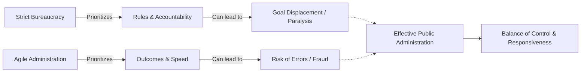

# The Bridge of Efficiency (ស្ពាននៃប្រសិទ្ធភាព)

**Author:** ichamrong  
**Date:** 2026-05-26  
**Tags:** #bureaucracy #process-optimization #public-administration #agility #red-tape  
**Category:** Concepts / Parables  
**Read Time:** ~5 min  

---

## 📌 មាតិកា (Table of Contents)
- [ប្រព័ន្ធដ៏ល្អឥតខ្ចោះ (The Perfect System)](#ប្រព័ន្ធដ៏ល្អឥតខ្ចោះ-the-perfect-system)
- [វិបត្តិរដូវរងា (The Winter Crisis)](#វិបត្តិរដូវរងា-the-winter-crisis)
- [ការផ្លាស់ប្តូរ (The Change)](#ការផ្លាស់ប្តូរ-the-change)
- [ការវិភាគទ្រឹស្តី៖ Bureaucracy vs. Agility (Theoretical Breakdown)](#ការវិភាគទ្រឹស្តី-bureaucracy-vs-agility-theoretical-breakdown)
- [Related Posts](#related-posts)

---

## ប្រព័ន្ធដ៏ល្អឥតខ្ចោះ (The Perfect System)

In a highly organized city, a strict Bureaucrat managed the distribution of winter firewood to the citizens. To prevent theft and ensure fairness, he instituted a rigorous process (Process Optimization): every citizen had to fill out five different forms, obtain three official stamps, and wait in four separate lines. 

For years, the system worked perfectly on paper. No wood was stolen, and the accounting was flawless. The Bureaucrat was praised for his flawless system.

---

## វិបត្តិរដូវរងា (The Winter Crisis)

However, during a particularly harsh winter, a sudden blizzard struck the city. Citizens urgently needed firewood to survive the freezing temperatures. But the Bureaucrat refused to change the rules. "The process must be followed," he insisted. "Without the five forms and three stamps, chaos will ensue."

As a result, thousands of citizens froze while massive piles of firewood sat perfectly organized and untouched in the city squares. The process had survived, but the people it was meant to serve had suffered.

---

## ការផ្លាស់ប្តូរ (The Change)

When the King learned of this, he immediately dismissed the Bureaucrat. He appointed a new administrator who quickly established an emergency protocol (Agility). The new administrator bypassed the forms, trusting local neighborhood leaders to distribute the wood rapidly, accepting a small margin of error or loss in exchange for saving lives. The new administrator understood that a process is only a bridge to a goal, not the goal itself.

---

(The Khmer translation follows below for the entire story.)

នៅក្នុងទីក្រុងដែលរៀបចំបានយ៉ាងល្អមួយ មានអ្នកការិយាធិបតេយ្យ (Bureaucrat) ដ៏តឹងរ៉ឹងម្នាក់បានគ្រប់គ្រងការចែកចាយអុសសម្រាប់រដូវរងាដល់ប្រជាពលរដ្ឋ។ ដើម្បីទប់ស្កាត់ការលួច និងធានាបាននូវភាពយុត្តិធម៌ គាត់បានបង្កើតដំណើរការដ៏តឹងរ៉ឹងមួយ (Process Optimization): ប្រជាពលរដ្ឋគ្រប់រូបត្រូវបំពេញទម្រង់បែបបទចំនួនប្រាំផ្សេងគ្នា ទទួលបានត្រាផ្លូវការចំនួនបី និងរង់ចាំក្នុងជួរចំនួនបួនដាច់ដោយឡែកពីគ្នា។

អស់រយៈពេលជាច្រើនឆ្នាំ ប្រព័ន្ធនេះដំណើរការយ៉ាងល្អឥតខ្ចោះនៅលើក្រដាស។ គ្មានអុសត្រូវបានលួចទេ ហើយគណនេយ្យគឺគ្មានកំហុសអ្វីទាំងអស់។ អ្នកការិយាធិបតេយ្យត្រូវបានគេសរសើរចំពោះប្រព័ន្ធដ៏ល្អឥតខ្ចោះរបស់គាត់។

ទោះជាយ៉ាងណាក៏ដោយ ក្នុងអំឡុងពេលរដូវរងាដ៏ត្រជាក់អាក្រក់មួយ មានខ្យល់ព្យុះព្រិលធ្លាក់យ៉ាងទាន់ហន់មកលើទីក្រុង។ ប្រជាពលរដ្ឋត្រូវការអុសជាបន្ទាន់ដើម្បីរស់រានមានជីវិតពីសីតុណ្ហភាពដ៏ត្រជាក់កក។ ប៉ុន្តែអ្នកការិយាធិបតេយ្យបដិសេធមិនព្រមផ្លាស់ប្តូរច្បាប់នោះទេ។ គាត់បានទទូចថា "ដំណើរការត្រូវតែអនុវត្តតាម។ បើគ្មានទម្រង់បែបបទទាំងប្រាំ និងត្រាទាំងបីទេ ភាពវឹកវរនឹងកើតឡើងមិនខាន"។

ជាលទ្ធផល ប្រជាពលរដ្ឋរាប់ពាន់នាក់ត្រូវរងភាពរងា ខណៈដែលគំនរអុសដ៏ធំត្រូវបានរៀបចំយ៉ាងល្អឥតខ្ចោះ និងមិនមានអ្នកណាហ៊ានប៉ះពាល់នៅតាមទីធ្លាទីក្រុង។ ដំណើរការនេះបានរស់រានមានជីវិត ប៉ុន្តែប្រជាជនដែលវាត្រូវបម្រើបែរជាត្រូវរងទុក្ខវេទនាទៅវិញ។

នៅពេលដែលព្រះរាជាបានជ្រាបពីរឿងនេះ ព្រះអង្គបានបញ្ឈប់ការងាររបស់អ្នកការិយាធិបតេយ្យនោះភ្លាមៗ។ ព្រះអង្គបានតែងតាំងអ្នកគ្រប់គ្រងថ្មីម្នាក់ ដែលបានបង្កើតពិធីសារគ្រាអាសន្នយ៉ាងរហ័ស (Agility)។ អ្នកគ្រប់គ្រងថ្មីបានរំលងទម្រង់បែបបទទាំងនោះ ដោយជឿទុកចិត្តលើមេដឹកនាំសង្កាត់ក្នុងតំបន់ឱ្យចែកចាយអុសយ៉ាងឆាប់រហ័ស ដោយទទួលយកនូវកំហុស ឬការបាត់បង់បន្តិចបន្តួច ជាថ្នូរនឹងការជួយសង្គ្រោះជីវិតមនុស្ស។ អ្នកគ្រប់គ្រងថ្មីបានយល់ថា ដំណើរការគ្រាន់តែជាស្ពានឆ្ពោះទៅរកគោលដៅប៉ុណ្ណោះ មិនមែនជាគោលដៅនោះទេ។

---

## ការវិភាគទ្រឹស្តី៖ Bureaucracy vs. Agility (Theoretical Breakdown)

This parable highlights a common pitfall in public administration: **Goal Displacement**. This occurs when following the rules and procedures (the bureaucracy) becomes more important than the actual public service the rules were designed to deliver.

In MBA Public Administration programs, striking a balance between strict accountability and operational agility is a central theme.

### Key Takeaways for Public Administration:
1. **The Purpose of Process:** Standard Operating Procedures (SOPs) are necessary for fairness, transparency, and auditing. However, they must serve the outcome, not hinder it.
2. **Crisis Management:** Public organizations must have built-in agility—mechanisms to bypass standard bureaucracy during emergencies without sacrificing core accountability.
3. **Red Tape:** Excessive regulation ("red tape") often leads to organizational paralysis. Good governance requires regular reviews to simplify processes and improve citizen experience (User-Centric Service).

---

## Related Posts

- **[Bureaucracy & Process Optimization](../../../../colleges/robert-kennedy-college/mba-public-administration/public-governance/02-bureaucracy-and-process-optimization.md)** — Learn more about Lean Government, Goal Displacement, and optimizing public sector workflows.

---

*Last updated: 2026-05-26*
