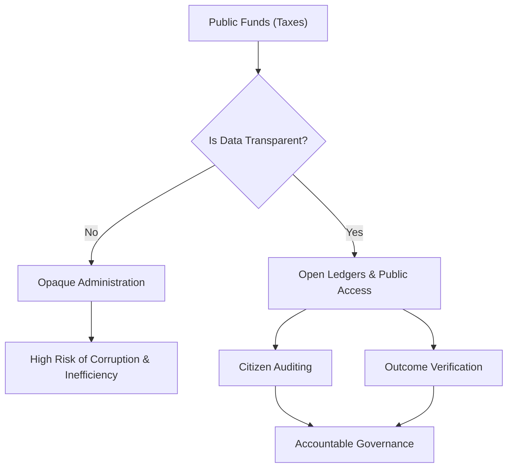

# The King and the Ledger (ព្រះរាជា និងសៀវភៅបញ្ជី)

**Author:** ichamrong  
**Date:** 2026-05-26  
**Tags:** #data-analytics #transparency #corruption #open-data #evidence-based-governance  
**Category:** Concepts / Parables  
**Read Time:** ~5 min  

---

## 📌 មាតិកា (Table of Contents)
- [សេចក្តីសង្ស័យ (The Suspicion)](#សេចក្តីសង្ស័យ-the-suspicion)
- [ដំណោះស្រាយបែបតម្លាភាព (The Transparent Solution)](#ដំណោះស្រាយបែបតម្លាភាព-the-transparent-solution)
- [ប្រជាពលរដ្ឋជាសវនករ (Citizens as Auditors)](#ប្រជាពលរដ្ឋជាសវនករ-citizens-as-auditors)
- [ការវិភាគទ្រឹស្តី៖ Data Transparency & Auditing (Theoretical Breakdown)](#ការវិភាគទ្រឹស្តី-data-transparency-auditing-theoretical-breakdown)
- [Related Posts](#related-posts)

---

## សេចក្តីសង្ស័យ (The Suspicion)

A kingdom was losing a vast portion of its wealth each year, but the King did not know where the money was going. He suspected his provincial governors were corrupt, skimming taxes before sending them to the capital. To solve this, the King summoned his most brilliant scholar, an expert in numbers and observation.

---

## ដំណោះស្រាយបែបតម្លាភាព (The Transparent Solution)

The scholar did not send spies to watch the governors. Instead, he introduced a new system (Data Analytics & Transparency). He required every governor to keep a detailed, open ledger of every coin collected and every bag of grain spent. More importantly, he ordered that a copy of this ledger be posted publicly in the village square every month for the citizens to read.

At first, the corrupt governors laughed. They simply forged the numbers in the ledgers, reporting lower tax collections and higher expenses.

But the scholar had a second phase to his plan. He hired traveling inspectors who didn't look at the ledgers; they looked at the reality. If a governor's ledger claimed he spent thousands of coins repairing a local dam, the inspector simply rode to the dam to see if it was fixed. If the ledger claimed a drought had destroyed the harvest (meaning less tax), the inspector asked the local merchants about grain prices.

---

## ប្រជាពលរដ្ឋជាសវនករ (Citizens as Auditors)

Because the ledgers were public, the citizens themselves became the ultimate auditors. A farmer, seeing the ledger claim that his village paid only 100 coins in tax, would shout, "Wait! My family alone paid 50 coins! The rest of the village paid at least 400!"

Exposed by the data and the public transparency, the corrupt governors were swiftly removed. The kingdom's wealth grew, not by raising taxes, but by illuminating the dark corners where funds used to disappear. 

---

(The Khmer translation follows below for the entire story.)

នគរមួយបានបាត់បង់ទ្រព្យសម្បត្តិមួយភាគធំជារៀងរាល់ឆ្នាំ ប៉ុន្តែព្រះរាជាមិនបានជ្រាបថាប្រាក់ទាំងនោះបាត់បង់ទៅណាឡើយ។ ព្រះអង្គសង្ស័យថា អភិបាលខេត្តរបស់ព្រះអង្គពុករលួយ ដោយលួចកេងប្រវ័ញ្ចប្រាក់ពន្ធមុនពេលបញ្ជូនមកកាន់រាជធានី។ ដើម្បីដោះស្រាយបញ្ហានេះ ព្រះរាជាបានកោះហៅអ្នកប្រាជ្ញដ៏ឆ្នើមបំផុតរបស់ព្រះអង្គ ដែលជាអ្នកជំនាញខាងតួលេខ និងការសង្កេត។

អ្នកប្រាជ្ញនោះមិនបានបញ្ជូនអ្នកស៊ើបការណ៍ឱ្យទៅឃ្លាំមើលអភិបាលខេត្តនោះទេ។ ផ្ទុយទៅវិញ គាត់បានណែនាំប្រព័ន្ធថ្មីមួយ (Data Analytics & Transparency)។ គាត់តម្រូវឱ្យអភិបាលខេត្តគ្រប់រូបរក្សាទុកសៀវភៅបញ្ជីលម្អិត និងបើកចំហរអំពីកាក់គ្រប់សេនដែលប្រមូលបាន និងស្រូវគ្រប់ការុងដែលបានចំណាយ។ អ្វីដែលសំខាន់ជាងនេះទៅទៀត គាត់បានបញ្ជាឱ្យបិទច្បាប់ចម្លងនៃសៀវភៅបញ្ជីនេះជាសាធារណៈនៅទីធ្លាភូមិជារៀងរាល់ខែ ដើម្បីឱ្យប្រជាពលរដ្ឋបានអាន។

ដំបូងឡើយ អភិបាលខេត្តពុករលួយបាននាំគ្នាសើចចំអក។ ពួកគេគ្រាន់តែក្លែងបន្លំតួលេខនៅក្នុងសៀវភៅបញ្ជី ដោយរាយការណ៍ពីការប្រមូលពន្ធទាបជាងមុន និងការចំណាយខ្ពស់ជាងមុន។

ប៉ុន្តែអ្នកប្រាជ្ញមានដំណាក់កាលទីពីរសម្រាប់ផែនការរបស់គាត់។ គាត់បានជួលអធិការចល័ត ដែលមិនមើលទៅលើសៀវភៅបញ្ជីនោះទេ គឺពួកគេមើលទៅលើការពិតជាក់ស្តែង។ ប្រសិនបើសៀវភៅបញ្ជីរបស់អភិបាលខេត្តអះអាងថា គាត់បានចំណាយកាក់រាប់ពាន់ដើម្បីជួសជុលទំនប់ទឹកក្នុងតំបន់ អធិការគ្រាន់តែជិះសេះទៅកាន់ទំនប់ទឹកនោះ ដើម្បីមើលថាតើវាពិតជាត្រូវបានជួសជុលមែនឬយ៉ាងណា។ ប្រសិនបើសៀវភៅបញ្ជីអះអាងថា គ្រោះរាំងស្ងួតបានបំផ្លាញការប្រមូលផល (មានន័យថាបានពន្ធតិច) អធិការនឹងសួរពាណិជ្ជករក្នុងស្រុកអំពីតម្លៃស្រូវ។

ដោយសារសៀវភៅបញ្ជីទាំងនោះត្រូវបានបើកចំហជាសាធារណៈ ប្រជាពលរដ្ឋខ្លួនឯងបានក្លាយជាអ្នកធ្វើសវនកម្មចុងក្រោយ។ កសិករម្នាក់ ពេលឃើញសៀវភៅបញ្ជីអះអាងថា ភូមិរបស់គាត់បង់ពន្ធត្រឹមតែ ១០០ កាក់ គាត់នឹងស្រែកឡើងថា "ចាំសិន! គ្រួសារខ្ញុំតែឯងបង់អស់ ៥០ កាក់ទៅហើយ! អ្នកភូមិផ្សេងទៀតបង់យ៉ាងហោចណាស់ក៏ ៤០០ កាក់ដែរ!"

ដោយត្រូវបានលាតត្រដាងតាមរយៈទិន្នន័យ និងតម្លាភាពសាធារណៈ អភិបាលខេត្តពុករលួយត្រូវបានដកចេញពីតំណែងយ៉ាងឆាប់រហ័ស។ ទ្រព្យសម្បត្តិរបស់នគរបានកើនឡើង មិនមែនដោយសារការដំឡើងពន្ធនោះទេ ប៉ុន្តែដោយសារការបំភ្លឺកន្លែងងងឹតដែលមូលនិធិធ្លាប់បានបាត់បង់។

---

## ការវិភាគទ្រឹស្តី៖ Data Transparency & Auditing (Theoretical Breakdown)

This parable demonstrates the power of **Open Data** and **Evidence-Based Governance** in modern public administration. 

When government budgets and activities are kept secret, corruption thrives. By introducing data transparency, governments crowdsource auditing to the citizens themselves. Furthermore, the parable shows the importance of triangulating data—verifying financial claims (the ledger) against physical outcomes (the dam) and secondary indicators (grain prices).

### Key Takeaways for Public Administration:
1. **Transparency as a Deterrent:** Making data publicly accessible is often a more effective anti-corruption tool than complex internal policing.
2. **Outcome vs. Output Auditing:** It is not enough to audit the numbers (outputs); a true public administrator evaluates the real-world impact (outcomes).
3. **Civic Engagement:** The best public sector management empowers citizens to hold their own local governments accountable using open data.

---

## Related Posts

- **[Transparency & Evidence-Based Governance](../../../../colleges/robert-kennedy-college/mba-public-administration/data-analytics/01-transparency-and-evidence-based-governance.md)** — Dive into Open Data, outcome measurement, and civic tech dashboards.

---

*Last updated: 2026-05-26*
