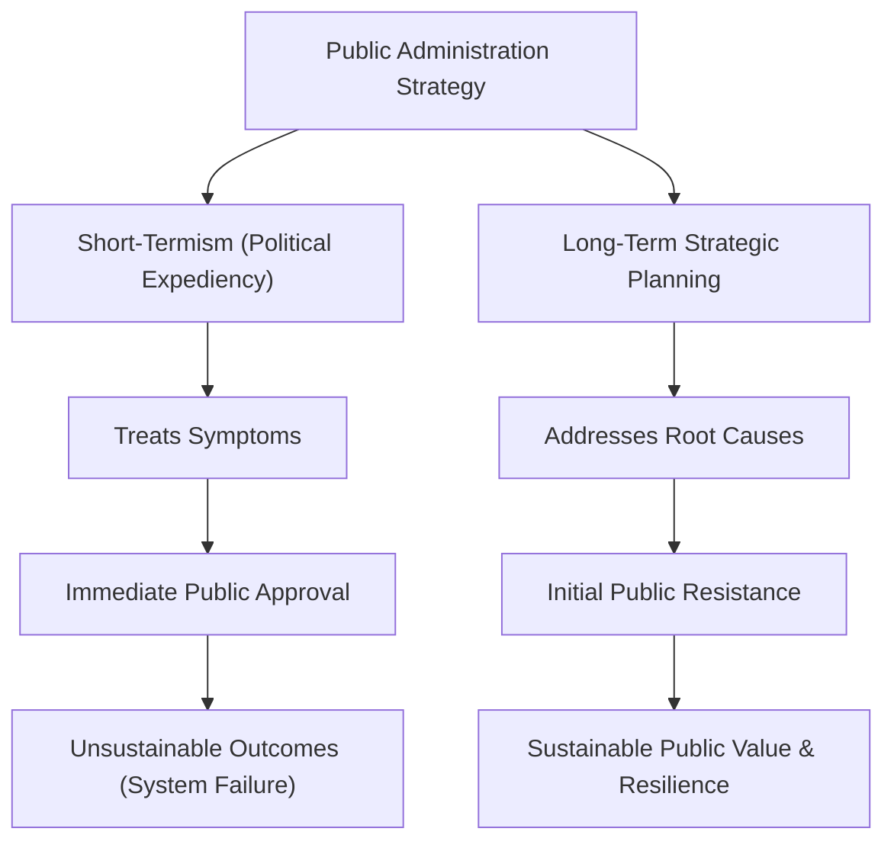

# The Two Mayors (អភិបាលក្រុងទាំងពីរ)

**Author:** ichamrong  
**Date:** 2026-05-26  
**Tags:** #strategic-planning #short-termism #sustainability #infrastructure #politics  
**Category:** Concepts / Parables  
**Read Time:** ~5 min  

---

## 📌 មាតិកា (Table of Contents)
- [ផ្លូវភក់ជ្រាំ (The Muddy Roads)](#ផ្លូវភក់ជ្រាំ-the-muddy-roads)
- [វិធីសាស្ត្រខុសគ្នា (The Different Approaches)](#វិធីសាស្ត្រខុសគ្នា-the-different-approaches)
- [ការវាយប្រហារនៃព្យុះ (The Storm Strikes)](#ការវាយប្រហារនៃព្យុះ-the-storm-strikes)
- [ការវិភាគទ្រឹស្តី៖ Short-Termism vs. Strategic Planning (Theoretical Breakdown)](#ការវិភាគទ្រឹស្តី-short-termism-vs-strategic-planning-theoretical-breakdown)
- [Related Posts](#related-posts)

---

## ផ្លូវភក់ជ្រាំ (The Muddy Roads)

Two neighboring towns, Eastport and Westville, each elected a new mayor for a five-year term. Both towns suffered from terrible, muddy roads that made travel and trade difficult.

---

## វិធីសាស្ត្រខុសគ្នា (The Different Approaches)

The Mayor of Eastport wanted to be loved by the people immediately. He spent the town's entire budget hiring workers to pave every single road with quick, cheap cobblestones (Short-Term Gains). Within six months, the town looked beautiful. The citizens cheered for him, and he was highly popular.

The Mayor of Westville took a different approach (Long-Term Strategy). He analyzed the town's geography and realized that poor drainage was the root cause of the muddy roads. If he just paved over the mud, the water would destroy the roads in a few years. So, he spent his first three years digging a massive underground sewer and drainage system. During this time, the roads remained muddy, and the citizens complained bitterly. His approval ratings plummeted. It was only in his fourth year that he finally began paving the roads with durable, heavy stone.

---

## ការវាយប្រហារនៃព្យុះ (The Storm Strikes)

In the fifth year, a terrible storm hit both towns. 

In Eastport, the water had nowhere to go. It rushed over the cheap cobblestones, washing them away and turning the roads back into rivers of mud. The citizens realized their Mayor had sold them a quick illusion, and they voted him out in anger.

In Westville, the storm water drained perfectly through the new sewer system. The heavy stone roads remained completely dry and intact. The citizens finally understood the wisdom of their Mayor's long-term planning, and he was re-elected in a landslide.

---

(The Khmer translation follows below for the entire story.)

ទីក្រុងជិតខាងគ្នាពីរ គឺអ៊ីសផត (Eastport) និងវេសវីល (Westville) បានបោះឆ្នោតជ្រើសរើសអភិបាលក្រុងថ្មីម្នាក់រៀងៗខ្លួន សម្រាប់អាណត្តិប្រាំឆ្នាំ។ ទីក្រុងទាំងពីររងទុក្ខដោយសារផ្លូវមានភក់ជ្រាំយ៉ាងអាក្រក់ ដែលធ្វើឱ្យការធ្វើដំណើរ និងការដោះដូរពាណិជ្ជកម្មមានការលំបាក។

អភិបាលក្រុងអ៊ីសផតចង់ឱ្យប្រជាជនស្រឡាញ់ខ្លួនភ្លាមៗ។ គាត់បានចំណាយថវិកាទាំងស្រុងរបស់ទីក្រុង ជួលកម្មករឱ្យក្រាលថ្មសំប៉ែតថោកៗយ៉ាងលឿនលើផ្លូវគ្រប់ខ្សែ (Short-Term Gains)។ ក្នុងរយៈពេលប្រាំមួយខែ ទីក្រុងមើលទៅស្រស់ស្អាត។ ប្រជាពលរដ្ឋបានស្រែកហ៊ោអបអរគាត់ ហើយគាត់ទទួលបានប្រជាប្រិយភាពយ៉ាងខ្លាំង។

អភិបាលក្រុងវេសវីលបានអនុវត្តវិធីសាស្ត្រផ្សេង (Long-Term Strategy)។ គាត់បានវិភាគភូមិសាស្ត្រទីក្រុង ហើយដឹងថាប្រព័ន្ធបង្ហូរទឹកមិនល្អ គឺជាមូលហេតុឫសគល់នៃផ្លូវភក់ជ្រាំ។ ប្រសិនបើគាត់គ្រាន់តែក្រាលថ្មពីលើភក់ នោះទឹកនឹងបំផ្លាញផ្លូវក្នុងរយៈពេលពីរបីឆ្នាំមិនខាន។ ដូច្នេះ គាត់បានចំណាយពេលបីឆ្នាំដំបូងរបស់គាត់ ជីកប្រព័ន្ធលូ និងប្រព័ន្ធបង្ហូរទឹកក្រោមដីដ៏ធំមួយ។ ក្នុងអំឡុងពេលនេះ ផ្លូវនៅតែមានភក់ជ្រាំដដែល ហើយប្រជាពលរដ្ឋបានរអ៊ូរទាំយ៉ាងខ្លាំង។ អត្រាគាំទ្ររបស់គាត់បានធ្លាក់ចុះយ៉ាងខ្លាំង។ លុះដល់ឆ្នាំទីបួន ទើបគាត់ចាប់ផ្តើមក្រាលផ្លូវដោយប្រើថ្មធ្ងន់ និងរឹងមាំជាប់បានយូរ។

នៅឆ្នាំទីប្រាំ មានព្យុះដ៏កាចសាហាវមួយបានវាយប្រហារទីក្រុងទាំងពីរ។

នៅអ៊ីសផត ទឹកគ្មានកន្លែងហូរចេញទេ។ វាបានហូរបុកកាត់ថ្មសំប៉ែតថោកៗនោះ ដោយកួចយកវាទៅបាត់ និងធ្វើឱ្យផ្លូវប្រែទៅជាទន្លេភក់វិញ។ ប្រជាពលរដ្ឋបានដឹងថា អភិបាលក្រុងរបស់ពួកគេបានលក់ការបំភាន់ភ្នែកយ៉ាងរហ័សឱ្យពួកគេ ហើយពួកគេបានបោះឆ្នោតទម្លាក់គាត់ដោយក្តីខឹងសម្បារ។

នៅវេសវីល ទឹកភ្លៀងពីព្យុះបានហូរយ៉ាងល្អឥតខ្ចោះតាមរយៈប្រព័ន្ធលូថ្មី។ ផ្លូវថ្មដ៏ធ្ងន់នៅតែស្ងួត និងមិនខូចខាតអ្វីទាំងអស់។ ទីបំផុត ប្រជាពលរដ្ឋបានយល់ពីគតិបណ្ឌិតនៃការធ្វើផែនការរយៈពេលវែងរបស់អភិបាលក្រុងពួកគេ ហើយគាត់ត្រូវបានបោះឆ្នោតជ្រើសរើសជាថ្មីដោយសំឡេងគាំទ្រយ៉ាងច្រើនសន្ធឹកសន្ធាប់។

---

## ការវិភាគទ្រឹស្តី៖ Short-Termism vs. Strategic Planning (Theoretical Breakdown)

This parable illustrates the fundamental tension in public administration between **Political Expediency (Short-Termism)** and **Sustainable Strategic Planning**. 

Elected officials operate on short election cycles (e.g., 4 or 5 years) and are highly incentivized to deliver visible, immediate results to secure re-election. However, complex public infrastructure and systemic reforms often require long-term investment where the benefits won't be visible until long after the politician's term ends.

### Key Takeaways for Public Administration:
1. **Root Cause Analysis:** Good administration treats the disease (poor drainage), not just the symptom (muddy roads).
2. **The Political Courage of Delay:** True leadership in the public sector often requires enduring short-term unpopularity to secure long-term public value.
3. **Sustainable Infrastructure:** Using cheap materials or bypassing necessary foundational work (like the sewers) represents a false economy. It costs the taxpayers more in the long run when the infrastructure inevitably fails.

---

## Related Posts

- **[Strategic Planning in the Public Sector](../../../../colleges/robert-kennedy-college/mba-public-administration/strategic-leadership/01-strategic-planning-in-the-public-sector.md)** — Explore how governments combat short-termism and use tools like PESTLE and Scenario Planning.

---

*Last updated: 2026-05-26*
