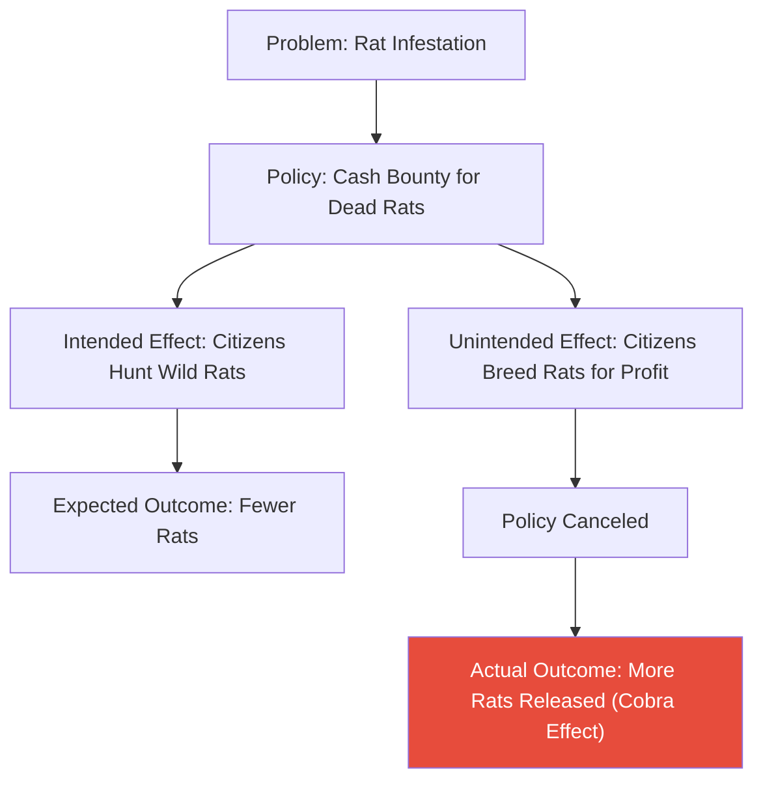

# The Unintended Law (ច្បាប់ដែលមិនបានព្រាងទុក)

**Author:** ichamrong  
**Date:** 2026-05-26  
**Tags:** #public-policy #unintended-consequences #systems-thinking #regulation #economics  
**Category:** Concepts / Parables  
**Read Time:** ~5 min  

---

## 📌 មាតិកា (Table of Contents)
- [បញ្ហាកណ្តុរ (The Rat Problem)](#បញ្ហាកណ្តុរ-the-rat-problem)
- [គោលនយោបាយផ្តល់រង្វាន់ (The Reward Policy)](#គោលនយោបាយផ្តល់រង្វាន់-the-reward-policy)
- [លទ្ធផលដែលមិននឹកស្មានដល់ (The Unexpected Outcome)](#លទ្ធផលដែលមិននឹកស្មានដល់-the-unexpected-outcome)
- [ការវិភាគទ្រឹស្តី៖ Unintended Consequences (Theoretical Breakdown)](#ការវិភាគទ្រឹស្តី-unintended-consequences-theoretical-breakdown)
- [Related Posts](#related-posts)

---

## បញ្ហាកណ្តុរ (The Rat Problem)

In a bustling colonial city, the rapid growth of trade brought an unexpected and dangerous problem: a massive infestation of rats. The rats ate the grain stored in the warehouses and spread disease among the citizens. The Governor, desperate to solve the crisis and protect public health, consulted his advisors to draft a new policy.

---

## គោលនយោបាយផ្តល់រង្វាន់ (The Reward Policy)

Seeking a quick and efficient solution, the Governor enacted "The Rat Bounty Law" (Policy Formulation). The government promised to pay one silver coin for every dead rat a citizen brought to the city hall. The logic was simple: incentivize the public to hunt the rats, and the city would soon be clean.

At first, the policy seemed like a brilliant success. Thousands of dead rats were turned in every week, and the government proudly paid out the silver coins, believing they were winning the war against the infestation.

---

## លទ្ធផលដែលមិននឹកស្មានដល់ (The Unexpected Outcome)

However, after a year, the Governor noticed something alarming. The treasury was almost empty from paying the bounties, yet the number of rats in the streets seemed higher than ever. 

He sent his inspectors to investigate. What they found shocked him. The citizens, acting entirely rationally based on the financial incentive provided by the law, had stopped hunting wild rats. Instead, they had started secretly breeding rats in their basements to kill and sell to the government for a guaranteed income (Feedback Loop).

Realizing his mistake, the Governor immediately canceled the bounty program. The citizens, now stuck with thousands of worthless rats they had been breeding, simply opened their cages and released them into the streets. The city ended up with a far worse rat infestation than before the law was passed.

---

(The Khmer translation follows below for the entire story.)

នៅក្នុងទីក្រុងអាណានិគមដ៏អ៊ូអរមួយ កំណើនពាណិជ្ជកម្មយ៉ាងឆាប់រហ័សបាននាំមកនូវបញ្ហាដែលមិននឹកស្មានដល់ និងប្រកបដោយគ្រោះថ្នាក់មួយ៖ គឺការកើនឡើងយ៉ាងខ្លាំងនៃសត្វកណ្តុរ។ កណ្តុរទាំងនោះបានស៊ីគ្រាប់ធញ្ញជាតិដែលរក្សាទុកក្នុងឃ្លាំង និងចម្លងជំងឺដល់ប្រជាពលរដ្ឋ។ ដោយចង់ដោះស្រាយវិបត្តិនេះជាបន្ទាន់ និងការពារសុខភាពសាធារណៈ អភិបាលខេត្តបានប្រឹក្សាជាមួយទីប្រឹក្សារបស់គាត់ដើម្បីព្រាងគោលនយោបាយថ្មីមួយ។

ដើម្បីស្វែងរកដំណោះស្រាយរហ័ស និងមានប្រសិទ្ធភាព អភិបាលខេត្តបានអនុម័ត "ច្បាប់ផ្តល់ប្រាក់រង្វាន់សម្លាប់កណ្តុរ" (Policy Formulation)។ រដ្ឋាភិបាលបានសន្យាថានឹងផ្តល់ប្រាក់កាក់ប្រាក់មួយសេន សម្រាប់កណ្តុរងាប់មួយក្បាលដែលប្រជាពលរដ្ឋនាំយកមកសាលាក្រុង។ ហេតុផលគឺសាមញ្ញ៖ ផ្តល់ការលើកទឹកចិត្តដល់សាធារណជនឱ្យតាមប្រមាញ់កណ្តុរ ហើយទីក្រុងនឹងស្អាតជាមិនខាន។

ដំបូងឡើយ គោលនយោបាយនេះហាក់ដូចជាទទួលបានជោគជ័យយ៉ាងត្រចះត្រចង់។ កណ្តុរងាប់រាប់ពាន់ក្បាលត្រូវបានគេយកមកប្តូរយករង្វាន់ជារៀងរាល់សប្តាហ៍ ហើយរដ្ឋាភិបាលបានបើកប្រាក់កាក់យ៉ាងមានមោទនភាព ដោយជឿថាពួកគេកំពុងឈ្នះសង្គ្រាមប្រឆាំងនឹងសត្វកណ្តុរទាំងនោះ។

ទោះជាយ៉ាងណាក៏ដោយ មួយឆ្នាំក្រោយមក អភិបាលខេត្តបានកត់សម្គាល់ឃើញរឿងគួរឱ្យព្រួយបារម្ភមួយ។ ឃ្លាំងរតនាគារស្ទើរតែទទេស្អាតដោយសារការបើកប្រាក់រង្វាន់ ប៉ុន្តែចំនួនកណ្តុរតាមដងផ្លូវហាក់ដូចជាមានច្រើនជាងមុនទៅទៀត។

គាត់បានបញ្ជូនអធិការរបស់គាត់ឱ្យទៅស៊ើបអង្កេត។ អ្វីដែលពួកគេបានរកឃើញធ្វើឱ្យគាត់រន្ធត់ចិត្តយ៉ាងខ្លាំង។ ប្រជាពលរដ្ឋ ដោយធ្វើសកម្មភាពដោយផ្អែកលើការលើកទឹកចិត្តផ្នែកហិរញ្ញវត្ថុដែលផ្តល់ដោយច្បាប់នោះ បានឈប់តាមប្រមាញ់កណ្តុរព្រៃហើយ។ ផ្ទុយទៅវិញ ពួកគេចាប់ផ្តើមលួចចិញ្ចឹមកណ្តុរនៅក្នុងបន្ទប់ក្រោមដីរបស់ពួកគេ ដើម្បីសម្លាប់ និងលក់ឱ្យរដ្ឋាភិបាលសម្រាប់ប្រាក់ចំណូលដែលធានាបាន (Feedback Loop)។

ដោយដឹងពីកំហុសរបស់ខ្លួន អភិបាលខេត្តបានលុបចោលកម្មវិធីផ្តល់ប្រាក់រង្វាន់នោះភ្លាមៗ។ ប្រជាពលរដ្ឋដែលពេលនេះសល់កណ្តុររាប់ពាន់ក្បាលដែលគ្មានតម្លៃក្នុងដៃ គ្រាន់តែបើកទ្រុង ហើយលែងពួកវាចូលទៅក្នុងផ្លូវ។ ទីបំផុត ទីក្រុងត្រូវប្រឈមមុខនឹងបញ្ហាកណ្តុររាតត្បាតកាន់តែអាក្រក់ជាងមុនពេលដែលច្បាប់នេះត្រូវបានអនុម័តទៅទៀត។

---

## ការវិភាគទ្រឹស្តី៖ Unintended Consequences (Theoretical Breakdown)

This parable perfectly illustrates the **Law of Unintended Consequences**, specifically known in economics and public policy as the **Cobra Effect** (named after a real historical incident in British India involving cobras instead of rats).

In Public Policy, a law is an intervention into a complex system. When policymakers focus only on the immediate logic of their actions without considering how human behavior will adapt to the new incentives, the policy often exacerbates the exact problem it was meant to solve.

### Key Takeaways for Public Administration:
1. **Systems Thinking:** Administrators must look beyond linear cause-and-effect. They must anticipate the "Feedback Loops" their policies will create.
2. **The Danger of Misaligned Incentives:** If you pay for an output (dead rats) rather than an outcome (a rat-free city), you will simply get more of the output, regardless of how it is produced.
3. **Policy Evaluation:** Constant, rigorous evaluation of a policy's real-world impact is necessary to catch and correct perverse incentives before they drain the public budget.

---

## Related Posts

- **[Introduction to Public Policy](../../../../colleges/robert-kennedy-college/mba-public-administration/public-policy/01-introduction-to-public-policy.md)** — Explore the policy lifecycle, systems thinking, and how administrators evaluate the true impact of legislation.

---

*Last updated: 2026-05-26*
