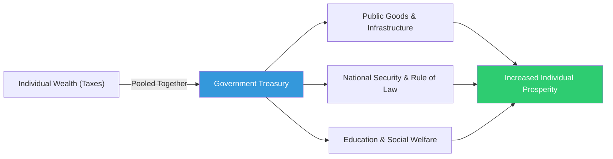

# The Wise Tax Collector (អ្នកប្រមូលពន្ធដ៏ឈ្លាសវៃ)

**Author:** ichamrong  
**Date:** 2026-05-26  
**Tags:** #public-finance #taxation #public-goods #civic-duty #social-contract  
**Category:** Concepts / Parables  
**Read Time:** ~5 min  

---

## 📌 មាតិកា (Table of Contents)
- [សេចក្តីក្រោធរបស់អ្នកភូមិ (The Villagers' Anger)](#សេចក្តីក្រោធរបស់អ្នកភូមិ-the-villagers-anger)
- [មេរៀននៃការរួមចំណែក (The Lesson of Contribution)](#មេរៀននៃការរួមចំណែក-the-lesson-of-contribution)
- [ការយល់ដឹងពីកាតព្វកិច្ច (Understanding the Duty)](#ការយល់ដឹងពីកាតព្វកិច្ច-understanding-the-duty)
- [ការវិភាគទ្រឹស្តី៖ Taxation and the Social Contract (Theoretical Breakdown)](#ការវិភាគទ្រឹស្តី-taxation-and-the-social-contract-theoretical-breakdown)
- [Related Posts](#related-posts)

---

## សេចក្តីក្រោធរបស់អ្នកភូមិ (The Villagers' Anger)

In a remote province, the citizens were angry. A new Tax Collector had been appointed, and he traveled from house to house collecting a portion of the autumn harvest. The farmers cursed him, calling him a thief who took their hard-earned grain without providing anything in return. 

One day, an angry mob gathered in the village square, refusing to hand over their grain. "We worked the soil! We planted the seeds! Why should the government take what is ours?" their leader shouted.

---

## មេរៀននៃការរួមចំណែក (The Lesson of Contribution)

The Tax Collector, instead of calling the guards, remained calm. He pointed to the thick stone wall surrounding the village. "Who built that wall?" he asked. 
"Our grandfathers did," the leader replied proudly.
"And how did they find the time to build it while farming?" the Collector asked. "They didn't. They each gave one bag of grain to hire skilled masons to build it. That wall keeps the wolves and bandits away so you can sleep safely."

He then pointed to the paved road leading to the city market. "Who built that road? You use it every day to sell your crops faster than before."
The villagers were silent. 
"You cannot build a road by yourself," the Collector explained (Public Goods). "You cannot defend the village by yourself. Taxation is not theft. It is the price you pay for civilization. It is your grain pooled together to build things that are too massive for any single family to build alone."

---

## ការយល់ដឹងពីកាតព្វកិច្ច (Understanding the Duty)

The Collector then opened his heavy ledger. "However, the contract goes both ways," he said firmly. "I am taking your grain today. In return, I will show you exactly how many bags are used to hire the school teacher, how many go to the road builders, and how many go to the guards. If I fail to provide these things, you have the right to demand a new Collector."

Hearing this, the villagers slowly lowered their pitchforks. They realized that their individual prosperity relied heavily on the shared infrastructure of the community. They handed over their grain, not as victims of theft, but as investors in their own future.

---

(The Khmer translation follows below for the entire story.)

នៅក្នុងខេត្តដាច់ស្រយាលមួយ ប្រជាពលរដ្ឋមានការខឹងសម្បារយ៉ាងខ្លាំង។ អ្នកប្រមូលពន្ធថ្មីម្នាក់ត្រូវបានតែងតាំង ហើយគាត់បានធ្វើដំណើរពីផ្ទះមួយទៅផ្ទះមួយ ដើម្បីប្រមូលចំណែកនៃការប្រមូលផលរដូវស្លឹកឈើជ្រុះ។ កសិករបានជេរប្រទេចគាត់ ដោយហៅគាត់ថាជាចោរដែលយកស្រូវដែលពួកគេខំរកបានដោយលំបាក ដោយមិនបានផ្តល់អ្វីមកវិញសោះ។

ថ្ងៃមួយ ហ្វូងមនុស្សដ៏ខឹងសម្បារបានប្រមូលផ្តុំគ្នានៅទីធ្លាភូមិ ដោយបដិសេធមិនព្រមប្រគល់ស្រូវរបស់ពួកគេទេ។ មេដឹកនាំរបស់ពួកគេបានស្រែកថា "យើងជាអ្នកភ្ជួររាស់ដី! យើងជាអ្នកដាំគ្រាប់ពូជ! ហេតុអ្វីបានជារដ្ឋាភិបាលត្រូវយកអ្វីដែលជារបស់យើង?"

អ្នកប្រមូលពន្ធ ជំនួសឱ្យការហៅឆ្មាំមក គាត់បែរជានៅស្ងៀម។ គាត់បានចង្អុលទៅជញ្ជាំងថ្មដ៏ក្រាស់ដែលព័ទ្ធជុំវិញភូមិ។ គាត់សួរថា "តើនរណាជាអ្នកសាងសង់ជញ្ជាំងនោះ?"
មេដឹកនាំឆ្លើយដោយមោទនភាពថា "ជីតារបស់យើងជាអ្នកសាងសង់"។
អ្នកប្រមូលពន្ធសួរទៀតថា "ចុះតើពួកគេមានពេលឯណាសាងសង់វា ស្របពេលដែលពួកគេកំពុងធ្វើស្រែចម្ការនោះ? ពួកគេមិនមានពេលទេ។ ពួកគេម្នាក់ៗបានបរិច្ចាគស្រូវមួយការុងដើម្បីជួលជាងសំណង់ជំនាញឱ្យសាងសង់វា។ ជញ្ជាំងនោះហើយដែលការពារសត្វចចក និងចោរប្លន់ ទើបអ្នកអាចដេកលក់យ៉ាងមានសុវត្ថិភាព"។

បន្ទាប់មកគាត់បានចង្អុលទៅផ្លូវក្រាលកៅស៊ូដែលនាំទៅកាន់ទីផ្សារទីក្រុង។ "តើនរណាជាអ្នកសាងសង់ផ្លូវនោះ? អ្នកប្រើប្រាស់វាជារៀងរាល់ថ្ងៃដើម្បីលក់កសិផលរបស់អ្នកបានលឿនជាងមុន"។
អ្នកភូមិស្ងាត់មាត់ឈឹង។
អ្នកប្រមូលពន្ធបានពន្យល់ថា "អ្នកមិនអាចសាងសង់ផ្លូវដោយខ្លួនឯងបានទេ (Public Goods)។ អ្នកមិនអាចការពារភូមិដោយខ្លួនឯងបានទេ។ ការយកពន្ធមិនមែនជាការលួចប្លន់ទេ។ វាគឺជាតម្លៃដែលអ្នកត្រូវបង់សម្រាប់អរិយធម៌។ វាគឺជាការប្រមូលផ្តុំស្រូវរបស់អ្នកដើម្បីសាងសង់អ្វីៗដែលធំធេងពេក ដែលគ្រួសារតែមួយមិនអាចសាងសង់តែឯងបាន"។

បន្ទាប់មក អ្នកប្រមូលពន្ធបានបើកសៀវភៅបញ្ជីដ៏ក្រាស់របស់គាត់។ គាត់និយាយយ៉ាងម៉ឺងម៉ាត់ថា "ទោះជាយ៉ាងណាក៏ដោយ កិច្ចសន្យាត្រូវតែមានទាំងសងខាង។ ថ្ងៃនេះខ្ញុំយកស្រូវរបស់អ្នក។ ជាការតបស្នង ខ្ញុំនឹងបង្ហាញអ្នកឱ្យឃើញច្បាស់ថា តើស្រូវប៉ុន្មានការុងត្រូវបានប្រើប្រាស់ដើម្បីជួលគ្រូបង្រៀន ប៉ុន្មានសម្រាប់អ្នកសាងសង់ផ្លូវ និងប៉ុន្មានសម្រាប់ក្រុមឆ្មាំ។ ប្រសិនបើខ្ញុំមិនអាចផ្តល់របស់ទាំងនេះបានទេ អ្នកមានសិទ្ធិទាមទារអ្នកប្រមូលពន្ធថ្មីម្នាក់"។

ពេលឮដូច្នេះ អ្នកភូមិក៏ទម្លាក់ឧបករណ៍របស់ពួកគេចុះយឺតៗ។ ពួកគេបានដឹងថា ភាពរុងរឿងផ្ទាល់ខ្លួនរបស់ពួកគេគឺពឹងផ្អែកយ៉ាងខ្លាំងទៅលើហេដ្ឋារចនាសម្ព័ន្ធរួមរបស់សហគមន៍។ ពួកគេបានប្រគល់ស្រូវរបស់ពួកគេ មិនមែនក្នុងនាមជាជនរងគ្រោះនៃការលួចប្លន់នោះទេ ប៉ុន្តែក្នុងនាមជាអ្នកវិនិយោគសម្រាប់អនាគតរបស់ពួកគេផ្ទាល់។

---

## ការវិភាគទ្រឹស្តី៖ Taxation and the Social Contract (Theoretical Breakdown)

This parable illustrates the fundamental premise of **Public Financial Management** and the **Social Contract**: Taxation is the mechanism through which individuals fund the collective infrastructure necessary for a functioning society.

In Public Economics, a free market is highly efficient at providing private goods (like food or clothing) but fails to provide **Public Goods** (like roads, defense, or clean air) because individuals cannot easily be excluded from using them once built. Without taxation, everyone waits for someone else to pay for the road (the "free-rider problem"), and the road never gets built.

### Key Takeaways for Public Administration:
1. **The Justification for Tax:** Administrators must clearly articulate the link between the taxes collected and the services delivered. When citizens see the value, compliance increases.
2. **Accountability:** Taxation without transparency feels like theft. The tax collector must maintain open ledgers, proving that the funds are genuinely used for the public good and not lost to corruption.
3. **The Cycle of Prosperity:** Effective public spending on infrastructure and education acts as a multiplier, ultimately increasing the wealth of the individual taxpayers who funded it.

---

## Related Posts

- **[Public Financial Management](../../../../colleges/robert-kennedy-college/mba-public-administration/public-finance/01-public-financial-management.md)** — Learn about progressive vs. regressive taxation, public budgeting, and government debt.

---

*Last updated: 2026-05-26*
