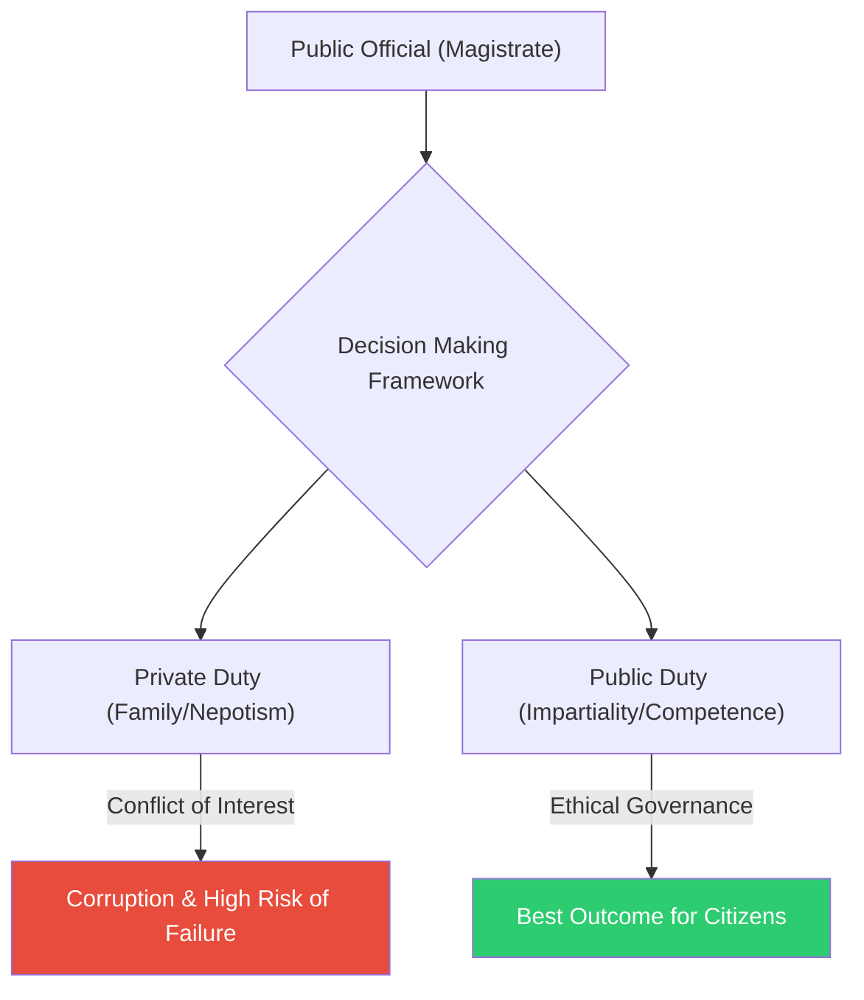

# The Magistrate's Nephew (ក្មួយប្រុសរបស់ចៅក្រម)

**Author:** ichamrong  
**Date:** 2026-05-26  
**Tags:** #public-sector-ethics #conflict-of-interest #nepotism #impartiality #governance  
**Category:** Concepts / Parables  
**Read Time:** ~5 min  

---

## 📌 មាតិកា (Table of Contents)
- [បញ្ហានៃការជ្រើសរើស (The Hiring Dilemma)](#បញ្ហានៃការជ្រើសរើស-the-hiring-dilemma)
- [សេចក្តីសម្រេចចិត្តដ៏លំបាក (The Hard Decision)](#សេចក្តីសម្រេចចិត្តដ៏លំបាក-the-hard-decision)
- [មេរៀននៃភាពមិនលម្អៀង (The Lesson of Impartiality)](#មេរៀននៃភាពមិនលម្អៀង-the-lesson-of-impartiality)
- [ការវិភាគទ្រឹស្តី៖ Conflict of Interest (Theoretical Breakdown)](#ការវិភាគទ្រឹស្តី-conflict-of-interest-theoretical-breakdown)
- [Related Posts](#related-posts)

---

## បញ្ហានៃការជ្រើសរើស (The Hiring Dilemma)

A highly respected Chief Magistrate was responsible for hiring the master architect to build the city's new aqueduct. The project was massive and would ensure clean water for thousands of citizens. Two candidates applied for the position. 

The first candidate was the Magistrate's own nephew, a young and talented builder who had recently completed his studies. The second candidate was a foreigner from a distant province, an older man with a proven track record of building complex water systems.

The Magistrate's sister visited him privately. "You must hire my son," she pleaded. "He is family. It is our duty to protect and promote our own blood. If you give him this project, our family will gain great honor and wealth."

---

## សេចក្តីសម្រេចចិត្តដ៏លំបាក (The Hard Decision)

The Magistrate loved his nephew dearly, and he knew the young man was capable. However, he also knew that the foreigner had ten more years of practical experience. 

The next day, the Magistrate gathered the city council. "I have reviewed both candidates," he announced. "The foreigner is more experienced and is the safest choice for the city's water supply. Therefore, I award the contract to him."

His sister was furious. She accused him of betraying his own blood and turning his back on his family. For months, she refused to speak to him.

---

## មេរៀននៃភាពមិនលម្អៀង (The Lesson of Impartiality)

Years later, a terrible earthquake shook the region. Many buildings collapsed, but the new aqueduct, built with the deep expertise of the foreign architect, remained standing. The city continued to have clean water, preventing a deadly plague from spreading through the ruins. 

The Magistrate visited his sister. "If I had hired your son," he explained gently, "he might have succeeded. But what if he had failed? What if his lack of experience caused the aqueduct to collapse during the earthquake? Thousands would have died, and our family name would be cursed forever."

He continued, "When I wear the robes of a Magistrate, I am no longer just a brother or an uncle. I am the servant of the city. A public servant who chooses family over competence steals from the people."

---

(The Khmer translation follows below for the entire story.)

ចៅក្រមកំពូលដ៏គួរឱ្យគោរពម្នាក់ ទទួលបន្ទុកក្នុងការជ្រើសរើសស្ថាបត្យករជំនាញ ដើម្បីសាងសង់ប្រព័ន្ធផ្លូវទឹកថ្មីរបស់ទីក្រុង។ គម្រោងនេះមានទំហំធំធេងណាស់ ហើយនឹងធានាបាននូវទឹកស្អាតសម្រាប់ប្រជាពលរដ្ឋរាប់ពាន់នាក់។ មានបេក្ខជនពីរនាក់បានដាក់ពាក្យសុំការងារនេះ។

បេក្ខជនទីមួយ គឺជាក្មួយប្រុសបង្កើតរបស់ចៅក្រមផ្ទាល់ ដែលជាអ្នកសាងសង់វ័យក្មេង និងមានទេពកោសល្យ ដែលទើបតែបញ្ចប់ការសិក្សា។ បេក្ខជនទីពីរ គឺជាជនបរទេសមកពីខេត្តដ៏ឆ្ងាយមួយ ដែលជាបុរសចំណាស់មានស្នាដៃ និងបទពិសោធន៍ច្បាស់លាស់ក្នុងការសាងសង់ប្រព័ន្ធទឹកដ៏ស្មុគស្មាញ។

ប្អូនស្រីរបស់ចៅក្រមបានមកជួបគាត់ជាលក្ខណៈឯកជន។ នាងបានអង្វរថា "បងត្រូវតែជួលកូនប្រុសរបស់ខ្ញុំ។ គេគឺជាសាច់ញាតិ។ វាគឺជាកាតព្វកិច្ចរបស់យើងក្នុងការការពារ និងលើកស្ទួយសាច់ឈាមរបស់យើង។ ប្រសិនបើបងផ្តល់គម្រោងនេះដល់គេ គ្រួសាររបស់យើងនឹងទទួលបានកិត្តិយស និងទ្រព្យសម្បត្តិយ៉ាងច្រើន"។

ចៅក្រមស្រឡាញ់ក្មួយប្រុសរបស់គាត់ខ្លាំងណាស់ ហើយគាត់ដឹងថាយុវជននោះពិតជាមានសមត្ថភាព។ ទោះជាយ៉ាងណាក៏ដោយ គាត់ក៏ដឹងដែរថា ជនបរទេសនោះមានបទពិសោធន៍ជាក់ស្តែងច្រើនជាងដប់ឆ្នាំ។

នៅថ្ងៃបន្ទាប់ ចៅក្រមបានកោះប្រជុំក្រុមប្រឹក្សាទីក្រុង។ គាត់បានប្រកាសថា "ខ្ញុំបានពិនិត្យមើលបេក្ខជនទាំងពីរនាក់ហើយ។ ជនបរទេសមានបទពិសោធន៍ច្រើនជាង ហើយគឺជាជម្រើសដែលមានសុវត្ថិភាពបំផុតសម្រាប់ការផ្គត់ផ្គង់ទឹករបស់ទីក្រុងយើង។ ដូច្នេះ ខ្ញុំសម្រេចប្រគល់កិច្ចសន្យានេះទៅឱ្យគាត់"។

ប្អូនស្រីរបស់គាត់មានការខឹងសម្បារយ៉ាងខ្លាំង។ នាងបានចោទប្រកាន់គាត់ថា បានក្បត់សាច់ឈាមខ្លួនឯង និងបែរខ្នងដាក់គ្រួសារ។ អស់រយៈពេលជាច្រើនខែ នាងបដិសេធមិននិយាយរកគាត់សោះ។

ជាច្រើនឆ្នាំក្រោយមក មានការរញ្ជួយដីយ៉ាងខ្លាំងមួយបានវាយប្រហារតំបន់នោះ។ អគារជាច្រើនបានដួលរលំ ប៉ុន្តែប្រព័ន្ធផ្លូវទឹកថ្មី ដែលសាងសង់ឡើងដោយអ្នកជំនាញជ្រៅជ្រះរបស់ស្ថាបត្យករបរទេស នៅតែឈររឹងមាំដដែល។ ទីក្រុងនៅតែបន្តមានទឹកស្អាតប្រើប្រាស់ ដែលជួយទប់ស្កាត់ជំងឺរាតត្បាតដ៏កាចសាហាវមិនឱ្យរីករាលដាលតាមគំនរបាក់បែក។

ចៅក្រមបានទៅសួរសុខទុក្ខប្អូនស្រីរបស់គាត់។ គាត់បានពន្យល់យ៉ាងទន់ភ្លន់ថា "ប្រសិនបើបងជួលកូនប្រុសរបស់ឯង គេក៏ប្រហែលជាអាចធ្វើបានជោគជ័យដែរ។ ប៉ុន្តែចុះបើគេបរាជ័យវិញ? ចុះបើការខ្វះបទពិសោធន៍របស់គេ ធ្វើឱ្យប្រព័ន្ធទឹកនោះដួលរលំក្នុងពេលរញ្ជួយដី? មនុស្សរាប់ពាន់នាក់នឹងត្រូវស្លាប់ ហើយឈ្មោះគ្រួសាររបស់យើងនឹងត្រូវគេដាក់បណ្តាសាជារៀងរហូត"។

គាត់បន្តទៀតថា "នៅពេលដែលបងស្លៀកសម្លៀកបំពាក់ជាចៅក្រម បងលែងត្រឹមតែជាបងប្រុស ឬជាពូទៀតហើយ។ បងគឺជាអ្នកបម្រើទីក្រុង។ អ្នកបម្រើសាធារណៈណា ដែលជ្រើសរើសយកគ្រួសារធំជាងសមត្ថភាព គឺជាការលួចប្លន់ពីប្រជាជនហើយ"។

---

## ការវិភាគទ្រឹស្តី៖ Conflict of Interest (Theoretical Breakdown)

This parable illustrates the core ethical dilemma in public administration: **Conflict of Interest** and **Nepotism**. 

In private life, loyalty to one's family is a virtue. However, in the public sector, it becomes a severe liability. Public administrators are entrusted with state resources and power. If they use that power to benefit themselves or their relatives rather than the public good, they violate the fundamental social contract.

### Key Takeaways for Public Administration:
1. **The Burden of Impartiality:** Civil servants must make decisions based strictly on objective criteria (e.g., the architect with the most experience), ignoring personal relationships.
2. **The Appearance of Corruption:** Even if the nephew was perfectly qualified and built a good aqueduct, hiring him would still damage public trust. Citizens would assume the process was rigged. Therefore, administrators must often **recuse** themselves from decisions involving family.
3. **Meritocracy over Patronage:** A government that hires based on bloodlines (patronage) rather than skill (meritocracy) will inevitably build fragile infrastructure and weak institutions.

---

## Related Posts

- **[Public Sector Ethics](../../../../colleges/robert-kennedy-college/mba-public-administration/ethics/01-public-sector-ethics.md)** — Understand the rules of impartiality, conflict of interest, and why public trust is the currency of government.

---

*Last updated: 2026-05-26*
