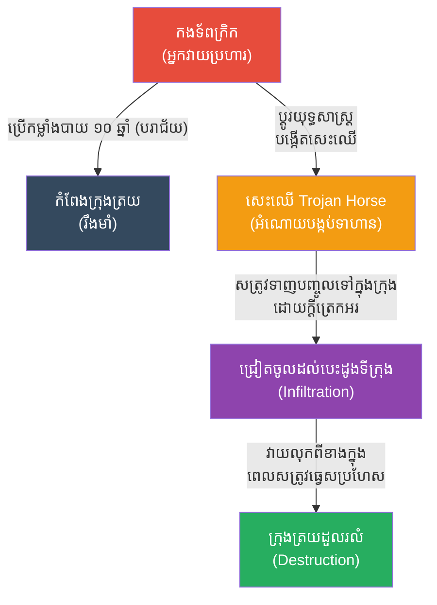

# The Trojan War: The Deceptive Gift (សង្គ្រាមក្រុងត្រយ និងយុទ្ធសាស្ត្រសេះឈើ)

**Author:** ichamrong
**Date:** 2026-05-23
**Tags:** #history #war #strategy #trojan-horse #deception
**Category:** Wars & Histories
**Read Time:** ~10 min

---

## 📌 Table of Contents
- [១. បរិបទនៃសង្គ្រាម (Context of the War)](#១-បរិបទនៃសង្គ្រាម-context-of-the-war)
- [២. យុទ្ធសាស្ត្រ៖ អំណោយបោកប្រាស់ (The Strategy: The Deceptive Gift)](#២-យុទ្ធសាស្ត្រ-អំណោយបោកប្រាស់-the-strategy-the-deceptive-gift)
- [៣. ការប្រើប្រាស់យុទ្ធសាស្ត្រនេះឡើងវិញក្នុងប្រវត្តិសាស្ត្រ (Reused in History)](#៣-ការប្រើប្រាស់យុទ្ធសាស្ត្រនេះឡើងវិញក្នុងប្រវត្តិសាស្ត្រ-reused-in-history)
- [References](#references)

---

## ១. បរិបទនៃសង្គ្រាម (Context of the War)

**សង្គ្រាមក្រុងត្រយ (The Trojan War)** គឺជាសង្គ្រាមដ៏ល្បីល្បាញបំផុតនៅក្នុងទេវកថានិងប្រវត្តិសាស្ត្រក្រិកបុរាណ (កើតឡើងប្រហែល ១២០០ ឆ្នាំមុនគ្រឹស្តសករាជ)។ 
សង្គ្រាមនេះផ្ទុះឡើងនៅពេលដែលព្រះអង្គម្ចាស់ ផារីស (Paris) នៃក្រុងត្រយ បានលួចនាំយកនាង ហេឡែន (Helen) ដែលជាស្ត្រីស្រស់ស្អាតបំផុតក្នុងលោក និងជាមហេសីរបស់ស្តេចក្រិក ចេញពីប្រទេសក្រិក។ ខឹងនឹងទង្វើនេះ កងទ័ពក្រិកជាង ១០០០ សំពៅ បានបើកឆ្ពោះទៅកាន់ក្រុងត្រយដើម្បីសងសឹក។

ទោះជាយ៉ាងណាក៏ដោយ ក្រុងត្រយមានកំពែងខ្ពស់និងរឹងមាំបំផុត។ កងទ័ពក្រិកបានឡោមព័ទ្ធនិងវាយប្រហារទីក្រុងនេះអស់រយៈពេល **១០ ឆ្នាំពេញ** ប៉ុន្តែនៅតែមិនអាចវាយបំបែកកំពែងក្រុងបានឡើយ។

---

## ២. យុទ្ធសាស្ត្រ៖ អំណោយបោកប្រាស់ (The Strategy: The Deceptive Gift)

នៅពេលដែលការប្រើប្រាស់ "កម្លាំងបាយ" ទទួលបរាជ័យ មេទ័ពដ៏ឆ្លាតវៃរបស់ក្រិកឈ្មោះ **អូឌីសៀស (Odysseus)** បានប្តូរមកប្រើ "កលល្បិច" វិញ។

**របៀបដែលយុទ្ធសាស្ត្រនេះដំណើរការ៖**
1. **ការក្លែងបន្លំចុះចាញ់ (Feigned Surrender):** កងទ័ពក្រិកបានធ្វើពុតជាបោះបង់ការវាយប្រហារ រួចដុតជំរុំចោល ហើយបើកសំពៅចេញទៅបាត់ (តែការពិត ពួកគេទៅលាក់ខ្លួននៅកោះក្បែរនោះ)។
2. **អំណោយបោកប្រាស់ (The Gift):** ពួកគេបានបន្សល់ទុកនូវរូបចម្លាក់ "សេះឈើដ៏ធំមួយ (Trojan Horse)" នៅមុខទ្វារក្រុង។ ពួកគេបានឱ្យទាហានម្នាក់នៅចាំប្រាប់ជនជាតិត្រយថា សេះឈើនេះគឺជា "ដង្វាយថ្វាយដល់ព្រះ" ដើម្បីសុំសេចក្តីសុខក្នុងការធ្វើដំណើរត្រលប់ទៅផ្ទះវិញ។
3. **ការជ្រៀតចូល (Infiltration):** ជនជាតិត្រយស្មានថាខ្លួនឈ្នះសង្គ្រាម ក៏បានអូសសេះឈើនោះចូលទៅក្នុងទីក្រុងដើម្បីអបអរសាទរ ដោយមិនដឹងថានៅក្នុងពោះសេះនោះ មានទាហានក្រិកឆ្នើមៗបង្កប់ខ្លួននៅឡើយ។
4. **ការបំផ្លិចបំផ្លាញពីខាងក្នុង (Destruction from Within):** នៅពេលយប់ ពេលដែលអ្នកក្រុងត្រយស្រវឹងនិងដេកលក់ ទាហានក្រិកបានលួចចេញពីពោះសេះ ទៅបើកទ្វារក្រុងឱ្យកងទ័ពធំដែលលួចត្រលប់មកវិញ អូសបន្លាយដល់ការដុតបំផ្លាញទីក្រុងត្រយទាំងស្រុងត្រឹមតែមួយយប់។

---

## ៣. ការប្រើប្រាស់យុទ្ធសាស្ត្រនេះឡើងវិញក្នុងប្រវត្តិសាស្ត្រ (Reused in History)

យុទ្ធសាស្ត្រ "សេះឈើទីក្រុងត្រយ" (The Trojan Horse) ត្រូវបានកត់ត្រាទុកជាយុទ្ធសាស្ត្រសៀតចូល (Infiltration) ដ៏អស្ចារ្យបំផុត ដែលអះអាងថា៖ **"បើអ្នកមិនអាចវាយបំបែកសត្រូវពីខាងក្រៅបានទេ ចូរវាយប្រហារពួកគេពីខាងក្នុង"**។ យុទ្ធសាស្ត្រនេះត្រូវបានគេប្រើប្រាស់ឡើងវិញរាប់មិនអស់ក្នុងប្រវត្តិសាស្ត្រ៖

*   **សង្គ្រាមលោកលើកទី២ (Operation Greif, ១៩៤៤):** មេបញ្ជាការអាល្លឺម៉ង់ Otto Skorzeny បានប្រើប្រាស់ទាហានអាល្លឺម៉ង់ដែលចេះភាសាអង់គ្លេសយ៉ាងស្ទាត់ជំនាញ ឱ្យពាក់ឯកសណ្ឋានជាទាហានអាមេរិក និងបើករថយន្តជីពរបស់អាមេរិក ជ្រៀតចូលទៅក្នុងជួរកងទ័ពសម្ព័ន្ធមិត្ត ដើម្បីបំផ្លាញប្រព័ន្ធទំនាក់ទំនង និងបង្វែរទិសផ្លូវ ដែលធ្វើឱ្យកងទ័ពសម្ព័ន្ធមិត្តវឹកវរយ៉ាងខ្លាំងពីខាងក្នុង។
*   **សង្គ្រាមទំនើប និងសន្តិសុខអ៊ិនធឺណិត (Modern Cyber Warfare):** សព្វថ្ងៃនេះ ពាក្យថា **"Trojan Horse" ឬ "Trojan"** ត្រូវបានប្រើប្រាស់នៅក្នុងវិស័យកុំព្យូទ័រ។ វីរុស Trojan មិនមែនជាការវាយប្រហារទម្លាយប្រព័ន្ធសុវត្ថិភាពដោយកម្លាំងបាយ (Brute Force) នោះទេ ប៉ុន្តែវាបន្លំខ្លួនជាកម្មវិធីស្របច្បាប់ (ដូចជាហ្គេម ឬកម្មវិធីកម្ចាត់វីរុសជាដើម)។ នៅពេលដែលអ្នកប្រើប្រាស់ (User) ចុចដំឡើងកម្មវិធីនោះដោយក្តីត្រេកអរ វីរុសនឹងជ្រៀតចូលទៅគ្រប់គ្រងប្រព័ន្ធពីខាងក្នុង និងលួចទិន្នន័យសំខាន់ៗ។
*   **ការធ្វើឃាតអូសាម៉ា ប៊ីនឡាដិន (CIA Fake Vaccination Program):** ទីភ្នាក់ងារស៊ើបអង្កេតអាមេរិក (CIA) ធ្លាប់បានបង្កើត "កម្មវិធីចាក់វ៉ាក់សាំងក្លែងក្លាយ" ដោយប្រើប្រាស់គ្រូពេទ្យក្នុងស្រុក ដើរចាក់វ៉ាក់សាំងដល់កុមារនៅប្រទេសប៉ាគីស្ថាន ដើម្បីប្រមូលសំណាក DNA ពីខាងក្នុងភូមិគ្រឹះ ឈានទៅដល់ការរកឃើញកន្លែងលាក់ខ្លួនពិតប្រាកដរបស់ អូសាម៉ា ប៊ីនឡាដិន។

---

## References

*   **The Iliad and The Odyssey by Homer** — The ancient Greek epic poems detailing the siege of Troy and the famous strategy.
*   **The Aeneid by Virgil** — The Roman epic that provides the most detailed surviving account of the Trojan Horse infiltration.

---

*Last updated: 2026-05-23*
